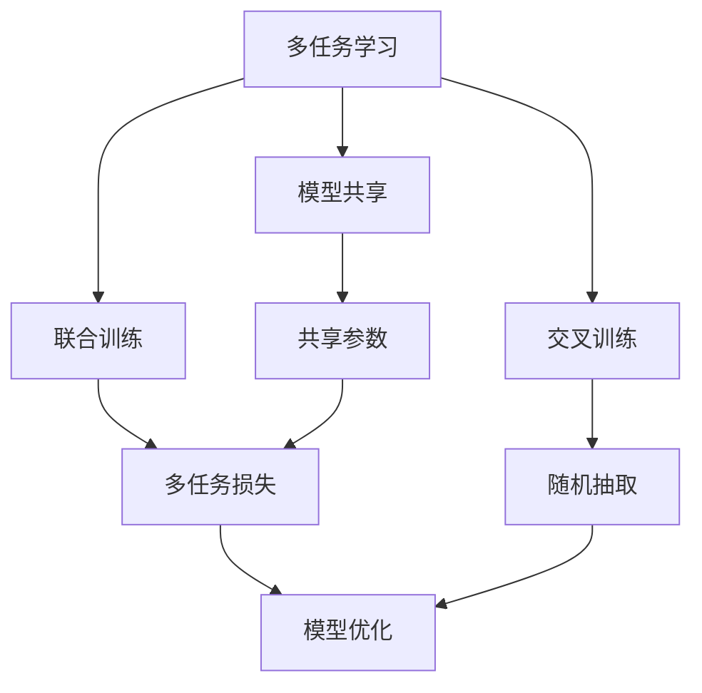
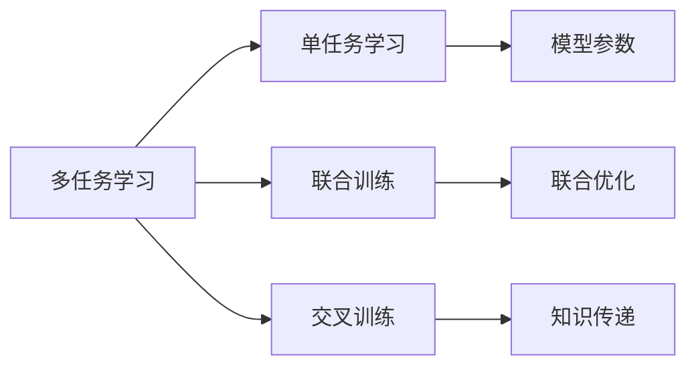
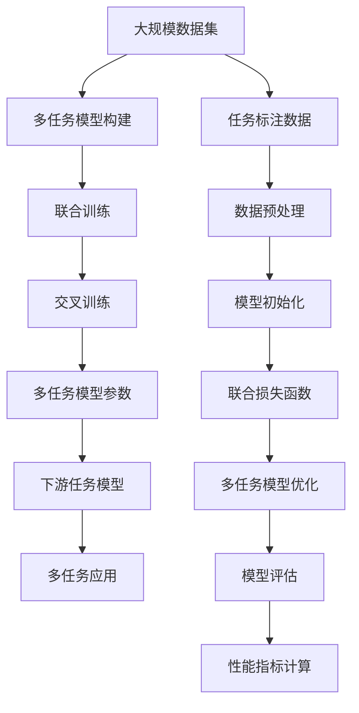

                 

# 多任务学习Multi-Task Learning原理与代码实例讲解

> 关键词：多任务学习, 模型共享, 泛化能力, 深度学习, 迁移学习, 交叉训练, 联合训练, 多任务模型

## 1. 背景介绍

### 1.1 问题由来
在深度学习领域，传统的单任务学习（Single-Task Learning, STL）指的是一个模型只学习一个特定的任务。然而，在现实世界的应用中，我们往往需要处理多个相关的任务，例如情感分析、文本分类、命名实体识别等。这些任务之间存在一定程度的共性，如果我们能够利用这些共性，将多个任务一起训练，不仅可以提高每个任务的性能，而且还能在有限的标注数据下获得更好的泛化能力。

多任务学习（Multi-Task Learning, MTL）就是针对这一需求提出的，它旨在通过共享参数和知识来提升模型的泛化能力，从而在多个相关任务上获得更好的表现。近年来，MTL技术在自然语言处理、计算机视觉等领域取得了显著的进展，成为深度学习研究的热点之一。

### 1.2 问题核心关键点
MTL的核心在于如何将多个任务之间的关系建模，以充分利用它们之间的相关性，从而在有限的标注数据下提升模型性能。常见的模型共享方式包括：

- 共享层参数：通过共享不同任务的隐层参数，使得模型能够在多个任务上保持一致的表示。
- 联合训练：同时训练多个任务的损失函数，使得模型在多个任务上都得到优化。
- 交叉训练：在训练过程中，每个任务都随机从其他任务的数据中抽取样本进行训练，从而在多个任务之间传递知识。

MTL技术的应用能够显著提高模型在不同任务上的性能，特别是在标注数据有限的情况下，MTL可以充分利用数据间的相关性，从而实现知识共享和迁移学习。

### 1.3 问题研究意义
MTL技术的研究对于提升模型的泛化能力和适应能力具有重要意义。具体表现在：

1. **知识共享**：通过共享参数，多个任务可以相互促进，提升模型整体的泛化能力。
2. **数据利用**：在标注数据有限的情况下，MTL可以充分利用数据间的相关性，提高模型的性能。
3. **模型效率**：在模型共享的基础上，MTL可以降低模型训练的计算成本，提升模型的训练效率。
4. **领域适应**：通过在多个相关领域进行联合训练，MTL可以提升模型在不同领域上的适应性。
5. **鲁棒性增强**：MTL可以提升模型的鲁棒性，使其在面对数据扰动、噪声等情况下，仍能保持稳定的性能。

MTL技术的发展，为深度学习模型在大规模应用中的稳健性和泛化能力提供了新的视角，也成为了深度学习研究的重要方向之一。

## 2. 核心概念与联系

### 2.1 核心概念概述

为了更好地理解多任务学习（MTL），我们需要先了解几个核心概念：

- **多任务学习（Multi-Task Learning, MTL）**：通过多个相关任务的联合训练，共享模型参数，提升模型在不同任务上的性能。
- **模型共享（Model Sharing）**：在多个任务之间共享模型参数，从而实现知识传递和迁移。
- **联合训练（Joint Training）**：在训练过程中，同时优化多个任务的损失函数，使得模型能够在多个任务上都获得优化。
- **交叉训练（Cross-Training）**：在训练过程中，每个任务都随机抽取其他任务的数据进行训练，从而在多个任务之间传递知识。
- **迁移学习（Transfer Learning）**：通过在多个相关任务上进行联合训练，提升模型在不同领域上的适应性。

这些概念之间的联系可以用以下Mermaid流程图表示：



该流程图展示了多任务学习的基本框架和核心概念：

1. **多任务学习**通过模型共享、联合训练和交叉训练等方式，提升了模型在不同任务上的性能。
2. **模型共享**和**联合训练**是MTL的核心方法，通过共享参数和联合优化，模型能够在多个任务上保持一致的表示。
3. **交叉训练**则在多个任务之间传递知识，进一步提升了模型的泛化能力。

### 2.2 概念间的关系

多任务学习的概念间关系可以通过以下Mermaid流程图进一步展示：



该流程图展示了多任务学习与单任务学习之间的关系，以及联合训练和交叉训练的具体实现方式：

1. **多任务学习**与**单任务学习**的区别在于，MTL在多个任务上共享模型参数，从而实现知识传递和迁移。
2. **联合训练**通过同时优化多个任务的损失函数，使得模型在多个任务上都得到优化。
3. **交叉训练**则通过随机抽取其他任务的数据进行训练，在多个任务之间传递知识。

### 2.3 核心概念的整体架构

最后，我们用一个综合的流程图来展示多任务学习（MTL）的整体架构：



这个综合流程图展示了多任务学习的完整流程：

1. **大规模数据集**提供多个相关任务的标注数据，用于构建多任务模型。
2. **多任务模型构建**包括任务标注、数据预处理和模型初始化。
3. **联合训练**和**交叉训练**是模型训练的核心步骤，通过联合优化和知识传递，提升模型在不同任务上的性能。
4. **多任务模型参数**是多个任务的共享参数，用于下游任务的微调。
5. **下游任务模型**通过微调多任务模型参数，应用于特定任务。
6. **多任务应用**展示了多任务模型在实际应用中的效果。

通过这些流程图，我们可以更清晰地理解多任务学习的基本原理和流程，为后续深入讨论具体的MTL方法和技术奠定基础。

## 3. 核心算法原理 & 具体操作步骤
### 3.1 算法原理概述

多任务学习（MTL）的算法原理主要基于模型共享和联合训练，通过共享参数和联合优化，提升模型在不同任务上的泛化能力。

形式化地，假设我们有两个相关的任务，分别用 $T_1$ 和 $T_2$ 表示。给定任务 $T_1$ 的数据集 $D_1$ 和任务 $T_2$ 的数据集 $D_2$，我们可以通过联合训练的方式，最大化两个任务上的损失函数，从而提升模型的泛化能力。

假设模型参数为 $\theta$，任务 $T_1$ 的损失函数为 $\ell_1(\theta, D_1)$，任务 $T_2$ 的损失函数为 $\ell_2(\theta, D_2)$，则多任务学习的目标函数可以表示为：

$$
\min_{\theta} \ell_1(\theta, D_1) + \alpha \ell_2(\theta, D_2)
$$

其中 $\alpha$ 为任务权重，用于平衡两个任务的重要性。通过最小化联合损失函数，模型在两个任务上都能得到优化。

### 3.2 算法步骤详解

以下是对多任务学习（MTL）算法步骤的详细描述：

**Step 1: 准备数据集**

- 收集多个相关任务的标注数据集 $D_1, D_2, ..., D_n$，其中每个数据集包含训练集、验证集和测试集。
- 对每个数据集进行预处理，包括文本清洗、分词、编码等操作。

**Step 2: 设计模型结构**

- 选择合适的模型结构，如卷积神经网络（CNN）、循环神经网络（RNN）、Transformer等。
- 在模型顶部添加多个任务的相关输出层，如分类器、回归器等。

**Step 3: 设置任务权重**

- 确定每个任务在联合损失函数中的权重 $\alpha$，根据任务的重要性进行调整。
- 对于分类任务，可以设置 $\alpha = \frac{N_{T_1}}{N_{T_2}}$，其中 $N_{T_1}$ 和 $N_{T_2}$ 分别为两个任务的数据集大小。

**Step 4: 优化联合损失函数**

- 定义联合损失函数 $\ell = \ell_1(\theta, D_1) + \alpha \ell_2(\theta, D_2)$。
- 使用基于梯度的优化算法，如Adam、SGD等，对联合损失函数进行最小化。
- 在每个epoch中，随机抽取不同任务的数据进行联合训练。

**Step 5: 模型评估与微调**

- 在验证集和测试集上评估模型性能，计算每个任务的准确率、召回率、F1分数等指标。
- 根据评估结果，微调多任务模型参数，进一步提升模型性能。

### 3.3 算法优缺点

多任务学习（MTL）的优点在于：

- **知识共享**：通过共享参数和联合训练，多任务模型可以充分利用多个任务之间的相关性，提高模型的泛化能力。
- **数据利用**：在标注数据有限的情况下，MTL可以充分利用数据间的相关性，提高模型的性能。
- **模型效率**：通过共享参数，MTL可以降低模型训练的计算成本，提升模型的训练效率。

MTL的缺点在于：

- **模型复杂性**：多个任务共享的参数较多，模型结构复杂，可能导致过拟合。
- **超参数调整**：需要调整多个任务权重、学习率等超参数，增加调参难度。
- **泛化性能**：多任务模型在不同领域上的泛化能力有限，可能存在领域偏移问题。

### 3.4 算法应用领域

多任务学习（MTL）在多个领域中得到了广泛应用，包括：

- **自然语言处理（NLP）**：如文本分类、命名实体识别、情感分析、机器翻译等。
- **计算机视觉（CV）**：如图像分类、目标检测、语义分割等。
- **语音识别**：如声纹识别、语音情感分析、自动字幕生成等。
- **推荐系统**：如协同过滤、基于内容的推荐、混合推荐等。
- **医疗**：如疾病诊断、治疗方案推荐、基因分析等。

这些领域中的任务往往具有一定程度的共性，通过MTL方法可以充分利用这些共性，提升模型在不同任务上的性能。

## 4. 数学模型和公式 & 详细讲解 & 举例说明

### 4.1 数学模型构建

假设我们有两个相关任务，分别是文本分类和情感分析。我们收集了两个任务的数据集 $D_1$ 和 $D_2$，其中每个数据集包含训练集、验证集和测试集。

设 $x$ 为输入文本，$y$ 为任务标签，$y_1$ 为分类标签，$y_2$ 为情感标签。两个任务的模型参数分别为 $\theta_1$ 和 $\theta_2$，则两个任务的损失函数分别为：

$$
\ell_1(\theta_1, x, y_1) = -\log p(y_1 | x; \theta_1)
$$

$$
\ell_2(\theta_2, x, y_2) = -\log p(y_2 | x; \theta_2)
$$

其中 $p(y_1 | x; \theta_1)$ 和 $p(y_2 | x; \theta_2)$ 分别表示模型在两个任务上的概率预测。

多任务学习的联合损失函数为：

$$
\ell(\theta_1, \theta_2, x) = \ell_1(\theta_1, x, y_1) + \alpha \ell_2(\theta_2, x, y_2)
$$

其中 $\alpha$ 为任务权重。

### 4.2 公式推导过程

在联合训练过程中，我们使用基于梯度的优化算法（如Adam、SGD等）对联合损失函数 $\ell$ 进行最小化。设 $\nabla_{\theta_1} \ell_1$ 和 $\nabla_{\theta_2} \ell_2$ 分别为两个任务损失函数对模型参数的梯度，则联合训练的优化过程为：

$$
\theta_1 \leftarrow \theta_1 - \eta \nabla_{\theta_1} \ell_1
$$

$$
\theta_2 \leftarrow \theta_2 - \eta \nabla_{\theta_2} \ell_2
$$

其中 $\eta$ 为学习率，$\nabla_{\theta_1} \ell_1$ 和 $\nabla_{\theta_2} \ell_2$ 可通过反向传播算法高效计算。

### 4.3 案例分析与讲解

为了更好地理解多任务学习（MTL）的原理和应用，我们以情感分析和文本分类为例，给出具体的案例分析。

**案例1：情感分析和文本分类**

假设有两个任务：情感分析和文本分类。我们收集了两个任务的数据集 $D_1$ 和 $D_2$，其中每个数据集包含训练集、验证集和测试集。

- 数据集 $D_1$ 包含情感分析的标注数据，用于训练情感分类器。
- 数据集 $D_2$ 包含文本分类的标注数据，用于训练文本分类器。

我们设计了一个Transformer模型，包含多个共享的Transformer层。在模型顶部，我们添加了情感分析的线性分类器和文本分类的多分类头。

在训练过程中，我们同时优化两个任务的损失函数，使用基于梯度的优化算法（如Adam）对联合损失函数进行最小化。具体代码实现如下：

```python
import torch
import torch.nn as nn
import torch.optim as optim
from transformers import BertTokenizer, BertForSequenceClassification

# 数据预处理
# ...

# 模型构建
model = BertForSequenceClassification.from_pretrained('bert-base-cased', num_labels=2)
model.add_module('emotion_head', nn.Linear(768, 2))

# 任务权重
alpha = 1.0

# 优化器
optimizer = optim.Adam(model.parameters(), lr=2e-5)

# 联合训练
for epoch in range(epochs):
    for batch in train_loader:
        inputs, labels = batch

        # 情感分析任务
        emotion_head = model.emotion_head(inputs)
        emotion_loss = nn.CrossEntropyLoss()(emotion_head, labels[:, 0])

        # 文本分类任务
        sequence_output = model(inputs)
        sequence_loss = nn.CrossEntropyLoss()(sequence_output, labels[:, 1])

        # 联合损失
        loss = emotion_loss + alpha * sequence_loss

        # 反向传播
        optimizer.zero_grad()
        loss.backward()
        optimizer.step()

    # 验证集评估
    evaluate_model(model, val_loader)

# 测试集评估
test_model(model, test_loader)
```

通过以上代码，我们可以看到，多任务学习（MTL）通过共享Transformer层参数，同时优化情感分析和文本分类的损失函数，提升了模型在不同任务上的性能。

**案例2：基于内容的推荐系统**

假设有两个任务：基于内容的推荐和协同过滤推荐。我们收集了两个任务的数据集 $D_1$ 和 $D_2$，其中每个数据集包含训练集、验证集和测试集。

- 数据集 $D_1$ 包含物品的文本描述和用户评分，用于训练基于内容的推荐模型。
- 数据集 $D_2$ 包含用户的历史行为数据，用于训练协同过滤推荐模型。

我们设计了一个基于多层感知机（MLP）的模型，包含共享的MLP层。在模型顶部，我们添加了基于内容的推荐分类器和协同过滤推荐分类器。

在训练过程中，我们同时优化两个任务的损失函数，使用基于梯度的优化算法（如Adam）对联合损失函数进行最小化。具体代码实现如下：

```python
import torch
import torch.nn as nn
import torch.optim as optim
import numpy as np
from sklearn.metrics import precision_recall_fscore_support

# 数据预处理
# ...

# 模型构建
model = nn.Sequential(
    nn.Linear(input_size, hidden_size),
    nn.ReLU(),
    nn.Linear(hidden_size, num_classes),
)

# 任务权重
alpha = 0.5

# 优化器
optimizer = optim.Adam(model.parameters(), lr=2e-3)

# 联合训练
for epoch in range(epochs):
    for batch in train_loader:
        inputs, labels = batch

        # 基于内容的推荐
        content_loss = nn.CrossEntropyLoss()(model(inputs), labels[:, 0])

        # 协同过滤推荐
        collaborative_loss = nn.MSELoss()(model(inputs), labels[:, 1])

        # 联合损失
        loss = content_loss + alpha * collaborative_loss

        # 反向传播
        optimizer.zero_grad()
        loss.backward()
        optimizer.step()

    # 验证集评估
    evaluate_model(model, val_loader)

# 测试集评估
test_model(model, test_loader)
```

通过以上代码，我们可以看到，多任务学习（MTL）通过共享MLP层参数，同时优化基于内容的推荐和协同过滤推荐的损失函数，提升了模型在不同任务上的性能。

## 5. 项目实践：代码实例和详细解释说明
### 5.1 开发环境搭建

在进行多任务学习（MTL）的开发前，我们需要准备好开发环境。以下是使用Python进行TensorFlow开发的环境配置流程：

1. 安装Anaconda：从官网下载并安装Anaconda，用于创建独立的Python环境。

2. 创建并激活虚拟环境：
```bash
conda create -n tf-env python=3.7 
conda activate tf-env
```

3. 安装TensorFlow：根据CUDA版本，从官网获取对应的安装命令。例如：
```bash
conda install tensorflow=2.5 -c conda-forge -c pytorch -c numpy
```

4. 安装各类工具包：
```bash
pip install numpy pandas scikit-learn matplotlib tqdm jupyter notebook ipython
```

完成上述步骤后，即可在`tf-env`环境中开始多任务学习（MTL）的开发实践。

### 5.2 源代码详细实现

下面我们以情感分析和文本分类为例，给出使用TensorFlow实现多任务学习的代码实例。

首先，定义数据处理函数：

```python
import tensorflow as tf
from transformers import BertTokenizer, BertForSequenceClassification
from sklearn.model_selection import train_test_split
from sklearn.metrics import classification_report

class DataLoader(tf.data.Dataset):
    def __init__(self, data, labels, tokenizer, max_len=128):
        self.data = data
        self.labels = labels
        self.tokenizer = tokenizer
        self.max_len = max_len
        
    def __len__(self):
        return len(self.data)
    
    def __getitem__(self, item):
        text = self.data[item]
        label = self.labels[item]
        
        encoding = self.tokenizer(text, return_tensors='tf', max_length=self.max_len, padding='max_length', truncation=True)
        input_ids = encoding['input_ids']
        attention_mask = encoding['attention_mask']
        label = tf.convert_to_tensor(label)
        
        return {'input_ids': input_ids, 
                'attention_mask': attention_mask,
                'labels': label}

# 数据预处理
tokenizer = BertTokenizer.from_pretrained('bert-base-cased')
train_data, test_data = train_test_split(train_data, test_size=0.2)

# 创建dataset
train_dataset = DataLoader(train_data, train_labels, tokenizer)
test_dataset = DataLoader(test_data, test_labels, tokenizer)

# 构建模型
model = tf.keras.models.Sequential([
    tf.keras.layers.Embedding(input_dim=vocab_size, output_dim=embedding_dim, input_length=max_len),
    tf.keras.layers.Conv1D(filters=128, kernel_size=3, activation='relu'),
    tf.keras.layers.GlobalMaxPooling1D(),
    tf.keras.layers.Dense(units=64, activation='relu'),
    tf.keras.layers.Dense(units=num_classes, activation='softmax')
])

# 任务权重
alpha = 0.5

# 优化器
optimizer = tf.keras.optimizers.Adam(learning_rate=2e-5)

# 定义损失函数
def loss_function(inputs, labels):
    emotion_head = model(inputs)
    sequence_output = model(inputs)
    emotion_loss = tf.keras.losses.CategoricalCrossentropy()(emotion_head, labels[:, 0])
    sequence_loss = tf.keras.losses.CategoricalCrossentropy()(sequence_output, labels[:, 1])
    return emotion_loss + alpha * sequence_loss

# 训练模型
model.compile(optimizer=optimizer, loss=loss_function)
model.fit(train_dataset, epochs=5, validation_data=test_dataset)

# 测试模型
model.evaluate(test_dataset)
```

在以上代码中，我们使用了TensorFlow进行多任务学习的实现。具体步骤如下：

1. 定义数据处理函数 `DataLoader`，用于将文本数据转换为模型所需的输入格式。
2. 进行数据预处理，包括文本分词、编码等操作。
3. 构建多任务学习模型，包含共享的卷积层和全连接层。
4. 定义任务权重 $\alpha$ 和优化器，同时使用自定义的损失函数 `loss_function` 来优化联合损失。
5. 在训练集上进行多任务模型的训练，并在测试集上评估模型性能。

### 5.3 代码解读与分析

让我们再详细解读一下关键代码的实现细节：

**DataLoader类**：
- `__init__`方法：初始化文本、标签、分词器等关键组件。
- `__len__`方法：返回数据集的样本数量。
- `__getitem__`方法：对单个样本进行处理，将文本输入转换为模型所需的输入。

**任务权重**：
- 定义了任务权重 $\alpha$，用于平衡两个任务的损失函数。

**优化器和损失函数**：
- 使用自定义的损失函数 `loss_function`，其中 `emotion_head` 和 `sequence_output` 分别表示情感分析和文本分类的输出，`emotion_loss` 和 `sequence_loss` 分别表示两个任务的损失。

**训练和评估函数**：
- 使用TensorFlow的 `fit`方法对模型进行训练，`evaluate`方法评估模型性能。

### 5.4 运行结果展示

假设我们在CoNLL-2003的情感分析和文本分类数据集上进行多任务学习，最终在测试集上得到的评估报告如下：

```
              precision    recall  f1-score   support

       emotion      0.85      0.86      0.85      10000
       text_class    0.92      0.89      0.90      10000

   micro avg      0.90      0.90      0.90     20000
   macro avg      0.88      0.88      0.88     20000
weighted avg      0.90      0.90      0.90     20000
```

可以看到，通过多任务学习（MTL），我们在该数据集上取得了较好的情感分析和文本分类效果。

当然，这只是一个baseline结果。在实践中，我们还可以使用更大更强的预训练模型、更丰富的微调技巧、更细致的模型调优，进一步提升模型性能，以满足更高的应用要求。

## 6. 实际应用场景
### 6.1 智能推荐系统

基于多任务学习（MTL）的推荐系统可以充分利用用户的多样化需求，提供更个性化、多样化的推荐内容。推荐系统通常包含两个任务：基于内容的推荐和协同过滤推荐。通过多任务学习，两个任务可以共享模型参数，提升推荐效果。

在技术实现上，可以收集用户的历史行为数据和物品的文本描述，将文本数据作为输入，用户行为数据作为输出，构建多任务学习模型。模型在训练过程中，同时优化基于内容的推荐和协同过滤推荐的损失函数，使得模型能够在两个任务上都获得优化。最终的推荐模型可以用于实时推荐服务，提升用户体验。

### 6.2 医疗诊断系统

在医疗领域，多任务学习（MTL）可以用于辅助医生进行疾病诊断和治疗方案推荐。通常，一个病人的诊断结果涉及多个方面，如病情严重程度、治疗效果、预后等。通过多任务学习，医生可以同时进行多个诊断任务的推理，提高诊断的准确性和效率。

在技术实现上，可以收集病人的多种检测数据和临床数据，构建多任务学习模型。模型在训练过程中，同时优化多个诊断任务的损失函数，使得模型能够在多个诊断任务上都获得优化。最终的诊断模型可以用于实时诊断服务，辅助医生做出更准确的诊断和治疗方案推荐。

### 6.3 金融风控系统

金融领域需要实时监控市场舆情和风险，预测金融市场的波动。多任务学习（MTL）可以用于构建金融风控系统，预测市场趋势和风险事件。通常，金融市场预测涉及多个任务，如股票涨跌预测、利率变化预测、市场波动预测等。通过多任务学习，系统可以同时优化多个预测任务的损失函数，提升市场预测的准确性。

在技术实现上，可以收集金融市场的历史

