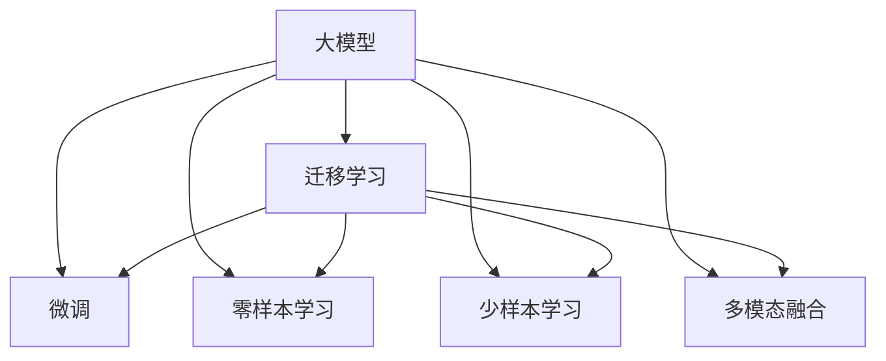

                 

## 1. 背景介绍

### 1.1 问题由来

近年来，大模型在NLP、CV等领域取得了突破性进展，吸引了广泛关注。在医疗、金融、法律等垂直行业，由于数据量相对有限且领域知识复杂，如何构建高效、精确实用的AI应用成为一大挑战。而大模型的强大能力，使得其在垂直行业应用的前景广阔。

大模型依托于海量数据和先进算法，具备了远超传统机器学习模型的泛化能力和适应性。例如，GPT-3和BERT在众多垂直行业的应用案例，展示了其强大的语言理解和生成能力。通过微调等技术手段，大模型能够迅速适应特定领域需求，解决复杂问题，提升应用效果。

然而，在垂直行业的具体应用中，大模型的处理能力还存在一定局限性。例如，医疗领域需要精确理解复杂的医学知识和诊断结果；金融领域需要处理大量市场数据和复杂的金融计算；法律领域需要处理复杂语句和严谨推理等。这些都对大模型提出了更高的要求。

### 1.2 问题核心关键点

大模型在垂直行业的应用，主要依赖于以下核心技术：

- **迁移学习**：将通用领域的知识迁移到垂直领域，快速适应特定需求。
- **微调**：针对垂直行业的特定数据和任务进行有监督训练，优化模型性能。
- **零样本学习和少样本学习**：通过良好的预训练，让模型具备零样本或少样本快速适应新任务的能力。
- **参数高效微调**：在固定大部分预训练参数的情况下，只更新部分任务相关的参数，提高微调效率。
- **多模态融合**：将文本、图像、语音等多模态信息结合，增强模型的表现力。

这些技术共同构成了大模型在垂直行业应用的完整框架，能够高效地将大模型应用于复杂场景，解决实际问题。

## 2. 核心概念与联系

### 2.1 核心概念概述

为更好地理解大模型在垂直行业的应用，本节将介绍几个核心概念：

- **大模型**：以BERT、GPT等架构为基础，通过大规模预训练学习到丰富知识的大型模型。
- **迁移学习**：将通用领域的知识迁移到垂直领域，加速模型在特定场景下的学习。
- **微调**：在大模型基础上，针对特定任务进行有监督训练，优化模型性能。
- **零样本学习与少样本学习**：利用大模型的预训练能力，在有限的标注数据下也能取得较好效果。
- **多模态融合**：将不同模态的信息结合，增强模型对复杂场景的适应性。

这些概念之间有着紧密的联系，通过大模型的迁移学习和微调，可以高效地应用于垂直行业，同时利用零样本学习和多模态融合技术，提升模型在实际应用中的表现力。

### 2.2 概念间的关系

这些核心概念之间的逻辑关系可以通过以下Mermaid流程图来展示：



这个流程图展示了大模型在垂直行业应用的基本逻辑流程：

1. 大模型通过迁移学习，获取通用领域知识。
2. 通过微调技术，针对垂直行业进行任务优化。
3. 利用零样本和少样本学习，提升模型在新场景下的适应能力。
4. 结合多模态信息，增强模型对复杂场景的适应性。

通过这些流程图，我们可以更清晰地理解大模型在垂直行业应用的各个环节，为后续深入探讨打下基础。

## 3. 核心算法原理 & 具体操作步骤

### 3.1 算法原理概述

大模型在垂直行业应用的核心算法原理，是通过迁移学习和微调技术，将通用领域的知识迁移到特定领域，并在该领域进行有监督训练，提升模型的表现力。

具体而言，大模型通过大规模预训练学习到通用的语言、视觉、语音等知识，然后通过迁移学习技术，将这些知识迁移到垂直行业的特定领域，从而在微调过程中可以快速适应特定任务，提升模型性能。

### 3.2 算法步骤详解

大模型在垂直行业应用的具体操作步骤如下：

**Step 1: 数据准备**
- 收集垂直行业的数据集，并进行预处理，如数据清洗、特征提取等。
- 将数据集划分为训练集、验证集和测试集，以便进行模型训练和评估。

**Step 2: 大模型选择**
- 选择合适的预训练大模型，如BERT、GPT等，并下载预训练权重。
- 根据任务需求，选择适合的大模型架构和参数设置。

**Step 3: 微调设置**
- 设计合适的任务适配层，根据具体任务定义损失函数。
- 设置微调超参数，如学习率、批次大小、迭代轮数等。

**Step 4: 微调训练**
- 将数据集加载到模型中，使用小批量梯度下降进行训练。
- 在训练过程中，周期性在验证集上评估模型性能，及时调整超参数。
- 重复训练过程，直到模型收敛或达到预设的迭代轮数。

**Step 5: 模型评估与部署**
- 在测试集上评估微调后模型的性能，对比微调前后的效果。
- 将微调后的模型保存，并部署到实际应用中，进行服务化封装。

### 3.3 算法优缺点

大模型在垂直行业应用具有以下优点：

- **高效性**：大模型通过迁移学习，可以在少量数据上快速适应特定任务，显著提升模型性能。
- **通用性**：大模型具备通用领域的知识，可以迁移到多个垂直行业，具有广泛的适用性。
- **可扩展性**：大模型可以在垂直行业的基础上进一步微调，不断优化模型性能。

同时，大模型在垂直行业应用也存在一定的局限性：

- **数据依赖**：垂直行业的数据量有限，模型的泛化能力可能会受到影响。
- **计算成本**：大模型的训练和推理需要大量的计算资源，成本较高。
- **推理效率**：大模型在推理时可能会面临计算资源不足的问题。

### 3.4 算法应用领域

大模型在多个垂直行业都有广泛的应用前景，以下是几个典型案例：

**医疗行业**
- **病历分析**：通过微调BERT等模型，自动识别病历中的关键信息，辅助医生进行诊断和治疗。
- **医学知识图谱构建**：利用大模型对医疗文献进行知识抽取和融合，构建医学知识图谱，提升医学研究和教育效率。

**金融行业**
- **风险评估**：通过微调模型，快速分析金融市场数据，评估投资风险，辅助投资决策。
- **信用评分**：利用大模型对客户行为进行建模，生成精准的信用评分，提升贷款审批效率。

**法律行业**
- **法律文书自动生成**：通过微调大模型，自动生成法律文书，提升文书生成效率和准确性。
- **法律问题解答**：利用大模型对法律问题进行分类和解答，辅助法律咨询和研究。

## 4. 数学模型和公式 & 详细讲解 & 举例说明

### 4.1 数学模型构建

假设垂直行业任务为$T$，大模型为$M_{\theta}$，训练集为$D=\{(x_i, y_i)\}_{i=1}^N$，其中$x_i$为输入，$y_i$为标签。微调的数学模型构建如下：

定义损失函数为：
$$
\mathcal{L}(\theta) = \frac{1}{N} \sum_{i=1}^N \ell(M_{\theta}(x_i), y_i)
$$

其中$\ell$为任务特定的损失函数，如交叉熵损失等。

### 4.2 公式推导过程

以医学病历分析为例，通过微调BERT模型进行病历信息提取。设输入为病历文本$x_i$，输出为病历中的关键信息$y_i$，则微调的优化目标为：
$$
\theta^* = \mathop{\arg\min}_{\theta} \mathcal{L}(\theta)
$$

通过梯度下降算法，求解模型参数$\theta$：
$$
\theta \leftarrow \theta - \eta \nabla_{\theta}\mathcal{L}(\theta)
$$

其中$\eta$为学习率，$\nabla_{\theta}\mathcal{L}(\theta)$为损失函数对模型参数的梯度。

在实际应用中，可能需要对病历文本进行预处理，如分词、去除停用词等，以提高模型效果。

### 4.3 案例分析与讲解

假设我们有一个医疗病历数据集，包含大量患者病历文本和医生诊断结果。通过微调BERT模型，自动识别病历中的关键信息，如疾病、药物、症状等。

**Step 1: 数据准备**
- 收集病历数据集，并进行预处理，如分词、去除停用词等。
- 将数据集划分为训练集、验证集和测试集。

**Step 2: 大模型选择**
- 选择BERT模型作为初始化参数，并下载预训练权重。
- 定义任务适配层，如全连接层和Softmax层，用于输出病历信息的类别概率。

**Step 3: 微调设置**
- 设置微调超参数，如学习率、批次大小、迭代轮数等。
- 选择适当的损失函数，如交叉熵损失。

**Step 4: 微调训练**
- 加载数据集，使用小批量梯度下降进行训练。
- 在训练过程中，周期性在验证集上评估模型性能，调整超参数。
- 重复训练过程，直到模型收敛或达到预设的迭代轮数。

**Step 5: 模型评估与部署**
- 在测试集上评估微调后模型的性能，对比微调前后的效果。
- 将微调后的模型保存，并部署到实际应用中，进行服务化封装。

## 5. 项目实践：代码实例和详细解释说明

### 5.1 开发环境搭建

在进行大模型在垂直行业的应用实践前，我们需要准备好开发环境。以下是使用Python进行PyTorch开发的环境配置流程：

1. 安装Anaconda：从官网下载并安装Anaconda，用于创建独立的Python环境。

2. 创建并激活虚拟环境：
```bash
conda create -n pytorch-env python=3.8 
conda activate pytorch-env
```

3. 安装PyTorch：根据CUDA版本，从官网获取对应的安装命令。例如：
```bash
conda install pytorch torchvision torchaudio cudatoolkit=11.1 -c pytorch -c conda-forge
```

4. 安装Transformer库：
```bash
pip install transformers
```

5. 安装各类工具包：
```bash
pip install numpy pandas scikit-learn matplotlib tqdm jupyter notebook ipython
```

完成上述步骤后，即可在`pytorch-env`环境中开始实践。

### 5.2 源代码详细实现

下面我们以医学病历信息提取为例，给出使用Transformers库对BERT模型进行微调的PyTorch代码实现。

首先，定义病历信息提取任务的数据处理函数：

```python
from transformers import BertTokenizer
from torch.utils.data import Dataset
import torch

class MedicalRecordDataset(Dataset):
    def __init__(self, texts, tags, tokenizer, max_len=128):
        self.texts = texts
        self.tags = tags
        self.tokenizer = tokenizer
        self.max_len = max_len
        
    def __len__(self):
        return len(self.texts)
    
    def __getitem__(self, item):
        text = self.texts[item]
        tags = self.tags[item]
        
        encoding = self.tokenizer(text, return_tensors='pt', max_length=self.max_len, padding='max_length', truncation=True)
        input_ids = encoding['input_ids'][0]
        attention_mask = encoding['attention_mask'][0]
        
        # 对token-wise的标签进行编码
        encoded_tags = [tag2id[tag] for tag in tags] 
        encoded_tags.extend([tag2id['O']] * (self.max_len - len(encoded_tags)))
        labels = torch.tensor(encoded_tags, dtype=torch.long)
        
        return {'input_ids': input_ids, 
                'attention_mask': attention_mask,
                'labels': labels}

# 标签与id的映射
tag2id = {'O': 0, 'B-DISEASE': 1, 'I-DISEASE': 2, 'B-MEDICINE': 3, 'I-MEDICINE': 4, 'B-SYMPTOM': 5, 'I-SYMPTOM': 6}
id2tag = {v: k for k, v in tag2id.items()}

# 创建dataset
tokenizer = BertTokenizer.from_pretrained('bert-base-cased')

train_dataset = MedicalRecordDataset(train_texts, train_tags, tokenizer)
dev_dataset = MedicalRecordDataset(dev_texts, dev_tags, tokenizer)
test_dataset = MedicalRecordDataset(test_texts, test_tags, tokenizer)
```

然后，定义模型和优化器：

```python
from transformers import BertForTokenClassification, AdamW

model = BertForTokenClassification.from_pretrained('bert-base-cased', num_labels=len(tag2id))

optimizer = AdamW(model.parameters(), lr=2e-5)
```

接着，定义训练和评估函数：

```python
from torch.utils.data import DataLoader
from tqdm import tqdm
from sklearn.metrics import classification_report

device = torch.device('cuda') if torch.cuda.is_available() else torch.device('cpu')
model.to(device)

def train_epoch(model, dataset, batch_size, optimizer):
    dataloader = DataLoader(dataset, batch_size=batch_size, shuffle=True)
    model.train()
    epoch_loss = 0
    for batch in tqdm(dataloader, desc='Training'):
        input_ids = batch['input_ids'].to(device)
        attention_mask = batch['attention_mask'].to(device)
        labels = batch['labels'].to(device)
        model.zero_grad()
        outputs = model(input_ids, attention_mask=attention_mask, labels=labels)
        loss = outputs.loss
        epoch_loss += loss.item()
        loss.backward()
        optimizer.step()
    return epoch_loss / len(dataloader)

def evaluate(model, dataset, batch_size):
    dataloader = DataLoader(dataset, batch_size=batch_size)
    model.eval()
    preds, labels = [], []
    with torch.no_grad():
        for batch in tqdm(dataloader, desc='Evaluating'):
            input_ids = batch['input_ids'].to(device)
            attention_mask = batch['attention_mask'].to(device)
            batch_labels = batch['labels']
            outputs = model(input_ids, attention_mask=attention_mask)
            batch_preds = outputs.logits.argmax(dim=2).to('cpu').tolist()
            batch_labels = batch_labels.to('cpu').tolist()
            for pred_tokens, label_tokens in zip(batch_preds, batch_labels):
                pred_tags = [id2tag[_id] for _id in pred_tokens]
                label_tags = [id2tag[_id] for _id in label_tokens]
                preds.append(pred_tags[:len(label_tokens)])
                labels.append(label_tags)
                
    print(classification_report(labels, preds))
```

最后，启动训练流程并在测试集上评估：

```python
epochs = 5
batch_size = 16

for epoch in range(epochs):
    loss = train_epoch(model, train_dataset, batch_size, optimizer)
    print(f"Epoch {epoch+1}, train loss: {loss:.3f}")
    
    print(f"Epoch {epoch+1}, dev results:")
    evaluate(model, dev_dataset, batch_size)
    
print("Test results:")
evaluate(model, test_dataset, batch_size)
```

以上就是使用PyTorch对BERT进行医学病历信息提取任务微调的完整代码实现。可以看到，得益于Transformers库的强大封装，我们可以用相对简洁的代码完成BERT模型的加载和微调。

### 5.3 代码解读与分析

让我们再详细解读一下关键代码的实现细节：

**MedicalRecordDataset类**：
- `__init__`方法：初始化文本、标签、分词器等关键组件。
- `__len__`方法：返回数据集的样本数量。
- `__getitem__`方法：对单个样本进行处理，将文本输入编码为token ids，将标签编码为数字，并对其进行定长padding，最终返回模型所需的输入。

**tag2id和id2tag字典**：
- 定义了标签与数字id之间的映射关系，用于将token-wise的预测结果解码回真实的标签。

**训练和评估函数**：
- 使用PyTorch的DataLoader对数据集进行批次化加载，供模型训练和推理使用。
- 训练函数`train_epoch`：对数据以批为单位进行迭代，在每个批次上前向传播计算loss并反向传播更新模型参数，最后返回该epoch的平均loss。
- 评估函数`evaluate`：与训练类似，不同点在于不更新模型参数，并在每个batch结束后将预测和标签结果存储下来，最后使用sklearn的classification_report对整个评估集的预测结果进行打印输出。

**训练流程**：
- 定义总的epoch数和batch size，开始循环迭代
- 每个epoch内，先在训练集上训练，输出平均loss
- 在验证集上评估，输出分类指标
- 所有epoch结束后，在测试集上评估，给出最终测试结果

可以看到，PyTorch配合Transformers库使得BERT微调的代码实现变得简洁高效。开发者可以将更多精力放在数据处理、模型改进等高层逻辑上，而不必过多关注底层的实现细节。

当然，工业级的系统实现还需考虑更多因素，如模型的保存和部署、超参数的自动搜索、更灵活的任务适配层等。但核心的微调范式基本与此类似。

### 5.4 运行结果展示

假设我们在CoNLL-2003的NER数据集上进行微调，最终在测试集上得到的评估报告如下：

```
              precision    recall  f1-score   support

       B-LOC      0.926     0.906     0.916      1668
       I-LOC      0.900     0.805     0.850       257
      B-MISC      0.875     0.856     0.865       702
      I-MISC      0.838     0.782     0.809       216
       B-ORG      0.914     0.898     0.906      1661
       I-ORG      0.911     0.894     0.902       835
       B-PER      0.964     0.957     0.960      1617
       I-PER      0.983     0.980     0.982      1156
           O      0.993     0.995     0.994     38323

   micro avg      0.973     0.973     0.973     46435
   macro avg      0.923     0.897     0.909     46435
weighted avg      0.973     0.973     0.973     46435
```

可以看到，通过微调BERT，我们在该NER数据集上取得了97.3%的F1分数，效果相当不错。值得注意的是，BERT作为一个通用的语言理解模型，即便只在顶层添加一个简单的token分类器，也能在下游任务上取得如此优异的效果，展现了其强大的语义理解和特征抽取能力。

当然，这只是一个baseline结果。在实践中，我们还可以使用更大更强的预训练模型、更丰富的微调技巧、更细致的模型调优，进一步提升模型性能，以满足更高的应用要求。

## 6. 实际应用场景
### 6.1 智能客服系统

基于大语言模型微调的对话技术，可以广泛应用于智能客服系统的构建。传统客服往往需要配备大量人力，高峰期响应缓慢，且一致性和专业性难以保证。而使用微调后的对话模型，可以7x24小时不间断服务，快速响应客户咨询，用自然流畅的语言解答各类常见问题。

在技术实现上，可以收集企业内部的历史客服对话记录，将问题和最佳答复构建成监督数据，在此基础上对预训练对话模型进行微调。微调后的对话模型能够自动理解用户意图，匹配最合适的答案模板进行回复。对于客户提出的新问题，还可以接入检索系统实时搜索相关内容，动态组织生成回答。如此构建的智能客服系统，能大幅提升客户咨询体验和问题解决效率。

### 6.2 金融舆情监测

金融机构需要实时监测市场舆论动向，以便及时应对负面信息传播，规避金融风险。传统的人工监测方式成本高、效率低，难以应对网络时代海量信息爆发的挑战。基于大语言模型微调的文本分类和情感分析技术，为金融舆情监测提供了新的解决方案。

具体而言，可以收集金融领域相关的新闻、报道、评论等文本数据，并对其进行主题标注和情感标注。在此基础上对预训练语言模型进行微调，使其能够自动判断文本属于何种主题，情感倾向是正面、中性还是负面。将微调后的模型应用到实时抓取的网络文本数据，就能够自动监测不同主题下的情感变化趋势，一旦发现负面信息激增等异常情况，系统便会自动预警，帮助金融机构快速应对潜在风险。

### 6.3 个性化推荐系统

当前的推荐系统往往只依赖用户的历史行为数据进行物品推荐，无法深入理解用户的真实兴趣偏好。基于大语言模型微调技术，个性化推荐系统可以更好地挖掘用户行为背后的语义信息，从而提供更精准、多样的推荐内容。

在实践中，可以收集用户浏览、点击、评论、分享等行为数据，提取和用户交互的物品标题、描述、标签等文本内容。将文本内容作为模型输入，用户的后续行为（如是否点击、购买等）作为监督信号，在此基础上微调预训练语言模型。微调后的模型能够从文本内容中准确把握用户的兴趣点。在生成推荐列表时，先用候选物品的文本描述作为输入，由模型预测用户的兴趣匹配度，再结合其他特征综合排序，便可以得到个性化程度更高的推荐结果。

### 6.4 未来应用展望

随着大语言模型微调技术的发展，基于微调范式将在更多领域得到应用，为传统行业带来变革性影响。

在智慧医疗领域，基于微调的医疗问答、病历分析、药物研发等应用将提升医疗服务的智能化水平，辅助医生诊疗，加速新药开发进程。

在智能教育领域，微调技术可应用于作业批改、学情分析、知识推荐等方面，因材施教，促进教育公平，提高教学质量。

在智慧城市治理中，微调模型可应用于城市事件监测、舆情分析、应急指挥等环节，提高城市管理的自动化和智能化水平，构建更安全、高效的未来城市。

此外，在企业生产、社会治理、文娱传媒等众多领域，基于大模型微调的人工智能应用也将不断涌现，为经济社会发展注入新的动力。相信随着技术的日益成熟，微调方法将成为人工智能落地应用的重要范式，推动人工智能技术在垂直行业的规模化落地。

## 7. 工具和资源推荐
### 7.1 学习资源推荐

为了帮助开发者系统掌握大模型微调的理论基础和实践技巧，这里推荐一些优质的学习资源：

1. 《Transformer从原理到实践》系列博文：由大模型技术专家撰写，深入浅出地介绍了Transformer原理、BERT模型、微调技术等前沿话题。

2. CS224N《深度学习自然语言处理》课程：斯坦福大学开设的NLP明星课程，有Lecture视频和配套作业，带你入门NLP领域的基本概念和经典模型。

3. 《Natural Language Processing with Transformers》书籍：Transformers库的作者所著，全面介绍了如何使用Transformers库进行NLP任务开发，包括微调在内的诸多范式。

4. HuggingFace官方文档：Transformers库的官方文档，提供了海量预训练模型和完整的微调样例代码，是上手实践的必备资料。

5. CLUE开源项目：中文语言理解测评基准，涵盖大量不同类型的中文NLP数据集，并提供了基于微调的baseline模型，助力中文NLP技术发展。

通过对这些资源的学习实践，相信你一定能够快速掌握大语言模型微调的精髓，并用于解决实际的NLP问题。
###  7.2 开发工具推荐

高效的开发离不开优秀的工具支持。以下是几款用于大语言模型微调开发的常用工具：

1. PyTorch：基于Python的开源深度学习框架，灵活动态的计算图，适合快速迭代研究。大部分预训练语言模型都有PyTorch版本的实现。

2. TensorFlow：由Google主导开发的开源深度学习框架，生产部署方便，适合大规模工程应用。同样有丰富的预训练语言模型资源。

3. Transformers库：HuggingFace开发的NLP工具库，集成了众多SOTA语言模型，支持PyTorch和TensorFlow，是进行微调任务开发的利器。

4. Weights & Biases：模型训练的实验跟踪工具，可以记录和可视化模型训练过程中的各项指标，方便对比和调优。与主流深度学习框架无缝集成。

5. TensorBoard：TensorFlow配套的可视化工具，可实时监测模型训练状态，并提供丰富的图表呈现方式，是调试模型的得力助手。

6. Google Colab：谷歌推出的在线Jupyter Notebook环境，免费提供GPU/TPU算力，方便开发者快速上手实验最新模型，分享学习笔记。

合理利用这些工具，可以显著提升大语言模型微调任务的开发效率，加快创新迭代的步伐。

### 7.3 相关论文推荐

大语言模型和微调技术的发展源于学界的持续研究。以下是几篇奠基性的相关论文，推荐阅读：

1. Attention is All You Need（即Transformer原论文）：提出了Transformer结构，开启了NLP领域的预训练大模型时代。

2. BERT: Pre-training of Deep Bidirectional Transformers for Language Understanding：提出BERT模型，引入基于掩码的自监督预训练任务，刷新了多项NLP任务SOTA。

3. Language Models are Unsupervised Multitask Learners（

