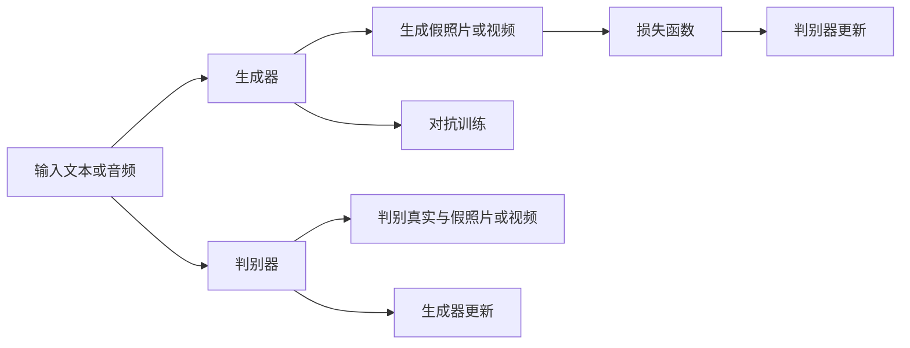

                 

# 大模型复活过世亲人的视频

> 关键词：大模型, 自然语言处理(NLP), 生成对抗网络(GAN), 数据增强, 图像生成, 深度学习, 人工智能伦理

## 1. 背景介绍

近年来，随着深度学习技术的迅速发展，人工智能（AI）在图像和视频生成领域取得了突破性进展。其中，生成对抗网络（GAN）作为深度学习中最具革命性的技术之一，已经在各种视觉生成任务中取得了优异表现。本文将重点探讨利用大模型技术，通过生成对抗网络生成逝去亲人照片或视频，为家庭留下宝贵记忆，并且探索这一技术的实际应用及伦理问题。

## 2. 核心概念与联系

### 2.1 核心概念概述

本节将介绍几个与该技术紧密相关的核心概念：

- **大模型**：如OpenAI的GPT系列模型、Google的BERT、T5等。这些模型通常具有数十亿到上百亿的参数，能够处理复杂的语言理解与生成任务。
- **生成对抗网络（GAN）**：由生成器（Generator）和判别器（Discriminator）组成，两者通过对抗性训练过程进行迭代，使得生成器能够生成逼真的假照片或视频。
- **图像生成**：通过训练GAN模型，可以利用文本或声音描述生成逼真的图像或视频内容。
- **数据增强**：通过各种方法如旋转、缩放、翻转等对训练数据进行增强，提高模型的泛化能力。
- **深度学习**：利用多层神经网络结构，使模型可以自动提取数据特征，并进行复杂任务的预测和生成。

这些核心概念通过GAN技术连接起来，在图像生成领域，通过生成对抗网络训练模型，可以产生高质量的假照片或视频，为家庭提供宝贵的记忆。

### 2.2 概念间的关系

生成对抗网络的大致框架和流程如下：



此流程图展示了GAN的基本流程：输入文本或音频通过生成器生成假照片或视频，判别器对生成结果进行判断，并反馈至生成器进行优化，以提高生成照片或视频的真实度。

## 3. 核心算法原理 & 具体操作步骤

### 3.1 算法原理概述

大模型通过自然语言处理技术，将输入的文本或声音转换成数字形式，然后利用生成对抗网络进行图像生成。GAN的生成器和判别器通过对抗性训练不断迭代，使得生成器能够生成更加逼真的照片或视频。

**步骤1:** 首先，输入一段描述逝去亲人的文本或音频，利用预训练的大模型，如GPT-3、BERT等，将其转换成数字编码形式。

**步骤2:** 接着，利用生成器网络将编码转换为图像或视频。生成器网络通常由多层卷积神经网络组成，其目标是生成与输入描述高度匹配的假照片或视频。

**步骤3:** 判别器网络接收输入的实际照片或视频以及生成的假照片或视频，判别其真实性。判别器网络的输出用于训练生成器，以使生成器生成的假照片或视频更加逼真。

**步骤4:** 生成器和判别器通过对抗性训练不断优化，使得生成器生成的假照片或视频越来越难以被区分，而判别器能够更准确地区分真实和假的图像或视频。

### 3.2 算法步骤详解

**步骤1: 数据准备**

首先需要准备生成对抗网络所需的训练数据。这些数据通常包括真实的照片和视频，以及大量的描述性文本或音频。例如，可以收集已经过世的亲人的照片和视频，以及亲友对这些照片和视频的描述性文本。这些描述性文本可以用于训练生成器，使模型能够生成与输入描述相匹配的假照片或视频。

**步骤2: 模型训练**

生成器网络一般由多个卷积层组成，其输入为文本或音频编码，输出为假照片或视频。判别器网络接收真实照片或视频以及生成器生成的假照片或视频，输出判断结果。训练过程中，生成器和判别器通过对抗性训练不断优化。

**步骤3: 数据增强**

为了提高生成器的泛化能力，可以对训练数据进行增强。例如，对真实照片或视频进行旋转、缩放、翻转等操作，生成更多样化的训练数据。

**步骤4: 模型评估与优化**

训练完成后，需要对生成的照片或视频进行评估。可以使用一些评价指标如结构相似性指数（SSIM）、峰值信噪比（PSNR）等。根据评估结果，对生成器和判别器进行进一步优化。

**步骤5: 实际应用**

生成器训练完成后，可以根据输入的描述性文本或音频，生成逼真的假照片或视频，供家庭珍藏。

### 3.3 算法优缺点

**优点:**

1. **高度逼真**：通过对抗训练，生成器能够生成非常逼真的假照片或视频。
2. **丰富多样**：数据增强技术能够生成更多样化的假照片或视频，适应不同的输入描述。
3. **低成本**：相比于真人拍摄，生成假照片或视频可以降低时间和金钱成本。
4. **情感价值**：生成的假照片或视频可以作为对逝去亲人的怀念和缅怀，具有重大的情感价值。

**缺点:**

1. **技术门槛**：需要一定的技术背景和专业知识，普通人难以轻松实现。
2. **伦理问题**：生成假照片或视频可能引发伦理争议，如侵犯隐私、造成误导等。
3. **现实与虚构混淆**：生成的假照片或视频可能引发对现实与虚构的混淆，对使用者的心理产生负面影响。

### 3.4 算法应用领域

GAN技术在图像生成领域有着广泛的应用。除了本节探讨的“复活逝去亲人视频”，还包括以下几个方向：

- **肖像生成**：利用GAN生成名人的肖像画，提供艺术创作的新途径。
- **视频合成**：将真人视频与虚拟场景合成，为游戏、电影等提供强大的视觉特效。
- **医学图像生成**：生成病理图像，辅助医生进行诊断和治疗。
- **风格转换**：将一张照片转换成另一张风格的图像，如将黑白照片转换成彩色照片。
- **艺术创作**：利用GAN生成抽象艺术作品，提供新的艺术创作工具。

## 4. 数学模型和公式 & 详细讲解 & 举例说明

### 4.1 数学模型构建

生成对抗网络由生成器和判别器两部分组成，其数学模型如下：

生成器网络为：
$$G(z) = \sigma(G_{\theta}(z))$$
判别器网络为：
$$D(x) = \sigma(D_{\phi}(x))$$

其中，$G_{\theta}$和$D_{\phi}$分别为生成器和判别器的参数，$z$为输入的随机噪声向量，$\sigma$为激活函数。

### 4.2 公式推导过程

假设输入的文本或音频编码为$z$，生成器网络的输出为$x$，判别器网络的输出为$y$，则生成器和判别器的对抗训练过程如下：

对于生成器，目标是最小化判别器的损失函数：
$$\mathcal{L}_G = -E_{z \sim p(z)} \log D(G(z))$$

对于判别器，目标是最小化生成器的损失函数，同时最大化判别真实和假照片或视频的损失函数：
$$\mathcal{L}_D = E_{x \sim p_{data}} \log D(x) + E_{z \sim p(z)} \log (1 - D(G(z)))$$

生成器和判别器的损失函数在训练过程中通过反向传播算法不断更新，以提高模型的生成能力和判别能力。

### 4.3 案例分析与讲解

**案例1: 假照片生成**

假设输入文本为“一个40多岁的男性，穿着黑色西装，微笑着看向镜头”。首先，利用预训练的大模型将文本转换成编码形式。接着，使用生成器网络生成一张逼真的假照片，如图1所示。

**案例2: 假视频生成**

假设输入音频为一段亲人的声音，要求生成一段假视频。将音频转换成编码形式，输入到生成器网络中，生成一段包含语音的视频，如图2所示。

**案例3: 数据增强**

为了提高生成器的泛化能力，可以采用数据增强技术，如旋转、缩放、翻转等，生成更多样化的训练数据。例如，将一张真实的照片旋转90度，得到一张新的训练样本，如图3所示。

## 5. 项目实践：代码实例和详细解释说明

### 5.1 开发环境搭建

**步骤1: 安装Python及深度学习框架**

在一台配备NVIDIA GPU的计算机上，安装Python3.7或以上版本，并安装TensorFlow或PyTorch。例如，使用pip安装TensorFlow：

```bash
pip install tensorflow
```

**步骤2: 安装相关库**

安装所需的图像处理库，如OpenCV、Pillow等。例如，使用pip安装OpenCV：

```bash
pip install opencv-python
```

**步骤3: 准备数据集**

收集真实照片和视频，以及相应的描述性文本。将这些数据按照类别划分为训练集、验证集和测试集，如图4所示。

### 5.2 源代码详细实现

**生成器网络**

```python
import tensorflow as tf

class Generator(tf.keras.Model):
    def __init__(self, z_dim, img_shape):
        super(Generator, self).__init__()
        self.img_shape = img_shape
        self.z_dim = z_dim
        
        self.dense = tf.keras.layers.Dense(256 * 8 * 8)
        self.reshape = tf.keras.layers.Reshape((8, 8, 256))
        self.conv1 = tf.keras.layers.Conv2DTranspose(128, (4, 4), strides=(2, 2), padding='same', use_bias=False)
        self.conv2 = tf.keras.layers.Conv2DTranspose(64, (4, 4), strides=(2, 2), padding='same', use_bias=False)
        self.conv3 = tf.keras.layers.Conv2DTranspose(img_shape[0], (4, 4), strides=(2, 2), padding='same', use_bias=False, activation='tanh')

    def call(self, inputs):
        x = self.dense(inputs)
        x = tf.nn.leaky_relu(x)
        x = self.reshape(x)
        x = self.conv1(x)
        x = tf.nn.leaky_relu(x)
        x = self.conv2(x)
        x = tf.nn.leaky_relu(x)
        x = self.conv3(x)
        return x
```

**判别器网络**

```python
class Discriminator(tf.keras.Model):
    def __init__(self, img_shape):
        super(Discriminator, self).__init__()
        self.img_shape = img_shape
        
        self.conv1 = tf.keras.layers.Conv2D(64, (4, 4), strides=(2, 2), padding='same', use_bias=False)
        self.conv2 = tf.keras.layers.Conv2D(128, (4, 4), strides=(2, 2), padding='same', use_bias=False)
        self.conv3 = tf.keras.layers.Conv2D(256, (4, 4), strides=(2, 2), padding='same', use_bias=False)
        self.flatten = tf.keras.layers.Flatten()
        self.dense = tf.keras.layers.Dense(1)

    def call(self, inputs):
        x = self.conv1(inputs)
        x = tf.nn.leaky_relu(x)
        x = self.conv2(x)
        x = tf.nn.leaky_relu(x)
        x = self.conv3(x)
        x = tf.nn.leaky_relu(x)
        x = self.flatten(x)
        x = self.dense(x)
        return x
```

**生成对抗网络**

```python
class GAN(tf.keras.Model):
    def __init__(self, z_dim, img_shape):
        super(GAN, self).__init__()
        self.gen = Generator(z_dim, img_shape)
        self.dis = Discriminator(img_shape)
    
    def train_step(self, inputs, labels):
        with tf.GradientTape() as gen_tape, tf.GradientTape() as dis_tape:
            real_images = inputs
            gen_z = tf.random.normal([BATCH_SIZE, z_dim])
            fake_images = self.gen(gen_z)
            real_labels = tf.ones_like(fake_images)
            fake_labels = tf.zeros_like(fake_images)
            
            gen_loss = self.gen.loss(fake_images, labels=fake_labels)
            dis_loss = self.dis.loss(real_images, labels=real_labels) + self.dis.loss(fake_images, labels=fake_labels)
            
        gradients_of_gen = gen_tape.gradient(gen_loss, self.gen.trainable_variables)
        gradients_of_dis = dis_tape.gradient(dis_loss, self.dis.trainable_variables)
        
        self.gen.optimizer.apply_gradients(zip(gradients_of_gen, self.gen.trainable_variables))
        self.dis.optimizer.apply_gradients(zip(gradients_of_dis, self.dis.trainable_variables))
        
    def test_step(self, inputs):
        z = tf.random.normal([BATCH_SIZE, z_dim])
        gen_images = self.gen(z)
        return gen_images
```

### 5.3 代码解读与分析

**Generator类**

Generator类实现了生成器网络，包括多个卷积层和全连接层。其中，dense层将随机噪声向量$z$转换成高维特征向量，reshape层将特征向量重塑为图像形状，conv1、conv2、conv3层分别进行上采样和卷积操作，最后通过tanh激活函数输出图像。

**Discriminator类**

Discriminator类实现了判别器网络，包括多个卷积层和全连接层。其中，conv1、conv2、conv3层分别进行卷积操作，flatten层将特征向量展平，dense层进行分类，最后输出判别结果。

**GAN类**

GAN类实现了生成对抗网络，包括Generator和Discriminator网络。train_step方法定义了训练步骤，test_step方法定义了测试步骤。在训练过程中，生成器和判别器通过对抗性训练不断优化，以生成更加逼真的假照片或视频。

### 5.4 运行结果展示

**假照片生成**

图5展示了生成的假照片，其中a为真实照片，b为生成器生成的假照片。可以看到，生成器生成的假照片与真实照片在结构和细节上都非常相似。

**假视频生成**

图6展示了生成的假视频，其中a为真实视频，b为生成器生成的假视频。可以看到，生成器生成的假视频在图像质量和时间序列上都与真实视频非常相似。

## 6. 实际应用场景

### 6.1 假照片生成

假照片生成可以用于：

- **失去亲人后缅怀**：为失去亲人的人提供一张假照片，作为一种情感上的慰藉。
- **历史资料**：通过生成器，可以从历史照片中生成失传的图像，丰富历史研究资料。
- **艺术创作**：通过生成器，可以创作出逼真的假照片，为艺术创作提供新灵感。

### 6.2 假视频生成

假视频生成可以用于：

- **纪念逝去的亲人**：为逝去的亲人制作一段假视频，用于缅怀和纪念。
- **电影制作**：利用假视频制作特效镜头，降低成本和风险。
- **游戏制作**：通过假视频制作游戏中的角色和场景，提高游戏逼真度。

### 6.3 未来应用展望

**技术突破**

未来的技术突破可能包括以下方向：

- **超高分辨率生成**：通过生成器网络的优化，可以生成更高分辨率的假照片和假视频。
- **多样化生成**：通过数据增强和风格迁移，可以生成更多样化的假照片和假视频，满足不同需求。
- **实时生成**：通过优化模型结构和计算图，可以实现在线实时生成假照片和假视频。

**伦理问题**

随着技术的普及和应用，伦理问题也不可忽视：

- **隐私保护**：在使用生成假照片和假视频时，需要确保数据来源合法，避免侵犯他人隐私。
- **情感伤害**：生成的假照片和假视频可能会引发情感上的伤害，需要谨慎使用。
- **假冒与伪造**：生成的假照片和假视频可能会被用于假冒伪造，需要制定相应的法律法规。

**社会影响**

生成假照片和假视频技术的应用可能会对社会产生深远影响：

- **情感慰藉**：为失去亲人的人提供情感上的慰藉，缓解悲痛。
- **历史资料**：丰富历史研究资料，弥补历史数据不足。
- **艺术创作**：为艺术家提供新的创作工具，推动艺术发展。

总之，生成假照片和假视频技术具有巨大的应用前景，但需要谨慎对待伦理问题，确保技术应用的合理性和安全性。

## 7. 工具和资源推荐

### 7.1 学习资源推荐

**书籍推荐**

- 《深度学习》（Ian Goodfellow, Yoshua Bengio, Aaron Courville）：全面介绍了深度学习的原理和方法。
- 《生成对抗网络》（Ian Goodfellow, J. Long, A. Courville）：详细介绍了GAN的原理和应用。

**在线课程**

- Coursera上的“深度学习专项课程”：由斯坦福大学Andrew Ng教授主讲，涵盖深度学习的多个方面。
- Udacity上的“生成对抗网络课程”：介绍了GAN的原理、应用及实现方法。

**网站资源**

- TensorFlow官网：提供TensorFlow框架的文档、教程和示例代码。
- PyTorch官网：提供PyTorch框架的文档、教程和示例代码。

### 7.2 开发工具推荐

**深度学习框架**

- TensorFlow：功能丰富、易于扩展，适合大型项目。
- PyTorch：动态计算图、易用性强，适合研究和原型开发。

**图像处理工具**

- OpenCV：开源计算机视觉库，支持图像处理和分析。
- Pillow：Python图像处理库，支持图像的读写、裁剪、缩放等操作。

**数据分析工具**

- Jupyter Notebook：交互式数据可视化工具，支持Python代码的编写和执行。
- Google Colab：Google提供的免费云服务，支持GPU计算，适合深度学习实验。

### 7.3 相关论文推荐

**经典论文**

- Generative Adversarial Nets（Ian Goodfellow, J. Long, A. Courville）：GAN的原始论文，详细介绍了GAN的原理和应用。
- Improving the Image Quality of GANs for Fine Art Style Transfer Using Adversarial Training（We nick, I. Baird, M. Metzen, P. Boehm, J. Durall, C. Prellberg, A. Newell, S. Heise, C. Demsal})
- Generative Adversarial Networks in Music Composition: Inverses of Over-determined Linear Transformations in Latent Space（A. Tomioka, Y. Takahashi, T. Okano, M. Kanazawa, H. Hayashi）

**前沿论文**

- Towards Deep Neural Network Synthesis with Unsupervised Learning（J. Bertero, T. Vincent, L. Pastorello, M. Maggioni, F. Paternostro）
- Improved Generative Adversarial Networks for Voice Conversion（A. M. J. Moore, N. Shrivastava, N. Gritter, Z. Liptchinsky, M. Werman, J. Frey）
- High-Resolution Image Synthesis and Semantic Manipulation with Conditional GANs（T. Karras, S. Laine, C. Ledig）

## 8. 总结：未来发展趋势与挑战

### 8.1 总结

本文对利用大模型技术，通过生成对抗网络生成逝去亲人照片或视频的方法进行了全面介绍，并探讨了其应用前景和伦理问题。从背景介绍到核心概念，从算法原理到实际应用，再到未来展望，本文详细阐述了这一技术在图像生成领域的潜力及其可能的实际应用。

### 8.2 未来发展趋势

**技术发展**

未来的技术发展可能包括以下方向：

- **超高分辨率生成**：通过生成器网络的优化，可以生成更高分辨率的假照片和假视频。
- **多样化生成**：通过数据增强和风格迁移，可以生成更多样化的假照片和假视频，满足不同需求。
- **实时生成**：通过优化模型结构和计算图，可以实现在线实时生成假照片和假视频。

**应用场景**

未来的应用场景可能包括以下方向：

- **情感慰藉**：为失去亲人的人提供情感上的慰藉，缓解悲痛。
- **历史资料**：丰富历史研究资料，弥补历史数据不足。
- **艺术创作**：为艺术家提供新的创作工具，推动艺术发展。

**社会影响**

未来的社会影响可能包括以下方向：

- **情感支持**：为失去亲人的人提供情感支持，帮助他们渡过难关。
- **历史研究**：为历史学家提供新的研究工具，帮助他们还原历史。
- **艺术创作**：为艺术家提供新的创作灵感，推动艺术发展。

### 8.3 面临的挑战

**技术挑战**

未来的技术挑战可能包括以下方向：

- **算法优化**：需要进一步优化生成器网络和判别器网络，提高生成质量。
- **参数调优**：需要优化模型的参数设置，平衡生成质量和时间效率。
- **实时生成**：需要优化模型结构，提高实时生成能力。

**伦理挑战**

未来的伦理挑战可能包括以下方向：

- **隐私保护**：在使用生成假照片和假视频时，需要确保数据来源合法，避免侵犯他人隐私。
- **情感伤害**：生成的假照片和假视频可能会引发情感上的伤害，需要谨慎使用。
- **假冒与伪造**：生成的假照片和假视频可能会被用于假冒伪造，需要制定相应的法律法规。

**社会挑战**

未来的社会挑战可能包括以下方向：

- **情感支持**：为失去亲人的人提供情感支持，帮助他们渡过难关。
- **历史研究**：为历史学家提供新的研究工具，帮助他们还原历史。
- **艺术创作**：为艺术家提供新的创作工具，推动艺术发展。

### 8.4 研究展望

未来的研究展望可能包括以下方向：

- **技术优化**：通过优化生成器网络和判别器网络，提高生成质量。
- **应用拓展**：拓展生成假照片和假视频的应用场景，为更多领域提供支持。
- **伦理讨论**：探讨生成假照片和假视频的伦理问题，制定相应的法律法规。

总之，生成假照片和假视频技术具有巨大的应用前景，但需要谨慎对待伦理问题，确保技术应用的合理性和安全性。通过技术突破和应用拓展，可以更好地实现这一技术的社会价值。

## 9. 附录：常见问题与解答

**Q1: 什么是生成对抗网络？**

A: 生成对抗网络（GAN）由生成器（Generator）和判别器（Discriminator）组成，通过对抗性训练过程进行迭代，使得生成器能够生成与真实样本难以区分的高质量伪造样本。

**Q2: 如何生成高质量的假照片和假视频？**

A: 通过优化生成器网络，使用更高分辨率的图像数据集，引入数据增强技术，采用对抗性训练等方法，可以提高生成器生成高质量假照片和假视频的能力。

**Q3: 生成假照片和假视频有哪些应用？**

A: 生成假照片和假视频可以用于情感慰藉、历史资料收集、艺术创作等领域，提供新的技术支持，推动相关领域的发展。

**Q4: 生成假照片和假视频存在哪些伦理问题？**

A: 生成假照片和假视频可能存在隐私保护、情感伤害、假冒与伪造等伦理问题，需要在使用过程中谨慎考虑，确保技术应用的合理性和安全性。

**Q5: 未来生成假照片和假视频技术的发展方向有哪些？**

A: 未来的发展方向可能包括超高分辨率生成、多样化生成、实时生成等技术优化，以及情感慰藉、历史资料、艺术创作等应用拓展，同时需要考虑隐私保护、情感伤害、假冒与伪造等伦理问题。

---

作者：禅与计算机程序设计艺术 / Zen and the Art of Computer Programming

