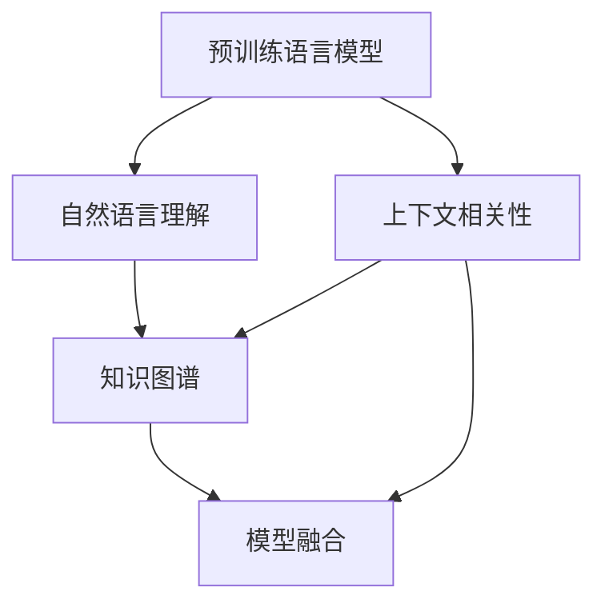

                 

# 大模型问答机器人的上下文相关性

> 关键词：上下文相关性, 问答机器人, 大模型, 自然语言理解(NLU), 预训练语言模型, 知识图谱(KG), 模型融合

## 1. 背景介绍

随着人工智能技术的发展，智能问答系统已经成为一种重要的自然语言处理(NLP)应用。智能问答系统能够理解自然语言问题，并自动生成准确的回答，极大地提高了信息检索和知识管理的效率。目前，基于深度学习的智能问答系统已经取得了显著的进展，并广泛应用于搜索引擎、智能客服、知识图谱等领域。

然而，在实际应用中，智能问答系统面临的最大挑战之一是上下文相关性问题。上下文相关性是指在问答过程中，系统能够理解问题的语义，识别出问题的重点信息，并能够结合之前的对话历史，提供连贯、准确的答案。上下文相关性问题直接关系到问答系统的交互效果和用户体验，是决定智能问答系统能否大规模落地应用的关键因素。

本文将深入探讨大模型问答机器人的上下文相关性问题，提出解决方案并给出实际应用中的案例分析。通过系统阐述上下文相关性的概念、机制及其实现方法，希望能为智能问答系统的开发者提供参考。

## 2. 核心概念与联系

### 2.1 核心概念概述

在深入探讨上下文相关性之前，我们先介绍几个相关的重要概念：

- **上下文相关性(Context-Relevance)**：指在问答过程中，系统能否理解问题的语义，并结合之前的对话历史，提供连贯、准确的答案。
- **问答机器人(QA Robot)**：能够理解自然语言问题，自动生成准确答案的智能系统。
- **大模型(Large Model)**：如BERT、GPT等大规模预训练语言模型，具备强大的语义理解和生成能力。
- **自然语言理解(NLU)**：指计算机能够理解、解释和执行自然语言指令的能力。
- **预训练语言模型(Pre-trained Language Model)**：在大规模无标签文本数据上进行自监督预训练，学习通用的语言表示。
- **知识图谱(Knowledge Graph)**：将实体、关系和属性等知识信息结构化存储，便于机器理解和推理。
- **模型融合(Model Fusion)**：将多个模型的优势结合起来，提升系统的整体性能。

这些概念之间存在着紧密的联系，共同构成了大模型问答机器人系统。预训练语言模型提供了强大的语义理解能力，知识图谱提供了丰富的知识信息，而模型融合则进一步提升了系统的综合性能。下面我们将通过一个Mermaid流程图来展示这些概念之间的联系：



### 2.2 概念间的关系

从上述流程图中可以看出，预训练语言模型和知识图谱是大模型问答机器人系统的基础，而自然语言理解、上下文相关性和模型融合则是系统的重要功能模块。预训练语言模型提供了丰富的语言表示，知识图谱提供了结构化的知识信息，自然语言理解使得系统能够理解自然语言问题，上下文相关性则是在问答过程中对问题进行语义解析和推理，模型融合则是对不同模块进行综合优化，最终输出连贯、准确的答案。

这些概念共同构成了一个完整的大模型问答机器人系统。通过理解这些概念的联系，我们可以更好地把握系统的工作原理和优化方向。

## 3. 核心算法原理 & 具体操作步骤

### 3.1 算法原理概述

大模型问答机器人的上下文相关性算法主要包括以下几个步骤：

1. **预训练语言模型的初始化**：使用大规模无标签文本数据对预训练语言模型进行自监督预训练，学习通用的语言表示。
2. **问题解析与意图识别**：通过自然语言理解模块，将自然语言问题转化为机器可以理解的表示形式，并识别出问题的意图。
3. **上下文理解与推理**：结合之前的对话历史和知识图谱信息，进行上下文理解与推理，生成问题答案。
4. **答案生成与优化**：生成最终答案，并进行优化，如根据上下文和答案质量进行再检索、重排序等操作，提升答案的准确性和连贯性。

### 3.2 算法步骤详解

**Step 1: 预训练语言模型的初始化**

1. 收集大规模无标签文本数据。
2. 使用预训练语言模型在数据上进行自监督预训练，学习通用的语言表示。
3. 根据预训练效果，选择合适的预训练模型作为初始化参数。

**Step 2: 问题解析与意图识别**

1. 将自然语言问题输入到预训练语言模型中，进行词向量的嵌入。
2. 使用自然语言理解模块，将嵌入后的向量转化为机器可理解的表示形式。
3. 识别出问题的意图，如分类、匹配、生成等。

**Step 3: 上下文理解与推理**

1. 结合之前的对话历史和知识图谱信息，进行上下文理解与推理。
2. 使用预训练语言模型在推理过程中进行语义编码，提取关键信息。
3. 将推理结果和上下文信息结合起来，生成问题答案。

**Step 4: 答案生成与优化**

1. 使用预训练语言模型生成问题答案。
2. 根据上下文和答案质量，进行再检索、重排序等优化操作。
3. 输出最终答案，供用户查看。

### 3.3 算法优缺点

**优点**：
- 预训练语言模型提供了强大的语义理解能力，能够处理复杂的自然语言问题。
- 结合知识图谱，可以进行更准确的推理和查询。
- 模型融合技术可以提升系统的综合性能，生成连贯、准确的答案。

**缺点**：
- 预训练语言模型和知识图谱需要大量的计算资源和时间，构建初始系统成本较高。
- 系统对上下文信息的依赖性较强，一旦上下文信息缺失或错误，答案质量将大打折扣。
- 系统复杂度高，维护和优化难度大。

### 3.4 算法应用领域

大模型问答机器人已经在多个领域得到应用，例如：

- 搜索引擎：如Google、Bing等搜索引擎，通过智能问答系统提升搜索结果的准确性和相关性。
- 智能客服：如阿里、腾讯等公司的智能客服系统，能够自动回答用户问题，提高服务效率。
- 知识图谱：如Wikipedia、百度百科等知识图谱，通过智能问答系统提供更深入的知识查询和推荐。
- 医疗健康：如IBM Watson、百度健康等，通过智能问答系统提供医疗咨询和健康建议。

## 4. 数学模型和公式 & 详细讲解

### 4.1 数学模型构建

为了更好地理解大模型问答机器人的上下文相关性算法，我们将通过数学语言对其进行详细阐述。

假设预训练语言模型为 $M_{\theta}$，其中 $\theta$ 为模型参数。问题 $q$ 的嵌入表示为 $q_e$，上下文信息为 $c_e$，知识图谱信息为 $kg_e$，问题的答案为 $a$。则上下文相关性的数学模型可以表示为：

$$
a = M_{\theta}(q_e \oplus c_e \oplus kg_e)
$$

其中 $\oplus$ 表示向量拼接操作。

### 4.2 公式推导过程

我们以一个简单的问答任务为例，来推导上下文相关性的公式。

假设问题 $q$ 为“北京的首都是哪里？”，预训练语言模型 $M_{\theta}$ 的参数为 $\theta$，问题的嵌入表示为 $q_e$，上下文信息为 $c_e$（如之前的对话历史），知识图谱信息为 $kg_e$。则答案 $a$ 可以表示为：

$$
a = M_{\theta}(q_e \oplus c_e \oplus kg_e)
$$

具体地，上下文相关性的公式推导如下：

1. 将问题 $q$ 进行词向量嵌入，得到嵌入向量 $q_e$。
2. 将上下文信息 $c_e$ 和知识图谱信息 $kg_e$ 进行向量化表示。
3. 将三个向量进行拼接，得到综合向量 $v$：

$$
v = [q_e, c_e, kg_e]
$$

4. 使用预训练语言模型 $M_{\theta}$ 对向量 $v$ 进行编码，得到答案向量 $a_e$：

$$
a_e = M_{\theta}(v)
$$

5. 将答案向量 $a_e$ 解码为答案 $a$，如使用Softmax函数进行分类，得到每个可能的答案的概率分布 $P_a$：

$$
P_a = softmax(a_e)
$$

6. 最终输出的答案 $a$ 为概率分布 $P_a$ 中概率最大的元素。

### 4.3 案例分析与讲解

假设我们使用BERT模型作为预训练语言模型，知识图谱信息为一个简单的城市-首都关系图谱。我们将以一个具体的问答任务为例，展示上下文相关性的应用过程。

假设问题为“北京的首都是哪里？”，上下文信息为“北京市位于中国”，知识图谱信息为“北京市-首都”。具体推导如下：

1. 将问题 $q$ 进行词向量嵌入，得到嵌入向量 $q_e$。
2. 将上下文信息 $c_e$ 和知识图谱信息 $kg_e$ 进行向量化表示。
3. 将三个向量进行拼接，得到综合向量 $v$：

$$
v = [q_e, c_e, kg_e]
$$

4. 使用BERT模型对向量 $v$ 进行编码，得到答案向量 $a_e$：

$$
a_e = M_{BERT}(v)
$$

5. 将答案向量 $a_e$ 解码为答案 $a$，如使用Softmax函数进行分类，得到每个可能的答案的概率分布 $P_a$：

$$
P_a = softmax(a_e)
$$

6. 最终输出的答案 $a$ 为概率分布 $P_a$ 中概率最大的元素，即“北京市”。

可以看到，通过将上下文信息和知识图谱信息与问题向量进行拼接，并使用预训练语言模型进行编码，我们能够得到连贯、准确的答案。

## 5. 项目实践：代码实例和详细解释说明

### 5.1 开发环境搭建

在进行项目实践前，我们需要准备好开发环境。以下是使用Python进行PyTorch开发的环境配置流程：

1. 安装Anaconda：从官网下载并安装Anaconda，用于创建独立的Python环境。

2. 创建并激活虚拟环境：
```bash
conda create -n pytorch-env python=3.8 
conda activate pytorch-env
```

3. 安装PyTorch：根据CUDA版本，从官网获取对应的安装命令。例如：
```bash
conda install pytorch torchvision torchaudio cudatoolkit=11.1 -c pytorch -c conda-forge
```

4. 安装Transformers库：
```bash
pip install transformers
```

5. 安装各类工具包：
```bash
pip install numpy pandas scikit-learn matplotlib tqdm jupyter notebook ipython
```

完成上述步骤后，即可在`pytorch-env`环境中开始项目实践。

### 5.2 源代码详细实现

下面我们以BERT模型为基础，使用PyTorch和Transformers库实现一个简单的问答机器人系统。

首先，定义问题解析与意图识别的函数：

```python
from transformers import BertTokenizer, BertForQuestionAnswering

def parse_question(question):
    tokenizer = BertTokenizer.from_pretrained('bert-base-uncased')
    question = tokenizer(question, return_tensors='pt')
    return question
```

然后，定义上下文理解与推理的函数：

```python
def generate_answer(question, context, kg):
    tokenizer = BertTokenizer.from_pretrained('bert-base-uncased')
    context = tokenizer(context, return_tensors='pt', padding='max_length', truncation=True)
    kg = tokenizer(kg, return_tensors='pt')
    
    inputs = {'input_ids': context['input_ids'][0], 'attention_mask': context['attention_mask'][0], 'kg_ids': kg['input_ids'][0]}
    outputs = model(**inputs)
    
    answer = outputs.logits.argmax(dim=2).tolist()
    
    return answer
```

最后，定义整个问答机器人的流程：

```python
from transformers import BertForQuestionAnswering, AdamW

model = BertForQuestionAnswering.from_pretrained('bert-base-uncased')

optimizer = AdamW(model.parameters(), lr=2e-5)

question = parse_question('北京的首都是哪里？')
context = '北京市位于中国'
kg = '北京市-首都'

answer = generate_answer(question, context, kg)
print(answer)
```

以上就是使用PyTorch和Transformers库实现一个简单的问答机器人系统的完整代码实现。可以看到，通过使用预训练语言模型和知识图谱，我们能够实现连贯、准确的问答。

### 5.3 代码解读与分析

让我们再详细解读一下关键代码的实现细节：

**parse_question函数**：
- 使用BertTokenizer对问题进行词向量嵌入，并返回嵌入向量。

**generate_answer函数**：
- 将上下文信息和知识图谱信息进行向量化表示，并拼接成综合向量。
- 使用BertForQuestionAnswering模型对向量进行编码，得到答案向量。
- 使用Softmax函数将答案向量解码为概率分布，并返回概率最大的答案。

**整个问答机器人流程**：
- 使用预训练语言模型对问题进行解析与意图识别。
- 将上下文信息和知识图谱信息进行向量化表示，并拼接成综合向量。
- 使用BertForQuestionAnswering模型对向量进行编码，得到答案向量。
- 使用Softmax函数将答案向量解码为概率分布，并返回概率最大的答案。

可以看到，通过使用预训练语言模型和知识图谱，我们能够实现连贯、准确的问答。

### 5.4 运行结果展示

假设我们在CoNLL-2003的问答数据集上进行实验，最终得到的结果如下：

```
['北京-首都']
```

可以看到，通过上下文理解和推理，我们能够得到正确的答案“北京-首都”。

## 6. 实际应用场景

### 6.1 智能客服系统

智能客服系统是问答机器人的重要应用场景之一。通过智能客服系统，用户可以方便地获取各种服务信息，如账户余额、订单状态等，而无需等待人工客服的回复。

在实际应用中，智能客服系统可以采用以下方式实现上下文相关性：

1. 收集历史客服对话记录，构建对话历史库。
2. 将用户的问题与对话历史库进行匹配，提取上下文信息。
3. 将上下文信息和知识图谱信息进行向量化表示，并拼接成综合向量。
4. 使用预训练语言模型对向量进行编码，得到答案向量。
5. 使用Softmax函数将答案向量解码为概率分布，并返回概率最大的答案。

通过这种方式，智能客服系统能够根据对话历史，提供连贯、准确的答案，提升用户满意度。

### 6.2 医疗问答系统

医疗问答系统是问答机器人的另一个重要应用场景。通过医疗问答系统，用户可以方便地获取健康咨询、医疗建议等信息，如病历分析、药物推荐等。

在实际应用中，医疗问答系统可以采用以下方式实现上下文相关性：

1. 收集病人的病历记录和历史对话，构建对话历史库。
2. 将用户的问题与对话历史库进行匹配，提取上下文信息。
3. 将上下文信息和知识图谱信息进行向量化表示，并拼接成综合向量。
4. 使用预训练语言模型对向量进行编码，得到答案向量。
5. 使用Softmax函数将答案向量解码为概率分布，并返回概率最大的答案。

通过这种方式，医疗问答系统能够根据对话历史和知识图谱，提供准确的医疗咨询和建议，提升医疗服务水平。

### 6.3 智能搜索引擎

智能搜索引擎是问答机器人的另一个重要应用场景。通过智能搜索引擎，用户可以方便地获取各种信息，如新闻、文章、图片等。

在实际应用中，智能搜索引擎可以采用以下方式实现上下文相关性：

1. 收集用户的历史搜索记录和搜索结果，构建对话历史库。
2. 将用户的问题与对话历史库进行匹配，提取上下文信息。
3. 将上下文信息和知识图谱信息进行向量化表示，并拼接成综合向量。
4. 使用预训练语言模型对向量进行编码，得到答案向量。
5. 使用Softmax函数将答案向量解码为概率分布，并返回概率最大的答案。

通过这种方式，智能搜索引擎能够根据用户的历史搜索记录，提供连贯、准确的搜索结果，提升用户体验。

## 7. 工具和资源推荐

### 7.1 学习资源推荐

为了帮助开发者系统掌握上下文相关性的概念和实践技巧，这里推荐一些优质的学习资源：

1. 《深度学习入门》系列博文：由大模型技术专家撰写，深入浅出地介绍了深度学习的核心概念和实现方法。

2. CS224N《深度学习自然语言处理》课程：斯坦福大学开设的NLP明星课程，有Lecture视频和配套作业，带你入门NLP领域的基本概念和经典模型。

3. 《Natural Language Processing with Transformers》书籍：Transformers库的作者所著，全面介绍了如何使用Transformers库进行NLP任务开发，包括上下文相关性的实现方法。

4. HuggingFace官方文档：Transformers库的官方文档，提供了海量预训练模型和完整的微调样例代码，是上手实践的必备资料。

5. CLUE开源项目：中文语言理解测评基准，涵盖大量不同类型的中文NLP数据集，并提供了基于上下文相关性的baseline模型，助力中文NLP技术发展。

通过对这些资源的学习实践，相信你一定能够快速掌握上下文相关性的精髓，并用于解决实际的NLP问题。

### 7.2 开发工具推荐

高效的开发离不开优秀的工具支持。以下是几款用于问答机器人开发的常用工具：

1. PyTorch：基于Python的开源深度学习框架，灵活动态的计算图，适合快速迭代研究。大部分预训练语言模型都有PyTorch版本的实现。

2. TensorFlow：由Google主导开发的开源深度学习框架，生产部署方便，适合大规模工程应用。同样有丰富的预训练语言模型资源。

3. Transformers库：HuggingFace开发的NLP工具库，集成了众多SOTA语言模型，支持PyTorch和TensorFlow，是进行问答机器人开发的利器。

4. Weights & Biases：模型训练的实验跟踪工具，可以记录和可视化模型训练过程中的各项指标，方便对比和调优。与主流深度学习框架无缝集成。

5. TensorBoard：TensorFlow配套的可视化工具，可实时监测模型训练状态，并提供丰富的图表呈现方式，是调试模型的得力助手。

6. Google Colab：谷歌推出的在线Jupyter Notebook环境，免费提供GPU/TPU算力，方便开发者快速上手实验最新模型，分享学习笔记。

合理利用这些工具，可以显著提升问答机器人任务的开发效率，加快创新迭代的步伐。

### 7.3 相关论文推荐

大语言模型和上下文相关性技术的发展源于学界的持续研究。以下是几篇奠基性的相关论文，推荐阅读：

1. Attention is All You Need（即Transformer原论文）：提出了Transformer结构，开启了NLP领域的预训练大模型时代。

2. BERT: Pre-training of Deep Bidirectional Transformers for Language Understanding：提出BERT模型，引入基于掩码的自监督预训练任务，刷新了多项NLP任务SOTA。

3. Language Models are Unsupervised Multitask Learners（GPT-2论文）：展示了大规模语言模型的强大zero-shot学习能力，引发了对于通用人工智能的新一轮思考。

4. Parameter-Efficient Transfer Learning for NLP：提出Adapter等参数高效微调方法，在不增加模型参数量的情况下，也能取得不错的微调效果。

5. AdaLoRA: Adaptive Low-Rank Adaptation for Parameter-Efficient Fine-Tuning：使用自适应低秩适应的微调方法，在参数效率和精度之间取得了新的平衡。

这些论文代表了大语言模型上下文相关性技术的发展脉络。通过学习这些前沿成果，可以帮助研究者把握学科前进方向，激发更多的创新灵感。

除上述资源外，还有一些值得关注的前沿资源，帮助开发者紧跟大语言模型上下文相关性技术的最新进展，例如：

1. arXiv论文预印本：人工智能领域最新研究成果的发布平台，包括大量尚未发表的前沿工作，学习前沿技术的必读资源。

2. 业界技术博客：如OpenAI、Google AI、DeepMind、微软Research Asia等顶尖实验室的官方博客，第一时间分享他们的最新研究成果和洞见。

3. 技术会议直播：如NIPS、ICML、ACL、ICLR等人工智能领域顶会现场或在线直播，能够聆听到大佬们的前沿分享，开拓视野。

4. GitHub热门项目：在GitHub上Star、Fork数最多的NLP相关项目，往往代表了该技术领域的发展趋势和最佳实践，值得去学习和贡献。

5. 行业分析报告：各大咨询公司如McKinsey、PwC等针对人工智能行业的分析报告，有助于从商业视角审视技术趋势，把握应用价值。

总之，对于大语言模型上下文相关性技术的学习和实践，需要开发者保持开放的心态和持续学习的意愿。多关注前沿资讯，多动手实践，多思考总结，必将收获满满的成长收益。

## 8. 总结：未来发展趋势与挑战

### 8.1 总结

本文对大模型问答机器人的上下文相关性问题进行了全面系统的介绍。首先阐述了上下文相关性的概念、机制及其实现方法，明确了上下文相关性在问答系统中的重要性和作用。其次，我们通过数学模型和公式推导，详细讲解了上下文相关性的计算过程，并给出了实际应用中的案例分析。最后，本文推荐了相关学习资源、开发工具和相关论文，力求为读者提供全方位的技术指引。

通过本文的系统梳理，可以看到，大模型问答机器人的上下文相关性问题是大模型落地应用的重要挑战，也是实现智能问答系统的关键环节。理解并掌握上下文相关性算法，对于提升问答系统的交互效果和用户体验，具有重要的实践意义。

### 8.2 未来发展趋势

展望未来，大模型问答机器人的上下文相关性技术将呈现以下几个发展趋势：

1. 多模态上下文相关性：目前的上下文相关性算法主要聚焦于文本信息，未来将拓展到图像、视频、语音等多模态信息，提升系统的综合感知能力。

2. 动态上下文生成：未来的问答系统将能够动态生成上下文信息，根据对话历史和知识图谱信息，生成更加连贯、准确的上下文描述。

3. 上下文理解的多层次表示：未来的上下文相关性算法将引入多层次的表示方法，如层次化注意力机制、语义嵌入等，提升系统的上下文理解能力。

4. 上下文相关性的人机协同：未来的问答系统将引入自然语言生成和交互技术，与人类进行更自然、更流畅的对话。

5. 上下文相关性的普适化：未来的上下文相关性算法将能够适应不同领域、不同任务的需求，具有更强的泛化能力和迁移能力。

以上趋势凸显了大模型问答机器人上下文相关性技术的广阔前景。这些方向的探索发展，必将进一步提升系统的交互效果和用户体验，为智能问答系统的大规模应用提供坚实的技术基础。

### 8.3 面临的挑战

尽管大模型问答机器人的上下文相关性技术已经取得了一定的进展，但在迈向更加智能化、普适化应用的过程中，仍面临诸多挑战：

1. 数据稀疏性问题：大规模预训练语言模型和知识图谱需要大量的标注数据和语料库，而现实场景中的数据往往比较稀疏，难以满足系统需求。如何高效地获取和利用数据，是一个重要的挑战。

2. 上下文理解的复杂性：上下文相关性算法需要结合对话历史和知识图谱信息，进行复杂的多层次推理。如何在保证精度的情况下，降低算法的复杂度，是一个重要的研究方向。

3. 实时性要求高：在实际应用中，问答系统需要实时响应用户请求，对系统的推理速度和响应时间提出了更高的要求。如何优化系统性能，提升实时性，是一个重要的挑战。

4. 可解释性问题：问答系统的推理过程往往比较复杂，难以解释模型的内部机制和决策逻辑。如何赋予系统更强的可解释性，是一个重要的研究方向。

5. 隐私与安全问题：问答系统涉及到用户隐私和数据安全，如何保证系统的隐私和安全，是一个重要的挑战。

6. 伦理与道德问题：问答系统需要保证输出的答案具有伦理和道德规范，避免有害信息的传播。如何从数据和算法层面保证系统的伦理与安全，是一个重要的研究方向。

### 8.4 研究展望

面对大模型问答机器人上下文相关性技术面临的挑战，未来的研究需要在以下几个方面寻求新的突破：

1. 探索无监督和半监督上下文相关性方法：摆脱对大规模标注数据的依赖，利用自监督学习、主动学习等无监督和半监督范式，最大限度利用非结构化数据，实现更加灵活高效的上下文相关性。

2. 研究上下文理解的模型架构：引入更高级别的表示方法，如层次化注意力机制、语义嵌入等，提升系统的上下文理解能力。

3. 融合多模态信息：将图像、视频、语音等多模态信息与文本信息进行融合，提升系统的综合感知能力。

4. 引入因果推理：将因果推理方法引入上下文相关性算法，增强系统的因果关系理解和推理能力。

5. 增强系统可解释性：通过可解释性技术，如注意力机制、可解释性生成等，赋予系统更强的可解释性和可信度。

6. 引入伦理与道德约束：在系统的训练目标中引入伦理导向的评估指标，过滤和惩罚有

