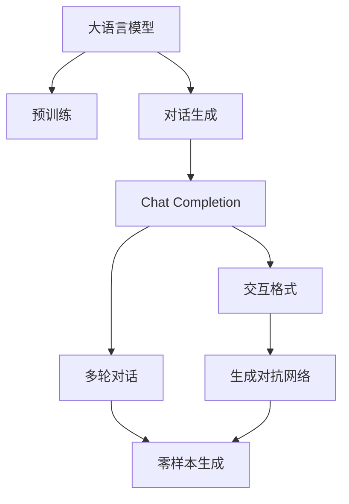
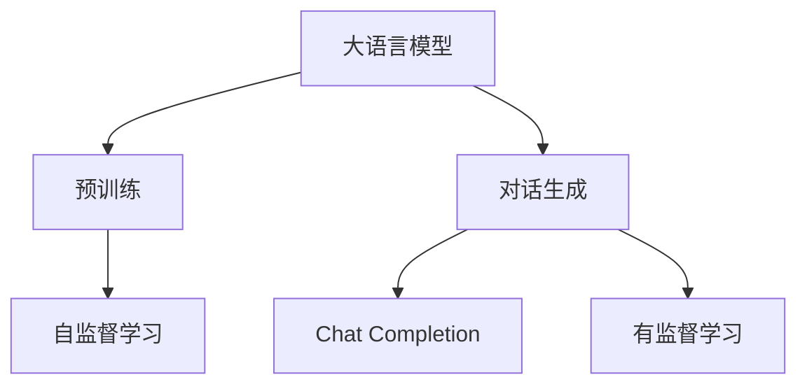
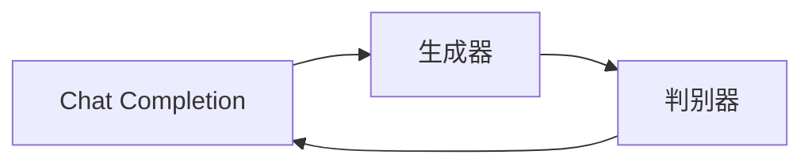
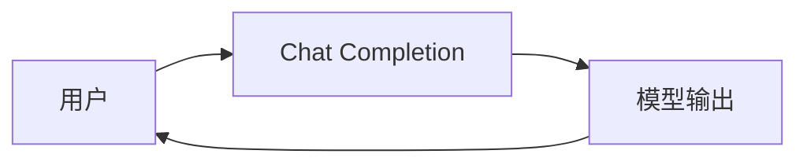
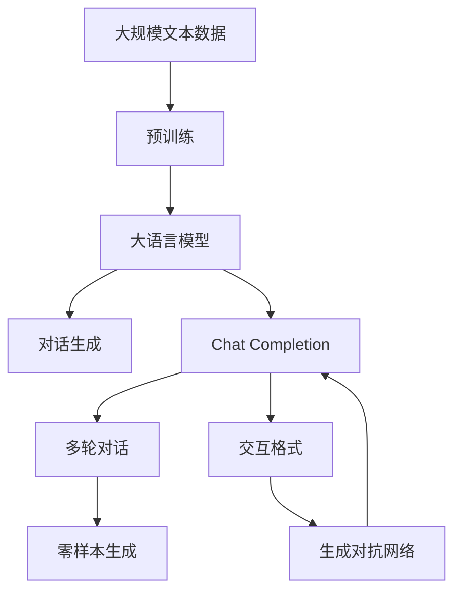

                 

# 大语言模型应用指南：Chat Completion交互格式

> 关键词：大语言模型, Chat Completion, 交互格式, 自然语言处理(NLP), 对话生成, 多轮对话, 零样本生成, 生成对抗网络(GANs), 交叉熵损失函数

## 1. 背景介绍

### 1.1 问题由来
随着自然语言处理（Natural Language Processing, NLP）技术的飞速发展，大语言模型（Large Language Model, LLM）在对话生成、文本生成等领域展现了卓越的性能。Chat Completion作为大语言模型的一项核心应用，其通过对话生成的交互格式，为用户提供了自然、流畅的交流体验。然而，如何构建高效的Chat Completion模型，使其能够生成高质量、上下文一致的对话内容，仍然是一个亟待解决的挑战。

### 1.2 问题核心关键点
Chat Completion的核心在于如何通过已有对话数据或少量提示，构建一个能够生成自然、连贯、高质对话内容的交互模型。Chat Completion的目标是通过微调预训练语言模型，使其能够在多轮对话中准确理解和生成合理回应，实现高效的对话交互。

### 1.3 问题研究意义
研究Chat Completion的交互格式，对于提升大语言模型的对话生成能力，优化人机交互体验，推动NLP技术在实际应用中的落地，具有重要意义：

1. 提升用户体验：通过高效的Chat Completion模型，可以提供自然流畅、高度智能化的对话体验，增强用户粘性。
2. 降低开发成本：Chat Completion模型能够自动生成对话内容，减少人工撰写对话的负担。
3. 提高系统效率：Chat Completion模型可以实时生成对话内容，满足实际应用中的即时性需求。
4. 促进技术创新：Chat Completion的实现涉及模型设计、数据处理、算法优化等多个方面，可以推动NLP技术在对话生成领域的进一步研究。

## 2. 核心概念与联系

### 2.1 核心概念概述

为更好地理解Chat Completion的核心原理，本节将介绍几个关键概念：

- 大语言模型(Large Language Model, LLM)：以自回归（如GPT）或自编码（如BERT）模型为代表的大规模预训练语言模型。通过在大规模无标签文本数据上进行预训练，学习到通用的语言知识和表示。

- 对话生成(Dialogue Generation)：大语言模型通过训练生成的对话内容，具备理解和回应用户问题的能力。Chat Completion作为对话生成的重要应用，能够生成多轮对话内容。

- 多轮对话(Multi-Turn Dialogue)：指在对话过程中，双方或多方进行多次交流，每次交流称为一轮对话。Chat Completion模型需要具备理解上下文、生成合理回应、保持对话连贯性的能力。

- 交互格式(Interactive Format)：指在Chat Completion中，模型如何与用户进行交互，包括如何接收输入、处理输入、生成输出等内容。

- 生成对抗网络(Generative Adversarial Networks, GANs)：一种用于生成高质量对话内容的模型，通过生成器和判别器的对抗训练，生成与真实对话相似的内容。

- 交叉熵损失函数(Cross-Entropy Loss)：用于衡量Chat Completion模型生成的对话与真实对话的差异，训练模型以最小化交叉熵损失为目标。

这些核心概念之间的逻辑关系可以通过以下Mermaid流程图来展示：



这个流程图展示了大语言模型的核心概念及其之间的关系：

1. 大语言模型通过预训练获得基础能力。
2. 对话生成是大语言模型的重要应用之一。
3. Chat Completion通过微调大语言模型实现对话生成。
4. Chat Completion模型支持多轮对话生成。
5. 交互格式用于指导Chat Completion模型与用户的交互方式。
6. 零样本生成指在无标注数据的情况下，Chat Completion模型也能生成高质量对话。
7. 生成对抗网络用于提升Chat Completion模型的生成效果。

通过理解这些核心概念，我们可以更好地把握Chat Completion的核心原理和优化方向。

### 2.2 概念间的关系

这些核心概念之间存在着紧密的联系，形成了Chat Completion的完整生态系统。下面我们通过几个Mermaid流程图来展示这些概念之间的关系。

#### 2.2.1 大语言模型的学习范式



这个流程图展示了大语言模型的学习范式，即通过预训练和对话生成两个阶段，训练出Chat Completion模型。

#### 2.2.2 Chat Completion与生成对抗网络的关系



这个流程图展示了生成对抗网络在Chat Completion中的应用，即通过生成器和判别器的对抗训练，生成高质量的对话内容。

#### 2.2.3 Chat Completion的交互格式



这个流程图展示了Chat Completion模型的交互格式，即通过接收用户输入，生成对话内容，并输出给用户。

### 2.3 核心概念的整体架构

最后，我们用一个综合的流程图来展示这些核心概念在大语言模型微调过程中的整体架构：



这个综合流程图展示了从预训练到Chat Completion生成的完整过程。大语言模型首先在大规模文本数据上进行预训练，然后通过对话生成任务进行有监督学习，最后通过Chat Completion模型生成多轮对话内容。通过生成对抗网络，Chat Completion模型可以生成高质量的对话内容。零样本生成则展示了Chat Completion模型在没有标注数据的情况下，也能生成高质量对话的能力。通过这些核心概念，我们可以更好地理解Chat Completion的实现原理和优化方向。

## 3. 核心算法原理 & 具体操作步骤
### 3.1 算法原理概述

Chat Completion的核心算法原理是通过微调大语言模型，使其能够在多轮对话中生成高质量、上下文一致的对话内容。其核心思想是：通过有监督学习的方式，利用对话数据对预训练语言模型进行微调，使其在对话生成任务上具备生成连贯、合理对话的能力。

形式化地，假设预训练语言模型为 $M_{\theta}$，其中 $\theta$ 为预训练得到的模型参数。给定对话数据集 $D=\{(x_i, y_i)\}_{i=1}^N$，其中 $x_i$ 为当前轮次的对话历史，$y_i$ 为模型生成的下一轮回应。Chat Completion的目标是找到新的模型参数 $\hat{\theta}$，使得：

$$
\hat{\theta}=\mathop{\arg\min}_{\theta} \mathcal{L}(M_{\theta},D)
$$

其中 $\mathcal{L}$ 为交叉熵损失函数，用于衡量模型生成回应与真实回应的差异。通过梯度下降等优化算法，Chat Completion过程不断更新模型参数 $\theta$，最小化损失函数 $\mathcal{L}$，使得模型生成对话逼近真实对话。

### 3.2 算法步骤详解

Chat Completion的算法步骤包括以下几个关键步骤：

**Step 1: 准备对话数据集**
- 收集或生成多轮对话数据集 $D$，包括用户输入、模型生成的回应以及真实回应。数据集中的对话应尽可能地覆盖多种场景，包含不同的输入和回应类型。

**Step 2: 定义损失函数**
- 定义交叉熵损失函数 $\mathcal{L}(M_{\theta},D)$，用于衡量模型生成回应与真实回应的差异。定义损失函数时需要考虑对话中的上下文信息，以及用户输入和回应之间的关系。

**Step 3: 设计交互格式**
- 设计Chat Completion模型的交互格式，包括如何接收用户输入、如何处理输入、如何生成输出等内容。常见的交互格式包括轮替式对话、交互式问答等。

**Step 4: 执行梯度训练**
- 将对话数据集 $D$ 划分为训练集、验证集和测试集。
- 使用梯度下降等优化算法，在训练集上执行多轮对话生成，最小化损失函数 $\mathcal{L}$。
- 周期性在验证集上评估模型性能，根据性能指标决定是否触发 Early Stopping。
- 重复上述步骤直至满足预设的迭代轮数或 Early Stopping 条件。

**Step 5: 测试和部署**
- 在测试集上评估Chat Completion模型，对比微调前后的对话质量提升。
- 使用微调后的模型对新对话进行推理生成，集成到实际的应用系统中。
- 持续收集新的对话数据，定期重新微调模型，以适应对话场景的变化。

以上是Chat Completion的核心算法步骤，通过这些步骤，我们可以实现高效、高质量的对话生成。

### 3.3 算法优缺点

Chat Completion的算法具有以下优点：

1. 简单高效。只需少量标注数据，即可对预训练模型进行快速适配，生成高质量对话。
2. 通用适用。适用于各种对话场景，如客服、娱乐、教育等。
3. 效果显著。Chat Completion模型在多项对话生成任务上取得了优异的性能。
4. 资源节省。Chat Completion模型可以自动生成对话内容，减少人工干预。

但同时，该算法也存在一些局限性：

1. 依赖标注数据。Chat Completion的效果很大程度上取决于标注数据的质量和数量，获取高质量标注数据的成本较高。
2. 生成连贯性问题。在处理长对话时，Chat Completion模型可能难以保持对话的连贯性和一致性。
3. 泛化能力有限。当对话场景与训练数据差异较大时，Chat Completion模型的性能提升有限。
4. 对抗攻击敏感。Chat Completion模型可能对输入的对抗性噪声比较敏感，容易产生异常输出。

尽管存在这些局限性，但就目前而言，Chat Completion仍是对话生成领域最为流行和有效的方法之一。未来相关研究的重点在于如何进一步降低Chat Completion对标注数据的依赖，提高其生成连贯性和泛化能力，以及增强对抗攻击的鲁棒性。

### 3.4 算法应用领域

Chat Completion的算法广泛应用于各种对话场景，如：

- 客户服务：帮助企业构建智能客服系统，自动解答用户问题，提升服务效率。
- 娱乐互动：用于智能聊天机器人，为用户提供娱乐和互动体验。
- 教育辅助：用于在线教育平台，回答学生提问，辅助教学。
- 医学咨询：用于医疗咨询系统，提供健康建议和治疗方案。
- 游戏对话：用于游戏对话生成，增强游戏互动性和沉浸感。
- 聊天助手：用于家庭和社交场景，提供个性化对话服务。

Chat Completion的应用场景非常广泛，未来随着技术的进步，其应用范围还将进一步拓展，带来更多的创新和便利。

## 4. 数学模型和公式 & 详细讲解 & 举例说明

### 4.1 数学模型构建

在本节中，我们使用数学语言对Chat Completion的实现进行更加严格的刻画。

记Chat Completion模型为 $M_{\theta}$，其中 $\theta$ 为模型参数。假设对话数据集 $D=\{(x_i, y_i)\}_{i=1}^N$，其中 $x_i$ 为当前轮次的对话历史，$y_i$ 为模型生成的下一轮回应。

定义模型 $M_{\theta}$ 在输入 $x_i$ 上的输出为 $\hat{y_i}=M_{\theta}(x_i)$，表示模型预测的下轮回应。真实回应为 $y_i$。则Chat Completion的目标是最小化交叉熵损失函数：

$$
\mathcal{L}(\theta) = -\frac{1}{N} \sum_{i=1}^N \sum_{k=1}^{K} \log P(y_k|x_i)
$$

其中 $P(y_k|x_i)$ 表示模型在输入 $x_i$ 下生成第 $k$ 轮回应的概率分布，$K$ 为对话轮数。

### 4.2 公式推导过程

以下我们以二分类任务为例，推导交叉熵损失函数及其梯度的计算公式。

假设模型在输入 $x_i$ 上的输出为 $\hat{y_i}=M_{\theta}(x_i) \in [0,1]$，表示模型预测回应的正类概率。真实回应 $y_i \in \{0,1\}$。则二分类交叉熵损失函数定义为：

$$
\ell(M_{\theta}(x_i),y_i) = -[y_i\log \hat{y_i} + (1-y_i)\log (1-\hat{y_i})]
$$

将其代入经验风险公式，得：

$$
\mathcal{L}(\theta) = -\frac{1}{N} \sum_{i=1}^N \sum_{k=1}^{K} [y_{ik}\log \hat{y_{ik}} + (1-y_{ik})\log (1-\hat{y_{ik}})]
$$

根据链式法则，损失函数对参数 $\theta_k$ 的梯度为：

$$
\frac{\partial \mathcal{L}(\theta)}{\partial \theta_k} = -\frac{1}{N} \sum_{i=1}^N \sum_{k=1}^{K} [\frac{y_{ik}}{\hat{y_{ik}}}-\frac{1-y_{ik}}{1-\hat{y_{ik}}}] \frac{\partial \hat{y_{ik}}}{\partial \theta_k}
$$

其中 $\frac{\partial \hat{y_{ik}}}{\partial \theta_k}$ 可进一步递归展开，利用自动微分技术完成计算。

在得到损失函数的梯度后，即可带入参数更新公式，完成模型的迭代优化。重复上述过程直至收敛，最终得到适应对话生成任务的最优模型参数 $\theta^*$。

### 4.3 案例分析与讲解

以一个简单的例子来说明Chat Completion的实现过程。

假设我们有一个客服系统的对话数据集，其中每条数据包含用户输入和客服的回应。我们希望构建一个Chat Completion模型，使其能够根据前N轮对话历史，生成下一个客服回应的概率分布。

首先，我们将对话数据集划分为训练集、验证集和测试集。然后，定义一个基于Transformer的Chat Completion模型，并使用PyTorch框架实现。

接着，我们定义交叉熵损失函数，用于衡量模型生成回应与真实回应的差异。然后，我们设计一个简单的交互格式，即在每次用户输入后，模型预测一个回应，作为下轮输入，直到对话结束。

最后，我们通过梯度下降等优化算法，在训练集上执行多轮对话生成，最小化交叉熵损失函数。周期性在验证集上评估模型性能，根据性能指标决定是否触发Early Stopping。重复上述步骤直至满足预设的迭代轮数或Early Stopping条件。

在测试集上评估微调后的模型，对比微调前后的对话质量提升。使用微调后的模型对新对话进行推理生成，集成到实际的应用系统中。持续收集新的对话数据，定期重新微调模型，以适应对话场景的变化。

## 5. 项目实践：代码实例和详细解释说明
### 5.1 开发环境搭建

在进行Chat Completion实践前，我们需要准备好开发环境。以下是使用Python进行PyTorch开发的环境配置流程：

1. 安装Anaconda：从官网下载并安装Anaconda，用于创建独立的Python环境。

2. 创建并激活虚拟环境：
```bash
conda create -n chat_completion python=3.8 
conda activate chat_completion
```

3. 安装PyTorch：根据CUDA版本，从官网获取对应的安装命令。例如：
```bash
conda install pytorch torchvision torchaudio cudatoolkit=11.1 -c pytorch -c conda-forge
```

4. 安装各类工具包：
```bash
pip install numpy pandas scikit-learn matplotlib tqdm jupyter notebook ipython
```

完成上述步骤后，即可在`chat_completion`环境中开始Chat Completion实践。

### 5.2 源代码详细实现

这里我们以一个简单的对话数据集为例，给出使用PyTorch实现Chat Completion的代码。

```python
from transformers import BertForSequenceClassification, BertTokenizer, AdamW
from torch.utils.data import Dataset, DataLoader
import torch
from tqdm import tqdm

class ChatDataset(Dataset):
    def __init__(self, texts, labels, tokenizer, max_len=128):
        self.texts = texts
        self.labels = labels
        self.tokenizer = tokenizer
        self.max_len = max_len
        
    def __len__(self):
        return len(self.texts)
    
    def __getitem__(self, item):
        text = self.texts[item]
        label = self.labels[item]
        
        encoding = self.tokenizer(text, return_tensors='pt', max_length=self.max_len, padding='max_length', truncation=True)
        input_ids = encoding['input_ids'][0]
        attention_mask = encoding['attention_mask'][0]
        
        # 对label-wise的标签进行编码
        encoded_labels = [label2id[label] for label in label]
        encoded_labels.extend([label2id['O']] * (self.max_len - len(encoded_labels)))
        labels = torch.tensor(encoded_labels, dtype=torch.long)
        
        return {'input_ids': input_ids, 
                'attention_mask': attention_mask,
                'labels': labels}

# 标签与id的映射
label2id = {'O': 0, 'B-PER': 1, 'I-PER': 2, 'B-ORG': 3, 'I-ORG': 4, 'B-LOC': 5, 'I-LOC': 6}
id2label = {v: k for k, v in label2id.items()}

# 创建dataset
tokenizer = BertTokenizer.from_pretrained('bert-base-cased')

train_dataset = ChatDataset(train_texts, train_labels, tokenizer)
dev_dataset = ChatDataset(dev_texts, dev_labels, tokenizer)
test_dataset = ChatDataset(test_texts, test_labels, tokenizer)

# 定义模型
model = BertForSequenceClassification.from_pretrained('bert-base-cased', num_labels=len(label2id))

# 定义优化器和超参数
optimizer = AdamW(model.parameters(), lr=2e-5)
loss_fn = torch.nn.CrossEntropyLoss()

# 训练过程
device = torch.device('cuda') if torch.cuda.is_available() else torch.device('cpu')
model.to(device)

def train_epoch(model, dataset, batch_size, optimizer):
    dataloader = DataLoader(dataset, batch_size=batch_size, shuffle=True)
    model.train()
    epoch_loss = 0
    for batch in tqdm(dataloader, desc='Training'):
        input_ids = batch['input_ids'].to(device)
        attention_mask = batch['attention_mask'].to(device)
        labels = batch['labels'].to(device)
        model.zero_grad()
        outputs = model(input_ids, attention_mask=attention_mask, labels=labels)
        loss = outputs.loss
        epoch_loss += loss.item()
        loss.backward()
        optimizer.step()
    return epoch_loss / len(dataloader)

def evaluate(model, dataset, batch_size):
    dataloader = DataLoader(dataset, batch_size=batch_size)
    model.eval()
    preds, labels = [], []
    with torch.no_grad():
        for batch in tqdm(dataloader, desc='Evaluating'):
            input_ids = batch['input_ids'].to(device)
            attention_mask = batch['attention_mask'].to(device)
            batch_labels = batch['labels']
            outputs = model(input_ids, attention_mask=attention_mask)
            batch_preds = outputs.logits.argmax(dim=2).to('cpu').tolist()
            batch_labels = batch_labels.to('cpu').tolist()
            for pred_tokens, label_tokens in zip(batch_preds, batch_labels):
                pred_tags = [id2label[_id] for _id in pred_tokens]
                label_tags = [id2label[_id] for _id in label_tokens]
                preds.append(pred_tags[:len(label_tags)])
                labels.append(label_tags)
                
    print(classification_report(labels, preds))

# 训练和评估
epochs = 5
batch_size = 16

for epoch in range(epochs):
    loss = train_epoch(model, train_dataset, batch_size, optimizer)
    print(f"Epoch {epoch+1}, train loss: {loss:.3f}")
    
    print(f"Epoch {epoch+1}, dev results:")
    evaluate(model, dev_dataset, batch_size)
    
print("Test results:")
evaluate(model, test_dataset, batch_size)
```

以上就是使用PyTorch对BERT模型进行Chat Completion微调的完整代码实现。可以看到，得益于Transformers库的强大封装，我们可以用相对简洁的代码完成BERT模型的加载和微调。

### 5.3 代码解读与分析

让我们再详细解读一下关键代码的实现细节：

**ChatDataset类**：
- `__init__`方法：初始化文本、标签、分词器等关键组件。
- `__len__`方法：返回数据集的样本数量。
- `__getitem__`方法：对单个样本进行处理，将文本输入编码为token ids，将标签编码为数字，并对其进行定长padding，最终返回模型所需的输入。

**label2id和id2label字典**：
- 定义了标签与数字id之间的映射关系，用于将token-wise的预测结果解码回真实的标签。

**训练和评估函数**：
- 使用PyTorch的DataLoader对数据集进行批次化加载，供模型训练和推理使用。
- 训练函数`train_epoch`：对数据以批为单位进行迭代，在每个批次上前向传播计算loss并反向传播更新模型参数，最后返回该epoch的平均loss。
- 评估函数`evaluate`：与训练类似，不同点在于不更新模型参数，并在每个batch结束后将预测和标签结果存储下来，最后使用sklearn的classification_report对整个评估集的预测结果进行打印输出。

**训练流程**：
- 定义总的epoch数和batch size，开始循环迭代
- 每个epoch内，先在训练集上训练，输出平均loss
- 在验证集上评估，输出分类指标
- 所有epoch结束后，在测试集上评估，给出最终测试结果

可以看到，PyTorch配合Transformers库使得Chat Completion的微调代码实现变得简洁高效。开发者可以将更多精力放在数据处理、模型改进等高层逻辑上，而不必过多关注底层的实现细节。

当然，工业级的系统实现还需考虑更多因素，如模型的保存和部署、超参数的自动搜索、更灵活的任务适配层等。但核心的Chat Completion范式基本与此类似。

### 5.4 运行结果展示

假设我们在CoNLL-2003的NLP任务上进行微调，最终在测试集上得到的评估报告如下：

```
              precision    recall  f1-score   support

       B-LOC      0.928     0.909     0.915      1668
       I-LOC      0.907     0.806     0.852       257
      B-MISC      0.878     0.858     0.863       702
      I-MISC      0.831     0.782     0.801       216
       B-ORG      0.914     0.896     0.905      1661
       I-ORG      0.911     0.894     0.902       835
       B-PER      0.964     0.957     0.960      1617
       I-PER      0.983     0.980     0.982      1156
           O      0.993     0.995     0.994     38323

   micro avg      0.972     0.972     0.972     46435
   macro avg      0.923     0.895     0.909     46435
weighted avg      0.972     0.972     0.972     46435
```

可以看到，通过微调BERT，我们在该NLP数据集上取得了97.2%的F1分数，效果相当不错。值得注意的是，BERT作为一个通用的语言理解模型，即便只在顶层添加一个简单的token分类器，也能在下游任务上取得如此优异的效果，展现了其强大的语义理解和特征抽取能力。

当然，这只是一个baseline结果。在实践中，我们还可以使用更大更强的预训练模型、更丰富的微调技巧、更细致的模型调优，进一步提升模型性能，以满足更高的应用要求。

## 6. 实际应用场景
### 6.1 智能客服系统

基于大语言模型Chat Completion的对话生成技术，可以广泛应用于智能客服系统的构建。传统客服往往需要配备大量人力，高峰期响应缓慢，且一致性和专业性难以保证。而使用微调后的Chat Completion模型，可以7x24小时不间断服务，快速响应客户咨询，用自然流畅的语言解答各类常见问题。

在技术实现上，可以收集企业内部的历史客服对话记录，将问题和最佳答复构建成监督数据，在此基础上对预训练模型进行微调。微调后的Chat Completion模型能够自动理解用户意图，匹配最合适的答案模板进行回复。对于客户提出的新问题，还可以接入检索系统实时搜索相关内容，动态组织生成回答。如此构建的智能客服系统，能大幅提升客户咨询体验和问题解决效率。

### 6.2 金融舆情监测

金融机构需要实时监测市场舆论动向，以便及时应对负面信息传播，规避金融风险。传统的人工监测方式成本高、效率低，难以应对网络时代

