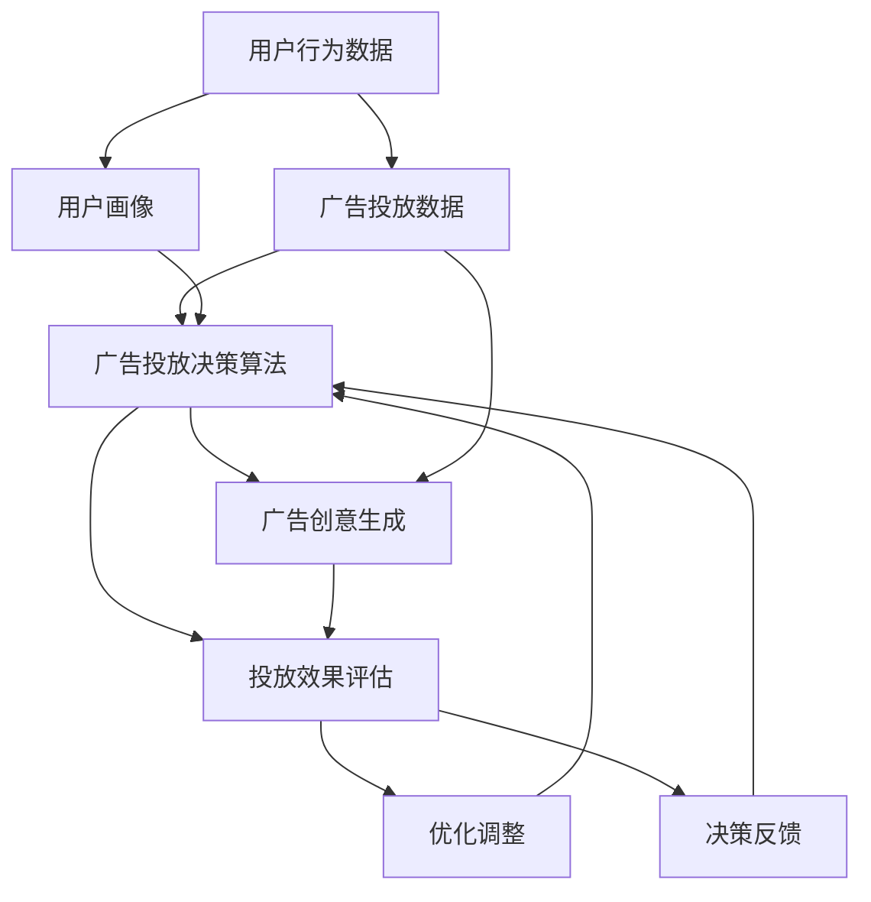
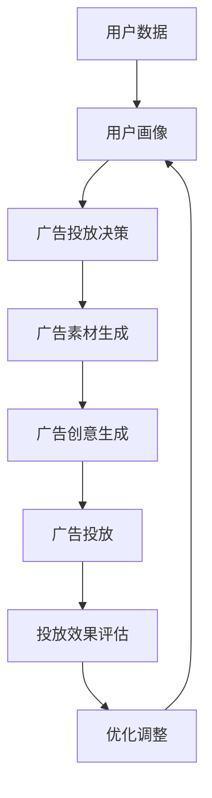
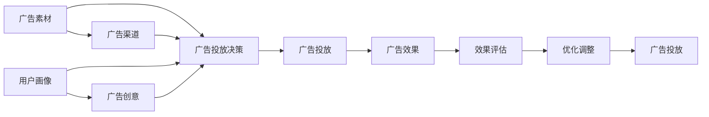
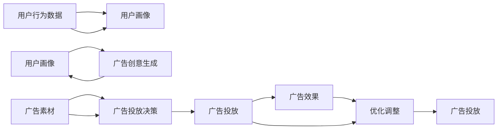
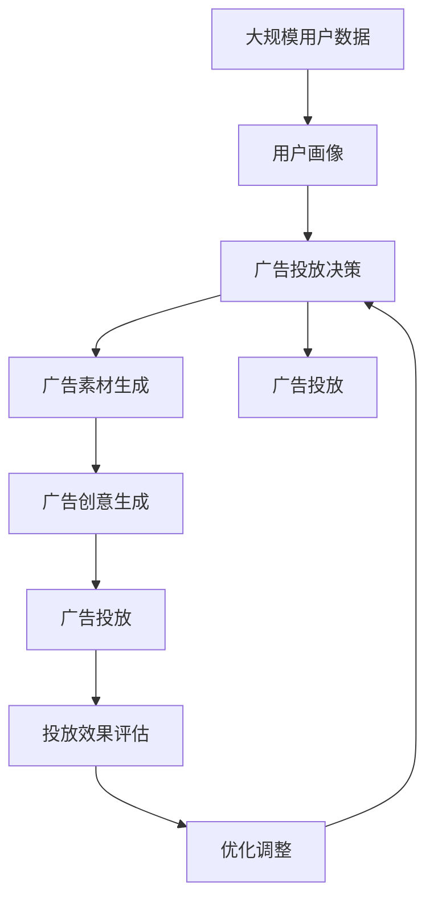

                 

# AI人工智能代理工作流AI Agent WorkFlow：智能代理在广告营销系统中的应用

> 关键词：人工智能代理,广告营销,自动化工作流,机器学习,自然语言处理(NLP),推荐系统,广告投放,精准营销

## 1. 背景介绍

### 1.1 问题由来
广告营销一直是各大互联网公司的重要收入来源之一。随着互联网广告市场的竞争日趋激烈，企业需要更高效、精准的广告投放方式来提升ROI。传统的广告投放方式依赖人工投放，容易产生人为误差，且投放效果难以量化评估。而智能代理技术的应用，使得广告投放更加高效精准，大大提升了广告投放的效果。

智能代理指的是通过机器学习、自然语言处理(NLP)等技术，实现自动化的广告投放决策，包括广告素材选择、投放渠道选择、广告创意生成等。这种技术能够大幅提升广告投放效率和广告点击率，降低运营成本。

### 1.2 问题核心关键点
智能代理技术的核心在于其自主决策能力。通过学习历史广告投放数据，智能代理能够自动分析用户行为和市场趋势，优化广告投放策略，实现更高精准度的广告投放。智能代理应用广泛，如社交媒体广告、搜索引擎广告、视频广告等，可以适用于各种广告投放渠道和场景。

智能代理技术的核心组成部分包括：
- **广告投放决策算法**：根据用户行为和市场数据，自动选择合适的广告素材和投放渠道。
- **用户画像分析**：通过机器学习算法，自动分析用户行为特征，建立用户画像，实现个性化推荐。
- **广告创意生成**：利用NLP等技术，生成吸引用户的广告文案和图片。
- **投放效果评估**：通过广告投放效果数据，自动评估广告策略的效果，并进行优化调整。

智能代理技术的应用，使得广告营销系统从传统的依赖人工投放，转变为自主决策、自动化运营，大大提升了广告投放的效率和效果。

### 1.3 问题研究意义
研究智能代理技术的应用，对于提升广告投放效率、优化广告投放策略、降低运营成本、实现精准营销具有重要意义：

1. **提升广告投放效率**：智能代理技术可以自动化广告投放决策，大幅减少人工干预，提高投放速度和精度。
2. **优化广告投放策略**：智能代理可以学习历史数据，自动优化广告素材、渠道选择和创意生成，实现更精准的广告投放。
3. **降低运营成本**：通过自动化运营，减少人力成本，提升广告投放效果。
4. **实现精准营销**：智能代理可以实时分析用户行为，实现个性化推荐，提升用户点击率和转化率。
5. **推动产业升级**：智能代理技术的应用，可以加速广告营销系统的升级转型，提升互联网企业的市场竞争力。

## 2. 核心概念与联系

### 2.1 核心概念概述

为更好地理解智能代理技术在广告营销系统中的应用，本节将介绍几个关键概念：

- **人工智能代理(AI Agent)**：通过机器学习算法，实现自动化的决策任务，如广告投放、推荐系统等。人工智能代理可以不断学习新的数据，优化其决策策略。
- **广告投放决策算法**：通过分析用户行为和市场数据，自动选择合适的广告素材、投放渠道和创意。常见的决策算法包括协同过滤、逻辑回归、神经网络等。
- **用户画像分析**：利用机器学习算法，对用户行为数据进行分析，提取用户兴趣、行为特征等，建立用户画像，实现个性化推荐。
- **广告创意生成**：通过自然语言处理(NLP)等技术，自动生成吸引用户的广告文案、图片和视频等创意内容。
- **投放效果评估**：根据广告投放效果数据，自动评估广告策略的效果，并进行优化调整。

这些概念之间相互关联，共同构成了智能代理技术的核心框架。以下通过Mermaid流程图来展示这些概念的联系：



这个流程图展示了智能代理技术从数据输入到决策反馈的全过程：

1. **用户行为数据**：从广告平台、社交媒体、搜索引擎等渠道获取用户行为数据。
2. **用户画像**：通过机器学习算法，对用户行为数据进行分析，提取用户兴趣、行为特征等，建立用户画像。
3. **广告投放决策算法**：结合用户画像和广告投放数据，自动选择合适的广告素材、投放渠道和创意。
4. **广告创意生成**：利用NLP等技术，自动生成吸引用户的广告文案、图片和视频等创意内容。
5. **投放效果评估**：根据广告投放效果数据，自动评估广告策略的效果，并进行优化调整。
6. **优化调整**：根据投放效果评估结果，自动优化广告策略，形成反馈循环。

这些概念共同构成了智能代理技术的核心框架，使得广告投放从人工操作转变为自动化、智能化运营。

### 2.2 概念间的关系

这些核心概念之间存在着紧密的联系，形成了智能代理技术的完整生态系统。下面我们通过几个Mermaid流程图来展示这些概念之间的关系。

#### 2.2.1 智能代理的决策流程



这个流程图展示了智能代理从用户数据输入到优化调整的决策流程：

1. **用户数据**：从广告平台、社交媒体、搜索引擎等渠道获取用户数据。
2. **用户画像**：通过机器学习算法，对用户数据进行分析，提取用户兴趣、行为特征等，建立用户画像。
3. **广告投放决策**：结合用户画像和广告投放数据，自动选择合适的广告素材、投放渠道和创意。
4. **广告素材生成**：利用NLP等技术，自动生成吸引用户的广告素材。
5. **广告创意生成**：利用NLP等技术，自动生成吸引用户的广告创意内容。
6. **广告投放**：根据广告投放决策结果，投放广告素材和创意内容。
7. **投放效果评估**：根据广告投放效果数据，自动评估广告策略的效果，并进行优化调整。
8. **优化调整**：根据投放效果评估结果，自动优化广告策略，形成反馈循环。

#### 2.2.2 广告投放决策算法



这个流程图展示了广告投放决策算法的基本流程：

1. **广告素材**：选择不同的广告素材进行投放。
2. **广告渠道**：选择不同的投放渠道进行投放。
3. **用户画像**：根据用户画像，生成不同的广告创意。
4. **广告投放决策**：综合广告素材、渠道、创意和用户画像，自动选择最佳的广告投放策略。
5. **广告投放**：根据广告投放决策结果，投放广告素材和创意内容。
6. **广告效果**：收集广告投放效果数据。
7. **效果评估**：根据广告效果数据，评估广告策略的效果。
8. **优化调整**：根据效果评估结果，自动优化广告策略。

#### 2.2.3 用户画像分析



这个流程图展示了用户画像分析的基本流程：

1. **用户行为数据**：收集用户在不同平台上的行为数据。
2. **用户画像**：利用机器学习算法，对用户行为数据进行分析，提取用户兴趣、行为特征等，建立用户画像。
3. **广告创意生成**：根据用户画像，生成不同的广告创意。
4. **广告素材**：选择不同的广告素材进行投放。
5. **广告投放决策**：结合广告素材、渠道、创意和用户画像，自动选择最佳的广告投放策略。
6. **广告投放**：根据广告投放决策结果，投放广告素材和创意内容。
7. **广告效果**：收集广告投放效果数据。
8. **优化调整**：根据广告效果数据，自动优化广告策略。

### 2.3 核心概念的整体架构

最后，我们用一个综合的流程图来展示这些核心概念在大规模广告投放中的整体架构：



这个综合流程图展示了从大规模用户数据输入到广告投放优化的全过程：

1. **大规模用户数据**：从广告平台、社交媒体、搜索引擎等渠道获取大规模用户数据。
2. **用户画像**：通过机器学习算法，对用户数据进行分析，提取用户兴趣、行为特征等，建立用户画像。
3. **广告投放决策**：结合用户画像和广告投放数据，自动选择合适的广告素材、投放渠道和创意。
4. **广告素材生成**：利用NLP等技术，自动生成吸引用户的广告素材。
5. **广告创意生成**：利用NLP等技术，自动生成吸引用户的广告创意内容。
6. **广告投放**：根据广告投放决策结果，投放广告素材和创意内容。
7. **投放效果评估**：根据广告投放效果数据，自动评估广告策略的效果。
8. **优化调整**：根据投放效果评估结果，自动优化广告策略，形成反馈循环。

通过这些流程图，我们可以更清晰地理解智能代理技术在大规模广告投放中的应用流程和关键技术点。

## 3. 核心算法原理 & 具体操作步骤
### 3.1 算法原理概述

智能代理在广告投放系统中的应用，本质上是一个基于机器学习算法的自动化决策过程。其核心思想是：利用历史广告投放数据和用户行为数据，自动分析用户兴趣和市场趋势，生成最佳的广告投放策略，实现高效、精准的广告投放。

形式化地，假设广告投放决策算法为 $f_{\theta}(\mathbf{x}, \mathbf{y})$，其中 $\mathbf{x}$ 为广告素材和投放渠道的特征向量，$\mathbf{y}$ 为用户画像的特征向量，$\theta$ 为模型参数。给定大规模用户数据 $D=\{(\mathbf{x}_i, \mathbf{y}_i)\}_{i=1}^N$，智能代理的目标是找到最优的模型参数 $\theta^*$，使得：

$$
\theta^* = \mathop{\arg\min}_{\theta} \mathcal{L}(f_{\theta})
$$

其中 $\mathcal{L}$ 为损失函数，用于衡量模型预测结果与实际投放效果之间的差异。常见的损失函数包括交叉熵损失、均方误差损失等。

通过梯度下降等优化算法，智能代理系统不断更新模型参数 $\theta$，最小化损失函数 $\mathcal{L}$，使得模型预测的投放效果逼近实际效果。由于智能代理算法已经通过历史数据获得了较好的初始化，因此即便在大规模数据集 $D$ 上进行微调，也能较快收敛到理想的模型参数 $\theta^*$。

### 3.2 算法步骤详解

智能代理在广告投放系统中的应用一般包括以下几个关键步骤：

**Step 1: 数据预处理与特征工程**

- 收集广告投放历史数据和用户行为数据，进行清洗和预处理，去除异常值和噪声。
- 对广告素材、投放渠道和用户画像等数据进行特征工程，提取有用的特征，如广告点击率、转化率、用户兴趣等。

**Step 2: 模型训练与优化**

- 选择合适的机器学习算法（如协同过滤、逻辑回归、神经网络等），并在预处理后的数据上进行训练。
- 设置合适的超参数，如学习率、正则化系数等，并通过交叉验证等技术进行调参。
- 使用梯度下降等优化算法进行模型训练，最小化损失函数 $\mathcal{L}$。

**Step 3: 广告投放决策**

- 根据用户画像和广告投放数据，自动选择最佳的广告素材、投放渠道和创意。
- 利用NLP等技术，自动生成吸引用户的广告文案、图片和视频等创意内容。

**Step 4: 投放效果评估**

- 收集广告投放效果数据，如点击率、转化率等，自动评估广告策略的效果。
- 通过A/B测试等技术，对比不同广告策略的效果，选择最优的投放方案。

**Step 5: 广告投放**

- 根据广告投放决策结果，自动投放广告素材和创意内容。

**Step 6: 优化调整**

- 根据广告效果评估结果，自动优化广告策略，形成反馈循环。
- 不断更新模型参数，提升广告投放效果。

以上步骤构成了一个完整的智能代理在广告投放系统中的应用流程。通过不断迭代和优化，智能代理系统可以逐步提升广告投放的效果和效率。

### 3.3 算法优缺点

智能代理在广告投放系统中的应用具有以下优点：

1. **高效精准**：智能代理能够自动分析用户行为和市场趋势，生成最佳的广告投放策略，实现高效、精准的广告投放。
2. **自动化运营**：智能代理实现了广告投放的自动化运营，大幅减少人工干预，提高投放速度和精度。
3. **个性化推荐**：利用用户画像分析技术，实现个性化推荐，提升用户点击率和转化率。
4. **优化调整**：智能代理能够根据投放效果评估结果，自动优化广告策略，形成反馈循环，持续提升投放效果。

同时，该方法也存在一些局限性：

1. **数据依赖性强**：智能代理依赖历史广告投放数据和用户行为数据，数据质量直接影响模型效果。
2. **模型复杂度高**：智能代理算法需要复杂的模型和大量的特征工程，对计算资源和算法实现要求较高。
3. **鲁棒性不足**：智能代理模型面对噪声和异常数据时，鲁棒性较差，可能产生误导性的投放策略。
4. **可解释性差**：智能代理模型通常被视为"黑盒"系统，难以解释其内部工作机制和决策逻辑。
5. **安全性问题**：智能代理模型可能学习到有偏见、有害的信息，通过广告投放传递到用户，产生误导性、歧视性的输出，给实际应用带来安全隐患。

尽管存在这些局限性，但智能代理技术在广告投放系统中的应用仍然具有广阔的前景，特别是对于广告投放效率和效果提升具有重要意义。

### 3.4 算法应用领域

智能代理技术在广告投放系统中的应用，主要适用于以下领域：

1. **社交媒体广告**：通过智能代理技术，自动分析用户行为数据，生成最佳的广告投放策略，提升社交媒体广告的点击率和转化率。
2. **搜索引擎广告**：利用智能代理技术，自动生成吸引用户的广告创意内容，提升搜索引擎广告的展示效果和点击率。
3. **视频广告**：通过智能代理技术，自动选择最佳的广告素材和投放渠道，提升视频广告的观看率和转化率。
4. **程序化广告**：结合智能代理技术，自动选择最佳的广告素材和投放渠道，实现程序化广告的自动化投放。
5. **广告定向投放**：利用智能代理技术，自动分析用户兴趣和行为特征，实现个性化广告定向投放。

除了上述这些领域外，智能代理技术还广泛应用于智能推荐、智能客服、智能调度等各个场景，为各个行业带来智能化转型升级的机遇。

## 4. 数学模型和公式 & 详细讲解 & 举例说明
### 4.1 数学模型构建

本节将使用数学语言对智能代理在广告投放系统中的应用进行更加严格的刻画。

记广告投放决策算法为 $f_{\theta}(\mathbf{x}, \mathbf{y})$，其中 $\mathbf{x}$ 为广告素材和投放渠道的特征向量，$\mathbf{y}$ 为用户画像的特征向量，$\theta$ 为模型参数。假设广告投放历史数据为 $D=\{(\mathbf{x}_i, \mathbf{y}_i, y_i)\}_{i=1}^N$，其中 $y_i$ 为实际投放效果，如点击率、转化率等。

定义广告投放决策算法 $f_{\theta}$ 在数据样本 $(\mathbf{x}, \mathbf{y})$ 上的损失函数为 $\ell(f_{\theta}(\mathbf{x}, \mathbf{y}))$，则在数据集 $D$ 上的经验风险为：

$$
\mathcal{L}(\theta) = \frac{1}{N} \sum_{i=1}^N \ell(f_{\theta}(\mathbf{x}_i, \mathbf{y}_i))
$$

智能代理的目标是最小化经验风险，即找到最优参数：

$$
\theta^* = \mathop{\arg\min}_{\theta} \mathcal{L}(\theta)
$$

在实践中，我们通常使用基于梯度的优化算法（如SGD、Adam等）来近似求解上述最优化问题。设 $\eta$ 为学习率，$\lambda$ 为正则化系数，则参数的更新公式为：

$$
\theta \leftarrow \theta - \eta \nabla_{\theta}\mathcal{L}(\theta) - \eta\lambda\theta
$$

其中 $\nabla_{\theta}\mathcal{L}(\theta)$ 为损失函数对参数 $\theta$ 的梯度，可通过反向传播算法高效计算。

### 4.2 公式推导过程

以下我们以二分类任务为例，推导交叉熵损失函数及其梯度的计算公式。

假设智能代理算法在广告投放数据 $(\mathbf{x}, \mathbf{y})$ 上的预测结果为 $f_{\theta}(\mathbf{x}, \mathbf{y})$，表示广告素材和用户画像组合的投放效果概率。真实标签 $y \in \{0,1\}$。则二分类交叉熵损失函数定义为：

$$
\ell(f_{\theta}(\mathbf{x}, \mathbf{y})) = -[y\log f_{\theta}(\mathbf{x}, \mathbf{y}) + (1-y)\log (1-f_{\theta}(\mathbf{x}, \mathbf{y}))]
$$

将其代入经验风险公式，得：

$$
\mathcal{L}(\theta) = -\frac{1}{N}\sum_{i=1}^N [y_i\log f_{\theta}(\mathbf{x}_i, \mathbf{y}_i)+(1-y_i)\log(1-f_{\theta}(\mathbf{x}_i, \mathbf{y}_i))]
$$

根据链式法则，损失函数对参数 $\theta$ 的梯度为：

$$
\frac{\partial \mathcal{L}(\theta)}{\partial \theta_k} = -\frac{1}{N}\sum_{i=1}^N \frac{\partial \ell(f_{\theta}(\mathbf{x}_i, \mathbf{y}_i))}{\partial f_{\theta}(\mathbf{x}_i, \mathbf{y}_i)} \frac{\partial f_{\theta}(\mathbf{x}_i, \mathbf{y}_i)}{\partial \theta_k}
$$

其中 $\frac{\partial \ell(f_{\theta}(\mathbf{x}_i, \mathbf{y}_i))}{\partial f_{\theta}(\mathbf{x}_i, \mathbf{y}_i)}$ 可以通过求导链式法则计算得到，而 $\frac{\partial f_{\theta}(\mathbf{x}_i, \mathbf{y}_i)}{\partial \theta_k}$ 可以通过反向传播算法计算得到。

在得到损失函数的梯度后，即可带入参数更新公式，完成模型的迭代优化。重复上述过程直至收敛，最终得到适应广告投放的模型参数 $\theta^*$。

### 4.3 案例分析与讲解

假设我们在一个社交媒体广告投放案例中，智能代理通过学习历史投放数据，生成一个广告素材和用户画像组合的投放效果预测模型。以下是具体的案例分析与讲解：

**案例背景**：
假设我们是一家电商公司，希望通过社交媒体广告推广一款新产品。我们收集了过去一段时间内用户在该社交媒体平台上的行为数据，包括用户的浏览、点赞、评论等行为，以及广告素材的点击率、转化率等数据。我们的目标是找到最佳的广告素材和用户画像组合，以提升广告投放效果。

**数据处理**：
1. **数据清洗**：将数据中的异常值和噪声去除，保留有价值的信息。
2. **特征工程**：提取广告素材的文本特征（如标题、描述等）、投放渠道特征（如广告类型、投放时间等）、用户画像特征（如年龄、性别、兴趣等）。

**模型训练**：
1. **模型选择**：选择逻辑回归模型作为广告投放决策算法。
2. **超参数调优**：设置学习率为0.01，正则化系数为0.001，通过交叉验证确定模型参数。
3. **训练过程**：使用梯度下降算法进行模型训练，最小化损失函数 $\mathcal{L}$。

**广告投放决策**：
1. **用户画像分析**：利用机器学习算法，分析用户行为数据，提取用户兴趣和行为特征，建立用户画像。
2. **广告素材生成**：根据用户画像，自动生成吸引用户的广告文案、图片和视频等创意内容。
3. **广告投放决策**：结合广告素材、投放渠道和用户画像，自动选择最佳的广告素材和投放渠道。

**投放效果评估**：
1. **效果评估**：收集广告投放效果数据，如点击率、转化率等，自动评估广告策略的效果。
2. **A/B测试**：通过A/B测试，对比不同广告策略的效果，选择最优的投放方案。

**优化调整**：
1. **效果反馈**：根据广告效果评估结果，自动优化广告策略，形成反馈循环。
2. **模型更新**：不断更新模型参数，提升广告投放效果。

通过以上案例，可以看到智能代理技术在广告投放系统中的应用流程，以及各关键技术点的作用。

## 5. 项目实践：代码实例和详细解释说明
### 5.1 开发环境搭建

在进行智能代理应用实践前，我们需要准备好开发环境。以下是使用Python进行PyTorch开发的环境配置流程：

1. 安装Anaconda：从官网下载并安装Anaconda，用于创建独立的Python环境。

2. 创建并激活虚拟环境：
```bash
conda create -n agent-env python=3.8 
conda activate agent-env
```

3. 安装PyTorch：根据CUDA版本，从官网获取对应的安装命令。例如：
```bash
conda install pytorch torchvision torchaudio cudatoolkit=11.1 -c pytorch -c conda-forge
```

4. 安装各类工具包：
```bash
pip install numpy pandas scikit-learn matplotlib tqdm jupyter notebook ipython
```

完成上述步骤后，即可在`agent-env`环境中开始智能代理应用实践。

### 5.2 源代码详细实现

下面我们以一个简单的社交媒体广告投放案例为例，给出使用PyTorch实现智能代理的代码实现。

首先，定义广告素材和用户画像的特征：

```python
from torch.utils.data import Dataset
import torch
import numpy as np

class AdDataset(Dataset):
    def __init__(self, ads, users, labels, max_len=128):
        self.ads = ads
        self.users = users
        self.labels = labels
        self.max_len = max_len
        
    def __len__(self):
        return len(self.ads)
    
    def __getitem__(self, item):
        ad = self.ads[item]
        user = self.users[item]
        label = self.labels[item]
        
        ad = ad.split()
        user = user.split()
        
        encoding_ad = self.encoding_ad(ad)
        encoding_user = self.encoding_user(user)
        
        padding_ad = self.pad_tensor(encoding_ad)
        padding_user = self.pad_tensor(encoding_user)
        
        ad_tokens = padding_ad
        user_tokens = padding_user
        
        return {
            'ad_tokens': ad_tokens,
            'user_tokens': user_tokens,
            'label': label
        }
    
    def encoding_ad(self, ad):
        encoding = []
        for word in ad:
            encoding.append(self.ad2id[word])
        return encoding
    
    def encoding_user(self, user):
        encoding = []
        for word in user:
            encoding.append(self.user2id[word])
        return encoding
    
    def pad_tensor(self, tensor):
        max_len = self.max_len
        padding = [0] * (max_len - len(tensor))
        return tensor + padding
    
    

