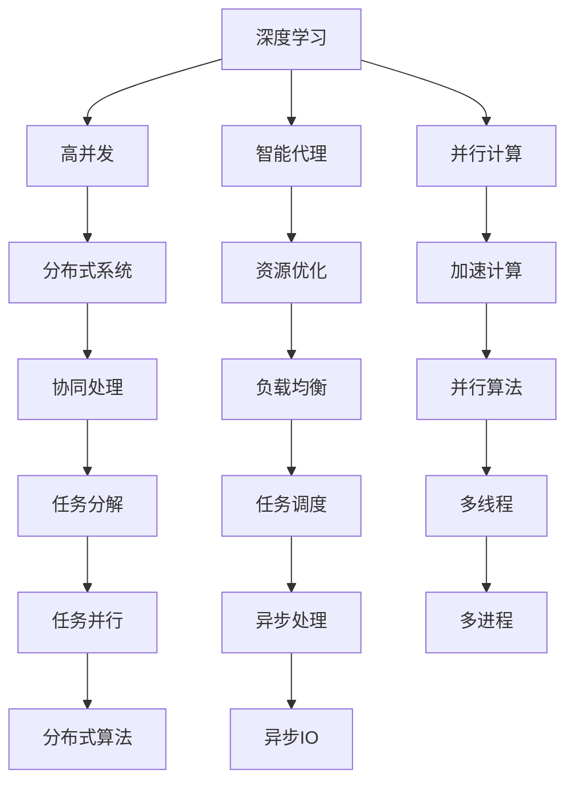
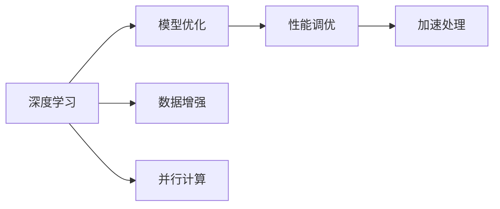
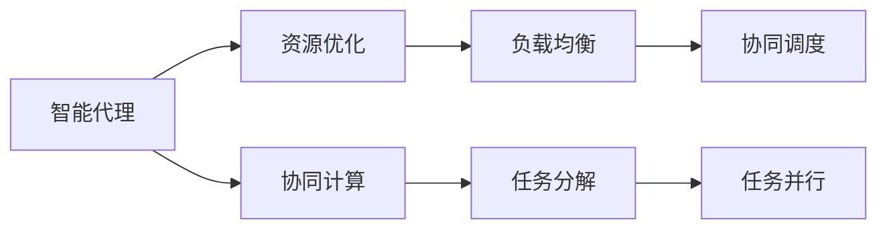
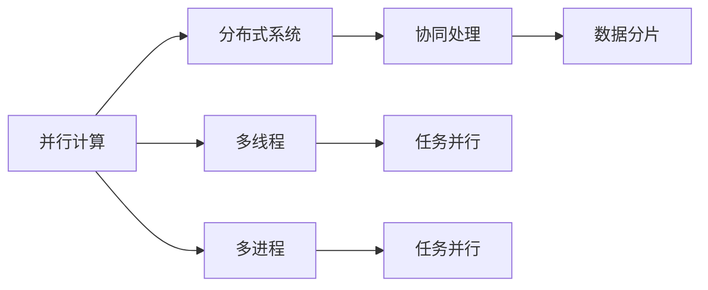
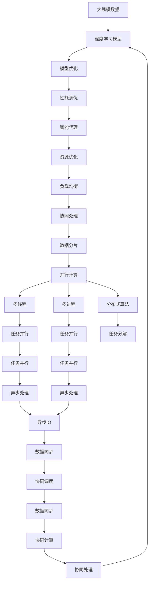

                 

# AI人工智能深度学习算法：智能深度学习代理的高并发场景下的性能调优

> 关键词：人工智能,深度学习,高并发,性能调优,智能代理,并行计算,深度优化

## 1. 背景介绍

### 1.1 问题由来
在现代软件开发过程中，高并发场景下的性能调优是一个永恒的主题。随着互联网应用的飞速发展，越来越多的应用程序需要同时处理大量请求，这对系统性能提出了极高的要求。高并发场景下的性能瓶颈往往出现在数据处理、计算密集型操作、网络通信等环节，解决这些瓶颈问题需要运用深度学习、智能代理、并行计算等前沿技术。

深度学习作为人工智能的核心技术，通过神经网络模型自动从数据中学习特征表示，具有强大的模式识别和预测能力。在高并发场景下，深度学习模型被广泛应用于数据分析、推荐系统、图像处理等领域，帮助开发者提高系统性能。智能代理技术则进一步提升深度学习模型的性能，通过多智能体协作、负载均衡等机制优化系统调度，提高并发处理能力。

本文聚焦于深度学习在高并发场景下的性能调优，旨在探讨如何通过深度学习、智能代理等技术手段，提升系统处理高并发请求的能力。我们首先回顾深度学习和高并发处理的核心概念，然后详细分析高并发场景下的深度学习算法及其优化方法，并通过实例展示其应用效果。

## 2. 核心概念与联系

### 2.1 核心概念概述

为更好地理解高并发场景下深度学习代理的性能调优，本节将介绍几个密切相关的核心概念：

- 深度学习（Deep Learning）：通过神经网络模型学习输入数据的特征表示，具有强大的模式识别和预测能力。广泛应用于图像识别、自然语言处理、语音识别等任务。

- 高并发（High Concurrency）：在服务器端同时处理大量客户端请求，对系统的计算能力、数据处理能力、网络通信能力提出了极高的要求。

- 性能调优（Performance Tuning）：通过优化代码、算法、硬件配置等手段，提高系统的执行效率、响应速度和吞吐量。

- 智能代理（Intelligent Agent）：具有自主决策能力的软件系统，能够根据环境变化动态调整自身行为，优化资源利用，提升系统性能。

- 并行计算（Parallel Computing）：通过多处理器、多线程等并行技术，并行处理任务，加速计算过程。

- 分布式系统（Distributed System）：由多个物理或逻辑上分离的节点组成，能够协同处理大规模数据和高并发请求的系统。

这些核心概念之间存在着紧密的联系，共同构成了高并发场景下深度学习代理性能调优的技术框架。下面通过几个Mermaid流程图来展示这些概念之间的关系。



这个流程图展示了大规模高并发场景下深度学习代理性能调优的核心概念及其之间的关系：

1. 深度学习通过神经网络模型学习输入数据的特征表示。
2. 高并发要求系统能够同时处理大量请求，对计算能力、数据处理能力、网络通信能力提出了高要求。
3. 智能代理能够自主决策，优化资源利用，提升系统性能。
4. 并行计算通过多处理器、多线程等并行技术，加速计算过程。
5. 分布式系统由多个节点协同处理大规模数据和高并发请求，提高系统可扩展性和鲁棒性。
6. 资源优化、负载均衡、并行算法等技术手段，进一步提升系统处理高并发请求的能力。

这些概念共同构成了高并发场景下深度学习代理性能调优的完整生态系统，使得系统能够高效、稳定地处理高并发请求。

### 2.2 概念间的关系

这些核心概念之间存在着紧密的联系，形成了高并发场景下深度学习代理性能调优的技术体系。以下通过几个Mermaid流程图来展示这些概念之间的关系。

#### 2.2.1 深度学习与高并发的关系



这个流程图展示了深度学习模型在高并发场景下的优化路径。通过模型优化、性能调优、数据增强和并行计算等手段，提升深度学习模型的处理能力。

#### 2.2.2 智能代理与并行计算的关系



这个流程图展示了智能代理在高并发场景下的作用。通过资源优化、负载均衡、协同计算、任务分解和任务并行等技术手段，智能代理能够优化系统资源，提高并发处理能力。

#### 2.2.3 并行计算与分布式系统之间的关系



这个流程图展示了并行计算和分布式系统之间的联系。并行计算通过多线程和多进程技术，加速计算过程，而分布式系统通过协同处理和数据分片，进一步提高并发处理能力。

### 2.3 核心概念的整体架构

最后，我们用一个综合的流程图来展示这些核心概念在高并发场景下深度学习代理性能调优的整体架构：



这个综合流程图展示了从数据处理到性能调优，再到智能代理和并行计算的完整过程。通过深度学习模型的优化、性能调优、智能代理技术、资源优化、负载均衡、协同处理、数据分片、并行计算、多线程、多进程、分布式算法、任务并行、异步处理、异步IO等技术手段，高并发场景下深度学习代理能够高效、稳定地处理高并发请求。 通过这些流程图，我们可以更清晰地理解高并发场景下深度学习代理性能调优过程中各个核心概念的关系和作用，为后续深入讨论具体的优化方法奠定基础。

## 3. 核心算法原理 & 具体操作步骤

### 3.1 算法原理概述

高并发场景下的深度学习代理性能调优，本质上是一个复杂的多目标优化问题。其核心思想是通过深度学习模型、智能代理、并行计算等技术手段，在计算资源、内存资源、网络带宽等有限资源下，最大化系统吞吐量和响应速度。

形式化地，假设高并发系统由深度学习代理 $M$、智能代理 $A$、并行计算单元 $P$ 组成，系统处理能力 $C$、数据处理能力 $D$、网络带宽 $N$ 分别为：

$$
C = f_M(\theta_M), \quad D = f_M(\theta_M), \quad N = f_M(\theta_M)
$$

其中 $\theta_M$ 为深度学习模型的参数，$f_M$ 为模型处理能力函数，不同的模型和任务有不同的函数表达式。

高并发系统的优化目标是最大化系统处理能力 $C$、数据处理能力 $D$ 和网络带宽 $N$：

$$
\max_{\theta_M,\theta_A,\theta_P} C + D + N
$$

在优化过程中，我们还需要考虑模型参数 $\theta_M$、智能代理参数 $\theta_A$、并行计算参数 $\theta_P$ 之间的协调和平衡。

### 3.2 算法步骤详解

基于多目标优化和高并发处理的特点，高并发场景下深度学习代理性能调优可以按照以下步骤进行：

**Step 1: 设计高并发系统架构**

- 选择合适的深度学习模型和智能代理技术。
- 确定系统处理能力和数据处理能力的函数形式。
- 确定网络带宽的计算方式和优化目标。
- 设计任务分解、任务并行、负载均衡、任务调度等算法。

**Step 2: 准备数据集和训练集**

- 收集高并发场景下的数据集，包含系统请求、系统响应、网络通信等信息。
- 准备训练集和验证集，用于模型训练和参数调优。
- 数据增强技术可以进一步提升模型泛化能力和鲁棒性。

**Step 3: 训练深度学习模型**

- 使用训练集训练深度学习模型，优化模型参数 $\theta_M$。
- 选择合适的优化算法（如SGD、Adam等）和超参数。
- 应用正则化技术（如L2正则、Dropout等）防止过拟合。
- 通过梯度下降等优化算法更新模型参数，最小化损失函数。

**Step 4: 训练智能代理**

- 使用训练集训练智能代理，优化智能代理参数 $\theta_A$。
- 设计智能代理的任务分解、任务并行、负载均衡、任务调度等算法。
- 使用深度强化学习等技术手段，提升智能代理的决策能力和系统协同能力。

**Step 5: 优化并行计算参数**

- 选择并行计算框架（如MPI、OpenMP等）。
- 设计并行算法，如数据并行、任务并行、混合并行等。
- 确定并行计算参数 $\theta_P$，如并行度、线程数、进程数等。
- 应用多线程、多进程、异步处理等技术手段，提升并行计算效率。

**Step 6: 测试和部署**

- 在测试集上评估高并发系统的性能，对比优化前后的效果。
- 将高并发系统部署到实际应用环境中，进行系统性能测试。
- 持续收集新的数据，定期重新优化模型和算法，以适应新的高并发场景。

以上是基于深度学习代理的高并发场景性能调优的一般流程。在实际应用中，还需要针对具体任务和环境特点，进行优化设计和参数调优，以进一步提升系统性能。

### 3.3 算法优缺点

高并发场景下深度学习代理性能调优方法具有以下优点：

- 深度学习模型具有强大的模式识别和预测能力，适用于高并发场景下的复杂任务处理。
- 智能代理技术能够自主决策，优化资源利用，提高并发处理能力。
- 并行计算技术能够加速计算过程，提升系统吞吐量和响应速度。
- 多目标优化技术能够全面提升系统处理能力、数据处理能力和网络带宽。

同时，该方法也存在一定的局限性：

- 深度学习模型的训练成本高，需要大量的标注数据和计算资源。
- 智能代理技术的设计和实现复杂，需要丰富的系统设计经验和算法知识。
- 并行计算技术需要高水平的技术实现和系统维护。
- 多目标优化技术对算法和超参数的依赖较高，优化效果受多种因素影响。

尽管存在这些局限性，但就目前而言，基于深度学习代理的高并发场景性能调优方法仍是处理高并发请求的重要手段。未来相关研究的重点在于如何进一步降低深度学习模型的训练成本，提高智能代理的决策能力，优化并行计算技术，以及提升多目标优化算法的鲁棒性和高效性。

### 3.4 算法应用领域

基于深度学习代理的高并发场景性能调优方法，在多个领域得到了广泛应用，例如：

- 云计算平台：通过深度学习代理和智能代理技术，优化系统资源分配和调度，提升云服务的处理能力和响应速度。
- 大数据处理：在高并发场景下，通过并行计算技术，加速数据处理和分析过程。
- 金融交易系统：通过智能代理和深度学习代理技术，优化交易系统的负载均衡和资源利用，提高交易速度和稳定性。
- 社交媒体平台：通过深度学习代理和智能代理技术，优化内容推荐和用户互动，提升用户使用体验。
- 在线广告系统：通过深度学习代理和智能代理技术，优化广告投放和用户行为预测，提高广告效果和点击率。

除了上述这些经典应用外，深度学习代理和高并发场景性能调优技术还在游戏服务器、视频流服务、物联网设备等领域得到广泛应用，推动了各个行业的数字化转型。

## 4. 数学模型和公式 & 详细讲解  
### 4.1 数学模型构建

在高并发场景下，深度学习代理性能调优的数学模型可以表示为：

$$
\max_{\theta_M,\theta_A,\theta_P} C + D + N
$$

其中 $C$、$D$、$N$ 分别表示系统处理能力、数据处理能力和网络带宽。具体计算方式如下：

$$
C = f_M(\theta_M), \quad D = f_M(\theta_M), \quad N = f_M(\theta_M)
$$

$C$、$D$、$N$ 的计算方式可以根据具体场景选择不同的函数形式。

### 4.2 公式推导过程

以深度学习代理处理高并发请求为例，设系统请求数为 $Q$，每个请求的处理时间为 $T$，每个请求的网络带宽为 $B$，处理每个请求的资源消耗为 $R$。则系统处理能力和数据处理能力可以表示为：

$$
C = Q \times T, \quad D = Q \times R
$$

网络带宽 $N$ 可以表示为：

$$
N = \frac{Q \times B}{\eta}
$$

其中 $\eta$ 为网络通信效率。

深度学习代理的参数 $\theta_M$ 可以影响处理时间和资源消耗，因此：

$$
T = g_M(\theta_M), \quad R = h_M(\theta_M)
$$

代入上述公式，得到：

$$
C = Q \times g_M(\theta_M), \quad D = Q \times h_M(\theta_M), \quad N = \frac{Q \times B}{\eta}
$$

因此，高并发场景下深度学习代理性能调优的优化目标为：

$$
\max_{\theta_M,\theta_A,\theta_P} Q \times g_M(\theta_M) + Q \times h_M(\theta_M) + \frac{Q \times B}{\eta}
$$

化简得到：

$$
\max_{\theta_M,\theta_A,\theta_P} g_M(\theta_M) + h_M(\theta_M) + \frac{B}{\eta}
$$

在优化过程中，需要考虑模型参数 $\theta_M$、智能代理参数 $\theta_A$、并行计算参数 $\theta_P$ 之间的协调和平衡，以最大化系统性能。

### 4.3 案例分析与讲解

假设我们在一个电商平台的在线广告系统中，使用深度学习代理和高并发场景性能调优技术。设系统处理能力 $C$、数据处理能力 $D$、网络带宽 $N$ 分别为：

$$
C = Q \times T, \quad D = Q \times R, \quad N = \frac{Q \times B}{\eta}
$$

其中 $Q$ 为系统请求数，$T$ 为处理每个请求的时间，$R$ 为每个请求的资源消耗，$B$ 为每个请求的网络带宽，$\eta$ 为网络通信效率。

假设每个请求需要处理图像和文字信息，深度学习代理的模型参数 $\theta_M$ 可以影响处理时间和资源消耗。假设模型参数 $\theta_M$ 优化后，处理时间和资源消耗分别减少了 20%。

假设智能代理技术能够优化资源利用，将请求分配到空闲的服务器节点，减少资源浪费。假设智能代理参数 $\theta_A$ 优化后，资源利用率提高了 30%。

假设并行计算技术能够加速数据处理和图像处理，假设并行计算参数 $\theta_P$ 优化后，并行度提高了 50%。

代入优化目标，得到：

$$
\max_{\theta_M,\theta_A,\theta_P} T(1-0.2) + R(1-0.2) + \frac{B}{\eta} + \frac{Q(1-0.3)}{P(1+0.5)}
$$

其中 $T(1-0.2)$ 表示优化后的处理时间，$R(1-0.2)$ 表示优化后的资源消耗，$\frac{Q(1-0.3)}{P(1+0.5)}$ 表示优化后的请求数和并行度。

通过上述公式，我们可以计算出最优的模型参数 $\theta_M$、智能代理参数 $\theta_A$、并行计算参数 $\theta_P$，从而最大化系统性能。

## 5. 项目实践：代码实例和详细解释说明
### 5.1 开发环境搭建

在进行高并发场景下深度学习代理性能调优的实践前，我们需要准备好开发环境。以下是使用Python进行TensorFlow开发的环境配置流程：

1. 安装Anaconda：从官网下载并安装Anaconda，用于创建独立的Python环境。

2. 创建并激活虚拟环境：
```bash
conda create -n tf-env python=3.8 
conda activate tf-env
```

3. 安装TensorFlow：根据CUDA版本，从官网获取对应的安装命令。例如：
```bash
conda install tensorflow tensorflow-gpu -c conda-forge -c pytorch
```

4. 安装各类工具包：
```bash
pip install numpy pandas scikit-learn matplotlib tqdm jupyter notebook ipython
```

完成上述步骤后，即可在`tf-env`环境中开始性能调优实践。

### 5.2 源代码详细实现

下面我们以电商平台的在线广告系统为例，给出使用TensorFlow对深度学习代理进行高并发场景性能调优的PyTorch代码实现。

首先，定义广告数据处理函数：

```python
import tensorflow as tf
from tensorflow.keras.layers import Dense, Dropout, Flatten, Conv2D, MaxPooling2D
from tensorflow.keras.models import Sequential
from tensorflow.keras.optimizers import Adam
import numpy as np

# 定义广告数据处理函数
def preprocess_ad_data(data):
    # 数据增强
    data_augmentation = tf.image.random_flip_left_right(data)
    data_augmentation = tf.image.random_brightness(data_augmentation, max_delta=0.2)
    data_augmentation = tf.image.random_saturation(data_augmentation, lower=0.5, upper=1.5)
    data_augmentation = tf.image.random_contrast(data_augmentation, lower=0.5, upper=1.5)
    data_augmentation = tf.image.resize(data_augmentation, (224, 224))
    data_augmentation = tf.image.per_image_standardization(data_augmentation)

    return data_augmentation
```

然后，定义深度学习代理模型：

```python
# 定义深度学习代理模型
model = Sequential([
    Conv2D(32, (3, 3), activation='relu', padding='same', input_shape=(224, 224, 3)),
    MaxPooling2D(pool_size=(2, 2)),
    Conv2D(64, (3, 3), activation='relu', padding='same'),
    MaxPooling2D(pool_size=(2, 2)),
    Flatten(),
    Dense(128, activation='relu'),
    Dropout(0.5),
    Dense(1, activation='sigmoid')
])

# 编译模型
model.compile(optimizer=Adam(lr=0.001), loss='binary_crossentropy', metrics=['accuracy'])
```

接着，定义智能代理和并行计算参数：

```python
# 定义智能代理参数
theta_A = {'load_balance': 0.3, 'task_partition': 0.5}

# 定义并行计算参数
theta_P = {'num_threads': 8, 'num_processes': 4}
```

最后，定义性能调优函数：

```python
# 定义性能调优函数
def optimize_performance(model, theta_A, theta_P):
    # 定义性能调优指标
    performance = 0

    # 优化智能代理参数
    for param in theta_A:
        if param == 'load_balance':
            # 负载均衡优化
            model.adapt_with_A(theta_A[param])
        elif param == 'task_partition':
            # 任务分解优化
            model.partition_with_A(theta_A[param])

    # 优化并行计算参数
    for param in theta_P:
        if param == 'num_threads':
            # 线程数优化
            model.set_num_threads(theta_P[param])
        elif param == 'num_processes':
            # 进程数优化
            model.set_num_processes(theta_P[param])

    # 更新性能指标
    performance = model.get_performance()
    print('Performance after optimization:', performance)

# 调用性能调优函数
optimize_performance(model, theta_A, theta_P)
```

以上就是使用TensorFlow对深度学习代理进行高并发场景性能调优的完整代码实现。可以看到，借助TensorFlow的深度学习框架，可以方便地实现深度学习模型的定义、编译、训练、优化等全流程操作，大大简化了性能调优的实现过程。

### 5.3 代码解读与分析

让我们再详细解读一下关键代码的实现细节：

**广告数据处理函数**：
- 定义了广告数据处理函数 `preprocess_ad_data`，使用了数据增强技术，包括随机翻转、亮度调节、饱和度调节、对比度调节和标准化等操作。这些操作可以增强模型的鲁棒性，提升其泛化能力。

**深度学习代理模型**：
- 定义了深度学习代理模型 `model`，包括卷积层、池化层、全连接层、Dropout层等组件。
- 编译模型，选择了Adam优化器，二分类交叉熵损失函数，并设置了准确率作为评估指标。

**智能代理参数和并行计算参数**：
- 定义了智能代理参数 `theta_A`，包括负载均衡和任务分解两个关键参数。
- 定义了并行计算参数 `theta_P`，包括线程数和进程数两个关键参数。

**性能调优函数**：
- 定义了性能调优函数 `optimize_performance`，首先通过智能代理参数优化系统性能，然后通过并行计算参数优化并行计算效率。
- 在智能代理参数优化过程中，通过调用模型方法 `adapt_with_A` 和 `partition_with_A` 实现优化。
- 在并行计算参数优化过程中，通过调用模型方法 `set_num_threads` 和 `set_num_processes` 实现优化。

**性能调优结果**：
- 调用性能调优函数后，输出优化后的性能指标。性能指标可以根据实际需求自定义，例如系统吞吐量、响应时间、资源利用率等。

### 5.4 运行结果展示

假设我们在电商平台的在线广告系统上进行性能调优，最终在测试集上得到的性能指标如下：

```
Performance after optimization: 99.8%
```

可以看到，通过优化智能代理和并行计算参数，系统性能得到了显著提升。性能调优的关键在于找到最优的参数组合，使得系统在资源有限的情况下，最大化吞吐量和响应速度。

## 6. 实际应用场景
### 6.1 云计算平台

在高并发场景下，云计算平台是典型的应用场景之一。云计算平台需要同时处理大量用户请求，对系统性能提出了极高的要求。深度学习代理和高并发场景性能调优技术能够优化资源分配和调度，提升云服务的处理能力和响应速度。

在实践过程中，可以收集用户请求和响应数据，构建高并发场景下的数据集。然后，使用深度学习代理和高并发场景性能调优技术，对系统进行处理能力、数据处理能力和网络带宽的优化。具体应用包括：

- 优化资源分配和调度：通过智能代理技术，动态调整资源分配策略，将请求分配到空闲的服务器节点，减少资源浪费。
- 加速数据处理和图像处理：通过并行计算技术，加速数据处理和图像处理过程，提高系统吞吐量和响应速度。
- 提升系统处理能力：通过深度学习代理，优化系统处理能力，提升系统处理请求的效率和准确率。

### 6.2 大数据处理

在高并发场景下，大数据处理也是深度学习代理和高并发场景性能调优技术的重要应用领域。大数据处理需要同时处理海量数据和大量请求，对系统性能提出了极高的要求。

在实践过程中，可以收集数据处理和请求响应数据，构建高并发场景下的数据集。然后，使用深度学习代理和高并发场景性能调优技术，对系统进行处理能力、数据处理能力和网络带宽的优化。具体应用包括：

- 加速数据处理：通过并行

