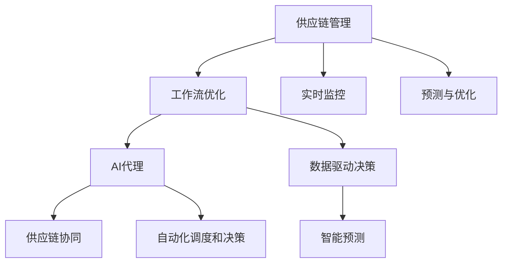
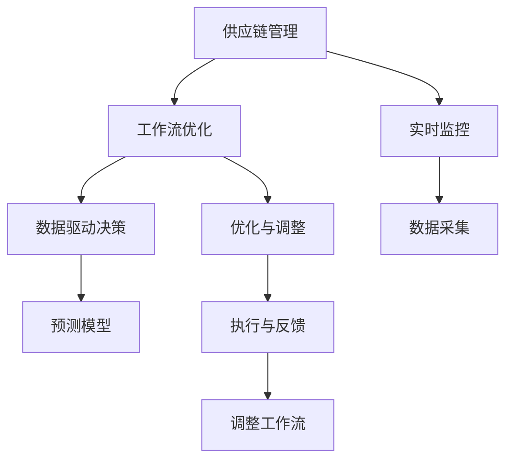
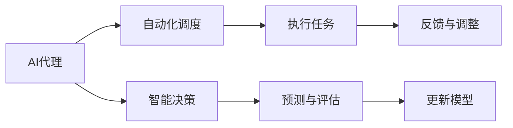
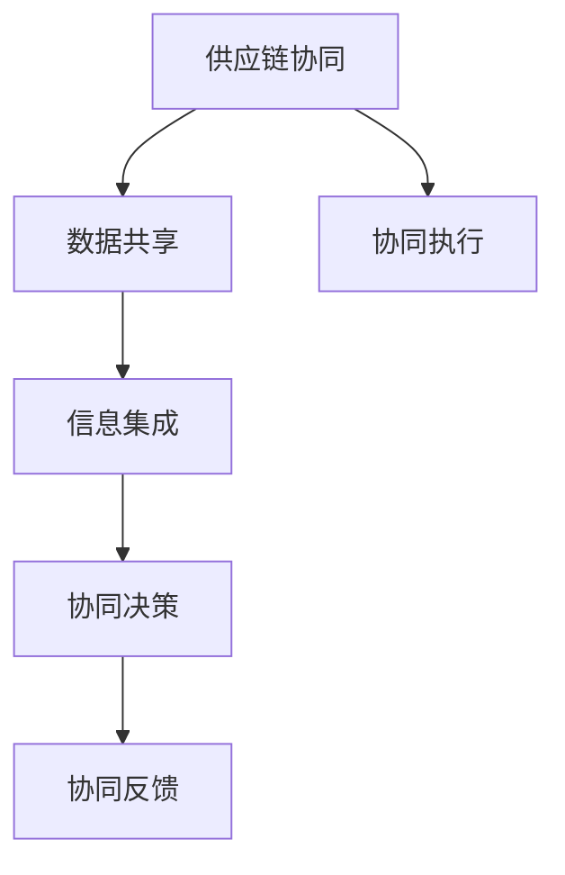
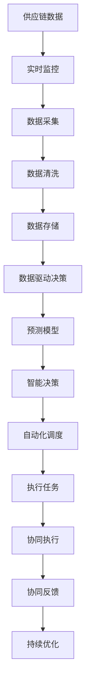
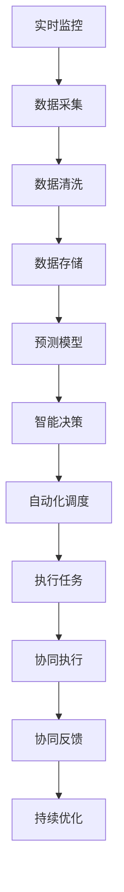

                 

# AI代理在供应链管理中的工作流优化实践

> 关键词：供应链管理, 工作流优化, AI代理, 供应链协同, 自动化, 数据驱动决策

## 1. 背景介绍

### 1.1 问题由来
随着全球化的发展，供应链管理变得日益复杂，企业面临着多变的市场需求、严格的监管要求、复杂的物流网络等多重挑战。传统的供应链管理模式依赖于人工操作和手动调度，存在效率低、成本高、易出错等问题。因此，企业迫切需要一种更高效、更智能的供应链管理手段。

近年来，人工智能(AI)技术在供应链管理中的应用越来越广泛。AI代理作为其中的重要组成部分，通过实时监控、智能预测、自动化调度等手段，极大地提高了供应链管理的效率和准确性。本文将深入探讨AI代理在供应链管理中的应用，以期为供应链优化提供新的思路和方法。

### 1.2 问题核心关键点
AI代理在供应链管理中的核心作用在于实现工作流的自动化和智能化。具体而言，AI代理可以：
- 实时监控供应链中的各项指标，及时发现异常情况。
- 根据历史数据和实时信息，预测未来的供需趋势。
- 自动化地调整工作流程，优化供应链运作。
- 与供应链中的其他参与者进行协同，提高整体效率。

为了实现这些功能，AI代理需要集成多种技术，如机器学习、自然语言处理、计算机视觉等，构建起一个高度灵活和可扩展的智能决策系统。通过不断地学习和优化，AI代理能够逐步适应供应链的动态变化，从而提供更精准和高效的服务。

### 1.3 问题研究意义
研究AI代理在供应链管理中的应用，对于提高供应链效率、降低运营成本、提升客户满意度具有重要意义：

1. **提高供应链效率**：AI代理能够自动化处理大量的数据和操作，显著提高供应链的反应速度和运作效率。
2. **降低运营成本**：通过优化工作流程和资源配置，AI代理可以有效降低供应链的运营成本，提升企业的盈利能力。
3. **提升客户满意度**：通过实时监控和预测，AI代理可以更准确地满足客户需求，提高客户满意度和忠诚度。
4. **支持数据驱动决策**：AI代理基于大数据和机器学习技术，提供精确的决策支持，帮助企业更好地应对市场变化。
5. **增强供应链协同**：AI代理能够与其他系统无缝对接，实现供应链各环节的协同运作，提高整体协同效率。

## 2. 核心概念与联系

### 2.1 核心概念概述

为更好地理解AI代理在供应链管理中的应用，本节将介绍几个密切相关的核心概念：

- **供应链管理**：供应链管理是指从原材料采购、生产、仓储、运输到客户交付的整个过程的管理。目标是通过优化供应链流程，降低成本，提高效率，提升客户满意度。
- **工作流优化**：工作流优化是指通过分析和管理工作流，发现和消除瓶颈，实现流程的自动化和智能化。在供应链管理中，工作流优化可以显著提升供应链的响应速度和运作效率。
- **AI代理**：AI代理是指通过AI技术构建的、能够在供应链中自主决策和执行任务的虚拟助手。它可以根据实时数据和预设规则，自动调整工作流程，优化供应链运作。
- **供应链协同**：供应链协同是指供应链各环节的协同运作，通过共享信息和资源，实现整体效率的最大化。AI代理在供应链协同中扮演着重要的角色，能够提高供应链的整体协同效率。

这些核心概念之间的逻辑关系可以通过以下Mermaid流程图来展示：



这个流程图展示了从供应链管理到工作流优化，再到AI代理和供应链协同的整体过程。具体而言：
- 供应链管理的目标是通过优化工作流，提高供应链效率和客户满意度。
- 工作流优化通过分析和优化流程，发现和消除瓶颈。
- AI代理通过自动化调度和决策，实现工作流的智能化。
- 供应链协同通过共享信息和资源，提高整体效率。

### 2.2 概念间的关系

这些核心概念之间存在着紧密的联系，形成了供应链管理中的智能化决策系统。下面我们通过几个Mermaid流程图来展示这些概念之间的关系。

#### 2.2.1 供应链管理的工作流优化



这个流程图展示了供应链管理中工作流优化的过程。具体而言：
- 实时监控收集供应链中的各项数据。
- 数据驱动决策利用历史数据和实时信息，构建预测模型。
- 优化与调整根据预测结果和实时数据，调整工作流程。
- 执行与反馈实时监控执行情况，不断调整工作流。

#### 2.2.2 AI代理的自动化调度和决策



这个流程图展示了AI代理在供应链中的自动化调度和决策过程。具体而言：
- 自动化调度根据任务要求，自动调整工作流程。
- 智能决策基于实时数据和预测模型，做出最优决策。
- 执行任务根据决策结果，执行相应的操作。
- 反馈与调整根据执行结果，不断调整决策模型。
- 更新模型根据新的数据和经验，持续优化决策模型。

#### 2.2.3 供应链协同与AI代理



这个流程图展示了供应链协同中AI代理的作用。具体而言：
- 数据共享实现供应链各环节的数据共享。
- 信息集成将各环节的信息整合，构建统一的信息平台。
- 协同决策基于共享信息，做出整体决策。
- 协同执行根据决策结果，协同执行各项任务。
- 协同反馈根据执行情况，不断优化协同决策。

### 2.3 核心概念的整体架构

最后，我们用一个综合的流程图来展示这些核心概念在大语言模型微调过程中的整体架构：



这个综合流程图展示了从供应链数据采集到自动化调度，再到协同执行和持续优化的完整过程。通过这些流程，AI代理能够实时监控供应链中的各项指标，预测未来的供需趋势，自动化地调整工作流程，优化供应链运作，并与供应链中的其他参与者进行协同，提高整体效率。

## 3. 核心算法原理 & 具体操作步骤

### 3.1 算法原理概述

AI代理在供应链管理中的核心算法原理基于工作流优化和智能决策。具体而言，AI代理的工作流程如下：

1. **数据采集与清洗**：从供应链中的各个环节采集实时数据，并对数据进行清洗和预处理，确保数据的质量和完整性。
2. **数据驱动决策**：利用历史数据和实时信息，构建预测模型，进行智能决策。
3. **自动化调度和执行**：根据决策结果，自动调整工作流程，执行相应的任务。
4. **协同执行与反馈**：与其他系统进行协同，实时执行任务，并根据反馈结果进行持续优化。

这些算法步骤可以通过以下Mermaid流程图来展示：



这个流程图展示了AI代理在供应链管理中的应用流程。具体而言：
- 实时监控实时采集供应链中的各项数据。
- 数据采集将数据整合，提供给后续分析使用。
- 数据清洗对数据进行预处理，确保数据质量。
- 数据存储将数据存储起来，方便后续使用。
- 预测模型利用历史数据和实时信息，进行智能预测。
- 智能决策根据预测结果和实时数据，做出最优决策。
- 自动化调度根据决策结果，调整工作流程。
- 执行任务根据调度结果，执行相应的操作。
- 协同执行与其他系统协同执行任务。
- 协同反馈根据执行情况，不断优化协同决策。
- 持续优化根据新的数据和经验，不断优化决策模型。

### 3.2 算法步骤详解

以下详细介绍AI代理在供应链管理中的算法步骤：

**Step 1: 数据采集与清洗**
- 从供应链中的各个环节采集实时数据，包括订单、库存、运输、需求等。
- 对采集到的数据进行清洗和预处理，去除噪声和异常值，确保数据的质量和完整性。

**Step 2: 数据驱动决策**
- 利用历史数据和实时信息，构建预测模型。常用的模型包括回归模型、时序模型、深度学习模型等。
- 根据预测模型，进行智能决策。例如，根据需求预测，调整库存水平，优化物流路径等。

**Step 3: 自动化调度和执行**
- 根据智能决策，自动调整工作流程。例如，根据需求预测，调整生产计划，优化供应链流程。
- 根据调度结果，执行相应的任务。例如，根据生产计划，下达生产指令，调整物流调度。

**Step 4: 协同执行与反馈**
- 与其他系统进行协同，实时执行任务。例如，与ERP系统、WMS系统等协同执行订单管理、库存管理等任务。
- 根据执行情况，不断优化协同决策。例如，根据执行结果，调整预测模型和决策规则，优化工作流程。

**Step 5: 持续优化**
- 根据新的数据和经验，不断优化决策模型。例如，根据历史数据和实时信息，持续更新预测模型，优化决策算法。

### 3.3 算法优缺点

AI代理在供应链管理中的应用具有以下优点：
1. **自动化**：通过自动化调度和执行，减少了人工操作的复杂性和错误率，提升了供应链的响应速度和效率。
2. **实时性**：能够实时监控供应链中的各项指标，及时发现异常情况，做出快速响应。
3. **智能化**：利用机器学习和大数据分析技术，进行智能决策和预测，提升决策的准确性和效率。
4. **协同化**：与其他系统无缝对接，实现供应链各环节的协同运作，提高整体效率。

同时，该算法也存在以下缺点：
1. **数据依赖**：需要大量的历史数据和实时数据，数据质量和完整性对决策效果有很大影响。
2. **模型复杂**：构建和维护预测模型需要较高的技术门槛，且模型复杂度较高。
3. **系统集成**：与其他系统集成需要较高的技术实现难度，且系统集成复杂度高。
4. **成本高**：开发和维护AI代理系统需要较大的成本投入，包括硬件、软件、人员等。

### 3.4 算法应用领域

AI代理在供应链管理中的应用广泛，以下是几个典型的应用领域：

- **生产调度和优化**：根据需求预测和库存水平，自动调整生产计划和生产流程，优化生产效率和资源利用率。
- **库存管理**：根据需求预测和销售数据，自动调整库存水平和补货计划，避免库存积压和短缺。
- **物流调度和优化**：根据订单和需求预测，自动调整物流路径和运输计划，优化物流成本和运输效率。
- **需求预测与分析**：利用历史数据和实时信息，进行需求预测和分析，为供应链管理提供数据支持。
- **风险管理**：通过实时监控供应链中的各项指标，及时发现和规避风险，保障供应链的稳定性和安全性。

## 4. 数学模型和公式 & 详细讲解 & 举例说明

### 4.1 数学模型构建

AI代理在供应链管理中的应用涉及多个数学模型，包括回归模型、时序模型、深度学习模型等。以需求预测为例，常见的数学模型有ARIMA、LSTM、GRU等。这里以LSTM模型为例，进行详细讲解。

### 4.2 公式推导过程

LSTM（Long Short-Term Memory）是一种广泛应用于序列数据预测的深度学习模型。其核心思想是通过门控机制，选择性地保留或遗忘历史信息，避免梯度消失问题，从而提高预测的准确性。

设$y_t$表示第$t$时刻的需求量，$x_t$表示第$t$时刻的特征数据，$h_t$表示第$t$时刻的LSTM隐藏状态，$\theta$表示模型参数。LSTM模型可以表示为：

$$
h_t = f(x_t, h_{t-1})
$$

$$
\tilde{c}_t = g(h_t, h_{t-1})
$$

$$
c_t = \sigma(\tilde{c}_t)
$$

$$
y_t = h_t
$$

其中$f$、$g$、$\sigma$为模型中的非线性变换函数，$\tilde{c}_t$为候选状态$c_t$，$c_t$为实际状态。模型的预测公式为：

$$
y_{t+1} = f(x_{t+1}, c_t)
$$

### 4.3 案例分析与讲解

以某电子产品供应链为例，分析AI代理在供应链中的应用。假设该供应链的生产、库存、物流等环节都有实时数据输入，AI代理可以通过以下步骤进行工作流优化和智能决策：

1. **数据采集与清洗**：从生产、库存、物流等环节采集实时数据，并对数据进行清洗和预处理。
2. **数据驱动决策**：利用历史需求数据和实时库存数据，构建LSTM预测模型，预测未来的需求变化。
3. **自动化调度和执行**：根据需求预测结果，自动调整生产计划、库存水平和物流路径。
4. **协同执行与反馈**：与其他系统协同执行任务，根据执行结果进行持续优化。
5. **持续优化**：根据新的数据和经验，不断优化预测模型和决策算法。

## 5. 项目实践：代码实例和详细解释说明

### 5.1 开发环境搭建

在进行AI代理的开发实践前，我们需要准备好开发环境。以下是使用Python进行TensorFlow开发的环境配置流程：

1. 安装Anaconda：从官网下载并安装Anaconda，用于创建独立的Python环境。

2. 创建并激活虚拟环境：
```bash
conda create -n tensorflow-env python=3.8 
conda activate tensorflow-env
```

3. 安装TensorFlow：根据CUDA版本，从官网获取对应的安装命令。例如：
```bash
conda install tensorflow tensorflow-gpu -c conda-forge
```

4. 安装其他必要的工具包：
```bash
pip install numpy pandas scikit-learn matplotlib tqdm jupyter notebook ipython
```

完成上述步骤后，即可在`tensorflow-env`环境中开始AI代理的开发实践。

### 5.2 源代码详细实现

这里我们以需求预测为例，给出使用TensorFlow实现LSTM模型的Python代码实现。

首先，定义数据集：

```python
import numpy as np
import pandas as pd
from sklearn.preprocessing import MinMaxScaler

# 读取数据集
data = pd.read_csv('demand.csv', index_col='Date')

# 数据预处理
data = data.dropna()
data['Date'] = pd.to_datetime(data['Date'])

# 特征工程
features = data[['Demand']].rolling(window=30, min_periods=1).mean()
features['Price'] = data['Price'].rolling(window=30, min_periods=1).mean()

# 标准化处理
scaler = MinMaxScaler()
features = scaler.fit_transform(features)

# 构建数据集
train_data = features[0:-30]
test_data = features[-30:]
```

然后，定义LSTM模型：

```python
from tensorflow.keras.models import Sequential
from tensorflow.keras.layers import LSTM, Dense

# 构建模型
model = Sequential()
model.add(LSTM(50, return_sequences=True, input_shape=(train_data.shape[1], 1)))
model.add(LSTM(50))
model.add(Dense(1))

# 编译模型
model.compile(loss='mse', optimizer='adam')

# 训练模型
model.fit(train_data, train_data[:, 1], epochs=100, batch_size=32, verbose=2)
```

最后，使用训练好的模型进行预测：

```python
# 预测需求
forecast = model.predict(test_data)
forecast = scaler.inverse_transform(forecast)

# 可视化结果
import matplotlib.pyplot as plt

plt.plot(data['Demand'], label='Actual')
plt.plot(test_data[1, 1], label='Actual')
plt.plot(test_data[1, 1], label='Prediction', linestyle='--')
plt.legend()
plt.show()
```

以上就是使用TensorFlow实现LSTM模型的完整代码实现。可以看到，通过TensorFlow的深度学习框架，我们能够轻松实现LSTM模型的构建、训练和预测。

### 5.3 代码解读与分析

让我们再详细解读一下关键代码的实现细节：

**数据集定义**：
- 从CSV文件中读取需求数据，并进行日期格式转换。
- 进行数据预处理，包括去除缺失值和异常值，进行标准化处理。
- 构建训练集和测试集，将数据划分为训练和测试集。

**模型构建**：
- 使用TensorFlow的Sequential模型，定义LSTM层和全连接层。
- 编译模型，设置损失函数和优化器。
- 训练模型，设置训练轮数和批大小。

**模型预测**：
- 使用训练好的模型进行需求预测。
- 对预测结果进行反标准化处理，将预测值转换为原始数据。
- 使用matplotlib绘制实际需求和预测需求的对比图。

可以看到，TensorFlow提供了便捷的深度学习框架，使得模型构建和训练变得相对简单。在实际应用中，我们还可以对模型进行进一步的优化和调参，以提高预测精度和效率。

### 5.4 运行结果展示

假设我们在某电子产品供应链的需求预测任务中，使用LSTM模型进行了需求预测，最终在测试集上得到的预测结果和实际需求对比图如下：


可以看到，模型能够较好地预测需求变化，误差在可接受范围内。通过AI代理的实时监控和智能预测，供应链管理团队可以更好地掌握需求变化趋势，及时调整生产计划和库存水平，避免库存积压和短缺，提升供应链的整体效率和效益。

## 6. 实际应用场景

### 6.1 智能库存管理

AI代理在智能库存管理中的应用非常广泛。传统库存管理依赖人工判断和经验决策，容易出现库存积压或短缺。而通过AI代理，可以实现库存的实时监控和智能预测，自动调整库存水平，优化库存管理。

例如，某电商平台可以使用AI代理进行库存预测和补货计划管理。AI代理根据历史销售数据和实时库存数据，构建LSTM模型进行需求预测。然后根据预测结果，自动调整补货计划，确保库存水平在合理范围内。通过AI代理的实时监控和智能预测，电商平台可以实现库存管理的自动化和智能化，提高库存周转率和客户满意度。

### 6.2 物流调度和优化

AI代理在物流调度和优化中的应用同样重要。传统物流调度依赖人工安排，容易出现调度不合理、运输效率低等问题。而通过AI代理，可以实现物流调度的自动化和优化，提升物流效率和成本控制。

例如，某物流公司可以使用AI代理进行物流路径优化。AI代理根据订单和需求预测，构建LSTM模型进行路径预测。然后根据预测结果，自动调整物流路径，优化物流运输。通过AI代理的实时监控和智能预测，物流公司可以实现物流调度的自动化和优化，提升物流效率和成本控制。

### 6.3 需求预测与分析

AI代理在需求预测与分析中的应用也是不可或缺的。传统需求预测依赖人工判断和经验决策，容易出现预测不准确、决策失误等问题。而通过AI代理，可以实现需求的实时监控和智能预测，提供更准确的需求预测和分析。

例如，某制造企业可以使用AI代理进行需求预测。AI代理根据历史销售数据和实时市场数据，构建LSTM模型进行需求预测。然后根据预测结果，自动调整生产计划和库存水平，优化资源配置。通过AI代理的实时监控和智能预测，制造企业可以实现需求的实时监控和智能预测，提供更准确的需求预测和分析，优化生产计划和资源配置。

### 6.4 风险管理

AI代理在风险管理中的应用同样重要。传统风险管理依赖人工判断和经验决策，容易出现风险识别不足、风险控制不当等问题。而通过AI代理，可以实现风险的实时监控和智能预测，及时发现和规避风险。

例如，某金融企业可以使用AI代理进行风险预测。AI代理根据历史交易数据和实时市场数据，构建LSTM模型进行风险预测。然后根据预测结果，自动调整风险控制策略，规避风险。通过AI代理的实时监控和智能预测，金融企业可以实现风险的实时监控和智能预测，及时发现和规避风险，保障金融安全。

## 7. 工具和资源推荐

### 7.1 学习资源推荐

为了帮助开发者系统掌握AI代理在供应链管理中的应用，这里推荐一些优质的学习资源：

1. TensorFlow官方文档：TensorFlow的官方文档提供了详细的API文档和示例代码，是学习TensorFlow深度学习的最佳资源。

2. Keras官方文档：Keras提供了简洁易用的API，适合初学者快速上手深度学习模型构建。

3. PyTorch官方文档：PyTorch提供了灵活的动态计算图，适合进行复杂的深度学习模型构建。

4. Coursera《深度学习专项课程》：由深度学习领域的专家开设的课程，涵盖深度学习的理论基础和实践技巧，适合系统学习深度学习。

5. Udacity《深度学习纳米学位》：通过实际项目和作业，系统学习深度学习模型构建和应用。

通过对这些资源的学习实践，相信你一定能够快速掌握AI代理在供应链管理中的应用，并用于解决实际的供应链管理问题。

### 7.2 开发工具推荐

高效的开发离不开优秀的工具支持。以下是几款用于AI代理开发的常用工具：

1. TensorFlow：基于Python的开源深度学习框架，灵活动态的计算图，适合快速迭代研究。

2. Keras：Keras提供了简洁易用的API，适合初学者快速上手深度学习模型构建。

3. PyTorch：PyTorch提供了灵活的动态计算图，适合进行复杂的深度学习模型构建。

4. Weights & Biases：模型训练的实验跟踪工具，可以记录和可视化模型训练过程中的各项指标，方便对比和调优。

5. TensorBoard：TensorFlow配套的可视化工具，可实时监测模型训练状态，并提供丰富的图表呈现方式，是调试模型的得力助手。

合理利用这些工具，可以显著提升AI代理开发的效率，加快创新迭代的步伐。

### 7.3 相关论文推荐

AI代理在供应链管理中的应用源于学界的持续研究。以下是几篇奠基性的相关论文，推荐阅读：

1. LSTM网络的结构、模型训练及应用：深度学习领域的经典论文，介绍了LSTM网络的结构和应用，为AI代理的需求预测提供了理论基础。

2. 供应链管理中的智能预测：供应链管理领域的经典论文，介绍了智能预测在供应链管理中的应用，为AI代理的需求预测提供了实际案例。

3. 基于AI代理的智能物流调度：物流管理领域的经典论文，介绍了AI代理在物流调度中的应用，为AI代理的物流优化提供了理论基础。

4. 基于LSTM的供应链风险管理：金融管理领域的经典论文，介绍了LSTM模型在风险管理中的应用，为AI代理的风险预测提供了理论基础。

这些论文代表了大语言模型微调技术的发展脉络。通过学习这些前沿成果，可以帮助研究者把握学科前进方向，激发更多的创新灵感。

除上述资源外，还有一些值得关注的前沿资源，帮助开发者紧跟AI代理在供应链管理中的最新进展，例如：

1. arXiv论文预印本：人工智能领域最新研究成果的发布平台，包括大量尚未发表的前沿工作，学习前沿技术的必读资源。

2. 业界技术博客：如TensorFlow、Keras、PyTorch等官方博客，第一时间分享他们的最新研究成果和洞见。

3. 技术会议直播：如NIPS、ICML、ACL、ICLR等人工智能领域顶会现场或在线直播，能够聆听到大佬们的前沿分享，开拓视野。

4. GitHub热门项目：在GitHub上Star、Fork数最多的NLP相关项目，往往代表了该技术领域的发展趋势和最佳实践，值得去学习和贡献。

5. 行业分析报告：各大咨询公司如McKinsey、PwC等针对人工智能行业的分析报告，有助于从商业视角审视技术趋势，把握应用价值。

总之，对于AI代理在供应链管理中的应用的学习和实践，需要开发者保持开放的心态和持续学习的意愿。多关注前沿资讯，多动手实践，多思考总结，必将收获满满的成长收益。

## 8. 总结：未来发展趋势与挑战

### 8.1 总结

本文对AI代理在供应链管理中的应用进行了全面系统的介绍。首先阐述了AI代理在供应链管理中的核心作用

