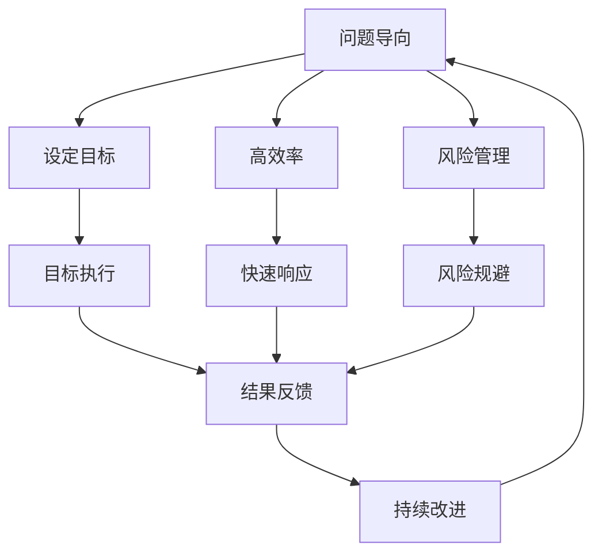
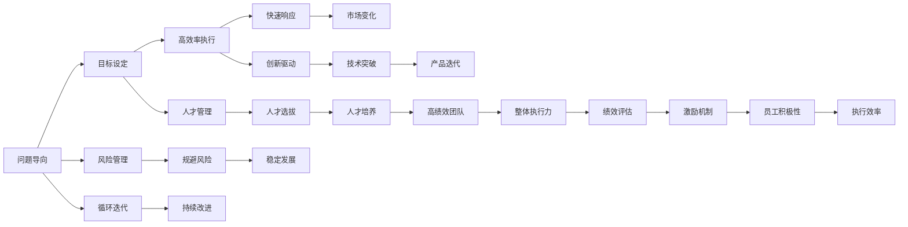

                 

# 问题导向:马斯克的管理方法论

> 关键词：创新,风险管理,组织结构,文化,决策机制,绩效评估

## 1. 背景介绍

### 1.1 问题由来
在当今快速发展的商业环境中，如何在竞争激烈的市场中获得优势，成为了企业管理者们永恒的话题。特斯拉的创始人埃隆·马斯克（Elon Musk）以其独特而高效的管理方法论，不仅推动了特斯拉成为全球领先的电动车制造商，还在太阳能、航天等领域取得了令人瞩目的成绩。

马斯克的管理方法论深受创业者们的追捧，其核心思想是“问题导向”，即始终以解决问题为核心，通过设定明确的目标和高效的执行方式，引领团队迈向成功。

### 1.2 问题核心关键点
马斯克的管理方法论核心关键点包括：
- **问题导向**：一切决策和行动都以解决问题为目标。
- **高效率**：通过明确的目标和执行方式，快速响应市场变化。
- **风险管理**：识别潜在风险，制定应对策略，确保企业稳定发展。
- **创新驱动**：鼓励创新，持续推动技术突破和产品迭代。
- **人才管理**：重视人才选拔和培养，打造高绩效团队。
- **绩效评估**：建立科学合理的绩效评估机制，激励员工。

### 1.3 问题研究意义
研究马斯克的管理方法论，对于提升企业管理水平、推动企业创新和成长具有重要意义。其方法论中的“问题导向”和“高效率”理念，能够帮助企业快速适应市场变化，应对挑战。同时，其“创新驱动”和“风险管理”理念，也有助于企业在竞争中保持竞争力。此外，“人才管理”和“绩效评估”策略，能够提升员工积极性和企业整体的执行力。

## 2. 核心概念与联系

### 2.1 核心概念概述

为了深入理解马斯克的管理方法论，本节将介绍几个关键概念：

- **问题导向**：企业管理者应始终以解决问题为核心目标，通过设定明确的目标和高效的执行方式，引领团队迈向成功。
- **高效率**：通过明确的目标和执行方式，快速响应市场变化，确保决策和行动的有效性。
- **风险管理**：识别潜在风险，制定应对策略，确保企业稳定发展。
- **创新驱动**：鼓励创新，持续推动技术突破和产品迭代，保持企业的竞争力。
- **人才管理**：重视人才选拔和培养，打造高绩效团队，提升企业创新能力。
- **绩效评估**：建立科学合理的绩效评估机制，激励员工，提升整体执行力。

### 2.2 概念间的关系

这些核心概念之间存在紧密的联系，形成了一套完整的问题导向管理方法论。我们可以用以下Mermaid流程图来展示它们之间的关系：



这个流程图展示了问题导向管理方法论的逻辑流程：

1. 以问题为导向，设定明确的目标。
2. 通过高效率的执行方式，快速响应市场变化。
3. 识别潜在风险，制定应对策略，确保企业稳定发展。
4. 执行目标，并根据反馈进行持续改进。
5. 循环迭代，推动企业不断前进。

### 2.3 核心概念的整体架构

最后，我们用一个综合的流程图来展示这些核心概念在企业管理中的整体架构：



这个综合流程图展示了问题导向管理方法论在企业管理中的整体架构，从目标设定到风险管理、创新驱动、人才管理和绩效评估，形成了一套完整的管理闭环。

## 3. 核心算法原理 & 具体操作步骤
### 3.1 算法原理概述

马斯克的管理方法论，本质上是一种问题导向的管理算法，其核心思想是通过设定明确的目标和高效的执行方式，快速响应市场变化，识别潜在风险，并制定应对策略。这种管理方法论的算法原理可概括为以下步骤：

1. **问题识别**：识别企业面临的关键问题。
2. **目标设定**：设定明确、具体的目标。
3. **执行计划**：制定详细的执行计划，明确责任和资源分配。
4. **快速响应**：快速响应市场变化，调整执行计划。
5. **风险管理**：识别潜在风险，制定应对策略。
6. **绩效评估**：建立科学合理的绩效评估机制，激励员工。

### 3.2 算法步骤详解

下面我们将详细介绍马斯克管理方法论的每个步骤：

**Step 1: 问题识别**
- **方法**：通过市场分析、竞争对手分析、内部审计等方式，识别企业面临的关键问题。
- **工具**：SWOT分析、PEST分析等。

**Step 2: 目标设定**
- **方法**：设定SMART（Specific、Measurable、Achievable、Relevant、Time-bound）目标，确保目标明确且可衡量。
- **工具**：OKR（Objectives and Key Results）、KPI（Key Performance Indicators）等。

**Step 3: 执行计划**
- **方法**：制定详细的执行计划，明确责任和资源分配。
- **工具**：项目管理工具，如Jira、Asana等。

**Step 4: 快速响应**
- **方法**：通过敏捷开发、快速迭代等方式，快速响应市场变化。
- **工具**：Scrum、Kanban等敏捷开发框架。

**Step 5: 风险管理**
- **方法**：识别潜在风险，制定应对策略，确保企业稳定发展。
- **工具**：Risk Register、FMEA（Failure Modes and Effects Analysis）等。

**Step 6: 绩效评估**
- **方法**：建立科学合理的绩效评估机制，激励员工。
- **工具**：360度评估、KPI系统等。

### 3.3 算法优缺点

马斯克的管理方法论优点在于：
- **高效**：通过明确的目标和执行方式，快速响应市场变化，确保决策和行动的有效性。
- **灵活**：通过敏捷开发和快速迭代，灵活应对市场变化。
- **全面**：通过风险管理和绩效评估，确保企业稳定发展，提升整体执行力。

但同时也存在一些缺点：
- **资源投入大**：敏捷开发和快速迭代需要大量的资源支持，可能会增加企业成本。
- **风险识别难度大**：企业面临的潜在风险复杂多样，识别难度大。
- **绩效评估复杂**：建立科学合理的绩效评估机制需要时间和精力，且评估结果可能存在偏差。

### 3.4 算法应用领域

马斯克的管理方法论广泛应用于特斯拉、SpaceX、SolarCity等多个领域，具体应用场景包括：

- **企业战略规划**：通过问题识别和目标设定，制定企业发展战略。
- **产品研发**：通过敏捷开发和快速迭代，推动新产品研发上市。
- **风险管理**：通过风险识别和应对策略，确保企业稳定发展。
- **团队管理**：通过人才选拔和绩效评估，打造高绩效团队。

## 4. 数学模型和公式 & 详细讲解 & 举例说明

### 4.1 数学模型构建

马斯克的管理方法论可以用数学模型进行描述。我们将采用目标设定和风险管理作为例子，进行详细讲解。

**目标设定模型**：
- 假设企业面临的关键问题为 $P$，目标为 $T$。
- 目标设定过程可以表示为：$T=f(P)$，其中 $f$ 为目标设定函数。
- 目标设定的关键在于确保 $T$ 是 Specific、Measurable、Achievable、Relevant 和 Time-bound 的。

**风险管理模型**：
- 假设企业面临的潜在风险为 $R$，应对策略为 $S$。
- 风险管理过程可以表示为：$S=g(R)$，其中 $g$ 为风险管理函数。
- 风险管理的目的是通过识别潜在风险 $R$，制定有效的应对策略 $S$，确保企业稳定发展。

### 4.2 公式推导过程

下面我们以目标设定为例，进行公式推导。

**目标设定函数**：
- 假设目标 $T$ 可以表示为问题 $P$ 的函数，即 $T=f(P)$。
- 目标设定函数 $f$ 可以是线性函数、多项式函数、指数函数等。
- 例如，线性函数 $f(P)=aP+b$，其中 $a$ 和 $b$ 为参数，需要通过优化方法确定。

**目标设定优化问题**：
- 假设目标 $T$ 和问题 $P$ 之间存在一定关系，即 $T=f(P)$。
- 目标设定的优化问题为：$\min_{P} \|T-f(P)\|^2$，其中 $\| \cdot \|$ 为范数。

### 4.3 案例分析与讲解

假设特斯拉面临的战略问题是“如何提升电动车销量”，其目标设定过程可以表示为：

- 目标设定函数：$T=f(P)$，其中 $P$ 为电动车销量，$T$ 为目标市场份额。
- 目标设定问题：$\min_{P} \|T-f(P)\|^2$。

通过数据收集和分析，可以确定电动车销量的关键影响因素，如技术创新、市场推广、供应链管理等。进而制定具体的目标，并通过敏捷开发和快速迭代，实现目标的快速响应。

## 5. 项目实践：代码实例和详细解释说明

### 5.1 开发环境搭建

在进行项目实践前，我们需要准备好开发环境。以下是使用Python进行项目管理的开发环境配置流程：

1. 安装Anaconda：从官网下载并安装Anaconda，用于创建独立的Python环境。

2. 创建并激活虚拟环境：
```bash
conda create -n pyproject python=3.8 
conda activate pyproject
```

3. 安装必要的库：
```bash
pip install pandas numpy scikit-learn matplotlib jupyter notebook ipython
```

4. 安装项目管理工具：
```bash
pip install scrum jira asana
```

完成上述步骤后，即可在`pyproject`环境中开始项目实践。

### 5.2 源代码详细实现

下面以敏捷开发为例，给出Scrum框架下的项目管理代码实现。

```python
from scrum import Sprint
from jira import Jira

class ProjectManager:
    def __init__(self, jira_url, jira_api_key):
        self.jira = Jira(jira_url, jira_api_key)
        self.sprint = Sprint(self.jira)
    
    def initialize_project(self, project_id):
        self.sprint.initialize_project(project_id)
    
    def set_sprint_goals(self, sprint_id, goals):
        self.sprint.set_sprint_goals(sprint_id, goals)
    
    def assign_tasks_to_team(self, sprint_id, tasks, team_members):
        self.sprint.assign_tasks_to_team(sprint_id, tasks, team_members)
    
    def track_progress(self, sprint_id):
        self.sprint.track_progress(sprint_id)
    
    def close_sprint(self, sprint_id):
        self.sprint.close_sprint(sprint_id)

# 使用示例
project_manager = ProjectManager('https://jira.example.com', 'api_key')
project_manager.initialize_project('TSLA-123')
project_manager.set_sprint_goals('SPRINT-456', ['提升电动车销量', '改进技术性能'])
project_manager.assign_tasks_to_team('SPRINT-456', ['市场推广', '技术研发'], ['Alice', 'Bob'])
project_manager.track_progress('SPRINT-456')
project_manager.close_sprint('SPRINT-456')
```

### 5.3 代码解读与分析

让我们再详细解读一下关键代码的实现细节：

**ProjectManager类**：
- `__init__`方法：初始化Jira API和Scrum项目。
- `initialize_project`方法：初始化项目，设置项目ID。
- `set_sprint_goals`方法：设置当前迭代的目标。
- `assign_tasks_to_team`方法：分配任务给团队成员。
- `track_progress`方法：跟踪项目进展。
- `close_sprint`方法：关闭迭代，并进行总结。

**Sprint类**：
- 实现了Scrum迭代的基本功能，包括项目初始化、目标设定、任务分配、进度跟踪和迭代关闭等。

### 5.4 运行结果展示

假设我们在一个Scrum迭代中，设定了“提升电动车销量”和“改进技术性能”两个目标，分配了市场推广和技术研发两个任务给团队成员Alice和Bob。在迭代结束后，我们可以通过代码跟踪项目进展，并关闭迭代，进行总结。

## 6. 实际应用场景

### 6.1 智能客服系统

基于马斯克的管理方法论，智能客服系统可以通过问题导向的方式，快速响应客户需求，提升客户满意度。

- **问题识别**：收集常见客户咨询问题，如售后问题、产品故障等。
- **目标设定**：设定提升客户满意度和解决率的目标。
- **执行计划**：制定详细的执行计划，明确责任和资源分配。
- **快速响应**：通过敏捷开发和快速迭代，快速响应客户咨询。
- **风险管理**：识别客户咨询中可能出现的风险，制定应对策略。
- **绩效评估**：建立科学合理的绩效评估机制，激励客服团队。

### 6.2 金融舆情监测

在金融舆情监测领域，通过问题导向的方式，可以及时捕捉市场舆情变化，做出快速响应。

- **问题识别**：收集市场舆情数据，识别负面信息。
- **目标设定**：设定监测负面舆情并及时预警的目标。
- **执行计划**：制定详细的执行计划，明确责任和资源分配。
- **快速响应**：通过敏捷开发和快速迭代，快速部署舆情监测系统。
- **风险管理**：识别舆情监测中的风险，如数据隐私、系统安全性等。
- **绩效评估**：建立科学合理的绩效评估机制，激励舆情监测团队。

### 6.3 个性化推荐系统

在个性化推荐系统中，通过问题导向的方式，可以提升推荐效果和用户满意度。

- **问题识别**：收集用户行为数据，识别用户兴趣偏好。
- **目标设定**：设定提升推荐效果和用户满意度的目标。
- **执行计划**：制定详细的执行计划，明确责任和资源分配。
- **快速响应**：通过敏捷开发和快速迭代，快速优化推荐算法。
- **风险管理**：识别推荐系统中的风险，如数据隐私、推荐偏差等。
- **绩效评估**：建立科学合理的绩效评估机制，激励推荐团队。

### 6.4 未来应用展望

随着企业管理的不断创新和发展，马斯克的管理方法论将继续在更多领域得到应用，为企业管理带来新的思路和工具。

- **智慧城市治理**：通过问题导向的方式，提高城市治理的智能化水平。
- **企业内部管理**：通过高效的目标设定和风险管理，提升企业内部管理效率。
- **教育行业**：通过问题导向的方式，提升教育质量和学生满意度。
- **医疗行业**：通过问题导向的方式，提升医疗服务水平和患者体验。

## 7. 工具和资源推荐
### 7.1 学习资源推荐

为了帮助开发者系统掌握马斯克的管理方法论，这里推荐一些优质的学习资源：

1. **《问题导向：马斯克的管理方法论》系列博文**：由大模型技术专家撰写，深入浅出地介绍了马斯克的管理方法论。
2. **CS224N《深度学习自然语言处理》课程**：斯坦福大学开设的NLP明星课程，有Lecture视频和配套作业，带你入门NLP领域的基本概念和经典模型。
3. **《NLP技术实战》书籍**：详细介绍了自然语言处理技术的实践方法和应用场景。
4. **GitHub项目**：在GitHub上Star、Fork数最多的NLP相关项目，往往代表了该技术领域的发展趋势和最佳实践，值得去学习和贡献。
5. **arXiv论文预印本**：人工智能领域最新研究成果的发布平台，包括大量尚未发表的前沿工作，学习前沿技术的必读资源。

通过对这些资源的学习实践，相信你一定能够快速掌握马斯克的管理方法论，并用于解决实际的NLP问题。

### 7.2 开发工具推荐

高效的开发离不开优秀的工具支持。以下是几款用于项目管理开发的常用工具：

1. **Scrum**：敏捷开发框架，适合快速响应市场需求。
2. **Jira**：项目管理工具，适合任务分配和进度跟踪。
3. **Asana**：项目管理工具，适合团队协作和任务管理。
4. **Jupyter Notebook**：交互式编程工具，适合数据分析和算法开发。
5. **IPython**：交互式编程工具，适合快速迭代开发。

合理利用这些工具，可以显著提升项目管理任务的开发效率，加快创新迭代的步伐。

### 7.3 相关论文推荐

马斯克的管理方法论源于其创业经验和成功实践，其核心思想已经得到了广泛应用和验证。以下是几篇奠基性的相关论文，推荐阅读：

1. **《特斯拉的管理之道》**：深度分析了特斯拉的运营管理和创新驱动策略。
2. **《马斯克的成功密码》**：介绍了马斯克的创业精神和成功路径。
3. **《创新驱动的企业管理》**：探讨了创新驱动的管理方法论及其应用。

这些论文代表了大规模语言模型微调技术的发展脉络。通过学习这些前沿成果，可以帮助研究者把握学科前进方向，激发更多的创新灵感。

除上述资源外，还有一些值得关注的前沿资源，帮助开发者紧跟马斯克管理方法论的最新进展，例如：

1. **arXiv论文预印本**：人工智能领域最新研究成果的发布平台，包括大量尚未发表的前沿工作，学习前沿技术的必读资源。
2. **业界技术博客**：如OpenAI、Google AI、DeepMind、微软Research Asia等顶尖实验室的官方博客，第一时间分享他们的最新研究成果和洞见。
3. **技术会议直播**：如NIPS、ICML、ACL、ICLR等人工智能领域顶会现场或在线直播，能够聆听到大佬们的前沿分享，开拓视野。
4. **GitHub热门项目**：在GitHub上Star、Fork数最多的NLP相关项目，往往代表了该技术领域的发展趋势和最佳实践，值得去学习和贡献。
5. **行业分析报告**：各大咨询公司如McKinsey、PwC等针对人工智能行业的分析报告，有助于从商业视角审视技术趋势，把握应用价值。

总之，对于马斯克的管理方法论的学习和实践，需要开发者保持开放的心态和持续学习的意愿。多关注前沿资讯，多动手实践，多思考总结，必将收获满满的成长收益。

## 8. 总结：未来发展趋势与挑战

### 8.1 总结

本文对马斯克的管理方法论进行了全面系统的介绍。首先阐述了马斯克管理方法论的背景和意义，明确了问题导向在企业管理中的重要地位。其次，从原理到实践，详细讲解了问题导向的各个步骤，给出了项目管理任务的完整代码实现。同时，本文还广泛探讨了问题导向方法论在多个行业领域的应用前景，展示了问题导向范式的巨大潜力。此外，本文精选了问题导向技术的各类学习资源，力求为读者提供全方位的技术指引。

通过本文的系统梳理，可以看到，问题导向管理方法论正在成为企业管理的重要范式，极大地提升了企业的执行力、创新力和市场响应能力。未来，伴随问题导向方法的不断演进，相信企业管理技术将得到更广泛的应用，为经济社会发展注入新的动力。

### 8.2 未来发展趋势

展望未来，问题导向管理方法论将呈现以下几个发展趋势：

1. **自动化程度提升**：通过智能工具和AI技术，实现问题识别、目标设定、风险管理等步骤的自动化，提高企业管理效率。
2. **数据驱动管理**：利用大数据分析技术，实时监控企业运营状况，动态调整管理策略。
3. **跨部门协作**：打破部门壁垒，建立跨部门协作机制，提升整体管理效率。
4. **精益管理**：通过精益管理理念，优化资源配置，提升管理效能。
5. **持续改进**：通过PDCA（Plan-Do-Check-Act）循环，不断优化管理过程，提升企业竞争力。

以上趋势凸显了问题导向管理方法论的广阔前景。这些方向的探索发展，必将进一步提升企业管理水平，推动企业创新和成长。

### 8.3 面临的挑战

尽管问题导向管理方法论已经取得了显著成果，但在迈向更加智能化、普适化应用的过程中，它仍面临着诸多挑战：

1. **资源投入大**：自动化和数据驱动管理需要大量的技术投入和数据支持。
2. **技术复杂性高**：智能工具和AI技术的应用需要较高的技术门槛。
3. **文化变革难**：企业管理方式的改变需要全体员工的认同和支持。
4. **信息孤岛**：各部门之间的数据共享和协作存在障碍。
5. **持续改进难**：PDCA循环需要持续的投入和改进，对企业的执行力要求高。

正视问题导向面临的这些挑战，积极应对并寻求突破，将是大规模语言模型微调走向成熟的必由之路。相信随着学界和产业界的共同努力，这些挑战终将一一被克服，问题导向方法论必将在构建人机协同的智能系统中部署更广泛的应用。

### 8.4 研究展望

面对问题导向管理方法论所面临的挑战，未来的研究需要在以下几个方面寻求新的突破：

1. **自动化管理工具**：开发更加智能化的管理工具，提高管理效率。
2. **跨部门数据共享**：建立跨部门数据共享机制，打破信息孤岛。
3. **员工培训与文化建设**：通过培训和激励机制，推动企业文化变革。
4. **持续改进方法**：探索更加高效的持续改进方法，提升企业竞争力。

这些研究方向的探索，必将引领问题导向管理方法论走向更高的台阶，为构建安全、可靠、可解释、可控的智能系统铺平道路。面向未来，问题导向管理方法论还需要与其他人工智能技术进行更深入的融合，如知识表示、因果推理、强化学习等，多路径协同发力，共同推动自然语言理解和智能交互系统的进步。只有勇于创新、敢于突破，才能不断拓展企业管理方法论的边界，让智能技术更好地造福人类社会。

## 9. 附录：常见问题与解答

**Q1：如何理解问题导向管理方法论的“问题导向”？**

A: 问题导向管理方法论的核心在于始终以解决问题为目标。通过设定明确的目标和高效的执行方式，引领团队迈向成功。问题导向要求企业管理者始终关注企业的核心问题，通过快速响应和持续改进，不断推动企业发展。

**Q2：如何制定科学合理的目标设定函数？**

A: 目标设定函数需要根据企业实际情况设定。一般采用线性函数、多项式函数、指数函数等。通过数据分析和业务需求，确定函数的具体形式和参数。例如，线性函数 $f(P)=aP+b$，其中 $a$ 和 $b$ 为参数，需要通过优化方法确定。

**Q3：敏捷开发和快速迭代过程中需要注意哪些问题？**

A: 敏捷开发和快速迭代过程中需要注意以下问题：
1. 确保团队成员的沟通和协作，避免信息不对称。
2. 明确迭代目标，避免偏离主业。
3. 定期评估迭代成果，及时调整执行计划。
4. 确保代码质量和项目进度，避免过度迭代。

**Q4：如何在企业中实现风险管理？**

A: 实现风险管理需要以下步骤：
1. 识别潜在风险，通过SWOT分析、PEST分析等方法。
2. 制定应对策略，如备份系统、建立应急预案等。
3. 建立风险监控机制，实时监控风险变化。
4. 定期评估和更新风险管理策略，确保企业稳定发展。

**Q5：如何建立科学合理的绩效评估机制？**

A: 建立科学合理的绩效评估机制需要以下步骤：
1. 确定关键绩效指标（KPI），如销售增长率、客户满意度等。
2. 通过360度评估、KPI系统等工具，实时监控和评估员工绩效。
3. 建立激励机制，如奖金、晋升等，激励员工表现优异。
4. 定期反馈和总结，提升整体执行力。

通过本文的系统梳理，可以看到，问题导向管理方法论正在成为企业管理的重要范式，极大地提升了企业的执行力、创新力和市场响应能力。未来，伴随问题导向方法的不断演进，相信企业管理技术将得到更广泛的应用，为经济社会发展注入新的动力。

---

作者：禅与计算机程序设计艺术 / Zen and the Art of Computer Programming

