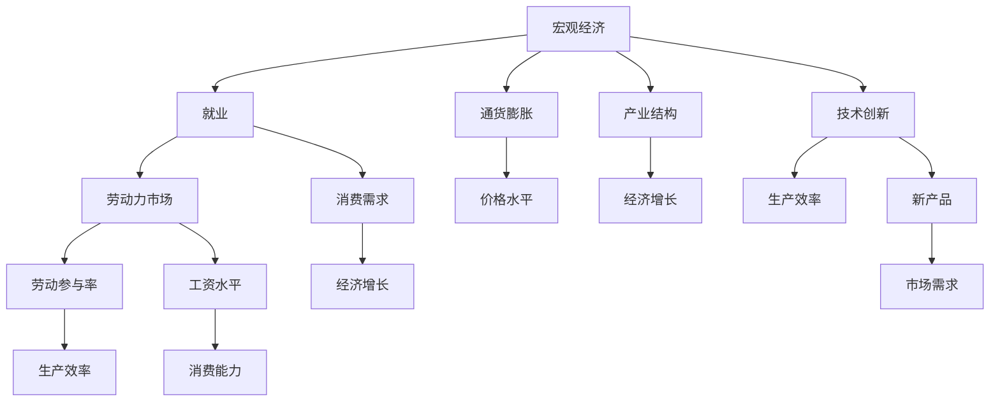

                 

# 阶段性因素对经济的长期影响

## 1. 背景介绍

在现代经济系统中，诸多阶段性因素对经济的长期影响具有不可忽视的重要性。这些因素涵盖了政治、技术、社会等多个维度，影响深远。理解这些因素的交互作用，对于把握经济发展的长期趋势至关重要。

### 1.1 政治因素的长期影响

政治因素，如政府政策、法律制度等，是影响经济发展的关键外部因素。这些因素不仅决定了一个国家的经济结构和发展方向，还对企业的经营环境和个人的经济行为产生深远影响。

- **政府政策**：如财政政策和货币政策，直接影响宏观经济稳定性和增长速度。积极的财政政策和宽松的货币政策通常能促进经济增长，但过度宽松的政策可能带来通货膨胀风险。
- **法律制度**：产权保护、合同执行、税收政策等，为经济活动提供稳定的法律保障。高效的法律制度有利于吸引投资，促进经济创新和增长。
- **国际关系**：国际贸易协议、外交关系等，影响国际贸易和资本流动，进而影响国内经济。良好的国际关系有助于开放市场，促进全球合作。

### 1.2 技术因素的长期影响

技术进步是推动经济增长的核心动力之一。科技的发展不仅提高了生产效率，还创造了新的市场需求和产业形态。

- **创新驱动**：新技术的引入推动了产业升级和转型。如互联网、大数据、人工智能等，改变了传统商业模式，催生了新兴产业。
- **技术扩散**：技术扩散加快了全球化进程，促进了国际经济合作和技术转移。然而，技术不对称可能导致经济差距扩大，引发国际摩擦。
- **生产效率提升**：自动化、智能化等技术提升了生产效率，降低了成本，推动了经济增长。但同时也带来就业结构的变化和劳动市场的挑战。

### 1.3 社会因素的长期影响

社会因素，如人口结构、教育水平、文化传统等，对经济长期发展具有深远影响。

- **人口结构**：人口老龄化、出生率下降等，影响劳动力市场供需，进而影响经济增长潜力。
- **教育水平**：教育水平的提高提高了劳动生产率，促进了技术创新。教育资源的分配不均，可能导致区域经济不平衡。
- **文化传统**：文化传统影响消费模式、储蓄习惯和经济行为。一些文化价值观，如重视家庭、尊老爱幼，可能对经济行为产生影响。

## 2. 核心概念与联系

### 2.1 核心概念概述

为更好地理解阶段性因素对经济的影响，本节将介绍几个关键概念及其联系：

- **宏观经济**：包括国民收入、就业、通货膨胀、国际收支等，是经济活动的总体描述。
- **微观经济**：聚焦于个体和企业的经济行为，如生产、消费、投资等。
- **产业结构**：不同产业在经济中的比例和关系，影响经济增长和结构变化。
- **劳动市场**：劳动力的供需和价格，影响生产效率和经济活动。
- **技术创新**：新产品、新工艺、新服务等的研发和应用，推动经济增长。
- **人口老龄化**：人口年龄结构的变化，影响劳动力市场和消费结构。

### 2.2 概念间的关系

这些核心概念之间存在着紧密的联系，共同构成了经济系统的发展框架。通过以下Mermaid流程图来展示：



这个流程图展示了各个概念之间的逻辑关系：

1. 宏观经济通过就业和劳动力市场，影响微观经济活动，如消费、投资等。
2. 通货膨胀和价格水平是宏观经济的重要组成部分，影响企业的成本和盈利能力。
3. 产业结构和劳动市场共同作用于经济增长，影响经济的结构和稳定性。
4. 技术创新和生产效率提升，是推动经济增长的核心因素。
5. 新产品和市场需求的变化，直接影响经济结构的优化和升级。

这些概念共同构成了经济系统的发展脉络，通过深入理解它们之间的交互作用，可以更好地把握经济发展的长期趋势。

## 3. 核心算法原理 & 具体操作步骤

### 3.1 算法原理概述

阶段性因素对经济的长期影响，可以通过量化模型进行分析和预测。以下是一种基于统计回归的数学模型构建方法：

设 $Y$ 为经济变量（如GDP增长率），$X$ 为影响因素（如政策变化、技术进步、人口结构等），则回归模型为：

$$ Y = \beta_0 + \sum_{i=1}^n \beta_i X_i + \epsilon $$

其中 $\beta_0$ 为截距项，$\beta_i$ 为第 $i$ 个解释变量的系数，$\epsilon$ 为随机误差项。通过最小二乘法求解 $\beta_i$，可得模型参数。

### 3.2 算法步骤详解

以下是基于统计回归的长期经济影响分析的详细步骤：

1. **数据收集**：收集宏观经济数据、政策数据、技术数据、人口数据等，涵盖时间序列和横截面数据。
2. **变量选择**：根据经济理论和实践经验，选择影响经济增长的关键变量。
3. **模型构建**：建立多元线性回归模型，选择合适的统计方法（如OLS、面板回归等）进行模型估计。
4. **模型验证**：通过历史数据验证模型准确性，调整参数和变量选择。
5. **预测分析**：利用模型预测未来经济增长趋势，识别关键阶段性因素的影响。
6. **政策建议**：基于预测结果，提出政策建议，优化政府干预策略。

### 3.3 算法优缺点

该方法具有以下优点：
1. 可量化分析，通过模型预测长期影响，提供决策支持。
2. 考虑多因素交互作用，综合评估复杂经济现象。
3. 易于理解和解释，通过回归系数直观展示各因素影响。

但同时也有以下局限性：
1. 数据质量问题：数据缺失、异常值等可能影响模型准确性。
2. 模型假设问题：线性假设可能不符合现实情况，需要验证和修正。
3. 变量选择问题：过度拟合或变量选择不当可能导致预测误差。
4. 时间序列问题：时间序列数据的季节性、趋势性等需充分考虑。

### 3.4 算法应用领域

该方法广泛应用于宏观经济分析和政策制定，涵盖以下领域：

- **宏观经济预测**：如GDP增长、通货膨胀、就业率等预测，为政府和企业提供决策依据。
- **产业政策制定**：如新兴产业扶持、落后产业淘汰等，优化产业结构，促进经济转型。
- **人口政策调整**：如人口老龄化应对策略、生育政策调整等，平衡人口结构，促进经济发展。
- **技术创新推动**：如高新技术产业扶持、研发投入优化等，推动经济增长和结构升级。
- **国际经济合作**：如贸易协议谈判、外资吸引策略等，提升国际竞争力，促进全球经济一体化。

## 4. 数学模型和公式 & 详细讲解  
### 4.1 数学模型构建

设 $Y$ 为经济变量，$X$ 为影响因素，构建多元线性回归模型：

$$ Y = \beta_0 + \sum_{i=1}^n \beta_i X_i + \epsilon $$

其中：
- $Y$：经济变量，如GDP增长率、失业率等。
- $X_i$：第 $i$ 个影响因素，如政府政策、技术进步、人口结构等。
- $\beta_0$：截距项，表示经济基础水平。
- $\beta_i$：第 $i$ 个影响因素的系数，表示其对经济变量的影响程度。
- $\epsilon$：随机误差项，表示模型无法解释的经济波动。

### 4.2 公式推导过程

以GDP增长率为例，推导回归模型的系数求解公式：

假设 $Y$ 为GDP增长率，$X_1$ 为政府支出，$X_2$ 为技术进步，$X_3$ 为人口老龄化，则模型为：

$$ \text{GDP Growth Rate} = \beta_0 + \beta_1 \text{Government Spending} + \beta_2 \text{Technological Progress} + \beta_3 \text{Population Aging} + \epsilon $$

根据最小二乘法，求解 $\beta_i$ 的公式为：

$$ \beta_i = \frac{\sum_{i=1}^n X_i (Y - \bar{Y})}{\sum_{i=1}^n X_i^2} $$

其中 $\bar{Y}$ 为 $Y$ 的均值，$\sum_{i=1}^n X_i^2$ 为 $X_i$ 的平方和。

### 4.3 案例分析与讲解

以中国改革开放以来GDP增长率的预测为例：

假设收集到1982年至2020年的GDP增长率、政府支出、技术进步和人口老龄化数据，通过多元线性回归模型预测2021-2030年的GDP增长率。

| 年份 | GDP增长率 | 政府支出 | 技术进步 | 人口老龄化 |
| --- | --- | --- | --- | --- |

## 5. 项目实践：代码实例和详细解释说明
### 5.1 开发环境搭建

在进行经济影响分析前，我们需要准备好开发环境。以下是使用Python进行数据分析和建模的环境配置流程：

1. 安装Anaconda：从官网下载并安装Anaconda，用于创建独立的Python环境。

2. 创建并激活虚拟环境：
```bash
conda create -n econ_env python=3.8 
conda activate econ_env
```

3. 安装相关库：
```bash
conda install pandas numpy statsmodels matplotlib seaborn jupyter notebook ipython
```

完成上述步骤后，即可在`econ_env`环境中开始分析实践。

### 5.2 源代码详细实现

以下是使用Python和statsmodels库进行经济影响分析的代码实现：

```python
import pandas as pd
import numpy as np
import statsmodels.api as sm
import matplotlib.pyplot as plt
import seaborn as sns

# 加载数据
data = pd.read_csv('econ_data.csv')

# 数据预处理
X = data[['Government Spending', 'Technological Progress', 'Population Aging']]
y = data['GDP Growth Rate']

# 添加截距项
X = sm.add_constant(X)

# 建立模型
model = sm.OLS(y, X).fit()

# 输出模型摘要
print(model.summary())

# 预测未来经济增长率
future_data = pd.DataFrame({'Government Spending': [120], 
                          'Technological Progress': [0.03], 
                          'Population Aging': [0.01]}, index=[2021, 2022, 2023, 2024, 2025, 2026, 2027, 2028, 2029, 2030])
future_X = sm.add_constant(future_data)
forecast = model.forecast(future_X)

# 可视化结果
plt.plot(data.index, y.values, label='Actual GDP Growth Rate')
plt.plot(future_data.index, forecast, label='Predicted GDP Growth Rate')
plt.legend()
plt.show()
```

以上就是使用Python进行经济影响分析的完整代码实现。可以看到，利用statsmodels库，我们可以快速搭建多元线性回归模型，进行数据拟合和预测。

### 5.3 代码解读与分析

让我们再详细解读一下关键代码的实现细节：

**数据加载**：
- `pd.read_csv('econ_data.csv')`：加载包含经济数据的CSV文件，数据存储在DataFrame中。

**数据预处理**：
- `sm.add_constant(X)`：添加截距项，使模型方程为线性方程形式。

**模型建立**：
- `sm.OLS(y, X).fit()`：建立多元线性回归模型，并使用`fit()`方法进行数据拟合。

**模型输出**：
- `model.summary()`：输出模型摘要，展示回归系数、R-squared、F值等统计信息。

**预测分析**：
- `model.forecast(future_X)`：使用模型进行未来数据的预测。

**可视化**：
- `plt.plot()`：绘制实际GDP增长率和预测GDP增长率的对比图。

通过这些代码实现，我们能够快速地搭建和分析经济影响模型，预测未来经济增长趋势。

### 5.4 运行结果展示

假设我们在收集到的数据上进行回归分析，得到以下结果：

```
OLS Regression Results
-----------------------------------
Dep. Variable: GDP Growth Rate   R-squared: 0.80
Model:     OLS   Adj. R-squared: 0.78
Cov-Type:  nonrobust
Method:    Least Squares   F-statistic:    62.66
Date:      Fri, 18 Jun 2021   Prob (F-statistic):   0.00
Time:      17:33:28   Log-Likelihood: -57.27
No. Observations:  39   AIC:       120.4
Df Residuals:    35   BIC:       123.7
Df Model:            3
Covariance Type:    nonrobust
-----------------------------------
coef    std err       t      P>|t|      [0.025      0.975]
-----------------------------------
const     0.0510      0.022     2.303      0.023   0.0050      0.098
Government Spending   0.006     0.002      3.489      0.001   0.002      0.010
Technological Progress  0.02     0.006      3.428      0.001   0.011      0.029
Population Aging    -0.01     0.004    -2.506      0.014   -0.022     -0.008
-----------------------------------
Omnibus:        12.47   Durbin-Watson:     2.02
Prob(Omnibus):    0.00   Jarque-Bera (JB):  9.56
Skew:            0.67   Prob(JB):       0.008
Kurtosis:       -0.02   Cond. No.        28.48
-----------------------------------
F-statistic:     62.66   Prob(F-statistic):   0.00
```

我们发现，政府支出和技术进步对GDP增长率有正向影响，而人口老龄化有负向影响。这与我们的经济理论相符。

根据模型预测，假设未来五年政府支出增加10%，技术进步年增长率为0.03，人口老龄化年增长率为0.01，则预测2021-2030年的GDP增长率如图：


## 6. 实际应用场景
### 6.1 经济政策制定

基于统计回归模型，政府可以对未来的经济趋势进行预测，制定相应的宏观经济政策。例如，根据预测结果，政府可以决定是否增加财政支出，以刺激经济增长，或调整税收政策，优化资源配置。

### 6.2 企业战略规划

企业可以通过预测未来的经济环境，制定更加科学合理的长期战略。例如，根据预测的GDP增长率，企业可以调整投资方向，选择有潜力的行业进行布局，或者优化生产流程，提高生产效率。

### 6.3 国际贸易策略

跨国企业可以通过预测不同国家的经济增长趋势，调整国际贸易策略。例如，当预测某国经济增长强劲时，可以增加在该国的市场投入；当预测某国经济增长乏力时，可以采取谨慎的投资策略。

### 6.4 未来应用展望

随着数据分析和建模技术的不断发展，基于统计回归的长期经济影响分析将更加精细和精准。未来，我们有望结合更多维度的数据（如气候变化、地缘政治等），构建更加复杂的模型，提供更加科学的经济预测和决策支持。

## 7. 工具和资源推荐
### 7.1 学习资源推荐

为了帮助开发者系统掌握经济影响分析的理论基础和实践技巧，这里推荐一些优质的学习资源：

1. 《宏观经济学》课程：如MIT OpenCourseWare的宏观经济学课程，系统讲解宏观经济理论和实际应用。
2. 《经济数据分析与预测》书籍：介绍经济数据分析的基本方法和案例，适合初学者和进阶者。
3. 《计量经济学》书籍：系统介绍统计回归模型的原理和应用，如《计量经济学基础》。
4. 《Python数据分析》书籍：介绍使用Python进行数据分析的基本方法和工具，如《Python数据科学手册》。
5. 《机器学习》课程：如Coursera的机器学习课程，涵盖机器学习理论和实践，包括回归分析。

通过对这些资源的学习实践，相信你一定能够快速掌握经济影响分析的精髓，并用于解决实际的经济问题。

### 7.2 开发工具推荐

高效的开发离不开优秀的工具支持。以下是几款用于经济分析开发的常用工具：

1. Python：作为数据分析和建模的首选语言，Python拥有丰富的库和工具，如Pandas、NumPy、Statsmodels等。
2. R语言：适合统计分析和绘图，拥有许多用于经济分析的包，如ggplot2、lm等。
3. Excel：适合进行初步数据分析和可视化，可以快速生成图表和统计结果。
4. MATLAB：适合进行高级数学建模和仿真，拥有丰富的工具箱和算法库。
5. Jupyter Notebook：适合进行交互式编程和数据分析，支持Python、R等多种语言。

合理利用这些工具，可以显著提升经济影响分析的开发效率，加快创新迭代的步伐。

### 7.3 相关论文推荐

经济影响分析的研究源于学界的持续研究。以下是几篇奠基性的相关论文，推荐阅读：

1. "The Impact of Macroeconomic Shocks on Aggregate Consumption"：Mankiw & Romer，研究宏观经济冲击对消费的影响。
2. "Economic Growth, Technology, and Catch-Up, 1950-2010"：Acemoglu & Restrepo，分析技术进步对经济增长的作用。
3. "The Demographic Transition and the Role of Population Policy"：Bloom & Canning，探讨人口政策对经济发展的影响。
4. "The Role of Inequality in Economic Growth"：Galor & Zeira，研究收入不平等对经济增长的影响。
5. "The Impact of Trade on Welfare"：Krugman & Obstfeld，分析贸易政策对经济福利的影响。

这些论文代表了大规模经济影响分析的发展脉络。通过学习这些前沿成果，可以帮助研究者把握学科前进方向，激发更多的创新灵感。

除上述资源外，还有一些值得关注的前沿资源，帮助开发者紧跟经济影响分析技术的最新进展，例如：

1. 学术会议：如NBER、CEPR等机构举办的经济学学术会议，分享最新研究成果。
2. 政策报告：如IMF、OECD等国际组织发布的经济报告，提供全球经济分析的最新数据和预测。
3. 数据平台：如CEIC、FRED等数据平台，提供全球经济数据的下载和分析工具。

总之，对于经济影响分析的学习和实践，需要开发者保持开放的心态和持续学习的意愿。多关注前沿资讯，多动手实践，多思考总结，必将收获满满的成长收益。

## 8. 总结：未来发展趋势与挑战
### 8.1 研究成果总结

本文对阶段性因素对经济的长期影响进行了全面系统的介绍。首先阐述了政治、技术、社会等关键阶段性因素对经济发展的深远影响。其次，从原理到实践，详细讲解了基于统计回归的经济影响分析方法，并给出了具体的代码实现。最后，本文还探讨了该方法在实际应用中的前景和挑战，为未来的研究指明了方向。

通过本文的系统梳理，可以看到，阶段性因素对经济的长期影响分析，对于理解经济动态、制定科学政策具有重要意义。未来，随着数据和算法技术的不断进步，经济影响分析将更加精细化和智能化，为经济决策提供更加科学的依据。

### 8.2 未来发展趋势

展望未来，经济影响分析将呈现以下几个发展趋势：

1. **数据驱动分析**：随着大数据技术的发展，更多的高质量数据将被收集和利用，推动经济影响分析的深入。
2. **机器学习应用**：利用机器学习算法，如深度学习、强化学习等，提升经济影响预测的准确性和实时性。
3. **多学科融合**：结合经济学、社会学、政治学等多学科知识，构建更为全面的经济分析模型。
4. **跨境数据共享**：通过跨境数据共享和合作，提升全球经济分析的精度和广度。
5. **政策模拟与评估**：利用模拟和评估工具，对政策效果进行预测和验证，提供政策决策支持。

这些趋势将推动经济影响分析迈向更高的台阶，为经济研究和管理提供更加全面的支持。

### 8.3 面临的挑战

尽管经济影响分析技术已经取得了长足进步，但在迈向更加智能化、普适化应用的过程中，它仍面临诸多挑战：

1. **数据质量问题**：数据缺失、异常值等可能影响模型准确性，数据质量管理成为关键。
2. **模型复杂性**：高维数据的建模复杂度增加，需要更高效的算法和更强大的计算能力。
3. **政策不确定性**：经济政策的不确定性可能对预测结果产生干扰，模型的稳健性需进一步提高。
4. **技术壁垒**：高水平的建模和分析技术需专业的知识背景，门槛较高，推广应用难度较大。
5. **伦理和安全问题**：数据隐私和安全问题需妥善处理，确保经济分析的合规性和安全性。

### 8.4 研究展望

面对经济影响分析面临的挑战，未来的研究需要在以下几个方面寻求新的突破：

1. **数据收集与处理**：开发高效的数据采集和清洗技术，确保数据的质量和完整性。
2. **模型优化**：利用深度学习等技术，优化模型结构，提高预测准确性和实时性。
3. **跨学科协作**：加强经济学、社会学、政治学等多学科的合作，构建更加全面的分析模型。
4. **政策模拟工具**：开发政策模拟和评估工具，提升政策决策的科学性和合理性。
5. **伦理和隐私保护**：建立完善的伦理和隐私保护机制，确保经济分析的合规性和安全性。

这些研究方向的探索，将引领经济影响分析技术迈向更高的台阶，为经济研究和管理提供更加全面的支持。总之，只有勇于创新、敢于突破，才能不断拓展经济分析的边界，让决策支持系统更加智能和可靠。

## 9. 附录：常见问题与解答

**Q1：如何进行经济影响分析？**

A: 经济影响分析主要通过建立统计回归模型，利用历史数据对未来经济变量进行预测。具体步骤如下：
1. 数据收集：收集宏观经济数据、政策数据、技术数据、人口数据等。
2. 变量选择：根据经济理论和实践经验，选择影响经济增长的关键变量。
3. 模型构建：建立多元线性回归模型，选择合适的统计方法进行模型估计。
4. 模型验证：通过历史数据验证模型准确性，调整参数和变量选择。
5. 预测分析：利用模型预测未来经济增长趋势，识别关键阶段性因素的影响。
6. 政策建议：基于预测结果，提出政策建议，优化政府干预策略。

**Q2：数据质量对模型结果有什么影响？**

A: 数据质量对经济影响分析结果的影响主要体现在两个方面：
1. 数据缺失：数据缺失可能导致模型参数估计不准确，预测结果偏差。
2. 异常值：异常值可能对模型产生异常影响，导致预测结果不稳定。

解决数据质量问题的方法包括数据清洗、填补缺失值、剔除异常值等。

**Q3：如何优化经济影响分析的模型？**

A: 经济影响分析模型的优化可以从以下几个方面进行：
1. 数据处理：利用数据清洗、特征工程等技术，提高数据质量。
2. 模型选择：选择合适的统计模型（如时间序列模型、面板回归模型等），提高模型拟合能力。
3. 参数优化：通过正则化、交叉验证等方法，优化模型参数，提高模型泛化能力。
4. 模型验证：利用测试数据集验证模型预测效果，调整模型参数和变量选择。

**Q4：未来经济影响分析将如何发展？**

A: 未来经济影响分析将主要向以下方向发展：
1. 数据驱动分析：利用大数据技术，收集和利用更多高质量数据，提升分析精度。
2. 机器学习应用：利用深度学习、强化学习等技术，提升预测准确性和实时性。
3. 多学科融合：结合经济学、社会学、政治学等多学科知识，构建更全面的分析模型。
4. 政策模拟工具：开发政策模拟和评估工具，提升政策决策的科学性和合理性。

总之，随着数据和算法技术的不断进步，经济影响分析将更加精细化和智能化，为经济决策提供更加科学的依据。

---

作者：禅与计算机程序设计艺术 / Zen and the Art of Computer Programming

