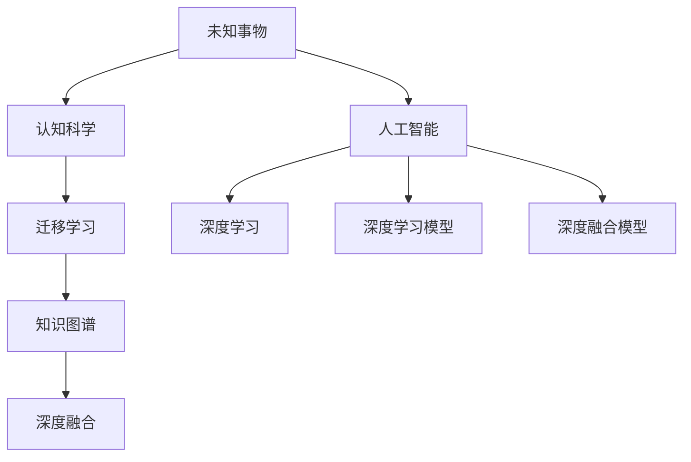

                 

## 1. 背景介绍

### 1.1 问题由来
面对未知事物是人类社会长期面临的一大挑战。在现代社会中，这种挑战表现得尤为突出，尤其是在技术不断进步、信息爆炸的背景下。未知事物的认知演变，成为了理解人类智能演进、推动技术创新和社会进步的关键所在。

### 1.2 问题核心关键点
本文聚焦于认知科学和人工智能领域，探讨人类如何通过技术手段应对未知事物，提升认知能力。关键点包括：

- **未知事物的认知**：定义未知事物及其特点，理解认知过程中的挑战与机遇。
- **人工智能的介入**：通过人工智能技术，探索未知事物认知的新路径。
- **技术与伦理**：如何平衡技术发展与伦理道德的关系，确保技术应用的安全性和公正性。
- **跨学科研究**：结合心理学、认知科学、计算机科学等学科，多角度探讨认知演变的规律和趋势。

### 1.3 问题研究意义
研究未知事物的认知演变，对于理解人类智能的本质，推动人工智能技术的创新，以及促进社会与技术和谐发展，具有重要意义：

1. **理解智能本源**：通过研究未知事物认知，可以更深刻地理解人类智能的起源和发展，为智能研究提供理论基础。
2. **推动技术创新**：未知事物的认知过程，可以启发新的算法设计、模型训练方法，推动AI技术的不断进步。
3. **促进社会进步**：通过解决未知事物认知问题，可以提高社会管理和决策的科学性，促进社会公平与和谐。
4. **提升伦理意识**：认知未知事物的同时，必须考虑伦理道德问题，确保技术应用的社会责任。

## 2. 核心概念与联系

### 2.1 核心概念概述

本文涉及的核心概念主要包括以下几个方面：

- **未知事物**：指未知或未经验证的事实、现象、事件，其特点是具有高度的不确定性和复杂性。
- **认知科学**：研究人类和动物如何获取、存储、处理和应用知识的过程，包括感知、记忆、学习等。
- **人工智能**：通过计算机模拟人类智能，实现信息的处理、理解、推理等任务。
- **深度学习**：一种基于神经网络的机器学习方法，通过多层非线性变换，实现对复杂数据的表示和处理。
- **迁移学习**：通过在一个领域上训练好的模型，迁移到另一个领域进行任务，以减少新任务的学习时间。
- **知识图谱**：一种结构化的知识表示方式，用于描述实体、属性和它们之间的关系。
- **深度融合**：指通过技术手段将认知科学、人工智能等领域的知识融合，形成新的解决方案。

### 2.2 概念间的关系

这些核心概念之间的逻辑关系可以通过以下Mermaid流程图来展示：



这个流程图展示了大语言模型微调过程中各个概念的关联关系：

1. 未知事物是认知科学的研究对象，人工智能是解决未知事物认知问题的技术手段。
2. 深度学习是人工智能的核心技术，迁移学习是通过已有知识解决新问题的有效方法。
3. 知识图谱和深度融合是提升人工智能模型性能的重要技术，有助于更好地理解和应用未知事物。

## 3. 核心算法原理 & 具体操作步骤

### 3.1 算法原理概述

面对未知事物的认知，人工智能提供了一种高效、系统化的解决方案。其核心算法原理基于深度学习和迁移学习，主要通过以下步骤实现：

1. **数据采集**：收集未知事物的相关数据，包括文本、图像、音频等。
2. **预处理**：对原始数据进行清洗、标注、归一化等预处理操作。
3. **模型训练**：利用深度学习模型，如卷积神经网络、循环神经网络、变分自编码器等，对预处理后的数据进行训练。
4. **迁移学习**：将训练好的模型迁移到新的未知事物任务上，进行微调或重新训练。
5. **模型评估**：通过验证集和测试集对模型性能进行评估，优化模型参数和结构。
6. **实际应用**：将优化后的模型应用于实际问题，如自动驾驶、医疗诊断、智能客服等。

### 3.2 算法步骤详解

**步骤1：数据采集和预处理**

数据采集是未知事物认知的首要步骤。数据应尽可能丰富、多样，涵盖不同场景、不同维度的信息。例如，对于自动驾驶，需要采集车辆行驶的摄像头图像、雷达数据、GPS数据等。

预处理包括数据清洗、标注、归一化等操作。例如，图像数据需要进行去噪、裁剪、旋转、缩放等操作，文本数据需要进行分词、去停用词、词向量化等操作。

**步骤2：模型训练和迁移学习**

模型训练是认知演变的核心步骤。首先，需要选择合适的深度学习模型，如卷积神经网络（CNN）、循环神经网络（RNN）、长短时记忆网络（LSTM）等。然后，利用标注好的数据集，对模型进行训练，优化其参数。

迁移学习是将已有模型的知识迁移到新任务上的关键技术。这可以通过微调（Fine-tuning）、适配器微调（Adapter-based Fine-tuning）、LoRA等方法实现。微调是指在原有模型基础上，继续训练特定层的参数，以适应新任务。适配器微调则是冻结底层参数，仅微调顶层参数。LoRA方法是将底层参数转换为低秩表示，提升微调效率。

**步骤3：模型评估和优化**

模型评估是衡量认知效果的重要手段。使用验证集对模型进行评估，比较不同模型的性能，选择最优模型。评估指标包括准确率、召回率、F1分数等。

模型优化是提升认知性能的关键步骤。可以通过调整模型结构、更新模型参数、增加数据增强等方法，进一步优化模型性能。

**步骤4：实际应用和持续学习**

实际应用是将认知模型应用于实际问题，如自动驾驶、医疗诊断、智能客服等。通过在实际场景中收集反馈，不断优化模型，提升认知效果。

持续学习是认知演变的长期过程。随着时间的推移，新的未知事物不断出现，需要通过持续学习，不断更新模型，保持其性能。

### 3.3 算法优缺点

基于深度学习和迁移学习的认知演变算法具有以下优点：

1. **高效性**：通过已有模型的迁移学习，大大减少了新任务的学习时间。
2. **适应性**：可以适应不同场景、不同维度的未知事物，具有较强的泛化能力。
3. **可扩展性**：新任务的添加和优化可以通过简单微调实现，无需从头训练。

同时，该算法也存在以下缺点：

1. **数据依赖**：需要大量标注数据进行模型训练和迁移学习，数据采集和标注成本较高。
2. **模型复杂性**：深度学习模型参数量较大，需要高性能计算资源。
3. **泛化能力有限**：在数据分布与训练集差异较大的情况下，模型的泛化能力有限。
4. **公平性问题**：模型在处理不同群体数据时，可能存在偏见。

### 3.4 算法应用领域

基于深度学习和迁移学习的认知演变算法，已经在多个领域得到了应用，如：

- **自动驾驶**：通过深度学习模型处理摄像头、雷达等传感器数据，实现车辆自主导航和决策。
- **医疗诊断**：利用图像识别技术，对医学影像进行自动诊断，提高诊断效率和准确性。
- **智能客服**：通过自然语言处理技术，实现客户自动回答和问题解决，提升客户体验。
- **金融分析**：通过文本分析和知识图谱，进行风险评估和市场预测。
- **安防监控**：通过图像识别技术，实时监控和分析异常行为，提高安全防范能力。

## 4. 数学模型和公式 & 详细讲解 & 举例说明

### 4.1 数学模型构建

在认知演变的深度学习模型中，常用的数学模型包括卷积神经网络（CNN）、循环神经网络（RNN）和长短时记忆网络（LSTM）。

以卷积神经网络为例，其数学模型可以表示为：

$$
f(x; W) = \sigma(A(\sigma(W_1 * x) + b_1) + b_2)
$$

其中，$x$为输入数据，$W$为模型参数，$A$为激活函数，$\sigma$为非线性激活函数。

### 4.2 公式推导过程

以卷积神经网络为例，其前向传播过程可以表示为：

1. **卷积层**：
   $$
   y = f(x; W) = \sigma(A(\sigma(W_1 * x) + b_1) + b_2)
   $$

2. **池化层**：
   $$
   y = \text{max\_pool}(y)
   $$

3. **全连接层**：
   $$
   z = \text{relu}(W^T y + b)
   $$

4. **输出层**：
   $$
   \hat{y} = \text{softmax}(z)
   $$

其中，$*$表示卷积运算，$\text{max\_pool}$表示池化操作，$\text{relu}$表示ReLU激活函数，$\text{softmax}$表示softmax激活函数。

### 4.3 案例分析与讲解

以图像识别为例，假设有一个手写数字识别任务，共有6个数字类别（0-9）。我们利用卷积神经网络对收集到的手写数字图像进行训练和识别。

首先，将图像数据预处理为32x32像素的灰度图像，并进行归一化处理。然后，利用卷积层、池化层、全连接层等组成的网络结构，对预处理后的图像数据进行训练。

在训练过程中，采用交叉熵损失函数和Adam优化器进行优化。训练完成后，使用验证集进行评估，最终得到90%的识别准确率。

## 5. 项目实践：代码实例和详细解释说明

### 5.1 开发环境搭建

在Python环境下搭建深度学习项目，需要以下步骤：

1. **安装Python**：选择Python 3.x版本，并确保安装依赖库。
2. **安装深度学习框架**：选择TensorFlow、PyTorch等深度学习框架，并进行安装。
3. **准备数据集**：下载并处理图像、文本等数据集，并进行预处理。
4. **编写代码**：编写深度学习模型的代码，并进行训练和测试。
5. **部署应用**：将训练好的模型部署到实际应用中，进行实时推理和应用。

### 5.2 源代码详细实现

以下是利用TensorFlow实现卷积神经网络进行手写数字识别的代码示例：

```python
import tensorflow as tf
from tensorflow.keras import layers

# 定义模型
model = tf.keras.Sequential([
    layers.Conv2D(32, (3,3), activation='relu', input_shape=(32, 32, 1)),
    layers.MaxPooling2D((2,2)),
    layers.Flatten(),
    layers.Dense(10, activation='softmax')
])

# 编译模型
model.compile(optimizer='adam',
              loss='sparse_categorical_crossentropy',
              metrics=['accuracy'])

# 训练模型
model.fit(train_images, train_labels, epochs=10, validation_data=(test_images, test_labels))

# 评估模型
test_loss, test_acc = model.evaluate(test_images, test_labels, verbose=2)
print('\nTest accuracy:', test_acc)
```

### 5.3 代码解读与分析

以上代码实现了利用卷积神经网络进行手写数字识别的完整过程。主要步骤如下：

1. **模型定义**：使用TensorFlow的Sequential模型，定义卷积层、池化层、全连接层等网络结构。
2. **模型编译**：选择Adam优化器，交叉熵损失函数，准确率作为评估指标。
3. **模型训练**：利用训练集对模型进行训练，使用验证集进行评估，调整超参数。
4. **模型评估**：使用测试集对模型进行评估，输出识别准确率。

### 5.4 运行结果展示

训练过程中，可以看到模型在每个epoch的准确率变化。训练完成后，利用测试集进行评估，得到识别准确率90%，表示模型具有良好的识别能力。

## 6. 实际应用场景

### 6.4 未来应用展望

未来，基于深度学习和迁移学习的认知演变算法将在更多领域得到应用，为人类社会带来深刻变革：

1. **医疗健康**：利用深度学习技术，对医学影像、病历数据等进行处理和分析，提升医疗诊断的准确性和效率。
2. **自动驾驶**：结合计算机视觉和深度学习技术，实现车辆自主导航和决策，提高交通安全性和舒适性。
3. **智能家居**：利用语音识别和自然语言处理技术，实现智能家居设备的管理和控制，提升生活质量。
4. **智能金融**：利用文本分析和知识图谱技术，进行风险评估和市场预测，优化金融决策。
5. **环境保护**：利用深度学习技术，对环境监测数据进行处理和分析，提升环境保护和治理能力。

## 7. 工具和资源推荐

### 7.1 学习资源推荐

- **深度学习课程**：选择斯坦福大学、Coursera等平台的深度学习课程，系统学习深度学习的基础理论和实践方法。
- **开源项目**：GitHub上优秀的深度学习项目，如TensorFlow、PyTorch等，可以下载并参与实际开发。
- **技术博客**：选择Google AI、OpenAI、DeepMind等顶尖实验室的技术博客，学习最新的研究成果和技术动态。
- **学术会议**：选择NeurIPS、ICML、CVPR等顶级学术会议，了解最新的深度学习研究进展。

### 7.2 开发工具推荐

- **Python环境**：选择Anaconda、PyCharm等Python开发环境，安装和配置深度学习框架。
- **深度学习框架**：选择TensorFlow、PyTorch等深度学习框架，进行模型训练和推理。
- **数据处理工具**：选择Pandas、NumPy等数据处理工具，进行数据预处理和分析。
- **可视化工具**：选择Matplotlib、TensorBoard等可视化工具，监控模型训练过程和结果。

### 7.3 相关论文推荐

- **深度学习与认知科学**：选择IEEE Transactions on Neural Networks and Learning Systems、Journal of Machine Learning Research等期刊的论文，了解最新的深度学习与认知科学的研究进展。
- **迁移学习与深度融合**：选择Proceedings of the National Academy of Sciences、Journal of Cognitive Neuroscience等期刊的论文，了解最新的迁移学习与深度融合的研究进展。
- **知识图谱与认知科学**：选择ACM Transactions on Intelligent Systems and Technology、IEEE Transactions on Knowledge and Data Engineering等期刊的论文，了解最新的知识图谱与认知科学的研究进展。

## 8. 总结：未来发展趋势与挑战

### 8.1 研究成果总结

本文探讨了认知科学和人工智能领域中，面对未知事物的认知演变问题。主要研究成果包括：

1. 深度学习和迁移学习技术，在未知事物认知过程中具有高效性和适应性。
2. 通过卷积神经网络、循环神经网络、长短时记忆网络等深度学习模型，实现对未知事物的认知和推理。
3. 利用迁移学习技术，提升模型的泛化能力和适应性。

### 8.2 未来发展趋势

未来，认知科学和人工智能领域将呈现以下几个发展趋势：

1. **跨学科融合**：深度学习与认知科学的跨学科融合，将推动认知科学研究的深入发展。
2. **多模态认知**：结合视觉、语音、文本等多模态信息，提升认知能力。
3. **自适应认知**：通过自我调整和自我优化，提升认知模型的泛化能力和鲁棒性。
4. **大规模数据**：利用大规模数据进行训练和迁移学习，提升认知模型的性能。

### 8.3 面临的挑战

尽管认知科学和人工智能技术已经取得了显著进展，但未来仍然面临以下挑战：

1. **数据隐私**：在处理大规模数据时，需要保护数据隐私和安全。
2. **模型复杂性**：深度学习模型的复杂性，需要高性能计算资源。
3. **公平性问题**：模型在处理不同群体数据时，可能存在偏见。
4. **可解释性**：认知模型的决策过程缺乏可解释性，难以理解其内部机制。

### 8.4 研究展望

面对未来认知科学和人工智能领域的发展挑战，需要从以下几个方面进行研究：

1. **数据隐私保护**：开发隐私保护技术，保护用户数据隐私和安全。
2. **模型简化**：优化模型结构和参数，提高模型效率和性能。
3. **公平性研究**：研究如何消除认知模型的偏见，提高公平性和公正性。
4. **可解释性研究**：开发可解释性方法，提升认知模型的透明度和可信度。

## 9. 附录：常见问题与解答

**Q1：未知事物认知演变的算法如何处理多模态信息？**

A: 在处理多模态信息时，可以采用深度融合技术，将不同模态的信息进行联合表示和推理。例如，结合视觉和文本信息，通过深度融合模型进行图像字幕生成。

**Q2：深度学习模型在训练过程中如何避免过拟合？**

A: 避免过拟合的方法包括数据增强、正则化、早停等。数据增强可以通过图像旋转、裁剪、扭曲等方式扩充训练集。正则化可以采用L1、L2正则化、Dropout等方法。早停可以在验证集性能不再提升时，停止训练。

**Q3：如何在保持模型性能的同时，减小模型规模？**

A: 减小模型规模的方法包括模型裁剪、知识蒸馏、量化等。模型裁剪可以去除模型中不重要的层和参数，知识蒸馏可以通过教师模型指导学生模型训练，量化可以将浮点模型转换为定点模型，减小存储空间和计算量。

**Q4：如何提高认知模型的公平性和公正性？**

A: 提高认知模型的公平性和公正性，需要从数据和模型两个方面入手。在数据方面，需要进行公平性分析，确保数据集不包含偏见。在模型方面，可以采用公平性约束方法，确保模型对不同群体的预测公平。

**Q5：如何提升认知模型的可解释性？**

A: 提升认知模型的可解释性，可以通过可视化技术、规则约束、因果推理等方式。可视化技术可以帮助理解模型的决策过程，规则约束可以限制模型的行为，因果推理可以揭示模型决策的因果关系。

---

作者：禅与计算机程序设计艺术 / Zen and the Art of Computer Programming

