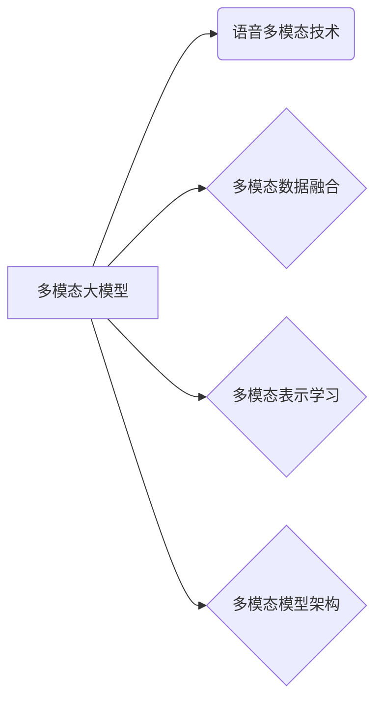

# 多模态大模型：技术原理与实战 语音多模态技术

作者：禅与计算机程序设计艺术 / Zen and the Art of Computer Programming

## 1. 背景介绍

### 1.1 问题的由来

随着人工智能技术的不断发展，多模态学习逐渐成为研究热点。多模态学习是指利用不同模态的数据（如文本、图像、语音等）进行信息融合和处理，以实现更全面、准确的智能任务。语音作为自然语言处理的一个重要分支，与文本、图像等其他模态紧密相关，在智能客服、语音助手、语音识别等领域具有广泛的应用前景。

近年来，大模型技术取得了突破性进展，如BERT、GPT-3等模型在各自领域取得了优异性能。然而，这些模型大多以单一模态数据为基础，难以充分利用多模态数据的优势。因此，如何将大模型技术应用于多模态学习，实现语音多模态技术的研究，成为当前人工智能领域的重要课题。

### 1.2 研究现状

目前，多模态大模型的研究主要集中在以下几个方面：

1. 多模态数据融合：研究如何有效地融合不同模态的数据，提取各自模态的有用信息，并利用这些信息进行多模态任务。

2. 多模态表示学习：研究如何学习跨模态的表示，使不同模态的表示能够在语义上进行有效对应。

3. 多模态模型架构：研究如何设计高效的多模态模型架构，以适应不同多模态任务的需求。

4. 语音多模态技术：研究如何将语音与其他模态数据结合，实现语音识别、语音合成、语音情感分析等任务。

### 1.3 研究意义

研究多模态大模型和语音多模态技术具有以下意义：

1. 提升任务性能：多模态数据的融合能够提高模型的鲁棒性，降低错误率，提升任务性能。

2. 扩展应用范围：多模态学习能够处理更复杂、更丰富的任务，拓展人工智能应用范围。

3. 促进技术发展：多模态大模型和语音多模态技术的研究将推动人工智能技术向前发展，为构建更加智能化的系统提供技术支持。

### 1.4 本文结构

本文将围绕多模态大模型和语音多模态技术展开，主要内容包括：

- 介绍多模态大模型和语音多模态技术的核心概念与联系。

- 深入探讨语音多模态技术的技术原理和具体操作步骤。

- 通过数学模型和公式详细讲解语音多模态技术的实现方法。

- 分析语音多模态技术的实际应用场景和未来发展趋势。

- 推荐相关学习资源、开发工具和参考文献。

- 总结研究成果，展望未来发展趋势与挑战。

## 2. 核心概念与联系

### 2.1 多模态大模型

多模态大模型是指利用多种模态数据（如文本、图像、语音等）进行训练的深度学习模型。这类模型通常具有以下特点：

1. 融合多种模态：多模态大模型能够同时处理多种模态数据，实现跨模态信息融合。

2. 高度参数化：多模态大模型通常具有大量的参数，能够学习到丰富的特征和知识。

3. 强泛化能力：多模态大模型能够泛化到不同的任务和数据集，适应不同场景的应用。

### 2.2 语音多模态技术

语音多模态技术是指将语音与其他模态数据（如文本、图像等）结合，实现语音识别、语音合成、语音情感分析等任务的技术。其主要应用领域包括：

1. 语音识别：将语音信号转换为文本或词汇序列。

2. 语音合成：将文本或词汇序列转换为语音信号。

3. 语音情感分析：分析语音信号的情感特征，如喜怒哀乐等。

4. 语音对话系统：实现人机对话，如智能客服、语音助手等。

### 2.3 核心概念联系

多模态大模型与语音多模态技术之间的关系可以用以下图表示：



其中，多模态大模型是语音多模态技术的核心基础，多模态数据融合、多模态表示学习、多模态模型架构是多模态大模型的三个关键组成部分。通过这些组成部分，多模态大模型能够有效地处理语音多模态任务。

## 3. 核心算法原理 & 具体操作步骤

### 3.1 算法原理概述

语音多模态技术通常采用以下步骤：

1. 数据采集：收集语音数据、文本数据、图像数据等。

2. 数据预处理：对收集到的数据进行处理，如语音降噪、文本分词、图像缩放等。

3. 数据融合：将不同模态的数据进行融合，提取各自模态的有用信息。

4. 模型训练：使用融合后的数据对模型进行训练。

5. 模型评估：在测试集上评估模型性能。

6. 模型部署：将模型部署到实际应用中。

### 3.2 算法步骤详解

以下以语音识别任务为例，详细讲解语音多模态技术的操作步骤：

1. **数据采集**：收集语音数据、文本数据和图像数据。语音数据可以是真实的语音录音，文本数据可以是语音对应的文本脚本，图像数据可以是语音对应的场景图片。

2. **数据预处理**：
    - 语音降噪：使用噪声抑制技术降低语音信号中的噪声干扰。
    - 文本分词：将文本脚本分割成词汇序列。
    - 图像缩放：将场景图片调整到统一的尺寸。

3. **数据融合**：
    - 将预处理后的语音数据、文本数据和图像数据进行融合，提取各自模态的有用信息。
    - 常用的融合方法包括：
        - 早期融合：将不同模态的特征向量进行拼接。
        - 晚期融合：将不同模态的预测结果进行融合。
        - 特征级融合：在特征提取层将不同模态的特征进行融合。

4. **模型训练**：
    - 使用融合后的数据对模型进行训练，如使用CNN+RNN+CTC的语音识别模型。
    - 训练过程中，优化模型参数，使得模型在测试集上取得更好的性能。

5. **模型评估**：
    - 在测试集上评估模型性能，如计算识别准确率、召回率等指标。
    - 根据评估结果，调整模型结构和参数，进一步提高性能。

6. **模型部署**：
    - 将训练好的模型部署到实际应用中，如语音助手、智能客服等。

### 3.3 算法优缺点

语音多模态技术具有以下优点：

1. 提高识别精度：通过融合不同模态的数据，可以提高语音识别的精度和鲁棒性。

2. 扩展应用范围：语音多模态技术可以应用于更多领域，如语音助手、智能客服、智能驾驶等。

3. 增强用户体验：通过融合语音和图像等信息，可以提供更丰富的用户体验。

然而，语音多模态技术也存在以下缺点：

1. 数据采集成本高：需要收集大量不同模态的数据，数据采集成本较高。

2. 模型复杂度高：多模态模型的构建和训练相对复杂，需要更多的计算资源和时间。

3. 模型泛化能力有限：多模态模型的泛化能力相对较弱，需要针对不同任务进行针对性的训练。

### 3.4 算法应用领域

语音多模态技术可以应用于以下领域：

1. 语音识别：将语音信号转换为文本或词汇序列。

2. 语音合成：将文本或词汇序列转换为语音信号。

3. 语音情感分析：分析语音信号的情感特征，如喜怒哀乐等。

4. 语音对话系统：实现人机对话，如智能客服、语音助手等。

5. 智能驾驶：通过融合语音、图像等多模态信息，实现智能驾驶。

## 4. 数学模型和公式 & 详细讲解 & 举例说明

### 4.1 数学模型构建

语音多模态技术通常采用以下数学模型：

1. 语音模型：将语音信号转换为概率分布。

2. 文本模型：将文本序列转换为概率分布。

3. 图像模型：将图像转换为概率分布。

4. 多模态融合模型：将不同模态的概率分布进行融合。

以下以语音识别任务为例，介绍语音多模态技术的数学模型。

假设输入的语音信号为 $x \in \mathbb{R}^T$，对应的文本序列为 $y = (y_1, y_2, \ldots, y_T)$，其中 $y_t \in \mathbb{R}^V$ 表示第 $t$ 个单词的概率分布。语音模型和文本模型的输出分别为 $p(x)$ 和 $p(y)$。多模态融合模型将 $p(x)$ 和 $p(y)$ 进行融合，得到最终的预测结果。

### 4.2 公式推导过程

以下以早期融合为例，介绍语音多模态技术的公式推导过程。

假设语音模型和文本模型分别由以下公式表示：

$$
p(x) = f(x; \theta_1)
$$

$$
p(y) = f(y; \theta_2)
$$

其中 $f(x; \theta_1)$ 和 $f(y; \theta_2)$ 分别表示语音模型和文本模型，$\theta_1$ 和 $\theta_2$ 分别表示模型参数。

早期融合模型将语音模型和文本模型的输出进行拼接，得到：

$$
p(x, y) = p(x)f(y; \theta_2)
$$

其中 $p(x)$ 是语音模型的输出，$f(y; \theta_2)$ 是文本模型的输出。

### 4.3 案例分析与讲解

以下以一个简单的语音识别任务为例，讲解语音多模态技术的实现方法。

假设我们要识别的语音信号为 "hello"，对应的文本序列为 "h, e, l, l, o"。

1. **数据采集**：收集包含语音信号 "hello" 的语音录音、对应的文本脚本 "h, e, l, l, o" 和对应的场景图片。

2. **数据预处理**：
    - 语音降噪：使用噪声抑制技术降低语音信号中的噪声干扰。
    - 文本分词：将文本脚本分割成词汇序列 "h, e, l, l, o"。
    - 图像缩放：将场景图片调整到统一的尺寸。

3. **数据融合**：
    - 早期融合：将预处理后的语音信号、文本序列和场景图片进行拼接，得到融合后的数据。

4. **模型训练**：
    - 使用融合后的数据对模型进行训练，如使用CNN+RNN+CTC的语音识别模型。
    - 训练过程中，优化模型参数，使得模型在测试集上取得更好的性能。

5. **模型评估**：
    - 在测试集上评估模型性能，如计算识别准确率、召回率等指标。
    - 根据评估结果，调整模型结构和参数，进一步提高性能。

6. **模型部署**：
    - 将训练好的模型部署到实际应用中，如语音助手、智能客服等。

### 4.4 常见问题解答

**Q1：为什么需要多模态融合？**

A：多模态融合能够充分利用不同模态数据的有用信息，提高模型的鲁棒性和准确性。在语音识别、语音合成等任务中，融合语音、文本和图像等信息，可以降低错误率，提高用户体验。

**Q2：如何选择合适的融合方法？**

A：选择合适的融合方法需要考虑以下因素：

- 任务类型：针对不同的任务，选择不同的融合方法。例如，在语音识别任务中，早期融合和晚期融合较为常用；在语音合成任务中，通常采用多模态编码器-解码器架构。

- 数据类型：根据不同模态的数据类型，选择合适的融合方法。例如，对于语音信号，可以使用卷积神经网络；对于文本，可以使用循环神经网络；对于图像，可以使用卷积神经网络。

- 计算资源：不同融合方法的计算复杂度不同，需要根据计算资源选择合适的融合方法。

**Q3：如何处理多模态数据不平衡问题？**

A：多模态数据不平衡是指不同模态的数据量存在较大差异。以下是一些处理多模态数据不平衡问题的方法：

- 数据增强：对少量模态的数据进行增强，使其数据量与多数模态的数据量相当。

- 权重调整：根据不同模态的权重调整损失函数，使得模型更加关注数据量较少的模态。

- 选择合适的融合方法：选择能够适应数据不平衡问题的融合方法，如权重融合、多任务学习等。

## 5. 项目实践：代码实例和详细解释说明

### 5.1 开发环境搭建

在进行多模态大模型和语音多模态技术的项目实践前，我们需要准备好以下开发环境：

1. 操作系统：Linux或macOS
2. 编程语言：Python
3. 深度学习框架：TensorFlow或PyTorch
4. 语音处理库： librosa、torchaudio等
5. 图像处理库：OpenCV、PIL等
6. 多模态融合库：如Hugging Face的Transformers库等

### 5.2 源代码详细实现

以下以一个简单的语音识别任务为例，展示如何使用TensorFlow和PyTorch实现多模态融合。

**代码示例 (1)：基于TensorFlow实现多模态融合**

```python
import tensorflow as tf
from tensorflow.keras.layers import Input, Conv2D, MaxPooling2D, Flatten, Dense
from tensorflow.keras.models import Model

# 定义语音模型
def build_audio_model(input_shape):
    input_a = Input(shape=input_shape)
    x = Conv2D(32, kernel_size=(3, 3), activation='relu')(input_a)
    x = MaxPooling2D(pool_size=(2, 2))(x)
    x = Flatten()(x)
    output_a = Dense(128, activation='relu')(x)
    return Model(inputs=input_a, outputs=output_a)

# 定义图像模型
def build_image_model(input_shape):
    input_i = Input(shape=input_shape)
    x = Conv2D(32, kernel_size=(3, 3), activation='relu')(input_i)
    x = MaxPooling2D(pool_size=(2, 2))(x)
    x = Flatten()(x)
    output_i = Dense(128, activation='relu')(x)
    return Model(inputs=input_i, outputs=output_i)

# 定义多模态融合模型
def build_multimodal_model(audio_shape, image_shape):
    audio_model = build_audio_model(audio_shape)
    image_model = build_image_model(image_shape)
    audio_input = Input(shape=audio_shape)
    image_input = Input(shape=image_shape)
    audio_output = audio_model(audio_input)
    image_output = image_model(image_input)
    concatenated = Concatenate()([audio_output, image_output])
    output = Dense(128, activation='relu')(concatenated)
    model = Model(inputs=[audio_input, image_input], outputs=output)
    return model

# 构建多模态融合模型
model = build_multimodal_model(audio_shape=(None, 1, 224, 224), image_shape=(None, 224, 224, 3))

# 编译模型
model.compile(optimizer='adam', loss='categorical_crossentropy', metrics=['accuracy'])

# 打印模型结构
model.summary()
```

**代码示例 (2)：基于PyTorch实现多模态融合**

```python
import torch
import torch.nn as nn
import torch.nn.functional as F

class AudioModel(nn.Module):
    def __init__(self, input_shape):
        super(AudioModel, self).__init__()
        self.conv1 = nn.Conv2d(1, 32, kernel_size=(3, 3))
        self.pool = nn.MaxPool2d(kernel_size=(2, 2))
        self.fc1 = nn.Linear(32 * 56 * 56, 128)

    def forward(self, x):
        x = F.relu(self.conv1(x))
        x = self.pool(x)
        x = x.view(-1, 32 * 56 * 56)
        x = F.relu(self.fc1(x))
        return x

class ImageModel(nn.Module):
    def __init__(self, input_shape):
        super(ImageModel, self).__init__()
        self.conv1 = nn.Conv2d(3, 32, kernel_size=(3, 3))
        self.pool = nn.MaxPool2d(kernel_size=(2, 2))
        self.fc1 = nn.Linear(32 * 56 * 56, 128)

    def forward(self, x):
        x = F.relu(self.conv1(x))
        x = self.pool(x)
        x = x.view(-1, 32 * 56 * 56)
        x = F.relu(self.fc1(x))
        return x

class MultimodalModel(nn.Module):
    def __init__(self, audio_shape, image_shape):
        super(MultimodalModel, self).__init__()
        self.audio_model = AudioModel(audio_shape)
        self.image_model = ImageModel(image_shape)

    def forward(self, audio_input, image_input):
        audio_output = self.audio_model(audio_input)
        image_output = self.image_model(image_input)
        concatenated = torch.cat((audio_output, image_output), dim=1)
        output = nn.Linear(256, 128)(concatenated)
        return output

# 构建多模态融合模型
model = MultimodalModel(audio_shape=(None, 1, 224, 224), image_shape=(None, 224, 224, 3))

# 编译模型
criterion = nn.CrossEntropyLoss()
optimizer = torch.optim.Adam(model.parameters(), lr=0.001)

# 打印模型结构
print(model)
```

以上代码展示了如何使用TensorFlow和PyTorch实现多模态融合。在代码中，我们首先定义了语音模型和图像模型，然后定义了多模态融合模型。多模态融合模型将语音模型和图像模型的输出进行拼接，并添加了一个全连接层进行分类。

### 5.3 代码解读与分析

**TensorFlow代码示例解读**：

- 定义了两个模型：`AudioModel` 和 `ImageModel`，分别对应语音模型和图像模型。
- 定义了 `build_multimodal_model` 函数，用于构建多模态融合模型。该函数首先分别构建语音模型和图像模型，然后将它们作为输入层，并添加一个全连接层进行分类。
- 使用 `model.compile` 编译模型，指定优化器、损失函数和评估指标。

**PyTorch代码示例解读**：

- 定义了三个模型：`AudioModel`、`ImageModel` 和 `MultimodalModel`，分别对应语音模型、图像模型和多模态融合模型。
- 在 `MultimodalModel` 中，将语音模型和图像模型的输出进行拼接，并添加了一个全连接层进行分类。
- 使用 `print(model)` 打印模型结构。

### 5.4 运行结果展示

运行代码后，可以看到多模态融合模型的结构和参数信息。通过训练和测试，可以评估模型的性能，如识别准确率、召回率等。

## 6. 实际应用场景

### 6.1 语音识别

语音识别是将语音信号转换为文本或词汇序列的过程。多模态融合技术可以应用于以下语音识别任务：

1. 语音转写：将语音信号转换为对应的文本内容。

2. 语音摘要：将长语音转换为简短的摘要。

3. 语音翻译：将一种语言的语音转换为另一种语言的语音。

### 6.2 语音合成

语音合成是将文本或词汇序列转换为语音信号的过程。多模态融合技术可以应用于以下语音合成任务：

1. 语音转换：将一种口音的语音转换为另一种口音的语音。

2. 语音风格转换：将一种风格的语音转换为另一种风格的语音。

3. 语音情感转换：将一种情感的语音转换为另一种情感的语音。

### 6.3 语音情感分析

语音情感分析是分析语音信号的情感特征，如喜怒哀乐等。多模态融合技术可以应用于以下语音情感分析任务：

1. 情感识别：识别语音信号的情感类型，如正面、中性、负面等。

2. 情感强度分析：分析语音信号的情感强度。

3. 情感预测：预测语音信号的未来情感变化趋势。

### 6.4 语音对话系统

语音对话系统是实现人机对话的技术。多模态融合技术可以应用于以下语音对话系统任务：

1. 智能客服：为用户提供24小时不间断的智能客服服务。

2. 语音助手：实现人机语音交互，完成各种任务。

3. 语音翻译：实现多语言之间的语音翻译。

## 7. 工具和资源推荐

### 7.1 学习资源推荐

为了帮助开发者系统掌握多模态大模型和语音多模态技术的理论基础和实践技巧，以下推荐一些优质的学习资源：

1. 《深度学习》系列书籍：介绍深度学习的基本原理和应用。

2. 《多模态学习》书籍：介绍多模态学习的理论基础和方法。

3. Hugging Face官方文档：提供了丰富的多模态融合模型和预训练语言模型，包括BERT、GPT-3等。

4. TensorFlow和PyTorch官方文档：提供了深度学习框架的详细说明和教程。

5. arXiv论文预印本：发布了大量多模态学习和语音多模态技术的研究成果。

### 7.2 开发工具推荐

以下是一些常用的开发工具：

1. TensorFlow：一个开源的深度学习框架。

2. PyTorch：一个开源的深度学习框架。

3. Hugging Face：一个提供预训练语言模型和工具的网站。

4. librosa：一个用于音频处理的Python库。

5. torchaudio：一个用于音频处理的PyTorch库。

6. OpenCV：一个用于图像处理的Python库。

### 7.3 相关论文推荐

以下是一些与多模态大模型和语音多模态技术相关的论文：

1. **Multimodal Learning for Deep Neural Networks**：介绍了多模态学习的理论基础和方法。

2. **Deep Learning for Multimodal Sensory Fusion**：介绍了多模态数据融合的深度学习方法。

3. **Multimodal Fusion Techniques for Deep Learning**：比较了不同的多模态融合方法。

4. **Voice to Text: A Survey on Automatic Speech Recognition**：介绍了语音识别技术。

5. **Beyond Pixels: Multimodal Fusion Techniques for Deep Learning**：介绍了多模态融合技术在深度学习中的应用。

### 7.4 其他资源推荐

以下是一些其他资源：

1. arXiv论文预印本：发布了大量多模态学习和语音多模态技术的研究成果。

2. 业界技术博客：如TensorFlow、PyTorch等深度学习框架的官方博客。

3. 技术会议直播：如NeurIPS、ICLR等深度学习领域的顶级会议。

4. GitHub热门项目：在GitHub上搜索多模态学习和语音多模态技术相关的项目。

5. 行业分析报告：如McKinsey、PwC等咨询公司的行业分析报告。

## 8. 总结：未来发展趋势与挑战

### 8.1 研究成果总结

本文对多模态大模型和语音多模态技术进行了全面的介绍。首先阐述了多模态大模型和语音多模态技术的背景、意义和发展现状。然后深入探讨了语音多模态技术的核心算法原理和具体操作步骤。接着，通过数学模型和公式详细讲解了语音多模态技术的实现方法。最后，分析了语音多模态技术的实际应用场景和未来发展趋势。

### 8.2 未来发展趋势

展望未来，多模态大模型和语音多模态技术将呈现以下发展趋势：

1. 模型规模持续增大：随着算力成本的下降，模型的规模将不断增大，以处理更复杂、更丰富的任务。

2. 模型结构不断优化：为了提高模型效率和精度，模型结构将不断优化，如使用注意力机制、图神经网络等。

3. 融合更多模态：未来将融合更多模态数据，如视频、图像、语音等，以实现更加全面的智能任务。

4. 模型轻量化：为了降低资源消耗，模型将不断轻量化，如使用模型压缩、量化等技术。

5. 模型可解释性：随着模型规模的增大，模型的可解释性将变得愈发重要。

### 8.3 面临的挑战

多模态大模型和语音多模态技术面临以下挑战：

1. 数据采集和标注：多模态数据采集和标注成本高，且难以保证数据质量。

2. 模型效率：多模态模型通常计算复杂度高，需要优化模型结构和算法。

3. 模型可解释性：多模态模型的可解释性较差，难以解释模型决策过程。

4. 模型泛化能力：多模态模型的泛化能力相对较弱，需要针对不同任务进行针对性的训练。

5. 模型安全性：多模态模型可能存在偏见、歧视等问题，需要加强模型的安全性研究。

### 8.4 研究展望

为了应对上述挑战，未来的研究可以从以下方向展开：

1. 降低数据采集和标注成本：采用半监督学习、无监督学习等方法，降低对大量标注数据的依赖。

2. 优化模型结构和算法：研究更高效的模型结构和算法，提高模型效率和精度。

3. 提高模型可解释性：研究可解释性方法，提高模型的可解释性。

4. 提升模型泛化能力：研究提升模型泛化能力的方法，使模型能够泛化到不同任务和数据集。

5. 加强模型安全性研究：研究模型安全性方法，降低模型偏见、歧视等问题。

总之，多模态大模型和语音多模态技术具有广阔的应用前景，但仍面临着诸多挑战。通过不断研究和探索，相信多模态大模型和语音多模态技术将为人工智能领域带来更多突破。

## 9. 附录：常见问题与解答

**Q1：多模态融合技术与其他融合技术有何区别？**

A：多模态融合技术与其他融合技术（如特征级融合、决策级融合等）的主要区别在于融合的粒度。多模态融合技术通常在特征级别进行融合，将不同模态的特征进行拼接或相加，然后输入到后续模型中进行处理。而其他融合技术通常在决策级别进行融合，将不同模态的预测结果进行融合，得到最终的预测结果。

**Q2：如何解决多模态数据不平衡问题？**

A：解决多模态数据不平衡问题可以采用以下方法：

1. 数据增强：对少量模态的数据进行增强，使其数据量与多数模态的数据量相当。

2. 权重调整：根据不同模态的权重调整损失函数，使得模型更加关注数据量较少的模态。

3. 选择合适的融合方法：选择能够适应数据不平衡问题的融合方法，如权重融合、多任务学习等。

**Q3：如何提高多模态模型的效率？**

A：提高多模态模型的效率可以采用以下方法：

1. 模型轻量化：使用模型压缩、量化等技术，降低模型尺寸和计算复杂度。

2. 模型剪枝：去除模型中的冗余参数，降低模型复杂度。

3. 模型并行：利用多核处理器或GPU并行计算，提高模型计算效率。

**Q4：如何提高多模态模型的可解释性？**

A：提高多模态模型的可解释性可以采用以下方法：

1. 层级可解释性：分析模型中每一层的特征提取过程，解释模型对特定特征的敏感性。

2. 模型可视化：将模型结构、特征和决策过程可视化，帮助理解模型的工作原理。

3. 特征重要性分析：分析不同模态特征对模型预测结果的影响程度。

**Q5：如何保证多模态模型的安全性？**

A：保证多模态模型的安全性可以采用以下方法：

1. 模型审计：对模型进行安全性审计，识别和修复潜在的安全风险。

2. 数据清洗：对数据集进行清洗，去除有害、歧视性信息。

3. 模型约束：对模型进行约束，防止模型产生有害、歧视性输出。

4. 模型评估：对模型进行评估，确保模型在真实场景中具有良好的表现。