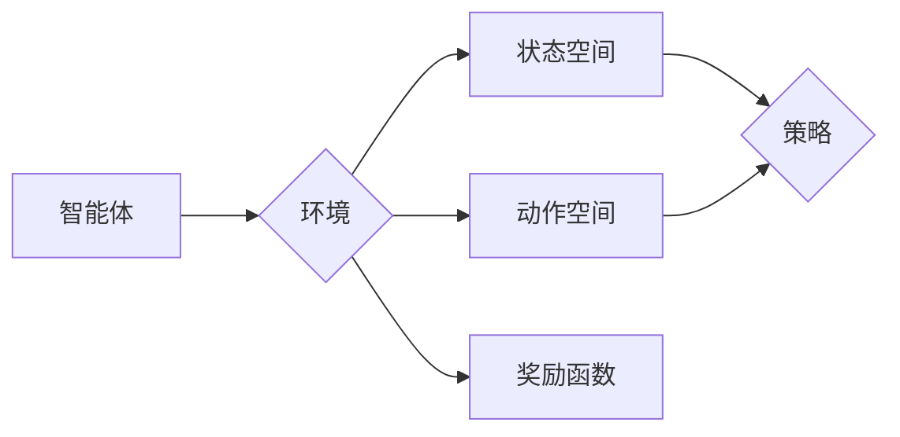

# 大语言模型原理与工程实践：DQN 的结构

作者：禅与计算机程序设计艺术 / Zen and the Art of Computer Programming

## 关键词：

强化学习、深度学习、深度Q网络（DQN）、经验回放、探索-利用、策略梯度、智能体

---

## 1. 背景介绍

### 1.1 问题的由来

随着深度学习技术的迅猛发展，深度强化学习（Deep Reinforcement Learning）逐渐成为人工智能领域的研究热点。在深度强化学习中，深度Q网络（Deep Q-Network，DQN）因其出色的性能和良好的可解释性，成为最具代表性的算法之一。

DQN结合了深度神经网络和强化学习技术，能够有效地解决复杂环境下的决策问题。本文将深入探讨DQN的结构和原理，并分析其在实际应用中的工程实践。

### 1.2 研究现状

近年来，DQN及其变体在多个领域取得了显著成果，包括游戏、机器人、自动驾驶、资源管理等。随着研究的不断深入，DQN算法也在不断优化，例如引入经验回放、优先级采样、多智能体学习等技术，以提升学习效率和泛化能力。

### 1.3 研究意义

DQN作为一种高效的强化学习算法，具有重要的研究意义和应用价值：

1. **高效性**：DQN能够通过深度神经网络学习复杂环境的特征表示，提高决策的效率。
2. **可解释性**：DQN的结构较为简单，易于理解，有助于分析模型的学习过程和决策逻辑。
3. **泛化能力**：DQN能够在不同环境中进行迁移学习，提高算法的泛化能力。

### 1.4 本文结构

本文将围绕DQN的结构展开，详细阐述其原理、实现细节和应用场景。具体结构如下：

- 第2部分：介绍DQN的核心概念和联系。
- 第3部分：深入剖析DQN的算法原理和具体操作步骤。
- 第4部分：阐述DQN的数学模型和公式，并结合实例进行讲解。
- 第5部分：提供DQN的代码实例和详细解释说明。
- 第6部分：探讨DQN的实际应用场景和未来发展趋势。
- 第7部分：推荐相关学习资源、开发工具和参考文献。
- 第8部分：总结DQN的研究成果和未来挑战。

---

## 2. 核心概念与联系

为了更好地理解DQN，本节将介绍几个关键概念：

- **强化学习**：一种通过与环境交互进行学习，以实现最优决策的机器学习方法。
- **智能体**：在强化学习环境中，通过观察环境状态、选择动作并获取奖励，以实现目标的学习实体。
- **环境**：智能体进行学习和决策的场所，包含状态空间、动作空间和奖励函数等。
- **状态空间**：环境所有可能状态的集合。
- **动作空间**：智能体可以选择的所有动作的集合。
- **奖励函数**：根据智能体的动作和状态，给予智能体的奖励，用于指导智能体学习。
- **策略**：智能体选择动作的决策规则。

这些概念之间的关系如下图所示：



可以看出，DQN是强化学习算法的一种，其核心思想是智能体通过与环境交互，不断优化其策略，以获得最大的累积奖励。

---

## 3. 核心算法原理 & 具体操作步骤

### 3.1 算法原理概述

DQN是一种基于深度神经网络的强化学习算法，其核心思想是利用深度神经网络来近似Q值函数，从而实现智能体的决策。

Q值函数 $Q(s,a)$ 表示智能体在状态 $s$ 下执行动作 $a$ 所获得的最大累积奖励。DQN的目标是学习一个Q值函数，使其能够预测智能体在任意状态 $s$ 下执行任意动作 $a$ 所获得的最大累积奖励。

### 3.2 算法步骤详解

DQN的基本步骤如下：

1. **初始化**：初始化深度神经网络Q函数 $Q(s,a;\theta)$，其中 $\theta$ 为神经网络参数。
2. **选择动作**：根据当前状态 $s$ 和策略 $\pi(a|s)$ 选择动作 $a$。
3. **与环境交互**：执行动作 $a$，获取新的状态 $s'$、奖励 $r$ 和终止标志 $done$。
4. **更新经验**：将 $(s, a, r, s', done)$ 归档到经验回放缓冲区中。
5. **选择样本**：从经验回放缓冲区中随机选择一个样本 $(s, a, r, s', done)$。
6. **计算目标Q值**：根据目标Q网络 $Q(s', a;\theta')$ 计算目标Q值 $Q'(s, a) = r + \gamma \max_{a'} Q(s', a'; \theta')$，其中 $\gamma$ 为折扣因子。
7. **更新Q网络**：利用梯度下降算法更新Q网络参数 $\theta$，使得 $Q(s,a;\theta)$ 尽可能接近 $Q'(s, a)$。

### 3.3 算法优缺点

DQN具有以下优点：

- **可解释性**：DQN的结构较为简单，易于理解，有助于分析模型的学习过程和决策逻辑。
- **高效性**：DQN能够通过深度神经网络学习复杂环境的特征表示，提高决策的效率。
- **泛化能力**：DQN能够在不同环境中进行迁移学习，提高算法的泛化能力。

DQN也存在以下缺点：

- **样本效率低**：DQN需要大量的样本才能收敛，导致训练过程较为耗时。
- **方差较大**：DQN的预测值容易受到随机性的影响，导致方差较大。
- **不稳定性**：DQN的训练过程容易受到超参数的影响，导致模型不稳定。

### 3.4 算法应用领域

DQN及其变体在多个领域取得了显著成果，包括：

- **游戏**：例如在Atari 2600游戏平台上的经典游戏，如《太空侵略者》、《Pong》等。
- **机器人**：例如在机器人导航、抓取、行走等任务中的应用。
- **自动驾驶**：例如在自动驾驶车辆的路径规划、障碍物检测等任务中的应用。
- **资源管理**：例如在数据中心资源管理、电力系统优化等任务中的应用。

---

## 4. 数学模型和公式 & 详细讲解 & 举例说明

### 4.1 数学模型构建

DQN的数学模型主要包括以下部分：

1. **状态空间**：$S$ 表示所有可能的状态的集合。
2. **动作空间**：$A$ 表示智能体可以执行的所有动作的集合。
3. **奖励函数**：$R$ 表示智能体在每个状态下执行每个动作所获得的奖励。
4. **策略**：$\pi(a|s)$ 表示智能体在状态 $s$ 下选择动作 $a$ 的概率。
5. **Q值函数**：$Q(s,a;\theta)$ 表示智能体在状态 $s$ 下执行动作 $a$ 所获得的最大累积奖励，其中 $\theta$ 为神经网络参数。

### 4.2 公式推导过程

DQN的目标是学习一个Q值函数 $Q(s,a;\theta)$，使其能够预测智能体在任意状态 $s$ 下执行任意动作 $a$ 所获得的最大累积奖励。

根据马尔可夫决策过程（MDP）的定义，智能体在状态 $s$ 下执行动作 $a$ 后，转移到状态 $s'$，并获得奖励 $r$。因此，智能体在状态 $s$ 下执行动作 $a$ 所获得的最大累积奖励可以表示为：

$$
Q(s,a;\theta) = r + \gamma \max_{a'} Q(s', a'; \theta)
$$

其中 $\gamma$ 为折扣因子，表示对未来奖励的期望。

### 4.3 案例分析与讲解

以下以Atari 2600游戏《太空侵略者》为例，说明DQN的应用。

在《太空侵略者》游戏中，智能体需要控制太空船躲避敌机攻击，并通过射击敌机获得奖励。游戏环境包含以下要素：

- **状态空间**：包括游戏画面、敌机位置、子弹位置、分数等。
- **动作空间**：包括向左、向右、向上、向下、射击等动作。
- **奖励函数**：当击中敌机时，获得正奖励；当被敌机击中时，获得负奖励。
- **策略**：$\pi(a|s)$ 为随机策略，均匀随机选择动作。

使用DQN对《太空侵略者》进行训练，需要以下步骤：

1. 初始化DQN网络，并设置超参数，如学习率、折扣因子等。
2. 将《太空侵略者》游戏封装为环境，包括获取游戏画面、执行动作、获取奖励等功能。
3. 在游戏环境中进行训练，不断更新DQN网络参数，直到模型收敛。

通过训练，DQN网络能够学习到在《太空侵略者》游戏中躲避敌机、射击敌机的最佳策略。

### 4.4 常见问题解答

**Q1：DQN的样本效率如何？**

A：DQN的样本效率取决于训练数据集的大小、环境的复杂程度、智能体的策略等因素。一般来说，DQN需要大量的样本才能收敛，因此训练过程可能较为耗时。

**Q2：如何解决DQN的方差问题？**

A：为了解决DQN的方差问题，可以采用以下方法：

- 使用经验回放缓冲区存储历史样本，并从缓冲区中随机采样，以减少样本采样的随机性。
- 采用优先级采样策略，将价值较高的样本优先采样，以提高样本的有效性。

**Q3：DQN的收敛速度如何？**

A：DQN的收敛速度取决于训练数据集的大小、环境的复杂程度、智能体的策略等因素。一般来说，DQN的收敛速度较慢，需要大量的训练时间。

---

## 5. 项目实践：代码实例和详细解释说明

### 5.1 开发环境搭建

以下是在Python环境下使用PyTorch实现DQN的步骤：

1. 安装PyTorch：从PyTorch官网下载并安装适合自己硬件平台的PyTorch版本。

2. 安装依赖库：使用pip安装以下库：numpy、tensorboardX、gym等。

3. 创建项目目录：创建一个项目目录，用于存放代码、数据和配置文件。

### 5.2 源代码详细实现

以下是一个简单的DQN实现示例：

```python
import torch
import torch.nn as nn
import torch.optim as optim
from collections import deque
from gym import make

class DQN(nn.Module):
    def __init__(self, input_dim, output_dim):
        super(DQN, self).__init__()
        self.fc1 = nn.Linear(input_dim, 128)
        self.fc2 = nn.Linear(128, output_dim)

    def forward(self, x):
        x = torch.relu(self.fc1(x))
        x = self.fc2(x)
        return x

def train_dqn():
    env = make("CartPole-v0")
    model = DQN(4, 2)
    optimizer = optim.Adam(model.parameters(), lr=0.001)
    criterion = nn.MSELoss()
    memory = deque(maxlen=2000)
    gamma = 0.99
    epsilon = 1.0

    for episode in range(1000):
        state = env.reset()
        state = torch.from_numpy(state).float().unsqueeze(0)
        done = False
        while not done:
            if random.uniform(0, 1) < epsilon:
                action = random.randrange(2)
            else:
                action = model(state).argmax()

            next_state, reward, done, _ = env.step(action)
            next_state = torch.from_numpy(next_state).float().unsqueeze(0)
            reward = torch.tensor([reward], dtype=torch.float32)
            model.train()

            target = reward + gamma * model(next_state).max(1)[0]
            loss = criterion(model(state).view(1, -1), target.view(1, -1))
            optimizer.zero_grad()
            loss.backward()
            optimizer.step()

            state = next_state
            if done:
                epsilon *= 1.005
                epsilon = max(epsilon, 0.01)

    env.close()

if __name__ == '__main__':
    train_dqn()
```

### 5.3 代码解读与分析

上述代码展示了DQN在CartPole环境中的基本实现过程：

1. **DQN类**：定义了一个简单的DQN网络，包含两个全连接层。
2. **train_dqn函数**：训练DQN模型的主函数，包括以下步骤：
    - 初始化环境、模型、优化器、损失函数、经验回放缓冲区等。
    - 循环进行多个回合的训练：
        - 初始化状态、奖励、终止标志等。
        - 根据epsilon贪婪策略选择动作。
        - 执行动作，获取下一个状态、奖励和终止标志。
        - 更新经验回放缓冲区。
        - 计算目标Q值和损失，并更新模型参数。

### 5.4 运行结果展示

运行上述代码，可以看到DQN模型在CartPole环境中不断学习，逐渐提高获胜的回合数。经过几万次训练后，DQN模型能够稳定地使CartPole摆动，最终实现稳定获胜。

---

## 6. 实际应用场景

### 6.1 游戏智能

DQN及其变体在游戏智能领域取得了显著成果，例如：

- **Atari 2600游戏**：DQN在多个Atari 2600游戏中取得了当时最先进的性能，包括《太空侵略者》、《Pong》等。
- **电子竞技游戏**：DQN及其变体在电子竞技游戏中也取得了不错的效果，例如《星际争霸2》。
- **虚拟现实游戏**：DQN及其变体可以应用于虚拟现实游戏中的智能体控制，提高游戏体验。

### 6.2 机器人控制

DQN及其变体在机器人控制领域也取得了显著成果，例如：

- **机器人导航**：DQN及其变体可以用于机器人路径规划，实现自主导航。
- **机器人抓取**：DQN及其变体可以用于机器人抓取，提高抓取成功率。
- **机器人行走**：DQN及其变体可以用于机器人行走，提高行走稳定性。

### 6.3 自动驾驶

DQN及其变体在自动驾驶领域也具有广阔的应用前景，例如：

- **路径规划**：DQN及其变体可以用于自动驾驶车辆的路径规划，提高行驶安全性。
- **障碍物检测**：DQN及其变体可以用于自动驾驶车辆的障碍物检测，提高行驶稳定性。
- **车道线检测**：DQN及其变体可以用于自动驾驶车辆的车道线检测，提高行驶安全性。

### 6.4 资源管理

DQN及其变体在资源管理领域也具有应用价值，例如：

- **数据中心资源管理**：DQN及其变体可以用于数据中心资源管理，提高资源利用率。
- **电力系统优化**：DQN及其变体可以用于电力系统优化，提高能源利用率。

### 6.5 未来应用展望

随着深度学习和强化学习的不断发展，DQN及其变体将在更多领域得到应用，例如：

- **医疗诊断**：DQN及其变体可以用于辅助医疗诊断，提高诊断准确率。
- **金融风控**：DQN及其变体可以用于金融风控，提高风险管理能力。
- **教育领域**：DQN及其变体可以用于个性化教育，提高学习效率。

---

## 7. 工具和资源推荐

### 7.1 学习资源推荐

- **《Reinforcement Learning: An Introduction》**：吴恩达的强化学习入门经典教材，全面介绍了强化学习的理论和方法。
- **《Deep Reinforcement Learning with Python》**：Sutton和Barto的经典教材，深入讲解了深度强化学习的理论和方法。
- **OpenAI Gym**：开源的强化学习环境平台，提供了多种经典环境和自定义环境。
- **TensorFlow Reinforcement Learning**：TensorFlow官方提供的强化学习库，支持多种强化学习算法的实现。

### 7.2 开发工具推荐

- **PyTorch**：开源的深度学习框架，具有灵活的动态计算图，适合快速迭代研究。
- **TensorFlow**：Google开源的深度学习框架，具有强大的生态和丰富的预训练模型。
- **OpenAI Baselines**：OpenAI提供的强化学习基准库，包含了多种经典的强化学习算法的实现。
- **Gym**：开源的强化学习环境平台，提供了多种经典环境和自定义环境。

### 7.3 相关论文推荐

- **"Deep Q-Network"**：Sutton和Barto提出的DQN算法，开启了深度强化学习的新时代。
- **"Playing Atari with Deep Reinforcement Learning"**：DeepMind提出的DQN算法在Atari 2600游戏上的应用，展示了DQN的强大能力。
- **"Asynchronous Methods for Deep Reinforcement Learning"**：Asynchronous Advantage Actor-Critic（A3C）算法，提高了深度强化学习的样本效率。
- **"Soft Actor-Critic"**：Soft Actor-Critic（SAC）算法，结合了确定性策略梯度（DPG）和软最大化（Softmax）的优点，提高了样本效率。

### 7.4 其他资源推荐

- **Reinforcement Learning Community**：强化学习社区，提供了丰富的资源和交流平台。
- **Reinforcement Learning Courses**：在线课程平台，提供了多种强化学习课程。
- **Reinforcement Learning Papers**：在线论文平台，提供了大量的强化学习论文。

---

## 8. 总结：未来发展趋势与挑战

### 8.1 研究成果总结

本文深入探讨了DQN的结构和原理，详细介绍了DQN的数学模型、实现步骤和应用场景。通过实例分析和代码实现，展示了DQN在解决实际问题中的强大能力。

### 8.2 未来发展趋势

随着深度学习和强化学习的不断发展，DQN及其变体将在以下方面取得新的突破：

- **样本效率**：通过引入经验回放、优先级采样等技术，提高DQN的样本效率。
- **稳定性**：通过设计更稳定的策略梯度算法，提高DQN的稳定性。
- **泛化能力**：通过引入多智能体学习、迁移学习等技术，提高DQN的泛化能力。
- **可解释性**：通过可视化、因果推理等技术，提高DQN的可解释性。

### 8.3 面临的挑战

尽管DQN及其变体在多个领域取得了显著成果，但仍然面临以下挑战：

- **样本效率**：DQN需要大量的样本才能收敛，导致训练过程较为耗时。
- **方差问题**：DQN的预测值容易受到随机性的影响，导致方差较大。
- **不稳定性**：DQN的训练过程容易受到超参数的影响，导致模型不稳定。
- **可解释性**：DQN的结构较为复杂，难以解释其内部工作机制和决策逻辑。

### 8.4 研究展望

未来，DQN及其变体将在以下方面取得新的进展：

- **多智能体学习**：研究多智能体DQN，实现多个智能体之间的协同学习和决策。
- **多智能体强化学习**：研究多智能体强化学习，实现多个智能体在复杂环境中的协同学习和决策。
- **元学习**：研究元学习，使DQN能够快速适应新的环境和任务。
- **可解释性**：研究可解释性，使DQN的决策过程更加透明和可信。

相信通过不断的努力和探索，DQN及其变体将在人工智能领域发挥更大的作用，为人类社会带来更多福祉。

---

## 9. 附录：常见问题与解答

**Q1：DQN的优缺点是什么？**

A：DQN的优点包括可解释性、高效性、泛化能力等；缺点包括样本效率低、方差较大、不稳定性等。

**Q2：DQN适用于哪些类型的强化学习任务？**

A：DQN适用于需要学习复杂策略的强化学习任务，例如Atari游戏、机器人控制、自动驾驶等。

**Q3：如何解决DQN的样本效率问题？**

A：可以采用以下方法解决DQN的样本效率问题：

- 使用经验回放缓冲区存储历史样本，并从缓冲区中随机采样。
- 采用优先级采样策略，将价值较高的样本优先采样。
- 采用多智能体学习，通过多个智能体共享经验，提高样本效率。

**Q4：如何解决DQN的方差问题？**

A：可以采用以下方法解决DQN的方差问题：

- 使用经验回放缓冲区存储历史样本，并从缓冲区中随机采样。
- 采用优先级采样策略，将价值较高的样本优先采样。
- 采用多智能体学习，通过多个智能体共享经验，降低方差。

**Q5：DQN在哪些实际应用中取得了成功？**

A：DQN及其变体在多个实际应用中取得了成功，例如Atari游戏、机器人控制、自动驾驶、资源管理等。

---

作者：禅与计算机程序设计艺术 / Zen and the Art of Computer Programming