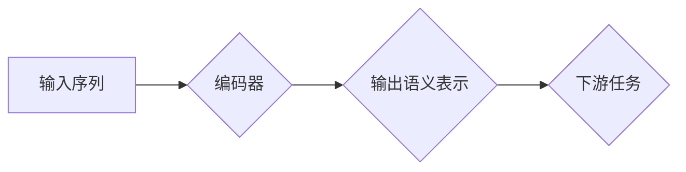

## Transformer大模型实战 BERT-large

> 关键词：Transformer, BERT, 自然语言处理, 大模型, 预训练, fine-tuning, 文本分类, 问答系统

## 1. 背景介绍

近年来，深度学习在自然语言处理 (NLP) 领域取得了突破性进展。其中，Transformer 架构的出现标志着 NLP 领域进入了一个新的时代。Transformer 凭借其强大的并行处理能力和长距离依赖建模能力，在各种 NLP 任务中都取得了优异的性能，例如机器翻译、文本摘要、问答系统等。

BERT (Bidirectional Encoder Representations from Transformers) 是基于 Transformer 架构的预训练语言模型，由 Google AI 团队开发。BERT 通过在大量的文本数据上进行双向预训练，学习了语言的深层语义表示，从而在后续的 NLP 任务中可以达到更好的效果。

BERT-large 是 BERT 模型中参数量更大的版本，拥有更强的表达能力，在许多任务上表现更优异。本文将深入探讨 BERT-large 的核心概念、算法原理、实践应用以及未来发展趋势。

## 2. 核心概念与联系

### 2.1 Transformer 架构

Transformer 架构的核心是 **注意力机制 (Attention)** 和 **多头注意力 (Multi-Head Attention)**。注意力机制允许模型关注输入序列中与当前位置相关的关键信息，从而更好地理解上下文关系。多头注意力则通过多个独立的注意力头，从不同的角度捕捉信息，进一步提升模型的表达能力。

Transformer 架构还包含 **编码器 (Encoder)** 和 **解码器 (Decoder)** 两部分。编码器负责将输入序列编码成语义表示，解码器则根据编码后的表示生成输出序列。

### 2.2 BERT 模型

BERT 模型基于 Transformer 架构，采用 **双向编码器 (Bidirectional Encoder)**。BERT 的编码器在训练过程中会同时考虑输入序列的左上下文和右上下文，从而学习到更丰富的语义信息。

BERT 模型的预训练目标主要有两种：

* **Masked Language Modeling (MLM)**：随机遮盖输入序列中的部分词，然后预测被遮盖词的词语。
* **Next Sentence Prediction (NSP)**：判断两个句子是否连续。

通过这两个预训练任务，BERT 模型学习到了语言的语法结构、语义关系和上下文理解能力。

### 2.3 BERT-large

BERT-large 是 BERT 模型中参数量更大的版本，拥有更强的表达能力和更丰富的语义表示。BERT-large 在预训练阶段使用了更大的数据集和更长的序列长度，从而学习到更深层的语言知识。

**Mermaid 流程图**



## 3. 核心算法原理 & 具体操作步骤

### 3.1 算法原理概述

BERT 模型的核心算法原理是基于 Transformer 架构的双向编码器，结合 MLM 和 NSP 两种预训练任务。

* **Transformer 架构**: 编码器和解码器由多层 Transformer 块组成，每个 Transformer 块包含多头注意力层和前馈神经网络层。
* **双向编码器**: BERT 的编码器在处理输入序列时，会同时考虑左上下文和右上下文，从而学习到更丰富的语义信息。
* **Masked Language Modeling (MLM)**: 通过随机遮盖输入序列中的部分词，然后预测被遮盖词的词语，从而训练模型学习语言的上下文关系和词语含义。
* **Next Sentence Prediction (NSP)**: 判断两个句子是否连续，从而训练模型学习句子之间的语义关系和逻辑连接。

### 3.2 算法步骤详解

1. **数据预处理**: 将文本数据进行分词、标记化等预处理操作，生成输入序列。
2. **预训练**: 使用 MLM 和 NSP 两种预训练任务，在大量的文本数据上训练 BERT 模型。
3. **微调**: 将预训练好的 BERT 模型用于下游任务，通过微调模型参数，使其适应特定任务的需求。
4. **预测**: 将输入序列输入到微调后的 BERT 模型中，获取模型的输出结果。

### 3.3 算法优缺点

**优点**:

* **强大的表达能力**: BERT 模型通过双向预训练，学习到了语言的深层语义表示，能够捕捉复杂的上下文关系。
* **通用性强**: 预训练好的 BERT 模型可以应用于各种下游任务，例如文本分类、问答系统、文本摘要等。
* **高效性**: BERT 模型的训练和推理速度相对较快。

**缺点**:

* **参数量大**: BERT-large 的参数量较大，需要大量的计算资源进行训练和推理。
* **数据依赖性**: BERT 模型的性能依赖于预训练数据的质量和数量。
* **可解释性差**: BERT 模型是一个复杂的深度学习模型，其内部工作机制难以解释。

### 3.4 算法应用领域

BERT 模型在以下领域具有广泛的应用:

* **文本分类**: 识别文本的类别，例如情感分析、主题分类等。
* **问答系统**: 回答用户提出的问题，例如搜索引擎、聊天机器人等。
* **文本摘要**: 生成文本的简短摘要，例如新闻报道、学术论文等。
* **机器翻译**: 将文本从一种语言翻译成另一种语言。
* **代码生成**: 根据自然语言描述生成代码。

## 4. 数学模型和公式 & 详细讲解 & 举例说明

### 4.1 数学模型构建

BERT 模型的数学模型主要基于 Transformer 架构，包含编码器和解码器两部分。

* **编码器**: 编码器由多个 Transformer 块组成，每个 Transformer 块包含多头注意力层和前馈神经网络层。
* **解码器**: 解码器也由多个 Transformer 块组成，但其结构与编码器略有不同，通常包含一个掩码机制，防止模型在生成输出序列时看到未来的信息。

### 4.2 公式推导过程

Transformer 架构的核心是注意力机制和多头注意力机制。

* **注意力机制**: 给定输入序列 $X = (x_1, x_2,..., x_n)$，注意力机制计算每个词 $x_i$ 与其他词之间的相关性，并根据相关性赋予每个词不同的权重。

$$
\text{Attention}(Q, K, V) = \text{softmax}\left(\frac{Q K^T}{\sqrt{d_k}}\right) V
$$

其中，$Q$, $K$, $V$ 分别代表查询矩阵、键矩阵和值矩阵，$d_k$ 是键向量的维度。

* **多头注意力机制**: 多头注意力机制通过多个独立的注意力头，从不同的角度捕捉信息，从而提升模型的表达能力。

$$
\text{Multi-Head Attention}(Q, K, V) = \text{Concat}(head_1, head_2,..., head_h) W^O
$$

其中，$head_i$ 代表第 $i$ 个注意力头的输出，$h$ 是注意力头的数量，$W^O$ 是一个线性变换矩阵。

### 4.3 案例分析与讲解

假设我们有一个输入序列 $X = ("我", "爱", "学习", "编程")$，我们使用多头注意力机制来计算每个词与其他词之间的相关性。

在计算注意力权重时，每个词的查询向量 $Q_i$ 会与其他词的键向量 $K_j$ 进行点积，然后通过 softmax 函数归一化得到注意力权重 $a_{ij}$。

注意力权重 $a_{ij}$ 表示词 $i$ 与词 $j$ 之间的相关性。

最终，每个词的输出向量 $h_i$ 是通过对所有词的注意力权重加权求和得到的。

## 5. 项目实践：代码实例和详细解释说明

### 5.1 开发环境搭建

* **操作系统**: Linux 或 macOS
* **Python 版本**: 3.6 或更高版本
* **库依赖**: transformers, torch, numpy, tqdm

### 5.2 源代码详细实现

```python
from transformers import BertTokenizer, BertModel

# 加载预训练模型和词典
tokenizer = BertTokenizer.from_pretrained('bert-large-uncased')
model = BertModel.from_pretrained('bert-large-uncased')

# 输入文本序列
text = "我爱学习编程"

# 将文本序列转换为输入格式
input_ids = tokenizer.encode(text, add_special_tokens=True)

# 将输入格式传递给模型进行推理
outputs = model(input_ids)

# 获取模型输出的语义表示
last_hidden_states = outputs.last_hidden_state

# 打印语义表示
print(last_hidden_states)
```

### 5.3 代码解读与分析

* **加载预训练模型和词典**: 使用 `transformers` 库加载预训练好的 BERT 模型和词典。
* **输入文本序列**: 将需要进行分析的文本序列输入到模型中。
* **文本序列转换为输入格式**: 使用 `tokenizer` 将文本序列转换为模型可以识别的输入格式。
* **模型推理**: 将输入格式传递给模型进行推理，获取模型的输出结果。
* **获取语义表示**: 从模型输出中获取词语的语义表示。
* **打印语义表示**: 打印模型输出的语义表示，以便进行分析和理解。

### 5.4 运行结果展示

运行上述代码后，会输出 BERT 模型对输入文本序列的语义表示。

语义表示是一个包含多个词向量的矩阵，每个词向量代表该词在语义空间中的位置。

通过分析语义表示，我们可以了解文本中词语之间的关系和语义含义。

## 6. 实际应用场景

BERT 模型在各种实际应用场景中都取得了优异的性能，例如：

### 6.1 文本分类

BERT 模型可以用于各种文本分类任务，例如情感分析、主题分类、垃圾邮件分类等。

### 6.2 问答系统

BERT 模型可以用于构建问答系统，例如搜索引擎、聊天机器人等。

### 6.3 文本摘要

BERT 模型可以用于生成文本的简短摘要，例如新闻报道、学术论文等。

### 6.4 其他应用

BERT 模型还可以应用于其他领域，例如机器翻译、代码生成、对话系统等。

## 7. 工具和资源推荐

### 7.1 学习资源推荐

* **BERT 官方论文**: https://arxiv.org/abs/1810.04805
* **Hugging Face Transformers 库**: https://huggingface.co/transformers/
* **Google AI Blog**: https://ai.googleblog.com/

### 7.2 开发工具推荐

* **Jupyter Notebook**: https://jupyter.org/
* **PyCharm**: https://www.jetbrains.com/pycharm/

### 7.3 相关论文推荐

* **XLNet**: https://arxiv.org/abs/1906.08237
* **RoBERTa**: https://arxiv.org/abs/1907.11692
* **T5**: https://arxiv.org/abs/1910.10683

## 8. 总结：未来发展趋势与挑战

### 8.1 研究成果总结

BERT 模型的出现标志着 NLP 领域进入了一个新的时代，其强大的表达能力和通用性在各种 NLP 任务中都取得了优异的性能。

### 8.2 未来发展趋势

* **模型规模**: 预训练模型的规模将继续扩大，从而提升模型的表达能力和泛化能力。
* **多模态学习**: 将文本与其他模态信息（例如图像、音频）进行融合，构建更强大的多模态模型。
* **可解释性**: 研究如何提高模型的可解释性，以便更好地理解模型的决策过程。

### 8.3 面临的挑战

* **计算资源**: 训练大型预训练模型需要大量的计算资源，这对于资源有限的机构和个人来说是一个挑战。
* **数据偏见**: 预训练模型的性能依赖于训练数据的质量，而训练数据可能存在偏见，从而导致模型输出存在偏差。
