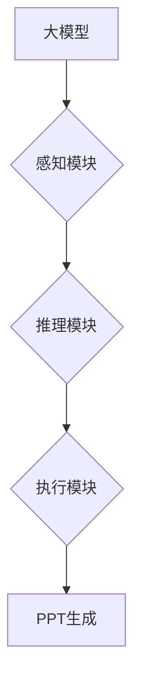

## 【大模型应用开发 动手做AI Agent】自主创建PPT

> 关键词：大模型、AI Agent、应用开发、PPT生成、自然语言处理、深度学习

## 1. 背景介绍

近年来，大模型技术取得了飞速发展，其强大的语言理解和生成能力为人工智能应用的拓展提供了无限可能。其中，AI Agent作为一种能够自主执行任务的智能体，在各个领域展现出巨大的应用潜力。

传统的PPT制作流程通常需要人工进行内容撰写、排版设计等操作，耗时费力。而结合大模型技术，我们可以开发出能够自主创建PPT的AI Agent，大幅提升工作效率，解放人力资源。

## 2. 核心概念与联系

### 2.1 大模型

大模型是指参数量巨大、训练数据海量的人工智能模型，通常拥有强大的泛化能力和语义理解能力。常见的代表性大模型包括GPT-3、BERT、LaMDA等。

### 2.2 AI Agent

AI Agent是一种能够感知环境、做出决策并执行行动的智能体。它通常由以下几个核心组件组成：

* **感知模块:** 收集环境信息，例如文本、图像、音频等。
* **推理模块:** 对收集到的信息进行分析和理解，做出决策。
* **执行模块:** 执行决策，例如生成文本、控制机器人等。

### 2.3 PPT 生成

PPT生成是指利用计算机技术自动生成演示文稿。传统的PPT生成方法通常依赖于模板和规则，而结合大模型技术，我们可以实现更加灵活、个性化的PPT生成。

**核心概念与联系流程图:**



## 3. 核心算法原理 & 具体操作步骤

### 3.1 算法原理概述

自主创建PPT的AI Agent通常基于自然语言处理（NLP）和深度学习技术。

* **自然语言处理:** 用于理解用户需求，提取关键信息，生成文本内容。
* **深度学习:** 用于训练模型，使其能够生成符合逻辑、结构合理的PPT内容。

### 3.2 算法步骤详解

1. **用户需求获取:** 用户通过自然语言描述PPT主题、内容、风格等需求。
2. **信息提取:** 利用NLP技术分析用户需求，提取关键信息，例如主题、关键词、内容要点等。
3. **内容生成:** 根据提取的信息，利用大模型生成PPT文本内容，包括标题、段落、列表等。
4. **结构设计:** 根据内容特点，利用规则或深度学习模型设计PPT结构，例如幻灯片数量、布局、排版等。
5. **图像生成:** 可选：根据文本内容，利用图像生成模型生成相关图片，丰富PPT视觉效果。
6. **PPT导出:** 将生成的文本内容和图像组合成最终的PPT文件，并以用户指定的格式导出。

### 3.3 算法优缺点

**优点:**

* **提高效率:** 自动化PPT制作流程，大幅提升工作效率。
* **个性化定制:** 根据用户需求生成个性化的PPT内容。
* **降低门槛:** 无需专业设计技能，即可轻松创建高质量PPT。

**缺点:**

* **内容质量:** 大模型生成的文本内容可能存在逻辑错误或语法问题，需要人工校对。
* **创意性:** 大模型生成的PPT内容可能缺乏创意和个性，需要人工进行调整和完善。
* **数据依赖:** 大模型的训练数据质量直接影响生成内容的质量。

### 3.4 算法应用领域

* **教育培训:** 自动生成教学PPT，提高教学效率。
* **商业演示:** 快速创建演示文稿，提升商业谈判效率。
* **个人写作:** 方便快捷地制作个人简历、报告等文档。
* **内容创作:** 自动生成PPT素材，辅助内容创作工作。

## 4. 数学模型和公式 & 详细讲解 & 举例说明

### 4.1 数学模型构建

自主创建PPT的AI Agent通常采用Transformer模型作为其核心架构。Transformer模型是一种基于注意力机制的深度学习模型，能够有效捕捉文本序列中的长距离依赖关系。

### 4.2 公式推导过程

Transformer模型的核心是注意力机制，其计算公式如下：

$$
Attention(Q, K, V) = softmax(\frac{QK^T}{\sqrt{d_k}})V
$$

其中：

* $Q$：查询矩阵
* $K$：键矩阵
* $V$：值矩阵
* $d_k$：键向量的维度
* $softmax$：softmax函数

注意力机制通过计算查询向量与键向量的相似度，来确定每个值向量的重要性，并将其加权求和，得到最终的输出。

### 4.3 案例分析与讲解

假设我们想要生成一个关于“人工智能”的PPT标题。我们可以将“人工智能”作为查询向量，并使用预训练的Transformer模型中的键值矩阵来计算注意力权重。

通过注意力机制，模型可以识别出“人工智能”这个词语与哪些其他词语相关，例如“机器学习”、“深度学习”、“自然语言处理”等。

然后，模型会根据这些注意力权重，将相关词语组合起来，生成一个更具针对性的PPT标题，例如“人工智能：机器学习与深度学习的融合”。

## 5. 项目实践：代码实例和详细解释说明

### 5.1 开发环境搭建

* Python 3.7+
* TensorFlow/PyTorch
* NLTK/SpaCy
* OpenAI API (可选)

### 5.2 源代码详细实现

```python
import nltk
from transformers import pipeline

# 下载 nltk 数据
nltk.download('punkt')
nltk.download('stopwords')

# 初始化文本生成器
generator = pipeline('text-generation', model='gpt2')

# 用户需求获取
user_input = input("请输入PPT主题：")

# 信息提取
tokens = nltk.word_tokenize(user_input)
stop_words = nltk.corpus.stopwords.words('english')
keywords = [word for word in tokens if word not in stop_words]

# 内容生成
generated_text = generator(keywords, max_length=100, num_return_sequences=3)[0]['generated_text']

# 结构设计
#...

# 图像生成
#...

# PPT导出
#...
```

### 5.3 代码解读与分析

* 使用`transformers`库加载预训练的GPT-2模型，用于文本生成。
* 使用`nltk`库对用户输入进行分词和停用词过滤，提取关键词。
* 使用`generator`对象生成基于关键词的文本内容。
* 结构设计和图像生成部分需要根据具体需求进行实现。
* 最后将生成的文本内容和图像组合成最终的PPT文件。

### 5.4 运行结果展示

运行代码后，系统会根据用户输入的主题，生成多个不同的PPT标题选项。用户可以选择自己喜欢的标题，并根据需要进行修改和完善。

## 6. 实际应用场景

### 6.1 教育培训

AI Agent可以自动生成教学PPT，包含课件内容、练习题、案例分析等，帮助老师提高教学效率，并为学生提供更丰富的学习资源。

### 6.2 商业演示

AI Agent可以根据用户需求快速生成商业演示文稿，包括产品介绍、市场分析、财务报表等，帮助企业提升商业谈判效率。

### 6.3 个人写作

AI Agent可以帮助个人快速创建简历、报告、论文等文档，节省时间和精力。

### 6.4 未来应用展望

随着大模型技术的不断发展，AI Agent在PPT生成领域的应用将更加广泛和深入。未来，AI Agent可能能够：

* 更准确地理解用户需求，生成更加个性化的PPT内容。
* 自动生成更加精美、专业的PPT设计，提升视觉效果。
* 与其他工具进行集成，实现更加智能化的PPT制作流程。

## 7. 工具和资源推荐

### 7.1 学习资源推荐

* **书籍:**
    * 《深度学习》
    * 《自然语言处理》
    * 《transformers》官方文档
* **在线课程:**
    * Coursera: 深度学习
    * edX: 自然语言处理
    * fast.ai: 深度学习

### 7.2 开发工具推荐

* **Python:** 
    * TensorFlow
    * PyTorch
    * HuggingFace Transformers
* **IDE:**
    * VS Code
    * PyCharm

### 7.3 相关论文推荐

* Attention Is All You Need
* BERT: Pre-training of Deep Bidirectional Transformers for Language Understanding
* GPT-3: Language Models are Few-Shot Learners

## 8. 总结：未来发展趋势与挑战

### 8.1 研究成果总结

自主创建PPT的AI Agent技术取得了显著进展，能够有效提高PPT制作效率，并为用户提供更加个性化的PPT内容。

### 8.2 未来发展趋势

未来，AI Agent在PPT生成领域的应用将更加广泛和深入，包括：

* 更智能化的内容生成，能够理解用户更复杂的意图和需求。
* 更精美的PPT设计，能够自动生成符合用户风格的PPT模板和布局。
* 与其他工具的集成，实现更加智能化的PPT制作流程。

### 8.3 面临的挑战

* **内容质量:** 大模型生成的文本内容可能存在逻辑错误或语法问题，需要进一步提高模型的训练质量和校对机制。
* **创意性:** 大模型生成的PPT内容可能缺乏创意和个性，需要探索新的方法来增强模型的创造力。
* **数据安全:** 用户数据在AI Agent的训练和使用过程中需要得到充分保护。

### 8.4 研究展望

未来研究将重点关注以下几个方面：

* 提高大模型的文本生成质量和创造力。
* 开发更加智能化的PPT结构设计和图像生成算法。
* 探索AI Agent与其他工具的集成应用，构建更加完整的PPT制作生态系统。

## 9. 附录：常见问题与解答

* **Q: AI Agent生成的PPT内容是否原创？**

A: AI Agent生成的PPT内容基于预训练模型和用户输入的关键词，并非完全原创。

* **Q: 如何保证AI Agent生成的PPT内容的准确性？**

A: 用户需要对AI Agent生成的PPT内容进行校对和修改，确保其准确性。

* **Q: AI Agent是否可以生成不同风格的PPT？**

A: 可以。用户可以通过调整模型参数或提供风格示例，来生成不同风格的PPT。


作者：禅与计算机程序设计艺术 / Zen and the Art of Computer Programming 
