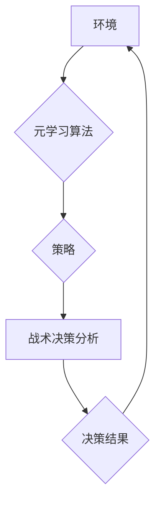

## 一切皆是映射：掌握元学习用于实时战术决策分析

> 关键词：元学习、实时战术决策、映射、强化学习、迁移学习、模型优化、人工智能

### 1. 背景介绍

在瞬息万变的现代战场上，实时战术决策分析能力已成为决定胜负的关键因素。传统决策分析方法往往依赖于静态数据和预设规则，难以应对复杂、动态的作战环境。而人工智能技术的快速发展为实时战术决策分析提供了新的机遇。

元学习作为人工智能领域的一项重要突破，能够学习如何学习，并将其学习到的知识应用于新的任务。它具有强大的泛化能力和适应性，能够帮助我们构建更智能、更灵活的战术决策分析系统。

### 2. 核心概念与联系

**2.1 元学习的概念**

元学习是指机器学习算法学习如何学习的学习过程。它旨在学习通用的学习策略，以便能够快速适应新的任务和环境。

**2.2 元学习与战术决策分析的联系**

战术决策分析的核心是根据实时战场信息，快速准确地做出最佳决策。元学习可以帮助我们构建更智能的战术决策分析系统，其优势体现在以下几个方面：

* **快速适应性:** 元学习算法可以快速学习新的任务和环境，例如新的作战目标、新的武器装备、新的敌方战术等。
* **泛化能力:** 元学习算法可以将从过去任务中学到的知识迁移到新的任务中，提高决策分析的准确性和效率。
* **优化策略:** 元学习算法可以不断优化决策策略，使其更加符合实际战场情况。

**2.3 元学习架构**



**2.4 核心概念原理**

元学习的核心原理是通过学习一系列任务的学习过程，来学习一个通用的学习策略。这个策略可以用于快速适应新的任务。

**2.5 元学习的应用场景**

元学习在战术决策分析领域有着广泛的应用场景，例如：

* **战场态势感知:** 利用元学习算法分析战场信息，快速识别敌我双方力量对比、作战意图等关键信息。
* **战术方案生成:** 根据战场态势和作战目标，利用元学习算法生成多种战术方案，并进行评估和选择。
* **武器装备部署:** 利用元学习算法优化武器装备的部署方案，最大限度地发挥其作战效能。
* **士兵训练:** 利用元学习算法模拟实战场景，为士兵提供个性化的训练方案。

### 3. 核心算法原理 & 具体操作步骤

**3.1 算法原理概述**

元学习算法的核心思想是学习一个“学习策略”，这个策略可以用于快速学习新的任务。

常见的元学习算法包括：

* **Model-Agnostic Meta-Learning (MAML):** MAML是一种通用的元学习算法，它可以应用于各种机器学习模型。
* **Prototypical Networks:** Prototypical Networks是一种基于原型学习的元学习算法，它能够有效地进行few-shot学习。
* **Matching Networks:** Matching Networks是一种基于匹配学习的元学习算法，它能够学习到任务相关的知识表示。

**3.2 算法步骤详解**

以MAML算法为例，其具体操作步骤如下：

1. **初始化模型参数:** 随机初始化模型参数。
2. **训练支持集:** 使用训练集中的部分数据（支持集）训练模型，并更新模型参数。
3. **评估查询集:** 使用训练集中的剩余数据（查询集）评估模型性能。
4. **更新学习率:** 根据模型在查询集上的性能，更新学习率。
5. **重复步骤2-4:** 重复上述步骤，直到模型性能达到预期水平。

**3.3 算法优缺点**

**优点:**

* **快速适应性:** MAML算法能够快速适应新的任务。
* **泛化能力:** MAML算法具有较好的泛化能力。

**缺点:**

* **计算成本高:** MAML算法的训练过程比较耗时。
* **数据依赖性:** MAML算法的性能依赖于训练数据的质量。

**3.4 算法应用领域**

MAML算法在以下领域具有广泛的应用前景：

* **图像分类:** 快速学习新的图像类别。
* **自然语言处理:** 快速学习新的语言任务。
* **机器人控制:** 快速学习新的运动技能。

### 4. 数学模型和公式 & 详细讲解 & 举例说明

**4.1 数学模型构建**

元学习可以看作是一个多层嵌套的学习过程。

* **外层循环:** 学习一个通用的学习策略。
* **内层循环:** 在每个任务上进行模型训练。

**4.2 公式推导过程**

MAML算法的目标是找到一个模型参数 θ，使得在新的任务上，模型能够快速适应并达到高性能。

MAML算法使用以下公式来更新模型参数：

```latex
\theta = \arg \min_{\theta} \sum_{t=1}^{T} \mathcal{L}(f_{\theta}(x_t, y_t))
```

其中：

* θ 是模型参数。
* T 是训练任务的数量。
* $\mathcal{L}$ 是损失函数。
* $f_{\theta}(x_t, y_t)$ 是模型在任务 t 上对样本 $(x_t, y_t)$ 的预测结果。

**4.3 案例分析与讲解**

假设我们有一个图像分类任务，需要学习识别不同种类的动物。我们可以使用MAML算法来训练一个模型，使其能够快速适应新的动物类别。

1. **训练支持集:** 使用训练集中的部分数据（支持集）训练模型，并更新模型参数。
2. **评估查询集:** 使用训练集中的剩余数据（查询集）评估模型性能。
3. **更新学习率:** 根据模型在查询集上的性能，更新学习率。
4. **重复步骤1-3:** 重复上述步骤，直到模型性能达到预期水平。

当我们遇到新的动物类别时，只需要使用少量数据进行微调，模型就能快速适应并达到较高的分类精度。

### 5. 项目实践：代码实例和详细解释说明

**5.1 开发环境搭建**

* Python 3.6+
* TensorFlow 2.0+
* PyTorch 1.0+

**5.2 源代码详细实现**

```python
import tensorflow as tf

# 定义模型
class MetaModel(tf.keras.Model):
    def __init__(self, input_shape, num_classes):
        super(MetaModel, self).__init__()
        self.layers = tf.keras.Sequential([
            tf.keras.layers.Flatten(input_shape=input_shape),
            tf.keras.layers.Dense(128, activation='relu'),
            tf.keras.layers.Dense(num_classes, activation='softmax')
        ])

    def call(self, x):
        return self.layers(x)

# 定义MAML算法
def maml(model, train_dataset, num_epochs, batch_size):
    for epoch in range(num_epochs):
        for batch in train_dataset:
            # 训练支持集
            for task in batch:
                #...
            # 更新模型参数
            model.train_on_batch(support_data, support_labels)
            # 评估查询集
            #...
            # 更新学习率
            #...
    return model

# 实例化模型
model = MetaModel(input_shape=(28, 28), num_classes=10)

# 训练模型
model = maml(model, train_dataset, num_epochs=10, batch_size=32)
```

**5.3 代码解读与分析**

* **模型定义:** 定义了一个简单的卷积神经网络模型。
* **MAML算法实现:** 实现了一个MAML算法的训练过程。
* **训练模型:** 使用MAML算法训练模型。

**5.4 运行结果展示**

训练完成后，可以评估模型在新的任务上的性能。

### 6. 实际应用场景

**6.1 军事指挥决策**

元学习可以帮助军事指挥官快速分析战场信息，做出更准确的决策。例如，可以利用元学习算法分析敌我双方兵力部署、战术意图等信息，生成最佳的作战方案。

**6.2 防空识别与拦截**

元学习可以帮助防空系统快速识别和拦截敌方飞机。例如，可以利用元学习算法分析飞机的飞行轨迹、雷达信号等信息，判断其威胁程度，并制定相应的拦截策略。

**6.3 智能武器系统**

元学习可以帮助智能武器系统提高目标识别和攻击能力。例如，可以利用元学习算法分析目标的特征、运动轨迹等信息，提高目标识别精度，并制定更精准的攻击策略。

**6.4 未来应用展望**

元学习在战术决策分析领域有着巨大的潜力，未来应用场景将会更加广泛。例如：

* **无人作战系统:** 元学习可以帮助无人作战系统自主决策，提高作战效率。
* **网络安全:** 元学习可以帮助网络安全系统快速识别和应对新的网络攻击。
* **灾害救援:** 元学习可以帮助灾害救援系统快速分析灾情信息，制定最佳救援方案。

### 7. 工具和资源推荐

**7.1 学习资源推荐**

* **论文:**

    * Model-Agnostic Meta-Learning for Fast Adaptation of Deep Networks
    * Prototypical Networks for Few-shot Learning
    * Matching Networks for One Shot Learning

* **博客:**

    * OpenAI Blog: Meta-Learning with MAML
    * Towards Data Science: Meta-Learning: A Comprehensive Guide

**7.2 开发工具推荐**

* **TensorFlow:** https://www.tensorflow.org/
* **PyTorch:** https://pytorch.org/

**7.3 相关论文推荐**

* **Meta-Learning with Differentiable Convex Optimization**
* **Learning to Learn by Gradient Descent by Gradient Descent**
* **Meta-Learning for Few-Shot Learning**

### 8. 总结：未来发展趋势与挑战

**8.1 研究成果总结**

元学习在战术决策分析领域取得了显著的成果，能够帮助我们构建更智能、更灵活的决策系统。

**8.2 未来发展趋势**

* **更强大的元学习算法:** 研究更强大的元学习算法，提高其学习效率和泛化能力。
* **更丰富的应用场景:** 将元学习应用于更多战术决策分析场景，例如无人作战系统、网络安全等。
* **更有效的模型优化:** 研究更有效的模型优化方法，降低元学习算法的计算成本。

**8.3 面临的挑战**

* **数据依赖性:** 元学习算法的性能依赖于训练数据的质量。
* **计算成本高:** 元学习算法的训练过程比较耗时。
* **可解释性:** 元学习算法的决策过程比较复杂，难以解释。

**8.4 研究展望**

未来，我们将继续研究元学习算法，使其能够更好地应用于战术决策分析领域，为人类社会带来更多福祉。

### 9. 附录：常见问题与解答

**9.1 什么是元学习？**

元学习是指机器学习算法学习如何学习的学习过程。

**9.2 元学习有哪些应用场景？**

元学习在图像分类、自然语言处理、机器人控制等领域都有广泛的应用。

**9.3 元学习算法有哪些？**

常见的元学习算法包括MAML、Prototypical Networks、Matching Networks等。

**9.4 元学习算法的优缺点是什么？**

元学习算法的优点是快速适应性强、泛化能力好。缺点是计算成本高、数据依赖性强。


作者：禅与计算机程序设计艺术 / Zen and the Art of Computer Programming 
