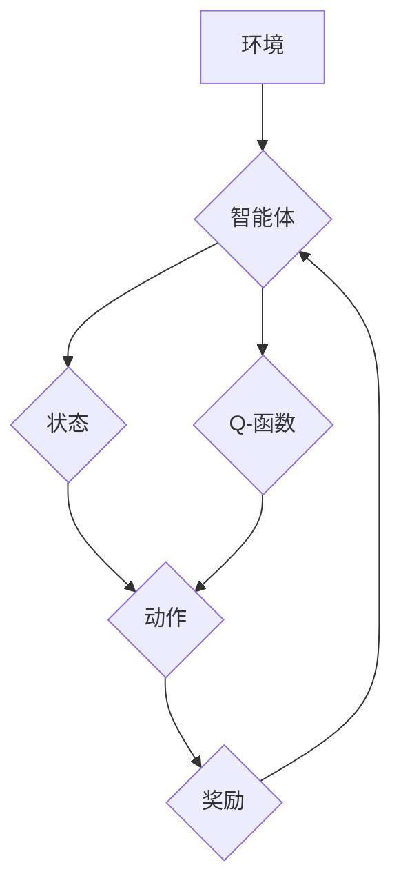

## 一切皆是映射：无模型与有模型强化学习：DQN在此框架下的地位

> 关键词：强化学习、无模型强化学习、有模型强化学习、DQN、深度强化学习、Q-learning、价值函数、策略梯度

### 1. 背景介绍

强化学习 (Reinforcement Learning, RL) 作为机器学习领域的重要分支，近年来取得了令人瞩目的进展，并在游戏、机器人控制、自动驾驶等领域展现出强大的应用潜力。强化学习的核心思想是通过智能体与环境的交互，学习一个策略，使得智能体在环境中获得最大的累积奖励。

传统的强化学习算法通常依赖于明确的模型，即环境状态转移概率和奖励函数的数学模型。然而，在现实世界中，许多环境过于复杂，难以构建精确的模型。因此，无模型强化学习 (Model-Free RL) 应运而生，它不需要事先了解环境模型，而是通过直接从环境交互中学习策略。

深度强化学习 (Deep Reinforcement Learning, DRL) 则是将深度神经网络引入强化学习算法，进一步提升了算法的学习能力和泛化能力。其中，深度 Q-网络 (Deep Q-Network, DQN) 作为 DRL 的里程碑式算法，成功地将深度学习与 Q-learning 结合，在 Atari 游戏等领域取得了突破性的成果。

### 2. 核心概念与联系

**2.1 无模型与有模型强化学习**

* **有模型强化学习 (Model-Based RL):** 

   - 假设环境模型已知，并利用该模型进行规划和决策。
   - 优点：能够利用模型进行预测和规划，提高学习效率。
   - 缺点：需要构建精确的环境模型，在复杂环境中难以实现。

* **无模型强化学习 (Model-Free RL):**

   - 不依赖于环境模型，直接从环境交互中学习策略。
   - 优点：无需构建环境模型，适用于复杂环境。
   - 缺点：学习过程可能更慢，需要更多交互数据。

**2.2 DQN 在无模型强化学习框架下的地位**

DQN 属于无模型强化学习算法，它通过学习一个 Q-函数来估计在给定状态下采取不同动作的期望累积奖励。DQN 的核心思想是利用深度神经网络来逼近 Q-函数，从而能够处理高维状态空间和复杂决策问题。

**Mermaid 流程图**



### 3. 核心算法原理 & 具体操作步骤

**3.1 算法原理概述**

DQN 算法的核心是学习一个 Q-函数，该函数将状态-动作对映射到期望累积奖励。DQN 使用深度神经网络来逼近 Q-函数，并通过 Q-learning 算法进行训练。

**3.2 算法步骤详解**

1. **初始化 Q-网络:** 使用深度神经网络初始化 Q-网络，并设置学习率和折扣因子。
2. **环境交互:** 智能体与环境交互，获取当前状态、采取动作并获得奖励。
3. **更新 Q-值:** 使用 Bellman 方程更新 Q-值，即 Q(s, a) = r + γ max_a' Q(s', a'), 其中 r 是奖励，γ 是折扣因子，s' 是下一个状态，a' 是下一个状态下的最佳动作。
4. **训练 Q-网络:** 使用梯度下降算法训练 Q-网络，最小化 Q-值与目标 Q-值的误差。
5. **选择动作:** 根据训练好的 Q-网络，选择动作，即选择 Q-值最大的动作。
6. **重复步骤 2-5:** 重复以上步骤，直到智能体达到预设的目标或训练完成。

**3.3 算法优缺点**

* **优点:**
    - 能够处理高维状态空间和复杂决策问题。
    - 不需要构建环境模型，适用于复杂环境。
    - 具有较强的泛化能力。
* **缺点:**
    - 学习过程可能较慢，需要更多交互数据。
    - 容易陷入局部最优解。

**3.4 算法应用领域**

DQN 算法在以下领域具有广泛的应用前景:

* **游戏:** DQN 在 Atari 游戏等领域取得了突破性的成果，证明了其在游戏 AI 中的强大能力。
* **机器人控制:** DQN 可以用于训练机器人控制策略，使机器人能够在复杂环境中自主完成任务。
* **自动驾驶:** DQN 可以用于训练自动驾驶汽车的决策策略，使其能够安全地驾驶。
* **推荐系统:** DQN 可以用于个性化推荐，根据用户的历史行为学习用户的偏好。

### 4. 数学模型和公式 & 详细讲解 & 举例说明

**4.1 数学模型构建**

强化学习的数学模型主要包括以下几个方面:

* **状态空间 (S):** 环境可能存在的全部状态集合。
* **动作空间 (A):** 智能体可以采取的所有动作集合。
* **奖励函数 (R):** 描述智能体在特定状态采取特定动作后获得的奖励。
* **状态转移概率 (P):** 描述从一个状态采取一个动作后转移到另一个状态的概率。
* **价值函数 (V):** 描述一个状态的期望累积奖励。

**4.2 公式推导过程**

DQN 算法的核心是学习一个 Q-函数，该函数将状态-动作对映射到期望累积奖励。Q-函数的更新公式为:

$$Q(s, a) \leftarrow Q(s, a) + \alpha [r + \gamma \max_{a'} Q(s', a') - Q(s, a)]$$

其中:

* $Q(s, a)$ 是状态 s 下采取动作 a 的 Q-值。
* $\alpha$ 是学习率。
* $r$ 是奖励。
* $\gamma$ 是折扣因子。
* $s'$ 是下一个状态。
* $a'$ 是下一个状态下的最佳动作。

**4.3 案例分析与讲解**

假设一个智能体在玩一个简单的游戏，游戏状态包括玩家的位置和游戏目标的位置。智能体可以采取“向上”、“向下”、“向左”、“向右”四个动作。

当智能体在某个状态下采取某个动作后，会获得一定的奖励，例如到达游戏目标时获得最大奖励，撞到障碍物时获得负奖励。

DQN 算法会学习一个 Q-函数，该函数将状态-动作对映射到期望累积奖励。例如，如果智能体在某个状态下采取“向上”动作，DQN 算法会学习到这个动作在该状态下获得的期望累积奖励。

通过不断地与环境交互，DQN 算法会更新 Q-函数，最终学习到一个能够使智能体在游戏中获得最大累积奖励的策略。

### 5. 项目实践：代码实例和详细解释说明

**5.1 开发环境搭建**

* Python 3.x
* TensorFlow 或 PyTorch
* OpenAI Gym

**5.2 源代码详细实现**

```python
import tensorflow as tf
import numpy as np

# 定义 Q-网络
class DQN(tf.keras.Model):
    def __init__(self, state_size, action_size):
        super(DQN, self).__init__()
        self.dense1 = tf.keras.layers.Dense(64, activation='relu')
        self.dense2 = tf.keras.layers.Dense(64, activation='relu')
        self.output = tf.keras.layers.Dense(action_size)

    def call(self, state):
        x = self.dense1(state)
        x = self.dense2(x)
        return self.output(x)

# 定义 DQN 算法
def dqn(env, state_size, action_size, learning_rate, discount_factor, epsilon):
    # 初始化 Q-网络
    model = DQN(state_size, action_size)
    optimizer = tf.keras.optimizers.Adam(learning_rate=learning_rate)

    # 训练循环
    for episode in range(num_episodes):
        state = env.reset()
        done = False
        total_reward = 0

        while not done:
            # 选择动作
            if np.random.rand() < epsilon:
                action = env.action_space.sample()
            else:
                action = tf.argmax(model(tf.expand_dims(state, axis=0))).numpy()[0]

            # 执行动作
            next_state, reward, done, _ = env.step(action)

            # 更新 Q-值
            with tf.GradientTape() as tape:
                target_q_values = reward + discount_factor * tf.reduce_max(model(tf.expand_dims(next_state, axis=0)))
                q_values = model(tf.expand_dims(state, axis=0))
                loss = tf.keras.losses.mean_squared_error(target_q_values, q_values[0, action])

            # 反向传播
            gradients = tape.gradient(loss, model.trainable_variables)
            optimizer.apply_gradients(zip(gradients, model.trainable_variables))

            # 更新状态
            state = next_state
            total_reward += reward

        print(f"Episode {episode+1}, Total Reward: {total_reward}")

# 主函数
if __name__ == "__main__":
    env = gym.make('CartPole-v1')
    state_size = env.observation_space.shape[0]
    action_size = env.action_space.n
    dqn(env, state_size, action_size, learning_rate=0.001, discount_factor=0.99, epsilon=0.1)
```

**5.3 代码解读与分析**

* **DQN 类:** 定义了深度 Q-网络的结构，包含两个全连接层和一个输出层。
* **dqn 函数:** 定义了 DQN 算法的训练过程，包括初始化 Q-网络、定义优化器、训练循环等步骤。
* **训练循环:** 在每个训练循环中，智能体与环境交互，根据 Q-网络的输出选择动作，执行动作并获得奖励。然后，使用 Bellman 方程更新 Q-值，并使用梯度下降算法训练 Q-网络。
* **epsilon-贪婪策略:** 在选择动作时，使用 epsilon-贪婪策略，以一定的概率随机选择动作，以探索环境。

**5.4 运行结果展示**

运行代码后，会输出每个训练回合的总奖励，随着训练的进行，总奖励会逐渐增加，表明智能体正在学习到更好的策略。

### 6. 实际应用场景

DQN 算法在以下实际应用场景中展现出强大的潜力:

* **游戏 AI:** DQN 算法已经成功应用于 Atari 游戏等领域，能够学习到复杂的策略，实现高水平的游戏 AI。
* **机器人控制:** DQN 算法可以用于训练机器人控制策略，使机器人能够在复杂环境中自主完成任务，例如导航、抓取等。
* **自动驾驶:** DQN 算法可以用于训练自动驾驶汽车的决策策略，使其能够安全地驾驶，例如避障、变道等。
* **推荐系统:** DQN 算法可以用于个性化推荐，根据用户的历史行为学习用户的偏好，推荐更符合用户需求的物品。

**6.4 未来应用展望**

随着深度学习技术的不断发展，DQN 算法的应用场景将会更加广泛。未来，DQN 算法可能应用于以下领域:

* **医疗诊断:** DQN 算法可以用于辅助医生进行医疗诊断，例如识别病灶、预测疾病风险等。
* **金融交易:** DQN 算法可以用于开发智能交易系统，自动进行股票交易等。
* **自然语言处理:** DQN 算法可以用于训练机器翻译、文本摘要等自然语言处理模型