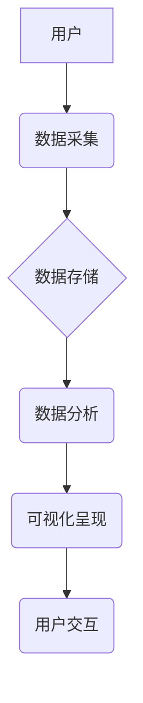

## 医疗健康档案信息可视化系统设计与实现

> 关键词：医疗健康档案、信息可视化、数据分析、机器学习、用户体验、数据安全、系统架构

## 1. 背景介绍

随着医疗信息技术的快速发展，医疗健康档案信息量呈指数级增长。传统的文本格式存储和查询方式已难以满足临床医生、患者和科研人员对信息获取、分析和决策的需求。信息可视化技术作为一种有效的信息呈现方式，能够将海量数据转化为直观易懂的图表、图形和交互式界面，帮助用户快速理解数据趋势、发现隐藏模式，从而提高医疗诊断、治疗和管理效率。

医疗健康档案信息可视化系统旨在通过对患者医疗历史、体征数据、基因信息等进行分析和可视化，为临床医生、患者和科研人员提供更直观、更便捷的医疗信息服务。

## 2. 核心概念与联系

### 2.1 核心概念

* **医疗健康档案 (Electronic Health Records, EHR):**  电子化的患者医疗记录，包含患者的个人信息、病史、诊断、治疗方案、实验室检查结果、影像学检查结果等。
* **信息可视化 (Data Visualization):**  利用图表、图形、地图等多种形式，将复杂的数据转化为易于理解和分析的视觉呈现。
* **数据分析 (Data Analysis):**  对医疗健康档案数据进行收集、清洗、整理、挖掘和分析，以发现数据中的规律、趋势和模式。
* **机器学习 (Machine Learning):**  利用算法训练模型，从数据中学习知识和规律，用于预测疾病风险、辅助诊断和个性化治疗方案推荐。

### 2.2 系统架构



**系统架构说明:**

* **用户:** 包括临床医生、患者和科研人员等。
* **数据采集:** 从各种医疗设备、系统和数据库中采集患者医疗健康档案数据。
* **数据存储:** 将采集到的数据存储在安全可靠的数据库中。
* **数据分析:** 利用数据分析技术和机器学习算法对数据进行分析，挖掘数据中的价值。
* **可视化呈现:** 将分析结果转化为图表、图形、地图等多种形式，以直观易懂的方式呈现给用户。
* **用户交互:** 用户可以通过系统界面进行数据查询、筛选、过滤和交互操作。

## 3. 核心算法原理 & 具体操作步骤

### 3.1 算法原理概述

医疗健康档案信息可视化系统中常用的算法包括：

* **数据清洗和预处理:**  去除数据中的噪声、缺失值和异常值，并将数据转换为可分析的格式。
* **聚类分析:** 将患者数据根据相似性进行分组，发现患者群体特征和潜在疾病风险。
* **关联规则挖掘:**  发现数据中存在的关系和模式，例如特定症状与疾病之间的关联。
* **时间序列分析:**  分析患者医疗数据随时间变化的趋势，预测疾病发展和治疗效果。
* **机器学习模型训练:**  利用机器学习算法训练模型，用于疾病诊断、风险预测和个性化治疗方案推荐。

### 3.2 算法步骤详解

以聚类分析为例，详细说明其操作步骤：

1. **数据收集:** 从医疗健康档案数据库中收集患者相关数据，例如年龄、性别、身高、体重、血压、血糖、血脂等。
2. **数据预处理:**  去除数据中的缺失值、异常值和无关特征，并将数据标准化或归一化。
3. **选择聚类算法:**  根据数据特点和分析目标选择合适的聚类算法，例如K-means聚类、层次聚类等。
4. **设置聚类参数:**  根据数据规模和聚类目标设置聚类算法的参数，例如K值、距离度量等。
5. **执行聚类:**  利用选择的聚类算法对数据进行聚类，将患者数据划分为不同的群体。
6. **评估聚类结果:**  利用聚类评估指标，例如Silhouette score、Dunn index等，评估聚类结果的质量。
7. **可视化结果:**  将聚类结果可视化，例如使用散点图或热力图展示不同群体的特征和分布。

### 3.3 算法优缺点

**聚类分析的优点:**

* 可以发现数据中潜在的结构和模式。
* 不需要预先定义类别标签，适用于未知类别的情况。
* 可以用于数据降维和特征提取。

**聚类分析的缺点:**

* 算法选择和参数设置对结果影响较大。
* 聚类结果的解释性相对较弱。
* 难以处理高维数据和复杂数据结构。

### 3.4 算法应用领域

* **疾病风险预测:**  根据患者数据特征，预测患者患特定疾病的风险。
* **患者群体分析:**  将患者数据进行聚类，发现不同患者群体的特征和需求。
* **个性化医疗方案推荐:**  根据患者数据特征，推荐个性化的治疗方案和健康管理建议。
* **药物研发:**  分析患者数据，发现潜在的药物靶点和治疗策略。

## 4. 数学模型和公式 & 详细讲解 & 举例说明

### 4.1 数学模型构建

**聚类分析的数学模型:**

聚类分析的目标是将数据点划分为若干个互不相交的簇，使得每个簇内的数据点彼此相似，而不同簇之间的数据点差异较大。常用的聚类算法基于距离度量和相似性计算。

**距离度量:**

常用的距离度量包括欧氏距离、曼哈顿距离、余弦相似度等。

**欧氏距离:**

$$
d(x,y) = \sqrt{\sum_{i=1}^{n}(x_i - y_i)^2}
$$

其中，$x$ 和 $y$ 是两个数据点，$x_i$ 和 $y_i$ 是数据点在第 $i$ 个特征上的值。

**相似度:**

相似度通常定义为距离的倒数或其他函数。

**聚类算法:**

常用的聚类算法包括K-means聚类、层次聚类等。

### 4.2 公式推导过程

**K-means聚类算法:**

K-means聚类算法的目标是找到K个聚类中心，使得每个数据点到其所属聚类中心的距离最小。

**算法步骤:**

1. 随机选择K个数据点作为初始聚类中心。
2. 将每个数据点分配到距离其最近的聚类中心所属的簇。
3. 计算每个簇的中心点。
4. 将每个数据点重新分配到距离其最近的聚类中心所属的簇。
5. 重复步骤2-4，直到聚类中心不再变化或达到最大迭代次数。

**公式推导:**

K-means聚类算法的中心点计算公式为：

$$
c_k = \frac{1}{n_k} \sum_{i=1}^{n_k} x_i
$$

其中，$c_k$ 是第 $k$ 个簇的中心点，$n_k$ 是第 $k$ 个簇中数据点的数量，$x_i$ 是第 $i$ 个数据点。

### 4.3 案例分析与讲解

**案例:**

假设我们有10个数据点，需要将其聚类成2个簇。

**步骤:**

1. 随机选择2个数据点作为初始聚类中心。
2. 将每个数据点分配到距离其最近的聚类中心所属的簇。
3. 计算每个簇的中心点。
4. 将每个数据点重新分配到距离其最近的聚类中心所属的簇。
5. 重复步骤2-4，直到聚类中心不再变化。

**结果:**

最终，数据点将被划分为两个簇，每个簇的中心点代表该簇的特征。

## 5. 项目实践：代码实例和详细解释说明

### 5.1 开发环境搭建

* **操作系统:**  Windows/macOS/Linux
* **编程语言:**  Python
* **数据存储:**  MySQL/PostgreSQL
* **可视化工具:**  matplotlib/seaborn/plotly

### 5.2 源代码详细实现

```python
# 导入必要的库
import pandas as pd
from sklearn.cluster import KMeans

# 加载医疗健康档案数据
data = pd.read_csv('medical_data.csv')

# 数据预处理
#...

# 选择K值
k = 2

# 创建K-means聚类模型
kmeans = KMeans(n_clusters=k, random_state=0)

# 训练模型
kmeans.fit(data)

# 获取聚类结果
labels = kmeans.labels_

# 将聚类标签添加到数据中
data['cluster'] = labels

# 可视化聚类结果
#...
```

### 5.3 代码解读与分析

* **数据加载:** 使用pandas库加载医疗健康档案数据。
* **数据预处理:** 对数据进行清洗、标准化等预处理操作。
* **聚类模型选择:** 选择K-means聚类算法。
* **模型训练:** 使用训练数据训练K-means模型。
* **聚类结果获取:** 获取每个数据点的聚类标签。
* **可视化结果:** 使用matplotlib或其他可视化工具，绘制聚类结果图。

### 5.4 运行结果展示

运行代码后，将生成聚类结果图，展示不同患者群体的特征和分布。

## 6. 实际应用场景

### 6.1 临床诊断辅助

* 基于患者医疗历史、体征数据和基因信息，进行疾病风险预测和诊断辅助。
* 识别患者群体特征，为不同患者群体的疾病诊断提供个性化建议。

### 6.2 治疗方案推荐

* 根据患者数据特征，推荐个性化的治疗方案和健康管理建议。
* 分析患者对不同治疗方案的反应，优化治疗方案。

### 6.3 药物研发

* 分析患者数据，发现潜在的药物靶点和治疗策略。
* 预测药物的疗效和安全性。

### 6.4 未来应用展望

* **人工智能驱动的个性化医疗:**  利用人工智能技术，为每个患者提供个性化的医疗服务。
* **远程医疗:**  通过信息可视化技术，实现远程医疗诊断和治疗。
* **医疗数据共享:**  利用信息可视化技术，促进医疗数据共享和协同研究。

## 7. 工具和资源推荐

### 7.1 学习资源推荐

* **书籍:**
    *  《数据可视化》
    *  《Python数据科学手册》
* **在线课程:**
    *  Coursera: 数据可视化
    *  edX: Python编程
* **网站:**
    *  DataCamp
    *  Kaggle

### 7.2 开发工具推荐

* **编程语言:** Python
* **数据分析库:** pandas, NumPy, Scikit-learn
* **可视化库:** matplotlib, seaborn, plotly
* **数据库:** MySQL, PostgreSQL

### 7.3 相关论文推荐

* **K-means聚类算法:**
    *  MacQueen, J. B. (1967). Some methods for classification and analysis of multivariate observations. *Proceedings of the fifth Berkeley symposium on mathematical statistics and probability*, 1, 280-297.
* **数据可视化:**
    *  Cleveland, W. S. (1993). *The elements of graphing data*. Hobart Press.

## 8. 总结：未来发展趋势与挑战

### 8.1 研究成果总结

医疗健康档案信息可视化系统已取得了显著成果，为临床诊断、治疗方案推荐、药物研发等领域提供了新的思路和方法。

### 8.2 未来发展趋势

* **人工智能驱动的可视化:**  利用人工智能技术，实现更智能、更个性化的可视化呈现。
* **沉浸式可视化:**  利用虚拟现实