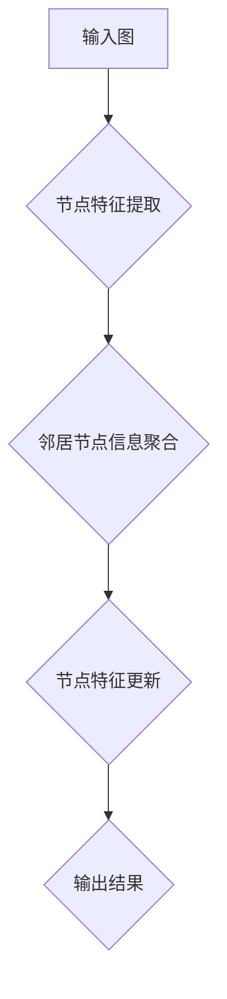

## 图神经网络(Graph Neural Networks) - 原理与代码实例讲解

> 关键词：图神经网络，GNN，图数据，节点特征，边特征，卷积操作，图分类，图聚类，图预测

## 1. 背景介绍

随着数据类型的多样化，传统机器学习模型在处理结构化数据，如文本、图像等方面取得了显著成果。然而，对于关系型数据，例如社交网络、分子结构、知识图谱等，传统的机器学习方法难以有效地捕捉数据之间的复杂关系。

图神经网络 (Graph Neural Networks, GNN) 应运而生，它是一种专门用于处理图数据的深度学习模型。GNN 能够学习图结构中节点和边的特征，并通过迭代更新节点表示来捕捉图的全局信息。近年来，GNN 在图分类、图聚类、图预测等任务上取得了令人瞩目的成果，并逐渐成为图数据分析领域的研究热点。

## 2. 核心概念与联系

图数据由节点和边组成，节点代表实体，边代表实体之间的关系。GNN 旨在学习节点的特征表示，并利用这些表示来完成各种图分析任务。

**图神经网络的架构**



**核心概念:**

* **节点特征:** 描述每个节点的属性信息，例如用户画像、分子结构等。
* **边特征:** 描述节点之间的关系类型，例如社交关系、化学键等。
* **邻居节点信息聚合:** 将节点的邻居节点信息聚合起来，例如邻居节点的特征平均值、最大值等。
* **节点特征更新:** 根据邻居节点信息聚合结果，更新节点的特征表示。

## 3. 核心算法原理 & 具体操作步骤

### 3.1  算法原理概述

GNN 的核心思想是通过迭代更新节点特征来学习图的全局信息。每个迭代步骤，GNN 会将每个节点的邻居节点信息聚合起来，并根据聚合结果更新节点的特征表示。

### 3.2  算法步骤详解

1. **初始化节点特征:** 为每个节点赋予初始特征向量。
2. **信息聚合:** 对于每个节点，收集其邻居节点的信息，并使用聚合函数将这些信息聚合起来。常见的聚合函数包括求和、平均值、最大值等。
3. **特征更新:** 使用一个非线性函数将聚合后的信息与节点自身的特征向量结合起来，得到更新后的节点特征向量。
4. **迭代:** 重复步骤 2 和 3 多次，直到节点特征收敛。

### 3.3  算法优缺点

**优点:**

* 能够有效地捕捉图结构中的复杂关系。
* 适用于各种图数据类型。
* 在图分类、图聚类、图预测等任务上取得了显著成果。

**缺点:**

* 计算复杂度较高，难以处理大型图数据。
* 训练过程需要大量的图数据。
* 对于稀疏图数据，性能可能下降。

### 3.4  算法应用领域

* **社交网络分析:** 预测用户行为、识别社区结构、推荐好友等。
* **推荐系统:** 基于用户-商品交互图进行商品推荐。
* **分子结构分析:** 预测分子性质、发现新药等。
* **知识图谱推理:** 回答自然语言问题、进行知识发现等。

## 4. 数学模型和公式 & 详细讲解 & 举例说明

### 4.1  数学模型构建

假设图 $G = (V, E)$，其中 $V$ 是节点集合，$E$ 是边集合。每个节点 $v \in V$ 都有一个特征向量 $h_v \in \mathbb{R}^d$。

GNN 的目标是学习一个函数 $f$，将图 $G$ 的节点特征映射到一个新的特征空间，即 $h'_v = f(G, h_v)$。

### 4.2  公式推导过程

GNN 的核心操作是节点特征更新。一个常见的节点特征更新公式如下：

$$
h'_v = \sigma \left( \sum_{u \in N(v)} \frac{e_{uv}}{ \sum_{w \in N(v)} e_{vw}} h_u + W_1 h_v \right)
$$

其中：

* $h'_v$ 是更新后的节点 $v$ 的特征向量。
* $h_v$ 是节点 $v$ 的初始特征向量。
* $N(v)$ 是节点 $v$ 的邻居节点集合。
* $e_{uv}$ 是节点 $u$ 和 $v$ 之间的边权重。
* $W_1$ 是一个可学习的权重矩阵。
* $\sigma$ 是一个非线性激活函数，例如 ReLU 函数。

### 4.3  案例分析与讲解

假设我们有一个简单的社交网络图，其中每个节点代表一个用户，边代表用户之间的友谊关系。

我们可以使用 GNN 来学习用户特征，例如用户的兴趣爱好、年龄、性别等。

通过迭代更新节点特征，GNN 可以捕捉用户之间的关系，并学习到每个用户的隐含特征表示。

例如，如果两个用户是好友，并且他们都喜欢看电影，那么 GNN 会将这两个用户的特征向量拉得更近。

## 5. 项目实践：代码实例和详细解释说明

### 5.1  开发环境搭建

* Python 3.6+
* PyTorch 1.0+
* 其他依赖库：numpy, scipy, matplotlib等

### 5.2  源代码详细实现

```python
import torch
import torch.nn as nn

class GNN(nn.Module):
    def __init__(self, input_dim, hidden_dim, output_dim):
        super(GNN, self).__init__()
        self.linear1 = nn.Linear(input_dim, hidden_dim)
        self.linear2 = nn.Linear(hidden_dim, output_dim)
        self.relu = nn.ReLU()

    def forward(self, x, adj):
        x = self.linear1(x)
        x = self.relu(x)
        x = torch.matmul(adj, x)
        x = self.linear2(x)
        return x

# 假设我们有一个图数据，包含节点特征和邻接矩阵
node_features = torch.randn(num_nodes, input_dim)
adj_matrix = torch.randn(num_nodes, num_nodes)

# 创建 GNN 模型
model = GNN(input_dim, hidden_dim, output_dim)

# 前向传播
output = model(node_features, adj_matrix)

#... 训练模型...
```

### 5.3  代码解读与分析

* `GNN` 类定义了一个简单的 GNN 模型。
* `__init__` 方法初始化模型参数，包括输入维度、隐藏维度和输出维度。
* `forward` 方法定义了模型的前向传播过程。
* 输入节点特征和邻接矩阵，并通过线性层、ReLU 激活函数和矩阵乘法进行特征更新。
* 最后输出更新后的节点特征。

### 5.4  运行结果展示

运行代码后，可以得到每个节点的更新后的特征向量。

这些特征向量可以用于后续的图分析任务，例如图分类、图聚类、图预测等。

## 6. 实际应用场景

### 6.1  社交网络分析

GNN 可以用于分析社交网络，例如预测用户行为、识别社区结构、推荐好友等。

例如，我们可以使用 GNN 学习用户的兴趣爱好、年龄、性别等特征，并根据这些特征预测用户是否会点击某个广告。

### 6.2  推荐系统

GNN 可以用于构建基于用户-商品交互图的推荐系统。

例如，我们可以使用 GNN 学习用户的购买历史、浏览记录等信息，并根据这些信息推荐用户可能感兴趣的商品。

### 6.3  分子结构分析

GNN 可以用于分析分子结构，例如预测分子性质、发现新药等。

例如，我们可以使用 GNN 学习分子的原子类型、键类型等信息，并根据这些信息预测分子的生物活性。

### 6.4  未来应用展望

GNN 是一种新兴的深度学习模型，在图数据分析领域具有巨大的潜力。

未来，GNN 可能会应用于更多领域，例如：

* **自然语言处理:** 分析文本中的关系和结构。
* **计算机视觉:** 分析图像中的对象和场景关系。
* **自动驾驶:** 分析道路环境中的关系和结构。

## 7. 工具和资源推荐

### 7.1  学习资源推荐

* **书籍:**

    * 《图神经网络》 -  Thomas N. Kipf, Max Welling
    * 《Deep Learning with Graph Neural Networks》 -  William L. Hamilton

* **课程:**

    * Coursera: Graph Neural Networks Specialization
    * Udacity: Deep Learning Nanodegree

### 7.2  开发工具推荐

* **PyTorch Geometric:** 一个用于图神经网络的 PyTorch 库。
* **DGL:** 一个用于图神经网络的深度学习框架。
* **TensorFlow Graph:** 一个用于图神经网络的 TensorFlow 库。

### 7.3  相关论文推荐

* **Semi-Supervised Classification with Graph Convolutional Networks** - Thomas N. Kipf, Max Welling
* **Graph Attention Networks** -  Petar Veličković, et al.
* **GraphSAGE: Inductive Representation Learning on Large Graphs** -  William L. Hamilton, et al.

## 8. 总结：未来发展趋势与挑战

### 8.1  研究成果总结

近年来，GNN 在图数据分析领域取得了显著成果，并在许多应用场景中展现出强大的性能。

GNN 的发展趋势包括：

* **模型复杂度提升:** 研究更复杂的 GNN 模型，例如 Transformer-based GNN、Graph Convolutional Networks with Attention。
* **效率优化:** 研究更高效的 GNN 训练算法，例如并行训练、知识蒸馏等。
* **可解释性增强:** 研究更可解释的 GNN 模型，例如可视化节点特征、分析模型决策过程等。

### 8.2  未来发展趋势

* **图数据规模增长:** GNN 将面临处理更大规模图数据的挑战。
* **图数据类型多样化:** GNN 需要适应不同类型图数据的特点，例如动态图、混合图等。
* **跨模态图分析:** GNN 将与其他模态数据融合，例如文本、图像、音频等，进行跨模态图分析。

### 8.3  面临的挑战

* **计算复杂度:** GNN 的计算复杂度较高，难以处理大型图数据。
* **过拟合:** GNN 容易过拟合，需要使用正则化技术和数据增强等方法来缓解。
* **可解释性:** GNN 的模型结构复杂，难以解释模型的决策过程。

### 8.4  研究展望

未来，GNN 将继续发展成为图数据分析领域的重要工具。

研究者们将继续探索更有效的 GNN 模型、训练算法和应用场景，推动 GNN 技术的进步。

## 9. 附录：常见问题与解答

* **什么是图神经网络 (GNN)?**

GNN 是一种专门用于处理图数据的深度学习模型。它能够学习图结构中节点和边的特征，并通过迭代更新节点表示来捕捉图的全局信息。

* **GNN 的应用场景有哪些?**

GNN 的应用场景非常广泛，包括社交网络分析、推荐系统、分子结构分析、知识图谱推理等。

* **如何选择合适的 GNN 模型?**

选择合适的 GNN 模型需要根据具体的应用场景和图数据特点来决定。

例如，对于节点分类任务，可以使用 Graph Convolutional Networks (GCN) 模型；对于图聚类任务，可以使用 Graph Attention Networks (GAT) 模型。

* **