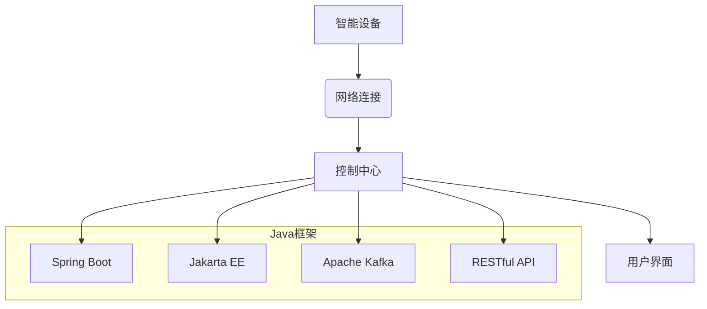

## 基于Java的智能家居设计：如何基于Java框架优化智能家居设备交互

> 关键词：智能家居、Java框架、设备交互、物联网、消息队列、RESTful API、微服务架构

## 1. 背景介绍

智能家居已成为现代生活的重要组成部分，它通过将各种智能设备连接到网络，实现对家居环境的自动化控制和智能化管理。然而，智能家居系统的复杂性也带来了诸多挑战，例如设备互联互通、数据安全、用户体验等。

Java作为一种成熟、稳定、开源的编程语言，在企业级应用和大型系统开发中占据着重要地位。其丰富的生态系统、强大的框架和工具支持，使其成为构建智能家居系统的理想选择。

## 2. 核心概念与联系

### 2.1 智能家居系统架构

智能家居系统通常由以下几个核心组件组成：

* **智能设备:** 包括各种传感器、执行器、控制单元等，例如智能灯泡、智能门锁、智能空调等。
* **网络连接:** 用于连接智能设备和控制中心，常见的网络协议包括Wi-Fi、蓝牙、Zigbee等。
* **控制中心:** 负责接收用户指令、处理设备数据、协调设备工作，通常由服务器或云平台提供。
* **用户界面:** 用于用户与智能家居系统交互，例如手机APP、语音助手、触摸屏等。

### 2.2 Java框架在智能家居中的应用

Java框架可以帮助开发者简化智能家居系统的开发过程，提高开发效率和代码质量。常见的Java框架包括：

* **Spring Boot:** 轻量级、快速开发的框架，适合构建微服务架构的智能家居系统。
* **Jakarta EE:** 企业级应用开发框架，提供丰富的组件和服务，适合构建大型、复杂的智能家居系统。
* **Apache Kafka:** 高性能的消息队列系统，用于处理智能设备之间的数据传输和事件通知。
* **RESTful API:** 用于构建智能设备和控制中心之间的接口，实现设备数据交互和远程控制。

### 2.3 架构图



## 3. 核心算法原理 & 具体操作步骤

### 3.1  算法原理概述

智能家居系统中，设备交互通常基于消息队列和事件驱动模型。

* **消息队列:** 用于异步传输设备数据和事件通知，例如设备状态变化、用户指令等。
* **事件驱动模型:** 控制中心订阅特定事件，当设备发生特定事件时，控制中心会收到事件通知并执行相应的操作。

### 3.2  算法步骤详解

1. **设备注册:** 智能设备连接到控制中心并注册自身信息，包括设备类型、设备ID、通信协议等。
2. **消息发布:** 当设备状态发生变化或用户发出指令时，设备会将相关信息发布到消息队列中。
3. **消息订阅:** 控制中心订阅特定设备或事件的消息，例如订阅所有智能灯泡的状态变化消息。
4. **消息处理:** 当控制中心收到消息时，会根据消息内容执行相应的操作，例如根据智能灯泡的状态变化消息，控制中心可以更新用户界面上的灯泡状态。

### 3.3  算法优缺点

* **优点:** 异步传输、高并发、灵活扩展。
* **缺点:** 需要处理消息丢失、消息重发等问题。

### 3.4  算法应用领域

* **智能家居控制:** 控制智能设备的开关、亮度、温度等。
* **场景自动化:** 根据用户设定，自动执行一系列设备操作，例如起床场景、睡觉场景等。
* **远程控制:** 通过手机APP或语音助手远程控制智能设备。

## 4. 数学模型和公式 & 详细讲解 & 举例说明

### 4.1  数学模型构建

智能家居系统中的设备交互可以抽象为一个图论模型，其中：

* **节点:** 代表智能设备。
* **边:** 代表设备之间的交互关系，例如数据传输、事件通知等。

### 4.2  公式推导过程

* **设备连接度:**  定义为一个设备连接的边的数量，可以用来衡量设备的连接程度。
* **平均连接度:**  定义为所有设备连接度的平均值，可以用来衡量整个系统的连接程度。

$$
\text{设备连接度} = \text{连接边的数量}
$$

$$
\text{平均连接度} = \frac{\sum_{i=1}^{n} \text{设备}_i \text{连接度}}{n}
$$

其中，n代表智能设备的数量。

### 4.3  案例分析与讲解

假设一个智能家居系统中，有5个智能设备，分别是智能灯泡、智能门锁、智能空调、智能摄像头和智能音箱。

* 智能灯泡连接到智能控制中心，连接度为1。
* 智能门锁连接到智能控制中心和智能摄像头，连接度为2。
* 智能空调连接到智能控制中心，连接度为1。
* 智能摄像头连接到智能门锁和智能音箱，连接度为2。
* 智能音箱连接到智能门锁和智能控制中心，连接度为2。

则系统的平均连接度为：

$$
\text{平均连接度} = \frac{1+2+1+2+2}{5} = 1.6
$$

## 5. 项目实践：代码实例和详细解释说明

### 5.1  开发环境搭建

* JDK 11 或更高版本
* Maven 或 Gradle 构建工具
* IntelliJ IDEA 或 Eclipse IDE

### 5.2  源代码详细实现

```java
// 设备接口
public interface Device {
    String getId();
    void turnOn();
    void turnOff();
}

// 智能灯泡类
public class SmartLightBulb implements Device {
    private String id;

    public SmartLightBulb(String id) {
        this.id = id;
    }

    @Override
    public String getId() {
        return id;
    }

    @Override
    public void turnOn() {
        System.out.println("智能灯泡 " + id + " 开启");
    }

    @Override
    public void turnOff() {
        System.out.println("智能灯泡 " + id + " 关闭");
    }
}

// 控制中心类
public class ControlCenter {
    private MessageQueue messageQueue;

    public ControlCenter() {
        messageQueue = new MessageQueue();
    }

    public void subscribe(String deviceId, DeviceListener listener) {
        messageQueue.subscribe(deviceId, listener);
    }

    public void publish(String deviceId, String message) {
        messageQueue.publish(deviceId, message);
    }
}

// 设备监听器接口
public interface DeviceListener {
    void onMessageReceived(String deviceId, String message);
}
```

### 5.3  代码解读与分析

* **设备接口:** 定义了智能设备的基本操作，例如获取设备ID、开启、关闭等。
* **智能灯泡类:** 实现设备接口，代表一个具体的智能灯泡设备。
* **控制中心类:** 负责管理设备注册、消息订阅和消息发布。
* **设备监听器接口:** 定义了设备监听器接收消息的回调方法。

### 5.4  运行结果展示

当用户通过控制中心发布“智能灯泡1开启”的消息时，控制中心会将消息发送到消息队列，智能灯泡1的监听器会收到消息并执行开启操作。

## 6. 实际应用场景

### 6.1 智能家居场景

* **场景1: 睡眠场景**

当用户设定“睡眠场景”时，控制中心会自动执行以下操作：

* 关闭所有智能灯泡。
* 将智能空调温度设定为舒适温度。
* 关闭智能电视。
* 打开智能音箱播放舒缓音乐。

* **场景2: 出门场景**

当用户设定“出门场景”时，控制中心会自动执行以下操作：

* 关闭所有智能灯泡。
* 关闭智能空调。
* 锁定智能门锁。
* 设定智能摄像头录制模式。

### 6.2 其他应用场景

* **远程监控:** 通过智能摄像头和手机APP，远程监控家中情况。
* **智能安防:** 利用智能门锁、智能摄像头和传感器，实现智能安防功能。
* **健康管理:** 利用智能血压计、智能体重秤等设备，记录和分析健康数据。

### 6.4  未来应用展望

随着物联网技术的不断发展，智能家居系统将更加智能化、个性化和安全化。未来，智能家居系统将更加深入地融入人们的生活，为人们提供更加便捷、舒适和安全的居住体验。

## 7. 工具和资源推荐

### 7.1  学习资源推荐

* **Java官方文档:** https://docs.oracle.com/javase/tutorial/
* **Spring Boot官方文档:** https://spring.io/projects/spring-boot
* **Jakarta EE官方文档:** https://jakarta.ee/

### 7.2  开发工具推荐

* **IntelliJ IDEA:** https://www.jetbrains.com/idea/
* **Eclipse:** https://www.eclipse.org/

### 7.3  相关论文推荐

* **A Survey of Smart Home Technologies and Applications:** https://ieeexplore.ieee.org/document/8804702
* **Smart Home Security: A Comprehensive Survey:** https://ieeexplore.ieee.org/document/9009407

## 8. 总结：未来发展趋势与挑战

### 8.1  研究成果总结

基于Java框架构建智能家居系统具有以下优势：

* **成熟稳定:** Java语言和框架经过多年的发展，稳定可靠，易于维护。
* **生态系统丰富:** Java拥有丰富的第三方库和工具，可以简化开发过程。
* **可扩展性强:** Java框架支持微服务架构，可以方便地扩展系统功能。

### 8.2  未来发展趋势

* **人工智能:** 将人工智能技术融入智能家居系统，实现更加智能化的设备控制和场景自动化。
* **边缘计算:** 将计算能力部署到智能设备本身，实现更加实时和高效的设备交互。
* **隐私保护:** 加强智能家居系统的隐私保护机制，保障用户数据安全。

### 8.3  面临的挑战

* **设备互联互通:** 不同品牌和型号的智能设备之间缺乏统一的标准，导致互联互通性差。
* **数据安全:** 智能家居系统收集大量用户数据，需要加强数据安全防护措施。
* **用户体验:** 智能家居系统的操作界面和交互方式需要更加人性化，方便用户使用。

### 8.4  研究展望

未来，我们将继续研究基于Java框架构建智能家居系统的技术，探索人工智能、边缘计算等新技术在智能家居领域的应用，致力于打造更加智能、安全、便捷的智能家居体验。

## 9. 附录：常见问题与解答

* **Q1: 如何选择合适的Java框架构建智能家居系统？**

A1: 选择Java框架需要根据项目的具体需求和规模进行考虑。对于小型项目，可以使用轻量级的Spring Boot框架。对于大型项目，可以使用功能更丰富的Jakarta EE框架。

* **Q2: 如何实现智能设备之间的互联互通？**

A2: 可以使用标准化的协议，例如MQTT、CoAP等，实现智能设备之间的互联互通。

* **Q3: 如何保障智能家居系统的安全？**

A3: 可以采用多种安全措施，例如数据加密、身份验证、访问控制等，保障智能家居系统的安全。


作者：禅与计算机程序设计艺术 / Zen and the Art of Computer Programming 
