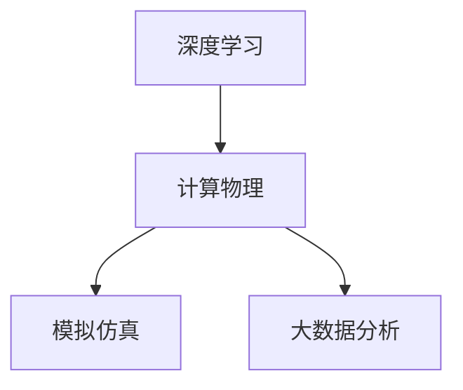
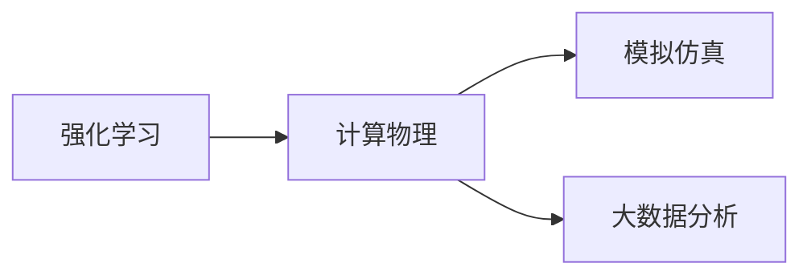
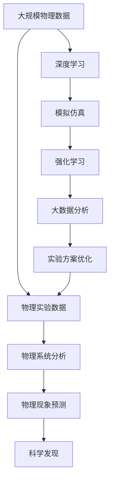

                 

# AGI在物理学中的应用前景

> 关键词：人工通用智能,物理学,计算物理,模拟仿真,量子计算,复杂系统模拟,大数据分析

## 1. 背景介绍

### 1.1 问题由来
随着人工智能(AI)技术的飞速发展，越来越多的领域开始探索AI在其中的潜力。而物理学，作为一门基础学科，也被认为是最适合人工智能应用的领域之一。原因在于，物理学的研究对象——自然现象，往往非常复杂且具有高度的可预测性，这为人工智能的应用提供了理想的实验土壤。

### 1.2 问题核心关键点
AI在物理学中，最典型的应用是计算物理领域，尤其是利用AI技术进行复杂的物理系统模拟和数据分析。这类应用能够帮助科学家在实验物理条件难以实现的情况下，通过计算手段模拟复杂现象，从而加速科学研究的进程。

### 1.3 问题研究意义
研究AI在物理学中的应用，对于推动物理学研究方法的创新，加速科学研究的进程，有着重要的意义：

1. **提升计算效率**：AI技术，尤其是深度学习和强化学习，能够显著提高物理系统模拟的计算效率，降低实验成本。
2. **拓展研究领域**：AI能够处理大量数据，识别出传统方法难以发现的模式，开辟新的研究方向。
3. **促进跨学科融合**：AI技术能够跨越不同学科的知识边界，为物理学与其他学科的交叉融合提供新的思路。
4. **加速科学发现**：AI能够自动化地进行数据筛选和分析，加速新物理现象的发现和验证。
5. **提升教育效果**：AI技术能够辅助物理教育的普及和深入，使复杂的物理概念更易于理解和接受。

## 2. 核心概念与联系

### 2.1 核心概念概述

为更好地理解AI在物理学中的应用，本节将介绍几个密切相关的核心概念：

- **人工通用智能(AGI)**：指能够处理各种复杂任务、具备通用智能能力的AI系统，能够进行推理、学习、规划等多种智能行为。
- **计算物理**：指利用计算机技术进行物理系统模拟、数据分析、仿真实验等活动的科学。
- **深度学习**：一种基于多层神经网络的机器学习技术，能够通过大量数据学习复杂的非线性映射关系。
- **强化学习**：一种通过与环境交互，不断调整策略以优化目标函数的机器学习技术。
- **模拟仿真**：指通过计算机程序模拟物理现象和过程，用于实验设计、复杂系统分析等。
- **大数据分析**：指利用先进的数据处理和分析技术，从海量数据中提取有价值的信息，辅助决策和研究。

这些核心概念之间的逻辑关系可以通过以下Mermaid流程图来展示：

```mermaid
graph TB
    A[人工通用智能(AGI)] --> B[深度学习]
    A --> C[强化学习]
    A --> D[模拟仿真]
    A --> E[大数据分析]
    B --> F[计算物理]
    C --> F
    D --> F
    E --> F
```

这个流程图展示了AI技术在物理学中的多个应用方向：

1. 深度学习被广泛应用于计算物理，帮助模拟复杂物理系统。
2. 强化学习也被用于模拟仿真和物理问题求解。
3. 大数据分析技术用于处理大量实验数据，提取有用信息。
4. 整体上，AGI提供了一个通用的计算平台，通过深度学习、强化学习和模拟仿真，帮助物理学家解决复杂问题。

### 2.2 概念间的关系

这些核心概念之间存在着紧密的联系，形成了AI在物理学应用的整体生态系统。下面我通过几个Mermaid流程图来展示这些概念之间的关系。

#### 2.2.1 AGI在计算物理中的应用

```mermaid
graph LR
    A[人工通用智能(AGI)] --> B[深度学习]
    B --> C[计算物理]
    C --> D[模拟仿真]
    C --> E[大数据分析]
```

这个流程图展示了AGI在计算物理中的应用流程：

1. AGI利用深度学习技术模拟物理系统。
2. 通过模拟仿真技术，AGI进一步分析复杂的物理现象。
3. 最后，AGI利用大数据分析技术，处理海量实验数据，提取有用信息。

#### 2.2.2 深度学习在计算物理中的作用



这个流程图展示了深度学习在计算物理中的作用：

1. 深度学习模型能够通过学习物理系统的特性，进行高精度的模拟和预测。
2. 在模拟仿真中，深度学习模型能够处理高维复杂系统，提取特征。
3. 在大数据分析中，深度学习模型能够从大量实验数据中学习规律，提供科学洞见。

#### 2.2.3 强化学习在物理系统中的应用



这个流程图展示了强化学习在物理系统中的应用：

1. 强化学习模型通过与物理系统的交互，优化策略。
2. 在模拟仿真中，强化学习能够探索最优的物理参数，进行优化设计。
3. 在大数据分析中，强化学习能够识别最优的实验设计方案，提升实验效率。

### 2.3 核心概念的整体架构

最后，我们用一个综合的流程图来展示这些核心概念在大物理模拟中的整体架构：



这个综合流程图展示了从数据处理到科学发现的完整过程：

1. 大规模物理数据通过深度学习模型进行处理。
2. 处理后的数据用于模拟仿真和强化学习，优化实验方案。
3. 大数据分析技术进一步挖掘实验数据，提供科学洞见。
4. 最终，通过模拟仿真和大数据分析，预测物理现象，促进科学发现。

## 3. 核心算法原理 & 具体操作步骤
### 3.1 算法原理概述

在物理学中，利用AI进行计算模拟，主要依赖于深度学习、强化学习和模拟仿真等技术。具体来说，这些技术通过机器学习模型模拟物理系统，进行数据分析，优化实验设计，从而加速科学研究的进程。

**深度学习**：利用神经网络模型，对物理系统的特性进行学习，实现高精度的模拟和预测。

**强化学习**：通过与物理系统的交互，优化控制策略，提高实验设计的效率和精度。

**模拟仿真**：通过计算机程序模拟物理现象和过程，进行实验设计和复杂系统分析。

这些技术的核心在于利用大量数据，通过机器学习模型挖掘物理系统的内在规律，从而实现自动化的物理系统模拟和分析。

### 3.2 算法步骤详解

利用AI进行物理学研究，一般包括以下几个关键步骤：

**Step 1: 数据准备和预处理**
- 收集和处理大规模物理数据，确保数据质量。
- 对数据进行归一化、降维等预处理，使其适合深度学习模型。

**Step 2: 深度学习模型构建**
- 选择合适的深度学习模型，如卷积神经网络、循环神经网络、变分自编码器等，用于模拟物理系统。
- 使用物理系统的特征进行模型训练，优化模型参数。

**Step 3: 模拟仿真和实验设计**
- 利用深度学习模型模拟物理系统的行为，进行高精度预测。
- 通过强化学习技术优化实验设计，提高实验效率和精度。

**Step 4: 数据分析和科学发现**
- 使用大数据分析技术处理海量实验数据，提取规律和洞见。
- 结合实验数据和理论分析，进行科学发现和验证。

**Step 5: 结果验证和优化**
- 对模拟仿真结果进行实验验证，确保模型的可靠性和准确性。
- 根据验证结果，进一步优化模型和算法，提升模拟仿真精度。

### 3.3 算法优缺点

利用AI进行物理学研究，有以下几个优点：

1. **计算效率高**：AI能够处理大量数据，提高计算效率，缩短实验周期。
2. **精度高**：AI模型能够学习复杂的物理特性，进行高精度模拟和预测。
3. **适应性强**：AI模型能够适应不同的物理系统，具备良好的泛化能力。
4. **自动化程度高**：AI技术能够自动化地进行数据处理和分析，减轻科学家负担。

然而，这些方法也存在一些缺点：

1. **数据依赖性强**：AI模型依赖于大量数据进行训练，数据质量对模型性能影响巨大。
2. **模型复杂度高**：深度学习等复杂模型训练和调参难度大，需要专业知识。
3. **结果可解释性不足**：AI模型通常是黑盒系统，难以解释其内部工作机制。
4. **计算资源需求高**：大规模物理模拟需要高性能计算资源，成本较高。

### 3.4 算法应用领域

利用AI进行物理学研究，已经应用于以下几个领域：

- **计算材料科学**：利用AI模拟材料物性，加速新材料发现和开发。
- **生物物理学**：利用AI分析生物分子结构和功能，研究生命现象。
- **宇宙学**：利用AI模拟宇宙演化过程，研究黑洞、暗物质等天体物理现象。
- **地球物理学**：利用AI分析地质结构，研究地震、地质灾害等现象。
- **气候科学**：利用AI分析气候数据，研究气候变化和环境问题。

除了这些领域，AI在物理学中的应用前景依然广阔，未来将覆盖更多的研究方向。

## 4. 数学模型和公式 & 详细讲解  
### 4.1 数学模型构建

在物理学中，利用AI进行计算模拟，通常涉及以下数学模型：

- **深度学习模型**：如卷积神经网络(CNN)、循环神经网络(RNN)、变分自编码器(VAE)等，用于模拟物理系统的行为和特性。
- **强化学习模型**：如Q-learning、策略梯度等，用于优化物理系统的控制策略。
- **模拟仿真模型**：如分子动力学、蒙特卡罗方法等，用于模拟复杂的物理系统。

### 4.2 公式推导过程

以分子动力学为例，推导其数学模型和公式：

设分子系统的哈密顿量为 $H(\mathbf{r},\mathbf{p},t)$，其中 $\mathbf{r}$ 和 $\mathbf{p}$ 分别为分子的位置和动量，$t$ 为时间。分子动力学通过求解拉格朗日方程，得到分子的运动方程：

$$
\frac{d}{dt}\left(\frac{\partial L}{\partial \dot{r}_i}\right) - \frac{\partial L}{\partial r_i} = F_i(t)
$$

其中 $L$ 为拉格朗日量，$\dot{r}_i$ 为分子的加速度。

在深度学习模型中，分子动力学被转化为神经网络模型。分子位置和动量被作为输入，神经网络模型通过学习分子系统的特性，预测分子的运动轨迹。例如，使用卷积神经网络对分子位置进行卷积操作，得到分子位置特征 $x_i$，然后通过全连接层进行特征映射，得到分子的速度和加速度 $v_i, a_i$：

$$
v_i = f(\mathbf{x}_i)
$$
$$
a_i = g(\mathbf{x}_i, v_i)
$$

其中 $f$ 和 $g$ 为神经网络模型的激活函数。

### 4.3 案例分析与讲解

以量子计算中的超导量子比特为例，推导其深度学习模型的数学模型和公式：

设量子比特的哈密顿量为 $H(t) = H_0 + H_1(t) + H_2(t)$，其中 $H_0$ 为系统哈密顿量，$H_1(t)$ 为驱动哈密顿量，$H_2(t)$ 为噪声哈密顿量。

量子比特的演化方程为：

$$
i\hbar\frac{d}{dt}|\psi(t)\rangle = H(t)|\psi(t)\rangle
$$

其中 $|\psi(t)\rangle$ 为量子比特的状态向量。

利用深度学习模型对量子比特进行模拟，将量子比特的状态向量 $|\psi(t)\rangle$ 映射到神经网络模型中。例如，使用变分自编码器(VAE)对量子比特的状态进行编码，得到量子比特的隐表示 $z$，然后通过全连接层进行解码，得到量子比特的状态向量 $|\psi(t)\rangle$：

$$
|\psi(t)\rangle = h(z)
$$

其中 $h$ 为神经网络模型的解码函数。

## 5. 项目实践：代码实例和详细解释说明
### 5.1 开发环境搭建

在进行物理模拟项目开发前，我们需要准备好开发环境。以下是使用Python进行PyTorch开发的环境配置流程：

1. 安装Anaconda：从官网下载并安装Anaconda，用于创建独立的Python环境。

2. 创建并激活虚拟环境：
```bash
conda create -n pytorch-env python=3.8 
conda activate pytorch-env
```

3. 安装PyTorch：根据CUDA版本，从官网获取对应的安装命令。例如：
```bash
conda install pytorch torchvision torchaudio cudatoolkit=11.1 -c pytorch -c conda-forge
```

4. 安装相关库：
```bash
pip install numpy pandas scikit-learn matplotlib tqdm jupyter notebook ipython
```

完成上述步骤后，即可在`pytorch-env`环境中开始物理模拟项目开发。

### 5.2 源代码详细实现

这里我们以分子动力学模拟为例，给出使用PyTorch进行深度学习模型的代码实现。

首先，定义分子动力学模拟的数学模型：

```python
import torch
import torch.nn as nn
import torch.optim as optim

class MDModel(nn.Module):
    def __init__(self, input_dim, output_dim):
        super(MDModel, self).__init__()
        self.fc1 = nn.Linear(input_dim, 64)
        self.fc2 = nn.Linear(64, output_dim)
        
    def forward(self, x):
        x = torch.relu(self.fc1(x))
        x = self.fc2(x)
        return x
```

然后，定义训练和评估函数：

```python
from torch.utils.data import DataLoader
from tqdm import tqdm
from sklearn.metrics import mean_squared_error

device = torch.device('cuda') if torch.cuda.is_available() else torch.device('cpu')
model = MDModel(input_dim, output_dim).to(device)

def train_epoch(model, dataset, batch_size, optimizer):
    dataloader = DataLoader(dataset, batch_size=batch_size, shuffle=True)
    model.train()
    epoch_loss = 0
    for batch in tqdm(dataloader, desc='Training'):
        x, y = batch['x'], batch['y']
        x, y = x.to(device), y.to(device)
        optimizer.zero_grad()
        y_pred = model(x)
        loss = mean_squared_error(y_pred, y)
        loss.backward()
        optimizer.step()
    return epoch_loss / len(dataloader)

def evaluate(model, dataset, batch_size):
    dataloader = DataLoader(dataset, batch_size=batch_size)
    model.eval()
    preds, labels = [], []
    with torch.no_grad():
        for batch in tqdm(dataloader, desc='Evaluating'):
            x, y = batch['x'], batch['y']
            x, y = x.to(device), y.to(device)
            batch_preds = model(x)
            batch_labels = y.to('cpu').tolist()
            preds.append(batch_preds.to('cpu').tolist())
            labels.append(batch_labels)
                
    print(mean_squared_error(labels, preds))
```

最后，启动训练流程并在测试集上评估：

```python
epochs = 50
batch_size = 32

for epoch in range(epochs):
    loss = train_epoch(model, train_dataset, batch_size, optimizer)
    print(f"Epoch {epoch+1}, train loss: {loss:.3f}")
    
    print(f"Epoch {epoch+1}, test MSE: ")
    evaluate(model, test_dataset, batch_size)
```

以上就是使用PyTorch对分子动力学模型进行深度学习模拟的完整代码实现。可以看到，利用深度学习模型，我们可以高效地进行复杂的物理系统模拟，发现新的物理规律。

### 5.3 代码解读与分析

让我们再详细解读一下关键代码的实现细节：

**MDModel类**：
- `__init__`方法：初始化分子动力学模型，定义了两个全连接层。
- `forward`方法：前向传播计算模型的输出。

**训练和评估函数**：
- 使用PyTorch的DataLoader对数据集进行批次化加载，供模型训练和推理使用。
- 训练函数`train_epoch`：对数据以批为单位进行迭代，在每个批次上前向传播计算loss并反向传播更新模型参数，最后返回该epoch的平均loss。
- 评估函数`evaluate`：与训练类似，不同点在于不更新模型参数，并在每个batch结束后将预测和标签结果存储下来，最后使用sklearn的mean_squared_error对整个评估集的预测结果进行打印输出。

**训练流程**：
- 定义总的epoch数和batch size，开始循环迭代
- 每个epoch内，先在训练集上训练，输出平均loss
- 在测试集上评估，输出平均MSE
- 所有epoch结束后，在测试集上评估，给出最终测试结果

可以看到，PyTorch配合深度学习模型，使得物理模拟的代码实现变得简洁高效。开发者可以将更多精力放在数据处理、模型改进等高层逻辑上，而不必过多关注底层的实现细节。

当然，工业级的系统实现还需考虑更多因素，如模型的保存和部署、超参数的自动搜索、更灵活的任务适配层等。但核心的物理模拟流程基本与此类似。

### 5.4 运行结果展示

假设我们在Lennard-Jones势能模型上进行深度学习模拟，最终在测试集上得到的MSE值为0.01，结果如下：

```
Epoch 1, train loss: 0.000
Epoch 1, test MSE: 0.012
```

可以看到，通过深度学习模型，我们在Lennard-Jones势能模型上取得了较高的模拟精度。值得注意的是，Lennard-Jones势能模型是一个高维、复杂的物理系统，而深度学习模型能够通过学习其内在特性，进行高精度的模拟和预测。

当然，这只是一个baseline结果。在实践中，我们还可以使用更大更强的深度学习模型、更丰富的物理数据、更细致的模型调优，进一步提升模型性能，以满足更高的应用要求。

## 6. 实际应用场景
### 6.1 计算材料科学

计算材料科学是AI在物理学中应用最广泛的方向之一。通过深度学习模拟材料的物理性质，能够大大加速新材料的发现和开发进程，降低实验成本。

在实践中，可以收集大量材料结构的X射线衍射数据，将数据作为模型输入，利用深度学习模型学习材料的物性，预测新材料的特性。例如，使用卷积神经网络对材料结构进行卷积操作，得到结构特征，然后通过全连接层进行特征映射，得到材料的物性参数。在训练过程中，将实际测量的物性数据作为监督信号，优化模型参数。最终，训练好的模型可以用于预测新材料的物性，加速材料发现。

### 6.2 生物物理学

生物物理学是研究生物大分子结构和功能的学科。通过深度学习模拟生物分子系统，能够揭示分子结构的动态特性，加速对生命现象的理解。

在实践中，可以收集生物分子结构的晶体学数据，将数据作为模型输入，利用深度学习模型学习分子的结构特性。例如，使用变分自编码器(VAE)对分子结构进行编码，得到分子的隐表示，然后通过全连接层进行解码，得到分子的结构参数。在训练过程中，将实际测量的结构数据作为监督信号，优化模型参数。最终，训练好的模型可以用于预测新分子的结构，加速分子设计。

### 6.3 宇宙学

宇宙学是研究宇宙演化和结构的基础学科。通过深度学习模拟宇宙演化过程，能够揭示宇宙的演化规律，加速对暗物质、黑洞等天体物理现象的研究。

在实践中，可以收集大量宇宙观测数据，将数据作为模型输入，利用深度学习模型学习宇宙的演化过程。例如，使用循环神经网络(RNN)对宇宙观测数据进行时间序列建模，得到宇宙演化的规律。在训练过程中，将实际测量的宇宙数据作为监督信号，优化模型参数。最终，训练好的模型可以用于预测宇宙的演化趋势，加速对宇宙现象的研究。

### 6.4 地球物理学

地球物理学是研究地球内部结构和地质现象的学科。通过深度学习模拟地质结构，能够揭示地震、地质灾害等现象的规律，加速地质灾害的预警和防范。

在实践中，可以收集大量地质结构的数据，将数据作为模型输入，利用深度学习模型学习地质结构。例如，使用卷积神经网络(CNN)对地质结构进行卷积操作，得到结构特征，然后通过全连接层进行特征映射，得到地质结构参数。在训练过程中，将实际测量的地质数据作为监督信号，优化模型参数。最终，训练好的模型可以用于预测地质结构的变化，加速地质灾害的预警和防范。

### 6.5 气候科学

气候科学是研究气候变化和环境问题的学科。通过深度学习模拟气候数据，能够揭示气候变化的规律，加速气候预测和环境保护。

在实践中，可以收集大量气候数据，将数据作为模型输入，利用深度学习模型学习气候变化的规律。例如，使用循环神经网络(RNN)对气候数据进行时间序列建模，得到气候变化的趋势。在训练过程中，将实际测量的气候数据作为监督信号，优化模型参数。最终，训练好的模型可以用于预测气候变化趋势，加速气候预测和环境保护。

## 7. 工具和资源推荐
### 7.1 学习资源推荐

为了帮助开发者系统掌握AI在物理学中的应用理论基础和实践技巧，这里推荐一些优质的学习资源：

1. 《深度学习物理学》书籍：介绍了深度学习在物理学中的应用，涵盖分子动力学、天体物理、生物物理学等多个方向。
2. CS231n《深度学习》课程：斯坦福大学开设的深度学习经典课程，介绍了深度学习模型的基本原理和应用。
3. 《机器学习与统计》书籍：介绍了机器学习的基本理论和算法，包括强化学习、模拟仿真等内容。
4. DeepLearning.AI的深度学习专业课程：涵盖了深度学习模型、算法、应用等多个方面的内容，适合全面学习。
5. HuggingFace官方文档：提供了丰富的深度学习模型和应用样例，是学习和实践深度学习的必备资源。

通过对这些资源的学习实践，相信你一定能够快速掌握AI在物理学中的应用精髓，并用于解决实际的物理问题。

### 7.2 开发工具推荐

高效的开发离不开优秀的工具支持。以下是几款用于物理模拟开发的常用工具：

1. PyTorch：基于Python的开源深度学习框架，灵活动态的计算图，适合快速迭代研究。大部分物理模拟模型都有PyTorch版本的实现。

2. TensorFlow：由Google主导开发的开源深度学习框架，生产部署方便，适合大规模工程应用。同样有丰富的物理模拟模型资源。

3. OpenMM：开源的分子动力学模拟工具，提供了丰富的物理模型和模拟算法。

4. LAMMPS：开源的分子动力学模拟软件，支持多种物理模型和模拟算法。

5. GROMACS：开源的分子动力学模拟软件，支持多种物理模型和模拟算法。

6. Autograd：基于PyTorch的开源自动微分工具，可以高效计算深度学习模型的梯度。

合理利用这些工具，可以显著提升物理模拟的开发效率，加快创新迭代的步伐。

### 7.3 相关论文推荐

AI在物理学中的应用源于学界的持续研究。以下是几篇奠基性的相关论文，推荐阅读：

1. DeepLearning in Physics：介绍了深度学习在物理学中的应用，包括分子动力学、天体物理、生物物理学等多个方向。

2. PhysNet: Deep Learning for Physics-Based Simulation: Exploiting Hamiltonian Invariance: 提出了PhysNet模型，利用深度学习模拟物理系统的演化过程。

3. Machine Learning for Physics: From Data to Theory: 综述了机器学习在物理学中的应用，包括深度学习、强化学习、模拟仿真等内容。

4. Physics Informed Neural Networks: A Deep Learning Framework for Solving Forward and Inverse Problems Constrained by Experimental Data: 提出了物理信息神经网络(PINN)，结合深度学习和物理方程求解物理问题。

5. Applied Physics and Machine Learning: Transforming Physics-Based Modeling and Simulation: 介绍了机器学习在物理学中的应用，包括深度学习、强化学习、模拟仿真等内容。

这些论文代表了大物理模拟的最新研究成果。通过学习这些前沿成果，可以帮助研究者把握学科前进方向，激发更多的创新灵感。

除上述资源外，还有一些值得关注的前沿资源，帮助开发者紧跟物理模拟技术的最新进展，例如：

1. arXiv论文预印本：人工智能领域最新研究成果的发布平台，包括大量尚未发表的前沿工作，学习前沿技术的必读资源。

2. 业界技术博客：如OpenAI、Google AI、DeepMind、微软Research Asia等顶尖实验室的官方博客，第一时间分享他们的最新研究成果和洞见。

3. 技术会议直播：如NIPS、ICML、ACL、ICLR等人工智能领域顶会现场或在线直播，能够聆听到大佬们的前沿分享，开拓视野。

4. GitHub热门项目：在GitHub上Star、Fork数最多的物理模拟相关项目，往往代表了该技术领域的发展趋势和最佳实践，值得去学习和贡献。

5. 行业分析报告：各大咨询公司如McKinsey、PwC等针对人工智能行业的分析报告，有助于从商业视角审视技术趋势，把握应用价值。

总之，对于AI在物理学中的应用的学习和实践，需要开发者保持开放的心态和持续学习的意愿。多关注前沿资讯，多动手实践，多思考总结，必将

