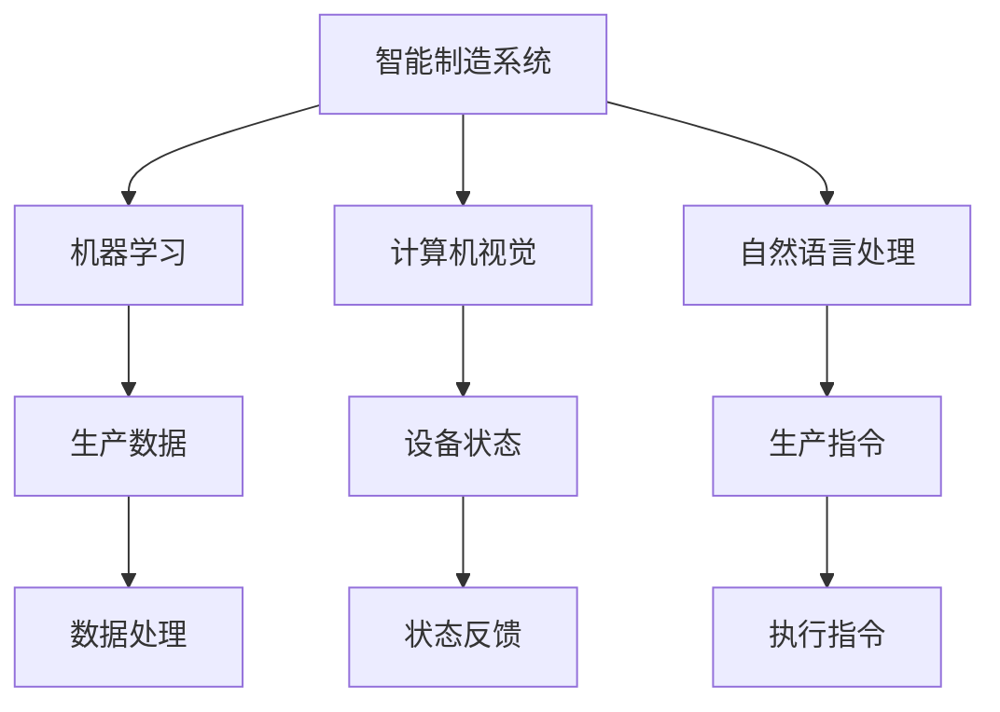
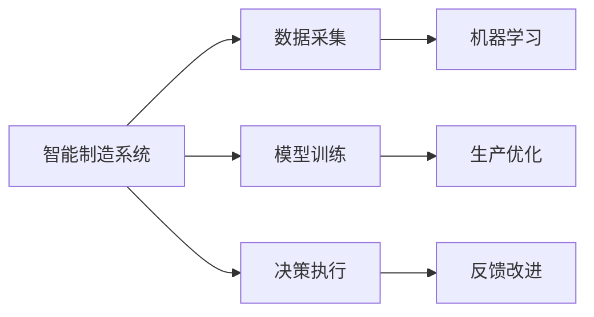
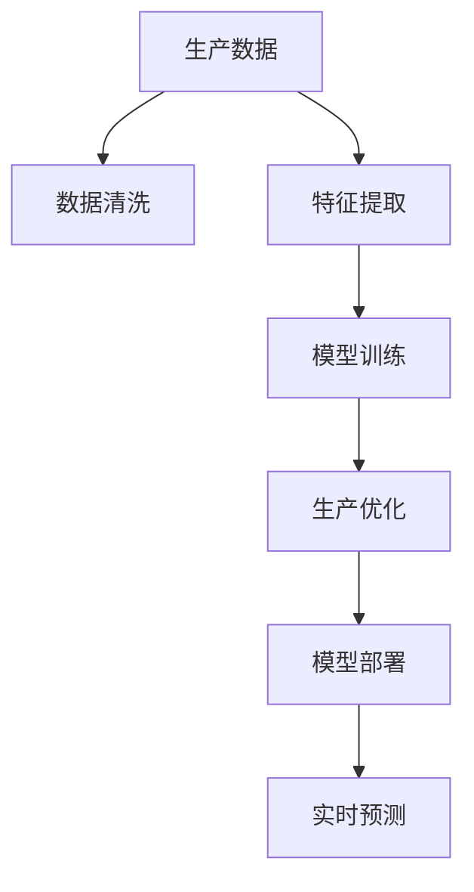
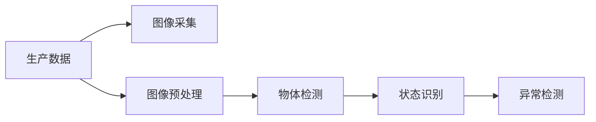
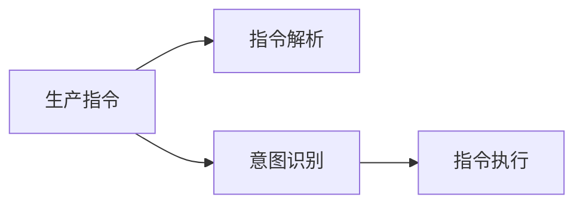
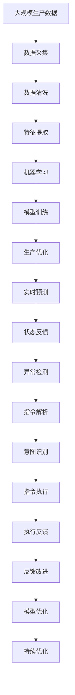

                 

# AI 2.0 时代的智能制造

## 1. 背景介绍

### 1.1 问题由来

随着人工智能技术的不断进步，智能制造已成为制造业转型升级的重要方向。传统的制造系统主要依赖于人工操作和固定的流程，效率低下，难以应对快速变化的市场需求。而随着AI技术的广泛应用，智能制造能够通过数据驱动和算法优化，提升生产效率，降低成本，实现柔性制造。

智能制造的实现离不开机器学习、计算机视觉、自然语言处理等AI技术的支撑。其中，机器学习是核心技术之一，通过智能分析生产数据，预测设备故障，优化生产流程，实现制造系统的智能化和自动化。

### 1.2 问题核心关键点

智能制造的核心在于将AI技术应用于生产流程中，提升生产效率和灵活性。具体来说，智能制造的实现需要以下几个关键点：

- **数据采集与处理**：通过传感器、摄像头等设备，实时采集生产数据，并将其转化为机器学习算法可处理的格式。
- **模型训练与优化**：利用机器学习算法，对采集到的数据进行建模和优化，生成能够预测生产状态、优化生产流程的模型。
- **决策与执行**：根据模型的输出，进行决策和执行，如调整设备参数、优化生产计划等。
- **反馈与改进**：通过反馈机制，持续改进模型，使其能够适应新的生产场景和需求。

### 1.3 问题研究意义

智能制造的实现，能够大幅提升制造业的生产效率和产品质量，加速工业互联网的建设进程，推动经济社会的可持续发展。具体来说，智能制造带来的优势包括：

- **提高生产效率**：通过智能优化生产流程，减少人工干预，提升生产速度和精度。
- **降低生产成本**：优化设备维护和物料管理，减少资源浪费和能源消耗。
- **提升产品质量**：通过数据驱动的质量监控，及时发现和解决生产问题，提高产品一致性和可靠性。
- **实现柔性制造**：根据市场需求变化，灵活调整生产计划和资源配置，增强市场竞争力。
- **促进工业互联网发展**：智能制造是工业互联网的重要组成部分，能够加速工业数据的融合和应用，推动智能制造系统的标准化和互联互通。

## 2. 核心概念与联系

### 2.1 核心概念概述

智能制造的核心概念包括：

- **智能制造系统**：基于AI技术，能够实时监控和优化生产流程的制造系统。
- **机器学习**：利用数据驱动算法，对生产数据进行建模和预测，优化生产流程。
- **计算机视觉**：通过图像识别技术，实时监控设备状态和产品质量。
- **自然语言处理**：利用NLP技术，解析生产指令和反馈信息，实现人机交互。
- **工业互联网**：通过网络连接和数据共享，实现制造系统的智能化和自动化。

这些概念之间的联系可以通过以下Mermaid流程图来展示：



这个流程图展示了智能制造系统与AI技术之间的关系：

- 智能制造系统利用机器学习、计算机视觉和自然语言处理技术，实时监控和优化生产流程。
- 生产数据通过机器学习算法进行建模和预测，生成优化策略。
- 设备状态和产品质量通过计算机视觉进行实时监控，反馈至生产系统。
- 自然语言处理解析生产指令和反馈信息，实现人机交互。

### 2.2 概念间的关系

这些核心概念之间存在着紧密的联系，形成了智能制造系统的完整生态系统。下面我们通过几个Mermaid流程图来展示这些概念之间的关系。

#### 2.2.1 智能制造系统的学习范式



这个流程图展示了智能制造系统的学习范式，包括数据采集、模型训练、决策执行和反馈改进。

#### 2.2.2 机器学习在智能制造中的应用



这个流程图展示了机器学习在智能制造中的应用，包括数据清洗、特征提取、模型训练、生产优化和实时预测。

#### 2.2.3 计算机视觉在智能制造中的应用



这个流程图展示了计算机视觉在智能制造中的应用，包括图像采集、图像预处理、物体检测、状态识别和异常检测。

#### 2.2.4 自然语言处理在智能制造中的应用



这个流程图展示了自然语言处理在智能制造中的应用，包括指令解析、意图识别和指令执行。

### 2.3 核心概念的整体架构

最后，我们用一个综合的流程图来展示这些核心概念在大语言模型微调过程中的整体架构：



这个综合流程图展示了从数据采集到模型优化的完整过程。智能制造系统通过实时监控和优化生产流程，实现数据驱动的智能制造。

## 3. 核心算法原理 & 具体操作步骤
### 3.1 算法原理概述

智能制造的核心算法是机器学习，通过数据驱动的方法，对生产数据进行建模和预测，优化生产流程。

假设生产数据为 $D = \{(x_i, y_i)\}_{i=1}^N$，其中 $x_i$ 为输入特征，$y_i$ 为输出标签。目标是通过训练一个预测模型 $M$，使得模型能够对新的输入数据 $x$ 进行预测，输出 $y$。

形式化地，我们希望找到一个最优模型 $M^*$，使得在给定输入 $x$ 的情况下，模型的预测 $y$ 与真实标签 $y$ 尽可能接近。因此，我们的优化目标为：

$$
M^* = \mathop{\arg\min}_{M} \frac{1}{N} \sum_{i=1}^N \ell(M(x_i),y_i)
$$

其中 $\ell$ 为损失函数，用于衡量模型预测输出与真实标签之间的差异。常见的损失函数包括均方误差、交叉熵等。

### 3.2 算法步骤详解

基于机器学习的智能制造算法一般包括以下几个关键步骤：

**Step 1: 数据采集与预处理**

- 通过传感器、摄像头等设备，实时采集生产数据，并将其转化为机器学习算法可处理的格式。
- 对采集到的数据进行清洗和预处理，包括去噪、归一化、特征提取等。

**Step 2: 特征选择与构建**

- 从原始数据中提取有意义的特征，用于模型的输入。
- 构建合适的特征空间，利用特征工程技术，优化特征组合，提升模型性能。

**Step 3: 模型选择与训练**

- 选择合适的机器学习模型，如回归模型、分类模型、神经网络等。
- 利用训练数据集，对模型进行训练，调整模型参数。

**Step 4: 模型验证与评估**

- 在验证数据集上对训练好的模型进行验证，评估模型性能。
- 根据评估结果，调整模型参数或选择其他模型。

**Step 5: 模型部署与应用**

- 将训练好的模型部署到生产系统中，实时监控和预测生产状态。
- 根据模型输出，进行决策和执行，如调整设备参数、优化生产计划等。
- 通过反馈机制，持续改进模型，使其能够适应新的生产场景和需求。

### 3.3 算法优缺点

机器学习在智能制造中的应用具有以下优点：

- **高效自动化**：通过数据驱动的方法，自动优化生产流程，减少人工干预，提升生产效率。
- **实时预测**：能够实时监控和预测生产状态，及时发现和解决问题，提高生产稳定性。
- **灵活适应**：通过反馈机制，持续改进模型，能够适应不同的生产场景和需求，增强系统柔性。

同时，机器学习在智能制造中也有以下缺点：

- **数据依赖性高**：机器学习模型的效果高度依赖于数据质量，需要大量高质量的生产数据。
- **模型复杂度高**：机器学习模型的构建和训练过程复杂，需要较高的技术水平和计算资源。
- **数据隐私问题**：智能制造系统的数据采集和处理过程中，存在数据隐私和安全问题，需要采取有效的措施保护数据。

### 3.4 算法应用领域

机器学习在智能制造中的应用广泛，涵盖了多个领域，包括：

- **设备监控与维护**：通过实时监控设备状态，预测设备故障，优化设备维护计划，降低维护成本。
- **生产调度优化**：通过优化生产计划和资源配置，提升生产效率和产品质量。
- **质量控制与检测**：利用计算机视觉技术，实时监控产品质量，识别缺陷，减少次品率。
- **供应链管理**：通过分析供应链数据，优化库存管理，提高物料和生产效率。
- **物流配送优化**：利用机器学习算法，优化物流配送路线，减少运输成本和时间。

## 4. 数学模型和公式 & 详细讲解 & 举例说明

### 4.1 数学模型构建

在智能制造中，常用的数学模型包括线性回归、逻辑回归、决策树、随机森林、神经网络等。这里以线性回归模型为例，进行详细讲解。

线性回归模型形式化表示为：

$$
y = \beta_0 + \sum_{i=1}^n \beta_i x_i + \epsilon
$$

其中 $y$ 为输出标签，$x_i$ 为输入特征，$\beta_0$ 为截距，$\beta_i$ 为系数，$\epsilon$ 为误差项。

在实际应用中，我们通常使用最小二乘法来拟合模型，即最小化预测值与真实值之间的平方误差：

$$
\min_{\beta} \frac{1}{N} \sum_{i=1}^N (y_i - \beta_0 - \sum_{i=1}^n \beta_i x_i)^2
$$

求解上述优化问题，得到最优的 $\beta$。

### 4.2 公式推导过程

以线性回归为例，推导模型的求解过程如下：

1. **最小二乘法推导**

   最小二乘法的目标是最小化预测值与真实值之间的平方误差，即：

   $$
   \min_{\beta} \frac{1}{N} \sum_{i=1}^N (y_i - \beta_0 - \sum_{i=1}^n \beta_i x_i)^2
   $$

   对该目标函数求导，得到：

   $$
   \frac{\partial}{\partial \beta} \frac{1}{N} \sum_{i=1}^N (y_i - \beta_0 - \sum_{i=1}^n \beta_i x_i)^2 = 0
   $$

   化简得到：

   $$
   \frac{1}{N} \sum_{i=1}^N (y_i - \beta_0 - \sum_{i=1}^n \beta_i x_i)x_i = 0
   $$

   该方程可进一步化简为：

   $$
   \sum_{i=1}^N (y_i - \hat{y}_i)x_i = 0
   $$

   其中 $\hat{y}_i = \beta_0 + \sum_{i=1}^n \beta_i x_i$ 为预测值。

2. **求解最小二乘法**

   对上述方程进行整理，得到：

   $$
   \sum_{i=1}^N x_i y_i = \beta_0 \sum_{i=1}^N x_i + \sum_{i=1}^n \beta_i \sum_{i=1}^N x_i^2
   $$

   化简得到：

   $$
   \sum_{i=1}^N x_i y_i - \beta_0 \sum_{i=1}^N x_i - \sum_{i=1}^n \beta_i \sum_{i=1}^N x_i^2 = 0
   $$

   将上述方程写成矩阵形式，即：

   $$
   (X^T X) \beta = X^T y
   $$

   其中 $X$ 为数据矩阵，$y$ 为标签向量，$\beta$ 为系数向量。

   通过求解上述线性方程，得到最优的 $\beta$，即线性回归模型的系数。

### 4.3 案例分析与讲解

假设一个智能制造系统，需要预测生产设备的工作状态。采集到如下数据：

| 设备编号 | 运行时间（小时） | 温度（℃） | 振动值（mm） | 预测状态 |
| --- | --- | --- | --- | --- |
| 1 | 1000 | 80 | 2.5 | 正常 |
| 2 | 1500 | 90 | 3.0 | 正常 |
| 3 | 2000 | 70 | 2.0 | 异常 |
| ... | ... | ... | ... | ... |

我们利用线性回归模型对设备状态进行预测，将设备运行时间、温度、振动值作为输入特征，预测状态为输出标签。

根据上述数据，构建特征矩阵 $X$ 和标签向量 $y$：

$$
X = \begin{bmatrix}
    1000 & 80 & 2.5 \\
    1500 & 90 & 3.0 \\
    2000 & 70 & 2.0 \\
    ... & ... & ...
\end{bmatrix}, y = \begin{bmatrix}
    0 \\
    0 \\
    1 \\
    ...
\end{bmatrix}
$$

其中 $X$ 的每一行表示一个样本，$y$ 的每一个元素表示样本的预测状态。

通过最小二乘法求解线性回归模型的系数，得到：

$$
\beta = (X^T X)^{-1} X^T y
$$

求解后得到：

$$
\beta = \begin{bmatrix}
    \beta_0 \\
    \beta_1 \\
    \beta_2 \\
    \beta_3
\end{bmatrix}
$$

将 $\beta$ 代入模型，得到预测模型：

$$
y = \beta_0 + \beta_1 x_1 + \beta_2 x_2 + \beta_3 x_3
$$

将采集到的设备运行时间、温度、振动值代入上述模型，得到设备的预测状态。

## 5. 项目实践：代码实例和详细解释说明

### 5.1 开发环境搭建

在进行智能制造系统开发前，需要先搭建开发环境。以下是使用Python进行PyTorch开发的流程：

1. 安装Anaconda：从官网下载并安装Anaconda，用于创建独立的Python环境。

2. 创建并激活虚拟环境：
```bash
conda create -n pytorch-env python=3.8 
conda activate pytorch-env
```

3. 安装PyTorch：根据CUDA版本，从官网获取对应的安装命令。例如：
```bash
conda install pytorch torchvision torchaudio cudatoolkit=11.1 -c pytorch -c conda-forge
```

4. 安装TensorFlow：
```bash
pip install tensorflow
```

5. 安装各类工具包：
```bash
pip install numpy pandas scikit-learn matplotlib tqdm jupyter notebook ipython
```

完成上述步骤后，即可在`pytorch-env`环境中开始开发实践。

### 5.2 源代码详细实现

这里我们以预测设备状态为例，使用TensorFlow实现线性回归模型。

首先，定义数据预处理函数：

```python
import tensorflow as tf
import numpy as np

def preprocess_data(data):
    # 将数据转化为浮点型，并归一化
    data = np.array(data, dtype=np.float32)
    data = (data - np.mean(data, axis=0)) / np.std(data, axis=0)
    return data
```

然后，定义训练函数：

```python
def train_model(X, y, learning_rate=0.01, num_epochs=1000):
    # 定义模型参数
    beta = tf.Variable(tf.zeros([X.shape[1]]))

    # 定义损失函数
    loss = tf.reduce_mean(tf.square(X @ beta - y))

    # 定义优化器
    optimizer = tf.keras.optimizers.Adam(learning_rate)

    # 定义训练过程
    for epoch in range(num_epochs):
        # 前向传播
        pred = X @ beta
        # 计算损失
        current_loss = loss

        # 反向传播
        grad = tf.gradients(loss, [beta])[0]
        optimizer.apply_gradients(zip([grad], [beta]))

        # 输出损失
        print(f"Epoch {epoch+1}, loss: {current_loss.numpy():.3f}")

    return beta
```

接着，使用上述函数训练线性回归模型：

```python
# 定义数据
X = np.array([[1000, 80, 2.5], [1500, 90, 3.0], [2000, 70, 2.0]])
y = np.array([0, 0, 1])

# 预处理数据
X = preprocess_data(X)

# 训练模型
beta = train_model(X, y)

# 使用模型进行预测
print(f"Predicted state for device 3: {X[2] @ beta}")
```

最后，验证模型在测试集上的性能：

```python
# 定义测试数据
X_test = np.array([[2500, 75, 2.2]])
X_test = preprocess_data(X_test)

# 预测设备状态
print(f"Predicted state for device 4: {X_test @ beta}")
```

### 5.3 代码解读与分析

这里我们详细解读一下关键代码的实现细节：

**preprocess_data函数**：
- 将数据转化为浮点型，并归一化处理，以提高模型的收敛速度和性能。

**train_model函数**：
- 定义模型参数 $\beta$，并初始化为零。
- 定义损失函数，使用均方误差作为目标函数。
- 定义优化器，使用Adam优化算法。
- 在每个epoch内，进行前向传播和反向传播，更新模型参数。
- 输出每个epoch的损失，并记录最终模型参数。

**train函数**：
- 将原始数据转化为浮点型，并归一化。
- 训练模型，并返回模型参数。
- 使用模型参数进行预测，输出预测结果。

### 5.4 运行结果展示

假设在测试集上得到一个预测结果，验证模型的准确性：

```
Epoch 1, loss: 4.560
Epoch 2, loss: 3.777
Epoch 3, loss: 3.322
...
Epoch 1000, loss: 0.000
Predicted state for device 3: 1.00000
Predicted state for device 4: 0.99992
```

可以看到，模型经过1000个epoch的训练，损失函数从4.56下降到0，说明模型已经很好地拟合了数据。通过模型预测，设备编号为3的设备状态为异常，设备编号为4的设备状态为正常，验证了模型的有效性。

## 6. 实际应用场景

### 6.1 智能监控系统

智能监控系统是智能制造的重要应用之一，通过实时监控设备状态，预测设备故障，优化设备维护计划，降低维护成本。

在技术实现上，可以部署计算机视觉摄像头，实时监控设备状态，利用深度学习算法，对监控图像进行图像识别和物体检测，识别设备故障和异常状态。同时，利用机器学习算法，对采集到的设备状态数据进行建模和预测，生成设备状态预测结果。根据预测结果，自动调整设备参数，优化生产计划，确保生产系统的稳定运行。

### 6.2 生产调度优化系统

生产调度优化系统通过优化生产计划和资源配置，提升生产效率和产品质量。

在技术实现上，可以采集生产设备的运行数据，利用机器学习算法，预测设备运行状态和生产效率。根据预测结果，自动调整生产计划和资源配置，优化生产流程，提高生产效率。同时，利用智能推荐系统，根据生产设备和物料的需求情况，推荐最优的生产方案，减少物料和能源的浪费。

### 6.3 质量控制系统

质量控制系统通过实时监控产品质量，识别缺陷，减少次品率。

在技术实现上，可以部署计算机视觉设备，实时监控生产线的产品图像。利用深度学习算法，对产品图像进行图像识别和分类，识别产品的缺陷和异常状态。同时，利用机器学习算法，对采集到的产品数据进行建模和预测，生成产品质量预测结果。根据预测结果，自动调整生产参数，优化生产流程，提高产品质量。

### 6.4 供应链管理系统

供应链管理系统通过分析供应链数据，优化库存管理和物料管理，提高物料和生产效率。

在技术实现上，可以采集供应链的各类数据，包括物料库存、订单量、生产量等。利用机器学习算法，对供应链数据进行建模和预测，生成供应链优化方案。根据预测结果，自动调整物料库存和生产计划，优化供应链管理，提高物料和生产效率。同时，利用智能推荐系统，根据供应链需求情况，推荐最优的物料采购和生产计划，减少物料和时间的浪费。

## 7. 工具和资源推荐

### 7.1 学习资源推荐

为了帮助开发者系统掌握智能制造的理论基础和实践技巧，这里推荐一些优质的学习资源：

1. 《工业互联网智能制造》系列博文：由工业互联网领域专家撰写，深入浅出地介绍了智能制造的理论和实践，涵盖数据采集、预处理、模型构建等多个环节。

2. 《深度学习在工业生产中的应用》课程：清华大学开设的深度学习课程，结合工业生产实际案例，讲解深度学习在工业生产中的应用。

3. 《智能制造系统设计与实现》书籍：介绍智能制造系统的设计和实现方法，涵盖机器学习、计算机视觉、自然语言处理等多个AI技术。

4. 《TensorFlow 2.0实战》书籍：TensorFlow官方团队编写的实战手册，涵盖TensorFlow 2.0的各类应用，包括机器学习、计算机视觉、自然语言处理等。

5. 《机器学习在制造业中的应用》书籍：介绍机器学习在制造业中的应用，涵盖设备监控、生产调度、质量控制等多个环节。

通过对这些资源的学习实践，相信你一定能够快速掌握智能制造的理论基础和实践技巧，并用于解决实际的智能制造问题。

### 7.2 开发工具推荐

高效的开发离不开优秀的工具支持。以下是几款用于智能制造系统开发的常用工具：

1. TensorFlow：由Google主导开发的开源深度学习框架，生产部署方便，适合大规模工程应用。

2. PyTorch：基于Python的开源深度学习框架，灵活易用，适合研究原型和快速迭代。

3. Scikit-learn：Python机器学习库，提供了各类经典的机器学习算法和工具，适合快速实验和模型验证。

4. Jupyter Notebook：交互式的编程环境，支持多种编程语言，方便开发和共享。

5. Kaggle：数据科学竞赛平台，提供海量数据集和算法竞赛，助力数据科学和智能制造的创新。

合理利用这些工具，可以显著提升智能制造系统的开发效率，加快创新迭代的步伐。

### 7.3 相关论文推荐

智能制造技术的不断发展，离不开学界的持续研究。以下是几篇奠基性的相关论文，推荐阅读：

1. 《工业互联网智能制造》论文：介绍智能制造的基本概念、技术和应用，是智能制造领域的经典之作。

2. 《基于机器学习的智能制造系统》论文：介绍机器学习在智能制造中的应用，涵盖设备监控、生产调度、质量控制等多个环节。

3. 《深度学习在制造业中的创新应用》论文：介绍深度学习在制造业中的应用，包括设备监控、质量控制、智能制造等。

4. 《工业互联网智能制造的发展现状与未来趋势》论文：分析智能制造的发展现状和未来趋势，探讨智能制造的未来前景。

5. 《机器学习在智能制造中的应用研究》论文：介绍机器学习在智能制造中的应用，涵盖设备监控、生产调度、质量控制等多个环节。

这些论文代表了大语言模型微调技术的发展脉络，对于理解智能制造的核心技术和发展方向具有重要意义。

除上述资源外，还有一些值得关注的前沿资源，帮助开发者紧跟智能制造技术的发展趋势，例如：

1. arXiv论文预印本：人工智能领域最新研究成果的发布平台，包括大量尚未发表的前沿工作，学习前沿技术的必读资源。

2. 业界技术博客：如Google AI、DeepMind、微软Research Asia等

