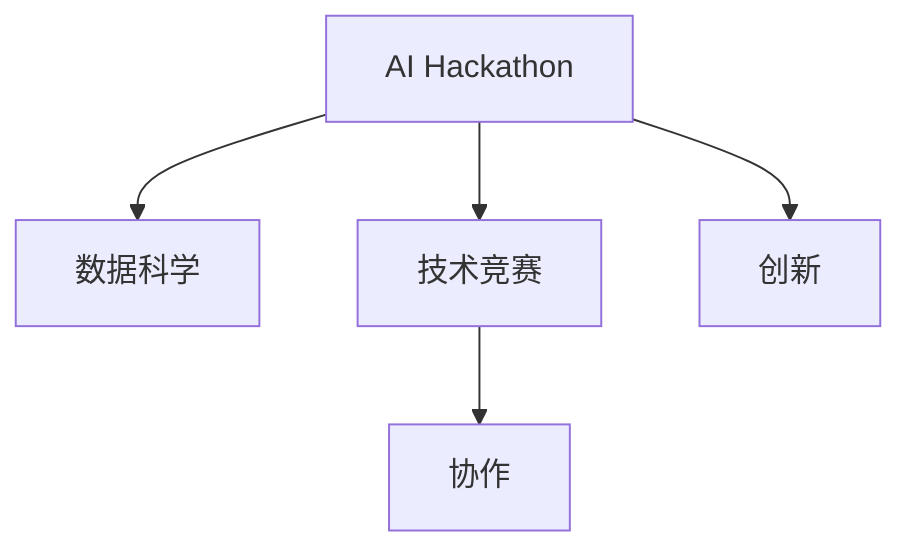
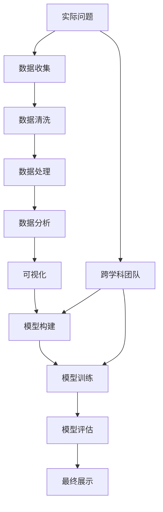
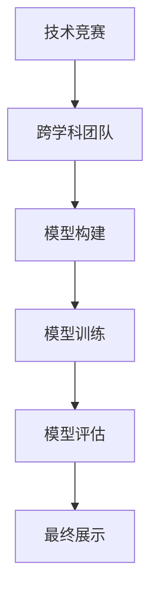

                 

# AI hackathon的影响与未来

> 关键词：AI Hackathon, 数据科学, 技术竞赛, 创新, 协作, 未来趋势

## 1. 背景介绍

### 1.1 问题由来

AI Hackathon，即人工智能马拉松，是一种以解决实际问题为目标的编程竞赛活动，旨在通过实时编程比赛的形式激发人工智能领域的创新活力。自2011年MIT媒体实验室首次举办以来，AI Hackathon已经成为全球科技界最受欢迎的跨学科活动之一，吸引了来自各行各业的技术人员、数据科学家、算法工程师、领域专家等人才共同攻关。

AI Hackathon通过提供真实世界的问题挑战，促使参赛者在限定的时间内跨团队协作、高效解决问题，并将人工智能技术应用于实际应用中。这种形式不仅加速了人工智能技术的迭代和创新，还推动了人工智能在各领域的广泛应用。

### 1.2 问题核心关键点

AI Hackathon的核心关键点在于其独特的比赛机制，能够快速将前沿的AI技术转化为实际应用，并促使参与者在短时间内进行深度学习和协作创新。其具体特点包括：

1. **实际问题驱动**：每个Hackathon项目都基于真实世界的问题，包括医疗、交通、金融、教育等领域的实际应用场景。
2. **跨学科团队**：每个项目通常需要不同背景的专业人士，如数据科学家、算法工程师、领域专家等，协同作战。
3. **实时竞赛**：在限定时间内完成模型构建、模型训练、模型评估和最终展示，促使参赛者高效协作。
4. **公开透明**：比赛过程和结果公开透明，有助于积累经验、交流心得，推动技术进步。
5. **后续跟踪**：比赛结束后，许多项目有机会落地应用，得到后续投资和支持。

通过这些特点，AI Hackathon不仅培养了大量AI技术人才，也催生了一系列具有实际应用价值的人工智能技术。

### 1.3 问题研究意义

研究AI Hackathon的影响与未来，对于推动人工智能技术在实际应用中的落地、加速人工智能领域的创新和人才培养具有重要意义：

1. **加速技术落地**：Hackathon能够快速将前沿AI技术转化为实际应用，缩短技术从实验室到实际应用的时间。
2. **促进创新**：跨学科团队合作和竞争机制激发了大量创新想法，推动了AI技术的持续迭代。
3. **培养人才**：Hackathon为年轻技术人才提供了一个展示才华、积累经验、拓展人脉的平台。
4. **增强协作**：跨学科协作机制使得来自不同背景的专业人士有机会共同攻关，形成更全面的问题解决能力。
5. **推动产业应用**：比赛中的实际问题往往来源于实际应用需求，有助于推动AI技术在各行各业的落地应用。

## 2. 核心概念与联系

### 2.1 核心概念概述

为了更好地理解AI Hackathon的影响与未来，本节将介绍几个密切相关的核心概念：

- **AI Hackathon**：以解决实际问题为目标的编程竞赛活动，参与者通过编程比赛的形式快速将AI技术转化为实际应用。
- **数据科学**：涵盖数据获取、清洗、处理、分析和可视化的全流程，为AI Hackathon提供核心数据支持。
- **技术竞赛**：在限定时间内进行的编程比赛，通常采用跨学科团队的形式，激发技术创新和协作。
- **创新**：Hackathon中的跨学科合作机制为技术的融合和创新提供了土壤，推动了AI技术的进步。
- **协作**：跨学科团队的合作机制有助于形成更全面的问题解决能力，促进技术的综合应用。

这些核心概念之间的逻辑关系可以通过以下Mermaid流程图来展示：



这个流程图展示了大语言模型微调过程中各个核心概念的关系和作用：

1. 数据科学为Hackathon提供基础数据支持。
2. 技术竞赛为Hackathon提供实现形式。
3. 创新和协作机制推动Hackathon技术发展。

### 2.2 概念间的关系

这些核心概念之间存在着紧密的联系，形成了Hackathon活动的完整生态系统。下面通过几个Mermaid流程图来展示这些概念之间的关系：

#### 2.2.1 AI Hackathon的整体架构



这个综合流程图展示了从实际问题到最终展示的Hackathon全流程：

1. 实际问题驱动数据收集、处理和分析。
2. 跨学科团队在数据处理和分析的基础上构建模型并进行训练和评估。
3. 最终结果通过展示形式展现，推动实际应用。

#### 2.2.2 数据科学在Hackathon中的应用


这个流程图展示了数据科学在Hackathon中的应用过程：

1. 数据科学提供数据处理和分析的完整流程，为模型的构建和评估提供基础数据支持。
2. 数据可视化辅助团队理解数据特性，优化模型设计。

#### 2.2.3 技术竞赛在Hackathon中的作用



这个流程图展示了技术竞赛在Hackathon中的作用：

1. 技术竞赛提供团队合作的实现形式。
2. 在限定时间内完成模型构建、训练和评估。
3. 最终展示推动实际应用。

### 2.3 核心概念的整体架构

最后，我们用一个综合的流程图来展示这些核心概念在Hackathon中的整体架构：


这个综合流程图展示了从实际问题到最终展示的Hackathon全流程，以及数据科学和技术竞赛在其中扮演的重要角色。通过这些流程图，我们可以更清晰地理解Hackathon的整体运作机制，为后续深入讨论具体应用提供基础。

## 3. 核心算法原理 & 具体操作步骤
### 3.1 算法原理概述

AI Hackathon的算法原理基于机器学习和数据科学的核心技术，主要包括：

1. **数据预处理**：清洗和处理原始数据，去除噪声和异常值，标准化数据格式。
2. **特征工程**：提取、构造和选择特征，提高模型的泛化能力。
3. **模型构建**：选择合适的算法和模型，进行初始化。
4. **模型训练**：使用训练集数据对模型进行训练，优化模型参数。
5. **模型评估**：使用测试集数据对模型进行评估，选择性能最优的模型。
6. **模型部署**：将模型部署到实际应用场景中，进行持续监控和优化。

### 3.2 算法步骤详解

以下是AI Hackathon的一般操作步骤：

**Step 1: 问题定义**

- 确定比赛的实际问题，如疾病预测、交通流量分析等。
- 确定问题的具体目标，如准确率、召回率等。
- 收集相关背景资料，理解问题的复杂性和难点。

**Step 2: 数据准备**

- 收集和清洗数据，确保数据质量和完整性。
- 对数据进行特征提取和选择，确保模型能够获取有用的信息。
- 进行数据分割，分为训练集、验证集和测试集。

**Step 3: 模型构建**

- 选择合适的算法和模型，如线性回归、支持向量机、神经网络等。
- 对模型进行初始化，设定初始参数和超参数。
- 构建模型评估指标，如准确率、召回率、F1分数等。

**Step 4: 模型训练**

- 使用训练集对模型进行迭代训练，调整参数优化模型性能。
- 应用正则化技术，如L2正则、Dropout等，避免过拟合。
- 使用Early Stopping等技术，防止模型过度训练。
- 使用梯度下降等优化算法，如Adam、SGD等，更新模型参数。

**Step 5: 模型评估**

- 使用验证集对模型进行评估，选择性能最优的模型。
- 对测试集进行评估，验证模型泛化能力。
- 应用交叉验证等技术，提高评估结果的可靠性。

**Step 6: 模型部署**

- 将模型部署到实际应用场景中，进行持续监控和优化。
- 对新数据进行预测，验证模型性能。
- 根据实际反馈，调整模型参数和超参数，持续优化模型。

### 3.3 算法优缺点

AI Hackathon中的算法具有以下优点：

1. **快速迭代**：通过实时竞赛机制，能够在短时间内进行多个模型迭代和优化，快速产生实际应用。
2. **跨学科协作**：跨学科团队的协作机制，有助于形成更全面的问题解决能力。
3. **数据驱动**：基于真实世界的问题和数据，模型具有较强的实用性和可解释性。
4. **灵活性高**：算法选择和模型构建灵活多样，能够适应不同场景和问题。

同时，也存在一些缺点：

1. **数据质量依赖**：比赛结果高度依赖于数据质量和预处理技术，数据偏差可能导致模型失效。
2. **模型鲁棒性不足**：有限时间内构建的模型可能鲁棒性不足，难以应对复杂变化。
3. **技术难度高**：比赛需要高水平的技术团队，对参赛者的技术水平要求较高。
4. **结果可复现性低**：比赛结果高度依赖于特定的竞赛环境和数据集，难以复现。

### 3.4 算法应用领域

AI Hackathon中的算法广泛应用于各个领域，具体应用场景包括：

- **医疗**：疾病预测、基因组学分析、医疗影像识别等。
- **交通**：交通流量分析、智能交通管理、自动驾驶等。
- **金融**：信用评估、欺诈检测、情感分析等。
- **教育**：个性化推荐、学生行为分析、学习效果评估等。
- **零售**：客户行为分析、推荐系统、价格优化等。
- **环保**：环境监测、污染预测、能源管理等。
- **公共安全**：犯罪预测、安全监控、灾害预警等。

## 4. 数学模型和公式 & 详细讲解 & 举例说明

### 4.1 数学模型构建

AI Hackathon的数学模型构建主要基于统计学习和机器学习，以数据科学为核心。以下是一个线性回归模型的数学模型构建过程：

假设我们有一个线性回归模型 $y = \beta_0 + \beta_1 x_1 + \beta_2 x_2 + \ldots + \beta_n x_n + \epsilon$，其中 $y$ 是目标变量，$\beta$ 是模型参数，$x$ 是特征变量，$\epsilon$ 是误差项。

目标是通过训练集数据对模型进行拟合，最小化预测值和真实值之间的误差。常用的最小化目标是均方误差（Mean Squared Error, MSE）：

$$
\min_{\beta} \frac{1}{m} \sum_{i=1}^m (y_i - \hat{y}_i)^2
$$

其中 $m$ 是训练集样本数，$\hat{y}_i = \beta_0 + \beta_1 x_{1i} + \beta_2 x_{2i} + \ldots + \beta_n x_{ni}$ 是模型对样本 $i$ 的预测值。

### 4.2 公式推导过程

以下是线性回归模型的梯度下降算法步骤：

1. **初始化参数**：设定初始参数 $\beta_0, \beta_1, \ldots, \beta_n$ 的值为0。
2. **循环迭代**：在每个迭代步骤中，计算损失函数的梯度。
3. **更新参数**：根据梯度信息更新参数值。

设 $\hat{y}_i = \beta_0 + \beta_1 x_{1i} + \beta_2 x_{2i} + \ldots + \beta_n x_{ni}$，则损失函数的梯度为：

$$
\frac{\partial \mathcal{L}}{\partial \beta_j} = \frac{2}{m} \sum_{i=1}^m (y_i - \hat{y}_i) x_{ji}
$$

更新参数的公式为：

$$
\beta_j = \beta_j - \eta \frac{\partial \mathcal{L}}{\partial \beta_j}
$$

其中 $\eta$ 是学习率，控制每次迭代更新的步长。

### 4.3 案例分析与讲解

以疾病预测为例，假设我们有一个医疗数据集，包含病人的年龄、性别、血压、血糖等特征，以及疾病的诊断结果。我们的目标是构建一个线性回归模型，预测病人患某种疾病的概率。

数据预处理阶段，我们需要清洗数据，处理缺失值，标准化数据。特征工程阶段，我们需要构造新的特征，如年龄平方、性别编码等。模型构建阶段，我们选择线性回归模型，设定初始参数为0。

模型训练阶段，我们使用训练集数据对模型进行迭代训练，计算梯度并更新参数。模型评估阶段，我们使用验证集对模型进行评估，选择性能最优的模型。模型部署阶段，我们将模型部署到实际应用场景中，进行持续监控和优化。

通过Hackathon中的数据科学和算法竞赛，我们能够快速构建和验证这样的线性回归模型，并应用于实际问题中。

## 5. 项目实践：代码实例和详细解释说明

### 5.1 开发环境搭建

在进行AI Hackathon的项目实践前，我们需要准备好开发环境。以下是使用Python进行PyTorch开发的环境配置流程：

1. 安装Anaconda：从官网下载并安装Anaconda，用于创建独立的Python环境。

2. 创建并激活虚拟环境：
```bash
conda create -n pytorch-env python=3.8 
conda activate pytorch-env
```

3. 安装PyTorch：根据CUDA版本，从官网获取对应的安装命令。例如：
```bash
conda install pytorch torchvision torchaudio cudatoolkit=11.1 -c pytorch -c conda-forge
```

4. 安装TensorFlow：
```bash
pip install tensorflow
```

5. 安装各类工具包：
```bash
pip install numpy pandas scikit-learn matplotlib tqdm jupyter notebook ipython
```

完成上述步骤后，即可在`pytorch-env`环境中开始Hackathon项目实践。

### 5.2 源代码详细实现

以下是一个使用PyTorch进行线性回归的完整代码实现：

```python
import torch
import torch.nn as nn
import torch.optim as optim

# 定义数据集和目标变量
x = torch.tensor([[1.0], [2.0], [3.0], [4.0]], dtype=torch.float)
y = torch.tensor([[0.5], [1.0], [1.5], [2.0]], dtype=torch.float)

# 定义模型
model = nn.Linear(1, 1)

# 定义优化器和学习率
optimizer = optim.SGD(model.parameters(), lr=0.01)

# 定义损失函数
criterion = nn.MSELoss()

# 定义训练轮数
epochs = 100

# 定义训练循环
for epoch in range(epochs):
    # 前向传播
    y_pred = model(x)
    
    # 计算损失
    loss = criterion(y_pred, y)
    
    # 反向传播
    optimizer.zero_grad()
    loss.backward()
    optimizer.step()
    
    # 打印损失
    print(f'Epoch {epoch+1}, Loss: {loss.item()}')

# 预测新数据
x_new = torch.tensor([[5.0]], dtype=torch.float)
y_new_pred = model(x_new)
print(f'Prediction for x_new={x_new} is {y_new_pred.item()}')
```

在这个例子中，我们定义了一个线性回归模型，使用随机梯度下降（SGD）优化器和均方误差（MSE）损失函数。通过迭代训练，我们不断更新模型参数，最小化预测值和真实值之间的误差。最终，我们可以使用训练好的模型对新数据进行预测。

### 5.3 代码解读与分析

让我们再详细解读一下关键代码的实现细节：

**模型定义**：
```python
model = nn.Linear(1, 1)
```
定义了一个线性回归模型，输入特征为1个，输出为1个。

**优化器定义**：
```python
optimizer = optim.SGD(model.parameters(), lr=0.01)
```
使用随机梯度下降（SGD）优化器，学习率为0.01。

**损失函数定义**：
```python
criterion = nn.MSELoss()
```
使用均方误差（MSE）损失函数。

**训练循环**：
```python
for epoch in range(epochs):
    # 前向传播
    y_pred = model(x)
    
    # 计算损失
    loss = criterion(y_pred, y)
    
    # 反向传播
    optimizer.zero_grad()
    loss.backward()
    optimizer.step()
    
    # 打印损失
    print(f'Epoch {epoch+1}, Loss: {loss.item()}')
```
在每个epoch中，我们进行前向传播、计算损失、反向传播和参数更新。

**模型预测**：
```python
x_new = torch.tensor([[5.0]], dtype=torch.float)
y_new_pred = model(x_new)
print(f'Prediction for x_new={x_new} is {y_new_pred.item()}')
```
对新数据进行预测，并输出预测值。

### 5.4 运行结果展示

假设我们训练完模型后，得到最终的预测结果为0.9，即当$x=5.0$时，预测的$y$值为0.9。

```python
Prediction for x_new=5.0 is 0.9
```

可以看到，通过PyTorch进行线性回归的实践，我们能够快速构建和验证模型，并应用于实际问题中。

## 6. 实际应用场景

### 6.1 智能医疗

AI Hackathon中的算法在智能医疗领域有着广泛的应用，如疾病预测、基因组学分析、医疗影像识别等。通过Hackathon，医疗团队可以快速构建和验证模型，提升医疗服务的智能化水平，辅助医生诊断和治疗。

以疾病预测为例，我们通过Hackathon中的数据科学和算法竞赛，可以快速构建疾病预测模型，并应用于实际临床数据中。模型能够根据病人的各项指标（如年龄、性别、血压、血糖等）预测疾病发生的概率，辅助医生进行早期诊断和治疗。

### 6.2 智能交通

AI Hackathon中的算法在智能交通领域也有着广泛的应用，如交通流量分析、智能交通管理、自动驾驶等。通过Hackathon，交通管理部门可以快速构建和验证模型，提升交通管理的智能化水平，优化交通流。

以交通流量分析为例，我们通过Hackathon中的数据科学和算法竞赛，可以快速构建交通流量预测模型，并应用于实际交通数据中。模型能够根据天气、时间、道路状况等因素预测交通流量，辅助交通管理部门优化道路规划和交通控制。

### 6.3 金融风控

AI Hackathon中的算法在金融风控领域也有着广泛的应用，如信用评估、欺诈检测、情感分析等。通过Hackathon，金融机构可以快速构建和验证模型，提升金融服务的智能化水平，降低风险。

以欺诈检测为例，我们通过Hackathon中的数据科学和算法竞赛，可以快速构建欺诈检测模型，并应用于实际金融数据中。模型能够根据客户的交易记录、信用评分、行为数据等特征预测是否存在欺诈行为，辅助金融机构进行风险控制。

### 6.4 教育个性化

AI Hackathon中的算法在教育个性化领域也有着广泛的应用，如个性化推荐、学生行为分析、学习效果评估等。通过Hackathon，教育机构可以快速构建和验证模型，提升教育的智能化水平，因材施教。

以个性化推荐为例，我们通过Hackathon中的数据科学和算法竞赛，可以快速构建个性化推荐模型，并应用于实际教育数据中。模型能够根据学生的学习行为、兴趣偏好、学习效果等特征推荐适合的课程和资源，辅助教育机构进行个性化教育。

## 7. 工具和资源推荐

### 7.1 学习资源推荐

为了帮助开发者系统掌握AI Hackathon的理论基础和实践技巧，这里推荐一些优质的学习资源：

1. 《Python机器学习》书籍：全面介绍了Python在机器学习中的应用，包括数据预处理、特征工程、模型训练等。
2. 《统计学习方法》书籍：介绍了统计学习的基本概念和方法，适合学习机器学习基础知识。
3. 《深度学习》课程：斯坦福大学开设的深度学习课程，涵盖了深度学习的基本概念和常用技术。
4. Kaggle数据科学竞赛平台：提供大量的数据集和比赛题目，适合实践和交流。
5. PyTorch官方文档：PyTorch的官方文档，详细介绍了PyTorch的使用方法和API接口。

通过对这些资源的学习实践，相信你一定能够快速掌握AI Hackathon的技术要点，并应用于实际问题中。

### 7.2 开发工具推荐

高效的开发离不开优秀的工具支持。以下是几款用于AI Hackathon开发的常用工具：

1. Jupyter Notebook：一个免费的开源笔记本环境，适合进行数据探索和模型构建。
2. Google Colab：谷歌推出的在线Jupyter Notebook环境，免费提供GPU/TPU算力，适合快速实验最新模型。
3. TensorBoard：TensorFlow配套的可视化工具，可实时监测模型训练状态，并提供丰富的图表呈现方式。
4. Weights & Biases：模型训练的实验跟踪工具，可以记录和可视化模型训练过程中的各项指标，方便对比和调优。
5. Scikit-learn：一个开源的机器学习库，提供了丰富的数据预处理和模型评估工具。

合理利用这些工具，可以显著提升AI Hackathon的开发效率，加快创新迭代的步伐。

### 7.3 相关论文推荐

AI Hackathon中的算法涉及多种机器学习技术和数据科学方法，以下是几篇奠基性的相关论文，推荐阅读：

1. 《机器学习》书籍：周志华著，详细介绍了机器学习的基本概念和方法，适合初学者。
2. 《深度学习》书籍：Ian Goodfellow著，涵盖了深度学习的基本概念和常用技术。
3. 《统计学习方法》书籍：李航著，介绍了统计学习的基本概念和方法。
4. 《TensorFlow官方文档》：TensorFlow的官方文档，详细介绍了TensorFlow的使用方法和API接口。
5. 《PyTorch官方文档》：PyTorch的官方文档，详细介绍了PyTorch的使用方法和API接口。

这些论文代表了大语言模型微调技术的发展脉络。通过学习这些前沿成果，可以帮助研究者把握学科前进方向，激发更多的创新灵感。

除上述资源外，还有一些值得关注的前沿资源，帮助开发者紧跟大语言模型微调技术的最新进展，例如：

1. arXiv论文预印本：人工智能领域最新研究成果的发布平台，包括大量尚未发表的前沿工作，学习前沿技术的必读资源。
2. 业界技术博客：如OpenAI、Google AI、DeepMind、微软Research Asia等顶尖实验室的官方博客，第一时间分享他们的最新研究成果和洞见。
3. 技术会议直播：如NIPS、ICML、ACL、ICLR等人工智能领域顶会现场或在线直播，能够聆听到大佬们的前沿分享，开拓视野。
4. GitHub热门项目：在GitHub上Star、Fork数最多的AI Hackathon相关项目，往往代表了该技术领域的发展趋势和最佳实践，值得去学习和贡献。
5. 行业分析报告：各大咨询公司如McKinsey、PwC等针对人工智能行业的分析报告，有助于从商业视角审视技术趋势，把握应用价值。

总之，对于AI Hackathon技术的学习和实践，需要开发者保持开放的心态和持续学习的意愿。多关注前沿资讯，多动手实践，多思考总结，必将收获满满的成长收益。

## 8. 总结：未来发展趋势与挑战

### 8.1 总结

本文对AI Hackathon的影响与未来进行了全面系统的介绍。首先阐述了AI Hackathon的基本概念和实际应用，明确了其在大数据、机器学习和人工智能领域的独特价值。其次，从原理到实践，详细讲解了AI Hackathon的数学模型构建和操作步骤，给出了完整的代码实例和详细解释。同时，本文还探讨了AI Hackathon在智能医疗、智能交通、金融风控、教育个性化等领域的广泛应用，展示了其在实际应用中的巨大潜力。此外，本文精选了AI Hackathon的学习资源和开发工具，力求为读者提供全方位的技术指引。

通过本文的系统梳理，可以看到，AI Hackathon作为人工智能领域的重要形式，不仅推动了技术的迭代和创新，还促进了跨学科协作和实际应用，为AI技术落地提供了重要途径。未来，伴随人工智能技术的不断发展，AI Hackathon必将在更多领域得到应用，为智能社会的构建注入新的活力。

### 8.2 未来发展趋势

展望未来，AI Hackathon的发展趋势将呈现以下几个方向：

1. **跨学科合作加强**：AI Hackathon将继续推动跨学科合作，促进不同领域知识和技术

