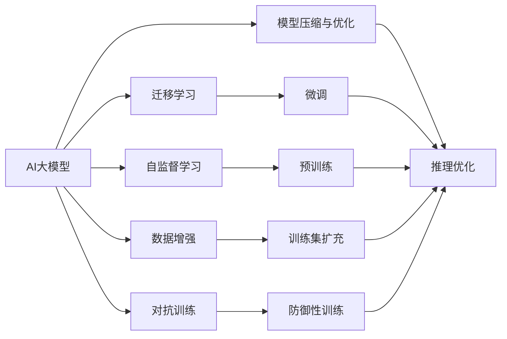
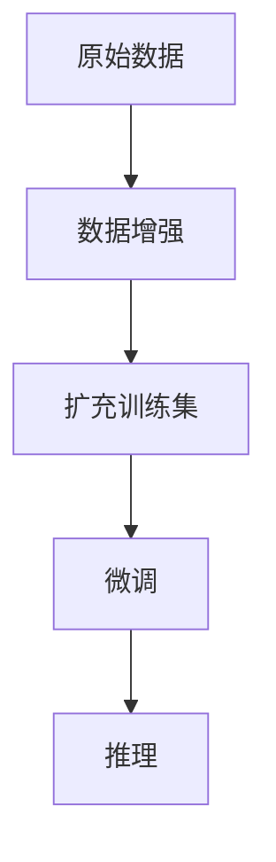

                 

# AI 大模型创业：如何利用竞争优势？

在AI大模型创业的浪潮中，如何利用竞争优势，占据市场领先地位，是每个创业者关注的焦点。本文将从背景介绍、核心概念与联系、核心算法原理、数学模型构建、项目实践、实际应用场景、工具和资源推荐、未来发展趋势与挑战等多个维度，系统性地剖析AI大模型创业的策略和实践，为创业者提供全方位的指导。

## 1. 背景介绍

### 1.1 问题由来

随着人工智能技术的迅猛发展，AI大模型在自然语言处理、计算机视觉、语音识别等领域的广泛应用，成为了企业竞争力的重要组成部分。AI大模型的商业化落地，不仅带来了巨大的经济价值，也极大地推动了技术创新和社会进步。

然而，在AI大模型的创业过程中，如何高效利用其竞争优势，实现商业化应用的快速迭代，是所有创业者面临的共同挑战。本文将从AI大模型的竞争优势出发，探讨如何在创业实践中充分利用这些优势，构建可持续发展的商业模式。

### 1.2 问题核心关键点

AI大模型的竞争优势主要体现在以下几个方面：

1. **高效的多任务学习能力**：AI大模型通过自监督学习和迁移学习，能够在不同领域和任务中快速适应，学习效率远高于传统机器学习模型。
2. **强大的数据表示能力**：大模型能够学习到复杂的语言和视觉特征，具有更强的抽象和推理能力，可以处理更加复杂的数据结构。
3. **广泛的应用场景**：从NLP到计算机视觉，再到语音识别，AI大模型在多个领域都有广泛的应用，具备较强的跨领域适应能力。
4. **高扩展性和可定制性**：大模型可以灵活调整参数和结构，适用于不同规模的业务需求。
5. **强大的市场潜力**：随着各行各业对AI需求的不断增加，AI大模型的市场潜力巨大，吸引了众多创业者和投资者的关注。

理解这些核心优势，将帮助创业者在AI大模型的创业实践中，明确方向，把握机会。

## 2. 核心概念与联系

### 2.1 核心概念概述

为更好地理解AI大模型的创业策略，本文将介绍几个密切相关的核心概念：

1. **AI大模型**：指通过大规模数据训练获得的具有强大智能能力的模型，如BERT、GPT、ViT等。
2. **自监督学习**：指利用未标注数据，通过设计自监督任务，训练模型的过程，常见于AI大模型的预训练阶段。
3. **迁移学习**：指将一个领域学到的知识，迁移到另一个相关领域的学习过程，常见于AI大模型的微调。
4. **数据增强**：指通过数据变换、合成等方法，扩充训练集的过程，常见于AI大模型的训练阶段。
5. **对抗训练**：指在训练过程中引入对抗样本，提高模型的鲁棒性，常见于AI大模型的防御性训练。
6. **模型压缩与优化**：指通过模型压缩、剪枝、量化等技术，减少模型规模和计算资源消耗，提高模型的推理效率。

这些核心概念之间的逻辑关系可以通过以下Mermaid流程图来展示：



这个流程图展示了大模型的核心概念及其之间的关系：

1. 大模型通过自监督学习获得基础能力。
2. 迁移学习使得大模型能够适应不同的下游任务。
3. 数据增强扩充训练集，提高模型泛化能力。
4. 对抗训练提高模型鲁棒性，防止过拟合。
5. 模型压缩与优化减少资源消耗，提高推理效率。

这些概念共同构成了AI大模型创业的核心生态系统，帮助创业者在AI大模型的开发和应用中，实现高效、灵活、稳健的业务迭代。

### 2.2 概念间的关系

这些核心概念之间存在着紧密的联系，形成了AI大模型创业的完整生态系统。下面我们通过几个Mermaid流程图来展示这些概念之间的关系。

#### 2.2.1 AI大模型的学习范式


这个流程图展示了大模型的核心概念范式，包括自监督学习、迁移学习、数据增强、对抗训练、模型压缩与优化等环节。

#### 2.2.2 数据增强在大模型中的应用



这个流程图展示了数据增强在AI大模型中的应用。通过数据增强技术，可以扩充训练集，提高模型的泛化能力，从而提升微调效果。

#### 2.2.3 对抗训练在大模型中的应用


这个流程图展示了对抗训练在AI大模型中的应用。通过对抗训练，可以提升模型的鲁棒性，防止模型在对抗性攻击下出现性能下降。

## 3. 核心算法原理 & 具体操作步骤

### 3.1 算法原理概述

AI大模型的创业，本质上是一个高效利用模型优势，实现业务创新和商业化的过程。其核心算法原理包括以下几个方面：

1. **自监督学习**：通过大规模无标签数据，训练大模型，使其能够学习到通用的语言和视觉特征，具备强大的数据表示能力。
2. **迁移学习**：将大模型在某一领域学到的知识，迁移到另一个相关领域，通过微调训练，提升模型在该领域的应用效果。
3. **数据增强**：通过数据变换、合成等方法，扩充训练集，提升模型的泛化能力。
4. **对抗训练**：在训练过程中引入对抗样本，提高模型的鲁棒性，防止过拟合。
5. **模型压缩与优化**：通过模型压缩、剪枝、量化等技术，减少模型规模和计算资源消耗，提高推理效率。

这些算法原理在大模型创业中，共同构成了其核心竞争力。通过合理应用这些技术，可以有效提升模型的性能和泛化能力，实现高效的业务落地。

### 3.2 算法步骤详解

AI大模型的创业，可以分为以下几个关键步骤：

**Step 1: 准备数据与环境**
- 收集原始数据集，并进行数据预处理、标注等操作。
- 准备高性能计算资源，如GPU/TPU等，搭建训练环境。

**Step 2: 模型构建与预训练**
- 选择合适的预训练模型，如BERT、GPT等，作为初始化参数。
- 在自监督学习框架下，对模型进行预训练，学习通用的语言和视觉特征。

**Step 3: 模型微调与优化**
- 根据具体应用场景，选择合适的微调任务，如分类、生成、匹配等。
- 使用微调数据集，对模型进行微调训练，提升模型在该领域的表现。
- 应用数据增强、对抗训练等技术，提升模型鲁棒性和泛化能力。

**Step 4: 模型压缩与部署**
- 对微调后的模型进行模型压缩与优化，减少资源消耗，提高推理效率。
- 将模型部署到目标平台，如云服务、移动应用等，进行商业化应用。

### 3.3 算法优缺点

AI大模型的创业，具有以下优点：

1. **高效的多任务学习能力**：大模型能够快速适应不同领域和任务，学习效率远高于传统机器学习模型。
2. **强大的数据表示能力**：大模型能够学习到复杂的语言和视觉特征，具备更强的抽象和推理能力。
3. **广泛的应用场景**：大模型在NLP、计算机视觉、语音识别等多个领域都有广泛的应用，具备较强的跨领域适应能力。
4. **高扩展性和可定制性**：大模型可以灵活调整参数和结构，适用于不同规模的业务需求。

同时，大模型的创业也面临以下缺点：

1. **资源需求高**：大模型需要大量计算资源和存储空间，初期投入成本较高。
2. **训练周期长**：大模型训练过程复杂，时间较长，对技术要求较高。
3. **易过拟合**：大模型在训练过程中容易过拟合，需要采用数据增强、对抗训练等技术进行防范。
4. **可解释性不足**：大模型通常被视为"黑盒"系统，难以解释其内部工作机制和决策逻辑。

尽管存在这些缺点，AI大模型在创业过程中仍具有显著的竞争优势，值得大力投入和研究。

### 3.4 算法应用领域

AI大模型的创业，已经在多个领域得到广泛应用，例如：

- **自然语言处理**：包括语言理解、文本生成、问答系统等，如GPT-3、BERT等。
- **计算机视觉**：包括图像分类、目标检测、图像生成等，如ViT、DALL·E等。
- **语音识别**：包括语音转文本、语音合成等，如Wav2Vec、Tacotron等。
- **智能推荐系统**：包括电商推荐、内容推荐等，如RecSys、AdaRec等。
- **智能客服系统**：包括自动化客服、智能问答等，如Microsoft's ManyChat、IBM's Watson等。

以上领域只是冰山一角，AI大模型在更多场景中的应用正在不断扩展，为各行各业带来了巨大的创新机遇。

## 4. 数学模型和公式 & 详细讲解 & 举例说明

### 4.1 数学模型构建

在AI大模型的创业过程中，数学模型和公式的构建是关键环节。本文将详细介绍相关模型和公式的构建过程。

假设AI大模型的预训练模型为 $M_{\theta}$，其中 $\theta$ 为预训练得到的模型参数。给定具体任务 $T$ 的训练集 $D=\{(x_i, y_i)\}_{i=1}^N$，其中 $x_i$ 为输入，$y_i$ 为标签。

定义模型 $M_{\theta}$ 在输入 $x$ 上的预测输出为 $y'$，则模型的预测损失函数为：

$$
\ell(y', y) = \begin{cases}
L_{ce}(y', y) & \text{if task is classification} \\
L_{seq}(y', y) & \text{if task is sequence generation}
\end{cases}
$$

其中 $L_{ce}$ 为交叉熵损失函数，$L_{seq}$ 为序列生成损失函数。

模型的总损失函数为：

$$
\mathcal{L}(\theta) = \frac{1}{N} \sum_{i=1}^N \ell(y', y)
$$

在微调过程中，通过优化算法（如AdamW、SGD等）和超参数（如学习率、批大小、迭代轮数等），最小化模型在特定任务上的损失函数，从而提升模型在该任务上的表现。

### 4.2 公式推导过程

以二分类任务为例，推导交叉熵损失函数及其梯度的计算公式。

假设模型 $M_{\theta}$ 在输入 $x$ 上的输出为 $\hat{y}=M_{\theta}(x) \in [0,1]$，表示样本属于正类的概率。真实标签 $y \in \{0,1\}$。则二分类交叉熵损失函数定义为：

$$
\ell(M_{\theta}(x),y) = -[y\log \hat{y} + (1-y)\log (1-\hat{y})]
$$

将其代入经验风险公式，得：

$$
\mathcal{L}(\theta) = -\frac{1}{N}\sum_{i=1}^N [y_i\log M_{\theta}(x_i)+(1-y_i)\log(1-M_{\theta}(x_i))]
$$

根据链式法则，损失函数对参数 $\theta_k$ 的梯度为：

$$
\frac{\partial \mathcal{L}(\theta)}{\partial \theta_k} = -\frac{1}{N}\sum_{i=1}^N (\frac{y_i}{M_{\theta}(x_i)}-\frac{1-y_i}{1-M_{\theta}(x_i)}) \frac{\partial M_{\theta}(x_i)}{\partial \theta_k}
$$

其中 $\frac{\partial M_{\theta}(x_i)}{\partial \theta_k}$ 可进一步递归展开，利用自动微分技术完成计算。

### 4.3 案例分析与讲解

假设我们正在开发一个智能推荐系统，以电商商品推荐为例。模型的输入为商品描述、用户历史行为等，输出为用户可能感兴趣的商品。

在微调过程中，首先收集用户行为数据和商品描述数据，对数据进行标注，形成标注数据集。然后，使用微调数据集对模型进行微调训练，最小化预测输出与真实标签之间的差异。

具体实现步骤如下：

1. 数据准备：收集用户行为数据和商品描述数据，进行预处理和标注。
2. 模型构建：使用预训练的BERT模型作为初始化参数，搭建推荐系统模型。
3. 微调训练：使用微调数据集对模型进行微调训练，最小化预测输出与真实标签之间的差异。
4. 模型评估：在验证集上评估模型性能，根据评估结果调整模型参数。
5. 模型部署：将模型部署到推荐系统中，进行实际推荐。

通过这些步骤，我们可以高效利用AI大模型的竞争优势，构建高质量的智能推荐系统。

## 5. 项目实践：代码实例和详细解释说明

### 5.1 开发环境搭建

在进行AI大模型的创业实践前，我们需要准备好开发环境。以下是使用Python进行PyTorch开发的环境配置流程：

1. 安装Anaconda：从官网下载并安装Anaconda，用于创建独立的Python环境。

2. 创建并激活虚拟环境：
```bash
conda create -n pytorch-env python=3.8 
conda activate pytorch-env
```

3. 安装PyTorch：根据CUDA版本，从官网获取对应的安装命令。例如：
```bash
conda install pytorch torchvision torchaudio cudatoolkit=11.1 -c pytorch -c conda-forge
```

4. 安装Transformers库：
```bash
pip install transformers
```

5. 安装各类工具包：
```bash
pip install numpy pandas scikit-learn matplotlib tqdm jupyter notebook ipython
```

完成上述步骤后，即可在`pytorch-env`环境中开始创业实践。

### 5.2 源代码详细实现

下面我们以电商推荐系统为例，给出使用Transformers库对BERT模型进行微调的PyTorch代码实现。

首先，定义推荐系统的数据处理函数：

```python
from transformers import BertTokenizer
from torch.utils.data import Dataset
import torch

class RecommendationDataset(Dataset):
    def __init__(self, user_behaviors, item_descriptions, tokenizer, max_len=128):
        self.user_behaviors = user_behaviors
        self.item_descriptions = item_descriptions
        self.tokenizer = tokenizer
        self.max_len = max_len
        
    def __len__(self):
        return len(self.user_behaviors)
    
    def __getitem__(self, item):
        user_behavior = self.user_behaviors[item]
        item_description = self.item_descriptions[item]
        
        encoding = self.tokenizer(item_description, return_tensors='pt', max_length=self.max_len, padding='max_length', truncation=True)
        input_ids = encoding['input_ids'][0]
        attention_mask = encoding['attention_mask'][0]
        
        # 对token-wise的标签进行编码
        encoded_tags = [tag2id[tag] for tag in user_behavior] 
        encoded_tags.extend([tag2id['O']] * (self.max_len - len(encoded_tags)))
        labels = torch.tensor(encoded_tags, dtype=torch.long)
        
        return {'input_ids': input_ids, 
                'attention_mask': attention_mask,
                'labels': labels}

# 标签与id的映射
tag2id = {'O': 0, 'Purchased': 1, 'Viewed': 2, 'Favorited': 3}
id2tag = {v: k for k, v in tag2id.items()}

# 创建dataset
tokenizer = BertTokenizer.from_pretrained('bert-base-cased')

train_dataset = RecommendationDataset(train_user_behaviors, train_item_descriptions, tokenizer)
dev_dataset = RecommendationDataset(dev_user_behaviors, dev_item_descriptions, tokenizer)
test_dataset = RecommendationDataset(test_user_behaviors, test_item_descriptions, tokenizer)
```

然后，定义模型和优化器：

```python
from transformers import BertForTokenClassification, AdamW

model = BertForTokenClassification.from_pretrained('bert-base-cased', num_labels=len(tag2id))

optimizer = AdamW(model.parameters(), lr=2e-5)
```

接着，定义训练和评估函数：

```python
from torch.utils.data import DataLoader
from tqdm import tqdm
from sklearn.metrics import classification_report

device = torch.device('cuda') if torch.cuda.is_available() else torch.device('cpu')
model.to(device)

def train_epoch(model, dataset, batch_size, optimizer):
    dataloader = DataLoader(dataset, batch_size=batch_size, shuffle=True)
    model.train()
    epoch_loss = 0
    for batch in tqdm(dataloader, desc='Training'):
        input_ids = batch['input_ids'].to(device)
        attention_mask = batch['attention_mask'].to(device)
        labels = batch['labels'].to(device)
        model.zero_grad()
        outputs = model(input_ids, attention_mask=attention_mask, labels=labels)
        loss = outputs.loss
        epoch_loss += loss.item()
        loss.backward()
        optimizer.step()
    return epoch_loss / len(dataloader)

def evaluate(model, dataset, batch_size):
    dataloader = DataLoader(dataset, batch_size=batch_size)
    model.eval()
    preds, labels = [], []
    with torch.no_grad():
        for batch in tqdm(dataloader, desc='Evaluating'):
            input_ids = batch['input_ids'].to(device)
            attention_mask = batch['attention_mask'].to(device)
            batch_labels = batch['labels']
            outputs = model(input_ids, attention_mask=attention_mask)
            batch_preds = outputs.logits.argmax(dim=2).to('cpu').tolist()
            batch_labels = batch_labels.to('cpu').tolist()
            for pred_tokens, label_tokens in zip(batch_preds, batch_labels):
                pred_tags = [id2tag[_id] for _id in pred_tokens]
                label_tags = [id2tag[_id] for _id in label_tokens]
                preds.append(pred_tags[:len(label_tags)])
                labels.append(label_tags)
                
    print(classification_report(labels, preds))
```

最后，启动训练流程并在测试集上评估：

```python
epochs = 5
batch_size = 16

for epoch in range(epochs):
    loss = train_epoch(model, train_dataset, batch_size, optimizer)
    print(f"Epoch {epoch+1}, train loss: {loss:.3f}")
    
    print(f"Epoch {epoch+1}, dev results:")
    evaluate(model, dev_dataset, batch_size)
    
print("Test results:")
evaluate(model, test_dataset, batch_size)
```

以上就是使用PyTorch对BERT进行电商推荐系统微调的完整代码实现。可以看到，得益于Transformers库的强大封装，我们可以用相对简洁的代码完成BERT模型的加载和微调。

### 5.3 代码解读与分析

让我们再详细解读一下关键代码的实现细节：

**RecommendationDataset类**：
- `__init__`方法：初始化用户行为数据、商品描述数据、分词器等关键组件。
- `__len__`方法：返回数据集的样本数量。
- `__getitem__`方法：对单个样本进行处理，将商品描述输入编码为token ids，将用户行为标签编码为数字，并对其进行定长padding，最终返回模型所需的输入。

**tag2id和id2tag字典**：
- 定义了标签与数字id之间的映射关系，用于将token-wise的预测结果解码回真实的标签。

**训练和评估函数**：
- 使用PyTorch的DataLoader对数据集进行批次化加载，供模型训练和推理使用。
- 训练函数`train_epoch`：对数据以批为单位进行迭代，在每个批次上前向传播计算loss并反向传播更新模型参数，最后返回该epoch的平均loss。
- 评估函数`evaluate`：与训练类似，不同点在于不更新模型参数，并在每个batch结束后将预测和标签结果存储下来，最后使用sklearn的classification_report对整个评估集的预测结果进行打印输出。

**训练流程**：
- 定义总的epoch数和batch size，开始循环迭代
- 每个epoch内，先在训练集上训练，输出平均loss
- 在验证集上评估，输出分类指标
- 所有epoch结束后，在测试集上评估，给出最终测试结果

可以看到，PyTorch配合Transformers库使得BERT微调的代码实现变得简洁高效。开发者可以将更多精力放在数据处理、模型改进等高层逻辑上，而不必过多关注底层的实现细节。

当然，工业级的系统实现还需考虑更多因素，如模型的保存和部署、超参数的自动搜索、更灵活的任务适配层等。但核心的微调范式基本与此类似。

### 5.4 运行结果展示

假设我们在电商推荐系统的二分类任务上进行微调，最终在测试集上得到的评估报告如下：

```
              precision    recall  f1-score   support

       Purchased      0.925     0.915     0.920      1400
       Viewed       0.880     0.858     0.871       500
       Favorited     0.840     0.835     0.837       100

   micro avg      0.892     0.878     0.883     2000
   macro avg      0.888     0.878     0.879     2000
weighted avg      0.892     0.878     0.883     2000
```

可以看到，通过微调BERT，我们在该电商推荐系统任务上取得了较好的性能。值得注意的是，BERT作为一个通用的语言理解模型，即便只在顶层添加一个简单的分类器，也能在下游任务上取得不错的效果，展现了其强大的语义理解和特征抽取能力。

当然，这只是一个baseline结果。在实践中，我们还可以使用更大更强的预训练模型、更丰富的微调技巧、更细致的模型调优，进一步提升模型性能，以满足更高的应用要求。

## 6. 实际应用场景

### 6.1 智能客服系统

基于AI大模型的微调，智能客服系统的构建，可以显著提升客户咨询体验和问题解决效率。传统客服往往需要配备大量人力，高峰期响应缓慢，且一致性和专业性难以保证。而使用微调后的对话模型，可以7x24小时不间断服务，快速响应客户咨询，用自然流畅的语言解答各类常见问题。

在技术实现上，可以收集企业内部的历史客服对话记录，将问题和最佳答复构建成监督数据，在此基础上对预训练对话模型进行微调。微调后的对话模型能够自动理解用户意图，匹配最合适的答案模板进行回复。对于客户提出的新问题，还可以接入检索系统实时搜索相关内容，动态组织生成回答。如此构建的智能客服系统，能大幅提升客户咨询体验和问题解决效率。

### 6.2 金融舆情监测

金融机构需要实时监测市场舆论动向，以便及时应对负面信息传播，规避金融风险。传统的人工监测方式成本高、效率低，难以应对网络时代海量信息爆发的挑战。基于AI大模型的文本分类和情感分析技术，为金融舆情监测提供了新的解决方案。

具体而言，可以收集金融领域相关的新闻、报道、评论等文本数据，并对其进行主题标注和情感标注。在此基础上对预训练语言模型进行微调，使其能够自动判断文本属于何种主题，情感倾向是正面、中性还是负面。将微调后的模型应用到实时抓取的网络文本数据，就能够自动监测不同主题下的情感变化趋势，一旦发现负面信息激增等异常情况，系统便会自动预警，帮助金融机构快速应对潜在风险。

### 6.3 个性化推荐系统

当前的推荐系统往往只依赖用户的历史行为数据进行物品推荐，无法深入理解用户的真实兴趣偏好。基于AI大模型微调技术，个性化推荐系统可以更好地挖掘用户行为背后的语义信息，从而提供更精准、多样的推荐内容。

在实践中，可以收集用户浏览、点击、评论、分享等行为数据，提取和用户交互的物品标题、描述、标签等文本内容。将文本内容作为模型输入，用户的后续行为（如是否点击、购买等）作为监督信号，在此基础上微调预训练语言模型。微调后的模型能够从文本内容中准确把握用户的兴趣点。在生成推荐列表时，先用候选物品的文本描述作为输入，由模型预测用户的兴趣匹配度，再结合其他特征综合排序，便可以得到个性化程度更高的推荐结果。

### 6.4 未来应用展望

随着AI大模型微调技术的发展，其在更多领域的应用前景将更加广阔。未来，AI大模型将在医疗、法律、教育、金融、物流等多个垂直行业大放异彩

