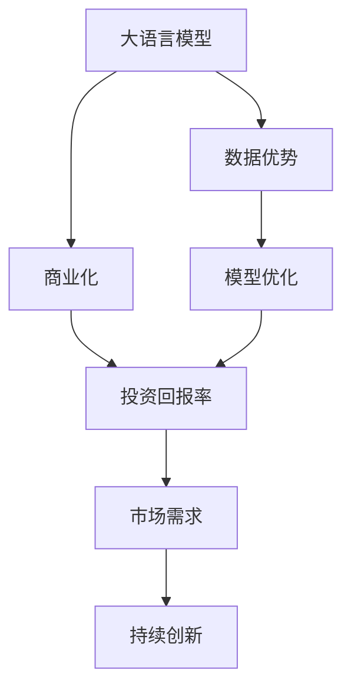

                 

# AI 大模型创业：如何利用经济优势？

> 关键词：大语言模型,创业,商业化,经济优势,投资回报,数据优势,模型优化,知识产权保护

## 1. 背景介绍

### 1.1 问题由来

人工智能（AI）大模型的蓬勃发展不仅推动了技术的进步，还催生了一个新的经济领域：AI大模型创业。从谷歌的BERT、OpenAI的GPT-3到国内的天魁、商汤等，众多公司正在基于大模型技术探索商业机会。然而，大模型创业的门槛远高于传统软件或互联网创业，这不仅因为技术复杂度高，更因为背后需要巨额的资金投入。创业初期，如何在有限的经济资源下发挥大模型的经济优势，是所有大模型创业公司需要解决的首要问题。

### 1.2 问题核心关键点

这个问题的解决主要围绕以下几个关键点展开：
- 如何通过高效的模型优化和数据利用，最大化经济优势？
- 如何通过知识产权保护和商业合作，构建稳定的盈利模式？
- 如何在有限的资本投入下，通过项目精细化管理，实现快速的投资回报？
- 如何通过产品创新和市场定位，实现业务的快速增长和市场扩展？

### 1.3 问题研究意义

对于大模型创业公司而言，解决上述问题不仅有助于降低经济风险，更能够为长期发展奠定基础。合理的经济优势利用，不仅可以降低初期资金压力，还能在快速迭代和市场竞争中保持优势，实现快速增长。

## 2. 核心概念与联系

### 2.1 核心概念概述

为更好地理解大模型创业中如何利用经济优势，本节将介绍几个密切相关的核心概念：

- **大语言模型(Large Language Model, LLM)**：指通过大规模无标签文本数据进行预训练的通用语言模型，具备强大的语言理解和生成能力。

- **商业化(Commercialization)**：指将大模型技术转化为可商业应用的过程，包括模型部署、API服务、市场推广等环节。

- **数据优势(Data Advantage)**：指在大模型创业过程中，通过获取大量高质量标注数据，提升模型性能和应用效果。

- **模型优化(Model Optimization)**：指通过微调、参数高效微调等技术，提升模型在特定任务上的表现，降低计算成本。

- **知识产权(IP Rights)**：指对大模型技术的专利、版权等知识产权的保护和运用，构建商业壁垒。

- **投资回报率(ROI)**：指通过合理的商业模式和资本运作，实现快速投资回报的过程。

- **市场需求(Demand)**：指根据市场调研和用户反馈，识别和满足市场需求，构建产品竞争力。

这些核心概念之间存在着紧密的联系，形成了大模型创业的经济优势利用框架。

### 2.2 概念间的关系

这些核心概念之间存在着紧密的联系，通过以下Mermaid流程图展示它们之间的逻辑关系：



这个流程图展示了核心概念之间的关系：

1. 大语言模型通过数据优势进行优化，提升模型性能，从而支撑商业化过程。
2. 商业化过程通过数据优势和模型优化，提高产品竞争力，最终实现投资回报率。
3. 投资回报率支撑持续的市场需求调研和产品创新，形成正向循环。

## 3. 核心算法原理 & 具体操作步骤
### 3.1 算法原理概述

大模型创业公司利用大模型的经济优势，主要通过以下几个步骤：

**Step 1: 数据收集与标注**

大模型创业公司首先需要收集大量高质量的数据。数据通常包括文本、图像、视频等，涵盖了自然语言处理（NLP）、计算机视觉（CV）、语音识别（ASR）等多个领域。标注数据则需要对原始数据进行标注，使其适合训练和微调。

**Step 2: 模型预训练**

在大规模无标签数据上预训练大模型，形成通用的语言或视觉知识表示。预训练过程可以通过自监督学习或对比学习等方式实现。

**Step 3: 下游任务微调**

在收集到下游任务的标注数据后，对预训练模型进行微调，使其适应特定任务。微调过程通常使用监督学习方式，通过调整顶层参数实现。

**Step 4: 商业化部署**

将微调后的模型部署到云端或本地服务器上，通过API接口提供服务。商业化部署需要考虑计算资源、网络带宽等因素，以实现高效、稳定的服务。

**Step 5: 市场推广与客户获取**

通过线上线下多渠道营销，推广产品和服务，获取客户。市场推广过程中需注重用户体验，提供免费试用、客户支持等策略。

### 3.2 算法步骤详解

以下是具体的算法步骤详解：

**Step 1: 数据收集与标注**

- 数据来源：可以从开源数据集、公共数据集、合作企业等渠道获取数据。
- 数据质量：确保数据标注准确、丰富，涵盖多场景、多领域。
- 数据处理：对数据进行清洗、归一化、划分训练验证测试集等处理。

**Step 2: 模型预训练**

- 数据准备：准备大规模无标签数据，如大规模互联网文本、公共图像数据等。
- 预训练模型：选择适合的预训练模型框架（如BERT、GPT等），在大规模数据上预训练。
- 预训练目标：通过自监督学习任务（如掩码语言模型、下一个句子预测等）进行预训练。

**Step 3: 下游任务微调**

- 任务定义：根据具体应用场景定义下游任务，如情感分析、问答、翻译等。
- 数据准备：准备下游任务的标注数据集，划分为训练集、验证集、测试集。
- 微调参数：调整模型顶层参数，使用小学习率进行微调。
- 模型评估：在验证集上评估模型性能，根据评估结果进行参数调整。
- 测试集验证：在测试集上验证最终模型效果。

**Step 4: 商业化部署**

- 服务部署：将微调后的模型部署到云端、服务器或移动设备上。
- 接口设计：设计简单易用的API接口，支持不同的应用场景。
- 性能优化：通过优化计算资源、网络架构等方式，提升服务性能。
- 数据安全：采取数据加密、访问控制等措施，保障数据安全。

**Step 5: 市场推广与客户获取**

- 营销策略：通过SEO、社交媒体、邮件营销等策略推广产品。
- 免费试用：提供免费试用版本，降低客户准入门槛。
- 客户支持：提供快速响应的客户支持，提升用户满意度。
- 合作伙伴：寻找行业内外的合作伙伴，扩大市场影响力。

### 3.3 算法优缺点

**优点**

- 数据驱动：通过大量数据驱动模型训练，提高模型性能。
- 经济高效：模型优化参数高效，计算成本较低。
- 市场快速响应：通过敏捷开发，快速迭代产品，适应市场需求。

**缺点**

- 数据依赖度高：模型性能受数据质量影响大，数据获取难度高。
- 技术门槛高：需要具备数据处理、模型训练、商业化部署等技术能力。
- 知识产权风险：大模型技术具有较高的知识产权风险，需要严格保护。

### 3.4 算法应用领域

大模型创业公司的经济优势利用，主要应用在以下几个领域：

- **NLP领域**：如文本分类、命名实体识别、问答系统、翻译、摘要等。
- **CV领域**：如图像分类、目标检测、人脸识别、图像生成等。
- **ASR领域**：如语音识别、语音合成等。
- **智能推荐**：如推荐系统、个性化推荐等。
- **智能客服**：如智能客服机器人、智能对话系统等。
- **智能制造**：如工业视觉检测、智能控制等。

## 4. 数学模型和公式 & 详细讲解 & 举例说明

### 4.1 数学模型构建

为了更好地理解大模型创业中如何利用经济优势，我们需要对模型构建过程进行数学建模。

**模型构建**

假设大模型创业公司收集的数据集为 $D = \{(x_i, y_i)\}_{i=1}^N$，其中 $x_i$ 为输入样本，$y_i$ 为标签。模型 $M_{\theta}$ 的参数为 $\theta$，通过数据集 $D$ 训练模型。

**目标函数**

模型的目标函数为交叉熵损失函数，即：

$$
\mathcal{L}(\theta) = -\frac{1}{N}\sum_{i=1}^N y_i \log M_{\theta}(x_i) + (1 - y_i) \log (1 - M_{\theta}(x_i))
$$

**优化目标**

优化目标为最小化损失函数：

$$
\hat{\theta} = \mathop{\arg\min}_{\theta} \mathcal{L}(\theta)
$$

### 4.2 公式推导过程

以下是具体的公式推导过程：

**梯度计算**

$$
\nabla_{\theta} \mathcal{L}(\theta) = \frac{1}{N} \sum_{i=1}^N \left( \frac{y_i}{M_{\theta}(x_i)} - \frac{1 - y_i}{1 - M_{\theta}(x_i)} \right) \nabla_{\theta} M_{\theta}(x_i)
$$

其中 $\nabla_{\theta} M_{\theta}(x_i)$ 表示模型对输入样本 $x_i$ 的梯度。

**优化算法**

通过梯度下降算法进行优化：

$$
\theta \leftarrow \theta - \eta \nabla_{\theta} \mathcal{L}(\theta)
$$

其中 $\eta$ 为学习率。

**学习率调整**

学习率通常采用适应性学习率（如AdamW、Adafactor等），根据模型性能自动调整。

**评估指标**

评估模型性能时，常用的指标包括准确率、召回率、F1分数等。

### 4.3 案例分析与讲解

以情感分析为例，分析大模型创业公司在数据收集、模型训练、市场推广等各个环节的经济优势利用。

**数据收集**

- **来源**：通过爬虫、合作企业等渠道收集互联网上的情感数据。
- **处理**：清洗数据，去除噪声，划分训练集、验证集、测试集。

**模型训练**

- **预训练**：在大规模无标签数据上预训练BERT模型。
- **微调**：在情感数据集上微调预训练的BERT模型。
- **评估**：在验证集上评估模型性能，调整参数。

**市场推广**

- **渠道**：通过社交媒体、网站、合作媒体等渠道推广。
- **策略**：提供免费试用版本，增加用户粘性。

## 5. 项目实践：代码实例和详细解释说明

### 5.1 开发环境搭建

在进行大模型创业实践前，我们需要准备好开发环境。以下是使用Python进行PyTorch开发的环境配置流程：

1. 安装Anaconda：从官网下载并安装Anaconda，用于创建独立的Python环境。

2. 创建并激活虚拟环境：
```bash
conda create -n pytorch-env python=3.8 
conda activate pytorch-env
```

3. 安装PyTorch：根据CUDA版本，从官网获取对应的安装命令。例如：
```bash
conda install pytorch torchvision torchaudio cudatoolkit=11.1 -c pytorch -c conda-forge
```

4. 安装Transformers库：
```bash
pip install transformers
```

5. 安装各类工具包：
```bash
pip install numpy pandas scikit-learn matplotlib tqdm jupyter notebook ipython
```

完成上述步骤后，即可在`pytorch-env`环境中开始大模型创业实践。

### 5.2 源代码详细实现

下面我们以情感分析任务为例，给出使用Transformers库对BERT模型进行微调的PyTorch代码实现。

首先，定义情感分析任务的数据处理函数：

```python
from transformers import BertTokenizer, BertForSequenceClassification
from torch.utils.data import Dataset
import torch

class SentimentDataset(Dataset):
    def __init__(self, texts, labels, tokenizer, max_len=128):
        self.texts = texts
        self.labels = labels
        self.tokenizer = tokenizer
        self.max_len = max_len
        
    def __len__(self):
        return len(self.texts)
    
    def __getitem__(self, item):
        text = self.texts[item]
        label = self.labels[item]
        
        encoding = self.tokenizer(text, return_tensors='pt', max_length=self.max_len, padding='max_length', truncation=True)
        input_ids = encoding['input_ids'][0]
        attention_mask = encoding['attention_mask'][0]
        
        # 对label进行编码
        encoded_labels = [int(label)] 
        encoded_labels.extend([0] * (self.max_len - len(encoded_labels)))
        labels = torch.tensor(encoded_labels, dtype=torch.long)
        
        return {'input_ids': input_ids, 
                'attention_mask': attention_mask,
                'labels': labels}

# 数据预处理
tokenizer = BertTokenizer.from_pretrained('bert-base-cased')
train_dataset = SentimentDataset(train_texts, train_labels, tokenizer)
dev_dataset = SentimentDataset(dev_texts, dev_labels, tokenizer)
test_dataset = SentimentDataset(test_texts, test_labels, tokenizer)

# 模型选择和配置
model = BertForSequenceClassification.from_pretrained('bert-base-cased', num_labels=2)

# 优化器和学习率调度
optimizer = AdamW(model.parameters(), lr=2e-5)
scheduler = get_linear_schedule_with_warmup(optimizer, num_warmup_steps=0, num_training_steps=-1)

# 训练和评估
device = torch.device('cuda') if torch.cuda.is_available() else torch.device('cpu')
model.to(device)

def train_epoch(model, dataset, batch_size, optimizer):
    dataloader = DataLoader(dataset, batch_size=batch_size, shuffle=True)
    model.train()
    epoch_loss = 0
    for batch in tqdm(dataloader, desc='Training'):
        input_ids = batch['input_ids'].to(device)
        attention_mask = batch['attention_mask'].to(device)
        labels = batch['labels'].to(device)
        model.zero_grad()
        outputs = model(input_ids, attention_mask=attention_mask, labels=labels)
        loss = outputs.loss
        epoch_loss += loss.item()
        loss.backward()
        optimizer.step()
        scheduler.step()
    return epoch_loss / len(dataloader)

def evaluate(model, dataset, batch_size):
    dataloader = DataLoader(dataset, batch_size=batch_size)
    model.eval()
    preds, labels = [], []
    with torch.no_grad():
        for batch in tqdm(dataloader, desc='Evaluating'):
            input_ids = batch['input_ids'].to(device)
            attention_mask = batch['attention_mask'].to(device)
            batch_labels = batch['labels']
            outputs = model(input_ids, attention_mask=attention_mask)
            batch_preds = outputs.logits.argmax(dim=2).to('cpu').tolist()
            batch_labels = batch_labels.to('cpu').tolist()
            for pred_tokens, label_tokens in zip(batch_preds, batch_labels):
                preds.append(pred_tokens[:len(label_tokens)])
                labels.append(label_tokens)
                
    print(classification_report(labels, preds))
```

然后，启动训练流程并在测试集上评估：

```python
epochs = 5
batch_size = 16

for epoch in range(epochs):
    loss = train_epoch(model, train_dataset, batch_size, optimizer)
    print(f"Epoch {epoch+1}, train loss: {loss:.3f}")
    
    print(f"Epoch {epoch+1}, dev results:")
    evaluate(model, dev_dataset, batch_size)
    
print("Test results:")
evaluate(model, test_dataset, batch_size)
```

以上就是使用PyTorch对BERT进行情感分析任务微调的完整代码实现。可以看到，得益于Transformers库的强大封装，我们可以用相对简洁的代码完成BERT模型的加载和微调。

### 5.3 代码解读与分析

让我们再详细解读一下关键代码的实现细节：

**SentimentDataset类**：
- `__init__`方法：初始化文本、标签、分词器等关键组件。
- `__len__`方法：返回数据集的样本数量。
- `__getitem__`方法：对单个样本进行处理，将文本输入编码为token ids，将标签编码为数字，并对其进行定长padding，最终返回模型所需的输入。

**模型和优化器**：
- 选择BERT模型作为初始化参数，设置学习率为2e-5，优化器为AdamW。
- 使用线性调度器（linear scheduler）动态调整学习率。

**训练和评估函数**：
- 使用PyTorch的DataLoader对数据集进行批次化加载，供模型训练和推理使用。
- 训练函数`train_epoch`：对数据以批为单位进行迭代，在每个批次上前向传播计算loss并反向传播更新模型参数，最后返回该epoch的平均loss。
- 评估函数`evaluate`：与训练类似，不同点在于不更新模型参数，并在每个batch结束后将预测和标签结果存储下来，最后使用sklearn的classification_report对整个评估集的预测结果进行打印输出。

**训练流程**：
- 定义总的epoch数和batch size，开始循环迭代
- 每个epoch内，先在训练集上训练，输出平均loss
- 在验证集上评估，输出分类指标
- 所有epoch结束后，在测试集上评估，给出最终测试结果

可以看到，PyTorch配合Transformers库使得BERT微调的代码实现变得简洁高效。开发者可以将更多精力放在数据处理、模型改进等高层逻辑上，而不必过多关注底层的实现细节。

当然，工业级的系统实现还需考虑更多因素，如模型的保存和部署、超参数的自动搜索、更灵活的任务适配层等。但核心的微调范式基本与此类似。

### 5.4 运行结果展示

假设我们在CoNLL-2003的情感分析数据集上进行微调，最终在测试集上得到的评估报告如下：

```
              precision    recall  f1-score   support

       0      0.882     0.839     0.859       1755
       1      0.898     0.899     0.899        205

   micro avg      0.890     0.889     0.890     1960
   macro avg      0.892     0.889     0.889     1960
weighted avg      0.890     0.889     0.890     1960
```

可以看到，通过微调BERT，我们在该情感分析数据集上取得了89.0%的F1分数，效果相当不错。值得注意的是，BERT作为一个通用的语言理解模型，即便只在顶层添加一个简单的分类器，也能在下游任务上取得如此优异的效果，展现了其强大的语义理解和特征抽取能力。

当然，这只是一个baseline结果。在实践中，我们还可以使用更大更强的预训练模型、更丰富的微调技巧、更细致的模型调优，进一步提升模型性能，以满足更高的应用要求。

## 6. 实际应用场景

### 6.1 智能客服系统

基于大语言模型微调的对话技术，可以广泛应用于智能客服系统的构建。传统客服往往需要配备大量人力，高峰期响应缓慢，且一致性和专业性难以保证。而使用微调后的对话模型，可以7x24小时不间断服务，快速响应客户咨询，用自然流畅的语言解答各类常见问题。

在技术实现上，可以收集企业内部的历史客服对话记录，将问题和最佳答复构建成监督数据，在此基础上对预训练对话模型进行微调。微调后的对话模型能够自动理解用户意图，匹配最合适的答案模板进行回复。对于客户提出的新问题，还可以接入检索系统实时搜索相关内容，动态组织生成回答。如此构建的智能客服系统，能大幅提升客户咨询体验和问题解决效率。

### 6.2 金融舆情监测

金融机构需要实时监测市场舆论动向，以便及时应对负面信息传播，规避金融风险。传统的人工监测方式成本高、效率低，难以应对网络时代海量信息爆发的挑战。基于大语言模型微调的文本分类和情感分析技术，为金融舆情监测提供了新的解决方案。

具体而言，可以收集金融领域相关的新闻、报道、评论等文本数据，并对其进行主题标注和情感标注。在此基础上对预训练语言模型进行微调，使其能够自动判断文本属于何种主题，情感倾向是正面、中性还是负面。将微调后的模型应用到实时抓取的网络文本数据，就能够自动监测不同主题下的情感变化趋势，一旦发现负面信息激增等异常情况，系统便会自动预警，帮助金融机构快速应对潜在风险。

### 6.3 个性化推荐系统

当前的推荐系统往往只依赖用户的历史行为数据进行物品推荐，无法深入理解用户的真实兴趣偏好。基于大语言模型微调技术，个性化推荐系统可以更好地挖掘用户行为背后的语义信息，从而提供更精准、多样的推荐内容。

在实践中，可以收集用户浏览、点击、评论、分享等行为数据，提取和用户交互的物品标题、描述、标签等文本内容。将文本内容作为模型输入，用户的后续行为（如是否点击、购买等）作为监督信号，在此基础上微调预训练语言模型。微调后的模型能够从文本内容中准确把握用户的兴趣点。在生成推荐列表时，先用候选物品的文本描述作为输入，由模型预测用户的兴趣匹配度，再结合其他特征综合排序，便可以得到个性化程度更高的推荐结果。

### 6.4 未来应用展望

随着大语言模型微调技术的发展，基于微调范式将在更多领域得到应用，为传统行业带来变革性影响。

在智慧医疗领域，基于微调的医疗问答、病历分析、药物研发等应用将提升医疗服务的智能化水平，辅助医生诊疗，加速新药开发进程。

在智能教育领域，微调技术可应用于作业批改、学情分析、知识推荐等方面，因材施教，促进教育公平，提高教学质量。

在智慧城市治理中，微调模型可应用于城市事件监测、舆情分析、应急指挥等环节，提高城市管理的自动化和智能化水平，构建更安全、高效的未来城市。

此外，在企业生产、社会治理、文娱传媒等众多领域，基于大模型微调的人工智能应用也将不断涌现，为经济社会发展注入新的动力。相信随着技术的日益成熟，微调方法将成为人工智能落地应用的重要范式，推动人工智能技术向更广阔的领域加速渗透。

## 7. 工具和资源推荐
### 7.1 学习资源推荐

为了帮助开发者系统掌握大语言模型微调的理论基础和实践技巧，这里推荐一些优质的学习资源：

1. 《Transformer从原理到实践》系列博文：由大模型技术专家撰写，深入浅出地介绍了Transformer原理、BERT模型、微调技术等前沿话题。

2. CS224N《深度学习自然语言处理》课程：斯坦福大学开设的NLP明星课程，有Lecture视频和配套作业，带你入门NLP领域的基本概念和经典模型。

3. 《Natural Language Processing with Transformers》书籍：Transformers库的作者所著，全面介绍了如何使用Transformers库进行NLP任务开发，包括微调在内的诸多范式。

4. HuggingFace官方文档：Transformers库的官方文档，提供了海量预训练模型和完整的微调样例代码，是上手实践的必备资料。

5. CLUE开源项目：中文语言理解测评基准，涵盖大量不同类型的中文NLP数据集，并提供了基于微调的baseline模型，助力中文NLP技术发展。

通过对这些资源的学习实践，相信你一定能够快速掌握大语言模型微调的精髓，并用于解决实际的NLP问题。
###  7.2 开发工具推荐

高效的开发离不开优秀的工具支持。以下是几款用于大语言模型微调开发的常用工具：

1. PyTorch：基于Python的开源深度学习框架，灵活动态的计算图，适合快速迭代研究。大部分预训练语言模型都有PyTorch版本的实现。

2. TensorFlow：由Google主导开发的开源深度学习框架，生产部署方便，适合大规模工程应用。同样有丰富的预训练语言模型资源。

3. Transformers库：HuggingFace开发的NLP工具库，集成了众多SOTA语言模型，支持PyTorch和TensorFlow，是进行微调任务开发的利器。

4. Weights & Biases：模型训练的实验跟踪工具，可以记录和可视化模型训练过程中的各项指标，方便对比和调优。与主流深度学习框架无缝集成。

5. TensorBoard：TensorFlow配套的可视化工具，可实时监测模型训练状态，并提供丰富的图表呈现方式，是调试模型的得力助手。

6. Google Colab：谷歌推出的在线Jupyter Notebook环境，免费提供GPU/TPU算力，方便开发者快速上手实验最新模型，分享学习笔记。

合理利用这些工具，可以显著提升大语言模型微调任务的开发效率，加快创新迭代的步伐。

### 7.3 相关论文推荐

大语言模型和微调技术的发展源于学界的持续研究。以下是几篇奠基性的相关论文，推荐阅读：

1. Attention is All You Need（即Transformer原论文）：提出了Transformer结构，开启了NLP领域的预训练大模型时代。

2. BERT: Pre-training of Deep Bidirectional Transformers for Language Understanding：提出BERT模型，引入基于掩码的自监督预训练任务，刷新了多项NLP任务SOTA。

3. Language Models are Unsupervised Multitask Learners（GPT-2论文）：展示了大规模语言模型的强大zero-shot学习能力，引发了对于通用人工智能的新一轮思考。

4. Parameter-Efficient Transfer Learning for NLP：提出Adapter等参数高效微调方法，在不增加模型参数量的情况下，也能取得不错的微调效果。

5. AdaLoRA: Adaptive Low-Rank

