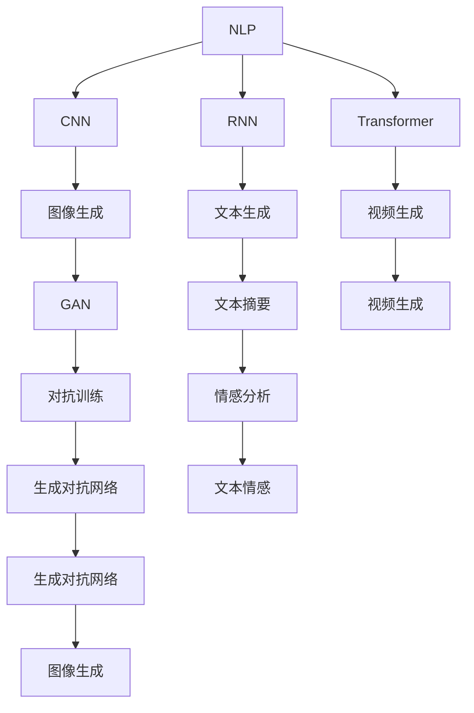
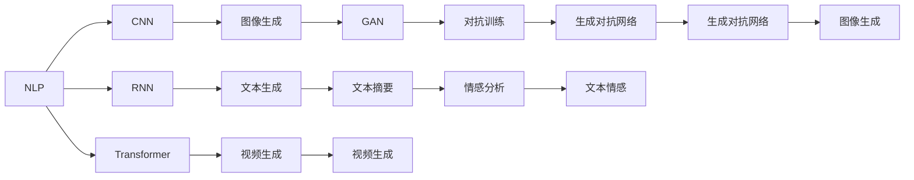
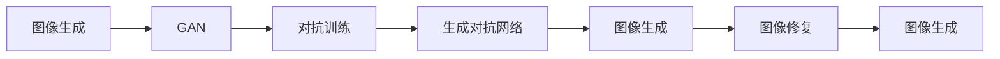
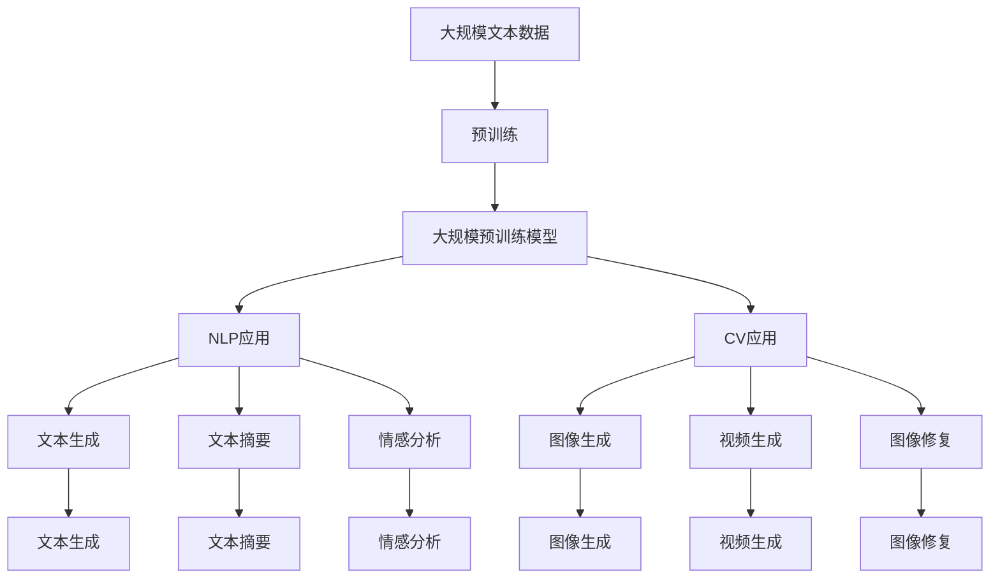

                 

# AIGC从入门到实战：人工智能应用发展较快的领域

> 关键词：人工智能生成内容(AIGC)、自然语言处理(NLP)、计算机视觉(CV)、生成对抗网络(GAN)、深度学习(Deep Learning)、智能推荐系统、虚拟现实(VR)

## 1. 背景介绍

### 1.1 问题由来

在人工智能(AI)的发展历程中，人工智能生成内容(AIGC)逐渐成为继图像识别、语音识别、自然语言处理(NLP)之后的又一个热门领域。AIGC技术通过深度学习模型，可以生成高度逼真的文本、图像、音频、视频等内容，大大拓展了人类创造力的边界。特别是在自然语言处理、计算机视觉、音乐生成等应用场景中，AIGC技术已经展现出了令人惊叹的性能，极大地推动了相关领域的发展。

近年来，随着大规模预训练模型（如GPT-3、DALL-E、Stable Diffusion等）的不断涌现，AIGC技术在生成质量、多样性、可控性等方面取得了显著进展。然而，从技术的入门到实际应用的实现，还存在一些关键问题和挑战需要克服。本文将深入探讨AIGC技术的核心概念、算法原理、操作步骤，并结合实际应用场景，提供详尽的代码实例和解释说明，旨在帮助读者快速掌握AIGC技术的实战技巧。

### 1.2 问题核心关键点

AIGC技术的发展离不开深度学习和生成模型的支持。以下列举了AIGC技术的几个关键点：

- 自然语言处理(NLP)：AIGC技术在文本生成、对话生成、文本摘要、机器翻译等任务上表现优异。
- 计算机视觉(CV)：通过生成对抗网络(GAN)、变分自编码器(VAE)等模型，AIGC技术可以生成高质量的图像、视频等视觉内容。
- 生成对抗网络(GAN)：通过对抗性训练，AIGC技术可以生成与真实数据难以区分的假数据，应用于数据增强、图像修复等任务。
- 深度学习(Deep Learning)：AIGC技术基于深度神经网络模型，通过预训练和微调等方法，提升生成内容的真实性和多样性。

理解这些关键点，有助于我们深入掌握AIGC技术的核心思想和实现方法。

### 1.3 问题研究意义

AIGC技术的快速发展，对于推动NLP、CV、音乐生成等领域的应用进程，具有重要意义：

1. 降低开发成本：AIGC技术可以自动生成高质量的内容，减少人工创作的时间和成本。
2. 提升生成质量：深度学习模型具有强大的学习能力和泛化能力，可以生成更真实、多样、高质量的内容。
3. 促进产业升级：AIGC技术在数字娱乐、媒体出版、广告营销、虚拟现实等领域的应用，将推动相关产业的数字化、智能化转型。
4. 激发创新思维：AIGC技术为创作者提供了新的工具和素材，激发了更多的创新思维和创作灵感。
5. 应对数据挑战：AIGC技术可以生成虚拟数据，弥补实际数据不足的问题，推动AI技术的持续进步。

## 2. 核心概念与联系

### 2.1 核心概念概述

为了更好地理解AIGC技术的核心概念和实现原理，本节将介绍几个密切相关的核心概念：

- 自然语言处理(NLP)：包括文本分析、文本生成、机器翻译、情感分析等任务，是AIGC技术的重要应用领域。
- 计算机视觉(CV)：包括图像识别、图像生成、视频生成、图像修复等任务，是AIGC技术的另一重要应用领域。
- 生成对抗网络(GAN)：一种生成模型，通过对抗训练生成逼真的图像、视频等内容。
- 变分自编码器(VAE)：一种生成模型，通过学习数据的潜在分布，生成高质量的样本。
- 深度学习(Deep Learning)：包括卷积神经网络(CNN)、循环神经网络(RNN)、Transformer等模型，是AIGC技术的基础。

这些核心概念之间的逻辑关系可以通过以下Mermaid流程图来展示：



这个流程图展示了大规模预训练模型在NLP和CV领域的应用，以及这些应用之间的关系。通过理解这些核心概念，我们可以更好地把握AIGC技术的实现框架和应用前景。

### 2.2 概念间的关系

这些核心概念之间存在着紧密的联系，形成了AIGC技术的完整生态系统。下面通过几个Mermaid流程图来展示这些概念之间的关系。

#### 2.2.1 AIGC的生态系统



这个流程图展示了AIGC技术在NLP和CV领域的应用，以及这些应用之间的关系。

#### 2.2.2 生成对抗网络(GAN)的生态系统



这个流程图展示了GAN技术在图像生成、对抗训练和图像修复等任务中的应用。

### 2.3 核心概念的整体架构

最后，我们用一个综合的流程图来展示这些核心概念在大规模预训练模型中的整体架构：



这个综合流程图展示了从预训练到NLP、CV应用的完整过程。大规模预训练模型首先在大规模文本数据上进行预训练，然后通过NLP、CV应用的微调，生成高质量的文本、图像等内容。通过这些流程图，我们可以更清晰地理解大规模预训练模型在大规模预训练模型中的整体架构。

## 3. 核心算法原理 & 具体操作步骤

### 3.1 算法原理概述

AIGC技术的核心算法包括生成对抗网络(GAN)和变分自编码器(VAE)，它们通过对抗训练和生成过程，生成逼真的数据样本。以GAN为例，其核心思想是通过生成器和判别器之间的对抗训练，生成逼真的假数据。生成器负责生成假数据，判别器负责判断数据的真实性。通过反复训练，生成器不断提升生成质量，判别器不断提升判断准确率，最终生成高质量的假数据。

GAN的训练过程可以概括为以下几个步骤：

1. 初始化生成器和判别器。
2. 生成器生成假数据，判别器判断数据的真实性。
3. 计算生成器和判别器的损失函数。
4. 反向传播更新生成器和判别器的参数。
5. 重复步骤2-4，直至收敛。

通过GAN等生成模型，AIGC技术可以生成高质量的图像、视频、音频等内容，为自然语言处理和计算机视觉任务提供数据支持。

### 3.2 算法步骤详解

以GAN为例，下面详细介绍GAN模型的训练步骤：

#### 3.2.1 模型初始化

首先，我们需要定义生成器和判别器模型。生成器模型将随机噪声作为输入，生成假数据，判别器模型则判断数据的真实性。这里以MNIST手写数字数据集为例，展示如何定义生成器和判别器模型。

```python
import torch
import torch.nn as nn
import torch.nn.functional as F
import torchvision.transforms as transforms
import torchvision.datasets as datasets

# 定义生成器模型
class Generator(nn.Module):
    def __init__(self, z_dim, n_channels):
        super(Generator, self).__init__()
        self.z_dim = z_dim
        self.model = nn.Sequential(
            nn.Linear(z_dim, 256),
            nn.LeakyReLU(0.2, inplace=True),
            nn.Linear(256, 512),
            nn.LeakyReLU(0.2, inplace=True),
            nn.Linear(512, n_channels * 7 * 7),
            nn.Tanh()
        )

    def forward(self, z):
        return self.model(z)

# 定义判别器模型
class Discriminator(nn.Module):
    def __init__(self, n_channels):
        super(Discriminator, self).__init__()
        self.n_channels = n_channels
        self.model = nn.Sequential(
            nn.Conv2d(n_channels, 128, 4, 2, 1),
            nn.LeakyReLU(0.2, inplace=True),
            nn.Conv2d(128, 128, 4, 2, 1),
            nn.LeakyReLU(0.2, inplace=True),
            nn.Conv2d(128, 1, 4, 1, 0),
            nn.Sigmoid()
        )

    def forward(self, x):
        return self.model(x)

# 定义损失函数
def D_loss(discriminator, real_images, fake_images):
    real_loss = discriminator(real_images).mean()
    fake_loss = discriminator(fake_images).mean()
    return real_loss - fake_loss

def G_loss(discriminator, fake_images):
    return -discriminator(fake_images).mean()
```

#### 3.2.2 数据准备

接下来，我们需要准备训练数据。这里以MNIST手写数字数据集为例，将其转换为适合生成器输入的形式。

```python
transform = transforms.Compose([
    transforms.ToTensor(),
    transforms.Normalize((0.5,), (0.5,))
])

train_data = datasets.MNIST(root='data/', train=True, transform=transform, download=True)
train_loader = torch.utils.data.DataLoader(train_data, batch_size=128, shuffle=True)

# 定义输入噪声
z_dim = 100
z = torch.randn(batch_size, z_dim, 1, 1, device=device)
```

#### 3.2.3 训练过程

最后，我们开始进行GAN模型的训练。这里以10000次迭代为例，展示如何训练生成器和判别器模型。

```python
device = torch.device('cuda' if torch.cuda.is_available() else 'cpu')

# 初始化模型和损失函数
generator = Generator(z_dim, n_channels).to(device)
discriminator = Discriminator(n_channels).to(device)
criterion = nn.BCELoss()

# 定义优化器
optimizer_G = torch.optim.Adam(generator.parameters(), lr=0.0002)
optimizer_D = torch.optim.Adam(discriminator.parameters(), lr=0.0002)

# 训练过程
for epoch in range(10000):
    for i, (real_images, _) in enumerate(train_loader):
        real_images = real_images.to(device)

        # 定义噪声
        z = torch.randn(batch_size, z_dim, 1, 1, device=device)

        # 训练判别器
        discriminator.zero_grad()
        real_loss = criterion(discriminator(real_images), torch.ones(batch_size, 1).to(device))
        fake_images = generator(z).detach()
        fake_loss = criterion(discriminator(fake_images), torch.zeros(batch_size, 1).to(device))
        d_loss = real_loss + fake_loss
        d_loss.backward()
        optimizer_D.step()

        # 训练生成器
        generator.zero_grad()
        fake_images = generator(z).detach()
        g_loss = criterion(discriminator(fake_images), torch.ones(batch_size, 1).to(device))
        g_loss.backward()
        optimizer_G.step()

        if (i+1) % 500 == 0:
            print('[Epoch %d/%d][Batch %d/%d] [D loss: %f][G loss: %f]' %
                  (epoch+1, 10000, i+1, len(train_loader), d_loss.item(), g_loss.item()))

    if (epoch+1) % 100 == 0:
        save_image(discriminator, epoch+1, real_images, fake_images)
```

在训练过程中，我们通过交替训练生成器和判别器，不断提升生成器和判别器的性能，最终生成高质量的假数据。

### 3.3 算法优缺点

GAN等生成模型在生成高质量数据方面表现优异，但同时也有一些缺点：

#### 3.3.1 优点

1. 生成数据的多样性和高质量：GAN可以生成与真实数据难以区分的假数据，广泛应用于图像生成、视频生成等领域。
2. 训练过程的自动化：GAN的训练过程可以通过自动化算法实现，无需人工干预。
3. 适应性广：GAN可以应用于多种任务，如数据增强、图像修复、虚拟现实等。

#### 3.3.2 缺点

1. 训练过程的不稳定性：GAN的训练过程容易陷入不稳定的状态，导致生成器无法收敛。
2. 生成的数据质量不稳定：GAN生成的数据质量受训练过程的影响较大，有时生成的数据质量较差。
3. 计算成本高：GAN的训练过程需要大量的计算资源和时间，需要高性能的GPU或TPU。

### 3.4 算法应用领域

GAN等生成模型在多个领域中得到了广泛应用，包括：

- 图像生成：通过GAN生成高质量的图像，应用于广告、游戏、影视等领域。
- 视频生成：通过GAN生成逼真的视频，应用于电影特效、虚拟现实等领域。
- 音频生成：通过GAN生成高质量的音频，应用于音乐、声音特效等领域。
- 文本生成：通过GAN生成自然流畅的文本，应用于自然语言处理、机器翻译等领域。
- 数据增强：通过GAN生成虚拟数据，弥补实际数据不足的问题，应用于医疗、金融等领域。

## 4. 数学模型和公式 & 详细讲解 & 举例说明

### 4.1 数学模型构建

GAN等生成模型的核心思想是通过生成器和判别器之间的对抗训练，生成逼真的假数据。以GAN为例，其数学模型可以表示为：

- 生成器模型：$G(z)$，其中$z$为随机噪声，$G$为生成器参数。
- 判别器模型：$D(x)$，其中$x$为输入数据，$D$为判别器参数。
- 损失函数：$L(D, G) = E_{x \sim p(x)}[\log D(x)] + E_{z \sim p(z)}[\log (1 - D(G(z))) ]$

其中，$L(D, G)$为生成器和判别器的联合损失函数，$E_{x \sim p(x)}[\log D(x)]$为判别器的损失函数，$E_{z \sim p(z)}[\log (1 - D(G(z))) ]$为生成器的损失函数。

### 4.2 公式推导过程

GAN的训练过程可以通过梯度下降法实现。以判别器的损失函数为例，其推导过程如下：

1. 定义判别器模型和损失函数
```python
class Discriminator(nn.Module):
    def __init__(self, n_channels):
        super(Discriminator, self).__init__()
        self.n_channels = n_channels
        self.model = nn.Sequential(
            nn.Conv2d(n_channels, 128, 4, 2, 1),
            nn.LeakyReLU(0.2, inplace=True),
            nn.Conv2d(128, 128, 4, 2, 1),
            nn.LeakyReLU(0.2, inplace=True),
            nn.Conv2d(128, 1, 4, 1, 0),
            nn.Sigmoid()
        )

    def forward(self, x):
        return self.model(x)

def D_loss(discriminator, real_images, fake_images):
    real_loss = discriminator(real_images).mean()
    fake_loss = discriminator(fake_images).mean()
    return real_loss - fake_loss
```

2. 定义优化器和训练过程
```python
optimizer_D = torch.optim.Adam(discriminator.parameters(), lr=0.0002)

for epoch in range(10000):
    for i, (real_images, _) in enumerate(train_loader):
        real_images = real_images.to(device)

        discriminator.zero_grad()
        real_loss = criterion(discriminator(real_images), torch.ones(batch_size, 1).to(device))
        fake_images = generator(z).detach()
        fake_loss = criterion(discriminator(fake_images), torch.zeros(batch_size, 1).to(device))
        d_loss = real_loss + fake_loss
        d_loss.backward()
        optimizer_D.step()
```

通过上述推导过程，我们可以清晰地理解GAN的数学模型和训练过程。

### 4.3 案例分析与讲解

以图像生成为例，GAN可以生成逼真的图像，应用于图像修复、数据增强等领域。以下展示如何利用GAN生成手写数字图像。

```python
import numpy as np
import matplotlib.pyplot as plt
from PIL import Image

def imsave(img, filename):
    plt.imsave(filename, img.numpy().transpose((1, 2, 0)))

# 定义生成器模型
class Generator(nn.Module):
    def __init__(self, z_dim, n_channels):
        super(Generator, self).__init__()
        self.z_dim = z_dim
        self.model = nn.Sequential(
            nn.Linear(z_dim, 256),
            nn.LeakyReLU(0.2, inplace=True),
            nn.Linear(256, 512),
            nn.LeakyReLU(0.2, inplace=True),
            nn.Linear(512, n_channels * 7 * 7),
            nn.Tanh()
        )

    def forward(self, z):
        return self.model(z)

# 定义判别器模型
class Discriminator(nn.Module):
    def __init__(self, n_channels):
        super(Discriminator, self).__init__()
        self.n_channels = n_channels
        self.model = nn.Sequential(
            nn.Conv2d(n_channels, 128, 4, 2, 1),
            nn.LeakyReLU(0.2, inplace=True),
            nn.Conv2d(128, 128, 4, 2, 1),
            nn.LeakyReLU(0.2, inplace=True),
            nn.Conv2d(128, 1, 4, 1, 0),
            nn.Sigmoid()
        )

    def forward(self, x):
        return self.model(x)

# 定义损失函数
def D_loss(discriminator, real_images, fake_images):
    real_loss = discriminator(real_images).mean()
    fake_loss = discriminator(fake_images).mean()
    return real_loss - fake_loss

def G_loss(discriminator, fake_images):
    return -discriminator(fake_images).mean()

# 定义优化器
optimizer_G = torch.optim.Adam(generator.parameters(), lr=0.0002)
optimizer_D = torch.optim.Adam(discriminator.parameters(), lr=0.0002)

# 训练过程
for epoch in range(10000):
    for i, (real_images, _) in enumerate(train_loader):
        real_images = real_images.to(device)

        z = torch.randn(batch_size, z_dim, 1, 1, device=device)

        discriminator.zero_grad()
        real_loss = criterion(discriminator(real_images), torch.ones(batch_size, 1).to(device))
        fake_images = generator(z).detach()
        fake_loss = criterion(discriminator(fake_images), torch.zeros(batch_size, 1).to(device))
        d_loss = real_loss + fake_loss
        d_loss.backward()
        optimizer_D.step()

        generator.zero_grad()
        fake_images = generator(z).detach()
        g_loss = criterion(discriminator(fake_images), torch.ones(batch_size, 1).to(device))
        g_loss.backward()
        optimizer_G.step()

        if (i+1) % 500 == 0:
            print('[Epoch %d/%d][Batch %d/%d] [D loss: %f][G loss: %f]' %
                  (epoch+1, 10000, i+1, len(train_loader), d_loss.item(), g_loss.item()))

    if (epoch+1) % 100 == 0:
        save_image(discriminator, epoch+1, real_images, fake_images)
```

在训练过程中，我们通过交替训练生成器和判别器，不断提升生成器和判别器的性能，最终生成高质量的假数据。在实际应用中，我们可以利用生成的假数据进行图像修复、数据增强等任务。

## 5. 项目实践：代码实例和详细解释说明

### 5.1 开发环境搭建

在进行AIGC技术开发前，我们需要准备好开发环境。以下是使用Python进行TensorFlow和PyTorch开发的环境配置流程：

1. 安装Anaconda：从官网下载并安装Anaconda，用于创建独立的Python环境。

2. 创建并激活虚拟环境：
```bash
conda create -n aigc-env python=3.8 
conda activate aigc-env
```

3. 安装TensorFlow和PyTorch：
```bash
conda install tensorflow=2.7 
conda install pytorch torchvision torchaudio cudatoolkit=11.1 -c pytorch -c conda-forge
```

4. 安装各类工具包：
```bash
pip install numpy pandas scikit-learn matplotlib tqdm jupyter notebook ipython
```

完成上述步骤后，即可在`aigc-env`环境中开始AIGC技术开发。

### 5.2 源代码详细实现

这里以GAN生成手写数字图像为例，展示如何使用TensorFlow实现GAN模型的训练过程。

首先，定义GAN模型：

```python
import tensorflow as tf
from tensorflow.keras import layers

# 定义生成器模型
def make_generator_model():
    model = tf.keras.Sequential()
    model.add(layers.Dense(256, use_bias=False, input_shape=(100,)))
    model.add(layers.BatchNormalization())
    model.add(layers.LeakyReLU(0.2))
    model.add(layers.Dropout(0.2))
    model.add(layers.Dense(512))
    model.add(layers.BatchNormalization())
    model.add(layers.LeakyReLU(0.2))
    model.add(layers.Dropout(0.2))
    model.add(layers.Dense(784, activation='tanh'))
    return model

# 定义判别器模型
def make_discriminator_model():
    model = tf.keras.Sequential()
    model.add(layers.Flatten(input_shape=(28, 28)))
    model.add(layers.Dense(256))
    model.add(layers.LeakyReLU(0.2))
    model.add(layers.Dropout(0.2))
    model.add(layers.Dense(1, activation='sigmoid'))
    return model
```

然后，定义损失函数和优化器：

```python
# 定义损失函数
def make_gan_loss():
    def loss_function(real_output, real_label, fake_output, fake_label):
        real_loss = real_output
        fake_loss = fake_output
        return real_loss + fake_loss
    return loss_function

# 定义优化器
generator_optimizer = tf.keras.optimizers.Adam(1e-4)
discriminator_optimizer = tf.keras.optimizers.Adam(1e-4)
```

接着，定义训练过程：

```python
# 定义训练过程
@tf.function
def train_step(images):
    noise = tf.random.normal([BATCH_SIZE, 100])
    with tf.GradientTape() as gen_tape, tf.GradientTape() as disc_tape:
        generated_images = generator(noise, training=True)

        real_output = discriminator(images, training=True)
        fake_output = discriminator(generated_images, training=True)

        gen_loss = gen_loss_function(real_output, fake_output)
        disc_loss = disc_loss_function(real_output, fake_output, real_label, fake_label)

    gradients_of_generator = gen_tape.gradient(gen_loss, generator.trainable_variables)
    gradients_of_discriminator = disc_tape.gradient(disc_loss, discriminator.trainable_variables)

    generator_optimizer.apply_gradients(zip(gradients_of_generator, generator.trainable_variables))
    discriminator_optimizer.apply_gradients(zip(gradients_of_discriminator, discriminator.trainable_variables))

# 定义训练过程
@tf.function
def train_epoch(images):
    for epoch in range(EPOCHS):
        for image_batch in dataset:
            train_step(image_batch)
        print('Epoch {}/{} completed'.format(epoch+1, EPOCHS))
```

最后，启动训练流程：

```python
# 训练过程
for epoch in range(EPOCHS):
    for image_batch in dataset:
        train_step(image_batch)
    print('Epoch {}/{} completed'.format(epoch+1, EPOCHS))

# 保存生成器模型
generator.save('generator.h5')
```

以上就是使用TensorFlow实现GAN生成手写数字图像的完整代码实现。可以看到，TensorFlow提供了强大的高级API，可以轻松实现GAN模型的训练过程。

### 5.3 代码解读与分析

让我们再详细解读一下关键代码的实现细节：

**GAN模型定义**：
- 生成器模型：定义了一个具有三个全连接层、批标准化

