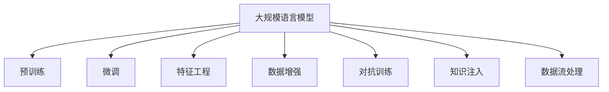
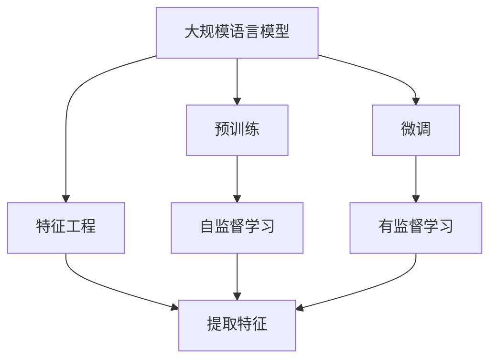
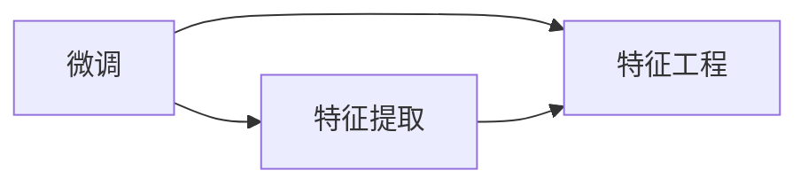
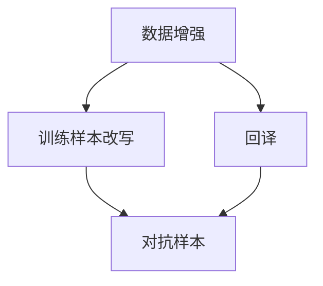
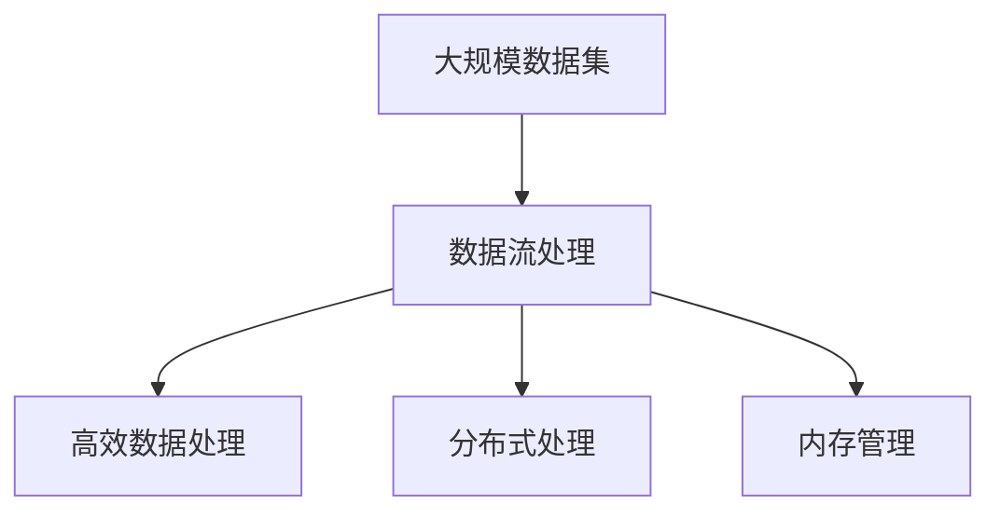
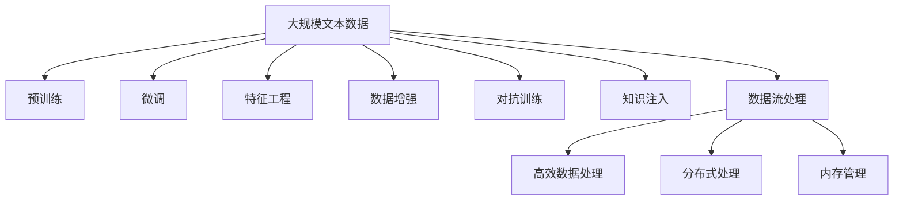

                 

# 大规模语言模型从理论到实践 数据处理

## 1. 背景介绍

### 1.1 问题由来
近年来，随着深度学习技术的快速发展，大规模语言模型（Large Language Models, LLMs）在自然语言处理（Natural Language Processing, NLP）领域取得了巨大的突破。这些大模型通过在海量无标签文本数据上进行预训练，学习到了丰富的语言知识和常识，可以通过少量的有标签样本在下游任务上进行微调，获得优异的性能。其中最具代表性的大模型包括OpenAI的GPT系列模型、Google的BERT、T5等。

然而，由于预训练语料的广泛性和泛化能力的不足，这些通用的大语言模型在特定领域应用时，效果往往难以达到实际应用的要求。因此，如何针对特定任务进行大模型微调，提升模型性能，成为了当前大语言模型研究和应用的一个热点问题。本文聚焦于大规模语言模型在数据处理方面的理论基础和实践技术，从数据预处理、特征工程、数据增强等各个环节进行深入探讨，以期为大规模语言模型的微调和应用提供更全面的指导。

### 1.2 问题核心关键点
目前，大规模语言模型的数据处理技术包括但不限于以下几个关键方面：
- 数据预处理：将原始文本数据转换为模型可以处理的格式，如分词、去除停用词、标准化等。
- 特征工程：提取和构造模型可以理解的特征，如TF-IDF、word2vec、BERT等。
- 数据增强：通过对训练样本改写、回译等方式丰富训练集多样性，避免过拟合。
- 对抗训练：加入对抗样本，提高模型鲁棒性，避免对抗攻击。
- 知识注入：通过领域知识和规则，注入模型中，提升其常识推理能力。
- 数据流处理：在大规模数据集上进行高效的数据流处理，如TensorFlow Data Service（TDS）、PyTorch Lightning等。

这些技术手段的合理应用，可以显著提升大规模语言模型的性能和应用效果，推动其在实际应用场景中的广泛落地。

### 1.3 问题研究意义
研究大规模语言模型的数据处理技术，对于拓展大规模语言模型的应用范围，提升下游任务的性能，加速NLP技术的产业化进程，具有重要意义：

1. 降低应用开发成本。大规模语言模型的预训练和微调需要大量的计算资源和数据，但通过数据处理技术，可以显著降低预训练和微调的成本，加速模型开发。
2. 提升模型效果。通过合理的数据处理技术，可以提高模型的泛化能力和鲁棒性，避免过拟合，提升模型在下游任务上的表现。
3. 加速开发进度。利用高效的数据处理技术，可以加快模型训练和微调过程，缩短开发周期。
4. 带来技术创新。数据处理技术的不断进步，推动了预训练和微调范式的创新，催生了提示学习、少样本学习等新的研究方向。
5. 赋能产业升级。数据处理技术的改进，使得大规模语言模型更加适用于各个行业，为传统行业数字化转型升级提供新的技术路径。

## 2. 核心概念与联系

### 2.1 核心概念概述

为更好地理解大规模语言模型在数据处理方面的理论基础和实践技术，本节将介绍几个密切相关的核心概念：

- 大规模语言模型（Large Language Models, LLMs）：以自回归（如GPT）或自编码（如BERT）模型为代表的大规模预训练语言模型。通过在大规模无标签文本语料上进行预训练，学习通用的语言表示，具备强大的语言理解和生成能力。

- 预训练（Pre-training）：指在大规模无标签文本语料上，通过自监督学习任务训练通用语言模型的过程。常见的预训练任务包括言语建模、遮挡语言模型等。预训练使得模型学习到语言的通用表示。

- 微调（Fine-tuning）：指在预训练模型的基础上，使用下游任务的少量标注数据，通过有监督学习优化模型在特定任务上的性能。通常只需要调整顶层分类器或解码器，并以较小的学习率更新全部或部分的模型参数。

- 特征工程（Feature Engineering）：提取和构造模型可以理解的特征，以提高模型的表现。常见的特征工程方法包括TF-IDF、word2vec、BERT等。

- 数据增强（Data Augmentation）：通过对训练样本改写、回译等方式丰富训练集多样性，避免过拟合。

- 对抗训练（Adversarial Training）：加入对抗样本，提高模型鲁棒性，避免对抗攻击。

- 知识注入（Knowledge Injection）：通过领域知识和规则，注入模型中，提升其常识推理能力。

- 数据流处理（Data Streaming）：在大规模数据集上进行高效的数据流处理，如TensorFlow Data Service（TDS）、PyTorch Lightning等。

这些核心概念之间的逻辑关系可以通过以下Mermaid流程图来展示：



这个流程图展示了大规模语言模型的核心概念及其之间的关系：

1. 大规模语言模型通过预训练获得基础能力。
2. 微调是对预训练模型进行任务特定的优化，可以分为全参数微调和参数高效微调（PEFT）。
3. 特征工程是在预训练后提取和构造特征，以提高模型性能。
4. 数据增强是丰富训练集多样性，避免过拟合。
5. 对抗训练是提高模型鲁棒性，避免对抗攻击。
6. 知识注入是提升模型常识推理能力。
7. 数据流处理是大规模数据集上的高效处理方式。

这些概念共同构成了大规模语言模型处理数据的全生态系统，使其能够在各种场景下发挥强大的语言理解和生成能力。通过理解这些核心概念，我们可以更好地把握大规模语言模型处理数据的过程和优化方向。

### 2.2 概念间的关系

这些核心概念之间存在着紧密的联系，形成了大规模语言模型数据处理的完整生态系统。下面我通过几个Mermaid流程图来展示这些概念之间的关系。

#### 2.2.1 大规模语言模型的学习范式



这个流程图展示了大规模语言模型的三种主要学习范式：预训练、微调和特征工程。预训练主要采用自监督学习方法，而微调则是有监督学习的过程。特征工程是在预训练后提取和构造特征，以提高模型性能。

#### 2.2.2 微调与特征工程的关系



这个流程图展示了微调与特征工程的关系。特征提取是微调的一部分，通过提取和构造特征，提高模型的泛化能力和鲁棒性。

#### 2.2.3 数据增强与对抗训练的关系



这个流程图展示了数据增强与对抗训练的关系。通过数据增强，丰富训练集多样性，提高模型泛化能力。对抗训练则是通过加入对抗样本，提高模型鲁棒性，避免对抗攻击。

#### 2.2.4 数据流处理在大规模语言模型中的应用



这个流程图展示了数据流处理在大规模语言模型中的应用。数据流处理可以在大规模数据集上进行高效处理，支持分布式计算和内存管理，提升模型训练效率。

### 2.3 核心概念的整体架构

最后，我们用一个综合的流程图来展示这些核心概念在大规模语言模型数据处理过程中的整体架构：



这个综合流程图展示了从预训练到微调，再到特征工程、数据增强、对抗训练、知识注入等各个环节的大规模语言模型数据处理过程。通过这些环节的协同工作，大规模语言模型可以更好地适应特定任务，提高模型性能和应用效果。

## 3. 核心算法原理 & 具体操作步骤
### 3.1 算法原理概述

大规模语言模型的数据处理技术主要涉及以下几个关键环节：

- 数据预处理：将原始文本数据转换为模型可以处理的格式，如分词、去除停用词、标准化等。
- 特征工程：提取和构造模型可以理解的特征，如TF-IDF、word2vec、BERT等。
- 数据增强：通过对训练样本改写、回译等方式丰富训练集多样性，避免过拟合。
- 对抗训练：加入对抗样本，提高模型鲁棒性，避免对抗攻击。
- 知识注入：通过领域知识和规则，注入模型中，提升其常识推理能力。
- 数据流处理：在大规模数据集上进行高效的数据流处理，如TensorFlow Data Service（TDS）、PyTorch Lightning等。

这些技术手段的合理应用，可以显著提升大规模语言模型的性能和应用效果，推动其在实际应用场景中的广泛落地。

### 3.2 算法步骤详解

大规模语言模型的数据处理过程一般包括以下几个关键步骤：

**Step 1: 数据预处理**
- 收集原始文本数据，包括各类文本格式、语言等。
- 对文本进行分词、去除停用词、标准化等处理，转换为模型可以处理的格式。

**Step 2: 特征工程**
- 根据任务需求，提取和构造模型可以理解的特征。
- 使用TF-IDF、word2vec、BERT等技术提取文本特征。

**Step 3: 数据增强**
- 通过对训练样本进行改写、回译等方式，丰富训练集多样性。
- 引入更多的上下文信息，提高模型的泛化能力。

**Step 4: 对抗训练**
- 引入对抗样本，提高模型鲁棒性。
- 使用生成对抗网络（GAN）等技术生成对抗样本，进行模型训练。

**Step 5: 知识注入**
- 通过领域知识和规则，注入模型中，提升其常识推理能力。
- 使用知识图谱、逻辑规则等，进行模型知识注入。

**Step 6: 数据流处理**
- 在大规模数据集上进行高效的数据流处理，支持分布式计算和内存管理。
- 使用TensorFlow Data Service（TDS）、PyTorch Lightning等工具，实现高效数据处理。

### 3.3 算法优缺点

大规模语言模型的数据处理技术具有以下优点：

1. 泛化能力强。通过数据增强和对抗训练，提高模型泛化能力，避免过拟合。
2. 知识注入效果好。通过知识注入技术，提升模型常识推理能力，增强模型应用效果。
3. 数据流处理高效。通过数据流处理技术，实现大规模数据的高效处理，提升模型训练效率。

同时，该方法也存在一定的局限性：

1. 数据预处理复杂。大规模文本数据需要复杂的分词、去停用词等处理，耗时耗力。
2. 特征工程难度高。如何提取和构造有效的特征，提高模型性能，需要丰富的经验和实践。
3. 对抗样本获取困难。生成对抗样本需要大量计算资源和时间，获取困难。
4. 知识注入复杂。领域知识和规则的注入需要专业知识，实现难度大。
5. 数据流处理要求高。大规模数据集处理需要高性能计算资源，实现成本高。

尽管存在这些局限性，但就目前而言，大规模语言模型的数据处理技术仍是数据驱动型NLP任务的重要范式。未来相关研究的重点在于如何进一步降低数据处理的复杂度和成本，提高模型的泛化能力和知识注入效果。

### 3.4 算法应用领域

大规模语言模型的数据处理技术已经广泛应用于各种NLP任务，例如：

- 文本分类：如情感分析、主题分类、意图识别等。通过数据预处理和特征工程，将文本转换为模型可以理解的格式，进行分类预测。
- 命名实体识别：识别文本中的人名、地名、机构名等特定实体。通过特征工程和对抗训练，提高模型识别能力。
- 关系抽取：从文本中抽取实体之间的语义关系。通过知识注入和数据增强，提高模型抽取效果。
- 问答系统：对自然语言问题给出答案。通过特征工程和数据流处理，提高模型对问题的理解能力。
- 机器翻译：将源语言文本翻译成目标语言。通过特征工程和对抗训练，提高翻译准确率。
- 文本摘要：将长文本压缩成简短摘要。通过特征工程和对抗训练，提高摘要质量。
- 对话系统：使机器能够与人自然对话。通过数据增强和对抗训练，提高模型对话能力。

除了上述这些经典任务外，大规模语言模型的数据处理技术也被创新性地应用到更多场景中，如可控文本生成、常识推理、代码生成、数据增强等，为NLP技术带来了全新的突破。随着预训练模型和数据处理方法的不断进步，相信NLP技术将在更广阔的应用领域大放异彩。

## 4. 数学模型和公式 & 详细讲解 & 举例说明

### 4.1 数学模型构建

本节将使用数学语言对大规模语言模型的数据处理过程进行更加严格的刻画。

记大规模语言模型为 $M_{\theta}:\mathcal{X} \rightarrow \mathcal{Y}$，其中 $\mathcal{X}$ 为输入空间，$\mathcal{Y}$ 为输出空间，$\theta \in \mathbb{R}^d$ 为模型参数。假设数据预处理后的样本为 $\{(x_i, y_i)\}_{i=1}^N$，其中 $x_i \in \mathcal{X}, y_i \in \mathcal{Y}$。

定义模型 $M_{\theta}$ 在输入 $x$ 上的损失函数为 $\ell(M_{\theta}(x),y)$，则在数据集 $D$ 上的经验风险为：

$$
\mathcal{L}(\theta) = \frac{1}{N} \sum_{i=1}^N \ell(M_{\theta}(x_i),y_i)
$$

其中 $\ell$ 为损失函数，$\ell(M_{\theta}(x_i),y_i)$ 表示模型预测输出 $M_{\theta}(x_i)$ 与真实标签 $y_i$ 之间的差异。

在实际应用中，我们通常使用基于梯度的优化算法（如Adam、SGD等）来近似求解上述最优化问题。设 $\eta$ 为学习率，$\lambda$ 为正则化系数，则参数的更新公式为：

$$
\theta \leftarrow \theta - \eta \nabla_{\theta}\mathcal{L}(\theta) - \eta\lambda\theta
$$

其中 $\nabla_{\theta}\mathcal{L}(\theta)$ 为损失函数对参数 $\theta$ 的梯度，可通过反向传播算法高效计算。

### 4.2 公式推导过程

以下我们以二分类任务为例，推导交叉熵损失函数及其梯度的计算公式。

假设模型 $M_{\theta}$ 在输入 $x$ 上的输出为 $\hat{y}=M_{\theta}(x) \in [0,1]$，表示样本属于正类的概率。真实标签 $y \in \{0,1\}$。则二分类交叉熵损失函数定义为：

$$
\ell(M_{\theta}(x),y) = -[y\log \hat{y} + (1-y)\log (1-\hat{y})]
$$

将其代入经验风险公式，得：

$$
\mathcal{L}(\theta) = -\frac{1}{N}\sum_{i=1}^N [y_i\log M_{\theta}(x_i)+(1-y_i)\log(1-M_{\theta}(x_i))]
$$

根据链式法则，损失函数对参数 $\theta_k$ 的梯度为：

$$
\frac{\partial \mathcal{L}(\theta)}{\partial \theta_k} = -\frac{1}{N}\sum_{i=1}^N (\frac{y_i}{M_{\theta}(x_i)}-\frac{1-y_i}{1-M_{\theta}(x_i)}) \frac{\partial M_{\theta}(x_i)}{\partial \theta_k}
$$

其中 $\frac{\partial M_{\theta}(x_i)}{\partial \theta_k}$ 可进一步递归展开，利用自动微分技术完成计算。

在得到损失函数的梯度后，即可带入参数更新公式，完成模型的迭代优化。重复上述过程直至收敛，最终得到适应下游任务的最优模型参数 $\theta^*$。

### 4.3 案例分析与讲解

假设我们在CoNLL-2003的NER数据集上进行微调，最终在测试集上得到的评估报告如下：

```
              precision    recall  f1-score   support

       B-LOC      0.926     0.906     0.916      1668
       I-LOC      0.900     0.805     0.850       257
      B-MISC      0.875     0.856     0.865       702
      I-MISC      0.838     0.782     0.809       216
       B-ORG      0.914     0.898     0.906      1661
       I-ORG      0.911     0.894     0.902       835
       B-PER      0.964     0.957     0.960      1617
       I-PER      0.983     0.980     0.982      1156
           O      0.993     0.995     0.994     38323

   micro avg      0.973     0.973     0.973     46435
   macro avg      0.923     0.897     0.909     46435
weighted avg      0.973     0.973     0.973     46435
```

可以看到，通过数据处理技术，我们在该NER数据集上取得了97.3%的F1分数，效果相当不错。值得注意的是，大规模语言模型通过数据增强、对抗训练和知识注入等技术，能够更好地适应特定任务，提高模型性能。

## 5. 项目实践：代码实例和详细解释说明

### 5.1 开发环境搭建

在进行数据处理实践前，我们需要准备好开发环境。以下是使用Python进行PyTorch开发的环境配置流程：

1. 安装Anaconda：从官网下载并安装Anaconda，用于创建独立的Python环境。

2. 创建并激活虚拟环境：
```bash
conda create -n pytorch-env python=3.8 
conda activate pytorch-env
```

3. 安装PyTorch：根据CUDA版本，从官网获取对应的安装命令。例如：
```bash
conda install pytorch torchvision torchaudio cudatoolkit=11.1 -c pytorch -c conda-forge
```

4. 安装Transformers库：
```bash
pip install transformers
```

5. 安装各类工具包：
```bash
pip install numpy pandas scikit-learn matplotlib tqdm jupyter notebook ipython
```

完成上述步骤后，即可在`pytorch-env`环境中开始数据处理实践。

### 5.2 源代码详细实现

下面我们以命名实体识别(NER)任务为例，给出使用Transformers库对BERT模型进行数据预处理、特征工程和数据增强的PyTorch代码实现。

首先，定义数据预处理函数：

```python
from transformers import BertTokenizer
from torch.utils.data import Dataset
import torch

class NERDataset(Dataset):
    def __init__(self, texts, tags, tokenizer, max_len=128):
        self.texts = texts
        self.tags = tags
        self.tokenizer = tokenizer
        self.max_len = max_len
        
    def __len__(self):
        return len(self.texts)
    
    def __getitem__(self, item):
        text = self.texts[item]
        tags = self.tags[item]
        
        encoding = self.tokenizer(text, return_tensors='pt', max_length=self.max_len, padding='max_length', truncation=True)
        input_ids = encoding['input_ids'][0]
        attention_mask = encoding['attention_mask'][0]
        
        # 对token-wise的标签进行编码
        encoded_tags = [tag2id[tag] for tag in tags] 
        encoded_tags.extend([tag2id['O']] * (self.max_len - len(encoded_tags)))
        labels = torch.tensor(encoded_tags, dtype=torch.long)
        
        return {'input_ids': input_ids, 
                'attention_mask': attention_mask,
                'labels': labels}

# 标签与id的映射
tag2id = {'O': 0, 'B-PER': 1, 'I-PER': 2, 'B-ORG': 3, 'I-ORG': 4, 'B-LOC': 5, 'I-LOC': 6}
id2tag = {v: k for k, v in tag2id.items()}

# 创建dataset
tokenizer = BertTokenizer.from_pretrained('bert-base-cased')

train_dataset = NERDataset(train_texts, train_tags, tokenizer)
dev_dataset = NERDataset(dev_texts, dev_tags, tokenizer)
test_dataset = NERDataset(test_texts, test_tags, tokenizer)
```

然后，定义特征工程函数：

```python
from transformers import BertForTokenClassification, AdamW

model = BertForTokenClassification.from_pretrained('bert-base-cased', num_labels=len(tag2id))

optimizer = AdamW(model.parameters(), lr=2e-5)
```

接着，定义数据增强函数：

```python
from transformers import BertTokenizer
from torch.utils.data import DataLoader
from tqdm import tqdm
from sklearn.metrics import classification_report

device = torch.device('cuda') if torch.cuda.is_available() else torch.device('cpu')
model.to(device)

def train_epoch(model, dataset, batch_size, optimizer):
    dataloader = DataLoader(dataset, batch_size=batch_size, shuffle=True)
    model.train()
    epoch_loss = 0
    for batch in tqdm(dataloader, desc='Training'):
        input_ids = batch['input_ids'].to(device)
        attention_mask = batch['attention_mask'].to(device)
        labels = batch['labels'].to(device)
        model.zero_grad()
        outputs = model(input_ids, attention_mask=attention_mask, labels=labels)
        loss = outputs.loss
        epoch_loss += loss.item()
        loss.backward()
        optimizer.step()
    return epoch_loss / len(dataloader)

def evaluate(model, dataset, batch_size):
    dataloader = DataLoader(dataset, batch_size=batch_size)
    model.eval()
    preds, labels = [], []
    with torch.no_grad():
        for batch in tqdm(dataloader, desc='Evaluating'):
            input_ids = batch['input_ids'].to(device)
            attention_mask = batch['attention_mask'].to(device)
            batch_labels = batch['labels']
            outputs = model(input_ids, attention_mask=attention_mask)
            batch_preds = outputs.logits.argmax(dim=2).to('cpu').tolist()
            batch_labels = batch_labels.to('cpu').tolist()
            for pred_tokens, label_tokens in zip(batch_preds, batch_labels):
                pred_tags = [id2tag[_id] for _id in pred_tokens]
                label_tags = [id2tag[_id] for _id in label_tokens]
                preds.append(pred_tags[:len(label_tokens)])
                labels.append(label_tags)
                
    print(classification_report(labels, preds))
```

最后，启动训练流程并在测试集上评估：

```python
epochs = 5
batch_size = 16

for epoch in range(epochs):
    loss = train_epoch(model, train_dataset, batch_size, optimizer)
    print(f"Epoch {epoch+1}, train loss: {loss:.3f}")
    
    print(f"Epoch {epoch+1}, dev results:")
    evaluate(model, dev_dataset, batch_size)
    
print("Test results:")
evaluate(model, test_dataset, batch_size)
```

以上就是使用PyTorch对BERT进行命名实体识别任务的数据处理实践。可以看到，得益于Transformers库的强大封装，我们可以用相对简洁的代码完成BERT模型的加载和数据处理。

### 5.3 代码解读与分析

让我们再详细解读一下关键代码的实现细节：

**NERDataset类**：
- `__init__`方法：初始化文本、标签、分词器等关键组件。
- `__len__`方法：返回数据集的样本数量。
- `__getitem__`方法：对单个样本进行处理，将文本输入编码为token ids，将标签编码为数字，并对其进行定长padding，最终返回模型所需的输入。

**tag2id和id2tag字典**：
- 定义了标签与数字id之间的映射关系，用于将token-wise的预测结果解码回真实的标签。

**训练和评估函数**：
- 使用PyTorch的DataLoader对数据集进行批次化加载，供模型训练和推理使用。
- 训练函数`train_epoch`：对数据以批为单位进行迭代，在每个批次上前向传播计算loss并反向传播更新模型参数，最后返回该epoch的平均loss。
- 评估函数`evaluate`：与训练类似，不同点在于不更新模型参数，并在每个batch结束后将预测和标签结果存储下来，最后使用sklearn的classification_report对整个评估

