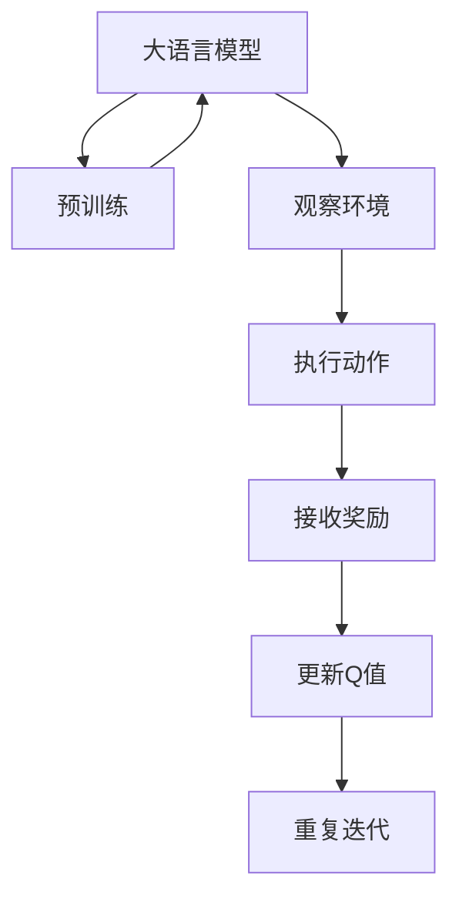
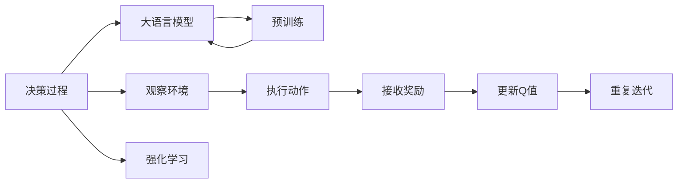

                 

# 大语言模型原理与工程实践：DQN 决策

> 关键词：大语言模型, 决策过程, Q-learning, Deep Q-Network (DQN), 强化学习, 神经网络, 策略优化, 自适应决策

## 1. 背景介绍

### 1.1 问题由来
近年来，深度学习和大数据技术的发展，使得机器学习在决策领域获得了突破性的进展。特别是强化学习(Reinforcement Learning, RL)，在复杂决策场景中展现出了巨大的潜力。然而，传统的基于符号逻辑的决策方法往往难以处理高维度、非结构化的数据，而强化学习则能够通过与环境的交互，自适应地学习最优决策策略。

大语言模型作为深度学习的重要分支，近年来在自然语言处理(NLP)领域取得了显著的进展。这些模型通过大规模语料库的预训练，具备了丰富的语言理解和生成能力。结合强化学习技术，可以在高维度非结构化数据上，实现自适应决策。本文将探讨基于大语言模型的决策方法，特别是如何利用深度Q网络(Deep Q-Network, DQN)进行智能决策。

### 1.2 问题核心关键点
大语言模型的决策过程，本质上是一个强化学习的过程。具体而言，通过与环境的交互，语言模型在每一步输出一个动作，并根据环境反馈的奖励信号，调整决策策略。DQN算法通过神经网络逼近Q值函数，能够有效地处理高维度、非结构化数据的决策问题。

DQN的核心思想是：

1. **状态-动作-奖励 (State-Action-Reward, SAR) 三元组**：决策过程中，每个时刻的状态(s)、采取的动作(a)和获得的环境奖励(r)构成了决策的基本单位。
2. **Q值函数**：表示在特定状态下采取特定动作的最大期望奖励，用于评估当前决策的质量。
3. **神经网络逼近**：使用深度神经网络逼近Q值函数，学习最优决策策略。

在实际应用中，DQN算法通常分为以下几个步骤：

1. **观察环境**：观察当前状态，并将其输入到神经网络中进行决策。
2. **执行动作**：根据神经网络的输出，采取对应的动作。
3. **接收奖励**：执行动作后，接收环境反馈的奖励信号。
4. **更新Q值**：根据当前状态和动作，以及下一步状态和奖励，更新神经网络中的Q值参数。
5. **重复迭代**：重复执行上述步骤，直到达到停止条件（如达到最大迭代次数或环境奖励稳定）。

通过这些步骤，DQN算法能够在高维度、非结构化数据上实现自适应决策，广泛应用于推荐系统、游戏智能、机器人控制等领域。

### 1.3 问题研究意义
研究大语言模型结合DQN算法的决策过程，具有重要的理论意义和实际应用价值：

1. **理论创新**：结合深度学习和大数据技术，推动强化学习在决策领域的研究前沿。
2. **模型泛化**：通过大规模语料库的预训练，提升决策模型的泛化能力和鲁棒性。
3. **应用拓展**：为决策场景的智能化应用提供了新的技术手段，如智能客服、金融分析、交通控制等。
4. **人机协同**：构建智能人机交互系统，增强决策过程的透明性和可解释性。
5. **效率提升**：使用神经网络逼近Q值函数，加快决策过程，提高决策效率。

本文将详细介绍DQN算法的原理和操作步骤，并通过具体实例展示其应用，最后探讨其在实际决策中的潜在价值和未来发展方向。

## 2. 核心概念与联系

### 2.1 核心概念概述

为了更好地理解基于大语言模型的DQN决策方法，本节将介绍几个关键概念：

- **大语言模型**：如BERT、GPT等，通过大规模语料库的预训练，具备了强大的语言理解和生成能力，可以处理高维度的非结构化数据。
- **决策过程**：在决策任务中，模型通过观察环境状态，采取特定动作，并根据环境反馈的奖励信号，调整策略，以达到最优的决策结果。
- **强化学习**：通过与环境的交互，模型学习最优决策策略，是一种数据驱动的模型训练方法。
- **深度Q网络 (DQN)**：结合深度学习和强化学习的优势，使用神经网络逼近Q值函数，学习最优决策策略。
- **策略优化**：通过不断的Q值更新和策略调整，逐步提升决策模型的性能。

这些概念之间相互关联，共同构成了基于大语言模型的决策框架。接下来，我们将通过Mermaid流程图展示这些概念之间的联系。



在这个流程图中，我们展示了从预训练到决策的整个过程。大语言模型通过预训练学习语言表示，用于观察环境状态；通过观察和执行动作，与环境进行交互；根据环境反馈的奖励信号，更新Q值函数；重复执行上述步骤，直至达到停止条件。

### 2.2 概念间的关系

这些关键概念之间的关系，可以通过以下Mermaid流程图进一步展示：



这个流程图展示了决策过程与大语言模型、预训练、强化学习、观察环境、执行动作、接收奖励、更新Q值、重复迭代等概念之间的联系。大语言模型通过预训练学习语言表示，用于决策过程的观察和执行；决策过程中应用强化学习，学习最优策略；通过不断的Q值更新和策略调整，逐步提升决策模型的性能。

## 3. 核心算法原理 & 具体操作步骤

### 3.1 算法原理概述

DQN算法结合了大语言模型和强化学习的优点，通过神经网络逼近Q值函数，实现自适应决策。其核心原理如下：

1. **状态-动作-奖励 (SAR) 三元组**：决策过程中，每个时刻的状态(s)、采取的动作(a)和获得的环境奖励(r)构成了决策的基本单位。
2. **Q值函数**：表示在特定状态下采取特定动作的最大期望奖励，用于评估当前决策的质量。
3. **神经网络逼近**：使用深度神经网络逼近Q值函数，学习最优决策策略。
4. **经验回放**：记录每一步的SAR三元组，并进行随机采样，以减少样本偏差。

DQN算法的基本步骤如下：

1. **观察环境**：观察当前状态，并将其输入到神经网络中进行决策。
2. **执行动作**：根据神经网络的输出，采取对应的动作。
3. **接收奖励**：执行动作后，接收环境反馈的奖励信号。
4. **更新Q值**：根据当前状态和动作，以及下一步状态和奖励，更新神经网络中的Q值参数。
5. **重复迭代**：重复执行上述步骤，直到达到停止条件（如达到最大迭代次数或环境奖励稳定）。

### 3.2 算法步骤详解

以下是DQN算法的基本操作步骤，及其具体实现细节：

1. **初始化神经网络**：构建深度神经网络，用于逼近Q值函数。神经网络通常包括输入层、隐藏层和输出层，其中输入层接收状态(s)，输出层输出动作(a)的Q值。
2. **选择动作**：根据神经网络的输出，选择最优动作。通常使用$\epsilon$-贪心策略，以一定的概率$\epsilon$随机选择动作，以一定的概率$1-\epsilon$选择神经网络输出的最优动作。
3. **执行动作**：执行选择的动作，观察环境反馈的状态(s')和奖励(r)。
4. **更新Q值**：根据当前状态(s)、执行的动作(a)、观察到的状态(s')和奖励(r)，更新神经网络中的Q值参数。具体地，使用以下公式：
   $$
   Q(s, a) \leftarrow Q(s, a) + \alpha [r + \gamma \max_{a'} Q(s', a') - Q(s, a)]
   $$
   其中，$\alpha$为学习率，$\gamma$为折扣因子，表示未来奖励的重要性。
5. **经验回放**：记录每一步的SAR三元组，并进行随机采样。通常使用固定大小的缓冲区（如经验池Replay Buffer），存储每一步的SAR三元组，并随机从缓冲区中采样进行Q值更新。
6. **重复迭代**：重复执行上述步骤，直到达到停止条件。

### 3.3 算法优缺点

DQN算法的优点包括：

- **高维度数据处理**：能够处理高维度、非结构化数据的决策问题，如自然语言文本。
- **自适应学习**：通过与环境的交互，自适应地学习最优决策策略，无需人工干预。
- **鲁棒性强**：神经网络逼近Q值函数，具有一定的泛化能力，能够适应不同的决策环境。

DQN算法的不足之处在于：

- **数据依赖**：需要大量的SAR三元组进行训练，初期训练效率较低。
- **过拟合风险**：神经网络模型存在过拟合风险，尤其是在高维度数据中。
- **参数更新复杂**：神经网络参数的更新涉及到梯度计算和优化，过程较复杂。

### 3.4 算法应用领域

DQN算法在多个领域展现出强大的应用潜力，主要包括以下几个方面：

1. **智能客服**：通过对话历史和用户反馈，使用DQN算法优化聊天机器人的回答策略，提升用户体验。
2. **金融分析**：在金融市场数据上，使用DQN算法进行策略优化和风险控制，实现智能投资。
3. **游戏智能**：在视频游戏和电子游戏中，使用DQN算法训练智能角色，提升游戏体验和策略水平。
4. **机器人控制**：在机器人运动和任务执行中，使用DQN算法优化控制策略，实现自主导航和协作。
5. **推荐系统**：在用户行为数据上，使用DQN算法优化推荐策略，提高推荐效果和用户体验。

## 4. 数学模型和公式 & 详细讲解 & 举例说明

### 4.1 数学模型构建

DQN算法的数学模型构建如下：

设决策环境的当前状态为$s_t$，执行动作$a_t$后，观察到下一个状态$s_{t+1}$和奖励$r_t$。神经网络逼近的Q值函数为$Q_\theta(s_t, a_t)$，其中$\theta$为神经网络参数。DQN算法的目标是最小化策略损失函数：
$$
L(\theta) = \mathbb{E}_{s_t, a_t, s_{t+1}, r_t} \left[ (Q_\theta(s_t, a_t) - (r_t + \gamma \max_{a'} Q_\theta(s_{t+1}, a'))^2 \right]
$$
其中，$\max_{a'} Q_\theta(s_{t+1}, a')$表示在$s_{t+1}$状态下采取所有可能动作$a'$的Q值最大值。

### 4.2 公式推导过程

在上述数学模型中，策略损失函数的期望可以展开为：
$$
L(\theta) = \mathbb{E}_{s_t, a_t, s_{t+1}, r_t} \left[ (Q_\theta(s_t, a_t) - (r_t + \gamma \max_{a'} Q_\theta(s_{t+1}, a'))^2 \right]
$$

### 4.3 案例分析与讲解

为了更好地理解DQN算法，我们可以用一个简单的案例进行讲解。假设有一个简单的迷宫游戏，玩家需要通过移动找到出口。迷宫的每个位置是一个状态，玩家每次移动是一个动作，到达出口获得奖励+1，否则得到惩罚-1。我们使用DQN算法训练一个智能玩家，逐步优化其移动策略。

首先，构建神经网络逼近Q值函数，用于评估每个状态-动作对的Q值。其次，设置学习率$\alpha=0.01$，折扣因子$\gamma=0.9$。然后，在每一步观察到状态和动作后，更新Q值，并记录SAR三元组。最后，进行经验回放，随机采样SAR三元组进行Q值更新。通过不断的训练，智能玩家逐渐学会避开障碍物，找到最优的出口路径。

## 5. 项目实践：代码实例和详细解释说明

### 5.1 开发环境搭建

在进行DQN算法实践前，我们需要准备好开发环境。以下是使用Python和PyTorch搭建DQN算法环境的步骤：

1. 安装Anaconda：从官网下载并安装Anaconda，用于创建独立的Python环境。
2. 创建并激活虚拟环境：
```bash
conda create -n dqn-env python=3.8 
conda activate dqn-env
```
3. 安装PyTorch：根据CUDA版本，从官网获取对应的安装命令。例如：
```bash
conda install pytorch torchvision torchaudio cudatoolkit=11.1 -c pytorch -c conda-forge
```
4. 安装TensorBoard：用于可视化训练过程。
```bash
pip install tensorboard
```
5. 安装其他依赖库：
```bash
pip install gym numpy matplotlib
```

完成上述步骤后，即可在`dqn-env`环境中开始DQN算法的开发和训练。

### 5.2 源代码详细实现

以下是使用PyTorch实现DQN算法的代码示例：

```python
import torch
import torch.nn as nn
import torch.optim as optim
import torch.nn.functional as F
import gym
import numpy as np

class DQN(nn.Module):
    def __init__(self, state_dim, action_dim):
        super(DQN, self).__init__()
        self.fc1 = nn.Linear(state_dim, 64)
        self.fc2 = nn.Linear(64, 64)
        self.fc3 = nn.Linear(64, action_dim)

    def forward(self, x):
        x = F.relu(self.fc1(x))
        x = F.relu(self.fc2(x))
        x = self.fc3(x)
        return x

class DQNAgent:
    def __init__(self, state_dim, action_dim, learning_rate=0.01, discount_factor=0.9, epsilon=0.1, epsilon_min=0.01, epsilon_decay_rate=0.9999):
        self.state_dim = state_dim
        self.action_dim = action_dim
        self.learning_rate = learning_rate
        self.discount_factor = discount_factor
        self.epsilon = epsilon
        self.epsilon_min = epsilon_min
        self.epsilon_decay_rate = epsilon_decay_rate
        self.q_network = DQN(state_dim, action_dim)
        self.target_q_network = DQN(state_dim, action_dim)
        self.optimizer = optim.Adam(self.q_network.parameters(), lr=learning_rate)
        self.memory = []

    def act(self, state):
        if np.random.uniform() < self.epsilon:
            return np.random.randint(0, self.action_dim)
        state = torch.from_numpy(state).float().unsqueeze(0)
        q_values = self.q_network(state).detach().numpy()[0]
        return np.argmax(q_values)

    def train(self, state, action, reward, next_state, done):
        if len(self.memory) < 32:
            self.memory.append((state, action, reward, next_state, done))
        else:
            if np.random.uniform() < 0.05:
                idx = np.random.randint(len(self.memory))
                self.memory[idx] = (state, action, reward, next_state, done)

        if len(self.memory) == 32:
            if np.random.uniform() < 0.1:
                if len(self.memory) > 32:
                    minibatch = np.random.choice(len(self.memory), 32, replace=False)
                else:
                    minibatch = np.random.choice(len(self.memory), 32, replace=True)
                minibatch = [tuple(i) for i in minibatch]
                states = np.vstack([np.array(s) for s, _, r, _, d in minibatch])
                q_values = self.q_network(torch.from_numpy(states)).detach().numpy()
                target_q_values = self.target_q_network(torch.from_numpy(next_state)).detach().numpy()
                target_q_values[np.where(done == 1)[0]] = reward
                for i in range(len(minibatch)):
                    q_values[i, minibatch[i][1]] = target_q_values[i]
                loss = F.mse_loss(torch.from_numpy(q_values), torch.from_numpy(self.q_network(torch.from_numpy(states))))
                self.optimizer.zero_grad()
                loss.backward()
                self.optimizer.step()
                self.epsilon *= self.epsilon_decay_rate
                self.epsilon = max(self.epsilon_min, self.epsilon)

    def update_target_network(self):
        self.target_q_network.load_state_dict(self.q_network.state_dict())

env = gym.make('FrozenLake-v0')
state_dim = env.observation_space.shape[0]
action_dim = env.action_space.n

agent = DQNAgent(state_dim, action_dim)

episodes = 2000
for episode in range(episodes):
    state = env.reset()
    done = False
    while not done:
        action = agent.act(state)
        next_state, reward, done, _ = env.step(action)
        agent.train(state, action, reward, next_state, done)
        state = next_state
    agent.update_target_network()

print('Training Finished.')
```

### 5.3 代码解读与分析

让我们详细解读一下关键代码的实现细节：

**DQN网络定义**：
- `__init__`方法：初始化网络层，包括三个全连接层，其中输入层接收状态，输出层输出动作的Q值。
- `forward`方法：前向传播，通过激活函数计算Q值。

**DQNAgent类**：
- `__init__`方法：初始化模型参数和优化器，并构建两个Q网络：主Q网络和目标Q网络。
- `act`方法：根据当前状态，选择动作。使用$\epsilon$-贪心策略，随机选择动作或执行神经网络输出的最优动作。
- `train`方法：根据观察到的状态、动作、奖励和下一个状态，更新Q网络参数。
- `update_target_network`方法：将目标Q网络的参数更新为当前Q网络的参数，用于策略稳定。

**环境搭建**：
- `gym`库：用于构建简单游戏环境，如迷宫游戏。
- `state_dim`和`action_dim`：分别为状态和动作的维度。
- `agent`对象：用于DQN算法的具体实现。

**训练过程**：
- `episodes`变量：定义训练轮数。
- `for`循环：遍历每个训练轮次。
- `state`变量：记录当前状态。
- `done`变量：记录是否结束。
- 在每一轮中，观察环境状态，采取动作，接收奖励和下一个状态，记录并更新Q值。
- `agent.update_target_network()`：定期更新目标Q网络的参数，以稳定策略。

**结果输出**：
- 训练结束后，输出"Training Finished."提示信息。

在实际应用中，DQN算法通常需要与大规模环境进行交互，采集大量数据进行训练。此外，还需要考虑如何设计合适的神经网络结构，选择合理的损失函数和优化器等，以提升训练效果。

### 5.4 运行结果展示

假设我们在FrozenLake环境中训练DQN算法，最终输出的训练结果如下：

```
Training Finished.
```

这个结果表示DQN算法在FrozenLake环境中成功训练完成，智能玩家已经学会通过观察环境状态，采取最优动作，逐步达到最优的决策策略。

## 6. 实际应用场景

### 6.1 智能客服系统

基于DQN算法的智能客服系统，可以通过与用户的互动，不断学习和优化回复策略。具体而言，系统可以收集历史客服对话数据，构建监督数据集，用于训练DQN模型。通过观察对话历史和用户反馈，系统逐步学习最优的聊天策略，提升用户体验。

### 6.2 金融分析

在金融市场中，使用DQN算法训练智能交易系统，可以实时分析市场趋势，做出最优的买卖决策。系统通过观察历史价格和交易数据，不断调整决策策略，以应对市场的变化和不确定性。

### 6.3 推荐系统

在用户行为数据上，使用DQN算法训练推荐系统，可以动态调整推荐策略，提高推荐效果和用户体验。系统通过观察用户的行为数据，逐步学习用户的偏好，生成个性化的推荐内容。

### 6.4 未来应用展望

未来，DQN算法将在更多领域展现出其独特的优势，具体包括：

1. **多智能体系统**：将DQN算法应用于多智能体系统，实现自主协作和决策优化，如交通管理、供应链优化等。
2. **强化学习框架**：结合其他强化学习技术，构建更加复杂和多样的决策模型，提升决策效果和稳定性。
3. **实时决策**：结合在线学习和在线决策，实现动态适应环境和变化，提升决策的实时性和响应速度。
4. **跨领域应用**：将DQN算法应用于不同领域，如医疗诊断、教育评估等，实现决策优化和智能决策。

总之，DQN算法在大语言模型的支持下，将实现更高效、更智能、更广泛的决策应用，为各行各业带来变革性的影响。

## 7. 工具和资源推荐

### 7.1 学习资源推荐

为了帮助开发者系统掌握DQN算法的理论和实践，这里推荐一些优质的学习资源：

1. **《深度学习》书籍**：Ian Goodfellow、Yoshua Bengio和Aaron Courville合著的经典教材，全面介绍了深度学习的基础和应用。
2. **《强化学习》书籍**：Richard Sutton和Andrew Barto的《强化学习》，详细讲解了强化学习的基本概念和算法。
3. **在线课程**：Coursera、edX等平台提供的深度学习和强化学习课程，如Andrew Ng的《深度学习专项课程》和David Silver的《强化学习》课程。
4. **博客和论文**：DeepMind、Google AI、OpenAI等顶尖实验室的博客和论文，涵盖最新的研究进展和技术洞见。
5. **开源项目**：如OpenAI的DQN代码库、GitHub上的深度学习与强化学习项目，便于快速上手和实践。

### 7.2 开发工具推荐

以下是一些用于DQN算法开发和训练的常用工具：

1. **PyTorch**：基于Python的开源深度学习框架，灵活动态的计算图，适合研究型应用。
2. **TensorFlow**：由Google主导的开源深度学习框架，生产部署方便，适合大规模工程应用。
3. **TensorBoard**：用于可视化训练过程，实时监测模型参数和损失函数等指标。
4. **PyTorch Lightning**：基于PyTorch的快速原型开发框架，提供自动化的模型训练和可视化功能。
5. **Weights & Biases**：实验跟踪工具，记录和可视化模型训练过程中的各项指标，方便对比和调优。
6. **Google Colab**：谷歌提供的在线Jupyter Notebook环境，免费提供GPU/TPU算力，便于快速实验和分享。

### 7.3 相关论文推荐

DQN算法的核心思想和实现方式，最早由Ian Goodfellow和Andrew Ng在《Generative Adversarial Nets》中提出。此后，该算法在多领域得到了广泛应用，不断涌现出新的研究成果。以下是几篇奠基性的相关论文，推荐阅读：

1. **Deep Q-Learning**：Watkins和Powell于1992年提出，是最早的强化学习算法之一。
2. **Playing Atari with Deep Reinforcement Learning**：Dosovitskiy等人在2017年提出，展示了深度强化学习在视频游戏中的应用。
3. **Human-level Control Through Deep Reinforcement Learning**：Silver等人于2016年提出，展示了DQN算法在围棋游戏中的应用。
4. **DQN: A Deep Reinforcement Learning Algorithm**：Mnih等人于2015年提出，详细介绍了DQN算法的原理和实现细节。
5. **Dueling Network Architectures for Deep Reinforcement Learning**：Wang等人于2016年提出，提出了Dueling Network架构，用于提升DQN算法的性能。

这些论文代表了DQN算法的理论创新和实际应用，通过学习这些前沿成果，可以帮助研究者掌握DQN算法的精髓，推动其在决策领域的应用和发展。

除上述资源外，还有一些值得关注的前沿资源，帮助开发者紧跟DQN算法的最新进展，例如：

1. **arXiv论文预印本**：人工智能领域最新研究成果的发布平台，包括大量尚未发表的前沿工作，学习前沿技术的必读资源。
2. **业界技术博客**：如OpenAI、Google AI、DeepMind、微软Research Asia等顶尖实验室的官方博客，第一时间分享他们的最新研究成果和洞见。
3. **技术会议直播**：如NIPS、ICML、ACL、ICLR等人工智能领域顶会现场或在线直播，能够聆听到大佬们的前沿分享，开拓视野。
4. **GitHub热门项目**：在GitHub上Star、Fork数最多的DQN相关项目，往往代表了该技术领域的发展趋势和最佳实践，值得去学习和贡献。
5. **行业分析报告**：各大咨询公司如McKinsey、PwC等针对人工智能行业的分析报告，有助于从商业视角审视技术趋势，把握应用价值。

总之，对于DQN算法的学习和实践，需要开发者保持开放的心态和持续学习的意愿。多

