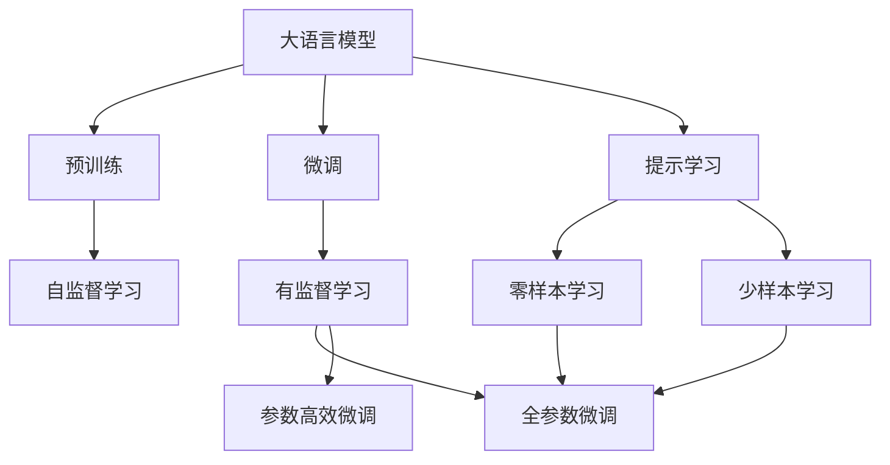
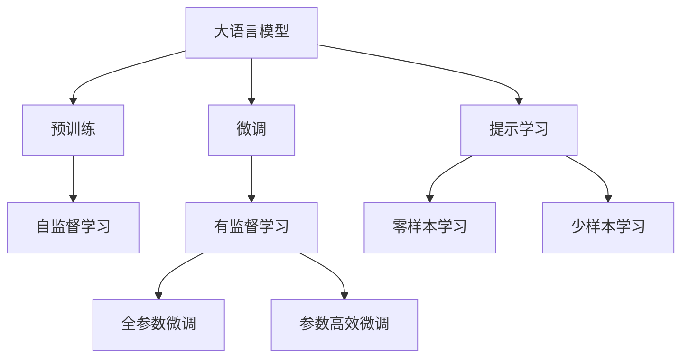
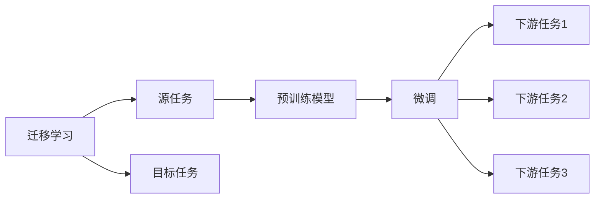
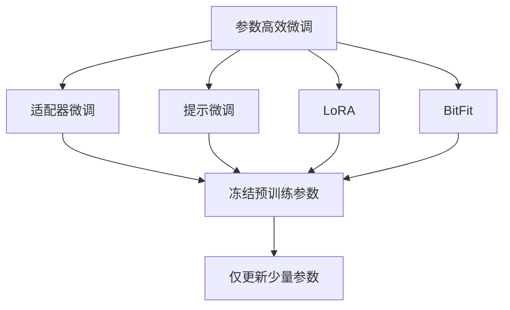
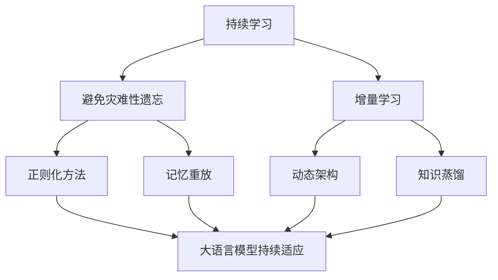
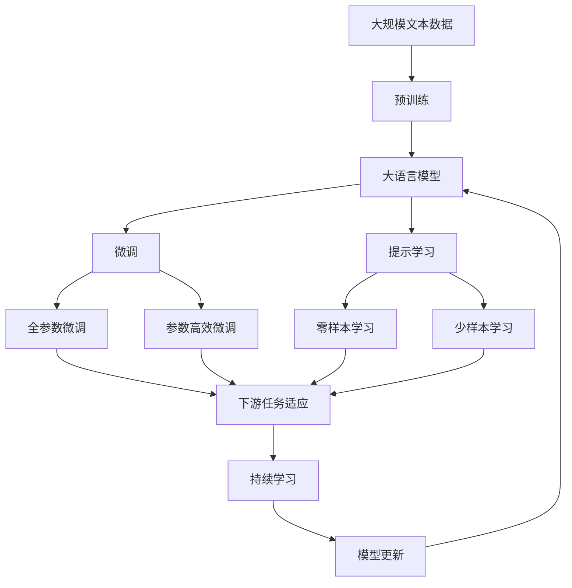

                 

# 大语言模型原理与工程实践：思维链提示

> 关键词：大语言模型,思维链,提示学习,Prompt Engineering,自然语言处理(NLP),深度学习

## 1. 背景介绍

### 1.1 问题由来

近年来，随着深度学习技术的快速发展，大规模语言模型在大自然语言处理（Natural Language Processing, NLP）领域取得了巨大的突破。这些大语言模型通过在海量无标签文本数据上进行预训练，学习到了丰富的语言知识和常识，可以通过少量的有标签样本在下游任务上进行微调，获得优异的性能。其中最具代表性的大模型包括OpenAI的GPT系列模型、Google的BERT、T5等。

然而，由于预训练语料的广泛性和泛化能力的不足，这些通用的大语言模型在特定领域应用时，效果往往难以达到实际应用的要求。因此，如何针对特定任务进行大模型微调，提升模型性能，成为了当前大语言模型研究和应用的一个热点问题。

### 1.2 问题核心关键点

目前，大语言模型微调的主流范式是基于监督学习的微调方法。即收集该任务的少量标注数据，将预训练模型当作初始化参数，通过有监督地训练来优化模型在该任务上的性能。这种微调范式简单高效，可以显著提升模型在特定任务上的表现。

微调的关键在于如何避免过拟合，同时最大程度发挥预训练模型学到的知识。目前主流的做法包括：
- 选择合适的学习率。相比从头训练，微调通常需要更小的学习率，以免破坏预训练的权重。
- 应用正则化技术。如L2正则、Dropout、Early Stopping等，防止模型过度适应小规模训练集。
- 保留预训练的部分层。如Transformer的底层，只微调顶层，减少需优化的参数。
- 数据增强。通过对训练样本改写、回译等方式丰富训练集多样性。
- 对抗训练。加入对抗样本，提高模型鲁棒性。
- 提示学习。通过在输入文本中添加提示模板，引导大语言模型进行特定任务的推理和生成。

目前，基于大模型微调的方法已经在问答、对话、摘要、翻译、情感分析等诸多NLP任务上取得了优异的效果，成为NLP技术落地应用的重要手段。

### 1.3 问题研究意义

研究大语言模型的微调方法，对于拓展大模型的应用范围，提升下游任务的性能，加速NLP技术的产业化进程，具有重要意义：

1. 降低应用开发成本。基于成熟的大模型进行微调，可以显著减少从头开发所需的数据、计算和人力等成本投入。
2. 提升模型效果。微调使得通用大模型更好地适应特定任务，在应用场景中取得更优表现。
3. 加速开发进度。standing on the shoulders of giants，微调使得开发者可以更快地完成任务适配，缩短开发周期。
4. 带来技术创新。微调范式促进了对预训练-微调的深入研究，催生了提示学习、少样本学习等新的研究方向。
5. 赋能产业升级。微调使得NLP技术更容易被各行各业所采用，为传统行业数字化转型升级提供新的技术路径。

## 2. 核心概念与联系

### 2.1 核心概念概述

为更好地理解基于提示学习的大语言模型微调方法，本节将介绍几个密切相关的核心概念：

- 大语言模型(Large Language Model, LLM)：以自回归(如GPT)或自编码(如BERT)模型为代表的大规模预训练语言模型。通过在大规模无标签文本语料上进行预训练，学习通用的语言表示，具备强大的语言理解和生成能力。

- 预训练(Pre-training)：指在大规模无标签文本语料上，通过自监督学习任务训练通用语言模型的过程。常见的预训练任务包括言语建模、遮挡语言模型等。预训练使得模型学习到语言的通用表示。

- 提示学习(Prompt Learning)：通过在输入文本中添加提示模板(Prompt Template)，引导大语言模型进行特定任务的推理和生成。可以在不更新模型参数的情况下，实现零样本或少样本学习。

- 自然语言处理(Natural Language Processing, NLP)：涉及计算机科学、人工智能和语言学等多个领域的交叉学科，研究如何使计算机能够理解和生成人类语言。

- 深度学习(Deep Learning)：一类基于多层神经网络模型的人工智能技术，主要用于图像、语音、文本等数据类型的处理和分析。

- 学习率(Learning Rate)：在优化算法中，每一步更新模型参数时的步长。适当的学习率能够加快模型收敛，但过大的学习率可能导致过拟合，过小的学习率则可能导致收敛过慢。

- 正则化(Regularization)：用于防止过拟合的技术，如L2正则、Dropout等，通过限制模型参数的大小或随机丢弃部分神经元，减少模型复杂度。

- 对抗训练(Adversarial Training)：通过在训练集中引入对抗样本，使模型能够识别和抵抗恶意攻击，提高鲁棒性。

- 少样本学习(Few-shot Learning)：指在只有少量标注样本的情况下，模型能够快速适应新任务的学习方法。

- 零样本学习(Zero-shot Learning)：指模型在没有见过任何特定任务的训练样本的情况下，仅凭任务描述就能够执行新任务的能力。

这些核心概念之间的逻辑关系可以通过以下Mermaid流程图来展示：



这个流程图展示了大语言模型的核心概念及其之间的关系：

1. 大语言模型通过预训练获得基础能力。
2. 微调是对预训练模型进行任务特定的优化，可以分为全参数微调和参数高效微调。
3. 提示学习是一种不更新模型参数的方法，可以实现零样本和少样本学习。
4. 迁移学习是连接预训练模型与下游任务的桥梁，可以通过微调或提示学习来实现。

### 2.2 概念间的关系

这些核心概念之间存在着紧密的联系，形成了大语言模型的学习和应用框架。下面我通过几个Mermaid流程图来展示这些概念之间的关系。

#### 2.2.1 大语言模型的学习范式



这个流程图展示了大语言模型的三种主要学习范式：预训练、微调和提示学习。预训练主要采用自监督学习方法，而微调则是有监督学习的过程。提示学习可以实现零样本和少样本学习。微调又可以分为全参数微调和参数高效微调两种方式。

#### 2.2.2 迁移学习与微调的关系



这个流程图展示了迁移学习的基本原理，以及它与微调的关系。迁移学习涉及源任务和目标任务，预训练模型在源任务上学习，然后通过微调适应各种下游任务（目标任务）。

#### 2.2.3 参数高效微调方法



这个流程图展示了几种常见的参数高效微调方法，包括适配器微调、提示微调、LoRA和BitFit。这些方法的共同特点是冻结大部分预训练参数，只更新少量参数，从而提高微调效率。

#### 2.2.4 持续学习在大语言模型中的应用



这个流程图展示了持续学习在大语言模型中的应用。持续学习的主要目标是避免灾难性遗忘和实现增量学习。通过正则化方法、记忆重放、动态架构和知识蒸馏等技术，可以使大语言模型持续适应新的任务和数据。

### 2.3 核心概念的整体架构

最后，我们用一个综合的流程图来展示这些核心概念在大语言模型微调过程中的整体架构：



这个综合流程图展示了从预训练到微调，再到持续学习的完整过程。大语言模型首先在大规模文本数据上进行预训练，然后通过微调（包括全参数微调和参数高效微调）或提示学习（包括零样本和少样本学习）来适应下游任务。最后，通过持续学习技术，模型可以不断更新和适应新的任务和数据。 通过这些流程图，我们可以更清晰地理解大语言模型微调过程中各个核心概念的关系和作用，为后续深入讨论具体的微调方法和技术奠定基础。

## 3. 核心算法原理 & 具体操作步骤
### 3.1 算法原理概述

基于提示学习的大语言模型微调，本质上是一个无监督的细粒度迁移学习过程。其核心思想是：将预训练的大语言模型视作一个强大的"特征提取器"，通过在输入文本中添加特定的提示模板，引导模型进行特定任务的推理和生成。

形式化地，假设预训练语言模型为 $M_{\theta}$，其中 $\theta$ 为预训练得到的模型参数。给定下游任务 $T$ 的输入文本 $x$ 和对应的提示模板 $P$，微调的目标是找到新的模型参数 $\hat{\theta}$，使得：

$$
\hat{\theta}=\mathop{\arg\min}_{\theta} \mathcal{L}(M_{\theta}(x),P)
$$

其中 $\mathcal{L}$ 为针对任务 $T$ 设计的损失函数，用于衡量模型输出与提示模板之间的差异。常见的损失函数包括BLEU分数、ROUGE分数、相关度分数等。

通过梯度下降等优化算法，微调过程不断更新模型参数 $\theta$，最小化损失函数 $\mathcal{L}$，使得模型输出逼近提示模板。由于 $\theta$ 已经通过预训练获得了较好的初始化，因此即便在不添加标注数据的情况下，也能较快收敛到理想的模型参数 $\hat{\theta}$。

### 3.2 算法步骤详解

基于提示学习的大语言模型微调一般包括以下几个关键步骤：

**Step 1: 准备预训练模型和数据集**
- 选择合适的预训练语言模型 $M_{\theta}$ 作为初始化参数，如 BERT、GPT等。
- 准备下游任务 $T$ 的输入文本 $x$ 和对应的提示模板 $P$。

**Step 2: 设计提示模板**
- 根据任务类型，设计合适的提示模板 $P$。提示模板通常包括对输入文本的描述、任务要求、推理路径等。
- 对于分类任务，提示模板可能类似于 "给出文本 $x$ 所属的类别" 或 "文本 $x$ 是否包含关键词" 等。
- 对于生成任务，提示模板可能类似于 "为文本 $x$ 生成摘要" 或 "为文本 $x$ 生成对话回复" 等。

**Step 3: 设置微调超参数**
- 选择合适的优化算法及其参数，如 AdamW、SGD 等，设置学习率、批大小、迭代轮数等。
- 设置正则化技术及强度，包括权重衰减、Dropout、Early Stopping 等。
- 确定提示模板在输入文本中的位置，如在文本开头、中间或结尾。

**Step 4: 执行梯度训练**
- 将输入文本 $x$ 和对应的提示模板 $P$ 作为输入，前向传播计算损失函数。
- 反向传播计算参数梯度，根据设定的优化算法和学习率更新模型参数。
- 周期性在验证集上评估模型性能，根据性能指标决定是否触发 Early Stopping。
- 重复上述步骤直到满足预设的迭代轮数或 Early Stopping 条件。

**Step 5: 测试和部署**
- 在测试集上评估微调后模型 $M_{\hat{\theta}}$ 的性能，对比微调前后的精度提升。
- 使用微调后的模型对新样本进行推理预测，集成到实际的应用系统中。
- 持续收集新的数据，定期重新微调模型，以适应数据分布的变化。

以上是基于提示学习的大语言模型微调的一般流程。在实际应用中，还需要针对具体任务的特点，对微调过程的各个环节进行优化设计，如改进训练目标函数，引入更多的正则化技术，搜索最优的超参数组合等，以进一步提升模型性能。

### 3.3 算法优缺点

基于提示学习的大语言模型微调方法具有以下优点：
1. 简单高效。只需要设计合适的提示模板，即可对预训练模型进行快速适配，实现微调。
2. 灵活多样。提示模板的设计可以高度定制，适用于各种NLP任务。
3. 参数高效。提示学习可以有效地减少微调所需参数量，提高模型训练速度。
4. 效果显著。在多个NLP任务上，基于提示学习的方法已经刷新了多项最先进性能指标。

同时，该方法也存在一定的局限性：
1. 提示模板的设计依赖经验。提示模板的设计需要丰富的领域知识和理解，需要人工介入。
2. 提示模板的长度限制。过长的提示模板可能导致模型难以捕捉到文本的主要信息。
3. 提示模板的多样性问题。不同任务可能需要设计不同的提示模板，增加了微调设计的复杂度。
4. 提示模板的泛化能力。设计良好的提示模板需要具备一定的泛化能力，以便在不同数据集上也能取得良好的效果。

尽管存在这些局限性，但就目前而言，基于提示学习的微调方法仍是大语言模型应用的最主流范式。未来相关研究的重点在于如何进一步降低提示模板的设计复杂度，提高其泛化能力，以及结合更多自然语言理解和生成技术，提升微调的效果。

### 3.4 算法应用领域

基于大语言模型提示学习的微调方法，在NLP领域已经得到了广泛的应用，覆盖了几乎所有常见任务，例如：

- 文本分类：如情感分析、主题分类、意图识别等。通过提示模板，引导模型学习文本-类别映射。
- 命名实体识别：识别文本中的人名、地名、机构名等特定实体。通过提示模板，指导模型识别实体边界和类型。
- 关系抽取：从文本中抽取实体之间的语义关系。通过提示模板，引导模型学习实体-关系三元组。
- 问答系统：对自然语言问题给出答案。将问题-答案对作为提示模板，训练模型学习匹配答案。
- 机器翻译：将源语言文本翻译成目标语言。通过提示模板，引导模型学习语言-语言映射。
- 文本摘要：将长文本压缩成简短摘要。通过提示模板，指导模型抓取要点。
- 对话系统：使机器能够与人自然对话。将对话历史和当前问题作为输入，微调模型进行回复生成。

除了上述这些经典任务外，提示学习技术也被创新性地应用到更多场景中，如可控文本生成、常识推理、代码生成、数据增强等，为NLP技术带来了全新的突破。随着提示学习方法的不断进步，相信NLP技术将在更广阔的应用领域大放异彩。

## 4. 数学模型和公式 & 详细讲解  
### 4.1 数学模型构建

本节将使用数学语言对基于提示学习的大语言模型微调过程进行更加严格的刻画。

记预训练语言模型为 $M_{\theta}$，其中 $\theta$ 为预训练得到的模型参数。假设微调任务的输入文本为 $x$，对应的提示模板为 $P$。微调的目标是找到新的模型参数 $\hat{\theta}$，使得：

$$
\hat{\theta}=\mathop{\arg\min}_{\theta} \mathcal{L}(M_{\theta}(x),P)
$$

在实践中，我们通常使用基于梯度的优化算法（如SGD、Adam等）来近似求解上述最优化问题。设 $\eta$ 为学习率，$\lambda$ 为正则化系数，则参数的更新公式为：

$$
\theta \leftarrow \theta - \eta \nabla_{\theta}\mathcal{L}(\theta) - \eta\lambda\theta
$$

其中 $\nabla_{\theta}\mathcal{L}(\theta)$ 为损失函数对参数 $\theta$ 的梯度，可通过反向传播算法高效计算。

### 4.2 公式推导过程

以下我们以二分类任务为例，推导BLEU分数及其梯度的计算公式。

假设模型 $M_{\theta}$ 在输入 $x$ 上的输出为 $\hat{y}=M_{\theta}(x) \in [0,1]$，表示样本属于正类的概率。真实标签 $y \in \{0,1\}$。提示模板 $P$ 中包含了需要模型回答的问题描述和预期答案，例如 "文本 $x$ 的情感是什么"。

BLEU分数是一种常用的评估机器翻译和摘要生成的指标，其计算公式为：

$$
\text{BLEU} = \text{BLEU}_1 \times \min\{\text{BLEU}_1, \text{BLEU}_2, \text{BLEU}_3, \text{BLEU}_4\}
$$

其中 $\text{BLEU}_k$ 表示与参考文本中 $k$ 个相邻词完全匹配的分数。

对于分类任务，提示模板 $P$ 可以表示为 "文本 $x$ 的情感是什么"，模型输出为 $\hat{y}=M_{\theta}(x) \in [0,1]$。BLEU分数可以衡量模型输出与提示模板的匹配程度。具体来说，假设提示模板 $P$ 中包含单词 $t_1$ 到 $t_4$，参考答案为 "正面"，则 BLEU分数可以表示为：

$$
\text{BLEU} = \min\{\delta_{t_1}, \delta_{t_2}, \delta_{t_3}, \delta_{t_4}\}
$$

其中 $\delta_t$ 表示模型预测出的词汇 $t$ 与提示模板中的词汇是否匹配，即 $\delta_t = \hat{y}[t] \times I(t \in P)$，其中 $I$ 为指示函数。

将BLEU分数代入损失函数，得到：

$$
\mathcal{L}(\theta) = -\text{BLEU}(\theta, P)
$$

根据链式法则，损失函数对参数 $\theta_k$ 的梯度为：

$$
\frac{\partial \mathcal{L}(\theta)}{\partial \theta_k} = -\frac{\partial \text{BLEU}(\theta, P)}{\partial \theta_k}
$$

具体计算时，BLEU分数的梯度可以表示为：

$$
\frac{\partial \text{BLEU}(\theta, P)}{\partial \theta_k} = \sum_{i=1}^4 \frac{\partial \delta_{t_i}}{\partial \theta_k} \times \frac{\partial \delta_{t_{i-1}}}{\partial \delta_{t_i}}
$$

其中 $\delta_{t_i}$ 的梯度可以表示为：

$$
\frac{\partial \delta_{t_i}}{\partial \theta_k} = \frac{\partial \hat{y}}{\partial \theta_k} \times I(t_i \in P) + \delta_{t_{i-1}} \times \frac{\partial \hat{y}}{\partial \theta_k} \times \frac{\partial \delta_{t_{i-1}}}{\partial \hat{y}}
$$

将 $\delta_{t_i}$ 的梯度代入 BLEU 分数的梯度计算公式，可以得到完整的损失函数对参数 $\theta$ 的梯度计算公式。在得到损失函数的梯度后，即可带入参数更新公式，完成模型的迭代优化。重复上述过程直至收敛，最终得到适应下游任务的最优模型参数 $\theta^*$。

## 5. 项目实践：代码实例和详细解释说明
### 5.1 开发环境搭建

在进行提示学习实践前，我们需要准备好开发环境。以下是使用Python进行PyTorch开发的环境配置流程：

1. 安装Anaconda：从官网下载并安装Anaconda，用于创建独立的Python环境。

2. 创建并激活虚拟环境：
```bash
conda create -n pytorch-env python=3.8 
conda activate pytorch-env
```

3. 安装PyTorch：根据CUDA版本，从官网获取对应的安装命令。例如：
```bash
conda install pytorch torchvision torchaudio cudatoolkit=11.1 -c pytorch -c conda-forge
```

4. 安装Transformers库：
```bash
pip install transformers
```

5. 安装各类工具包：
```bash
pip install numpy pandas scikit-learn matplotlib tqdm jupyter notebook ipython
```

完成上述步骤后，即可在`pytorch-env`环境中开始提示学习实践。

### 5.2 源代码详细实现

这里我们以问答系统为例，给出使用Transformers库对BERT模型进行提示学习的PyTorch代码实现。

首先，定义问答任务的数据处理函数：

```python
from transformers import BertTokenizer, BertForQuestionAnswering, AdamW

class QADataset(Dataset):
    def __init__(self, texts, queries, tokenizer, max_len=128):
        self.texts = texts
        self.queries = queries
        self.tokenizer = tokenizer
        self.max_len = max_len
        
    def __len__(self):
        return len(self.texts)
    
    def __getitem__(self, item):
        text = self.texts[item]
        query = self.queries[item]
        
        encoding = self.tokenizer(text, return_tensors='pt', max_length=self.max_len, padding='max_length', truncation=True)
        input_ids = encoding['input_ids'][0]
        attention_mask = encoding['attention_mask'][0]
        return {'input_ids': input_ids, 
                'attention_mask': attention_mask,
                'labels': [self.tokenizer(query, return_tensors='pt')['input_ids'][0]]}

# 初始化预训练模型和提示模板
tokenizer = BertTokenizer.from_pretrained('bert-base-cased')
model = BertForQuestionAnswering.from_pretrained('bert-base-cased')
prompts = ["这篇文章在讲什么内容？", "为什么现在不能去旅行？", "你能推荐一些好书吗？"]

# 准备训练集和验证集
train_dataset = QADataset(train_texts, train_queries, tokenizer)
dev_dataset = QADataset(dev_texts, dev_queries, tokenizer)
```

然后，定义模型和优化器：

```python
optimizer = AdamW(model.parameters(), lr=2e-5)
```

接着，定义训练和评估函数：

```python
from torch.utils.data import DataLoader
from tqdm import tqdm
from sklearn.metrics import accuracy_score

device = torch.device('cuda') if torch.cuda.is_available() else torch.device('cpu')
model.to(device)

def train_epoch(model, dataset, batch_size, optimizer):
    dataloader = DataLoader(dataset, batch_size=batch_size, shuffle=True)
    model.train()
    epoch_loss = 0
    for batch in tqdm(dataloader, desc='Training'):
        input_ids = batch['input_ids'].to(device)
        attention_mask = batch['attention_mask'].to(device)
        labels = batch['labels']
        model.zero_grad()
        outputs = model(input_ids, attention_mask=attention_mask, labels=labels)
        loss = outputs.loss
        epoch_loss += loss.item()
        loss.backward()
        optimizer.step()
    return epoch_loss / len(dataloader)

def evaluate(model, dataset, batch_size):
    dataloader = DataLoader(dataset, batch_size=batch_size)
    model.eval()
    preds, labels = [], []
    with torch.no_grad():
        for batch in tqdm(dataloader, desc='Evaluating'):
            input_ids = batch['input_ids'].to(device)
            attention_mask = batch['attention_mask'].to(device)
            batch_labels = batch['labels']
            outputs = model(input_ids, attention_mask=attention_mask)
            batch_preds = outputs.logits.argmax(dim=2).to('cpu').tolist()
            batch_labels = batch_labels.to('cpu').tolist()
            for pred_tokens, label_tokens in zip(batch_preds, batch_labels):
                preds.append(pred_tokens[:len(label_tokens)])


