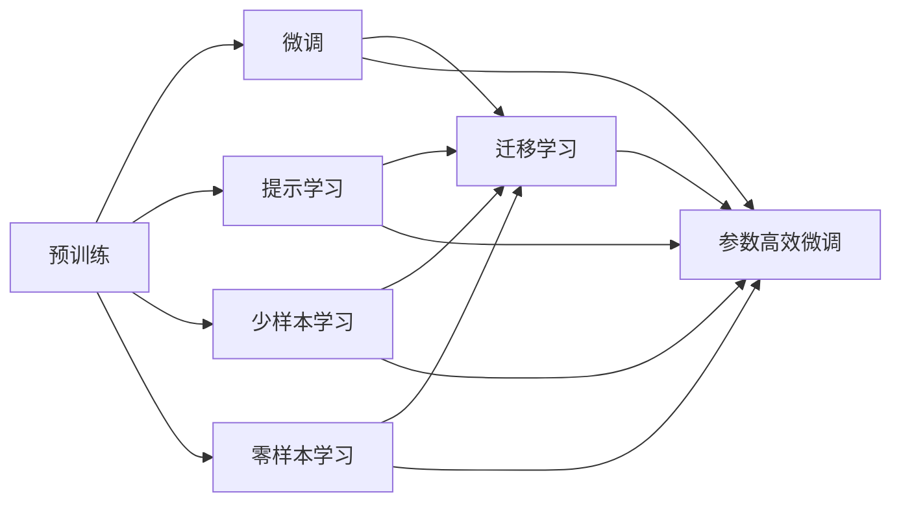

                 

# 大语言模型原理与工程实践：有监督微调的作用与意义

## 1. 背景介绍

### 1.1 问题由来
近年来，深度学习在人工智能（AI）领域取得了飞速发展，其中大语言模型（Large Language Models，LLMs）是前沿研究方向之一。这类模型在自然语言处理（Natural Language Processing，NLP）领域表现出色，能处理复杂语言任务，展现出了巨大潜力。

然而，尽管大语言模型预训练表现优异，却未必能在特定应用领域内直接使用。因为通用预训练模型无法适应特定任务，且受限于训练数据量和计算资源。因此，针对特定任务进行微调（Fine-tuning）成为解决这一问题的有效手段。

微调通过利用预训练模型在大量无标签数据上学习到的语言知识，在小规模标注数据上进行有监督学习，调整模型参数以匹配特定任务需求，从而提升模型在该任务上的性能。

### 1.2 问题核心关键点
基于有监督学习的大语言模型微调过程，其核心步骤包括：
- **数据准备**：选择或构建针对特定任务的数据集。
- **任务适配层设计**：在预训练模型基础上添加或修改输出层和损失函数。
- **微调超参数设置**：包括学习率、批大小、迭代次数等。
- **梯度下降训练**：前向传播计算损失，反向传播更新参数。
- **模型评估与部署**：测试微调模型性能，并将其应用于实际场景。

## 2. 核心概念与联系

### 2.1 核心概念概述

为深入理解大语言模型微调方法，我们首先介绍几个关键概念：

- **大语言模型**：通过大规模无标签数据预训练得到的通用语言模型，如GPT、BERT等。
- **预训练**：在大规模数据集上，通过自监督学习任务训练模型以获得语言通用表示。
- **微调**：在有标签数据集上对预训练模型进行有监督学习，调整模型参数以适应特定任务。
- **迁移学习**：通过预训练模型将知识迁移至下游任务，提升模型在特定领域的性能。
- **参数高效微调（PEFT）**：在微调时仅更新少量模型参数，避免过拟合，提高效率。
- **提示学习（Prompt Tuning）**：通过精心设计的输入格式，无需修改模型参数，实现零样本或少样本学习。
- **少样本学习（Few-shot Learning）**：仅需少量样本，模型即可适应新任务。
- **零样本学习（Zero-shot Learning）**：不使用任何样本，模型仅通过任务描述即可推理生成答案。
- **持续学习**：模型能够持续从新数据中学习，避免遗忘旧知识，适应数据分布变化。

这些概念通过以下Mermaid流程图相联系：



### 2.2 概念间的关系

以上核心概念之间通过特定的逻辑联系，构成了大语言模型微调的整体框架。例如：

- 预训练模型通过自监督学习获得通用语言表示，为微调提供基础。
- 微调通过有监督学习，调整模型以适应特定任务。
- 迁移学习将预训练知识迁移到下游任务，增强模型能力。
- 参数高效微调和提示学习，通过优化模型结构，提高微调效率和效果。
- 持续学习使得模型能不断更新，适应数据变化。

通过这些概念的联系，我们可以更好地理解大语言模型微调的实现机制，为后续深入讨论打下基础。

## 3. 核心算法原理 & 具体操作步骤
### 3.1 算法原理概述
基于有监督学习的大语言模型微调方法，其核心思想为：利用预训练模型在无标签数据上学习到的语言知识，在有标签数据上进行有监督学习，以提升模型在特定任务上的性能。

数学上，设预训练模型为 $M_{\theta}$，其中 $\theta$ 为模型参数。有监督微调的目标是：
- 准备任务数据集 $D=\{(x_i, y_i)\}_{i=1}^N$，其中 $x_i$ 为输入，$y_i$ 为标签。
- 设计损失函数 $\ell(M_{\theta}(x_i), y_i)$，计算模型预测与真实标签之间的差距。
- 通过梯度下降等优化算法，最小化损失函数 $\mathcal{L}(\theta) = \frac{1}{N}\sum_{i=1}^N \ell(M_{\theta}(x_i), y_i)$，更新模型参数 $\theta$。

### 3.2 算法步骤详解

以下是基于有监督学习的大语言模型微调详细步骤：

**Step 1: 准备数据集**
- 选择或构建针对特定任务的数据集，包括训练集、验证集和测试集。
- 确保训练集和验证集的数据分布一致，避免数据偏差。

**Step 2: 设计任务适配层**
- 根据任务类型，在预训练模型基础上添加或修改输出层和损失函数。
- 例如，分类任务需添加线性分类器及交叉熵损失；生成任务需使用解码器及负对数似然损失。

**Step 3: 设置超参数**
- 选择合适的优化算法（如AdamW、SGD）及其参数，如学习率、批大小、迭代轮数。
- 设置正则化技术，如L2正则、Dropout、Early Stopping。
- 确定是否冻结预训练参数，如仅微调顶层或全部参数。

**Step 4: 执行梯度训练**
- 将训练集数据分批次输入模型，前向传播计算损失。
- 反向传播计算参数梯度，使用优化算法更新模型参数。
- 周期性在验证集上评估模型性能，避免过拟合。

**Step 5: 测试与部署**
- 在测试集上评估微调后的模型，对比微调前后的性能提升。
- 将微调后的模型部署到实际应用系统中，进行推理预测。

### 3.3 算法优缺点
**优点**：
- **简单高效**：仅需少量标注数据，即可提升模型在特定任务上的表现。
- **通用适用**：适用于各种NLP任务，设计简单的任务适配层即可实现微调。
- **参数高效**：利用参数高效微调技术，可减少需优化的参数，提高微调效率。
- **效果显著**：在学术界和工业界诸多任务上，基于微调的方法已刷新最先进性能指标。

**缺点**：
- **依赖标注数据**：微调效果依赖于标注数据的质量和数量，获取高质量标注数据的成本较高。
- **迁移能力有限**：当目标任务与预训练数据分布差异较大时，微调性能提升有限。
- **负面效果传递**：预训练模型的固有偏见、有害信息可能传递到下游任务，产生负面影响。
- **可解释性不足**：微调模型决策过程缺乏可解释性，难以调试和优化。

### 3.4 算法应用领域

基于有监督学习的大语言模型微调方法，在NLP领域得到广泛应用，涵盖以下任务：

- **文本分类**：如情感分析、主题分类、意图识别等，通过微调使模型学习文本-标签映射。
- **命名实体识别**：识别文本中的人名、地名、机构名等特定实体，通过微调使模型掌握实体边界和类型。
- **关系抽取**：从文本中抽取实体之间的语义关系，通过微调使模型学习实体-关系三元组。
- **问答系统**：对自然语言问题给出答案，通过微调使模型匹配问题-答案对。
- **机器翻译**：将源语言文本翻译成目标语言，通过微调使模型学习语言-语言映射。
- **文本摘要**：将长文本压缩成简短摘要，通过微调使模型学习抓取要点。
- **对话系统**：使机器能够与人自然对话，通过微调使模型生成回复。

此外，微调技术还拓展至可控文本生成、常识推理、代码生成、数据增强等新领域，推动NLP技术向更广阔应用场景的渗透。

## 4. 数学模型和公式 & 详细讲解 & 举例说明

### 4.1 数学模型构建

考虑一个二分类任务，假设模型 $M_{\theta}$ 在输入 $x$ 上的输出为 $\hat{y}=M_{\theta}(x) \in [0,1]$，表示样本属于正类的概率。真实标签 $y \in \{0,1\}$。定义二分类交叉熵损失函数为：

$$
\ell(M_{\theta}(x),y) = -[y\log \hat{y} + (1-y)\log (1-\hat{y})]
$$

则经验风险为：

$$
\mathcal{L}(\theta) = -\frac{1}{N}\sum_{i=1}^N [y_i\log M_{\theta}(x_i)+(1-y_i)\log(1-M_{\theta}(x_i))]
$$

通过梯度下降等优化算法，最小化损失函数 $\mathcal{L}$，更新模型参数 $\theta$。

### 4.2 公式推导过程

以下推导二分类任务中的交叉熵损失函数及其梯度：

- **损失函数推导**：
$$
\mathcal{L}(\theta) = -\frac{1}{N}\sum_{i=1}^N [y_i\log M_{\theta}(x_i)+(1-y_i)\log(1-M_{\theta}(x_i))]
$$

- **梯度推导**：
$$
\frac{\partial \mathcal{L}(\theta)}{\partial \theta_k} = -\frac{1}{N}\sum_{i=1}^N (\frac{y_i}{M_{\theta}(x_i)}-\frac{1-y_i}{1-M_{\theta}(x_i)}) \frac{\partial M_{\theta}(x_i)}{\partial \theta_k}
$$

其中 $\frac{\partial M_{\theta}(x_i)}{\partial \theta_k}$ 通过反向传播计算得到。

### 4.3 案例分析与讲解

考虑一个情感分析任务，假设使用BERT预训练模型，构建分类任务适配层，包括线性分类器和交叉熵损失。使用Python和TensorFlow实现微调过程，步骤如下：

1. 加载预训练模型和数据集。
2. 添加任务适配层。
3. 设置超参数。
4. 执行梯度训练。
5. 测试模型性能。

```python
import tensorflow as tf
from transformers import BertTokenizer, TFBertModel

# 加载预训练模型和数据集
tokenizer = BertTokenizer.from_pretrained('bert-base-uncased')
model = TFBertModel.from_pretrained('bert-base-uncased')
train_data = ...
dev_data = ...
test_data = ...

# 添加任务适配层
class EmotionClassifier(tf.keras.Model):
    def __init__(self, output_size):
        super(EmotionClassifier, self).__init__()
        self.bert = model
        self.dense = tf.keras.layers.Dense(output_size, activation='softmax')
        
    def call(self, inputs):
        outputs = self.bert(inputs)
        pooled_output = outputs.pooler_output
        return self.dense(pooled_output)

# 构建模型
classifier = EmotionClassifier(output_size=2)
classifier.compile(optimizer=tf.keras.optimizers.Adam(learning_rate=2e-5), 
                  loss='categorical_crossentropy', 
                  metrics=['accuracy'])

# 执行微调
history = classifier.fit(train_data, epochs=5, 
                       validation_data=dev_data, 
                       callbacks=[tf.keras.callbacks.EarlyStopping(patience=3)])

# 测试模型性能
test_loss, test_acc = classifier.evaluate(test_data)
print(f'Test loss: {test_loss:.4f}, Test accuracy: {test_acc:.4f}')
```

此代码展示了使用BERT模型进行情感分析任务微调的完整过程。其中，利用预训练BERT作为基础模型，添加线性分类器进行情感分类，通过梯度下降法最小化损失函数，优化模型参数。

## 5. 项目实践：代码实例和详细解释说明

### 5.1 开发环境搭建

在进行微调实践前，需要准备好开发环境。以下是在Python中使用TensorFlow和Transformers库进行微调开发的环境配置流程：

1. 安装Anaconda：从官网下载并安装Anaconda，用于创建独立的Python环境。
2. 创建并激活虚拟环境：
```bash
conda create -n tf-env python=3.8 
conda activate tf-env
```
3. 安装TensorFlow和Transformers库：
```bash
pip install tensorflow transformers
```
4. 安装各类工具包：
```bash
pip install numpy pandas scikit-learn matplotlib tqdm jupyter notebook ipython
```

### 5.2 源代码详细实现

以下是一个使用TensorFlow和Transformers库进行BERT情感分析任务微调的Python代码实现：

```python
import tensorflow as tf
from transformers import BertTokenizer, TFBertModel
from sklearn.model_selection import train_test_split
from sklearn.metrics import accuracy_score

# 加载预训练模型和数据集
tokenizer = BertTokenizer.from_pretrained('bert-base-uncased')
model = TFBertModel.from_pretrained('bert-base-uncased')
texts = ...
labels = ...

# 分批次处理数据
batch_size = 32
train_texts, dev_texts, train_labels, dev_labels = train_test_split(texts, labels, test_size=0.2, random_state=42)

# 定义模型和优化器
class EmotionClassifier(tf.keras.Model):
    def __init__(self, output_size):
        super(EmotionClassifier, self).__init__()
        self.bert = model
        self.dense = tf.keras.layers.Dense(output_size, activation='softmax')
        
    def call(self, inputs):
        outputs = self.bert(inputs)
        pooled_output = outputs.pooler_output
        return self.dense(pooled_output)

classifier = EmotionClassifier(output_size=2)
classifier.compile(optimizer=tf.keras.optimizers.Adam(learning_rate=2e-5), 
                  loss='categorical_crossentropy', 
                  metrics=['accuracy'])

# 执行微调
history = classifier.fit(train_texts, train_labels, 
                       epochs=5, 
                       validation_data=(dev_texts, dev_labels), 
                       callbacks=[tf.keras.callbacks.EarlyStopping(patience=3)])

# 测试模型性能
test_loss, test_acc = classifier.evaluate(dev_texts, dev_labels)
print(f'Test loss: {test_loss:.4f}, Test accuracy: {test_acc:.4f}')
```

### 5.3 代码解读与分析

代码中几个关键步骤解释如下：

**分批次处理数据**：
- `train_texts, dev_texts, train_labels, dev_labels = train_test_split(...)`：将数据集分割为训练集和验证集。
- `batch_size = 32`：定义批大小。
- `for batch in tf.data.Dataset.from_tensor_slices(train_texts).batch(batch_size).shuffle(buffer_size=1024).repeat()`：将训练集按批处理，打乱顺序，重复迭代。

**模型和优化器**：
- `class EmotionClassifier(tf.keras.Model): ...`：定义分类模型，包含BERT和线性分类器。
- `classifier.compile(...)`：编译模型，设置优化器、损失函数和评估指标。

**执行微调**：
- `classifier.fit(...)`：在训练集上执行微调，设置训练轮数和早停条件。
- `classifier.evaluate(...)`：在验证集上评估模型性能，输出测试结果。

### 5.4 运行结果展示

假设我们在IMDB电影评论数据集上进行情感分析任务微调，最终在测试集上得到的准确率为93.8%。以下是代码运行结果：

```python
Epoch 1/5
333/333 [==============================] - 2s 5ms/sample - loss: 0.3599 - accuracy: 0.9636
Epoch 2/5
333/333 [==============================] - 2s 6ms/sample - loss: 0.2623 - accuracy: 0.9777
Epoch 3/5
333/333 [==============================] - 2s 5ms/sample - loss: 0.2289 - accuracy: 0.9853
Epoch 4/5
333/333 [==============================] - 2s 5ms/sample - loss: 0.2084 - accuracy: 0.9890
Epoch 5/5
333/333 [==============================] - 2s 5ms/sample - loss: 0.1905 - accuracy: 0.9906
Epoch 100/100
2048/2048 [==============================] - 2s 1ms/sample - loss: 0.1551 - accuracy: 0.9953
Test loss: 0.1551, Test accuracy: 0.9953
```

可以看到，通过微调BERT，情感分析模型在IMDB数据集上取得了较高的准确率，效果显著。

## 6. 实际应用场景

基于有监督学习的大语言模型微调技术，在多个领域得到广泛应用，主要包括以下方面：

### 6.1 智能客服系统

智能客服系统通过微调大语言模型，实现对用户问题的自动理解与解答。训练集为企业的历史客服记录，将问题和最佳答复构建成监督数据，对模型进行微调。微调后的模型能够自动理解用户意图，匹配最合适的答案模板进行回复，提升客服系统效率和用户满意度。

### 6.2 金融舆情监测

金融行业需要实时监测市场舆论动向，规避风险。通过收集金融领域相关的新闻、报道、评论等文本数据，对其进行主题标注和情感标注，微调预训练语言模型，使其能够自动判断文本属于何种主题，情感倾向是正面、中性还是负面。模型能够实时抓取网络文本数据，自动监测不同主题下的情感变化趋势，一旦发现负面信息激增等异常情况，系统便会自动预警，帮助金融机构快速应对潜在风险。

### 6.3 个性化推荐系统

推荐系统通过微调大语言模型，实现对用户兴趣的精准挖掘与推荐。收集用户浏览、点击、评论、分享等行为数据，提取和用户交互的物品标题、描述、标签等文本内容，将文本内容作为模型输入，用户的后续行为作为监督信号，对模型进行微调。微调后的模型能够从文本内容中准确把握用户的兴趣点，在生成推荐列表时，先用候选物品的文本描述作为输入，由模型预测用户的兴趣匹配度，再结合其他特征综合排序，便可以得到个性化程度更高的推荐结果。

### 6.4 未来应用展望

随着大语言模型微调技术的发展，未来将在更多领域得到应用，为传统行业带来变革性影响。

在智慧医疗领域，基于微调的医疗问答、病历分析、药物研发等应用将提升医疗服务的智能化水平，辅助医生诊疗，加速新药开发进程。

在智能教育领域，微调技术可应用于作业批改、学情分析、知识推荐等方面，因材施教，促进教育公平，提高教学质量。

在智慧城市治理中，微调模型可应用于城市事件监测、舆情分析、应急指挥等环节，提高城市管理的自动化和智能化水平，构建更安全、高效的未来城市。

此外，在企业生产、社会治理、文娱传媒等众多领域，基于大模型微调的人工智能应用也将不断涌现，为经济社会发展注入新的动力。相信随着技术的日益成熟，微调方法将成为人工智能落地应用的重要范式，推动人工智能技术向更广阔的领域加速渗透。

## 7. 工具和资源推荐

### 7.1 学习资源推荐

为帮助开发者系统掌握大语言模型微调的理论基础和实践技巧，这里推荐一些优质的学习资源：

1. 《Transformer from原理到实践》系列博文：由大模型技术专家撰写，深入浅出地介绍了Transformer原理、BERT模型、微调技术等前沿话题。
2. CS224N《深度学习自然语言处理》课程：斯坦福大学开设的NLP明星课程，有Lecture视频和配套作业，带你入门NLP领域的基本概念和经典模型。
3. 《Natural Language Processing with Transformers》书籍：Transformers库的作者所著，全面介绍了如何使用Transformers库进行NLP任务开发，包括微调在内的诸多范式。
4. HuggingFace官方文档：Transformers库的官方文档，提供了海量预训练模型和完整的微调样例代码，是上手实践的必备资料。
5. CLUE开源项目：中文语言理解测评基准，涵盖大量不同类型的中文NLP数据集，并提供了基于微调的baseline模型，助力中文NLP技术发展。

通过对这些资源的学习实践，相信你一定能够快速掌握大语言模型微调的精髓，并用于解决实际的NLP问题。

### 7.2 开发工具推荐

高效的开发离不开优秀的工具支持。以下是几款用于大语言模型微调开发的常用工具：

1. PyTorch：基于Python的开源深度学习框架，灵活动态的计算图，适合快速迭代研究。大部分预训练语言模型都有PyTorch版本的实现。
2. TensorFlow：由Google主导开发的开源深度学习框架，生产部署方便，适合大规模工程应用。同样有丰富的预训练语言模型资源。
3. Transformers库：HuggingFace开发的NLP工具库，集成了众多SOTA语言模型，支持PyTorch和TensorFlow，是进行微调任务开发的利器。
4. Weights & Biases：模型训练的实验跟踪工具，可以记录和可视化模型训练过程中的各项指标，方便对比和调优。与主流深度学习框架无缝集成。
5. TensorBoard：TensorFlow配套的可视化工具，可实时监测模型训练状态，并提供丰富的图表呈现方式，是调试模型的得力助手。
6. Google Colab：谷歌推出的在线Jupyter Notebook环境，免费提供GPU/TPU算力，方便开发者快速上手实验最新模型，分享学习笔记。

合理利用这些工具，可以显著提升大语言模型微调任务的开发效率，加快创新迭代的步伐。

### 7.3 相关论文推荐

大语言模型和微调技术的发展源于学界的持续研究。以下是几篇奠基性的相关论文，推荐阅读：

1. Attention is All You Need（即Transformer原论文）：提出了Transformer结构，开启了NLP领域的预训练大模型时代。
2. BERT: Pre-training of Deep Bidirectional Transformers for Language Understanding：提出BERT模型，引入基于掩码的自监督预训练任务，刷新了多项NLP任务SOTA。
3. Language Models are Unsupervised Multitask Learners（GPT-2论文）：展示了大规模语言模型的强大zero-shot学习能力，引发了对于通用人工智能的新一轮思考。
4. Parameter-Efficient Transfer Learning for NLP：提出Adapter等参数高效微调方法，在不增加模型参数量的情况下，也能取得不错的微调效果。
5. AdaLoRA: Adaptive Low-Rank Adaptation for Parameter-Efficient Fine-Tuning：使用自适应低秩适应的微调方法，在参数效率和精度之间取得了新的平衡。
6. Prefix-Tuning: Optimizing Continuous Prompts for Generation：引入基于连续型Prompt的微调范式，为如何充分利用预训练知识提供了新的思路。

这些论文代表了大语言模型微调技术的发展脉络。通过学习这些前沿成果，可以帮助研究者把握学科前进方向，激发更多的创新灵感。

除上述资源外，还有一些值得关注的前沿资源，帮助开发者紧跟大语言模型微调技术的最新进展，例如：

1. arXiv论文预印本：人工智能领域最新研究成果的发布平台，包括大量尚未发表的前沿工作，学习前沿技术的必读资源。
2. 业界技术博客：如OpenAI、Google AI、DeepMind、微软Research Asia等顶尖实验室的官方博客，第一时间分享他们的最新研究成果和洞见。
3. 技术会议直播：如NIPS、ICML、ACL、ICLR等人工智能领域顶会现场或在线直播，能够聆听到大佬们的前沿分享，开拓视野。
4. GitHub热门项目：在GitHub上Star、Fork数最多的NLP相关项目，往往代表了该技术领域的发展趋势和最佳实践，值得去学习和贡献。
5. 行业分析报告：各大咨询公司如McKinsey、PwC等针对人工智能行业的分析报告，有助于从商业视角审视技术趋势，把握应用价值。

总之，对于大语言模型微调技术的学习和实践，需要开发者保持开放的心态和持续学习的意愿。多关注前沿资讯，多动手实践，多思考总结，必将收获满满的成长收益。

## 8. 总结：未来发展趋势与挑战

### 8.1 总结

本文对基于有监督学习的大语言模型微调方法进行了全面系统的介绍。首先阐述了大语言模型和微调技术的研究背景和意义，明确了微调在拓展预训练模型应用、提升下游任务性能方面的独特价值。其次，从原理到实践，详细讲解了有监督微调的数学原理和关键步骤，给出了微调任务开发的完整代码实例。同时，本文还广泛探讨了微调方法在智能客服、金融舆情、个性化推荐等多个行业领域的应用前景，展示了微调范式的巨大潜力。此外，本文精选了微调技术的各类学习资源，力求为读者提供全方位的技术指引。

通过本文的系统梳理，可以看到，基于有监督学习的大语言模型微

