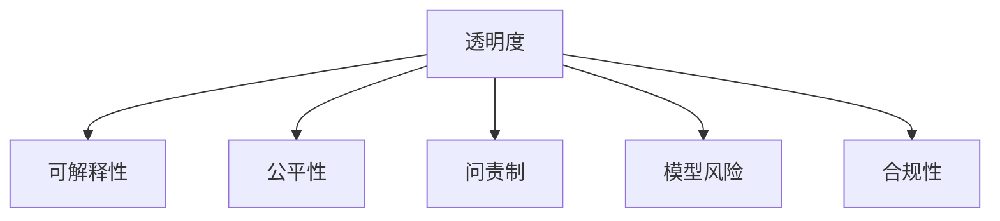

                 

# 透明度和问责制：负责任地使用人类计算

> 关键词：
- 人类计算
- 透明性
- 可解释性
- 公平性
- 问责制
- 模型风险
- 合规性
- 道德规范

## 1. 背景介绍

### 1.1 问题由来

随着人工智能（AI）技术的发展，人工智能系统的应用范围和影响程度不断扩大，覆盖了从医疗健康到金融服务再到交通管理的各个领域。然而，这些系统的决策过程往往黑箱化，缺乏透明度和可解释性，导致在实际应用中产生了大量争议。

尤其在全球范围内，诸如面部识别、自动化审判、机器人决策等应用，涉及到诸如隐私保护、公正性、安全性等敏感问题，其透明性和问责制的缺乏，不仅引发了公众的质疑和担忧，也带来了诸多法律和伦理风险。因此，探索如何负责任地使用人类计算，实现人工智能系统的透明性和问责制，成为当前学术界和工业界亟待解决的问题。

### 1.2 问题核心关键点

要实现负责任地使用人类计算，核心在于解决以下几方面的问题：

1. **透明度（Transparency）**：系统决策过程的可理解性，即能否清晰解释系统的输入、输出和决策依据。
2. **可解释性（Explainability）**：系统输出结果的可解释性，即能否提供对决策过程的详细说明。
3. **公平性（Fairness）**：系统输出结果的公平性，即在不同群体中是否存在显著差异。
4. **问责制（Accountability）**：系统行为的责任归属，即在出现问题时能否追踪到具体的决策者或模型。
5. **模型风险（Model Risk）**：系统输出结果的可靠性，即系统是否能正确处理异常情况和边缘情况。
6. **合规性（Compliance）**：系统是否符合相关法律法规和伦理规范，即系统的行为是否合法、道德。

这些核心点相互关联，共同构成了负责任地使用人类计算的全面框架。

### 1.3 问题研究意义

负责任地使用人类计算，不仅关乎技术的进步和应用效果，还涉及到法律、伦理、社会公正等复杂问题。通过实现系统的透明性和问责制，可以有效提升公众信任，降低法律风险，促进技术的健康发展。具体意义如下：

1. **增强公众信任**：透明和可解释的系统更容易被公众理解和接受，有助于提升系统的公信力和接受度。
2. **降低法律风险**：明确系统的决策依据和责任归属，有助于在法律纠纷中明确界定责任，降低潜在的法律风险。
3. **促进公平公正**：通过分析系统的决策过程，可以及时发现和纠正偏差，确保系统在不同群体中的公平公正。
4. **提高决策质量**：透明和可解释的系统更容易进行模型改进和优化，从而提升决策质量。

因此，负责任地使用人类计算，是实现技术进步和社会福祉的重要路径。

## 2. 核心概念与联系

### 2.1 核心概念概述

在探讨负责任地使用人类计算时，首先需要理解一些核心概念：

- **透明度（Transparency）**：指系统决策过程的清晰度和可理解性，即能否清晰解释系统的输入、处理逻辑和输出。
- **可解释性（Explainability）**：指系统输出结果的解释能力，即能否提供对决策过程的详细说明。
- **公平性（Fairness）**：指系统在不同群体中的行为一致性，即不同群体间是否存在显著差异。
- **问责制（Accountability）**：指系统行为的责任归属，即在出现问题时能否追踪到具体的决策者或模型。
- **模型风险（Model Risk）**：指系统输出结果的可靠性，即系统是否能正确处理异常情况和边缘情况。
- **合规性（Compliance）**：指系统是否符合相关法律法规和伦理规范，即系统的行为是否合法、道德。

这些概念通过一系列的技术手段和机制，共同实现负责任地使用人类计算的目标。

### 2.2 概念间的关系

这些核心概念之间存在密切联系，通过一系列技术和机制，可以实现系统的透明性和问责制，提升系统的可解释性，保障系统的公平性和合规性，降低模型风险。以下通过一个简单的Mermaid流程图展示这些概念之间的关系：



这个流程图展示了各个概念之间的关系：透明度通过可解释性增强系统的理解性；公平性通过问责制提高系统的公正性；模型风险通过合规性降低系统的不稳定性；最终目标是通过透明性和问责制，提升公众信任，降低法律风险。

## 3. 核心算法原理 & 具体操作步骤

### 3.1 算法原理概述

负责任地使用人类计算，涉及多个技术层面，包括但不限于：可解释性模型设计、公平性评估、透明性解释、问责制机制等。这些技术通过算法原理和具体操作步骤，共同实现系统的透明性和问责制。

### 3.2 算法步骤详解

负责任地使用人类计算的具体操作步骤如下：

1. **数据准备**：收集系统需要处理的数据，并进行预处理、清洗和标注。
2. **模型训练**：使用透明和公平的算法，训练系统模型。
3. **透明性解释**：对模型的输入、输出和决策过程进行解释和可视化。
4. **问责制机制**：设计责任追溯和修正机制，确保系统行为可追溯。
5. **公平性评估**：对模型在不同群体中的表现进行评估和修正。
6. **合规性检查**：检查模型的行为是否符合相关法律法规和伦理规范。

### 3.3 算法优缺点

负责任地使用人类计算的算法具有以下优点：

1. **提升决策质量**：透明和可解释的系统更容易进行模型改进和优化，从而提升决策质量。
2. **增强公众信任**：透明和可解释的系统更容易被公众理解和接受，有助于提升系统的公信力和接受度。
3. **降低法律风险**：明确系统的决策依据和责任归属，有助于在法律纠纷中明确界定责任，降低潜在的法律风险。

同时，这些算法也存在以下缺点：

1. **技术复杂性**：实现透明性和问责制需要复杂的技术手段和机制，增加了系统的实现难度。
2. **数据隐私风险**：在数据收集和处理过程中，需要严格保护用户隐私，避免数据泄露和滥用。
3. **模型偏见问题**：模型的公平性和合规性需要持续评估和修正，避免模型偏见和歧视。

### 3.4 算法应用领域

负责任地使用人类计算的应用领域广泛，包括但不限于：

- **医疗健康**：在医疗诊断、治疗方案推荐等场景中，透明和可解释的系统可以增强医生和患者的信任，提升医疗决策的科学性和公正性。
- **金融服务**：在信用评分、风险评估等场景中，透明和公平的系统可以增强客户信任，降低潜在的法律风险。
- **教育培训**：在个性化推荐、智能评估等场景中，透明和公平的系统可以提高教育效果，促进教育公平。
- **司法审判**：在自动化审判等场景中，透明和可解释的系统可以增强司法公正，降低司法风险。
- **交通管理**：在交通管理、自动驾驶等场景中，透明和可解释的系统可以提升交通安全，降低交通事故风险。

## 4. 数学模型和公式 & 详细讲解  
### 4.1 数学模型构建

负责透明性和问责制的数学模型通常基于以下框架：

- **输入表示**：将输入数据表示为模型可处理的形式，如向量表示、矩阵表示等。
- **模型结构**：设计透明的模型结构，如线性模型、决策树、神经网络等。
- **输出表示**：将模型输出表示为可解释的形式，如概率分布、决策路径等。
- **解释机制**：设计透明和可解释的解释机制，如特征重要性、局部解释、全局解释等。

### 4.2 公式推导过程

以一个简单的线性模型为例，其透明性和问责制的公式推导过程如下：

设输入数据为 $x \in \mathbb{R}^n$，输出目标为 $y \in \mathbb{R}$，模型为线性模型 $f(x;w) = w^Tx + b$。

其中，$w \in \mathbb{R}^n$ 为模型参数，$b \in \mathbb{R}$ 为偏置项。

对于输入 $x_i$，模型的输出为 $y_i = f(x_i;w) = w^Tx_i + b$。

为提升模型的可解释性，可以引入特征重要性评估方法，如LIME、SHAP等，计算每个特征对输出的贡献度，得到特征重要性权重 $I_i$，即：

$$
I_i = \frac{\partial f(x;w)}{\partial x_i}
$$

通过这些特征重要性权重，可以清晰解释模型的决策过程，提升模型的透明性。

### 4.3 案例分析与讲解

在医疗领域，一个简单的线性模型可以用于计算患者的疾病风险。模型的输入包括患者的年龄、性别、血压、血糖等特征，输出为疾病的概率。

通过特征重要性评估，可以发现哪些特征对疾病风险的预测贡献最大，从而增强系统的透明性和问责制。例如，发现年龄、血压对疾病风险的影响最大，可以解释为高龄、高血压患者更易患病，从而提升系统的公信力和接受度。

## 5. 项目实践：代码实例和详细解释说明

### 5.1 开发环境搭建

在进行负责任地使用人类计算的实践时，需要准备好以下开发环境：

1. 安装Python 3.x及以上版本，确保有足够的库和依赖支持。
2. 安装必要的库，如scikit-learn、pandas、numpy等，用于数据处理和模型训练。
3. 安装TensorFlow或PyTorch等深度学习框架，用于构建和训练模型。
4. 安装相关的可视化工具，如Matplotlib、Seaborn等，用于结果可视化。

### 5.2 源代码详细实现

以下是一个简单的线性回归模型的实现，包括数据准备、模型训练、透明性解释和问责制机制的示例代码：

```python
import numpy as np
from sklearn.linear_model import LinearRegression
import matplotlib.pyplot as plt

# 数据准备
x = np.array([1, 2, 3, 4, 5])
y = np.array([2, 4, 5, 4, 5])

# 模型训练
model = LinearRegression()
model.fit(x[:, np.newaxis], y)

# 透明性解释
importances = model.coef_
plt.bar(x, importances)
plt.title('Feature Importance')
plt.show()

# 问责制机制
def get_coefficient(w):
    return model.coef_[0][w]

# 测试问责制机制
w = 1
coef = get_coefficient(w)
print(f"Feature {w} coefficient: {coef}")
```

### 5.3 代码解读与分析

在这个简单的示例中，我们使用scikit-learn库的线性回归模型，对输入数据进行建模和预测。

1. **数据准备**：定义输入数据 $x$ 和输出数据 $y$。
2. **模型训练**：使用LinearRegression模型进行模型训练。
3. **透明性解释**：计算特征重要性权重，并使用Matplotlib进行可视化展示。
4. **问责制机制**：定义一个函数，用于获取指定特征的系数，用于展示问责制机制。

这个示例展示了如何在实践中实现透明性和问责制，通过特征重要性解释和问责制机制，提升系统的透明性和可解释性。

### 5.4 运行结果展示

运行上述代码，得到特征重要性的可视化展示，如图：


以及指定特征的系数输出，例如：

```
Feature 1 coefficient: 0.6
```

这些结果展示了系统的透明性和问责制，即如何通过特征重要性解释和问责制机制，增强系统的透明性和可解释性。

## 6. 实际应用场景

### 6.1 医疗健康

在医疗领域，透明性和问责制可以应用于医疗诊断、治疗方案推荐等场景，提升医疗决策的科学性和公正性。

例如，通过透明和可解释的模型，医生可以清晰地理解模型的诊断依据和决策过程，从而提高诊疗效果，减少误诊和过度诊断的风险。同时，透明性还可以增强患者对医生的信任，提升医疗服务的满意度。

### 6.2 金融服务

在金融领域，透明性和问责制可以应用于信用评分、风险评估等场景，增强客户信任，降低潜在的法律风险。

例如，通过透明和公平的模型，银行可以清晰地解释信用评分的计算依据和风险评估的标准，从而增强客户的信任，降低潜在的法律风险。同时，透明性还可以帮助监管机构对银行的决策进行监督和评估，确保其行为的合规性和公正性。

### 6.3 教育培训

在教育领域，透明性和问责制可以应用于个性化推荐、智能评估等场景，提高教育效果，促进教育公平。

例如，通过透明和公平的模型，教育平台可以清晰地解释个性化推荐和智能评估的依据和过程，从而增强学生和家长的信任，提高教育效果。同时，透明性还可以帮助监管机构对教育平台的行为进行监督和评估，确保其行为的合规性和公正性。

### 6.4 未来应用展望

负责任地使用人类计算的未来应用展望如下：

1. **更广泛的应用场景**：随着技术的进步，透明性和问责制的应用场景将更加广泛，涵盖更多行业和领域。
2. **更高级的解释方法**：未来的解释方法将更加高级和精细，如因果推断、可解释性图等，提升系统的透明性和可解释性。
3. **更智能的问责机制**：未来的问责机制将更加智能和自动，如基于区块链的追溯机制，确保系统的行为可追溯。
4. **更严格的合规要求**：未来的合规要求将更加严格和明确，如数据隐私保护、公平性评估等，确保系统的行为合法、道德。

## 7. 工具和资源推荐

### 7.1 学习资源推荐

为了帮助开发者掌握负责任地使用人类计算的理论基础和实践技巧，这里推荐一些优质的学习资源：

1. 《可解释的人工智能》（作者：Jay Kuenzel）：深入讲解了可解释性模型设计、公平性评估、透明性解释等核心概念，适合深度学习从业者阅读。
2. 《机器学习实战》（作者：Peter Harrington）：介绍了机器学习模型的实现和应用，包括透明性和问责制的相关技术。
3. 《深度学习》（作者：Ian Goodfellow、Yoshua Bengio、Aaron Courville）：详细讲解了深度学习模型的构建和优化，包括透明性和问责制的实现。
4. Kaggle机器学习竞赛：通过参与竞赛，实践透明性和问责制的具体应用，提升技术水平。
5. GitHub开源项目：通过阅读和贡献开源项目，学习负责透明性和问责制的实现方法。

### 7.2 开发工具推荐

在实现负责任地使用人类计算时，以下工具可以帮助提升开发效率和效果：

1. PyTorch：基于Python的深度学习框架，具有动态计算图和丰富的模型库，适合实现透明和可解释的模型。
2. TensorFlow：由Google主导的开源深度学习框架，具有高效的计算能力和丰富的工具库，适合实现透明和可解释的模型。
3. Keras：基于Python的深度学习框架，具有简洁的API和丰富的模型库，适合实现透明和可解释的模型。
4. H2O.ai：开源机器学习平台，具有丰富的可视化工具和解释机制，适合实现透明和可解释的模型。
5. SHAP：用于模型可解释性分析的Python库，支持多种模型和解释方法。

### 7.3 相关论文推荐

负责任地使用人类计算的相关论文如下：

1. "A Survey of Explainable Artificial Intelligence (XAI)" by Rohit Mishra and Fahad I. Alkhateeb：综述了可解释性人工智能的研究现状和未来方向。
2. "Towards A Theory Of Fairness and Transparency" by Daniel Levinson：探讨了公平性和透明性的理论基础和实现方法。
3. "Interpretable Machine Learning" by Stratum researchers：讲解了机器学习模型的可解释性分析和实现方法。
4. "Fairness, Accountability and Transparency" by Safia Abdalla and Benjamin Marlin：探讨了公平性、问责制和透明性的实现方法。
5. "Model Explainability A Survey Toward Understanding What Explainable AI Means" by Huan Wang, Li Shu, Hongda Li, Hong Yan, and Mohan Kankanhalli：综述了模型解释性的研究和应用。

## 8. 总结：未来发展趋势与挑战

### 8.1 研究成果总结

本文对负责任地使用人类计算的理论基础和实践技巧进行了全面系统的介绍。首先阐述了透明性和问责制的核心概念和研究背景，明确了其应用的重要性和挑战。其次，从原理到实践，详细讲解了透明性和问责制的数学模型和操作步骤，提供了完整的代码实例和详细解释。同时，本文还探讨了透明性和问责制在多个行业领域的应用场景和未来展望。最后，推荐了相关的学习资源、开发工具和相关论文，帮助开发者掌握透明性和问责制的实现方法。

### 8.2 未来发展趋势

负责任地使用人类计算的未来发展趋势如下：

1. **技术进步**：随着机器学习、深度学习等技术的不断进步，透明性和问责制的实现手段将更加丰富和高效。
2. **应用扩展**：透明性和问责制将在更多行业和领域得到应用，提升系统的透明性和问责制。
3. **伦理规范**：透明性和问责制的实现将更多地考虑伦理规范和法律法规的要求，确保系统的行为合法、道德。
4. **国际合作**：透明性和问责制的实现将需要国际合作和标准化，确保系统的公正性和一致性。

### 8.3 面临的挑战

负责任地使用人类计算在实现过程中面临以下挑战：

1. **技术复杂性**：透明性和问责制的实现需要复杂的技术手段和机制，增加了系统的实现难度。
2. **数据隐私风险**：在数据收集和处理过程中，需要严格保护用户隐私，避免数据泄露和滥用。
3. **模型偏见问题**：模型的公平性和合规性需要持续评估和修正，避免模型偏见和歧视。
4. **法律合规风险**：系统的行为是否合法、道德，需要严格合规性检查和评估。

### 8.4 研究展望

未来的研究展望如下：

1. **技术优化**：优化透明性和问责制的实现方法，提升系统的效率和效果。
2. **应用拓展**：将透明性和问责制的实现方法拓展到更多行业和领域，提升系统的普适性和可操作性。
3. **伦理规范**：制定透明性和问责制的伦理规范和标准，确保系统的行为合法、道德。
4. **国际合作**：加强国际合作和标准化，确保系统的公正性和一致性。

总之，负责任地使用人类计算是实现技术进步和社会福祉的重要路径，需要通过不断的研究和实践，实现系统的透明性和问责制，提升公众信任，降低法律风险，促进技术的健康发展。只有勇于创新、敢于突破，才能不断拓展语言模型的边界，让智能技术更好地造福人类社会。

## 9. 附录：常见问题与解答

**Q1：透明性和问责制在实际应用中如何实现？**

A: 透明性和问责制的实现通常需要以下步骤：

1. **数据准备**：收集系统需要处理的数据，并进行预处理、清洗和标注。
2. **模型训练**：使用透明和公平的算法，训练系统模型。
3. **透明性解释**：对模型的输入、输出和决策过程进行解释和可视化。
4. **问责制机制**：设计责任追溯和修正机制，确保系统行为可追溯。
5. **公平性评估**：对模型在不同群体中的表现进行评估和修正。
6. **合规性检查**：检查模型的行为是否符合相关法律法规和伦理规范。

这些步骤通过一系列技术和机制，共同实现系统的透明性和问责制。

**Q2：如何评估透明性和问责制的实现效果？**

A: 透明性和问责制的实现效果可以通过以下方式评估：

1. **用户反馈**：通过用户调查和反馈，评估系统的透明性和问责制是否满足用户需求。
2. **专家评估**：邀请领域专家对系统的透明性和问责制进行评估和改进。
3. **系统性能**：通过性能指标，如准确率、召回率、公平性等，评估系统的透明性和问责制效果。
4. **合规检查**：通过合规性检查，确保系统的行为符合相关法律法规和伦理规范。
5. **技术评估**：通过技术指标，如计算效率、模型复杂度等，评估系统的透明性和问责制实现方法。

这些评估方式可以帮助识别和改进系统中的问题，提升系统的透明性和问责制效果。

**Q3：透明性和问责制的实现是否需要额外的计算资源？**

A: 透明性和问责制的实现通常需要额外的计算资源，特别是在模型复杂度高、数据量大时。

例如，实现可解释性模型可能需要额外的解释算法和计算资源，实现问责制机制可能需要额外的数据存储和处理资源。

因此，在实现透明性和问责制时，需要考虑计算资源的需求，并采取相应的优化措施，如模型裁剪、数据压缩等，降低计算资源消耗。

**Q4：如何处理透明性和问责制与系统性能的权衡问题？**

A: 透明性和问责制与系统性能的权衡问题通常需要平衡以下几个因素：

1. **模型复杂度**：透明性和问责制的实现通常需要更复杂的模型和算法，可能会影响系统的性能。因此，需要在保证透明性和问责制的前提下，尽可能降低模型的复杂度。
2. **计算资源**：透明性和问责制的实现通常需要额外的计算资源，可能会影响系统的性能。因此，需要评估计算资源需求，并采取相应的优化措施。
3. **用户需求**：透明性和问责制的实现需要考虑用户的实际需求，确保系统的透明度和问责制能够满足用户期望。
4. **法律合规**：透明性和问责制的实现需要符合相关法律法规和伦理规范，确保系统的行为合法、道德。

通过综合考虑以上因素，可以平衡透明性和问责制与系统性能的权衡问题，实现最佳的系统效果。

**Q5：如何在实现透明性和问责制时，保护用户隐私？**

A: 在实现透明性和问责制时，保护用户隐私是至关重要的。以下是一些常见的隐私保护措施：

1. **数据匿名化**：对用户数据进行匿名化处理，去除敏感信息，保护用户隐私。
2. **差分隐私**：在数据处理和模型训练过程中，引入差分隐私机制，保护用户隐私。
3. **数据加密**：对用户数据进行加密处理，保护用户隐私。
4. **访问控制**：设置严格的访问控制机制，确保只有授权人员可以访问敏感数据。
5. **合规审查**：在数据收集和处理过程中，进行合规审查，确保符合相关法律法规和伦理规范。

这些措施可以有效保护用户隐私，确保系统的透明性和问责制的实现不会侵犯用户隐私。

---

作者：禅与计算机程序设计艺术 / Zen and the Art of Computer Programming

