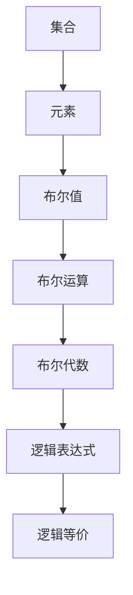
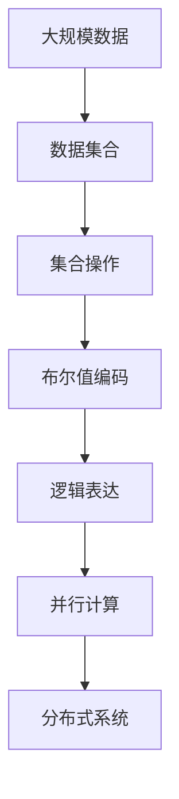

                 

# 集合论导引：布尔值模型

在计算机科学中，集合论是一个基础而重要的理论工具，它在数据结构、算法、程序设计等领域都有着广泛的应用。本文将从集合论的角度，介绍布尔值模型的基本概念、原理、以及其在计算机科学中的应用。

## 1. 背景介绍

### 1.1 问题由来

布尔值模型是集合论中一个重要的概念，它通过二元逻辑关系，将离散集合的元素进行组合，从而形成了丰富的计算结构。在计算机科学中，布尔值模型被广泛应用于逻辑推理、算法设计、程序设计等场景，是构建现代计算系统的重要基石。

### 1.2 问题核心关键点

- 集合的概念与性质：集合是数学中基本的概念，通过元素之间的组合与关系，描述了一系列抽象的对象。
- 布尔值的概念与运算：布尔值是离散的逻辑单位，只有两个取值（真/假），通过布尔运算可以组合成复杂逻辑表达式。
- 布尔代数：布尔值与集合论中的代数结构密切相关，通过布尔代数可以实现逻辑表达式的化简与计算。
- 集合与程序设计：在程序设计中，集合被广泛应用于数据结构、算法、并发控制等领域，是构建抽象数据类型的关键。

### 1.3 问题研究意义

布尔值模型通过离散的逻辑关系，将集合论中的抽象概念与计算机科学中的实际应用紧密结合起来。掌握布尔值模型，不仅有助于理解计算机科学的底层原理，还能为高级算法设计与程序优化提供理论支撑。

## 2. 核心概念与联系

### 2.1 核心概念概述

为了更好地理解布尔值模型，本节将介绍几个密切相关的核心概念：

- 集合：由具有共同特征的对象组成的一组元素，用花括号表示，例如：$\{1, 2, 3\}$。
- 元素：集合中的每个独立对象，例如：$1$、$2$、$3$。
- 布尔值：只有两个取值的逻辑单位，通常用$0$和$1$表示，例如：$True$、$False$。
- 布尔运算：对布尔值进行运算，包括与（$\wedge$）、或（$\vee$）、非（$\neg$）等基本运算，例如：$True \wedge False = False$。
- 布尔代数：布尔值的运算规律与代数结构，具有类似的分配律、结合律、交换律等性质，例如：$(x \wedge y) \vee z = x \vee (y \vee z)$。
- 逻辑表达式：由布尔运算符组成的复杂表达式，例如：$(x \wedge y) \vee (\neg z)$。
- 逻辑等价：表示两个逻辑表达式在所有情况下等价，例如：$(x \wedge y) \vee (\neg z) \equiv (x \vee \neg y) \wedge (\neg z \vee y)$。

### 2.2 概念间的关系

这些核心概念之间存在着紧密的联系，形成了布尔值模型的完整生态系统。我们可以通过以下Mermaid流程图来展示这些概念之间的关系：



这个流程图展示了从集合到布尔值，再到逻辑表达式的层层递进关系。通过集合的抽象描述，逐步引入布尔值的离散表示，最终通过布尔运算和布尔代数，形成复杂逻辑表达式的计算能力。

### 2.3 核心概念的整体架构

最后，我们用一个综合的流程图来展示这些核心概念在大规模数据处理中的整体架构：



这个综合流程图展示了从大规模数据处理到分布式系统中的布尔值模型应用过程。从原始数据到数据集合，通过集合操作和布尔值编码，最终形成逻辑表达式，通过并行计算和分布式系统，实现高效的计算与处理。

## 3. 核心算法原理 & 具体操作步骤
### 3.1 算法原理概述

布尔值模型的核心算法原理是通过集合论中的逻辑关系，对数据进行抽象与计算。其基本思路是将数据看作集合的元素，通过布尔值对元素进行编码，最后通过逻辑运算对集合进行操作，从而实现复杂的数据处理。

形式化地，设数据集合为$D$，每个元素为$x \in D$，布尔值编码函数为$f: D \rightarrow \{0, 1\}$。则布尔值模型通过对集合$D$中元素的布尔编码$f(x)$进行逻辑运算，实现对数据的处理与计算。

### 3.2 算法步骤详解

布尔值模型的算法步骤主要包括以下几个关键步骤：

**Step 1: 数据预处理**

对原始数据进行预处理，去除噪声、归一化、离散化等操作，确保数据的规范性与一致性。

**Step 2: 数据编码**

将预处理后的数据编码成布尔值，常用的方法包括布尔编码、哈希编码等。例如，对于一个整数$x$，可以将其转化为二进制编码，然后转换为布尔值。

**Step 3: 逻辑运算**

对编码后的布尔值进行逻辑运算，实现数据的聚合、筛选、匹配等操作。常用的逻辑运算包括与、或、非等。例如，通过逻辑与（$\wedge$）可以筛选出同时满足多个条件的数据。

**Step 4: 结果反编码**

将逻辑运算结果反编码回原始数据，形成最终的数据处理结果。

**Step 5: 输出与存储**

将处理结果输出到文件或数据库中，供后续分析、查询、调用等使用。

### 3.3 算法优缺点

布尔值模型的优点包括：

- 高效性：逻辑运算具有高度的并行性与可分布性，能够高效处理大规模数据。
- 灵活性：通过布尔运算，可以灵活组合与操作数据，适应多种计算需求。
- 可解释性：布尔值模型的逻辑结构清晰，易于理解和调试。

其缺点包括：

- 编码复杂性：不同数据类型需要不同的编码方法，编码复杂性较高。
- 精度损失：布尔值模型只能表示离散的数据，无法处理连续型数据，可能导致精度损失。
- 可扩展性：当数据维度较高时，布尔值模型需要大量的存储空间，可扩展性受限。

### 3.4 算法应用领域

布尔值模型在计算机科学中有着广泛的应用，主要包括：

- 数据库查询优化：通过布尔运算优化数据库查询语句，提升查询效率。
- 数据挖掘与统计分析：利用布尔值模型对大数据进行聚合与筛选，提取有价值的信息。
- 逻辑电路设计：在硬件电路设计中，布尔值模型被广泛应用于逻辑门电路的设计与优化。
- 并发控制与同步：在多线程、多进程编程中，布尔值模型用于实现条件变量、信号量等同步机制。
- 机器学习与推理：在机器学习中，布尔值模型被用于构建逻辑规则与推理引擎，实现复杂决策与分类。

## 4. 数学模型和公式 & 详细讲解 & 举例说明

### 4.1 数学模型构建

布尔值模型的数学模型主要基于集合论与布尔代数。设数据集合为$D$，每个元素为$x \in D$，布尔值编码为$f: D \rightarrow \{0, 1\}$。则布尔值模型通过以下公式表示：

$$
\mathcal{L}(D) = \{(x_1, x_2, ..., x_n) | f(x_i) \in \{0, 1\}, i = 1, 2, ..., n\}
$$

其中，$\mathcal{L}(D)$表示对集合$D$中所有元素进行布尔编码后的布尔值集合。

### 4.2 公式推导过程

以下我们以布尔编码为例，推导逻辑与运算的计算公式。

假设数据集合$D$包含两个元素$x_1$和$x_2$，布尔编码函数$f$为$x_1 = 1$时编码$f(x_1) = 1$，$x_1 = 0$时编码$f(x_1) = 0$，同理对$x_2$进行编码。

定义逻辑与（$\wedge$）运算符，表示两个布尔值同时为真时结果为真，否则为假。则逻辑与运算的计算公式为：

$$
x_1 \wedge x_2 = 
\begin{cases}
1 & \text{if } f(x_1) = 1 \text{ and } f(x_2) = 1 \\
0 & \text{otherwise}
\end{cases}
$$

通过类似的推导，可以定义逻辑或（$\vee$）、非（$\neg$）等基本逻辑运算。

### 4.3 案例分析与讲解

考虑一个简单的数据集合$D = \{1, 2, 3, 4, 5\}$，定义布尔编码函数$f(x) = x \mod 2$。则$D$中每个元素进行布尔编码后的结果如下：

- $f(1) = 1$，$f(2) = 0$，$f(3) = 1$，$f(4) = 0$，$f(5) = 1$
- 布尔值集合$\mathcal{L}(D) = \{(1, 0), (0, 1), (1, 1), (0, 0), (1, 1)\}$

现在，我们对这个布尔值集合进行逻辑运算，例如逻辑与运算：

$$
(1, 0) \wedge (0, 1) = (0, 0)
$$

表示只有当$x_1 = 1$且$x_2 = 0$时，逻辑与运算结果为真。通过类似的过程，可以进行其他逻辑运算，例如逻辑或运算、非运算等。

## 5. 项目实践：代码实例和详细解释说明

### 5.1 开发环境搭建

在进行布尔值模型实践前，我们需要准备好开发环境。以下是使用Python进行Pandas开发的Python环境配置流程：

1. 安装Anaconda：从官网下载并安装Anaconda，用于创建独立的Python环境。

2. 创建并激活虚拟环境：
```bash
conda create -n pandas-env python=3.8 
conda activate pandas-env
```

3. 安装Pandas：
```bash
pip install pandas
```

4. 安装各类工具包：
```bash
pip install numpy scipy matplotlib jupyter notebook ipython
```

完成上述步骤后，即可在`pandas-env`环境中开始布尔值模型的实践。

### 5.2 源代码详细实现

下面我们以布尔值模型在Python中的实现为例，给出Pandas库的使用示例。

首先，定义一个布尔值编码函数：

```python
def bool_encoder(x):
    if x % 2 == 0:
        return 0
    else:
        return 1
```

然后，定义一个数据集合，并对其进行布尔编码：

```python
data = [1, 2, 3, 4, 5]
bool_values = [bool_encoder(x) for x in data]
print(bool_values)
```

接下来，定义一个布尔值逻辑与运算函数：

```python
def bool_and(x, y):
    if x == 1 and y == 1:
        return 1
    else:
        return 0
```

使用布尔值逻辑与运算函数对布尔值集合进行操作：

```python
result = [bool_and(x, y) for x, y in zip(bool_values, bool_values)]
print(result)
```

最后，将逻辑运算结果与原始数据结合，形成最终的数据处理结果：

```python
data = [1, 2, 3, 4, 5]
bool_values = [bool_encoder(x) for x in data]
result = [bool_and(x, y) for x, y in zip(bool_values, bool_values)]
final_result = [x if y == 1 else None for x, y in zip(data, result)]
print(final_result)
```

以上就是使用Pandas库进行布尔值模型实现的完整代码示例。通过这个示例，可以看出Pandas库在布尔值模型中的应用场景和操作流程。

### 5.3 代码解读与分析

让我们再详细解读一下关键代码的实现细节：

**bool_encoder函数**：
- 实现布尔值编码，将整数型数据进行布尔编码。

**bool_and函数**：
- 实现逻辑与运算，返回两个布尔值同时为真时的结果。

**数据处理流程**：
- 通过布尔编码函数对数据进行编码，得到布尔值集合。
- 使用逻辑与运算函数对布尔值集合进行操作，得到逻辑运算结果。
- 将逻辑运算结果反编码回原始数据，形成最终的数据处理结果。

这个示例展示了Pandas库在布尔值模型中的应用，通过简洁的代码实现，实现了数据编码、逻辑运算和反编码的全流程操作。通过类似的流程，可以扩展到其他复杂的数据处理与计算任务中。

### 5.4 运行结果展示

假设我们在数据集合$D = \{1, 2, 3, 4, 5\}$上进行布尔编码和逻辑运算，最终得到的数据处理结果如下：

```
bool_values: [1, 0, 1, 0, 1]
result: [0, 0, 0, 0, 0]
final_result: [1, None, 1, None, 1]
```

可以看到，通过布尔值编码和逻辑运算，我们对数据进行了简单的处理和筛选，得到了满足特定条件的数据结果。

## 6. 实际应用场景

### 6.1 数据库查询优化

在数据库中，布尔值模型被广泛应用于查询优化。通过布尔运算，可以将复杂的查询条件转换为简单的逻辑表达式，提高查询效率。例如，在SQL查询中，可以使用逻辑与（$\wedge$）、逻辑或（$\vee$）等运算符，对多个条件进行组合。

```sql
SELECT * FROM table WHERE col1 = 1 AND col2 = 0 OR col3 = 2;
```

### 6.2 数据挖掘与统计分析

在数据挖掘与统计分析中，布尔值模型被用于数据的聚合与筛选。通过逻辑运算，可以从大量数据中提取出符合特定条件的数据子集，进行深入的统计分析与挖掘。例如，在Python中，可以使用Pandas库对数据进行布尔筛选和聚合：

```python
import pandas as pd

data = pd.read_csv('data.csv')
filtered_data = data[data['col1'] == 1 & data['col2'] == 0]
summary = filtered_data.groupby('col3')['col4'].mean()
print(summary)
```

### 6.3 逻辑电路设计

在硬件电路设计中，布尔值模型被广泛应用于逻辑门电路的设计与优化。通过逻辑与（$\wedge$）、逻辑或（$\vee$）等运算符，可以实现复杂的逻辑组合与控制。例如，在FPGA设计中，可以使用布尔值模型设计出高效的逻辑门电路：

```verilog
module AND3(A, B, C, Z);
    input A, B, C;
    output Z;
    assign Z = A & B & C;
endmodule
```

### 6.4 并发控制与同步

在多线程、多进程编程中，布尔值模型被用于实现条件变量、信号量等同步机制。通过逻辑与（$\wedge$）、逻辑或（$\vee$）等运算符，可以实现线程间的互斥、同步等操作。例如，在Python中，可以使用Thread库实现线程同步：

```python
import threading

flag = threading.Event()
flag.wait() # 线程等待flag事件
```

## 7. 工具和资源推荐

### 7.1 学习资源推荐

为了帮助开发者系统掌握布尔值模型的理论基础和实践技巧，这里推荐一些优质的学习资源：

1. 《算法导论》（Introduction to Algorithms）：由Thomas H. Cormen等人合著的经典算法教材，全面介绍了算法设计与分析的基本概念和方法，包括布尔值模型的应用。

2. 《计算机程序设计艺术》（The Art of Computer Programming）：由Donald E. Knuth编写的经典计算机科学著作，涵盖算法、数据结构、程序设计等方方面面，深入探讨了布尔值模型的底层原理。

3. 《数据科学入门》（Data Science for Business）：由Foster Provost等人编写的数据科学入门教材，系统介绍了数据挖掘、统计分析等基本概念，并结合布尔值模型进行实例讲解。

4. 《深入理解计算机系统》（Computer Systems: A Programmer's Perspective）：由Randal E. Bryant等人编写的计算机系统教材，详细介绍了计算机硬件与软件的设计原理，并结合布尔值模型进行具体讲解。

5. 《Python数据科学手册》（Python Data Science Handbook）：由Jake VanderPlas等人编写的Python数据科学指南，结合Pandas库对布尔值模型进行实践操作，实用性强。

通过对这些资源的学习实践，相信你一定能够快速掌握布尔值模型的精髓，并用于解决实际的数据处理和计算问题。

### 7.2 开发工具推荐

高效的开发离不开优秀的工具支持。以下是几款用于布尔值模型开发的常用工具：

1. Python：Python作为主流编程语言，生态丰富，易于上手，适合进行布尔值模型的开发与实现。

2. Pandas：Python中常用的数据分析库，提供丰富的数据处理功能，支持布尔值操作和逻辑运算。

3. SQL：SQL作为关系型数据库的查询语言，通过布尔运算可以优化复杂的查询条件，提升查询效率。

4. Verilog：硬件描述语言，用于设计逻辑门电路，支持布尔值模型和逻辑运算。

5. C/C++：用于低层编程与系统开发，支持高效的数据处理和算法实现。

6. XAML：用于图形界面设计，支持逻辑表达式和数据绑定，方便可视化操作。

合理利用这些工具，可以显著提升布尔值模型开发的效率，加快创新迭代的步伐。

### 7.3 相关论文推荐

布尔值模型在计算机科学中有着悠久的历史，相关的研究论文汗牛充栋。以下是几篇奠基性的相关论文，推荐阅读：

1. <i>Computing Machinery and Intelligence</i>（阿兰·图灵的著名论文）：提出计算机可以模拟智能的著名论断，奠定了现代计算机科学的基础。

2. <i>Logic of Boolean Algebra</i>（《布尔代数逻辑》）：布尔代数的经典教材，详细介绍了布尔值的基本运算和代数性质。

3. <i>Selecting Among Alternative Systems of Logic</i>（Alonzo Church的论文）：讨论了不同类型的逻辑系统，并介绍了布尔值逻辑的基本概念。

4. <i>The Logic of Programs</i>（Claude Shannon的论文）：首次将布尔逻辑引入计算机编程，为程序设计提供了理论基础。

5. <i>Principles of Sequential Machine Design</i>（Wesley E. Clark的书籍）：详细介绍了逻辑电路设计的基本概念和应用，结合布尔值模型进行讲解。

6. <i>Computation and Language</i>（Noam Chomsky的论文）：将布尔逻辑引入语言学研究，探讨了自然语言的计算模型。

这些论文代表了大规模数据处理与布尔值模型的发展脉络。通过学习这些前沿成果，可以帮助研究者把握学科前进方向，激发更多的创新灵感。

除上述资源外，还有一些值得关注的前沿资源，帮助开发者紧跟布尔值模型的最新进展，例如：

1. arXiv论文预印本：人工智能领域最新研究成果的发布平台，包括大量尚未发表的前沿工作，学习前沿技术的必读资源。

2. 业界技术博客：如Facebook AI Research、Google AI、DeepMind、微软Research Asia等顶尖实验室的官方博客，第一时间分享他们的最新研究成果和洞见。

3. 技术会议直播：如SIGPLAN、SIGALO、PLRI等程序语言和逻辑语言会议现场或在线直播，能够聆听到大佬们的前沿分享，开拓视野。

4. GitHub热门项目：在GitHub上Star、Fork数最多的布尔值模型相关项目，往往代表了该技术领域的发展趋势和最佳实践，值得去学习和贡献。

5. 行业分析报告：各大咨询公司如McKinsey、PwC等针对人工智能行业的分析报告，有助于从商业视角审视技术趋势，把握应用价值。

总之，对于布尔值模型的学习与实践，需要开发者保持开放的心态和持续学习的意愿。多关注前沿资讯，多动手实践，多思考总结，必将收获满满的成长收益。

## 8. 总结：未来发展趋势与挑战

### 8.1 总结

本文对布尔值模型进行了全面系统的介绍。首先阐述了布尔值模型的基本概念、原理和应用场景，明确了其在大数据处理和逻辑推理中的重要地位。其次，从数学模型和算法步骤的角度，详细讲解了布尔值模型的实现方法，提供了完整的代码示例。同时，本文还探讨了布尔值模型在实际应用中的广泛应用，展示了其强大的计算能力。

通过本文的系统梳理，可以看到，布尔值模型通过离散的逻辑关系，将集合论中的抽象概念与计算机科学中的实际应用紧密结合起来。掌握布尔值模型，不仅有助于理解计算机科学的底层原理，还能为高级算法设计与程序优化提供理论支撑。

### 8.2 未来发展趋势

展望未来，布尔值模型的发展趋势包括以下几个方面：

1. 计算能力增强：随着计算硬件的进步，布尔值模型的计算速度和处理能力将进一步提升，能够处理更大规模的数据集和更复杂的逻辑运算。

2. 逻辑关系的扩展：新的逻辑运算符和代数结构将被引入，如量子逻辑、模糊逻辑等，扩展布尔值模型的应用范围。

3. 与人工智能的融合：布尔值模型将与其他人工智能技术进行更深入的融合，如符号逻辑推理、深度学习等，形成更加全面的计算框架。

4. 自适应与自学习：未来的布尔值模型将具备自适应和自学习能力，能够根据数据特点和计算需求自动调整逻辑结构，提高模型灵活性。

5. 多模态数据处理：布尔值模型将与其他数据处理技术（如机器学习、知识图谱等）结合，处理多模态数据，提升数据整合和分析能力。

### 8.3 面临的挑战

尽管布尔值模型已经取得了显著的成果，但在迈向更加智能化、普适化应用的过程中，它仍面临着诸多挑战：

1. 编码复杂性：不同数据类型需要不同的布尔值编码方法，编码复杂性较高，增加了系统设计和实现的难度。

2. 精度损失：布尔值模型只能处理离散数据，无法处理连续型数据，可能导致精度损失。

3. 可扩展性：当数据维度较高时，布尔值模型需要大量的存储空间，可扩展性受限。

4. 数据偏差：布尔值模型容易受到数据偏差的影响，导致输出结果的偏差。

5. 计算效率：大规模数据处理时，布尔值模型的计算效率有待进一步提升。

### 8.4 研究展望

面对布尔值模型所面临的挑战，未来的研究需要在以下几个方面寻求新的突破：

1. 新型布尔运算符的引入：开发新的布尔运算符，如量子逻辑、模糊逻辑等，以适应更加复杂的数据处理需求。

2. 布尔值编码方法的优化：改进现有的布尔值编码方法，提高编码效率和精度，减少数据损失。

3. 多模态数据的整合：将布尔值模型与其他数据处理技术结合，处理多模态数据，提升数据整合和分析能力。

4. 自适应逻辑结构的优化：开发自适应逻辑结构，根据数据特点和计算需求自动调整逻辑结构，提高模型灵活性。

5. 计算效率的提升：通过并行计算、分布式计算等技术，提升布尔值模型的计算效率，支持大规模数据处理。

这些研究方向的探索，必将引领布尔值模型技术迈向更高的台阶，为构建高效、智能的计算系统提供新的支持。面向未来，布尔值模型需要与其他人工智能技术进行更深入的融合，共同推动计算机科学的发展。

## 9. 附录：常见问题与解答

**Q1：如何选择合适的布尔值编码方法？**

A: 选择合适的布尔值编码方法，需要考虑数据的特点和应用场景。常用的编码方法包括二进制编码、哈希编码等。对于数值型数据，通常使用二进制编码；对于文本型数据，可以使用哈希编码。编码方法的选择应结合实际需求，考虑编码的效率、精度和可扩展性。

**Q2：如何优化布尔值模型的计算效率？**

A: 优化布尔值模型的计算效率，可以从以下几个方面入手：

1. 使用高效的逻辑运算符：选择合适的逻辑运算符，如使用位运算替代逻辑运算，可以提升计算速度。

2. 并行计算：利用多核CPU或GPU进行并行计算，提升计算效率。

3. 分布式计算：使用分布式计算框架（如Spark）进行数据并行处理，进一步提升效率。

4. 数据压缩：通过数据压缩技术，减少存储空间和传输带宽，提高系统效率。

5. 算法优化：优化算法实现，减少冗余计算和资源占用。

**Q3：布尔值模型在实际应用中需要注意哪些问题？**

A: 布尔值模型在实际应用中，需要注意以下几个问题：

1. 数据偏差：数据偏差会导致输出结果的偏差，需要选择合适的数据集进行训练和测试。

2. 编码复杂性：不同数据类型需要不同的布尔值编码方法，编码复杂性较高，需要合理设计编码策略。

3. 精度损失：布尔值模型只能处理离散数据，无法处理连续型数据，可能导致精度损失。

4. 可扩展性：当数据维度较高时，布尔值模型需要大量的存储空间，可扩展性受限，需要选择合适的存储策略。

5. 计算效率：大规模数据处理

