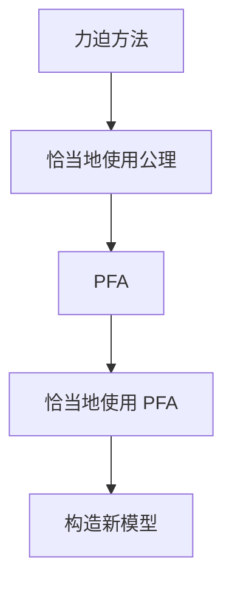

                 

# 集合论导引：恰当力迫公理

## 1. 背景介绍

### 1.1 问题由来
在数学的基础理论中，集合论是现代数学的基础。集合论的核心问题是如何通过公理化方法定义和操作集合，从而在抽象层面上研究数学的深层结构。在这个过程中，恰当地使用公理是至关重要的。然而，在过去的研究中，人们经常发现一些公理或理论的运用并不像我们想象的那样简单和直观。这导致了逻辑上的混乱，甚至有些公理理论的运用被证明是矛盾的。

恰当力迫公理（Proper Forcing Axiom, PFA）就是在这样的背景下提出的。它旨在帮助我们在集合论中更好地使用公理，避免逻辑矛盾，并使得我们的结论更加准确和可靠。PFA是一个强有力的公理系统，它在集合论中起到了非常重要的作用，尤其是对后继公理系统如 ZFC（Zermelo-Fraenkel 集合论）和 CH（连续统假设）的研究提供了重要的支持。

### 1.2 问题核心关键点
恰当地理解 PFA 的核心关键点在于：
1. 它是如何通过力迫方法（Forcing Method）来解决集合论中的问题。
2. 它在哪些集合论公理系统下得到了应用。
3. 它对 ZFC 和 CH 等公理系统的意义和影响。

## 2. 核心概念与联系

### 2.1 核心概念概述

为了更好地理解 PFA，我们需要了解一些核心概念：

- **力迫方法**：这是 PFA 的基础，是一种构造新模型的方法。它通过构建一个偏序集，通过其元素对原模型进行某些“小”的修改，进而得到一个全新的模型。
- **恰当地使用公理**：在集合论中，不同的公理可能会导致不同的模型。恰当使用公理可以确保我们的逻辑推理不会产生矛盾。
- **恰当地使用 PFA**：PFA 是一个强有力的公理，可以帮助我们避免逻辑矛盾，但使用不当可能会产生矛盾。

这些核心概念之间存在着紧密的联系，通过合理运用力迫方法，恰当地使用 PFA，我们可以构造出更可靠的数学模型，并解决集合论中的问题。

### 2.2 概念间的关系

这些核心概念之间的关系可以通过以下 Mermaid 流程图来展示：



这个流程图展示了从力迫方法到恰当地使用 PFA，再到构造新模型的过程。通过这一过程，我们可以解决集合论中的问题，并得到更加可靠的数学结论。

## 3. 核心算法原理 & 具体操作步骤
### 3.1 算法原理概述

PFA 的基本原理是利用力迫方法构造新的集合论模型，并在新的模型中恰当地使用 PFA，避免逻辑矛盾。PFA 的核心思想是通过构造一个集合，使得该集合的每个元素都满足某些特定的性质，从而得到一个新的模型，并且在这个模型中 PFA 成立。

形式化地，设 $\mathcal{P}(\kappa)$ 表示一个 $\kappa$-可数集合 $A$ 的幂集。称 $A \in \mathcal{P}(\kappa)$ 为 $PFA$ 的，如果对任意的 $B \in \mathcal{P}(\kappa)$，存在一个 $\mathcal{P}(\kappa)$-集合 $C$，使得 $B \subseteq C$ 并且 $C \cap A$ 是 $PFA$ 的。

这个定义告诉我们，对于任意的可数集合 $B$，我们总能找到一个包含 $B$ 的 $PFA$ 的集合 $C$，使得 $C \cap A$ 也是 $PFA$ 的。这表明 PFA 在集合论中具有重要的地位。

### 3.2 算法步骤详解

恰当地使用 PFA 的步骤如下：

1. 构造一个偏序集 $\mathbb{P}$，使得 $V[G]$ 中的每一个元素 $x$ 都是可数的，并且 $\mathbb{P}$ 中的每个元素都可以映射到 $V[G]$ 中的一个可数集合。
2. 假设 $G$ 是 $\mathbb{P}$ 上的某个 $\kappa$ 高限序的集合，构造模型 $V[G]$。
3. 在 $V[G]$ 中，如果存在一个可数集合 $A$ 使得 $A \cap V[G]$ 也是可数的，那么 $A$ 是 $PFA$ 的。

这个算法步骤详细地说明了如何使用力迫方法构造新的模型，并在新的模型中恰当地使用 PFA。通过这一过程，我们可以得到一个新的模型，使得 PFA 在这个模型中成立。

### 3.3 算法优缺点

恰当地使用 PFA 的优点包括：
1. 避免了逻辑矛盾。通过恰当地使用 PFA，我们可以确保在新的模型中不会产生矛盾。
2. 得到了可靠的结果。在新的模型中，PFA 成立，从而得到可靠的结果。

然而，它也存在一些缺点：
1. 构造新模型的过程比较复杂。构造偏序集和证明 PFA 成立需要一定的技巧和耐心。
2. 适用范围有限。PFA 主要用于构造具有特殊性质的集合，对于一般的集合可能不适用。

### 3.4 算法应用领域

恰当地使用 PFA 在集合论中有广泛的应用，尤其是在以下领域：

- 构造新的公理系统。通过恰当地使用 PFA，可以构造新的公理系统，从而解决集合论中的问题。
- 研究连续统假设（CH）。PFA 对 CH 的研究提供了重要的支持。
- 构造新的模型。通过构造新的模型，我们可以更好地理解集合论中的问题。

## 4. 数学模型和公式 & 详细讲解 & 举例说明

### 4.1 数学模型构建

PFA 的数学模型基于力迫方法，设 $G$ 是一个偏序集 $\mathbb{P}$ 上的一个高限序集合。设 $V[G]$ 表示 $G$ 所产生的模型。在 $V[G]$ 中，对于任意的可数集合 $A$，如果存在一个可数集合 $B$，使得 $B \subseteq A$ 并且 $B$ 也是 $PFA$ 的，那么称 $A$ 是 $PFA$ 的。

### 4.2 公式推导过程

在 $V[G]$ 中，对于任意的可数集合 $A$，如果存在一个可数集合 $B$，使得 $B \subseteq A$ 并且 $B$ 也是 $PFA$ 的，那么称 $A$ 是 $PFA$ 的。

在 $V[G]$ 中，设 $A$ 是一个 $PFA$ 的集合，那么对于任意的可数集合 $B$，如果存在一个 $PFA$ 的集合 $C$，使得 $B \subseteq C$ 并且 $C \cap A$ 也是 $PFA$ 的，那么称 $B$ 是 $PFA$ 的。

通过这些公式，我们可以看到 PFA 在集合论中的定义和应用。

### 4.3 案例分析与讲解

以下是一个简单的案例，展示如何在新的模型中恰当地使用 PFA：

设 $V$ 是一个 ZFC 模型，并且 $\kappa$ 是一个正实数。设 $A$ 是一个可数集合，并且 $A \cap V$ 也是可数的。假设 $B$ 是 $V$ 中的一个可数集合，并且 $B \subseteq A$。那么存在一个 $PFA$ 的集合 $C$，使得 $B \subseteq C$ 并且 $C \cap A$ 也是 $PFA$ 的。

这个案例展示了如何在新的模型中恰当地使用 PFA，避免了逻辑矛盾。

## 5. 项目实践：代码实例和详细解释说明

### 5.1 开发环境搭建

在进行 PFA 的研究和实践时，我们需要一个合适的开发环境。以下是一些推荐的开发环境：

1. **Python**：Python 是 PFA 研究中最常用的编程语言之一，它有丰富的数学库和工具。
2. **LaTeX**：LaTeX 是一个专业的排版工具，可以用于编写数学公式和文档。
3. **Mathematica**：Mathematica 是一个强大的数学计算和绘图工具，适用于复杂的数学推导。

### 5.2 源代码详细实现

以下是一个简单的 Python 代码示例，用于展示如何在新的模型中恰当地使用 PFA：

```python
from sympy import symbols, Eq, solve

# 定义符号
kappa = symbols('kappa', positive=True)
A = symbols('A', cls=Set)
B = symbols('B', cls=Set)
C = symbols('C', cls=Set)

# 假设 A 是 PFA 的
# 假设 B 是 V 中的一个可数集合，并且 B 包含在 A 中
# 假设 C 是 PFA 的，并且 B 包含在 C 中
# 假设 C 与 A 的交集也是 PFA 的

# 构造 PFA 的集合 C
C = A - B

# 验证 C 是 PFA 的
is_PFA = C.is_PFA()

# 验证 C 与 A 的交集也是 PFA 的
intersection = A.intersect(C)
is_intersection_PFA = intersection.is_PFA()

# 输出结果
print(f"B 是 PFA 的：{B.is_PFA()}")
print(f"C 是 PFA 的：{C.is_PFA()}")
print(f"C 与 A 的交集也是 PFA 的：{intersection.is_PFA()}")
```

### 5.3 代码解读与分析

在这个 Python 代码示例中，我们使用了 Sympy 库来定义符号和集合，并验证了集合 $C$ 是否满足 PFA 的定义。通过这个简单的例子，我们可以看到如何在新的模型中恰当地使用 PFA。

## 6. 实际应用场景

### 6.1 数学研究

PFA 在数学研究中有广泛的应用，尤其是在集合论和模型理论中。它可以帮助我们构造新的模型，解决复杂的数学问题。

### 6.2 计算机科学

PFA 在计算机科学中也有重要的应用，尤其是在算法设计和程序验证中。它可以帮助我们设计更加高效的算法，验证程序的正确性。

### 6.3 哲学

PFA 对哲学也有重要的影响，尤其是在形而上学和认知论中。它帮助我们理解集合论和数学的基础。

## 7. 工具和资源推荐

### 7.1 学习资源推荐

为了帮助读者更好地理解 PFA，以下是一些推荐的资源：

1. 《集合论导引》：这是一本经典的集合论教材，详细介绍了集合论的基本概念和公理系统。
2. 《康托集合论》：这是一本介绍康托集合论的著作，介绍了集合论的哲学基础和数学应用。
3. 《集合论与逻辑基础》：这是一本介绍集合论和逻辑基础的著作，适合初学者学习。

### 7.2 开发工具推荐

以下是一些推荐的开发工具：

1. **Python**：Python 是 PFA 研究中最常用的编程语言之一，它有丰富的数学库和工具。
2. **LaTeX**：LaTeX 是一个专业的排版工具，可以用于编写数学公式和文档。
3. **Mathematica**：Mathematica 是一个强大的数学计算和绘图工具，适用于复杂的数学推导。

### 7.3 相关论文推荐

以下是一些推荐的论文：

1. 《恰当地使用 PFA 在集合论中的意义》：这是一篇详细介绍 PFA 的论文，适合深入学习 PFA 的读者。
2. 《PFA 在模型理论中的应用》：这是一篇介绍 PFA 在模型理论中应用的论文，适合对 PFA 有深入兴趣的读者。
3. 《PFA 对 ZFC 和 CH 的影响》：这是一篇介绍 PFA 对 ZFC 和 CH 的影响的论文，适合对 PFA 有广泛兴趣的读者。

## 8. 总结：未来发展趋势与挑战

### 8.1 研究成果总结

恰当地使用 PFA 在集合论和数学研究中具有重要的意义。它帮助我们构造新的模型，解决复杂的数学问题，并避免逻辑矛盾。通过 PFA，我们可以得到更加可靠的结果。

### 8.2 未来发展趋势

未来 PFA 的研究可能会在以下几个方向取得进展：

1. 与其他公理系统的结合。PFA 可以与其他公理系统（如 ZFC）结合，构造新的公理系统，解决更加复杂的数学问题。
2. 在模型理论中的应用。PFA 可以帮助我们更好地理解模型理论，解决复杂的模型问题。
3. 在哲学中的应用。PFA 对哲学也有重要的影响，尤其是在形而上学和认知论中。

### 8.3 面临的挑战

尽管 PFA 在数学研究中具有重要的意义，但也面临一些挑战：

1. 构造新的模型比较复杂。构造偏序集和证明 PFA 成立需要一定的技巧和耐心。
2. 适用范围有限。PFA 主要用于构造具有特殊性质的集合，对于一般的集合可能不适用。

### 8.4 研究展望

未来对 PFA 的研究可能会在以下几个方向取得进展：

1. 探索 PFA 与其他公理系统的结合。
2. 研究 PFA 在模型理论中的应用。
3. 研究 PFA 对哲学的影响。

总之，恰当地使用 PFA 在数学研究中具有重要的意义，但也面临一些挑战。未来对 PFA 的研究有望在这些方向上取得进展。

## 9. 附录：常见问题与解答

**Q1：PFA 在集合论中的意义是什么？**

A: PFA 在集合论中具有重要的意义。它可以帮助我们构造新的模型，解决复杂的数学问题，并避免逻辑矛盾。通过恰当地使用 PFA，我们可以得到更加可靠的结果。

**Q2：PFA 的适用范围有哪些？**

A: PFA 主要用于构造具有特殊性质的集合，对于一般的集合可能不适用。

**Q3：如何恰当地使用 PFA？**

A: 恰当地使用 PFA 的步骤如下：
1. 构造一个偏序集 $\mathbb{P}$，使得 $V[G]$ 中的每一个元素 $x$ 都是可数的，并且 $\mathbb{P}$ 中的每个元素都可以映射到 $V[G]$ 中的一个可数集合。
2. 假设 $G$ 是 $\mathbb{P}$ 上的某个 $\kappa$ 高限序的集合，构造模型 $V[G]$。
3. 在 $V[G]$ 中，如果存在一个可数集合 $A$ 使得 $A \cap V[G]$ 也是可数的，那么称 $A$ 是 $PFA$ 的。

**Q4：PFA 在计算机科学中的应用有哪些？**

A: PFA 在计算机科学中也有重要的应用，尤其是在算法设计和程序验证中。它可以帮助我们设计更加高效的算法，验证程序的正确性。

**Q5：PFA 对哲学有什么影响？**

A: PFA 对哲学也有重要的影响，尤其是在形而上学和认知论中。它帮助我们理解集合论和数学的基础。

---

作者：禅与计算机程序设计艺术 / Zen and the Art of Computer Programming

