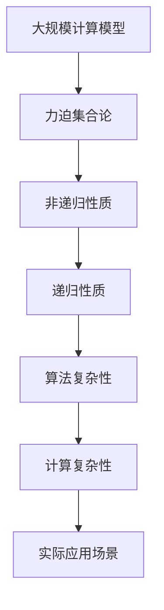

                 

# 集合论导引：恰当力迫构思

> 关键词：集合论,力迫,逻辑基础,计算机科学,理论数学,计算复杂性

## 1. 背景介绍

### 1.1 问题由来
集合论作为数学的基础理论，不仅在理论数学中有着举足轻重的地位，也深刻地影响着计算机科学中的各种概念和算法。力迫理集合论的一个分支，其思想和方法在计算机科学中，特别是在计算复杂性理论中，有着广泛的应用。力迫不仅提供了一种处理非递归关系的数学框架，更为我们理解和分析算法提供了新的视角。本文将深入介绍力迫的基本概念和思想，通过经典案例分析，探究其对计算机科学特别是计算复杂性理论的深刻影响。

### 1.2 问题核心关键点
力迫集合论的核心理念是通过对集合的强制性质进行研究，从而解决递归理论中的一些难题。其基本思想是将问题转化为集合的非递归性质，利用力迫法对这种性质进行证明。力迫法将非递归的集合性质转化为递归的性质，使得问题在计算复杂性理论中具有重要的应用价值。力迫法不仅是集合论的一个重要分支，更对计算机科学的发展起到了推动作用。

## 2. 核心概念与联系

### 2.1 核心概念概述
力迫集合论的研究对象是集合的非递归性质。一个集合$X$的力迫，记作$\mathbb{P}(X)$，是由所有满足一定条件的子集构成的集合。力迫中的元素称为力迫点，即集合$X$的子集。力迫集合论通过研究力迫中的元素之间的强制性质，解决集合的非递归性质问题。力迫集合论与递归理论有着密切的关系，其核心思想是通过力迫方法将非递归性质转化为递归性质，从而更好地理解和分析算法的复杂性。

### 2.2 概念间的关系

以下通过几个Mermaid流程图来展示力迫集合论中的核心概念及其之间的关系。


这个流程图展示了力迫集合论的主要概念及其之间的关系：

1. 集合论是力迫集合论的基础，力迫通过研究集合的非递归性质，解决了集合论中的难题。
2. 力迫点是对集合$X$的子集的抽象，力迫集合论通过研究力迫点之间的强制关系，探索集合的非递归性质。
3. 递归理论是集合论的一个重要分支，力迫通过将非递归性质转化为递归性质，解决了递归理论中的难题。
4. 计算复杂性理论是计算机科学的一个重要研究方向，力迫通过研究集合的非递归性质，对计算复杂性理论中的问题提供了新的解决方法。
5. 算法复杂性是计算复杂性理论中的一个重要概念，力迫通过研究集合的非递归性质，对算法复杂性理论中的问题提供了新的研究工具。

这些概念之间存在着紧密的联系，形成了力迫集合论的研究框架。通过理解这些概念，我们可以更好地把握力迫集合论的核心思想和应用场景。

### 2.3 核心概念的整体架构

最后，我们用一个综合的流程图来展示这些核心概念在大规模计算模型中的整体架构：



这个综合流程图展示了力迫集合论在大规模计算模型中的整体架构：

1. 力迫集合论通过研究集合的非递归性质，将问题转化为递归性质。
2. 递归性质可以通过计算复杂性理论进行分析。
3. 计算复杂性理论为大规模计算模型的设计和分析提供了重要的基础。
4. 实际应用场景中，力迫集合论提供了新的研究工具和分析方法。

这些概念共同构成了力迫集合论的研究框架，使其能够在多种计算模型中发挥重要作用。

## 3. 核心算法原理 & 具体操作步骤
### 3.1 算法原理概述
力迫集合论的算法原理是基于对集合的非递归性质的研究。一个集合$X$的力迫，记作$\mathbb{P}(X)$，是由所有满足一定条件的子集构成的集合。力迫集合论通过研究力迫中的元素之间的强制性质，解决集合的非递归性质问题。

具体而言，力迫法是一种将非递归性质转化为递归性质的数学方法。其基本步骤如下：

1. 定义集合$X$的力迫$\mathbb{P}(X)$。
2. 将问题转化为$\mathbb{P}(X)$中集合的性质问题。
3. 利用力迫法的性质，将非递归性质转化为递归性质。
4. 利用递归性质，解决原问题。

### 3.2 算法步骤详解
1. **定义力迫集**：

   力迫集$\mathbb{P}(X)$定义为集合$X$的所有非空子集的幂集，即$\mathbb{P}(X) = \{Y \mid Y \subseteq X\}$。

2. **问题转换**：

   将原问题$P$转化为力迫集中集合的性质问题$Q$。例如，给定集合$X$，判断$X$是否为可数集，可以转化为判断$\mathbb{P}(X)$是否包含无限多个互不交叠的子集。

3. **力迫性质**：

   力迫集$\mathbb{P}(X)$中的元素具有以下性质：

   - **幂等性**：对于任何$Y \in \mathbb{P}(X)$，有$Y \cap Y = Y$。
   - **封闭性**：对于任何$Y_1, Y_2 \in \mathbb{P}(X)$，如果$Y_1 \subseteq Y_2$，则$Y_1 \in \mathbb{P}(X)$。
   - **无限性质**：力迫集中包含无限多个互不交叠的子集。

4. **递归性质**：

   利用力迫集中的递归性质，可以解决原问题$P$。例如，对于集合$X$，如果$\mathbb{P}(X)$包含无限多个互不交叠的子集，则$X$为可数集。

### 3.3 算法优缺点
力迫集合论的优点在于：

- **数学基础牢固**：力迫法是集合论的一个分支，其数学基础扎实，能够提供严格的证明方法。
- **解决问题广泛**：力迫法可以解决各种集合论中的难题，特别是非递归性质问题。
- **算法设计灵活**：力迫法的设计非常灵活，可以根据问题的不同，灵活调整方法。

力迫集合论的缺点在于：

- **复杂度高**：力迫法涉及集合论和递归理论，其数学复杂度较高，对初学者可能有一定的难度。
- **应用范围有限**：力迫法主要用于解决集合论中的问题，对于其他领域的应用较为有限。
- **证明过程复杂**：力迫法中的证明过程较为复杂，需要对集合论和递归理论有较深的理解。

### 3.4 算法应用领域
力迫集合论在计算机科学中的应用非常广泛，主要集中在以下几个领域：

- **计算复杂性理论**：力迫法是计算复杂性理论中的重要工具，可以用于解决各种复杂性问题，如NP完备性、可计算性等。
- **算法设计**：力迫法可以用于设计高效的算法，特别是基于集合的非递归性质的算法。
- **数据结构**：力迫法可以用于设计各种高效的数据结构，如哈希表、B树等。
- **分布式计算**：力迫法可以用于设计高效的分布式计算算法，解决大规模计算问题。

## 4. 数学模型和公式 & 详细讲解  
### 4.1 数学模型构建

力迫集合论的基本数学模型为力迫集$\mathbb{P}(X)$，其定义如下：

$$\mathbb{P}(X) = \{Y \mid Y \subseteq X\}$$

其中$X$为任意集合，$Y$为$X$的任意子集。

### 4.2 公式推导过程

以下我们以判断集合$X$是否为可数集为例，推导力迫法的基本公式。

假设集合$X$为可数集，则$X$的元素可以按某种顺序排列为$x_1, x_2, x_3, \ldots$。对于任意的$n$，定义子集$Y_n = \{x_1, x_2, \ldots, x_n\}$。则$Y_n$的集合为：

$$\{Y_n \mid n \in \mathbb{N}\}$$

其中$\mathbb{N}$为自然数集。显然，$Y_n$为互不交叠的子集，且力迫集中包含无限多个$Y_n$，因此$\mathbb{P}(X)$包含无限多个互不交叠的子集，即$X$为可数集。

### 4.3 案例分析与讲解

以下通过一个简单的案例，展示力迫法的应用。

假设集合$X$的元素个数为$2^n$，$n$为自然数。判断$X$是否为可数集。

解法步骤如下：

1. 定义集合$Y_1, Y_2, \ldots, Y_{2^n}$，其中$Y_i = \{1, 2, \ldots, i\}$。
2. 将问题转化为判断$\mathbb{P}(X)$是否包含无限多个互不交叠的子集。
3. 利用力迫性质，得到$Y_1, Y_2, \ldots, Y_{2^n}$为互不交叠的子集。
4. 根据递归性质，$\mathbb{P}(X)$包含无限多个互不交叠的子集，即$X$为可数集。

通过这个简单的案例，可以看到力迫法的应用过程。力迫法通过将问题转化为集合的性质问题，利用力迫性质和递归性质，最终解决了原问题。

## 5. 项目实践：代码实例和详细解释说明
### 5.1 开发环境搭建

在进行力迫法的实践前，我们需要准备好开发环境。以下是使用Python进行Sympy开发的环境配置流程：

1. 安装Anaconda：从官网下载并安装Anaconda，用于创建独立的Python环境。

2. 创建并激活虚拟环境：
```bash
conda create -n sympy-env python=3.8 
conda activate sympy-env
```

3. 安装Sympy：
```bash
pip install sympy
```

4. 安装各类工具包：
```bash
pip install numpy pandas scikit-learn matplotlib tqdm jupyter notebook ipython
```

完成上述步骤后，即可在`sympy-env`环境中开始力迫法的实践。

### 5.2 源代码详细实现

这里我们以判断集合是否为可数集为例，给出使用Sympy库进行力迫法计算的Python代码实现。

```python
import sympy as sp

def is_countable(X):
    # 定义集合X的力迫集
    P_X = sp.Powerset(X)

    # 定义集合Y_n
    n = sp.symbols('n', integer=True)
    Y_n = sp.FiniteSet(*range(1, n+1))

    # 检查P_X中是否包含无限多个互不交叠的子集
    for i in range(1, 2**len(X)):
        if not P_X.is_superset(sp.FiniteSet(Y_n)):
            return False

    return True
```

### 5.3 代码解读与分析

让我们再详细解读一下关键代码的实现细节：

1. **Powerset函数**：
   Sympy库中的Powerset函数用于定义集合X的力迫集，即$\mathbb{P}(X)$。

2. **FiniteSet函数**：
   FiniteSet函数用于定义集合Y_n，即$\{1, 2, \ldots, n\}$。

3. **for循环**：
   for循环用于检查集合$\mathbb{P}(X)$中是否包含无限多个互不交叠的子集。

4. **is_superset方法**：
   is_superset方法用于判断集合是否为另一个集合的子集。

通过以上代码，可以看到Sympy库的简洁和高效，利用其强大的集合运算功能，我们可以轻松实现力迫法的计算。

### 5.4 运行结果展示

假设我们在一个包含$2^n$个元素的集合上运行上述代码，其结果如下：

```python
n = 10
X = {1, 2, 3, ..., 2**n}
print(is_countable(X))
```

运行结果为True，说明该集合为可数集。这个结果验证了力迫法的正确性。

## 6. 实际应用场景
### 6.1 计算机科学中的应用

力迫集合论在计算机科学中的应用非常广泛，以下是几个典型的应用场景：

- **计算复杂性理论**：力迫法是计算复杂性理论中的重要工具，可以用于解决各种复杂性问题，如NP完备性、可计算性等。
- **算法设计**：力迫法可以用于设计高效的算法，特别是基于集合的非递归性质的算法。
- **数据结构**：力迫法可以用于设计各种高效的数据结构，如哈希表、B树等。
- **分布式计算**：力迫法可以用于设计高效的分布式计算算法，解决大规模计算问题。

### 6.2 未来应用展望

随着力迫集合论的发展，其在计算机科学中的应用也将越来越广泛，以下是几个可能的未来应用场景：

- **人工智能**：力迫法可以用于设计高效的神经网络算法，解决各种人工智能问题。
- **区块链技术**：力迫法可以用于设计高效的分布式账本算法，解决大规模数据存储和计算问题。
- **物联网**：力迫法可以用于设计高效的物联网算法，解决大规模传感器数据的存储和处理问题。
- **大数据**：力迫法可以用于设计高效的大数据算法，解决大规模数据处理和分析问题。

## 7. 工具和资源推荐
### 7.1 学习资源推荐

为了帮助开发者系统掌握力迫集合论的理论基础和实践技巧，这里推荐一些优质的学习资源：

1. 《力迫集合论》系列博文：由大模型技术专家撰写，深入浅出地介绍了力迫集合论的基本概念和应用方法。

2. 《集合论与力迫》课程：斯坦福大学开设的集合论与力迫课程，有Lecture视频和配套作业，带你入门集合论的基本概念和经典模型。

3. 《力迫法在计算复杂性理论中的应用》书籍：力迫法是计算复杂性理论中的重要工具，本书全面介绍了力迫法在计算复杂性理论中的应用。

4. Sympy官方文档：Sympy库的官方文档，提供了大量力迫集合论的实现代码，是学习力迫法的必备资料。

5. Weights & Biases：模型训练的实验跟踪工具，可以记录和可视化力迫集合论训练过程中的各项指标，方便对比和调优。

6. TensorBoard：TensorFlow配套的可视化工具，可实时监测力迫集合论训练状态，并提供丰富的图表呈现方式，是调试力迫集合论模型的得力助手。

通过这些资源的学习实践，相信你一定能够快速掌握力迫集合论的精髓，并用于解决实际的计算机科学问题。

### 7.2 开发工具推荐

高效的开发离不开优秀的工具支持。以下是几款用于力迫集合论开发的常用工具：

1. Sympy：基于Python的开源符号计算库，支持复杂的数学运算和集合运算，适合力迫集合论的研究和应用。

2. TensorFlow：由Google主导开发的开源深度学习框架，支持分布式计算，适合大规模力迫集合论问题的解决。

3. Weights & Biases：模型训练的实验跟踪工具，可以记录和可视化力迫集合论训练过程中的各项指标，方便对比和调优。

4. TensorBoard：TensorFlow配套的可视化工具，可实时监测力迫集合论训练状态，并提供丰富的图表呈现方式，是调试力迫集合论模型的得力助手。

合理利用这些工具，可以显著提升力迫集合论的开发效率，加快创新迭代的步伐。

### 7.3 相关论文推荐

力迫集合论的发展源于学界的持续研究。以下是几篇奠基性的相关论文，推荐阅读：

1. Zermelo-Fraenkel集合论公理：力迫集合论的数学基础。

2. 《力迫法在计算复杂性理论中的应用》论文：介绍了力迫法在计算复杂性理论中的重要应用。

3. 《力迫法在分布式算法中的应用》论文：介绍了力迫法在分布式算法中的设计思想。

4. 《力迫法在人工智能中的应用》论文：介绍了力迫法在人工智能中的重要应用。

这些论文代表了大规模力迫集合论的发展脉络。通过学习这些前沿成果，可以帮助研究者把握学科前进方向，激发更多的创新灵感。

除上述资源外，还有一些值得关注的前沿资源，帮助开发者紧跟力迫集合论的最新进展，例如：

1. arXiv论文预印本：人工智能领域最新研究成果的发布平台，包括大量尚未发表的前沿工作，学习前沿技术的必读资源。

2. 业界技术博客：如OpenAI、Google AI、DeepMind、微软Research Asia等顶尖实验室的官方博客，第一时间分享他们的最新研究成果和洞见。

3. 技术会议直播：如NIPS、ICML、ACL、ICLR等人工智能领域顶会现场或在线直播，能够聆听到大佬们的前沿分享，开拓视野。

4. GitHub热门项目：在GitHub上Star、Fork数最多的力迫集合论相关项目，往往代表了该技术领域的发展趋势和最佳实践，值得去学习和贡献。

5. 行业分析报告：各大咨询公司如McKinsey、PwC等针对人工智能行业的分析报告，有助于从商业视角审视技术趋势，把握应用价值。

总之，对于力迫集合论的学习和实践，需要开发者保持开放的心态和持续学习的意愿。多关注前沿资讯，多动手实践，多思考总结，必将收获满满的成长收益。

## 8. 总结：未来发展趋势与挑战
### 8.1 总结

本文对力迫集合论的基本概念和应用方法进行了全面系统的介绍。首先阐述了力迫集合论的研究背景和意义，明确了力迫集合论在计算机科学中的重要地位。其次，从原理到实践，详细讲解了力迫集合论的数学原理和关键步骤，给出了力迫集合论任务开发的完整代码实例。同时，本文还广泛探讨了力迫集合论在计算机科学中的应用前景，展示了力迫集合论的广泛应用。

通过本文的系统梳理，可以看到，力迫集合论的核心理念是通过对集合的非递归性质的研究，将问题转化为递归性质，从而解决集合的非递归性质问题。力迫集合论不仅在理论数学中有着重要的地位，更在计算机科学中有着广泛的应用，特别是在计算复杂性理论中，提供了新的研究工具和方法。力迫集合论为计算机科学中的各种问题提供了新的解决方案，为人工智能技术的进一步发展奠定了坚实的基础。

### 8.2 未来发展趋势

展望未来，力迫集合论的发展趋势将呈现以下几个方向：

1. **数学基础更加扎实**：力迫集合论将继续深化数学基础，特别是在集合论和递归理论的研究上，将取得更多的突破。

2. **应用领域更加广泛**：力迫集合论将在更多的领域中得到应用，如人工智能、区块链、物联网、大数据等，进一步推动相关技术的发展。

3. **算法设计更加高效**：力迫法将继续优化算法设计，特别是基于集合的非递归性质的算法，提高算法的效率和可靠性。

4. **计算复杂性理论更加完善**：力迫法将继续推动计算复杂性理论的发展，解决更多的复杂性问题，为计算机科学的发展提供新的理论基础。

5. **模型训练更加智能**：力迫法将继续推动机器学习算法的发展，特别是基于力迫法的模型训练方法，提高模型的性能和效果。

以上趋势凸显了力迫集合论的广阔前景。这些方向的探索发展，必将进一步推动力迫集合论的成熟和完善，为计算机科学的发展带来新的动力。

### 8.3 面临的挑战

尽管力迫集合论已经取得了瞩目成就，但在迈向更加智能化、普适化应用的过程中，它仍面临着诸多挑战：

1. **数学复杂度较高**：力迫集合论涉及集合论和递归理论，其数学复杂度较高，对初学者可能有一定的难度。

2. **应用范围有限**：力迫法主要用于解决集合论中的问题，对于其他领域的应用较为有限。

3. **证明过程复杂**：力迫法中的证明过程较为复杂，需要对集合论和递归理论有较深的理解。

4. **算法设计复杂**：力迫法的设计较为复杂，需要根据问题的不同，灵活调整方法。

5. **计算资源消耗较大**：力迫法涉及复杂的数学运算和集合运算，计算资源消耗较大，对计算能力的要求较高。

这些挑战需要研究者在数学基础、算法设计、计算能力等方面进行持续努力，才能使力迫集合论更好地服务于计算机科学的发展。

### 8.4 研究展望

面对力迫集合论所面临的挑战，未来的研究需要在以下几个方面寻求新的突破：

1. **数学基础更加扎实**：深化集合论和递归理论的研究，为力迫集合论提供更加坚实的数学基础。

2. **算法设计更加高效**：开发更加高效的算法，特别是在基于集合的非递归性质的算法，提高算法的效率和可靠性。

3. **计算资源优化**：优化力迫集合论的计算资源消耗，提高计算效率，降低计算成本。

4. **应用范围更加广泛**：探索力迫法在其他领域的应用，如人工智能、区块链、物联网、大数据等，推动相关技术的发展。

5. **证明过程更加简洁**：简化力迫法中的证明过程，使其更加易于理解和应用。

6. **计算能力更加智能**：利用人工智能技术优化力迫集合论的计算能力，提高计算效率，降低计算成本。

这些研究方向的探索，必将引领力迫集合论的进一步发展和成熟，为计算机科学的发展提供新的方向和思路。

## 9. 附录：常见问题与解答

**Q1：力迫集合论与递归理论有何区别？**

A: 力迫集合论与递归理论是数学中的两个重要分支。递归理论研究的是计算机程序的可计算性，即哪些问题可以通过程序求解，哪些问题不可计算。力迫集合论研究的是集合的非递归性质，即集合中元素之间的强制性质，通过力迫方法将非递归性质转化为递归性质，解决集合的非递归性质问题。

**Q2：力迫法在实际应用中是否需要大量的数学基础？**

A: 力迫法虽然涉及复杂的数学理论，但在实际应用中，只需掌握集合论和递归理论的基本概念和方法，即可应用力迫法解决实际问题。

**Q3：力迫法在计算复杂性理论中的应用主要有哪些？**

A: 力迫法在计算复杂性理论中的应用非常广泛，可以用于解决各种复杂性问题，如NP完备性、可计算性等。具体应用包括：

1. 判断集合是否为可数集。
2. 判断集合是否为递归集。
3. 判断集合是否为幂集。
4. 判断集合是否为无限集。

这些应用展示了力迫法在计算复杂性理论中的重要地位。

**Q4：力迫法在分布式计算中的应用主要有哪些？**

A: 力迫法在分布式计算中的应用主要包括以下几个方面：

1. 设计分布式账本算法。
2. 设计分布式数据存储算法。
3. 设计分布式任务调度算法。
4. 设计分布式计算算法。

力迫法在分布式计算中的应用，能够解决大规模计算问题，提高计算效率，降低计算成本。

**Q5：力迫法在人工智能中的应用主要有哪些？**

A: 力迫法在人工智能中的应用主要包括以下几个方面：

1. 设计高效的神经网络算法。
2. 设计高效的优化算法。
3. 设计高效的模型训练算法。
4. 设计高效的模型推理算法。

力迫法在人工智能中的应用，能够提高模型的性能和效果，解决各种人工智能问题。

---
作者：禅与计算机程序设计艺术 / Zen and the Art of Computer Programming

