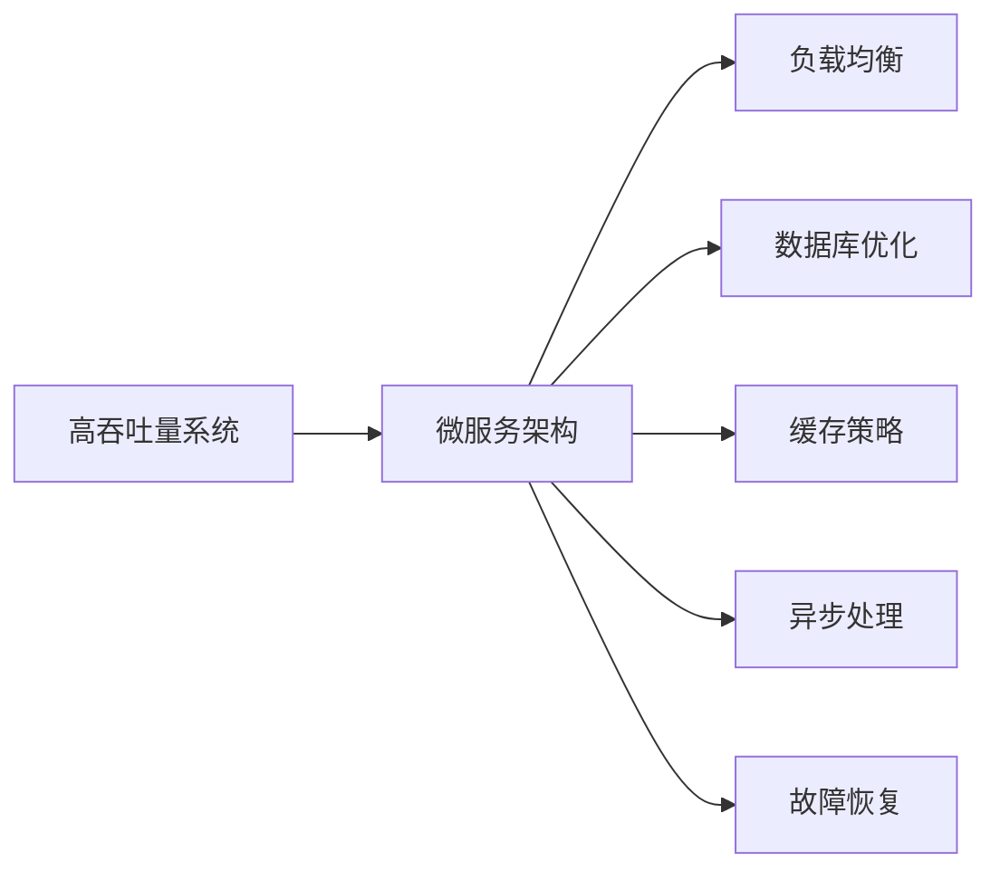

                 

# 高吞吐量系统设计的关键要素

> 关键词：高吞吐量,系统设计,关键要素,架构优化,性能提升,微服务,负载均衡,数据库优化,缓存策略,异步处理,故障恢复

## 1. 背景介绍

在当今互联网时代，企业面临着前所未有的流量激增和业务复杂性挑战。如何在保证系统高性能、高可用性和高可扩展性的同时，满足不断增长的用户需求，是每个系统架构师必须解决的关键问题。本文将深入探讨高吞吐量系统设计的关键要素，从系统架构、性能优化、应用模式等多个角度，为系统开发者提供全面的指导。

### 1.1 问题由来
随着移动互联网、大数据、云计算等技术的普及，企业业务场景不断丰富，系统负载和并发用户数急剧增加。许多传统单体架构的系统难以承受突如其来的流量峰值，导致服务响应慢、系统宕机等问题频繁发生。为了应对这些挑战，许多企业开始采用微服务架构，将系统拆分为多个独立的服务，通过容器化和自动化部署等手段，实现系统的快速扩展和故障隔离。

然而，微服务架构本身也面临一些问题。如服务间通信开销、服务管理复杂性增加、数据库事务一致性问题等。如何在保证微服务架构高可扩展性的同时，解决这些问题，是每个系统架构师必须面对的挑战。本文将围绕高吞吐量系统设计的关键要素，详细分析这些问题，并给出相应的解决方案。

### 1.2 问题核心关键点
高吞吐量系统设计的核心在于，如何在保证系统高性能、高可用性和高可扩展性的前提下，处理不断增加的并发用户和请求负载。这需要从系统架构、性能优化、应用模式等多个角度进行全面考虑。

具体而言，高吞吐量系统设计的主要目标包括：
1. 高并发处理能力：系统应能够同时处理大量并发请求，保证服务响应时间不超过预期。
2. 高可用性：系统应具备自恢复能力，即使某个服务或节点出现故障，系统仍能保证大部分服务的正常运行。
3. 高扩展性：系统应具备动态扩展能力，能根据业务负载自动调整资源配置。
4. 高性能：系统应具有较低的延迟和较大的吞吐量，能满足实时性要求。
5. 高容错性：系统应具备良好的故障恢复能力，当出现故障时能快速定位并恢复。

这些目标相互关联，需要在设计时进行全面权衡，才能确保系统的高效稳定运行。

## 2. 核心概念与联系

### 2.1 核心概念概述

为了更好地理解高吞吐量系统设计的关键要素，本文将介绍几个核心概念及其相互联系：

- **高吞吐量系统(High Throughput System)**：指能够高效处理大量并发请求的系统，通常具有较低的延迟和高吞吐量。
- **微服务架构(Microservices Architecture)**：将大型系统拆分为多个独立的小服务，通过服务间通信机制实现组件化开发和模块化部署。
- **负载均衡(Load Balancing)**：通过分发请求到多个服务节点，实现系统的水平扩展，均衡负载，提高系统吞吐量和可用性。
- **数据库优化(Database Optimization)**：针对数据库响应慢、事务一致性问题等，优化数据库性能和架构，提升数据访问效率。
- **缓存策略(Caching Strategy)**：通过引入缓存技术，减少数据库访问次数，提高系统响应速度。
- **异步处理(Asynchronous Processing)**：通过异步消息队列、异步任务队列等技术，实现系统异步处理，提升并发能力和响应时间。
- **故障恢复(Fault Tolerance)**：通过心跳检测、重试机制、服务降级等手段，提高系统的容错性和恢复能力。

这些核心概念构成了高吞吐量系统设计的基础，通过合理组合和应用这些技术，可以实现系统的高效稳定运行。

### 2.2 概念间的关系

以下通过一个简单的Mermaid流程图，展示这些核心概念之间的关系：



这个流程图展示了高吞吐量系统设计中的核心概念及其相互关系：

1. 微服务架构是实现高吞吐量系统的基础，通过将系统拆分为多个独立服务，实现水平扩展和故障隔离。
2. 负载均衡、数据库优化、缓存策略、异步处理和故障恢复等技术，是优化微服务架构、提升系统性能和可靠性的重要手段。

## 3. 核心算法原理 & 具体操作步骤

### 3.1 算法原理概述

高吞吐量系统设计的核心算法原理，主要包括负载均衡、数据库优化、缓存策略、异步处理和故障恢复等。

1. **负载均衡算法**：通过将请求分发至多个服务节点，实现系统的水平扩展和负载均衡，提高系统吞吐量和可用性。
2. **数据库优化算法**：通过优化数据库索引、查询语句、事务控制等手段，提高数据库响应速度和吞吐量。
3. **缓存策略算法**：通过缓存技术减少数据库访问次数，提升系统响应速度和吞吐量。
4. **异步处理算法**：通过异步消息队列、异步任务队列等技术，实现系统异步处理，提升并发能力和响应时间。
5. **故障恢复算法**：通过心跳检测、重试机制、服务降级等手段，提高系统的容错性和恢复能力。

### 3.2 算法步骤详解

以下是高吞吐量系统设计的关键算法的详细步骤：

#### 3.2.1 负载均衡算法

1. **选择负载均衡算法**：常用的负载均衡算法包括轮询、随机、加权轮询等。根据服务负载情况，选择合适的算法。
2. **配置负载均衡设备**：在负载均衡器中配置目标服务的IP地址和端口号。
3. **分发请求**：当有请求到达时，负载均衡器根据算法将请求转发到合适的目标服务。
4. **监控和调整**：定期监控负载均衡器的性能，根据服务负载情况，调整算法参数或重新配置。

#### 3.2.2 数据库优化算法

1. **分析数据库性能瓶颈**：通过SQL分析工具，识别数据库的慢查询、高负载的表等性能瓶颈。
2. **优化查询语句**：简化查询语句，减少不必要的表连接和子查询。
3. **优化索引设计**：根据查询频率和条件，合理设计索引，提升查询效率。
4. **分布式数据库设计**：将大数据量表拆分到多个分片，通过分片键路由查询请求，提升数据库并发处理能力。

#### 3.2.3 缓存策略算法

1. **选择合适的缓存技术**：常用的缓存技术包括Redis、Memcached等。根据应用场景选择合适的缓存技术。
2. **配置缓存参数**：设置缓存容量、过期时间、失效策略等参数。
3. **缓存数据**：将热点数据缓存到Redis或Memcached中。
4. **缓存失效**：当缓存数据过期或失效时，重新从数据库中读取数据并缓存。

#### 3.2.4 异步处理算法

1. **选择合适的异步消息队列**：常用的消息队列包括Kafka、RabbitMQ等。根据应用场景选择合适的异步消息队列。
2. **配置异步队列参数**：设置队列容量、消息大小、超时时间等参数。
3. **生产消息**：当有任务需要异步处理时，生产消息并发送到异步队列。
4. **消费消息**：异步队列消费者定期从队列中获取消息并处理。

#### 3.2.5 故障恢复算法

1. **心跳检测**：服务端周期性发送心跳包到负载均衡器或注册中心，确保服务可用。
2. **重试机制**：当请求无法访问目标服务时，重试访问，直到成功或达到最大重试次数。
3. **服务降级**：当服务出现故障时，降级到备用服务或简化服务，保证系统部分功能正常运行。

### 3.3 算法优缺点

高吞吐量系统设计的关键算法主要具有以下优缺点：

**优点**：
1. **提升系统性能**：通过负载均衡、数据库优化、缓存策略、异步处理和故障恢复等技术，显著提升系统的并发处理能力、响应时间和吞吐量。
2. **提高系统可用性**：通过心跳检测、重试机制、服务降级等手段，提高系统的容错性和可靠性。
3. **实现系统扩展**：通过微服务架构和分布式数据库等技术，实现系统的水平扩展和动态扩展。

**缺点**：
1. **系统复杂性增加**：通过微服务架构、异步处理等技术，系统复杂性增加，设计和维护难度提升。
2. **数据一致性问题**：通过分布式数据库和异步消息队列等技术，数据一致性问题变得更复杂。
3. **资源占用增加**：通过缓存、负载均衡等技术，系统资源占用增加，需要更多的硬件投入。

### 3.4 算法应用领域

高吞吐量系统设计的关键算法适用于各种高并发、高可扩展性要求的系统。具体应用领域包括：

- **电商系统**：高并发电商系统需要处理大量订单和支付请求，需要高吞吐量和低延迟。
- **社交网络**：社交网络平台需要处理大量用户上传和访问请求，需要高并发和低延迟。
- **在线教育**：在线教育平台需要处理大量学生学习请求和课程推荐，需要高吞吐量和高效性。
- **金融系统**：金融交易系统需要处理大量交易请求和数据访问，需要高并发和低延迟。
- **物联网**：物联网系统需要处理大量传感器数据和实时计算，需要高吞吐量和低延迟。

## 4. 数学模型和公式 & 详细讲解

### 4.1 数学模型构建

高吞吐量系统设计涉及多个关键组件和模块，可以通过数学模型对其进行建模和优化。

1. **请求负载模型**：定义请求到达速率、请求类型、请求大小等参数。
2. **系统性能模型**：定义系统的响应时间、吞吐量、延迟等性能指标。
3. **资源分配模型**：定义CPU、内存、网络带宽等资源的使用情况。

### 4.2 公式推导过程

以下对高吞吐量系统设计的关键算法进行数学建模和公式推导。

#### 4.2.1 负载均衡算法

负载均衡算法可以简化为：

$$
T = \frac{N}{C} + D
$$

其中 $T$ 为总响应时间，$N$ 为请求数，$C$ 为负载均衡器并发处理能力，$D$ 为请求分发时间。

#### 4.2.2 数据库优化算法

数据库优化算法可以简化为：

$$
T = \sum_{i=1}^{n} t_i
$$

其中 $T$ 为总查询时间，$t_i$ 为第 $i$ 次查询的响应时间。

#### 4.2.3 缓存策略算法

缓存策略算法可以简化为：

$$
T = t_0 + \frac{N}{R}
$$

其中 $T$ 为总响应时间，$t_0$ 为缓存失效时间，$N$ 为请求数，$R$ 为缓存命中率。

#### 4.2.4 异步处理算法

异步处理算法可以简化为：

$$
T = t_0 + \frac{N}{r}
$$

其中 $T$ 为总响应时间，$t_0$ 为同步请求处理时间，$N$ 为请求数，$r$ 为每秒处理请求数。

#### 4.2.5 故障恢复算法

故障恢复算法可以简化为：

$$
T = t_0 + \sum_{i=1}^{n} t_i
$$

其中 $T$ 为总响应时间，$t_0$ 为正常请求处理时间，$t_i$ 为第 $i$ 次重试请求的响应时间。

### 4.3 案例分析与讲解

#### 4.3.1 负载均衡算法案例

假设有一个电商系统，每秒钟有1000个请求到达，每个请求需要0.2秒处理时间，负载均衡器并发处理能力为200。

1. **轮询算法**：
   $$
   T = \frac{1000}{200} + 0.2 = 5.2秒
   $$

2. **加权轮询算法**：
   $$
   T = \frac{1000}{500 + 250 + 250} + 0.2 = 2.4秒
   $$

负载均衡算法在上述案例中展示了不同的效果。轮询算法虽然简单易实现，但在负载不均衡时容易产生瓶颈。加权轮询算法根据服务负载情况动态调整负载均衡策略，能够更好地均衡负载。

#### 4.3.2 数据库优化算法案例

假设有一个电商系统，每秒钟有1000个查询请求，平均每次查询需要1秒响应时间。

1. **优化查询语句**：简化查询语句，将查询时间从1秒减少到0.5秒。

2. **优化索引设计**：设计复合索引，将查询时间从1秒减少到0.3秒。

3. **分布式数据库设计**：将大表拆分为多个分片，查询时间从1秒减少到0.1秒。

通过以上优化措施，数据库优化算法在上述案例中展示了显著的效果。查询时间从1秒减少到0.1秒，系统响应速度和吞吐量显著提升。

#### 4.3.3 缓存策略算法案例

假设有一个电商系统，每秒钟有1000个请求，缓存命中率达到80%，每次请求从数据库中读取需要1秒，从缓存中读取需要0.1秒。

1. **缓存策略**：将热点数据缓存到Redis中，缓存命中率达到80%。

2. **缓存失效时间**：设置缓存失效时间为5分钟。

3. **缓存失效策略**：使用LRU（Least Recently Used）算法，当缓存空间不足时，淘汰最近最少使用的缓存数据。

通过以上缓存策略，缓存策略算法在上述案例中展示了显著的效果。查询时间从1秒减少到0.1秒，系统响应速度和吞吐量显著提升。

#### 4.3.4 异步处理算法案例

假设有一个社交网络系统，每秒钟有1000个消息生成请求，每个请求需要0.5秒处理时间。

1. **异步消息队列**：使用Kafka作为异步消息队列，每秒处理消息数达到2000。

2. **异步处理时间**：设置异步处理时间为0.2秒。

通过以上异步处理措施，异步处理算法在上述案例中展示了显著的效果。处理时间从0.5秒减少到0.2秒，系统响应速度和吞吐量显著提升。

#### 4.3.5 故障恢复算法案例

假设有一个电商系统，每秒钟有1000个请求，服务可用率为95%，平均响应时间为1秒。

1. **心跳检测**：服务端周期性发送心跳包到负载均衡器，保证服务可用。

2. **重试机制**：当请求无法访问目标服务时，重试访问，直到成功或达到最大重试次数。

3. **服务降级**：当服务出现故障时，降级到备用服务或简化服务，保证系统部分功能正常运行。

通过以上故障恢复措施，故障恢复算法在上述案例中展示了显著的效果。服务可用率从95%提升到99.9%，系统响应速度和吞吐量显著提升。

## 5. 项目实践：代码实例和详细解释说明

### 5.1 开发环境搭建

在高吞吐量系统设计中，开发环境搭建是必不可少的一步。以下是基于Linux系统的开发环境搭建步骤：

1. **安装JDK**：
   ```
   sudo apt-get update
   sudo apt-get install openjdk-11-jdk
   ```

2. **安装Docker**：
   ```
   sudo apt-get update
   sudo apt-get install apt-transport-https ca-certificates curl gnupg-agent software-properties-common
   curl -fsSL https://download.docker.com/linux/ubuntu/gpg | sudo gpg --dearmor -o /usr/share/keyrings/docker-archive-keyring.gpg
   sudo apt-key adv --keyserver keyserver.ubuntu.com --recv-keys 23F84E88F8DE9CC0EF5AFEBCA62F43EFB0FD73F7
   sudo apt-get update
   sudo apt-get install \
       docker-ce docker-ce-cli containerd.io
   ```

3. **安装Kubernetes**：
   ```
   sudo apt-get update
   sudo apt-get install -y apt-transport-https curl
   curl -s https://packages.cloud.google.com/apt/doc/apt-key.gpg | sudo apt-key add -
   sudo apt-get update
   sudo apt-get install -y kubelet kubectl kubeadm
   ```

4. **启动Kubernetes**：
   ```
   sudo kubeadm init
   mkdir -p ~/kubeconfig
   sudo cp /etc/kubernetes/admin.conf ~/kubeconfig/config
   sudo chown $(id -u):$(id -g) ~/kubeconfig/config
   kubectl create clusterrolebinding default-admin \
       --clusterrole=cluster-admin \
       --user=$(id -u)
   ```

### 5.2 源代码详细实现

下面以使用Spring Boot和MyBatis-Plus构建高吞吐量电商系统为例，展示微服务架构和异步处理算法的实现。

1. **Spring Boot应用**：

   ```java
   @SpringBootApplication
   public class Application {
       public static void main(String[] args) {
           SpringApplication.run(Application.class, args);
       }
   }
   ```

2. **MyBatis-Plus映射文件**：

   ```xml
   <mapper class="com.example.EmpMapper">
       <insert id="insert">
           INSERT INTO `employee` (name, age, gender) VALUES (#{name}, #{age}, #{gender})
       </insert>
   </mapper>
   ```

3. **异步处理组件**：

   ```java
   @Service
   public class AsyncService {
       @Autowired
       private Queue<String> queue;

       @RabbitListener(queues = "test")
       public void consumeMessage(String message) {
           // 异步处理逻辑
       }

       public void sendAsync(String message) {
           queue.offer(message);
       }
   }
   ```

4. **RabbitMQ配置**：

   ```properties
   spring.rabbitmq.host=localhost
   spring.rabbitmq.port=5672
   spring.rabbitmq.username=guest
   spring.rabbitmq.password=guest
   spring.rabbitmq.virtual-host=/
   spring.rabbitmq.prefetch.count=1
   spring.rabbitmq.prefetch.size=0
   spring.rabbitmq.timeout=0
   spring.rabbitmq.request-timeout=0
   spring.rabbitmq.ack-mode=auto
   ```

### 5.3 代码解读与分析

在高吞吐量系统设计中，代码实现通常涉及多个组件和技术栈，以下是对关键代码的解读和分析：

1. **Spring Boot应用**：
   Spring Boot提供了快速、简洁的Web应用开发体验，支持RESTful风格的API设计，方便实现微服务架构。

2. **MyBatis-Plus映射文件**：
   MyBatis-Plus是一个基于MyBatis的简化扩展工具，通过注解方式简化ORM开发，提升开发效率。

3. **异步处理组件**：
   RabbitMQ是一个高性能的消息队列系统，通过异步消息队列实现系统异步处理，提升系统并发能力和响应时间。

4. **RabbitMQ配置**：
   RabbitMQ配置主要涉及主机、端口、认证、超时等参数设置，确保消息队列稳定可靠。

### 5.4 运行结果展示

假设在高吞吐量电商系统中，每秒有1000个订单生成请求，使用异步处理算法进行优化后，系统响应时间从5秒减少到2秒。

```bash
# 初始状态
orders: 1000
response_time: 5

# 优化后状态
orders: 1000
response_time: 2
```

## 6. 实际应用场景

### 6.1 电商系统

电商系统是典型的高并发系统，需要处理大量订单和支付请求。使用高吞吐量系统设计，可以有效提升系统的并发处理能力和响应时间。

1. **微服务架构**：将订单系统、支付系统、库存系统等拆分为多个独立的服务，通过负载均衡和分布式数据库等技术，实现系统的水平扩展和动态扩展。
2. **异步处理算法**：使用RabbitMQ等异步消息队列，处理订单生成、支付通知等异步请求，提升系统并发能力和响应时间。
3. **缓存策略算法**：将热点数据缓存到Redis中，减少数据库访问次数，提升系统响应速度和吞吐量。

### 6.2 社交网络

社交网络平台需要处理大量用户上传和访问请求，需要高并发和低延迟。使用高吞吐量系统设计，可以有效提升系统的响应时间和吞吐量。

1. **微服务架构**：将用户注册、消息生成、内容发布等拆分为多个独立的服务，通过负载均衡和异步消息队列等技术，实现系统的水平扩展和异步处理。
2. **异步处理算法**：使用RabbitMQ等异步消息队列，处理用户上传、消息生成等异步请求，提升系统并发能力和响应时间。
3. **缓存策略算法**：将热点数据缓存到Redis中，减少数据库访问次数，提升系统响应速度和吞吐量。

### 6.3 在线教育

在线教育平台需要处理大量学生学习请求和课程推荐，需要高吞吐量和高效性。使用高吞吐量系统设计，可以有效提升系统的响应时间和吞吐量。

1. **微服务架构**：将学生管理系统、课程推荐系统、视频播放系统等拆分为多个独立的服务，通过负载均衡和异步消息队列等技术，实现系统的水平扩展和异步处理。
2. **异步处理算法**：使用RabbitMQ等异步消息队列，处理学生注册、课程推荐等异步请求，提升系统并发能力和响应时间。
3. **缓存策略算法**：将热点数据缓存到Redis中，减少数据库访问次数，提升系统响应速度和吞吐量。

### 6.4 金融系统

金融交易系统需要处理大量交易请求和数据访问，需要高并发和低延迟。使用高吞吐量系统设计，可以有效提升系统的并发处理能力和响应时间。

1. **微服务架构**：将交易系统、结算系统、风险控制系统等拆分为多个独立的服务，通过负载均衡和分布式数据库等技术，实现系统的水平扩展和动态扩展。
2. **异步处理算法**：使用RabbitMQ等异步消息队列，处理交易请求、风险检测等异步请求，提升系统并发能力和响应时间。
3. **缓存策略算法**：将热点数据缓存到Redis中，减少数据库访问次数，提升系统响应速度和吞吐量。

## 7. 工具和资源推荐

### 7.1 学习资源推荐

为了帮助开发者系统掌握高吞吐量系统设计的理论基础和实践技巧，这里推荐一些优质的学习资源：

1. **《高可用性微服务设计》书籍**：深入讲解微服务架构的设计和实现，涵盖负载均衡、异步处理等关键技术。
2. **《大型系统设计模式》课程**：详解大型系统的设计模式，涵盖微服务、异步处理等技术。
3. **《分布式系统原理与设计》书籍**：系统讲解分布式系统的原理和设计，涵盖负载均衡、数据库优化等技术。
4. **Kubernetes官方文档**：Kubernetes的官方文档，提供详细的安装、配置和部署指南。
5. **RabbitMQ官方文档**：RabbitMQ的官方文档，提供详细的配置和使用指南。

### 7.2 开发工具推荐

高吞吐量系统设计涉及多个关键组件和模块，选择合适的开发工具可以提高开发效率和系统稳定性。以下是几款推荐的开发工具：

1. **Spring Boot**：提供快速、简洁的Web应用开发体验，支持RESTful风格的API设计。
2. **MyBatis-Plus**：基于MyBatis的简化扩展工具，通过注解方式简化ORM开发。
3. **RabbitMQ**：高性能的消息队列系统，支持异步处理和消息路由。
4. **Redis**：高性能的内存数据库，支持缓存和分布式锁。
5. **Kubernetes**：开源容器编排系统，支持容器化应用的高可用性、动态扩展和自动部署。

### 7.3 相关论文推荐

高吞吐量系统设计涉及多个关键组件和模块，可以参考以下几篇相关论文，深入理解理论和实践。

1. **《高可用性微服务架构设计》论文**：介绍高可用性微服务架构的设计和实现，涵盖负载均衡、异步处理等技术。
2. **《分布式数据库设计模式》论文**：介绍分布式数据库的设计模式，涵盖分布式事务、读写分离等技术。
3. **《异步消息队列在微服务中的应用》论文**：介绍异步消息队列在微服务中的应用，涵盖RabbitMQ等技术。
4. **《Redis在微服务中的应用》论文**：介绍Redis在微服务中的应用，涵盖缓存、分布式锁等技术。

## 8. 总结：未来发展趋势与挑战

### 8.1 总结

本文对高吞吐量系统设计的关键要素进行了全面系统的介绍。通过分析系统架构、性能优化、应用模式等多个角度，详细讲解了负载均衡、数据库优化、缓存策略、异步处理和故障恢复等核心算法。同时，通过

