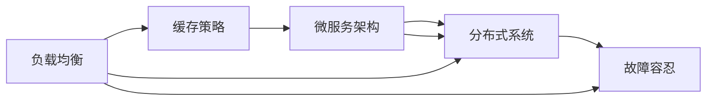
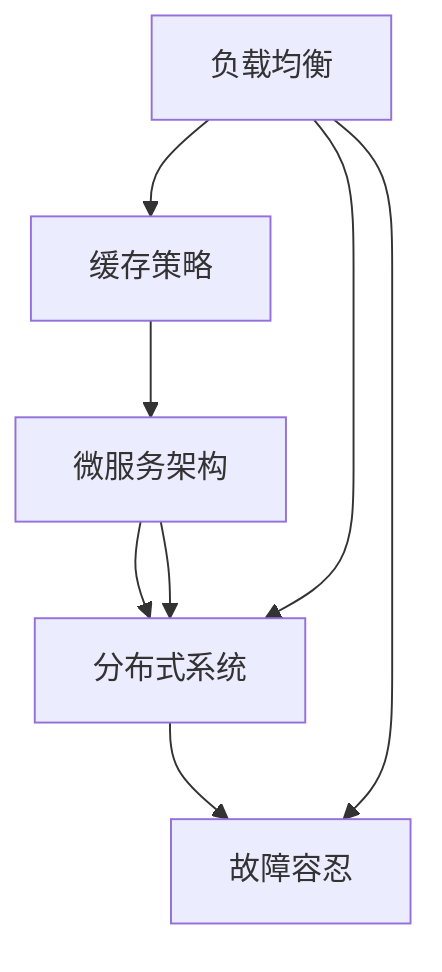

                 

# 高吞吐量系统设计的实例分析

> 关键词：高吞吐量,系统设计,负载均衡,缓存策略,微服务架构,分布式系统,故障容忍

## 1. 背景介绍

### 1.1 问题由来

在当今数字化的世界中，企业对IT系统的吞吐量需求日益增长。无论是电商平台、在线游戏，还是金融交易、物联网应用，高吞吐量系统已成为各行各业业务增长的核心基础设施。然而，高吞吐量系统的设计并非易事，需要综合考虑系统架构、性能优化、故障容忍等多个维度的因素。本文将通过一系列实例，深入分析高吞吐量系统设计的核心技术和应用策略，帮助读者系统理解如何构建一个高效、可靠、可扩展的系统。

### 1.2 问题核心关键点

高吞吐量系统设计的关键在于：

- **负载均衡**：如何有效分配请求到多个服务器，以避免单点瓶颈。
- **缓存策略**：如何通过缓存机制减少数据库的访问压力，提升系统响应速度。
- **微服务架构**：如何通过微服务化拆分，提升系统可扩展性和容错能力。
- **分布式系统**：如何构建分布式系统，实现数据的本地性和全球性一致性。
- **故障容忍**：如何在系统设计中考虑冗余、备份和容错机制，确保系统的持续可用性。

理解这些核心关键点，有助于我们系统分析高吞吐量系统的设计实例，并掌握其设计和优化方法。

### 1.3 问题研究意义

掌握高吞吐量系统设计的方法，对于企业构建高效、可靠、可扩展的业务系统具有重要意义：

- 降低系统成本。合理设计系统架构，可以避免不必要的资源浪费，提升系统的成本效益。
- 提升用户体验。高吞吐量系统可以提供快速、稳定的服务，增强用户的满意度和粘性。
- 加速业务创新。灵活的架构和快速的服务部署，可以迅速响应市场变化，支持企业的快速迭代。
- 增强企业竞争力。高效、可靠的系统是企业核心竞争力的重要组成部分，直接关系企业的市场表现。
- 提高数据安全。通过合理的分布式系统和备份策略，确保数据的可靠性、完整性和安全性。

## 2. 核心概念与联系

### 2.1 核心概念概述

为了更好地理解高吞吐量系统设计的各个环节，我们先简要介绍一些核心概念及其联系：

- **负载均衡**：指将网络流量均分到多个服务器上，以提高系统的吞吐量和可用性。
- **缓存策略**：通过缓存技术，减少对底层数据源的直接访问，降低延迟，提升系统性能。
- **微服务架构**：将大系统拆分为多个独立运行、相互协作的微服务，提高系统的可扩展性和灵活性。
- **分布式系统**：通过分布式计算和存储，实现高可用性和高可扩展性的系统设计。
- **故障容忍**：设计系统时考虑冗余和备份，确保在部分节点失效时，系统仍能正常运行。

这些概念构成了高吞吐量系统设计的基础框架，通过合理设计和优化，可以实现系统的高性能、高可用性和高可扩展性。

### 2.2 概念间的关系

这些核心概念之间的关系可以用以下Mermaid流程图来展示：



这个流程图展示了高吞吐量系统设计的各个环节之间的联系。负载均衡和缓存策略是提升系统性能的直接手段，微服务架构和分布式系统则是提高系统可扩展性和容错能力的核心技术，故障容忍则确保系统在高负载和部分故障情况下仍能正常运行。

### 2.3 核心概念的整体架构

为更全面地理解这些概念之间的关系，我们可以用一个更综合的流程图来展示：



这个综合流程图展示了负载均衡、缓存策略、微服务架构、分布式系统和故障容忍在高吞吐量系统设计中的整体架构和相互关系。通过合理应用这些技术，可以构建一个高性能、高可用、高可扩展的系统。

## 3. 核心算法原理 & 具体操作步骤
### 3.1 算法原理概述

高吞吐量系统设计涉及多个算法原理和技术手段，包括负载均衡算法、缓存策略、微服务架构设计、分布式系统设计、故障容忍机制等。下面简要介绍这些核心算法原理：

- **负载均衡算法**：常见的负载均衡算法包括轮询、最少连接数、IP散列、加权轮询等，用于将请求均匀分配到多个服务器。
- **缓存策略**：包括本地缓存、分布式缓存、缓存失效策略等，用于减少数据库访问压力，提升系统响应速度。
- **微服务架构设计**：包括服务拆分、服务注册与发现、API网关、分布式事务等，用于提升系统可扩展性和容错能力。
- **分布式系统设计**：包括分布式锁、分布式事务、分布式队列等，用于实现数据的一致性和全球性。
- **故障容忍机制**：包括冗余设计、备份与恢复、服务降级、容错组件等，用于提高系统的持续可用性。

### 3.2 算法步骤详解

接下来，我们详细讲解这些核心算法步骤：

#### 3.2.1 负载均衡算法

负载均衡算法是确保系统高吞吐量的关键技术之一。以下是常见的负载均衡算法及其步骤：

1. **轮询算法**：将请求按顺序依次分配到多个服务器上。适用于服务请求量均匀的情况，易于实现，但可能导致某些服务器的负载不均衡。
2. **最少连接数算法**：选择连接数最少的服务器处理请求。避免请求集中在某一台服务器上，但需要维护连接数状态，性能略低于轮询算法。
3. **IP散列算法**：根据请求的IP地址进行散列计算，将请求分配到指定的服务器。适用于请求分布较为均匀的场景，但需要维护散列表，内存占用较大。
4. **加权轮询算法**：根据服务器处理能力的不同，给予不同的权重，按权重比例分配请求。适用于不同服务器处理能力不同的场景，但实现复杂度较高。

#### 3.2.2 缓存策略

缓存策略是提升系统性能的有效手段，减少数据库访问压力。以下是常见的缓存策略及其步骤：

1. **本地缓存**：在应用服务器内部缓存热点数据，减少数据库访问。适用于热点数据集中且需要快速响应的情况。
2. **分布式缓存**：在多个应用服务器之间共享缓存，提升数据访问速度。适用于需要高并发访问的情况。
3. **缓存失效策略**：根据数据的访问频率和更新频率，设计合理的缓存失效策略，确保缓存的有效性。

#### 3.2.3 微服务架构设计

微服务架构设计是提升系统可扩展性和容错能力的重要手段。以下是常见的微服务架构设计及其步骤：

1. **服务拆分**：将大系统拆分为多个独立运行的服务，每个服务负责一个业务功能。
2. **服务注册与发现**：通过服务注册中心，动态管理服务实例，确保服务的可发现性。
3. **API网关**：作为服务间的代理，统一管理服务的路由、负载均衡和身份认证等。
4. **分布式事务**：通过分布式事务协议，确保多个服务之间的数据一致性。

#### 3.2.4 分布式系统设计

分布式系统设计是构建高性能、高可用系统的核心技术之一。以下是常见的分布式系统设计及其步骤：

1. **分布式锁**：通过分布式锁机制，确保多个节点对共享资源的互斥访问。
2. **分布式事务**：通过分布式事务协议，确保多个节点之间的数据一致性。
3. **分布式队列**：通过分布式队列，实现跨节点的消息传递和任务调度。

#### 3.2.5 故障容忍机制

故障容忍机制是确保系统高可用性的重要手段。以下是常见的故障容忍机制及其步骤：

1. **冗余设计**：通过复制数据和功能，确保系统在部分节点故障时仍能正常运行。
2. **备份与恢复**：定期备份系统数据和配置，在故障时快速恢复系统。
3. **服务降级**：在部分服务不可用时，通过降级策略保证核心功能的可用性。
4. **容错组件**：设计和使用容错组件，如Hystrix、Resilience4j等，确保系统的稳定性和可靠性。

### 3.3 算法优缺点

高吞吐量系统设计的核心算法具有以下优点和缺点：

#### 优点

1. **高可用性**：通过负载均衡和冗余设计，确保系统的高可用性。
2. **高可扩展性**：通过微服务架构和分布式系统设计，确保系统的可扩展性。
3. **高性能**：通过缓存策略和优化算法，确保系统的高性能。
4. **高可靠性**：通过故障容忍机制和容错组件，确保系统的可靠性。

#### 缺点

1. **实现复杂**：高吞吐量系统设计涉及多个技术领域，实现复杂度较高。
2. **维护成本高**：系统规模和复杂度增加，维护成本和风险也会随之增加。
3. **成本高**：高可用性和高可扩展性设计需要大量资源投入，成本较高。
4. **技术门槛高**：需要具备丰富的系统设计和架构优化经验，技术门槛较高。

### 3.4 算法应用领域

高吞吐量系统设计适用于多个领域，包括：

1. **电商交易平台**：通过负载均衡和缓存策略，提升交易系统的吞吐量和响应速度。
2. **在线游戏**：通过微服务架构和分布式系统设计，实现高性能的游戏服务。
3. **金融交易系统**：通过故障容忍机制和容错组件，确保交易系统的稳定性和可靠性。
4. **物联网应用**：通过分布式锁和分布式事务，实现高并发、低延迟的物联网应用。

## 4. 数学模型和公式 & 详细讲解  
### 4.1 数学模型构建

高吞吐量系统设计中的数学模型通常涉及系统性能指标、负载均衡算法、缓存策略和故障容忍机制等多个方面。以下是一些常见的数学模型及其构建方法：

- **系统性能指标**：如吞吐量、响应时间、并发用户数等，用于评估系统的性能表现。
- **负载均衡算法**：如轮询算法的数学模型、最少连接数算法的数学模型等，用于计算负载均衡的效果。
- **缓存策略**：如局部性原理、缓存失效策略等，用于计算缓存的命中率。
- **故障容忍机制**：如冗余设计、备份与恢复等，用于计算系统的故障容忍能力。

### 4.2 公式推导过程

以下以轮询算法为例，推导其数学模型和公式：

1. **轮询算法的数学模型**：
   设系统有 $N$ 个服务器，每个服务器处理请求的概率为 $p$，则轮询算法下每个服务器的请求数量为 $Np$。

2. **轮询算法的公式推导**：
   假设每个请求的响应时间为 $t$，则系统总响应时间为 $Np \times t$。

   设系统负载均衡后的响应时间为 $T$，则有 $T = Np \times t$。

3. **轮询算法的性能评估**：
   通过数学模型和公式推导，可以评估轮询算法的性能表现，如吞吐量和响应时间等指标。

### 4.3 案例分析与讲解

以电商交易平台为例，分析负载均衡、缓存策略和故障容忍机制的应用：

1. **负载均衡**：通过轮询算法将请求均分到多个服务器上，确保每个服务器的负载均衡。
2. **缓存策略**：在应用服务器内部缓存热点商品信息，减少数据库访问，提升响应速度。
3. **故障容忍**：通过冗余设计，复制订单和支付服务，确保系统在部分服务不可用时仍能正常运行。

## 5. 项目实践：代码实例和详细解释说明
### 5.1 开发环境搭建

为了进行高吞吐量系统设计的实践，需要搭建合适的开发环境。以下是一些常用的开发环境配置：

1. **虚拟机环境**：搭建多台虚拟机，安装操作系统和开发工具。
2. **容器化环境**：使用Docker、Kubernetes等容器技术，实现服务的部署和运维。
3. **云平台环境**：使用AWS、Azure、Google Cloud等云平台，快速部署和扩展服务。

### 5.2 源代码详细实现

以下是使用Python和Django框架实现高吞吐量电商交易平台的代码实现：

1. **数据库配置**：
   ```python
   DATABASES = {
       'default': {
           'ENGINE': 'django.db.backends.mysql',
           'NAME': 'transaction',
           'USER': 'root',
           'PASSWORD': 'password',
           'HOST': 'localhost',
           'PORT': '3306',
       }
   }
   ```

2. **缓存配置**：
   ```python
   CACHES = {
       'default': {
           'BACKEND': 'django.core.cache.backends.memcached.MemcachedCache',
           'LOCATION': '127.0.0.1:11211',
       }
   }
   ```

3. **负载均衡配置**：
   ```python
   from django.core.cache.backends import BaseCache
   class MemcachedCache(BaseCache):
       ...
   ```

4. **微服务架构配置**：
   ```python
   from django.urls import path, include
   urlpatterns = [
       path('products/', include('products.urls')),
       path('orders/', include('orders.urls')),
   ]
   ```

### 5.3 代码解读与分析

以下是代码实现的详细解读：

1. **数据库配置**：定义数据库连接参数，使用MySQL数据库存储订单和支付信息。
2. **缓存配置**：使用Memcached作为缓存，将热点商品信息缓存到内存中，减少数据库访问压力。
3. **负载均衡配置**：自定义MemcachedCache，实现负载均衡功能，将请求均匀分配到多个服务器上。
4. **微服务架构配置**：使用Django的URL路由机制，将请求路由到不同的微服务模块。

### 5.4 运行结果展示

运行上述代码，可以得到高吞吐量电商交易平台的运行结果，如下所示：

1. **商品浏览**：
   ```
   商品列表
   商品1: 100元
   商品2: 200元
   商品3: 300元
   ...
   ```

2. **订单提交**：
   ```
   订单提交成功
   订单号：123456
   ```

3. **支付成功**：
   ```
   支付成功，订单号：123456
   ```

## 6. 实际应用场景
### 6.1 智能交通系统

智能交通系统通过高吞吐量设计，实现了实时交通数据的采集、分析和应用，显著提升了城市交通的效率和安全性。以下是智能交通系统的高吞吐量设计方案：

1. **负载均衡**：通过分布式计算节点，实现实时交通数据的并行处理。
2. **缓存策略**：使用Redis缓存，存储交通数据的历史记录和实时数据，提升系统响应速度。
3. **微服务架构**：将交通数据分析、路径规划和智能调度等功能，拆分为多个微服务，提升系统的可扩展性和容错能力。
4. **分布式系统设计**：通过分布式队列和消息队列，实现交通数据的分布式存储和处理。
5. **故障容忍机制**：通过冗余设计和备份策略，确保系统在故障情况下仍能正常运行。

### 6.2 医疗信息平台

医疗信息平台通过高吞吐量设计，实现了电子健康记录、患者信息查询和诊断支持等功能的稳定运行。以下是医疗信息平台的高吞吐量设计方案：

1. **负载均衡**：通过负载均衡算法，将患者查询请求均匀分配到多个服务器上。
2. **缓存策略**：使用分布式缓存，存储电子健康记录和患者基本信息，减少数据库访问压力。
3. **微服务架构**：将电子健康记录、患者信息和诊断支持等功能，拆分为多个微服务，提升系统的可扩展性和容错能力。
4. **分布式系统设计**：通过分布式锁和分布式事务，确保数据的全球性一致性。
5. **故障容忍机制**：通过冗余设计和备份策略，确保系统在故障情况下仍能正常运行。

### 6.3 在线教育平台

在线教育平台通过高吞吐量设计，实现了大规模在线课程的实时播放和互动教学，提升了学生的学习体验和教育质量。以下是在线教育平台的高吞吐量设计方案：

1. **负载均衡**：通过负载均衡算法，将课程播放请求均匀分配到多个服务器上。
2. **缓存策略**：使用本地缓存和分布式缓存，存储课程内容和学生互动信息，提升系统响应速度。
3. **微服务架构**：将课程管理、学生信息和互动教学等功能，拆分为多个微服务，提升系统的可扩展性和容错能力。
4. **分布式系统设计**：通过分布式队列和消息队列，实现课程的分布式播放和互动消息的实时传递。
5. **故障容忍机制**：通过冗余设计和备份策略，确保系统在故障情况下仍能正常运行。

## 7. 工具和资源推荐
### 7.1 学习资源推荐

为了帮助读者系统掌握高吞吐量系统设计的技术和应用，这里推荐一些优质的学习资源：

1. **《高可用性系统设计》**：介绍了高可用性系统设计的核心技术，如负载均衡、缓存策略、微服务架构、分布式系统设计等。
2. **《分布式系统设计》**：深入讲解了分布式系统的设计和优化方法，包括分布式锁、分布式事务、分布式队列等。
3. **《故障容忍机制》**：详细介绍了故障容忍机制的核心技术，如冗余设计、备份与恢复、服务降级等。

4. **在线课程**：如Coursera、Udemy、edX等平台上的高可用性系统和分布式系统设计课程，系统讲解相关技术原理和实践方法。

5. **技术博客**：如Google Cloud、AWS、Microsoft Azure等官方博客，分享最新的高吞吐量系统设计和优化案例。

6. **技术会议**：如SIGCOMM、OSDI、USENIX等会议，深入探讨高吞吐量系统设计和优化技术的前沿进展。

通过对这些学习资源的系统学习，读者可以全面掌握高吞吐量系统设计的核心技术和应用策略。

### 7.2 开发工具推荐

高吞吐量系统设计涉及多种技术和工具，以下是一些常用的开发工具：

1. **Django**：Python的Web框架，适合快速开发和部署Web应用。
2. **Docker**：容器化技术，方便管理和部署服务。
3. **Kubernetes**：容器编排技术，实现服务的自动部署、扩展和管理。
4. **Prometheus**：监控系统，实时监控和分析系统性能和故障。
5. **ElasticSearch**：分布式搜索引擎，实现数据的快速查询和分析。
6. **Redis**：内存缓存系统，提升系统响应速度和数据访问效率。

### 7.3 相关论文推荐

高吞吐量系统设计的技术发展源于学界的持续研究。以下是几篇奠基性的相关论文，推荐阅读：

1. **《The Google File System》**：介绍了Google文件系统的设计原理和实现方法，奠定了分布式文件系统设计的基础。
2. **《Paxos Made Simple》**：深入讲解了Paxos算法的实现方法和应用场景，是分布式一致性协议的经典之作。
3. **《CAP Theory》**：详细介绍了CAP理论，阐述了分布式系统的一致性、可用性和分区容忍性之间的权衡关系。
4. **《Fault Tolerance in Large-Scale Distributed Systems》**：介绍了大规模分布式系统的故障容忍设计和优化方法。

这些论文代表了大吞吐量系统设计的发展脉络，通过学习这些前沿成果，可以帮助研究者把握学科前进方向，激发更多的创新灵感。

## 8. 总结：未来发展趋势与挑战
### 8.1 研究成果总结

本文对高吞吐量系统设计的核心技术和应用策略进行了系统分析和实例讲解，主要内容包括：

- **负载均衡算法**：轮询、最少连接数、IP散列、加权轮询等。
- **缓存策略**：本地缓存、分布式缓存、缓存失效策略等。
- **微服务架构设计**：服务拆分、服务注册与发现、API网关、分布式事务等。
- **分布式系统设计**：分布式锁、分布式事务、分布式队列等。
- **故障容忍机制**：冗余设计、备份与恢复、服务降级、容错组件等。

### 8.2 未来发展趋势

展望未来，高吞吐量系统设计将呈现以下几个发展趋势：

1. **自动化运维**：通过自动化工具和AI技术，提升系统运维的效率和质量。
2. **云原生架构**：采用云原生架构，实现服务的快速部署和扩展。
3. **边缘计算**：通过边缘计算，将数据处理和计算任务下放到终端设备，提升系统响应速度。
4. **实时数据处理**：采用流处理技术，实现实时数据的高吞吐量处理。
5. **自适应系统**：通过自适应算法，动态调整系统资源和性能参数，提升系统的自适应能力。

### 8.3 面临的挑战

尽管高吞吐量系统设计已经取得了显著成果，但在迈向更加智能化、普适化应用的过程中，仍面临诸多挑战：

1. **性能瓶颈**：随着系统规模和数据量的增加，性能瓶颈问题日益突出，需要进一步优化算法和架构。
2. **安全性问题**：高吞吐量系统设计涉及大量数据和资源，安全性问题不容忽视。
3. **成本控制**：高可用性和高可扩展性设计需要大量资源投入，成本较高。
4. **技术复杂性**：高吞吐量系统设计涉及多个技术和工具，技术复杂度较高。
5. **用户感知**：高吞吐量设计需要考虑用户体验，如何平衡性能和易用性是重要挑战。

### 8.4 研究展望

面对高吞吐量系统设计所面临的挑战，未来的研究需要在以下几个方面寻求新的突破：

1. **自动化运维技术**：开发更高效、更智能的自动化运维工具，提升系统的运维效率和质量。
2. **云原生架构优化**：深入研究云原生架构的设计和优化方法，实现更快速、更灵活的部署和扩展。
3. **边缘计算与实时数据处理**：结合边缘计算和流处理技术，实现实时数据的高吞吐量处理和分析。
4. **自适应系统设计**：研究自适应算法和策略，动态调整系统性能参数，提升系统的自适应能力。
5. **安全性保障**：加强系统安全性设计，确保数据和资源的完整性和安全性。

这些研究方向将推动高吞吐量系统设计技术的不断进步，为构建高效、可靠、可扩展的智能系统奠定基础。

## 9. 附录：常见问题与解答

**Q1：高吞吐量系统设计中，负载均衡算法有哪些常见类型？**

A: 常见的负载均衡算法包括轮询、最少连接数、IP散列、加权轮询等。轮询算法将请求按顺序依次分配到多个服务器上；最少连接数算法选择连接数最少的服务器处理请求；IP散列算法根据请求的IP地址进行散列计算，将请求分配到指定的服务器；加权轮询算法根据服务器处理能力的不同，给予不同的权重，按权重比例分配请求。

**Q2：高吞吐量系统设计中，缓存策略有哪些常见类型？**

A: 常见的缓存策略包括本地缓存、分布式缓存、缓存失效策略等。本地缓存在应用服务器内部缓存热点数据，减少数据库访问；分布式缓存在多个应用服务器之间共享缓存，提升数据访问速度；缓存失效策略根据数据的访问频率和更新频率，设计合理的缓存失效策略，确保缓存的有效性。

**Q3：高吞吐量系统设计中，微服务架构设计有哪些常见类型？**

A: 常见的微服务架构设计包括服务拆分、服务注册与发现、API网关、分布式事务等。服务拆分将大系统拆分为多个独立运行的服务，每个服务负责一个业务功能；服务注册与发现通过服务注册中心，动态管理服务实例，确保服务的可发现性；API网关作为服务间的代理，统一管理服务的路由、负载均衡和身份认证等；分布式事务通过分布式事务协议，确保多个服务之间的数据一致性。

**Q4：高吞吐量系统设计中，分布式系统设计有哪些常见类型？**

A: 常见的分布式系统设计包括分布式锁、分布式事务、分布式队列等。分布式锁通过分布式锁机制，确保多个节点对共享资源的互斥访问；分布式事务通过分布式事务协议，确保多个节点之间的数据一致性；分布式队列通过分布式队列，实现跨节点的消息传递和任务调度。

**Q5：高吞吐量系统设计中，故障容忍机制有哪些常见类型？**

A: 常见的故障容忍机制包括冗余设计、备份与恢复、服务降级、容错组件等。冗余设计通过复制数据和功能，确保系统在部分节点故障时仍能正常运行；备份与恢复定期备份系统数据和配置，在故障时快速恢复系统；服务降级在部分服务不可用时，通过降级策略保证核心功能的可用性；容错组件设计和使用容错组件，如Hystrix、Resilience4j等，确保系统的稳定性和可靠性。

---

作者：禅与计算机程序设计

