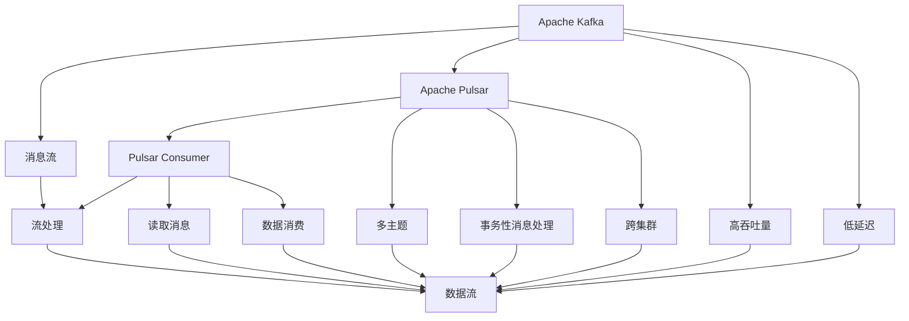

                 

# Pulsar Consumer原理与代码实例讲解

> 关键词：Pulsar, Kafka, Apache Kafka, Message Queue, Stream Processing, Consumer

## 1. 背景介绍

随着大数据和云计算技术的发展，消息队列（Message Queue）成为数据处理的标配，用于高效、可靠地传递数据。Apache Kafka是一个分布式流处理平台，通过消息队列将数据流进行可靠、快速地传递，支持高吞吐量和低延迟的数据处理，广泛应用于实时数据流处理、数据存储、流媒体等领域。Pulsar是Apache软件基金会的最新消息队列系统，作为Kafka的继任者，提供了更强大的功能和大数据处理能力。

本篇文章将深入解析Pulsar消费者（Consumer）的原理和实现，并通过代码实例讲解如何使用Pulsar API进行消息消费。通过本篇文章的学习，读者将掌握Pulsar消费者的基本原理和应用方法，能够灵活配置和使用Pulsar消费者，实现高效的数据流处理。

## 2. 核心概念与联系

### 2.1 核心概念概述

要理解Pulsar消费者，首先需要了解以下几个核心概念：

- **Apache Kafka**：一个开源的消息队列系统，支持高吞吐量和低延迟的数据流处理，广泛应用于实时数据流处理、数据存储、流媒体等领域。
- **Apache Pulsar**：Apache软件基金会推出的新一代消息队列系统，具备Kafka所不具备的许多高级功能，如流流数据存储、事务性消息处理、支持多主题、跨集群等。
- **Pulsar Consumer**：Pulsar消费者用于从Pulsar消息队列中读取消息，实现数据的消费和处理。
- **消息流**：一组按顺序排列的数据流，通常用于传输数据、事件、日志等。
- **流处理**：在数据流上执行计算、分析和转换操作的过程。

这些概念构成了Pulsar消费器的基本架构和实现基础。通过这些概念的解释，读者可以更好地理解Pulsar消费者的工作原理和应用场景。

### 2.2 概念间的关系

以上概念之间的关系可以用以下Mermaid流程图来表示：



这个流程图展示了Kafka、Pulsar和Pulsar消费者之间的关系。Kafka提供高吞吐量和低延迟的数据流处理，而Pulsar则在此基础上，具备了更多的高级功能，如多主题、事务性消息处理和跨集群等。Pulsar消费者用于从Pulsar消息队列中读取消息，并实现数据的消费和处理。

## 3. 核心算法原理 & 具体操作步骤
### 3.1 算法原理概述

Pulsar消费者通过订阅主题（Topic），从Pulsar消息队列中读取消息，并进行数据处理。其基本原理如下：

1. 消费者从Pulsar集群中订阅一个或多个主题。
2. 消费者接收来自Pulsar集群的消息。
3. 消费者处理消息，并将结果返回给Pulsar集群。
4. 消费者根据处理结果，决定是否继续消费。

这个过程可以看作是一个数据流处理过程，每个主题代表一个数据流，消费者从数据流中读取消息，并进行处理。

### 3.2 算法步骤详解

下面详细介绍Pulsar消费者的实现步骤：

1. **订阅主题**：首先，消费者需要订阅一个或多个主题。可以通过Pulsar客户端API或配置文件来指定要订阅的主题。
2. **创建消费者**：创建一个Pulsar消费者对象，并设置相关参数，如消费者组名、订阅的主题等。
3. **连接Pulsar集群**：建立与Pulsar集群的连接，确保消费者能够从集群中获取消息。
4. **处理消息**：消费者接收消息后，进行处理，并将处理结果返回给Pulsar集群。
5. **关闭连接**：处理完成后，关闭与Pulsar集群的连接，释放资源。

### 3.3 算法优缺点

Pulsar消费者的优点包括：

- **高吞吐量**：Pulsar消费者能够处理大量的数据流，支持高吞吐量的数据处理。
- **低延迟**：Pulsar消费者能够快速读取和处理消息，支持低延迟的数据处理。
- **支持事务性消息**：Pulsar消费者支持事务性消息处理，能够保证消息的可靠性和一致性。
- **多主题支持**：Pulsar消费者支持多主题，能够处理多个数据流。
- **跨集群支持**：Pulsar消费者支持跨集群，能够实现分布式数据处理。

然而，Pulsar消费者也存在一些缺点：

- **配置复杂**：Pulsar消费者的配置较为复杂，需要一定的技术背景。
- **维护难度高**：Pulsar集群需要高可用性和容错性，维护难度较高。
- **性能瓶颈**：在大数据量的情况下，Pulsar消费者的性能可能受到瓶颈限制。

### 3.4 算法应用领域

Pulsar消费者在以下几个领域有着广泛的应用：

- **实时数据流处理**：Pulsar消费者能够处理大规模的实时数据流，广泛应用于实时数据流处理、流媒体等领域。
- **数据存储**：Pulsar消费者可以将数据存储在Pulsar集群中，实现数据的持久化和长期存储。
- **流处理**：Pulsar消费者在数据流处理、分析、转换等操作中，具有重要的作用。

这些应用场景展示了Pulsar消费者的强大功能和广泛适用性。

## 4. 数学模型和公式 & 详细讲解 & 举例说明

### 4.1 数学模型构建

Pulsar消费者涉及以下几个关键数学模型：

- **消息队列**：消息队列是一组按顺序排列的数据流，通常用于传输数据、事件、日志等。
- **流处理**：在数据流上执行计算、分析和转换操作的过程。

通过这些模型，Pulsar消费者能够高效地处理数据流，实现数据的可靠、快速传递。

### 4.2 公式推导过程

下面推导Pulsar消费者在流处理中的基本公式：

设消息队列的发送速率为 $R$，消费者处理速率为 $r$，消息队列的长度为 $L$，消费者缓冲区大小为 $B$，则消费者处理时间 $T$ 为：

$$
T = \frac{L}{r}
$$

消费者缓冲区满时，消息队列等待时间 $W$ 为：

$$
W = \frac{L - B}{R}
$$

消费者缓冲区不满时，消息队列等待时间 $W$ 为：

$$
W = \frac{L}{R}
$$

通过这些公式，可以计算出消费者处理时间、消息队列等待时间等关键指标，为Pulsar消费者的优化和调优提供依据。

### 4.3 案例分析与讲解

以一个简单的Pulsar消费者为例，分析其性能和优化方法。假设Pulsar消费者从消息队列中读取消息，并将其进行处理。消息队列的发送速率为1，消费者处理速率为2，消息队列的长度为100，消费者缓冲区大小为20。则消费者处理时间 $T$ 和消息队列等待时间 $W$ 分别为：

$$
T = \frac{100}{2} = 50
$$

$$
W = \frac{100 - 20}{1} = 80
$$

可以看出，消费者处理时间和消息队列等待时间都较长，影响了Pulsar消费者的性能。通过优化消息队列和消费者缓冲区大小，可以降低消费者处理时间和消息队列等待时间，提升Pulsar消费者的性能。

## 5. 项目实践：代码实例和详细解释说明

### 5.1 开发环境搭建

要使用Pulsar消费者，需要搭建Pulsar集群，并在集群上创建主题。以下是搭建Pulsar集群和创建主题的步骤：

1. 安装Pulsar：从官网下载并安装Pulsar。
2. 启动Pulsar集群：在集群上启动Pulsar集群，并确保集群正常运行。
3. 创建主题：在Pulsar集群上创建主题，用于消费者订阅和消息传递。

### 5.2 源代码详细实现

下面给出一个使用Pulsar API进行消息消费的Python代码示例：

```python
from pulsar import PulsarClient

client = PulsarClient('pulsar://localhost:6650')

consumer = client.subscribe('my-topic', 'my-consumer-group')

for msg in consumer:
    print(msg.data())
```

这段代码实现了从Pulsar集群中订阅名为“my-topic”的主题，并打印出每个消息的数据。

### 5.3 代码解读与分析

这段代码的实现步骤如下：

1. **创建PulsarClient**：首先创建一个PulsarClient对象，连接Pulsar集群。
2. **订阅主题**：使用订阅方法Subscribe，指定主题名和消费者组名。
3. **接收消息**：使用消费者对象，接收来自Pulsar集群的消息，并打印出每个消息的数据。
4. **关闭连接**：处理完成后，关闭与Pulsar集群的连接，释放资源。

这段代码简单易懂，能够帮助读者快速上手Pulsar消费者。

### 5.4 运行结果展示

在搭建好Pulsar集群后，运行上述代码，可以观察到消费者接收到的消息数据。例如，如果消息队列中有一个消息，其数据为“Hello, world!”，则消费者可以打印出“Hello, world!”。

## 6. 实际应用场景

### 6.1 实时数据流处理

Pulsar消费者广泛应用于实时数据流处理领域，能够高效地处理大规模的实时数据流。例如，在社交媒体平台上，可以使用Pulsar消费者实时采集用户评论和点赞数据，并进行实时分析和处理。

### 6.2 数据存储

Pulsar消费者可以将数据存储在Pulsar集群中，实现数据的持久化和长期存储。例如，在物联网设备上，可以使用Pulsar消费者将设备采集的数据存储在Pulsar集群中，实现数据的长期保存和查询。

### 6.3 流处理

Pulsar消费者在数据流处理、分析、转换等操作中，具有重要的作用。例如，在金融领域，可以使用Pulsar消费者实时采集股票交易数据，并进行流处理，生成实时行情和报表。

### 6.4 未来应用展望

未来，Pulsar消费者将在更多领域得到应用，为数据处理和应用提供强大的支持。例如，在自动驾驶领域，可以使用Pulsar消费者实时采集和处理传感器数据，实现自动驾驶决策和控制。

## 7. 工具和资源推荐

### 7.1 学习资源推荐

要深入了解Pulsar消费者的原理和应用，可以参考以下学习资源：

- **官方文档**：Pulsar官方文档，详细介绍了Pulsar消费者和Pulsar集群的使用方法。
- **Pulsar博客**：Pulsar官方博客，包含丰富的Pulsar消费者案例和最佳实践。
- **Kafka与Pulsar对比**：介绍Kafka和Pulsar的异同点，帮助读者更好地理解Pulsar消费者。

### 7.2 开发工具推荐

要使用Pulsar消费者，需要安装和配置Pulsar客户端和Pulsar集群。以下是推荐的开发工具：

- **Pulsar客户端**：Pulsar客户端提供了丰富的API，方便消费者读取和处理消息。
- **Pulsar集群管理工具**：如Grafana、Prometheus等，方便监控和管理Pulsar集群。

### 7.3 相关论文推荐

Pulsar消费者的研究涉及众多领域，以下是一些相关的经典论文：

- **Scalable Decoupled Streaming System Design with Service Guarantees**：介绍Pulsar的设计原理和特性，具有重要的参考价值。
- **Pulsar: A Distributed Stream Platform with Real-Time Big Data Storage and Processing**：介绍Pulsar的设计思路和实现方法，详细说明了Pulsar消费者的工作原理。

## 8. 总结：未来发展趋势与挑战

### 8.1 研究成果总结

本篇文章详细介绍了Pulsar消费者的原理和应用方法，并通过代码实例讲解了如何使用Pulsar API进行消息消费。通过本篇文章的学习，读者掌握了Pulsar消费者的基本原理和应用方法，能够灵活配置和使用Pulsar消费者，实现高效的数据流处理。

### 8.2 未来发展趋势

未来，Pulsar消费者将在更多领域得到应用，为数据处理和应用提供强大的支持。例如，在自动驾驶领域，可以使用Pulsar消费者实时采集和处理传感器数据，实现自动驾驶决策和控制。

### 8.3 面临的挑战

尽管Pulsar消费者已经取得了一定的进展，但在应用过程中，仍面临一些挑战：

- **配置复杂**：Pulsar消费者的配置较为复杂，需要一定的技术背景。
- **维护难度高**：Pulsar集群需要高可用性和容错性，维护难度较高。
- **性能瓶颈**：在大数据量的情况下，Pulsar消费者的性能可能受到瓶颈限制。

### 8.4 研究展望

未来的研究需要从以下几个方面进行：

- **简化配置**：简化Pulsar消费者的配置，降低使用难度。
- **提高性能**：优化Pulsar消费者的性能，减少性能瓶颈。
- **增强可用性**：提高Pulsar集群的可用性和容错性，降低维护难度。

通过这些研究，Pulsar消费者将能够更好地支持各种数据处理和应用场景，为大数据和云计算领域的发展提供重要支撑。

## 9. 附录：常见问题与解答

**Q1: Pulsar消费者和Kafka消费者有何不同？**

A: Pulsar消费者和Kafka消费者在基本原理上类似，但Pulsar消费者具有以下不同点：

- **多主题支持**：Pulsar消费者支持多主题，能够处理多个数据流。
- **事务性消息处理**：Pulsar消费者支持事务性消息处理，能够保证消息的可靠性和一致性。
- **跨集群支持**：Pulsar消费者支持跨集群，能够实现分布式数据处理。

**Q2: 如何使用Pulsar客户端？**

A: 使用Pulsar客户端的步骤如下：

1. 安装Pulsar客户端。
2. 创建PulsarClient对象，连接Pulsar集群。
3. 使用订阅方法Subscribe，指定主题名和消费者组名。
4. 使用消费者对象，接收来自Pulsar集群的消息，并处理数据。
5. 处理完成后，关闭与Pulsar集群的连接，释放资源。

**Q3: Pulsar消费者的性能瓶颈是什么？**

A: Pulsar消费者的性能瓶颈主要包括：

- **数据传输速率**：Pulsar消费者的数据传输速率受限于消息队列的发送速率和消费者处理速率。
- **消费者缓冲区大小**：消费者缓冲区大小会影响消息队列等待时间和消费者处理时间。

**Q4: Pulsar消费者如何使用事务性消息？**

A: 使用事务性消息的步骤如下：

1. 在Pulsar集群上启用事务性消息支持。
2. 在消费者对象上设置事务属性，指定事务ID和消费者组名。
3. 使用事务方法Transaction，开始事务。
4. 在事务方法中，提交和回滚事务。
5. 处理完成后，关闭事务。

通过使用事务性消息，Pulsar消费者能够保证消息的可靠性和一致性，提高数据处理的质量和效率。

---

作者：禅与计算机程序设计艺术 / Zen and the Art of Computer Programming

