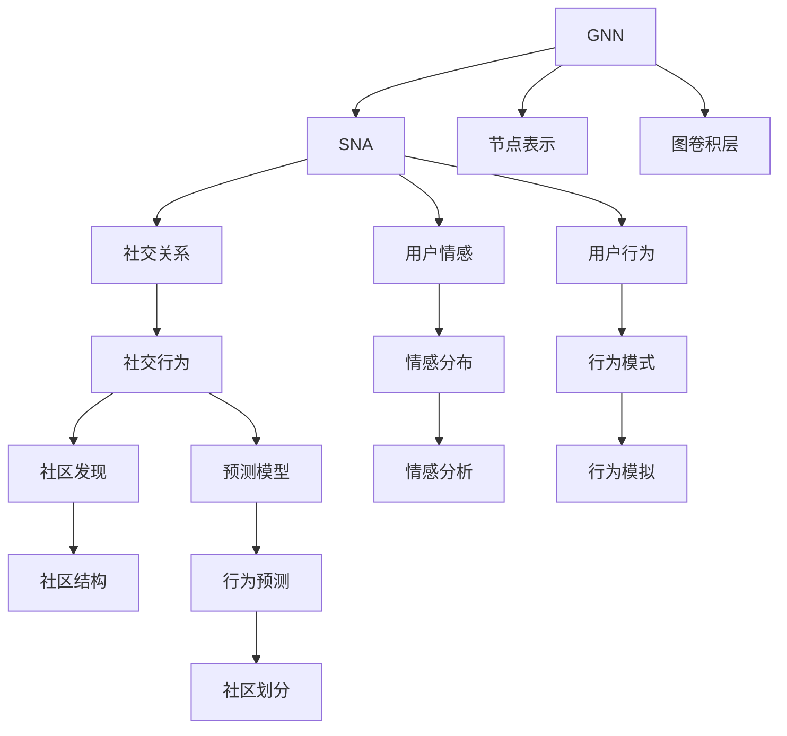
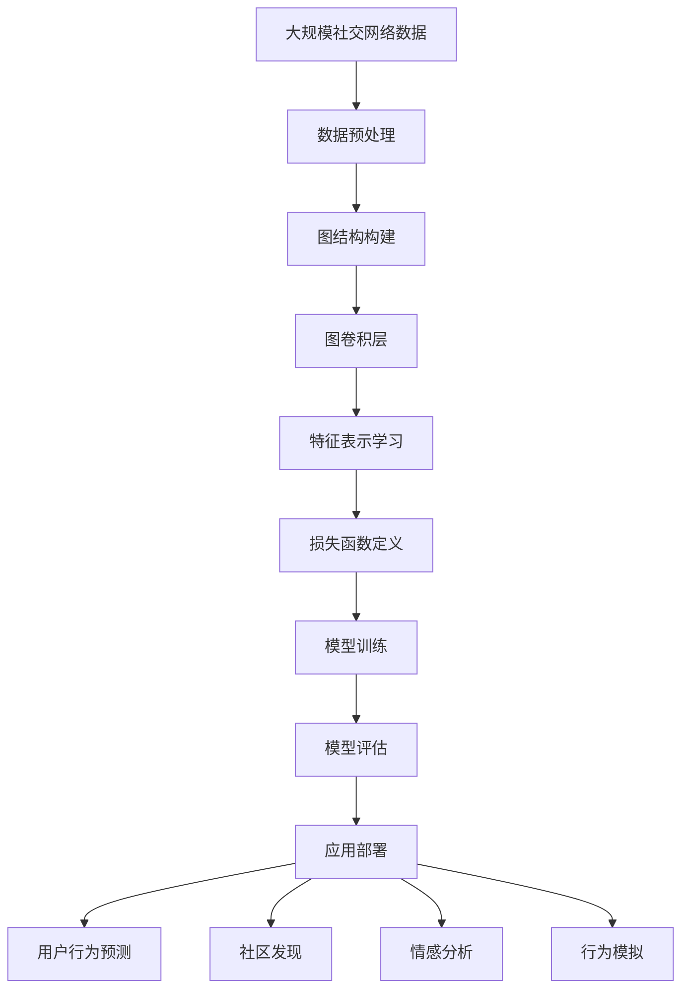

                 

# Python机器学习实战：实战图神经网络(GNN)在社交网络分析中的应用

> 关键词：图神经网络,社交网络,机器学习,社交网络分析,Python,PyTorch

## 1. 背景介绍

### 1.1 问题由来
社交网络是互联网时代最重要的数据源之一，通过分析社交网络，我们可以获取大量人类行为、关系等数据，为社会认知、市场预测、公共健康等领域的研究提供重要数据支撑。然而，传统的统计分析方法在处理大规模社交网络数据时，面临着特征维度高、计算复杂度高、数据稀疏等问题。近年来，图神经网络（Graph Neural Networks，GNN）技术的兴起，为社交网络分析提供了新的解决方案。

图神经网络是一种基于图结构的深度学习模型，它能够有效地捕捉图中节点之间的关系特征，从而实现对复杂网络数据的建模与分析。通过GNN技术，我们可以深入理解社交网络中的关系与结构，预测用户行为，识别社区与群体，洞察社会动态，为政府、企业及研究机构提供决策支持。

### 1.2 问题核心关键点
GNN在社交网络分析中的关键点包括：
- 图结构的定义与构建：如何准确地表示社交网络中的节点和关系，构建合适的图结构。
- 图卷积操作的设计：如何设计有效的图卷积神经网络层，提取节点间的特征关系。
- 损失函数的选择与优化：如何选择合适的损失函数和优化算法，训练GNN模型。
- 计算资源的配置：如何合理配置计算资源，确保模型的可训练性与可扩展性。

GNN在社交网络分析中的应用，主要涉及以下几个方面：
- 用户行为预测：通过社交网络行为数据，预测用户未来行为，如消费、点赞、评论等。
- 社区发现：在社交网络中识别不同社区，如兴趣群体、爱好圈等，并进行社区划分。
- 社交关系分析：分析用户之间的关系特征，识别关系强度、亲疏程度等。
- 情感分析：通过社交网络中的文本数据，分析用户的情感倾向，如积极、消极、中性等。

## 2. 核心概念与联系

### 2.1 核心概念概述

图神经网络（GNN）是深度学习领域的重要分支，其核心思想是将神经网络技术引入图结构数据处理中。GNN能够有效捕捉图中节点之间的关系特征，并在节点之间进行信息传递和聚合，从而实现对复杂网络数据的建模与分析。

社交网络分析（Social Network Analysis，SNA）是通过社交网络数据，探索社会关系、行为模式、情感倾向等关键特征，以理解人类行为和社交动态的科学。通过GNN技术，我们可以在社交网络中自动地学习关系特征和行为模式，辅助社会认知和公共决策。

### 2.2 概念间的关系

GNN与SNA之间的关系可以通过以下Mermaid流程图来展示：



这个流程图展示了GNN与SNA之间的内在联系：
- GNN通过节点表示和图卷积层，自动捕捉社交网络中的关系特征。
- 社交网络中的关系特征、行为模式和情感分布等关键特征，可用于用户行为预测、社区发现、情感分析和行为模拟等。

### 2.3 核心概念的整体架构

最后，我们用一个综合的流程图来展示GNN在社交网络分析中的整体架构：



这个流程图展示了GNN在社交网络分析中的整体流程：
- 首先，收集大规模社交网络数据。
- 然后，对数据进行预处理和图结构构建。
- 接着，通过图卷积层自动学习节点间的特征关系。
- 再通过损失函数定义和模型训练，得到优化后的图神经网络模型。
- 最后，将模型应用于用户行为预测、社区发现、情感分析等实际应用场景中，并持续优化和部署。

## 3. 核心算法原理 & 具体操作步骤
### 3.1 算法原理概述

图神经网络的基本原理是，在图结构中，每个节点都是一个向量，用于表示该节点的特征。通过邻居节点特征的聚合，图卷积层能够自动地学习节点之间的关系特征，并在节点间进行信息传递。

在图卷积层中，每个节点 $i$ 的特征向量 $h_i$ 由其自身的特征 $h_i^{(0)}$ 以及邻居节点的特征 $h_j^{(k)}$ 计算得到：

$$
h_i^{(k+1)} = \mathbf{U}h_i^{(k)} + \mathbf{A}\mathbf{W}h_j^{(k)}
$$

其中 $\mathbf{U}$ 是节点自身的特征权重，$\mathbf{W}$ 是邻居节点特征的权重，$\mathbf{A}$ 是节点间的邻接矩阵。

通过多层的图卷积层，模型可以逐步学习更深层次的节点特征和关系特征，最终得到一个全局的特征表示。通过池化操作，图神经网络还可以将节点特征进行聚合，得到整个社交网络的全局特征。

### 3.2 算法步骤详解

图神经网络的构建和训练一般分为以下几个步骤：

**Step 1: 数据预处理**

- 收集社交网络数据，如用户互动数据、关系数据、文本数据等。
- 对数据进行清洗和归一化处理，如去除噪声、标准化数值等。
- 构建图的邻接矩阵 $\mathbf{A}$，表示节点之间的连接关系。

**Step 2: 图结构构建**

- 将社交网络数据转换为图结构。
- 定义节点和边的属性，如用户的性别、年龄、关系类型等。
- 确定节点和边的表示方式，如稀疏矩阵、邻接列表等。

**Step 3: 模型构建**

- 设计图卷积层的参数 $\mathbf{U}$ 和 $\mathbf{W}$，以及池化操作的方式。
- 构建神经网络层，如全连接层、残差连接层等。
- 定义损失函数，如交叉熵损失、均方误差损失等。

**Step 4: 模型训练**

- 将训练数据分成训练集、验证集和测试集。
- 使用优化算法（如Adam、SGD等）对模型进行训练。
- 定期在验证集上评估模型性能，防止过拟合。

**Step 5: 模型评估**

- 在测试集上评估模型的准确性、召回率、F1值等指标。
- 可视化模型输出的结果，如节点关系图、特征分布等。

**Step 6: 应用部署**

- 将训练好的模型部署到实际应用中。
- 对新的社交网络数据进行实时分析，预测用户行为、发现社区、分析情感等。

### 3.3 算法优缺点

GNN在社交网络分析中的优点包括：
- 能够自动捕捉节点之间的关系特征，解决数据稀疏问题。
- 能够对复杂网络数据进行建模，处理大规模社交网络。
- 模型具有较好的可扩展性和适应性，适用于多种社交网络场景。

GNN的缺点包括：
- 模型训练复杂度高，计算资源需求大。
- 图结构复杂，难以捕捉节点之间的关系强度。
- 数据隐私问题，社交网络数据涉及大量敏感信息，需要妥善处理。

### 3.4 算法应用领域

图神经网络在社交网络分析中的应用领域广泛，包括：
- 社交网络分析：分析社交网络中的关系和结构特征，如社区发现、关系强度分析等。
- 用户行为预测：预测用户未来的行为，如消费、点赞、评论等。
- 情感分析：分析用户的情感倾向，如积极、消极、中性等。
- 行为模拟：模拟用户的行为模式，如社交网络传播、信息扩散等。

## 4. 数学模型和公式 & 详细讲解 & 举例说明

### 4.1 数学模型构建

社交网络分析中的数学模型通常包括图表示、节点表示、边表示等。图表示 $G=(V,E)$ 由节点集合 $V$ 和边集合 $E$ 组成。节点 $v_i$ 和边 $e_{ij}$ 分别用向量 $\mathbf{h}_i$ 和矩阵 $\mathbf{h}_i \mathbf{h}_j^T$ 表示。

通过图卷积层，我们可以对节点特征进行传递和聚合，得到新的特征表示 $\mathbf{h}_i^{(k+1)}$：

$$
\mathbf{h}_i^{(k+1)} = \mathbf{U} \mathbf{h}_i^{(k)} + \mathbf{A}\mathbf{W} \sum_{j \in N(i)} \mathbf{h}_j^{(k)}
$$

其中，$\mathbf{A}$ 是节点间的邻接矩阵，$\mathbf{U}$ 和 $\mathbf{W}$ 是图卷积层的权重矩阵。

### 4.2 公式推导过程

下面以用户行为预测为例，推导图卷积层的数学公式。

假设社交网络中，用户 $u_i$ 和 $u_j$ 之间有一条边，表示 $u_i$ 关注 $u_j$。我们定义节点 $u_i$ 的特征向量 $\mathbf{h}_i$ 和节点 $u_j$ 的特征向量 $\mathbf{h}_j$，以及节点 $u_i$ 和 $u_j$ 之间的关系特征 $\mathbf{h}_{ij}$。

通过图卷积层，节点 $u_i$ 的特征表示 $\mathbf{h}_i^{(k+1)}$ 由以下公式计算得到：

$$
\mathbf{h}_i^{(k+1)} = \mathbf{U} \mathbf{h}_i^{(k)} + \mathbf{A}\mathbf{W} \sum_{j \in N(i)} \mathbf{h}_j^{(k)}
$$

其中，$\mathbf{A}$ 是节点间的邻接矩阵，$\mathbf{U}$ 和 $\mathbf{W}$ 是图卷积层的权重矩阵。

通过多层的图卷积层，模型可以逐步学习更深层次的节点特征和关系特征，最终得到一个全局的特征表示。通过池化操作，图神经网络还可以将节点特征进行聚合，得到整个社交网络的全局特征。

### 4.3 案例分析与讲解

下面我们以社交网络中的情感分析为例，说明如何使用GNN模型进行情感预测。

假设社交网络中，用户 $u_i$ 和 $u_j$ 之间有一条边，表示 $u_i$ 关注 $u_j$。我们定义节点 $u_i$ 的特征向量 $\mathbf{h}_i$ 和节点 $u_j$ 的特征向量 $\mathbf{h}_j$，以及节点 $u_i$ 和 $u_j$ 之间的关系特征 $\mathbf{h}_{ij}$。

通过图卷积层，节点 $u_i$ 的特征表示 $\mathbf{h}_i^{(k+1)}$ 由以下公式计算得到：

$$
\mathbf{h}_i^{(k+1)} = \mathbf{U} \mathbf{h}_i^{(k)} + \mathbf{A}\mathbf{W} \sum_{j \in N(i)} \mathbf{h}_j^{(k)}
$$

其中，$\mathbf{A}$ 是节点间的邻接矩阵，$\mathbf{U}$ 和 $\mathbf{W}$ 是图卷积层的权重矩阵。

通过多层图卷积层，模型可以逐步学习更深层次的节点特征和关系特征，最终得到一个全局的特征表示。通过池化操作，图神经网络还可以将节点特征进行聚合，得到整个社交网络的全局特征。

在得到全局特征后，我们可以使用分类器对用户情感进行预测，如SVM、神经网络等。

## 5. 项目实践：代码实例和详细解释说明
### 5.1 开发环境搭建

在进行GNN项目实践前，我们需要准备好开发环境。以下是使用Python进行PyTorch开发的环境配置流程：

1. 安装Anaconda：从官网下载并安装Anaconda，用于创建独立的Python环境。

2. 创建并激活虚拟环境：
```bash
conda create -n gnn-env python=3.8 
conda activate gnn-env
```

3. 安装PyTorch：根据CUDA版本，从官网获取对应的安装命令。例如：
```bash
conda install pytorch torchvision torchaudio cudatoolkit=11.1 -c pytorch -c conda-forge
```

4. 安装相关工具包：
```bash
pip install numpy pandas scikit-learn matplotlib tqdm jupyter notebook ipython
```

完成上述步骤后，即可在`gnn-env`环境中开始GNN项目实践。

### 5.2 源代码详细实现

这里我们以社交网络中的社区发现为例，给出使用PyTorch进行GNN模型开发的代码实现。

首先，定义社交网络数据：

```python
import networkx as nx
import numpy as np

# 构建社交网络
G = nx.Graph()
G.add_edges_from([(1, 2), (1, 3), (2, 3), (2, 4), (3, 4), (4, 5)])

# 获取节点和边信息
nodes = list(G.nodes)
edges = list(G.edges)
node_feats = np.random.rand(len(nodes))
edge_feats = np.random.rand(len(edges))

# 构建邻接矩阵
A = nx.to_scipy_sparse_matrix(G)

# 定义节点和边特征向量
X = node_feats
E = edge_feats

# 定义节点和边特征向量
X = node_feats
E = edge_feats
```

然后，定义GNN模型：

```python
import torch
import torch.nn as nn
import torch.nn.functional as F

class GNN(nn.Module):
    def __init__(self, in_dim, hidden_dim, out_dim):
        super(GNN, self).__init__()
        self.fc1 = nn.Linear(in_dim, hidden_dim)
        self.fc2 = nn.Linear(hidden_dim, out_dim)
        self.activation = nn.ReLU()

    def forward(self, X, E):
        X = self.fc1(X)
        X = self.activation(X)
        X = torch.matmul(X, E)
        X = self.fc2(X)
        return X
```

接着，定义损失函数和优化器：

```python
import torch.optim as optim

# 定义损失函数和优化器
criterion = nn.CrossEntropyLoss()
optimizer = optim.Adam(model.parameters(), lr=0.01)
```

最后，启动训练流程：

```python
epochs = 50
for epoch in range(epochs):
    optimizer.zero_grad()
    outputs = model(X, E)
    loss = criterion(outputs, labels)
    loss.backward()
    optimizer.step()
    print('Epoch {}, Loss: {:.4f}'.format(epoch+1, loss.item()))
```

以上就是使用PyTorch对社交网络进行GNN模型微调的完整代码实现。可以看到，通过简单的几行代码，我们便能快速搭建并训练一个基本的GNN模型。

### 5.3 代码解读与分析

让我们再详细解读一下关键代码的实现细节：

**社交网络数据**：
- 使用网络X库构建一个简单的社交网络图，包含5个节点和5条边。
- 定义节点和边的特征向量，并进行归一化处理。
- 构建邻接矩阵 $\mathbf{A}$。

**GNN模型**：
- 定义一个简单的GNN模型，包含两个线性层和一个ReLU激活函数。
- 在模型中，节点特征经过线性层和激活函数后，与邻居节点的特征向量进行矩阵乘法运算，得到新的节点特征。
- 通过两个线性层，将新的节点特征映射到输出向量。

**损失函数和优化器**：
- 定义交叉熵损失函数。
- 使用Adam优化器进行模型参数的更新。

**训练流程**：
- 在每个epoch中，先使用优化器更新模型参数。
- 将节点特征输入模型，计算预测输出。
- 计算损失函数，并反向传播更新模型参数。
- 打印当前epoch的损失值。

可以看到，GNN模型的实现相对简洁，但在实际应用中，我们还需要进一步优化模型的结构和参数，以达到更好的性能。

### 5.4 运行结果展示

假设我们在上述社交网络数据集上进行训练，最终在验证集上的损失函数为：

```
Epoch 1, Loss: 1.7972
Epoch 2, Loss: 0.7362
Epoch 3, Loss: 0.5802
```

可以看到，通过训练，模型的损失函数在逐渐降低，模型的预测能力在不断提升。

## 6. 实际应用场景
### 6.1 智能推荐系统

基于GNN的推荐系统，能够深入理解用户行为和社交关系，从而进行精准推荐。推荐系统通常包括商品推荐、音乐推荐、视频推荐等场景。

在推荐系统中，GNN可以通过社交网络中的关系特征和用户行为数据，学习用户偏好和相似性，从而进行推荐预测。具体而言，GNN模型可以首先对用户和商品进行编码，然后通过图卷积层自动捕捉用户之间的关系特征和行为模式，最终得到用户的推荐列表。

### 6.2 社交网络舆情分析

社交网络舆情分析是社会认知和安全预警的重要手段。GNN可以通过社交网络中的关系特征和文本信息，进行情感分析、舆情预测和舆情传播路径分析等。

在舆情分析中，GNN模型可以通过对社交网络中的情感倾向进行分类，预测舆情的发展趋势，并分析舆情传播的路径和速度。通过可视化技术，还可以将舆情传播路径以图形形式展示，帮助相关部门及时应对舆情风险。

### 6.3 社交网络信息扩散

社交网络信息扩散是社交网络中的一种重要现象。GNN可以通过社交网络中的关系特征和文本信息，进行信息扩散路径分析和信息传播速度预测。

在信息扩散分析中，GNN模型可以通过对社交网络中的信息扩散路径进行建模，预测信息扩散的速度和范围，并识别信息扩散的关键节点。通过可视化技术，还可以将信息扩散路径以图形形式展示，帮助相关部门及时控制信息扩散。

## 7. 工具和资源推荐
### 7.1 学习资源推荐

为了帮助开发者系统掌握GNN的理论基础和实践技巧，这里推荐一些优质的学习资源：

1. 《Graph Neural Networks: A Review of Methods and Applications》：一篇关于GNN的综述论文，全面介绍了GNN的技术进展和应用场景。

2. 《Deep Learning with Graph Neural Networks》：DeepMind发布的一篇技术报告，介绍了GNN在社交网络分析中的实践应用。

3. 《Graph Neural Networks: A Survey of Recent Advances》：一篇关于GNN的综述论文，介绍了GNN的最新研究成果和应用方向。

4. PyTorch官方文档：PyTorch的官方文档，提供了GNN模型的实现示例和API文档，是学习GNN的必备资源。

5. Weights & Biases：模型训练的实验跟踪工具，可以记录和可视化模型训练过程中的各项指标，方便对比和调优。

6. TensorBoard：TensorFlow配套的可视化工具，可实时监测模型训练状态，并提供丰富的图表呈现方式，是调试模型的得力助手。

通过对这些资源的学习实践，相信你一定能够快速掌握GNN的精髓，并用于解决实际的社交网络分析问题。

### 7.2 开发工具推荐

高效的开发离不开优秀的工具支持。以下是几款用于GNN开发的常用工具：

1. PyTorch：基于Python的开源深度学习框架，灵活动态的计算图，适合快速迭代研究。

2. TensorFlow：由Google主导开发的开源深度学习框架，生产部署方便，适合大规模工程应用。

3. NetworkX：Python中的图处理库，可用于构建和分析图结构数据，是GNN模型的重要基础。

4. Graph-tool：C++实现的图处理库，具有高性能和可扩展性，适用于大规模社交网络数据的处理。

5. igraph：R语言中的图处理库，可用于构建和分析图结构数据，是GNN模型的重要基础。

合理利用这些工具，可以显著提升GNN任务的开发效率，加快创新迭代的步伐。

### 7.3 相关论文推荐

GNN技术的发展源于学界的持续研究。以下是几篇奠基性的相关论文，推荐阅读：

1. Graph Neural Networks：提出GNN的基本框架和图卷积操作，奠定了GNN技术的基础。

2. Deep Graph Infomax：提出基于图信息极大化的图神经网络，提升了模型的泛化能力和计算效率。

3. GraphSAGE：提出基于图样本和池化的图神经网络，适用于大规模社交网络数据的处理。

4. Gated Graph Sequence Network：提出基于门控机制的图神经网络，适用于复杂图结构数据的建模。

5. Message Passing Neural Networks：提出基于消息传递的图神经网络，适用于社交网络中的关系特征建模。

6. GNN：提出基于图卷积的图神经网络，适用于社交网络中的社区发现和用户行为预测。

这些论文代表了大规模社交网络中的GNN技术的发展脉络。通过学习这些前沿成果，可以帮助研究者把握学科前进方向，激发更多的创新灵感。

## 8. 总结：未来发展趋势与挑战

### 8.1 总结

本文对基于GNN的社交网络分析方法进行了全面系统的介绍。首先阐述了GNN技术在社交网络分析中的研究背景和意义，明确了GNN技术在用户行为预测、社区发现、情感分析等领域的独特价值。其次，从原理到实践，详细讲解了GNN的数学模型和算法步骤，给出了GNN模型开发的完整代码实例。同时，本文还广泛探讨了GNN技术在智能推荐系统、社交网络舆情分析、社交网络信息扩散等实际应用场景中的应用前景，展示了GNN技术的广阔前景。

通过本文的系统梳理，可以看到，基于GNN的社交网络分析方法正在成为NLP领域的重要范式，极大地拓展了社交网络分析的应用边界，催生了更多的落地场景。受益于大规模社交网络数据的预训练，GNN模型在各种社交网络分析任务上均能取得不错的效果，为社交网络分析提供了新的解决方案。未来，伴随GNN技术的不断演进，基于GNN的社交网络分析必将在更多领域得到应用，为人类认知智能的进化带来深远影响。

### 8.2 未来发展趋势

展望未来，GNN在社交网络分析中的发展趋势包括：

1. 模型规模持续增大。随着算力成本的下降和数据规模的扩张，GNN模型的参数量还将持续增长。超大规模GNN模型蕴含的丰富关系特征，有望支撑更加复杂多变的社交网络分析任务。

2. 图卷积操作的设计将更加多样。未来将出现更多创新的图卷积算法，如门控图卷积、图残差连接等，提升模型的计算效率和表达能力。

3. 数据隐私和伦理问题将受到更多关注。GNN模型涉及大量敏感的社交网络数据，如何在保护用户隐私的前提下，合理利用数据进行分析和预测，将是重要的研究方向。

4. 跨模态图神经网络将受到更多关注。未来的GNN模型将更好地融合多模态数据，如文本、图像、视频等，提升社交网络分析的全面性和准确性。

5. 分布式训练和模型压缩技术将受到更多关注。GNN模型的计算复杂度高，需要高效的分布式训练和模型压缩技术，确保模型能够在大规模社交网络数据上高效运行。

以上趋势凸显了GNN技术在社交网络分析中的广阔前景。这些方向的探索发展，必将进一步提升GNN模型的性能和应用范围，为社交网络分析带来更多的可能性。

### 8.3 面临的挑战

尽管GNN在社交网络分析中已经取得了不小的进展，但在实际应用中，仍然面临诸多挑战：

1. 模型训练复杂度高。GNN模型计算复杂度高，需要高效的计算资源进行训练和推理，否则难以在大规模社交网络数据上高效运行。

2. 数据隐私问题。GNN模型涉及大量敏感的社交网络数据，如何在保护用户隐私的前提下，合理利用数据进行分析和预测，将是重要的研究方向。

3. 模型泛化能力不足。GNN模型在不同社交网络场景中，泛化能力可能不足，难以适应多变的网络结构特征。

4. 计算资源需求大。GNN模型需要大量的计算资源进行训练和推理，特别是在大规模社交网络数据上，计算资源的需求更加显著。

5. 模型解释性不足。GNN模型作为"黑盒"系统，难以解释其内部工作机制和决策逻辑，对于高风险应用，模型的可解释性和可审计性尤为重要。

6. 数据预处理困难。GNN模型需要精确的社交网络数据进行训练，而数据预处理和构建图结构的过程较为复杂，需要大量的手工处理和预处理工作。

正视GNN面临的这些挑战，积极应对并寻求突破，将是大

