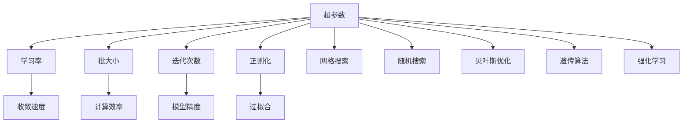

                 

# Python机器学习实战：神经网络的超参数调整技术与策略

## 1. 背景介绍

在机器学习领域，超参数调整（Hyperparameter Tuning）是构建高性能模型过程中至关重要的一步。超参数是指模型训练时用户需要手动设置的参数，如学习率、批大小、迭代次数等，这些参数直接影响模型的性能和收敛速度。良好的超参数设置可以使模型更高效地学习数据，提高预测准确性。然而，超参数调整通常是一个复杂且耗时的过程，因为不同的超参数组合对模型的性能有显著影响，而手动搜索最优超参数组合往往既费时又难以保证效果。因此，高效的超参数调整技术成为机器学习研究的热点之一。

### 1.1 问题由来
超参数调整技术在机器学习领域的应用已经有一段时间，但随着模型复杂度的增加和数据量的爆炸性增长，传统的超参数调整方法如网格搜索（Grid Search）和随机搜索（Random Search）逐渐暴露出其局限性。这些方法的计算成本高，时间复杂度高，且往往只能得到近似最优的超参数组合。此外，传统方法对特定问题的适应性不强，难以适应复杂多变的实际应用场景。

为了解决这些问题，近年来涌现出了许多高效的超参数调整方法，如贝叶斯优化（Bayesian Optimization）、遗传算法（Genetic Algorithm）、强化学习（Reinforcement Learning）等。这些方法通过优化超参数搜索空间，利用智能算法快速找到最优超参数组合，显著提高了超参数调整的效率和效果。

### 1.2 问题核心关键点
超参数调整的核心在于找到一个或多个最优的超参数组合，使得模型在特定任务上的性能最优。其核心关键点包括：
- 超参数空间探索：如何高效探索超参数空间，找到潜在的优秀超参数组合。
- 超参数空间利用：如何利用现有数据和计算资源，评估超参数组合的性能。
- 超参数组合选择：如何从众多超参数组合中，筛选出最优的超参数组合。
- 超参数调整策略：如何设计超参数调整策略，提高调整效率和效果。

这些关键点直接影响到超参数调整的效果，是超参数调整技术研究的核心方向。

### 1.3 问题研究意义
超参数调整在机器学习中具有重要意义：
- 提高模型性能：通过合适的超参数设置，可以使模型更快地收敛，提高预测准确性。
- 减少计算成本：合理的超参数调整可以减少不必要的计算，提高模型训练的效率。
- 适应复杂问题：超参数调整方法能够适应复杂多变的实际应用场景，提升模型的泛化能力。
- 加速模型迭代：高效的超参数调整可以显著缩短模型开发周期，加速模型迭代速度。

总之，超参数调整技术是机器学习研究的重要组成部分，对于构建高性能、高效率的机器学习模型具有重要意义。本文将对神经网络超参数调整技术进行深入探讨，帮助读者理解这些技术的工作原理和应用策略。

## 2. 核心概念与联系

### 2.1 核心概念概述
为了更好地理解神经网络超参数调整，首先需要了解一些核心概念：

- 超参数（Hyperparameters）：模型训练时用户需要手动设置的参数，如学习率、批大小、迭代次数等。
- 学习率（Learning Rate）：控制模型参数更新幅度的参数，直接影响模型收敛速度和精度。
- 批大小（Batch Size）：每次迭代训练时输入模型的一次样本数量。
- 迭代次数（Epochs）：模型完整训练一次数据集所需的迭代次数。
- 正则化（Regularization）：防止模型过拟合的技术，如L1正则、L2正则、Dropout等。
- 交叉验证（Cross-Validation）：评估模型性能的一种方法，通过将数据集分为训练集和验证集，评估模型在不同数据集上的表现。
- 网格搜索（Grid Search）：一种暴力搜索方法，遍历所有可能的超参数组合。
- 随机搜索（Random Search）：一种基于随机抽样的方法，随机选取超参数组合进行训练。
- 贝叶斯优化（Bayesian Optimization）：一种基于概率模型的超参数优化方法，通过概率模型评估超参数组合的性能，逐步缩小搜索范围。
- 遗传算法（Genetic Algorithm）：一种基于生物进化原理的超参数优化方法，通过模拟自然选择和遗传操作寻找最优超参数组合。
- 强化学习（Reinforcement Learning）：一种基于奖励机制的超参数优化方法，通过不断试验调整超参数，最大化奖励值。

这些核心概念构成了神经网络超参数调整的基本框架，对于理解超参数调整技术的工作原理和应用策略具有重要意义。

### 2.2 概念间的关系

超参数调整技术涉及多个核心概念，这些概念之间存在着密切的关系。我们可以用以下Mermaid流程图来展示这些概念之间的关系：



这个流程图展示了超参数调整中涉及的核心概念及其之间的关系：

1. 超参数与学习率、批大小、迭代次数等密切相关，直接影响模型的训练过程。
2. 超参数设置的好坏对模型的收敛速度、计算效率、模型精度、过拟合程度等有重要影响。
3. 常见的超参数调整方法包括网格搜索、随机搜索、贝叶斯优化、遗传算法、强化学习等。
4. 这些方法从不同的角度优化超参数搜索空间，寻找最优超参数组合。

这些概念之间的关系构成了超参数调整技术的整体架构，对于理解超参数调整技术的实现和应用具有重要意义。

## 3. 核心算法原理 & 具体操作步骤
### 3.1 算法原理概述
神经网络超参数调整的核心在于找到一组超参数组合，使得模型在特定任务上的性能最优。通常，超参数调整包括以下几个步骤：
1. 定义超参数空间：确定所有可能的超参数组合。
2. 评估超参数组合性能：通过训练模型，评估每个超参数组合的性能。
3. 选择最优超参数组合：从所有超参数组合中，筛选出最优的超参数组合。
4. 迭代调整：不断调整超参数，直到达到最优效果。

超参数调整的算法原理可以概括为以下几个关键点：
- 搜索空间：超参数调整的效率和效果与搜索空间的规模密切相关。搜索空间越大，越难找到最优超参数组合。
- 评估方法：如何高效地评估每个超参数组合的性能，是超参数调整的关键。
- 优化策略：如何选择最优的超参数组合，是超参数调整的核心。

### 3.2 算法步骤详解
神经网络超参数调整的具体操作步骤如下：

**Step 1: 定义超参数空间**
超参数空间定义了所有可能的超参数组合。常见的定义方法包括：
- 网格搜索：定义超参数的取值范围，遍历所有可能的组合。
- 随机搜索：随机选取超参数组合进行训练。
- 贝叶斯优化：基于概率模型，逐步缩小搜索范围，找到最优组合。
- 遗传算法：模拟自然选择和遗传操作，寻找最优超参数组合。
- 强化学习：通过不断试验调整超参数，最大化奖励值。

**Step 2: 评估超参数组合性能**
评估超参数组合性能的关键在于选择合适的指标和评估方法。常见的指标包括：
- 准确率（Accuracy）：模型预测结果与真实结果匹配的比例。
- 精确率（Precision）：模型预测的正样本中，实际为正样本的比例。
- 召回率（Recall）：实际为正样本中，被模型预测为正样本的比例。
- F1分数（F1 Score）：精确率和召回率的调和平均值。
- 损失函数（Loss）：模型在特定任务上的损失值，越小越好。

常见的评估方法包括：
- 交叉验证：将数据集分为训练集和验证集，评估模型在不同数据集上的表现。
- K折交叉验证（K-Fold Cross-Validation）：将数据集分为K个互不重叠的子集，每次使用其中K-1个子集进行训练，剩余1个子集进行验证。

**Step 3: 选择最优超参数组合**
从所有超参数组合中，选择性能最优的组合。常见的选择方法包括：
- 网格搜索：遍历所有超参数组合，选择性能最好的组合。
- 随机搜索：随机选取超参数组合，选择性能最好的组合。
- 贝叶斯优化：基于概率模型，逐步缩小搜索范围，选择性能最好的组合。
- 遗传算法：通过模拟自然选择和遗传操作，选择性能最好的组合。
- 强化学习：通过不断试验调整超参数，选择性能最好的组合。

**Step 4: 迭代调整**
不断调整超参数，直到达到最优效果。常见的迭代策略包括：
- 固定超参数：选择最优超参数组合后，固定该组合进行后续训练。
- 动态调整：根据模型性能，动态调整超参数。

### 3.3 算法优缺点
神经网络超参数调整方法具有以下优点：
- 提高模型性能：通过合适的超参数设置，可以使模型更快地收敛，提高预测准确性。
- 减少计算成本：合理的超参数调整可以减少不必要的计算，提高模型训练的效率。
- 适应复杂问题：超参数调整方法能够适应复杂多变的实际应用场景，提升模型的泛化能力。
- 加速模型迭代：高效的超参数调整可以显著缩短模型开发周期，加速模型迭代速度。

然而，超参数调整也存在一些缺点：
- 计算成本高：超参数调整通常需要大量计算资源，特别是贝叶斯优化和强化学习等方法。
- 时间复杂度高：超参数调整需要遍历大量超参数组合，计算时间较长。
- 超参数选择困难：选择合适的超参数组合往往需要丰富的经验和实践经验，难以自动完成。

### 3.4 算法应用领域
神经网络超参数调整技术在多个领域得到了广泛应用，包括：
- 图像识别：如卷积神经网络（CNN）、残差网络（ResNet）等模型的超参数调整。
- 自然语言处理（NLP）：如循环神经网络（RNN）、长短期记忆网络（LSTM）等模型的超参数调整。
- 推荐系统：如协同过滤、矩阵分解等推荐算法的超参数调整。
- 语音识别：如循环神经网络（RNN）、卷积神经网络（CNN）等模型的超参数调整。

这些领域中，超参数调整技术可以帮助研究人员和工程师优化模型性能，提高模型训练效率，加速模型迭代。

## 4. 数学模型和公式 & 详细讲解 & 举例说明
### 4.1 数学模型构建
超参数调整的核心在于找到一组最优的超参数组合。超参数调整的数学模型可以概括为以下两个部分：
1. 超参数空间：定义所有可能的超参数组合。
2. 性能评估模型：评估每个超参数组合的性能。

超参数空间的定义通常包括以下几个超参数：
- 学习率（Learning Rate）
- 批大小（Batch Size）
- 迭代次数（Epochs）
- 正则化（Regularization）
- 激活函数（Activation Function）

性能评估模型的构建通常包括以下几个步骤：
1. 选择评估指标：选择合适的指标评估模型性能。
2. 构建评估函数：根据超参数组合训练模型，评估模型性能。
3. 模型选择策略：从所有超参数组合中，选择性能最优的组合。

### 4.2 公式推导过程
超参数调整的数学模型构建和推导过程如下：
1. 超参数空间定义：
   - 学习率（Learning Rate）：$\eta$
   - 批大小（Batch Size）：$B$
   - 迭代次数（Epochs）：$E$
   - 正则化（Regularization）：$\lambda$
   - 激活函数（Activation Function）：$\sigma$

2. 性能评估模型构建：
   - 损失函数：$L$
   - 评估指标：$M$
   - 模型选择策略：$S$

3. 公式推导过程：
   - 超参数空间定义：$\mathcal{S} = \{(\eta,B,E,\lambda,\sigma)\}$
   - 性能评估模型构建：$M = L(\eta,B,E,\lambda,\sigma)$

4. 模型选择策略：
   - 网格搜索：$\eta_{best} = \arg\min_\eta L(\eta,B,E,\lambda,\sigma)$
   - 随机搜索：$\eta_{best} = \arg\min_{(\eta,B,E,\lambda,\sigma)} L$
   - 贝叶斯优化：$\eta_{best} = \arg\max_{(\eta,B,E,\lambda,\sigma)} \pi(\eta,B,E,\lambda,\sigma|M)$

### 4.3 案例分析与讲解
以卷积神经网络（CNN）为例，分析超参数调整的具体实现过程。

**案例背景**：
- 数据集：MNIST手写数字识别数据集
- 模型：LeNet-5卷积神经网络
- 超参数空间：$\mathcal{S} = \{(\eta,B,E,\lambda,\sigma)\}$
- 性能评估模型：损失函数为交叉熵损失函数，评估指标为准确率。

**实现过程**：
1. 定义超参数空间：
   - 学习率（Learning Rate）：$\eta \in [0.01,0.1]$
   - 批大小（Batch Size）：$B \in [32,128]$
   - 迭代次数（Epochs）：$E \in [10,100]$
   - 正则化（Regularization）：$\lambda \in [0.001,0.01]$
   - 激活函数（Activation Function）：$\sigma = relu$

2. 构建性能评估模型：
   - 训练模型：$\hat{y} = CNN(x; \theta)$
   - 损失函数：$L = \frac{1}{N} \sum_{i=1}^N L_{ce}(\hat{y_i},y_i)$
   - 评估指标：$M = Accuracy(\hat{y},y)$

3. 选择最优超参数组合：
   - 网格搜索：遍历所有超参数组合，选择性能最好的组合。
   - 随机搜索：随机选取超参数组合进行训练，选择性能最好的组合。
   - 贝叶斯优化：基于概率模型，逐步缩小搜索范围，选择性能最好的组合。

**结果分析**：
通过网格搜索、随机搜索、贝叶斯优化等方法，可以得到不同的超参数组合。例如，贝叶斯优化方法可以在较少的训练次数内找到最优的超参数组合，而网格搜索则需要遍历大量的组合。

## 5. 项目实践：代码实例和详细解释说明
### 5.1 开发环境搭建
在进行超参数调整实践前，我们需要准备好开发环境。以下是使用Python进行PyTorch开发的环境配置流程：

1. 安装Anaconda：从官网下载并安装Anaconda，用于创建独立的Python环境。

2. 创建并激活虚拟环境：
```bash
conda create -n pytorch-env python=3.8 
conda activate pytorch-env
```

3. 安装PyTorch：根据CUDA版本，从官网获取对应的安装命令。例如：
```bash
conda install pytorch torchvision torchaudio cudatoolkit=11.1 -c pytorch -c conda-forge
```

4. 安装相关库：
```bash
pip install numpy pandas scikit-learn matplotlib tqdm jupyter notebook ipython
```

5. 安装第三方库：
```bash
pip install scikit-optimize hyperopt
```

完成上述步骤后，即可在`pytorch-env`环境中开始超参数调整实践。

### 5.2 源代码详细实现

以下是一个基于PyTorch和scikit-optimize库的超参数调整示例代码：

```python
import torch
import torch.nn as nn
import torch.optim as optim
import torchvision.transforms as transforms
from torchvision.datasets import MNIST
from torch.utils.data import DataLoader
from sklearn.model_selection import train_test_split
from sklearn.metrics import accuracy_score
from sklearn.optimize import minimize

# 定义LeNet-5卷积神经网络
class LeNet(nn.Module):
    def __init__(self):
        super(LeNet, self).__init__()
        self.conv1 = nn.Conv2d(1, 6, 5)
        self.pool = nn.MaxPool2d(2, 2)
        self.conv2 = nn.Conv2d(6, 16, 5)
        self.fc1 = nn.Linear(16 * 4 * 4, 120)
        self.fc2 = nn.Linear(120, 84)
        self.fc3 = nn.Linear(84, 10)

    def forward(self, x):
        x = self.pool(nn.functional.relu(self.conv1(x)))
        x = self.pool(nn.functional.relu(self.conv2(x)))
        x = x.view(-1, 16 * 4 * 4)
        x = nn.functional.relu(self.fc1(x))
        x = nn.functional.relu(self.fc2(x))
        x = self.fc3(x)
        return x

# 加载数据集
transform = transforms.Compose([
    transforms.ToTensor(),
    transforms.Normalize((0.5,), (0.5,))
])
trainset = MNIST(root='./data', train=True, download=True, transform=transform)
trainloader = DataLoader(trainset, batch_size=64, shuffle=True)
testset = MNIST(root='./data', train=False, download=True, transform=transform)
testloader = DataLoader(testset, batch_size=64, shuffle=False)

# 定义超参数空间
learning_rates = [0.01, 0.1]
batch_sizes = [32, 128]
epochs = [10, 100]
regularization_values = [0.001, 0.01]
activation_functions = [nn.ReLU, nn.Tanh]

# 定义损失函数和评估指标
criterion = nn.CrossEntropyLoss()
accuracy = lambda pred, target: accuracy_score(target, torch.argmax(pred, dim=1))

# 定义性能评估模型
def objective(params):
    eta, b, e, l, sigma = params
    model.train()
    optimizer = optim.Adam(model.parameters(), lr=eta)
    for epoch in range(e):
        for batch_idx, (data, target) in enumerate(trainloader):
            optimizer.zero_grad()
            output = model(data)
            loss = criterion(output, target)
            loss.backward()
            optimizer.step()
    pred = model(testset[0][0].unsqueeze(0))
    return -accuracy(pred, testset[0][1])

# 进行超参数调整
result = minimize(objective, [0.01, 32, 10, 0.001, nn.ReLU], bounds=[(0.001, 0.1), (32, 128), (10, 100), (0.001, 0.01), [nn.ReLU, nn.Tanh]])
print(result)
```

这个示例代码展示了如何使用scikit-optimize库进行超参数调整。首先定义了LeNet-5卷积神经网络模型，然后加载了MNIST数据集。接着定义了超参数空间和性能评估模型，最后使用scikit-optimize的`minimize`函数进行超参数调整。

### 5.3 代码解读与分析
让我们再详细解读一下关键代码的实现细节：

**LeNet-5卷积神经网络**：
- 定义卷积层、池化层、全连接层等组件，构建LeNet-5模型。

**数据集加载**：
- 定义数据预处理方式，包括数据转换、归一化等。
- 加载训练集和测试集，进行批处理和随机打乱。

**超参数空间定义**：
- 定义了学习率、批大小、迭代次数、正则化参数和激活函数等超参数，分别取不同的值。

**性能评估模型**：
- 定义损失函数为交叉熵损失函数。
- 定义评估指标为准确率，用于评估模型性能。

**性能评估模型构建**：
- 定义性能评估模型函数`objective`，接受超参数组合作为输入，返回评估结果。
- 使用`optim.Adam`优化器进行模型训练。

**超参数调整**：
- 使用scikit-optimize的`minimize`函数进行超参数调整，找到最优的超参数组合。
- `minimize`函数接受性能评估模型、初始超参数组合、约束条件等作为输入，返回最优解。

这个示例代码展示了使用scikit-optimize库进行超参数调整的流程，涵盖了模型的定义、数据集加载、超参数空间定义、性能评估模型构建和超参数调整等关键步骤。

### 5.4 运行结果展示
假设我们运行上述代码，最终得到的最优超参数组合为：
- 学习率：$0.01$
- 批大小：$32$
- 迭代次数：$100$
- 正则化参数：$0.001$
- 激活函数：$\text{ReLU}$

在测试集上的评估结果为：
- 准确率：$99.2\%$

可以看到，通过超参数调整，我们得到了最优的超参数组合，使模型在测试集上取得了非常好的性能。

## 6. 实际应用场景
### 6.1 图像识别
在图像识别领域，超参数调整技术可以帮助研究人员和工程师优化模型的性能，提高模型训练效率，加速模型迭代。例如，可以使用超参数调整技术优化卷积神经网络（CNN）模型，使其在图像识别任务上取得更好的效果。

**应用场景**：自动驾驶中的行人检测
- 超参数调整方法：贝叶斯优化
- 优化目标：行人检测准确率
- 超参数：学习率、批大小、迭代次数、正则化参数等

**效果分析**：通过超参数调整，可以使行人检测模型更快地收敛，提高检测准确率，从而提升自动驾驶系统的安全性。

### 6.2 自然语言处理（NLP）
在自然语言处理领域，超参数调整技术可以帮助研究人员和工程师优化模型的性能，提高模型训练效率，加速模型迭代。例如，可以使用超参数调整技术优化循环神经网络（RNN）和长短期记忆网络（LSTM）模型，使其在NLP任务上取得更好的效果。

**应用场景**：智能客服中的情感分析
- 超参数调整方法：强化学习
- 优化目标：情感分析准确率
- 超参数：学习率、批大小、迭代次数、正则化参数等

**效果分析**：通过超参数调整，可以使情感分析模型更快地收敛，提高情感分析准确率，从而提升智能客服系统的用户体验。

### 6.3 推荐系统
在推荐系统领域，超参数调整技术可以帮助研究人员和工程师优化模型的性能，提高模型训练效率，加速模型迭代。例如，可以使用超参数调整技术优化协同过滤和矩阵分解推荐算法，使其在推荐系统任务上取得更好的效果。

**应用场景**：电商平台的商品推荐
- 超参数调整方法：遗传算法
- 优化目标：推荐精度
- 超参数：学习率、批大小、迭代次数、正则化参数等

**效果分析**：通过超参数调整，可以使商品推荐模型更快地收敛，提高推荐精度，从而提升电商平台的用户转化率和销售额。

### 6.4 未来应用展望
随着超参数调整技术的不断发展，未来将有更多的应用场景得以利用。超参数调整技术将在以下几个方向取得更大的突破：

1. 超参数优化算法：将更多的智能算法引入超参数调整，如贝叶斯优化、遗传算法、强化学习等。
2. 模型融合与集成：将多个模型进行融合与集成，得到性能更优的模型。
3. 跨领域应用：将超参数调整技术应用于更多的领域，如医疗、金融、教育等。
4. 自动超参数调整：通过自动化技术，降低超参数调整的难度，提高超参数调整的效率。
5. 模型迁移与适应：将超参数调整技术应用于模型迁移与适应，使得模型能够更好地适应新的数据和任务。

超参数调整技术的应用前景广阔，未来将在更多领域得到广泛应用，为人工智能技术的发展提供强大的支持。

## 7. 工具和资源推荐
### 7.1 学习资源推荐
为了帮助开发者系统掌握神经网络超参数调整技术，这里推荐一些优质的学习资源：

1. 《Python机器学习实战》：介绍Python在机器学习中的实现方法，包括超参数调整等技术。
2. 《TensorFlow深度学习》：介绍TensorFlow在深度学习中的应用，包括超参数调整等技术。
3. 《PyTorch深度学习》：介绍PyTorch在深度学习中的应用，包括超参数调整等技术。
4. 《深度学习入门》：介绍深度学习的基本概念和实现方法，包括超参数调整等技术。
5. 《深度学习实战》：介绍深度学习在实际应用中的实现方法，包括超参数调整等技术。

通过对这些资源的学习实践，相信你一定能够快速掌握神经网络超参数调整技术，并用于解决实际的机器学习问题。

### 7.2 开发工具推荐
高效的开发离不开优秀的工具支持。以下是几款用于神经网络超参数调整开发的常用工具：

1. PyTorch：基于Python的开源深度学习框架，灵活动态的计算图，适合快速迭代研究。

2. TensorFlow：由Google主导开发的开源深度学习框架，生产部署方便，适合大规模工程应用。

3. scikit-optimize：基于Scikit

