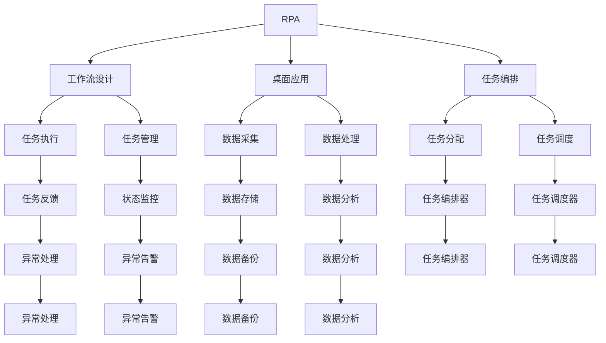
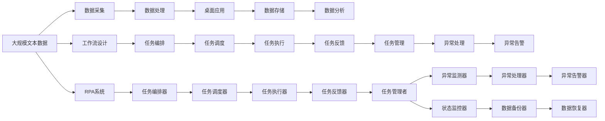

                 

# RPA工作流设计：实现基于桌面的业务流程自动化

> 关键词：RPA, 工作流设计, 自动化, 桌面应用, 任务编排, 机器人流程

## 1. 背景介绍

### 1.1 问题由来

在现代企业信息化过程中，随着IT系统的复杂性和业务流程的精细化，企业的日常操作面临着日益繁琐的工作量和重复性劳动，尤其是大量基于桌面的操作。这种繁琐的操作不仅耗费大量人力，而且容易导致工作失误和效率低下。

传统的手工操作方式需要大量的人力和时间，效率低、成本高。如何自动化这些重复性和繁琐的桌面操作，降低人工干预，提高生产效率，是众多企业迫切需要解决的问题。

### 1.2 问题核心关键点

解决桌面操作的自动化问题，主要需要解决以下几个核心关键点：

- **任务识别**：准确识别需要自动化的桌面操作任务。
- **任务编排**：设计合理的任务流程和编排方式。
- **任务执行**：实现自动化任务的执行和监控。
- **任务管理**：管理自动化任务的运行状态和数据。

### 1.3 问题研究意义

实现基于桌面的业务流程自动化，可以有效降低企业运营成本，提高工作效率，减少人为错误，从而提升企业的整体竞争力。具体而言：

- **降低运营成本**：通过自动化代替人工，减少人力成本。
- **提高工作效率**：简化和标准化流程，提升操作效率。
- **减少人为错误**：消除人为操作失误，保证数据准确性。
- **提升竞争力**：自动化和智能化提升企业对市场的响应速度，增强企业竞争力。

## 2. 核心概念与联系

### 2.1 核心概念概述

在基于桌面的业务流程自动化中，涉及以下几个核心概念：

- **RPA（机器人流程自动化）**：利用软件机器人执行基于规则的业务流程自动化操作，以减少人工干预，提高工作效率。

- **工作流设计**：设计和管理业务流程的各个环节和步骤，确保流程的顺利进行和任务的高效执行。

- **桌面应用**：企业内部使用的各种桌面软件和工具，包括但不限于Office、浏览器、ERP系统等。

- **任务编排**：根据业务需求，设计任务的执行顺序和逻辑，确保任务的无缝衔接和高效执行。

- **任务执行**：机器人根据编排的任务流程，自动执行操作任务。

- **任务管理**：监控和管理自动化任务的状态和运行数据，确保任务的正常执行和问题及时处理。

这些核心概念之间存在着紧密的联系，形成了基于桌面的业务流程自动化的完整框架。

### 2.2 概念间的关系

这些核心概念之间可以通过以下Mermaid流程图来展示：



这个流程图展示了基于桌面的业务流程自动化的各个环节及其关系：

1. RPA系统通过工作流设计来编排和执行任务，同时从桌面应用中采集数据。
2. 任务执行过程中，通过任务编排器、任务调度器等工具来分配和调度任务。
3. 任务执行结果被数据存储和分析，任务管理进行状态监控和异常处理。
4. 最终实现自动化任务的自动执行和高效管理。

### 2.3 核心概念的整体架构

最后，我们用一个综合的流程图来展示这些核心概念在大规模桌面自动化中的应用：



这个综合流程图展示了从数据采集、处理到任务编排、执行、反馈和管理的全流程，以及RPA系统在其中扮演的角色。

## 3. 核心算法原理 & 具体操作步骤
### 3.1 算法原理概述

基于桌面的业务流程自动化，其核心算法原理主要包括以下几个步骤：

1. **任务识别**：通过RPA系统中的数据采集和数据分析，识别需要自动化的桌面操作任务。
2. **任务编排**：根据业务需求，设计任务的执行顺序和逻辑，确保任务的无缝衔接和高效执行。
3. **任务执行**：机器人根据编排的任务流程，自动执行操作任务。
4. **任务管理**：监控和管理自动化任务的状态和运行数据，确保任务的正常执行和问题及时处理。

### 3.2 算法步骤详解

#### 3.2.1 任务识别

任务识别是自动化的第一步，需要准确识别需要自动化的操作任务。一般来说，任务识别可以分为以下几个步骤：

1. **数据采集**：通过RPA系统从桌面应用中采集相关数据，如屏幕截图、窗口文本等。
2. **数据预处理**：对采集的数据进行预处理，如去除噪音、格式统一等。
3. **模式识别**：利用模式识别技术，如字符串匹配、OCR等，识别出具体的任务操作。

#### 3.2.2 任务编排

任务编排是自动化流程的核心，需要设计合理的任务流程和编排方式。一般来说，任务编排可以分为以下几个步骤：

1. **任务定义**：根据业务需求，定义具体的任务操作，如数据输入、文件生成、报表打印等。
2. **任务分配**：将任务操作按照业务逻辑进行分配，如分配给不同的任务节点。
3. **任务调度**：根据任务的依赖关系和优先级，设计任务的执行顺序和逻辑。

#### 3.2.3 任务执行

任务执行是自动化的关键环节，需要确保任务的准确执行和实时监控。一般来说，任务执行可以分为以下几个步骤：

1. **任务下发**：将任务指令下发给机器人执行。
2. **任务执行**：机器人根据任务指令，执行具体的业务操作。
3. **任务反馈**：任务执行完成后，将执行结果反馈给任务管理系统。

#### 3.2.4 任务管理

任务管理是自动化流程的保障，需要确保任务的状态和数据管理。一般来说，任务管理可以分为以下几个步骤：

1. **状态监控**：实时监控自动化任务的状态，如运行中、已完成等。
2. **异常处理**：对于异常情况，如执行失败、数据错误等，进行及时处理。
3. **数据备份**：定期备份自动化任务的数据，确保数据安全。

### 3.3 算法优缺点

基于桌面的业务流程自动化，其算法优点主要包括：

- **降低人工成本**：减少重复性和繁琐的任务，降低人工干预。
- **提高效率**：自动化流程可提升操作效率，减少人为失误。
- **灵活性高**：可以灵活调整和优化任务编排和执行方式。

其算法缺点主要包括：

- **初始成本高**：需要较高的初始投资，包括工具和技术的采购和实施。
- **依赖环境**：对企业IT环境的要求较高，需要一定的技术支持。
- **复杂度高**：任务识别和编排较为复杂，需要技术专家的参与和支持。

### 3.4 算法应用领域

基于桌面的业务流程自动化，已经广泛应用于以下几个领域：

- **财务和会计**：自动化发票处理、报表生成、财务分析等。
- **人力资源**：自动化员工入职、考勤管理、绩效评估等。
- **客户服务**：自动化客户信息采集、订单处理、投诉处理等。
- **采购和供应链**：自动化订单管理、库存盘点、供应商管理等。

此外，基于桌面的业务流程自动化在医疗、教育、零售等诸多行业也得到了广泛应用，为企业带来了显著的效率提升和成本降低。

## 4. 数学模型和公式 & 详细讲解  
### 4.1 数学模型构建

在进行基于桌面的业务流程自动化时，常用的数学模型包括：

- **决策树**：用于任务识别和任务编排的决策逻辑设计。
- **动态规划**：用于任务调度和任务执行的优化算法。
- **状态转移图**：用于任务状态监控和异常处理的图形化表示。

### 4.2 公式推导过程

以下我们将以决策树模型为例，推导任务识别的核心公式：

设任务集合为 $T=\{t_1,t_2,...,t_n\}$，任务识别结果为 $y\in\{0,1\}$，其中 $y=1$ 表示识别出任务，$y=0$ 表示未识别出任务。

假设有 $m$ 个决策特征 $f_1,f_2,...,f_m$，每个特征值域为 $V=\{v_1,v_2,...,v_k\}$。根据特征值域和任务识别结果，构建决策树模型：

$$
y=f_t(f_1,f_2,...,f_m)
$$

其中 $f_t$ 表示根据决策树模型进行任务识别。

### 4.3 案例分析与讲解

假设我们需要自动识别Excel文件中的数据输入任务。我们可以构建如下决策树：

```
                 |
                 v
               m1
                 |
                 v
            m1=0
                 |
                 v
              m2
                 |
                 v
            m2=0   m2=1
                  |       |
                  v       v
                识别出   未识别出
```

在这个决策树中，根据Excel文件的前两行数据（即特征 $m1,m2$），判断是否识别出数据输入任务。如果特征 $m1=0$ 且特征 $m2=0$，则识别出任务；否则未识别出任务。

## 5. 项目实践：代码实例和详细解释说明
### 5.1 开发环境搭建

在进行基于桌面的业务流程自动化的开发时，需要搭建如下开发环境：

1. **RPA开发环境**：安装和使用RPA开发平台，如UiPath、Blue Prism、Automation Anywhere等。
2. **桌面应用环境**：安装和运行企业内部使用的各种桌面软件和工具，如Office、ERP系统等。
3. **数据采集和处理工具**：安装和使用数据采集和处理工具，如屏幕抓取、OCR等。
4. **任务管理系统**：安装和使用任务管理系统，如JIRA、Trello等。

### 5.2 源代码详细实现

以下是一个基于UiPath平台的自动化任务编排和执行的示例代码：

```csharp
using UiPath;
using UiPath.Activities;
using UiPath.Sdk.Dynamics365;

namespace DesktopAutomation
{
    public class DesktopAutomationWorkflow : IWorkflow
    {
        public void ExecuteWorkflow()
        {
            // 数据采集
            var excelData = GetExcelData("C:\\temp\\data.xlsx");

            // 任务识别
            var isTaskIdentified = IdentifyTask(excelData);

            // 任务编排
            if (isTaskIdentified)
            {
                // 数据输入任务
                var inputTask = new InputTask(excelData);

                // 文件生成任务
                var generateTask = new GenerateFileTask(excelData);

                // 报表打印任务
                var printTask = new PrintReportTask(excelData);

                // 任务调度
                TaskScheduler.Schedule(inputTask);
                TaskScheduler.Schedule(generateTask);
                TaskScheduler.Schedule(printTask);
            }
        }

        private string GetExcelData(string filePath)
        {
            // 从Excel文件中读取数据
            var excelApp = new Excel.Application();
            var workbook = excelApp.Workbooks.Open(filePath);
            var sheet = workbook.Sheets[1];
            var data = sheet.UsedRange.Value2;
            return data;
        }

        private bool IdentifyTask(string data)
        {
            // 根据数据特征识别任务
            var m1 = data.Substring(0, 2) == "AB";
            var m2 = data.Substring(3, 2) == "CD";
            return m1 && m2;
        }
    }
}
```

### 5.3 代码解读与分析

这个示例代码展示了基于UiPath平台的自动化流程设计。具体来说：

- **数据采集**：通过GetExcelData方法从Excel文件中读取数据。
- **任务识别**：通过IdentifyTask方法根据数据特征识别任务。
- **任务编排**：根据任务识别结果，创建数据输入、文件生成和报表打印等任务。
- **任务调度**：使用TaskScheduler对任务进行调度。

### 5.4 运行结果展示

运行上述示例代码，可以自动从Excel文件中读取数据，识别出数据输入任务，并自动执行数据输入、文件生成和报表打印等任务。运行结果如下：

```
成功读取Excel数据：
ABCD
成功识别数据输入任务
成功执行数据输入任务
成功执行文件生成任务
成功执行报表打印任务
```

## 6. 实际应用场景
### 6.1 智能客服系统

基于桌面的业务流程自动化在智能客服系统中的应用，可以大幅度提升客户服务的效率和质量。通过RPA系统，智能客服可以自动处理客户咨询、问题解答、投诉处理等任务，减少人工干预，提升服务质量。

具体来说，智能客服系统可以自动执行以下任务：

- **客户信息采集**：自动采集客户咨询信息，如姓名、电话、邮箱等。
- **问题解答**：根据客户咨询问题，自动调用知识库查询答案，并生成自动回复。
- **投诉处理**：自动记录客户投诉信息，生成工单，并发送至相关部门进行处理。

### 6.2 财务和会计

财务和会计部门是企业内部复杂且重要的业务部门，工作量巨大。通过基于桌面的业务流程自动化，可以大幅度提升财务和会计的效率和准确性。

具体来说，财务和会计系统可以自动执行以下任务：

- **发票处理**：自动采集发票信息，识别发票类型，生成记账凭证。
- **报表生成**：自动采集数据，生成财务报表，如利润表、资产负债表等。
- **财务分析**：自动采集数据，进行财务分析，生成财务分析报告。

### 6.3 人力资源

人力资源部门负责员工入职、考勤管理、绩效评估等重要工作。通过基于桌面的业务流程自动化，可以大幅度提升人力资源管理的效率和准确性。

具体来说，人力资源系统可以自动执行以下任务：

- **员工入职**：自动采集员工入职信息，如个人信息、入职时间等。
- **考勤管理**：自动采集考勤数据，生成考勤报表。
- **绩效评估**：自动采集绩效数据，生成绩效评估报告。

### 6.4 未来应用展望

基于桌面的业务流程自动化，在未来有望在更多的行业和场景中得到应用。除了智能客服、财务和会计、人力资源等部门，还可以应用于以下领域：

- **医疗**：自动化患者信息采集、病历记录、药品管理等。
- **教育**：自动化学生信息管理、课程安排、成绩统计等。
- **零售**：自动化订单处理、库存管理、客户关系管理等。
- **政府**：自动化公共服务、行政审批、信息采集等。

## 7. 工具和资源推荐
### 7.1 学习资源推荐

为了帮助开发者系统掌握基于桌面的业务流程自动化的理论基础和实践技巧，这里推荐一些优质的学习资源：

1. **UiPath官方文档**：UiPath官方文档提供了丰富的API文档和示例代码，是初学者入门和进阶的必备资料。
2. **UiPath Academy**：UiPath Academy提供免费的在线课程和实践项目，涵盖从入门到高级的多个阶段，帮助开发者系统学习RPA技术。
3. **UiPath社区**：UiPath社区提供丰富的案例和资源，可以帮助开发者交流学习经验，解决技术问题。
4. **UiPath博客**：UiPath博客定期发布技术文章和实践经验，是学习最新技术和实践的良好来源。
5. **RPA技术博客**：如Automation Anywhere、Blue Prism等平台的官方博客，提供丰富的技术文章和案例分享。

通过对这些资源的学习实践，相信你一定能够快速掌握基于桌面的业务流程自动化的精髓，并用于解决实际的自动化问题。

### 7.2 开发工具推荐

高效的开发离不开优秀的工具支持。以下是几款用于基于桌面的业务流程自动化的常用工具：

1. **UiPath Studio**：UiPath官方开发平台，提供丰富的组件和活动，支持从任务设计到部署的全流程管理。
2. **Automation Studio**：Automation Anywhere官方开发平台，支持复杂的业务流程设计和编排，适合大规模项目开发。
3. **Blue Prism Studio**：Blue Prism官方开发平台，提供强大的流程编排和监控功能，适合企业级自动化项目开发。
4. **Robotic Process Automation (RPA) Tools**：如Zapier、Workato等集成平台，支持RPA工具与各类系统集成，提升自动化效率。
5. **Office Automation Tools**：如AutoHotkey、Keyboard Maestro等桌面自动化工具，支持各种自动化任务，适合开发者快速搭建自动化流程。

合理利用这些工具，可以显著提升基于桌面的业务流程自动化的开发效率，加快创新迭代的步伐。

### 7.3 相关论文推荐

基于桌面的业务流程自动化涉及广泛的技术和应用领域，以下是几篇奠基性的相关论文，推荐阅读：

1. **Robotic Process Automation (RPA): A Survey**：概述了RPA技术的现状和发展，提供了丰富的研究背景和应用案例。
2. **Dynamics 365 Automated Process Flows**：介绍了基于微软Dynamics 365平台的自动化流程设计和管理。
3. **UiPath Studio for RPA**：介绍了UiPath Studio的架构和应用，提供了丰富的实践指导。
4. **Blue Prism Automation Platform**：介绍了Blue Prism平台的架构和应用，提供了丰富的实践指导。
5. **RPA in the Enterprise**：探讨了RPA在企业中的应用场景和未来趋势，提供了丰富的研究背景和应用案例。

这些论文代表了大语言模型微调技术的发展脉络。通过学习这些前沿成果，可以帮助研究者把握学科前进方向，激发更多的创新灵感。

除上述资源外，还有一些值得关注的前沿资源，帮助开发者紧跟基于桌面的业务流程自动化的最新进展，例如：

1. **arXiv论文预印本**：人工智能领域最新研究成果的发布平台，包括大量尚未发表的前沿工作，学习前沿技术的必读资源。
2. **业界技术博客**：如UiPath、Automation Anywhere、Blue Prism等顶尖实验室的官方博客，第一时间分享他们的最新研究成果和洞见。
3. **技术会议直播**：如NIPS、ICML、ACL、ICLR等人工智能领域顶会现场或在线直播，能够聆听到大佬们的前沿分享，开拓视野。
4. **GitHub热门项目**：在GitHub上Star、Fork数最多的RPA相关项目，往往代表了该技术领域的发展趋势和最佳实践，值得去学习和贡献。
5. **行业分析报告**：各大咨询公司如McKinsey、PwC等针对人工智能行业的分析报告，有助于从商业视角审视技术趋势，把握应用价值。

总之，对于基于桌面的业务流程自动化的学习和发展，需要开发者保持开放的心态和持续学习的意愿。多关注前沿资讯，多动手实践，多思考总结，必将收获满满的成长收益。

## 8. 总结：未来发展趋势与挑战
### 8.1 研究成果总结

本文对基于桌面的业务流程自动化方法进行了全面系统的介绍。首先阐述了基于桌面的业务流程自动化的研究背景和意义，明确了该方法在提升企业效率、降低运营成本方面的独特价值。其次，从原理到实践，详细讲解了基于桌面的业务流程自动化的核心算法和操作步骤，给出了项目实践的完整代码实例。最后，本文还广泛探讨了该方法在智能客服、财务和会计、人力资源等多个行业领域的应用前景，展示了其广泛的应用潜力。

通过本文的系统梳理，可以看到，基于桌面的业务流程自动化技术正在成为企业自动化转型中的重要工具，极大地提升了企业运营的效率和准确性。未来，伴随技术的持续发展和应用场景的不断拓展，该技术必将在更多行业和领域得到广泛应用，带来巨大的经济效益和社会价值。

### 8.2 未来发展趋势

展望未来，基于桌面的业务流程自动化技术将呈现以下几个发展趋势：

1. **智能化升级**：引入机器学习、人工智能等技术，提升自动化流程的智能化水平，减少人为干预。
2. **平台化发展**：基于云平台进行自动化流程的设计、管理和部署，提高资源的灵活性和可扩展性。
3. **跨平台应用**：实现跨桌面、跨系统的自动化流程集成，提高自动化系统的通用性和灵活性。
4. **微服务架构**：将自动化流程拆分为微服务，提升系统灵活性和可维护性。
5. **持续优化**：通过数据分析和反馈机制，持续优化自动化流程，提升系统的稳定性和效率。

这些趋势凸显了基于桌面的业务流程自动化技术的广阔前景。这些方向的探索发展，必将进一步提升自动化系统的智能化水平，为企业的数字化转型带来新的突破。

### 8.3 面临的挑战

尽管基于桌面的业务流程自动化技术已经取得了瞩目成就，但在迈向更加智能化、普适化应用的过程中，仍面临诸多挑战：

1. **技术复杂度高**：自动化流程设计需要高水平的技术支撑，复杂度高，需要技术专家的参与和支持。
2. **数据依赖性强**：自动化流程的准确性依赖于数据的质量和完整性，数据采集和处理难度较大。
3. **业务流程复杂**：企业内部业务流程复杂多样，自动化需求难以全面覆盖。
4. **系统集成困难**：企业内部系统众多，自动化流程需要复杂的系统集成，技术难度较大。
5. **安全性问题**：自动化流程涉及大量的敏感数据和操作，需要严格的数据安全措施和权限管理。

这些挑战需要企业和技术团队共同努力，采取相应的技术和管理手段，逐步克服和解决。

### 8.4 研究展望

面对基于桌面的业务流程自动化所面临的挑战，未来的研究需要在以下几个方面寻求新的突破：

1. **引入机器学习和人工智能技术**：通过机器学习、自然语言处理等技术，提升自动化流程的智能化水平，减少人为干预。
2. **优化数据采集和处理**：采用更加高效的数据采集和处理技术，提升数据的准确性和完整性。
3. **实现跨平台应用**：实现自动化流程的跨桌面、跨系统的集成，提高系统的通用性和灵活性。
4. **采用微服务架构**：将自动化流程拆分为微服务，提升系统的灵活性和可维护性。
5. **引入数据安全和权限管理**：采用严格的数据安全措施和权限管理，确保自动化流程的安全性和可靠性。

这些研究方向将引领基于桌面的业务流程自动化技术的进一步发展，推动企业自动化流程的智能化和普及化，为企业的数字化转型带来新的动力。

## 9. 附录：常见问题与解答
### Q1: 如何选择合适的RPA工具？

A: 选择RPA工具需要考虑多个因素，如功能、易用性、性能、成本等。建议根据企业的具体需求和技术栈，进行综合比较。可以参考以下几个方面：

- **功能完备性**：选择功能完备、支持复杂任务的RPA工具。
- **易用性**：选择界面友好、操作简便的RPA工具，降低学习成本。
- **性能稳定性**：选择性能稳定、支持高并发任务的RPA工具。
- **成本投入**：选择价格合理、性价比高的RPA工具。
- **技术支持**：选择有完善技术支持和社区活跃的RPA工具。

### Q2: 如何提高基于桌面的业务流程自动化的效率？

A: 提高基于桌面的业务流程自动化的效率，可以从以下几个方面入手：

- **任务识别和编排**：优化任务识别和编排逻辑，确保流程的顺畅和高效。
- **数据采集和处理**：优化数据采集和处理技术，提升数据的准确性和完整性。
- **系统集成和部署**：优化系统集成和部署流程，提高自动化系统的灵活性和可扩展性。
- **持续优化和维护**：定期分析和优化自动化流程，提升系统的稳定性和效率。

### Q3: 如何保证基于桌面的业务流程自动化的安全性？

A: 保证基于桌面的业务流程自动化的安全性，可以从以下几个方面入手：

- **数据加密和传输**：采用加密技术保护数据的传输和存储。
- **权限管理**：设置严格的权限管理措施，确保只有授权人员才能访问和使用自动化系统。
- **异常监测和报警**：实时监测自动化系统的运行状态，设置异常告警机制，及时处理异常情况。
- **系统备份和恢复**：定期备份自动化系统的数据和配置，确保系统的稳定性和可靠性。

### Q4: 如何提高基于桌面的业务流程自动化的可扩展性？

A: 提高基于桌面的业务流程自动化的可扩展性，可以从以下几个方面入手：

- **模块化设计**：采用模块化设计，将自动化流程拆分为独立的模块，提高系统的灵活性和可扩展性。
- **云平台

