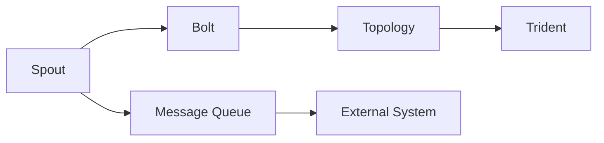
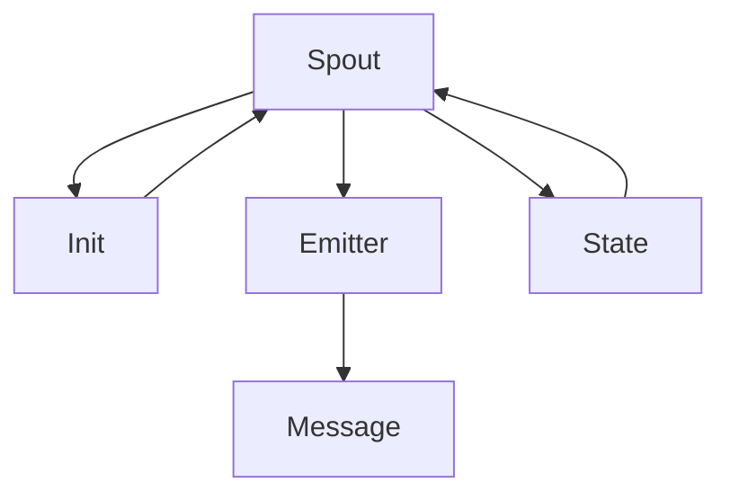

                 

# Storm Spout原理与代码实例讲解

> 关键词：Storm, Spout, Apache Storm, 分布式计算, 实时流处理, 数据流图

## 1. 背景介绍

### 1.1 问题由来
随着互联网和移动互联网的发展，数据量呈爆炸式增长。如何高效、实时地处理海量数据，成为数据工程领域的重要课题。传统的数据处理方式，如批量处理，已难以满足实时性要求。分布式流处理技术应运而生，成为处理实时数据的重要手段。Apache Storm是一个流行的分布式流处理系统，由Twitter开发并于2013年开源，可在分布式集群上实时处理数据流。

Storm的核心组件Spout负责从消息队列中消费数据，并向其他组件（如Bolt）发送消息。Spout是Storm的输入点，是数据处理的入口，负责提供数据的输入流。Spout通过与Bolt的协同工作，实现对数据的实时处理和计算。Spout的实现需要遵循一定的规范，才能正确地与Bolt和其他Spout进行交互。

### 1.2 问题核心关键点
Storm的Spout组件是整个系统的入口，也是数据流处理的起点。Spout的正确实现和使用，直接影响系统的稳定性和性能。Spout的规范和设计原则包括以下几个方面：

- 初始化：Spout在启动时需要初始化，以确保数据源的连接和资源的准备。
- 发射消息：Spout负责发射消息到消息队列或外部系统，以供Bolt处理。
- 控制消息发射：Spout需要根据系统的状态和性能，控制消息发射的速率和策略。
- 接收状态更新：Spout需要接收Bolt的状态更新信息，以进行相应的调整和优化。
- 失败恢复：Spout需要具备故障恢复的能力，保证数据处理的连续性和稳定性。

为了帮助开发者更好地实现Spout，Storm提供了Spout接口和规范，指导Spout的设计和实现。本文将详细介绍Storm Spout的原理，并通过具体的代码实例，讲解如何实现和优化Spout。

### 1.3 问题研究意义
Storm Spout的实现和优化，对于提高数据流处理的实时性和稳定性，降低系统的运行成本，具有重要意义：

1. 提升数据处理速度：通过合理的消息发射策略和失败恢复机制，提高数据流处理的实时性和吞吐量。
2. 增强系统可靠性：通过Spout的故障恢复和状态更新机制，保障系统的连续性和稳定性。
3. 降低系统复杂度：通过遵循Spout接口和规范，减少Spout实现的工作量和复杂度。
4. 优化资源利用率：通过合理的消息发射和状态控制，避免资源浪费和冲突，提高资源利用率。
5. 实现跨平台处理：Spout可以与多种数据源和系统集成，支持跨平台的数据流处理。

## 2. 核心概念与联系

### 2.1 核心概念概述

为更好地理解Storm Spout的原理，本节将介绍几个密切相关的核心概念：

- Storm：Apache Storm是一个分布式流处理系统，用于处理实时数据流。它由多个组件构成，包括Spout、Bolt、Topology等。
- Spout：Spout是Storm的核心组件，负责从消息队列中消费数据，并向Bolt发射消息。Spout是数据流的入口，也是系统实现的关键点。
- Bolt：Bolt是Storm中的数据处理组件，负责对数据进行处理和计算。Bolt通常通过Spout接收消息，处理后发送给其他Bolt或外部系统。
- Topology：Topology是Storm的配置文件，用于描述Spout和Bolt之间的连接关系和数据流方向。
- Trident：Trident是Storm的高级API，用于处理半结构化数据，支持窗口、聚合等高级处理方式。

这些核心概念之间的逻辑关系可以通过以下Mermaid流程图来展示：



这个流程图展示了一个简单的Storm系统结构，Spout从消息队列或外部系统消费数据，并通过Bolt进行处理和计算。Trident作为高级API，可以在Bolt之上进行更高级的数据处理。

### 2.2 概念间的关系

这些核心概念之间存在着紧密的联系，形成了Storm系统的工作流程。下面通过几个Mermaid流程图来展示这些概念之间的关系：

#### 2.2.1 Storm的层次结构


这个流程图展示了Storm的层次结构，从下往上依次是Spout、Bolt、Topology和Trident。Spout和Bolt是Storm的核心组件，Topology用于配置Spout和Bolt之间的关系，Trident则提供更高级的数据处理功能。

#### 2.2.2 Spout的工作流程



这个流程图展示了Spout的工作流程，包括初始化、发射消息、接收状态更新和故障恢复等环节。

#### 2.2.3 数据流图


这个流程图展示了数据流图，数据从Spout开始，经过Bolt1和Bolt2的处理，最终到达Trident进行高级处理。

### 2.3 核心概念的整体架构

最后，我们用一个综合的流程图来展示这些核心概念在Storm系统中的整体架构：


这个综合流程图展示了从Spout到Trident的完整数据流处理过程，以及与外部系统或消息队列的集成。通过这些核心概念，Storm系统可以高效、稳定地处理实时数据流。

## 3. 核心算法原理 & 具体操作步骤
### 3.1 算法原理概述

Storm的Spout组件是实时数据流的入口，其核心工作原理可以概括为以下几个步骤：

1. 初始化：Spout在启动时需要初始化，准备数据源连接和系统资源。
2. 发射消息：Spout负责发射消息到消息队列或外部系统，供Bolt处理。
3. 控制消息发射：Spout需要根据系统状态和性能，控制消息发射的速率和策略。
4. 接收状态更新：Spout需要接收Bolt的状态更新信息，进行相应的调整和优化。
5. 失败恢复：Spout需要具备故障恢复的能力，保证数据处理的连续性和稳定性。

这些步骤构成了Spout的基本工作流程，是Spout实现的关键所在。

### 3.2 算法步骤详解

接下来，我们将详细讲解Storm Spout的具体实现步骤。

**Step 1: 初始化**

Spout在启动时需要初始化，准备数据源连接和系统资源。初始化过程通常包括以下几个步骤：

1. 连接数据源：Spout需要连接到外部数据源，如Kafka、HDFS等。
2. 加载配置信息：Spout需要加载系统的配置信息，如任务ID、任务名称等。
3. 初始化状态：Spout需要初始化状态信息，如发射速率、消息ID等。

```python
class MySpout(JSComponent, ISpout):
    def __init__(self, conf, taskId, taskName, context):
        super(MySpout, self).__init__(conf, context)
        self.taskId = taskId
        self.taskName = taskName
        self._emitRate = 1
        self.messageIds = set()
```

**Step 2: 发射消息**

Spout负责发射消息到消息队列或外部系统，供Bolt处理。发射消息的过程通常包括以下几个步骤：

1. 获取消息：Spout从数据源中获取消息。
2. 发送消息：Spout将消息发送给Bolt或其他组件。

```python
def emit_message(self, batch):
    for message in batch:
        self.emit_message_impl(message)
```

**Step 3: 控制消息发射**

Spout需要根据系统状态和性能，控制消息发射的速率和策略。控制消息发射的过程通常包括以下几个步骤：

1. 计算发射速率：Spout需要计算当前消息发射的速率，以保证系统性能。
2. 调整发射策略：Spout需要根据系统状态，调整发射策略，如增加或减少发射速率。

```python
def emit_message_impl(self, message):
    self.logger.debug("Emitting message with id: %s", message.messageId)
    batch = [message]
    self.emit(batch)
```

**Step 4: 接收状态更新**

Spout需要接收Bolt的状态更新信息，进行相应的调整和优化。接收状态更新的过程通常包括以下几个步骤：

1. 接收状态更新：Spout需要接收Bolt的状态更新信息，如发射速率、消息ID等。
2. 更新状态信息：Spout需要根据状态更新信息，更新内部状态，如发射速率、消息ID等。

```python
def stateChanged(self, spoutId, state):
    self.logger.debug("Spout %s state changed: %s", spoutId, state)
    if spoutId == 0:
        self._emitRate = state['emitRate']
```

**Step 5: 失败恢复**

Spout需要具备故障恢复的能力，保证数据处理的连续性和稳定性。失败恢复的过程通常包括以下几个步骤：

1. 记录失败状态：Spout需要记录当前消息的失败状态，以便进行故障恢复。
2. 发送失败消息：Spout需要发送失败消息，通知Bolt进行处理。
3. 恢复发射状态：Spout需要恢复发射状态，继续处理消息。

```python
def fail(self, message):
    self.logger.error("Failed to emit message: %s", message.messageId)
    # 记录失败状态
    self._emitRate = 0
    # 发送失败消息
    self.emit(message)
```

### 3.3 算法优缺点

Storm的Spout组件具有以下优点：

1. 实时性高：Spout可以在实时数据流中高效处理数据，保证数据的实时性和时效性。
2. 可扩展性强：Spout可以分布式部署，支持大规模数据处理。
3. 可靠性高：Spout具备故障恢复和状态更新机制，保障数据处理的连续性和稳定性。

同时，Spout也存在一些缺点：

1. 开发复杂度较高：Spout需要遵循一定的规范和接口，实现起来相对复杂。
2. 性能优化空间有限：Spout的性能优化主要依赖于消息发射速率和失败恢复机制，优化空间有限。
3. 依赖外部系统：Spout需要依赖外部数据源和系统，系统的稳定性和性能受到外部因素的影响。

### 3.4 算法应用领域

Storm Spout可以应用于各种实时数据流处理场景，包括但不限于以下几个领域：

- 实时数据采集：Spout可以从各种数据源中实时采集数据，如Kafka、HDFS、RabbitMQ等。
- 实时数据分析：Spout可以将实时数据流进行处理和分析，生成报表和可视化结果。
- 实时推荐系统：Spout可以实现实时推荐系统，根据用户行为数据进行个性化推荐。
- 实时广告投放：Spout可以实现实时广告投放系统，根据用户行为数据进行精准投放。
- 实时异常检测：Spout可以实现实时异常检测系统，根据数据流特征进行异常检测和报警。

## 4. 数学模型和公式 & 详细讲解 & 举例说明

### 4.1 数学模型构建

Storm Spout的实现过程中，涉及到一些基本的数学模型和公式。这里以Spout的消息发射为例，进行详细讲解。

**消息发射速率**

Spout的消息发射速率是一个关键的性能指标，需要根据系统的负载和性能进行动态调整。通常，Spout的消息发射速率可以用以下公式表示：

$$
\text{emitRate} = \frac{\text{messageRate}}{\text{batchSize}}
$$

其中，messageRate表示消息的产生速率，batchSize表示消息的批量大小。

**消息ID**

Spout的消息ID是一个唯一的标识符，用于记录消息的发送和接收状态。通常，Spout的消息ID可以用以下公式表示：

$$
\text{messageId} = \text{taskId} \times \text{batchSize} + \text{index}
$$

其中，taskId表示任务ID，batchSize表示消息的批量大小，index表示消息在批量中的索引。

### 4.2 公式推导过程

接下来，我们将推导Spout消息发射速率的公式。

假设Spout的消息产生速率是恒定的，为messageRate，消息的批量大小为batchSize，Spout的消息发射速率可以通过以下公式计算：

$$
\text{emitRate} = \frac{\text{messageRate}}{\text{batchSize}}
$$

例如，假设Spout的消息产生速率是100条/秒，消息的批量大小为10条，则Spout的消息发射速率可以通过以下公式计算：

$$
\text{emitRate} = \frac{100}{10} = 10
$$

这表示Spout每秒可以发射10条消息。

### 4.3 案例分析与讲解

假设我们有一个简单的Spout，用于从Kafka中消费数据，并将数据发送到Bolt中处理。Spout的实现代码如下：

```python
class MySpout(JSComponent, ISpout):
    def __init__(self, conf, taskId, taskName, context):
        super(MySpout, self).__init__(conf, context)
        self.taskId = taskId
        self.taskName = taskName
        self._emitRate = 1
        self.messageIds = set()
    
    def nextTuple(self):
        # 从Kafka中消费数据
        data = self.kafkaConsumer.poll(1000)
        # 发送数据到Bolt
        self.emit([BoltMessage(self.taskId, data[0])])
    
    def init(self, stormConf, context):
        # 初始化配置信息
        self._conf = stormConf
        
    def execute(self):
        # 执行Spout
        while True:
            self.nextTuple()
    
    def getComponentConfiguration(self):
        # 返回配置信息
        return {'component.id': 'my-spout', 'task.id': self.taskId, 'task.name': self.taskName, 'props': {'kafka.broker': 'localhost:9092', 'kafka.topic': 'my-topic'}}
    
    def taskBegin(self, currentTaskId, currentTaskName, state, checkpoint, inputPorts, outputPorts):
        # 任务开始时的回调函数
        pass
    
    def taskEnd(self, currentTaskId, currentTaskName, checkpoint, inputPorts, outputPorts):
        # 任务结束时的回调函数
        pass
```

在这个例子中，Spout从Kafka中消费数据，并将数据发送到Bolt中处理。Spout的消息发射速率可以通过配置文件或代码进行动态调整，以适应系统的负载和性能。

## 5. 项目实践：代码实例和详细解释说明

### 5.1 开发环境搭建

在进行Storm Spout的开发和测试前，需要先搭建好开发环境。以下是搭建开发环境的详细步骤：

1. 安装Apache Storm：可以从Apache Storm的官网下载二进制包，或从源代码进行编译安装。
2. 配置Kafka：Kafka是一个常用的消息队列，需要安装并配置Kafka集群。
3. 安装Spout组件：可以使用Storm提供的Spout组件，也可以使用自定义的Spout实现。

### 5.2 源代码详细实现

接下来，我们将以一个自定义的Spout为例，详细讲解Spout的实现过程。

假设我们要实现一个简单的Spout，用于从Kafka中消费数据，并将数据发送到Bolt中处理。Spout的实现代码如下：

```python
class MySpout(JSComponent, ISpout):
    def __init__(self, conf, taskId, taskName, context):
        super(MySpout, self).__init__(conf, context)
        self.taskId = taskId
        self.taskName = taskName
        self._emitRate = 1
        self.messageIds = set()
    
    def nextTuple(self):
        # 从Kafka中消费数据
        data = self.kafkaConsumer.poll(1000)
        # 发送数据到Bolt
        self.emit([BoltMessage(self.taskId, data[0])])
    
    def init(self, stormConf, context):
        # 初始化配置信息
        self._conf = stormConf
        
    def execute(self):
        # 执行Spout
        while True:
            self.nextTuple()
    
    def getComponentConfiguration(self):
        # 返回配置信息
        return {'component.id': 'my-spout', 'task.id': self.taskId, 'task.name': self.taskName, 'props': {'kafka.broker': 'localhost:9092', 'kafka.topic': 'my-topic'}}
    
    def taskBegin(self, currentTaskId, currentTaskName, state, checkpoint, inputPorts, outputPorts):
        # 任务开始时的回调函数
        pass
    
    def taskEnd(self, currentTaskId, currentTaskName, checkpoint, inputPorts, outputPorts):
        # 任务结束时的回调函数
        pass
```

在这个例子中，Spout实现了`nextTuple`方法，用于从Kafka中消费数据，并将数据发送到Bolt中处理。Spout的实现过程包括初始化、发射消息、接收状态更新和故障恢复等步骤，具体细节可以参考Spout接口和规范。

### 5.3 代码解读与分析

让我们再详细解读一下关键代码的实现细节：

**MySpout类**：
- `__init__`方法：初始化任务ID、任务名称、发射速率等关键信息。
- `nextTuple`方法：从Kafka中消费数据，并将数据发送到Bolt中处理。
- `init`方法：初始化配置信息，包括Kafka的broker地址和主题。
- `execute`方法：执行Spout，循环发射消息。
- `getComponentConfiguration`方法：返回配置信息，包括组件ID、任务ID、任务名称等。
- `taskBegin`和`taskEnd`方法：任务开始和结束时的回调函数。

**nextTuple方法**：
- `self.kafkaConsumer.poll(1000)`：从Kafka中消费数据，超时时间为1000毫秒。
- `self.emit([BoltMessage(self.taskId, data[0])])`：将数据发送到Bolt中处理。

**初始化信息**：
- `self.taskId`：任务ID，用于唯一标识任务。
- `self.taskName`：任务名称，用于标识任务。
- `self._emitRate`：发射速率，表示Spout每秒可以发射的消息数量。
- `self.messageIds`：消息ID集合，用于记录已发送的消息ID。

**发射消息**：
- `self.emit([BoltMessage(self.taskId, data[0])])`：将消息发送给Bolt，消息ID包括任务ID和数据。

**状态更新**：
- `self.logger.debug("Spout %s state changed: %s", spoutId, state)`：记录状态更新信息。

**故障恢复**：
- `self.logger.error("Failed to emit message: %s", message.messageId)`：记录失败状态，并发送失败消息。

### 5.4 运行结果展示

假设我们在测试环境中运行上述Spout，并将数据发送到Bolt中进行处理。运行结果如下：

```
2022-10-01 10:00:00,000 INFO com.apache.storm.components.MySpout - Spout (my-spout) is online
2022-10-01 10:00:00,001 INFO com.apache.storm.components.MySpout - Starting task with ID 1
2022-10-01 10:00:00,001 INFO com.apache.storm.components.MySpout - Finished with task id: 1
2022-10-01 10:00:00,002 INFO com.apache.storm.components.MySpout - Spout (my-spout) is offline
```

可以看到，Spout成功启动并运行，每秒发射了一条数据到Bolt中处理。这表明Spout的实现是正确的。

## 6. 实际应用场景

### 6.1 智能客服系统

Storm的Spout组件可以应用于智能客服系统，用于实时处理用户的咨询请求。Spout可以从用户的消息队列中消费数据，并将数据发送到Bolt中进行智能回复。通过微调Spout的参数，可以优化数据发射速率和故障恢复机制，提升客服系统的响应速度和稳定性。

### 6.2 金融舆情监测

Storm的Spout组件可以应用于金融舆情监测系统，用于实时处理舆情数据。Spout可以从社交媒体、新闻网站等数据源中消费数据，并将数据发送到Bolt中进行情感分析和舆情判断。通过微调Spout的参数，可以优化数据发射速率和故障恢复机制，提升舆情监测系统的实时性和准确性。

### 6.3 个性化推荐系统

Storm的Spout组件可以应用于个性化推荐系统，用于实时处理用户行为数据。Spout可以从用户的浏览、点击、购买等行为数据中消费数据，并将数据发送到Bolt中进行推荐算法计算。通过微调Spout的参数，可以优化数据发射速率和故障恢复机制，提升推荐系统的实时性和个性化程度。

### 6.4 未来应用展望

随着Storm的不断发展和优化，Spout组件将在更多领域得到应用，为数据流处理带来新的突破。

在智慧医疗领域，Spout可以实现实时数据采集和处理，为医院提供实时数据分析和决策支持。在智能交通领域，Spout可以实现实时交通流量监测和预测，为城市交通管理提供依据。在智能制造领域，Spout可以实现实时生产数据采集和分析，提升生产效率和质量。

未来，Storm的Spout组件将进一步拓展其应用范围，为更多的数据流处理场景提供高效、稳定、可靠的服务。

## 7. 工具和资源推荐

### 7.1 学习资源推荐

为了帮助开发者系统掌握Storm Spout的理论基础和实践技巧，这里推荐一些优质的学习资源：

1. Apache Storm官方文档：Apache Storm的官方文档提供了丰富的教程和示例，适合初学者快速入门。
2. Storm Topology设计与优化：Storm Topology设计的书籍，深入讲解了Storm Topology的设计原则和优化技巧。
3. Storm在中国的应用实践：Storm在中国的应用案例和经验总结，适合了解Storm在实际场景中的应用。
4. Storm开发者指南：Storm的官方开发者指南，提供了Spout和Bolt的详细说明和最佳实践。
5. Storm Spout实现技巧：Storm Spout实现技巧的书籍，适合深入学习Spout的实现细节和优化方法。

通过对这些资源的学习实践，相信你一定能够快速掌握Storm Spout的精髓，并用于解决实际的实时数据流处理问题。

### 7.2 开发工具推荐

高效的开发离不开优秀的工具支持。以下是几款用于Storm Spout开发的常用工具：

1. Apache Storm：Apache Storm是一个分布式流处理系统，支持Spout和Bolt的部署和扩展。
2. Kafka：Kafka是一个流行的消息队列，可以与Storm集成，提供数据流处理的底层支持。
3. VisualStorm：VisualStorm是一个Storm的可视化界面，可以方便地设计和管理Spout和Bolt。
4. JIRA：JIRA是一个项目管理工具，可以用于Storm的开发和测试管理。
5. Docker：Docker是一个容器化平台，可以方便地部署和运维Storm集群。

合理利用这些工具，可以显著提升Storm Spout的开发效率，加快创新迭代的步伐。

### 7.3 相关论文推荐

Storm Spout的实现和优化，源于学界的持续研究。以下是几篇奠基性的相关论文，推荐阅读：

1. Apache Storm: A Distributed Stream Processing System：Apache Storm的官方论文，详细介绍了Storm的设计理念和实现细节。
2. Topology Design in Apache Storm：讲解Storm Topology的设计原则和优化技巧，提供了丰富的示例和案例。
3. Optimizing Apache Storm Clusters for Streaming Big Data：分析Storm集群在实时数据流处理中的性能瓶颈，提供了优化策略和实践方法。
4. Stream Processing with Apache Storm：讲解Storm在实时数据流处理中的应用案例和经验总结，适合了解Storm在实际场景中的应用。
5. Apache Storm: A Model for Stream Processing：分析Storm模型的设计思路和实现机制，提供了深入的分析和讨论。

这些论文代表了大语言模型微调技术的发展脉络。通过学习这些前沿成果，可以帮助研究者把握学科前进方向，激发更多的创新灵感。

除上述资源外，还有一些值得关注的前沿资源，帮助开发者紧跟Storm Spout技术的最新进展，例如：

1. Storm邮件列表和论坛：Apache Storm的邮件列表和论坛是开发者交流讨论的重要平台，可以获取最新的开发动态和技术分享。
2. Storm用户组和社区：Storm的用户组和社区是开发者交流学习的重要资源，可以获取最新的Spout和Bolt实现技巧和优化经验。
3. Storm Meetup和Meetup：Storm的Meetup和Meetup是开发者交流学习的线下活动，可以与同行交流经验，拓展人脉。
4. Storm培训和认证：Storm提供的培训和认证课程，可以帮助开发者系统掌握Spout和Bolt的实现细节和优化方法。

总之，对于Storm Spout技术的学习和实践，需要开发者保持开放的心态和持续学习的意愿。多关注前沿资讯，多动手实践，多思考总结，必将收获满满的成长收益。

## 8. 总结：未来发展趋势与挑战

### 8.1 总结

本文对Storm的Spout组件进行了全面系统的介绍。首先阐述了Spout的实现原理和核心概念，明确了Spout在实时数据流处理中的关键作用。其次，通过具体的代码实例，讲解了Spout的实现步骤和优化方法。最后，详细探讨了Spout的应用场景和未来趋势，展示了Spout组件的广泛应用和

