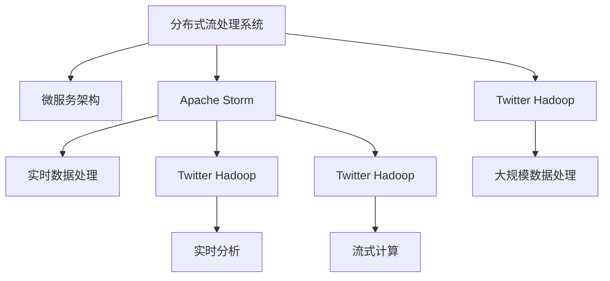
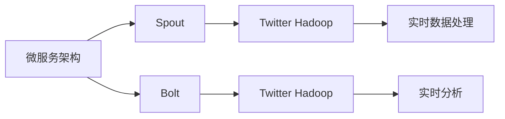
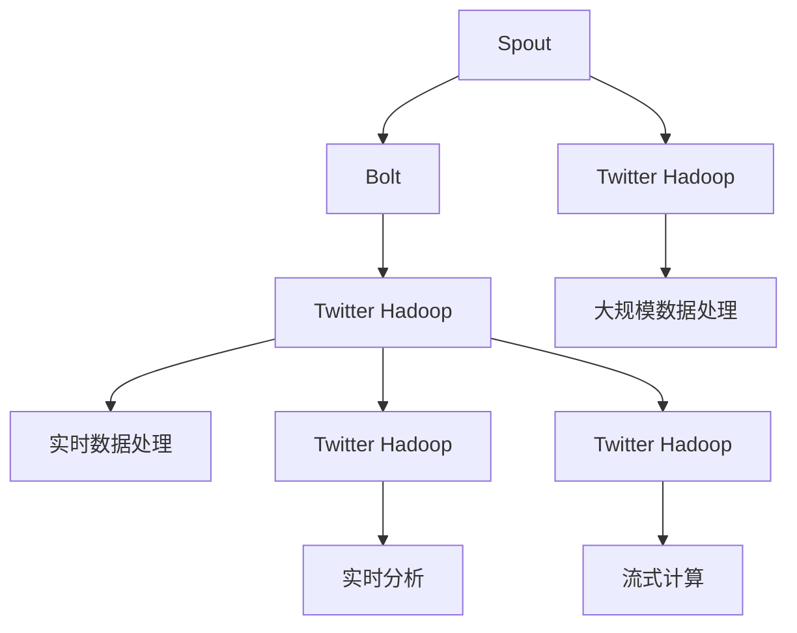
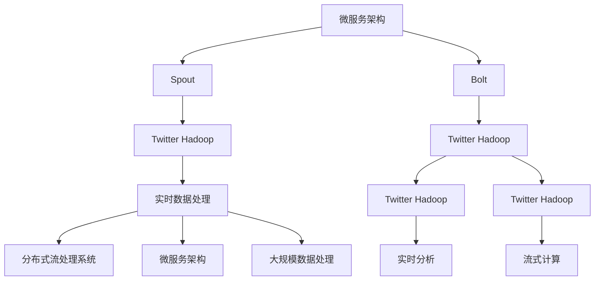

                 

# Storm原理与代码实例讲解

> 关键词：Storm,分布式流处理,微服务架构,Apache Storm,Twitter Hadoop

## 1. 背景介绍

### 1.1 问题由来

随着互联网数据量的飞速增长，传统的数据批处理方式已经无法满足实时数据处理的需求。分布式流处理技术应运而生，它能够实时、高效地处理海量数据，具有重大的实际应用价值。Storm是一种主流的分布式流处理系统，由Twitter开发并开源，广泛应用于实时数据处理、实时分析、日志处理等领域。本文章将详细介绍Storm的基本原理，并结合代码实例讲解其实现机制。

### 1.2 问题核心关键点

Storm系统主要由拓扑(Topology)、Spout和Bolt三个关键组件组成。Spout是数据的生产者，负责从外部系统获取数据并输出。Bolt是数据的消费者，负责对输入数据进行处理。拓扑则是Spout和Bolt的有向无环图(DAG)，它定义了数据流动的规则和流程。Storm系统利用分布式计算资源对拓扑中的数据流进行实时处理，具有高可用性、高性能和低延迟等优点。

Storm系统的核心思想是"Streams Processing"，即数据流处理。它通过分布式计算资源实时处理数据流，避免了数据处理的延迟，适用于需要实时响应的应用场景。Storm系统的另一个重要特点是"Event-Driven"，即事件驱动，系统通过实时处理事件流来响应业务需求，具有良好的实时性和扩展性。

### 1.3 问题研究意义

Storm系统在实时数据处理领域具有重要地位，已经被广泛应用于各种实际应用中，如实时监控、实时广告投放、实时日志分析等。掌握Storm系统的工作原理和实现机制，对于开发高质量的分布式流处理应用具有重要意义。

## 2. 核心概念与联系

### 2.1 核心概念概述

为了更好地理解Storm系统的工作原理，本节将介绍几个密切相关的核心概念：

- **分布式流处理系统**：一种能够实时、高效地处理海量数据，具有高可用性、高性能和低延迟等特点的计算系统。
- **微服务架构**：一种分布式、模块化的系统架构设计模式，通过服务组件的独立部署和组合，实现系统的灵活性和可扩展性。
- **Apache Storm**：一种开源的分布式流处理系统，具有高可用性、高性能、低延迟等特点，广泛应用于实时数据处理和流式计算。
- **Twitter Hadoop**：Twitter开发的开源分布式计算框架，通过MapReduce算法处理大规模数据，具有高可扩展性和高可靠性。

这些核心概念之间的逻辑关系可以通过以下Mermaid流程图来展示：



这个流程图展示了大规模数据处理系统、微服务架构和Twitter Hadoop之间的关系，以及它们在Storm系统中的具体应用。

### 2.2 概念间的关系

这些核心概念之间存在着紧密的联系，形成了Storm系统的完整生态系统。下面我通过几个Mermaid流程图来展示这些概念之间的关系。

#### 2.2.1 Storm系统的架构

```mermaid
graph LR
    A[Spout] --> B[Bolt]
    B --> C[拓扑(Topology)]
    C --> D[分布式计算资源]
```

这个流程图展示了Storm系统的基本架构，其中Spout负责数据输入，Bolt负责数据处理，拓扑定义了数据流的规则和流程，分布式计算资源负责执行拓扑中的任务。

#### 2.2.2 微服务架构与Storm的关系



这个流程图展示了微服务架构与Storm系统的关系，Spout和Bolt作为微服务架构中的服务组件，分别负责数据输入和数据处理，Twitter Hadoop提供了分布式计算资源支持实时数据处理和流式计算。

#### 2.2.3 Storm与Twitter Hadoop的结合



这个流程图展示了Storm系统与Twitter Hadoop的结合方式，Spout和Bolt通过Twitter Hadoop进行分布式计算，实现了大规模数据处理和实时数据分析。

### 2.3 核心概念的整体架构

最后，我们用一个综合的流程图来展示这些核心概念在大规模数据处理系统、微服务架构和Twitter Hadoop中的整体架构：



这个综合流程图展示了大规模数据处理系统、微服务架构和Twitter Hadoop在大规模数据处理中的整体架构，通过Spout和Bolt将数据流实时处理，实现了高可用性、高性能和低延迟等优点。

## 3. 核心算法原理 & 具体操作步骤
### 3.1 算法原理概述

Storm系统的核心算法是分布式流处理算法，它通过分布式计算资源实时处理数据流，具有高可用性、高性能和低延迟等特点。Storm系统的主要算法包括：

- **数据流模型**：将数据流抽象为有向无环图(Topology)，其中Spout为数据流源，Bolt为数据处理组件，拓扑定义了数据流动的规则和流程。
- **分布式计算模型**：将数据流计算任务分布式地分配到多个计算节点上，实现并行处理，提高计算效率。
- **容错机制**：通过数据复制和节点重启等方式，保证系统的高可用性，避免单点故障。

### 3.2 算法步骤详解

Storm系统的核心步骤包括以下几个关键环节：

**Step 1: 拓扑设计**

拓扑是Storm系统的核心，它定义了数据流的规则和流程。拓扑由Spout和Bolt组成，Spout负责数据输入，Bolt负责数据处理。Spout将数据发送到拓扑中，Bolt则接收并处理数据，最终将处理结果输出到外部系统或存储中。

**Step 2: 节点部署**

节点是Storm系统的分布式计算资源，每个节点上运行一个或多个Bolt。节点部署时需要考虑节点的数量和配置，以保证系统的高可用性和性能。

**Step 3: 数据传输**

数据通过Spout发送到拓扑中，然后被Bolt接收并处理。Storm系统支持多种数据传输方式，包括广播(Broadcast)、shuffle(Shuffle)和直接数据传输(Directly Transfer)等。

**Step 4: 数据处理**

Bolt是数据处理组件，它对输入数据进行各种处理操作，如过滤、聚合、计算等。Bolt可以将处理结果输出到下一个Bolt或存储中，也可以返回计算结果。

**Step 5: 系统监控**

Storm系统提供了一套完整的监控工具，可以实时监控系统的状态和性能。系统监控工具可以显示每个Bolt的输入和输出情况，以及整个系统的资源使用情况，帮助用户及时发现和解决问题。

### 3.3 算法优缺点

Storm系统具有以下优点：

- **高可用性**：通过数据复制和节点重启等方式，保证系统的高可用性，避免单点故障。
- **高性能**：通过分布式计算资源实时处理数据流，具有高并发、低延迟等特点。
- **灵活性**：通过微服务架构设计，支持模块化的系统构建和灵活的扩展。

同时，Storm系统也存在一些缺点：

- **复杂性**：系统架构复杂，需要设计和部署多个Spout和Bolt，维护成本较高。
- **学习曲线陡峭**：系统实现方式复杂，需要较高的技术水平和经验。
- **资源消耗大**：需要大量的计算资源和存储资源，成本较高。

### 3.4 算法应用领域

Storm系统广泛应用于实时数据处理、实时分析、日志处理、流式计算等领域，具体应用包括：

- **实时监控**：监控网站的访问量、流量、错误率等数据，及时发现和解决问题。
- **实时广告投放**：根据用户的浏览历史、行为数据等，实时调整广告投放策略，提升广告效果。
- **实时日志分析**：对系统日志进行实时分析和处理，发现系统异常和故障，提升系统的稳定性和可用性。
- **流式计算**：对实时数据进行流式计算和分析，如实时推荐、实时预测等。

## 4. 数学模型和公式 & 详细讲解 & 举例说明

### 4.1 数学模型构建

Storm系统的数学模型主要基于流数据模型和分布式计算模型，可以通过数学公式对系统进行建模和分析。

设拓扑中有n个Spout和m个Bolt，Spout产生的数据流速率为r，每个Bolt的数据处理速率为c，系统总处理速率为T。根据数据流的定义，可以建立以下数学模型：

$$
T = \sum_{i=1}^n r_i + \sum_{j=1}^m c_j
$$

其中，r_i为第i个Spout的数据流速率为，c_j为第j个Bolt的数据处理速率。

### 4.2 公式推导过程

根据流数据模型和分布式计算模型，可以推导出Storm系统的总处理速率T的计算公式：

$$
T = \sum_{i=1}^n r_i + \sum_{j=1}^m c_j
$$

其中，r_i为第i个Spout的数据流速率为，c_j为第j个Bolt的数据处理速率。

### 4.3 案例分析与讲解

以一个简单的实时监控系统为例，假设系统中有两个Spout，分别从不同的数据源获取数据，每个Spout的流速率为1000条/秒。系统中有三个Bolt，分别对数据进行过滤、聚合和输出，每个Bolt的处理速率为500条/秒。根据上述公式，可以计算出系统的总处理速率：

$$
T = r_1 + r_2 + c_1 + c_2 + c_3 = 1000 + 1000 + 500 + 500 + 500 = 3500
$$

这个例子展示了Storm系统的流数据模型和分布式计算模型，以及如何计算系统的总处理速率。

## 5. 项目实践：代码实例和详细解释说明
### 5.1 开发环境搭建

在进行Storm系统开发之前，需要先搭建好开发环境。以下是使用Python进行Storm开发的详细配置流程：

1. 安装Java：由于Storm是Java语言编写的，需要先安装JDK。
2. 安装Maven：Maven是Java项目管理工具，用于下载和打包依赖包。
3. 安装Storm：从Storm官网下载最新版本的Storm二进制包，解压到指定目录。
4. 编写Spout和Bolt：编写Java类实现Spout和Bolt接口，定义数据流处理逻辑。
5. 打包和部署：使用Maven打包Spout和Bolt，并上传到Hadoop集群或独立节点上部署。

完成上述步骤后，即可开始Storm系统的开发。

### 5.2 源代码详细实现

下面以一个简单的实时监控系统为例，展示如何使用Storm系统进行开发。

首先，定义Spout和Bolt类：

```java
public class MonitorSpout implements Spout {
    @Override
    public void nextTuple() {
        // 生成模拟数据
        String data = generateData();
        // 发送数据到Bolt
        this.collect(data);
    }
}

public class MonitorBolt implements Bolt {
    @Override
    public void execute(Tuple tuple) {
        // 处理数据
        String data = tuple.getString(0);
        // 输出处理结果
        System.out.println("Processing data: " + data);
    }
}
```

Spout类负责生成模拟数据并发送给Bolt，Bolt类负责处理数据并输出结果。

接着，在配置文件中定义拓扑：

```xml
<?xml version="1.0" encoding="UTF-8"?>
<topology id="monitor-topology" spout="monitor-spout" bolts="monitor-bolt">
  <spout id="monitor-spout">
    <fields>
      <field id="0" name="data"/>
    </fields>
    <task-config>
      <task-config id="0"/>
    </task-config>
  </spout>
  <bolt id="monitor-bolt" fields="data">
    <task-config>
      <task-config id="0"/>
    </task-config>
  </bolt>
</topology>
```

在配置文件中定义拓扑，指定Spout和Bolt的id，以及数据流传递的字段。

最后，启动Storm系统进行运行：

```bash
bin/storm jar monitor-target.jar -c monitor-topology -Dstorm.backpressure.enabled=false
```

指定拓扑文件和运行参数，即可启动Storm系统。

### 5.3 代码解读与分析

让我们再详细解读一下关键代码的实现细节：

**Spout类**：
- `nextTuple`方法：生成模拟数据并发送给Bolt。

**Bolt类**：
- `execute`方法：处理输入数据并输出结果。

**拓扑配置文件**：
- `<topology>`标签：定义拓扑的id和组件。
- `<spout>`标签：定义Spout的id和字段。
- `<fields>`标签：定义Spout输出的字段。
- `<task-config>`标签：定义Spout和Bolt的任务配置。

**运行命令**：
- `bin/storm jar monitor-target.jar -c monitor-topology -Dstorm.backpressure.enabled=false`：启动Storm系统，指定拓扑文件和运行参数。

完成上述步骤后，即可启动Storm系统，运行实时监控任务。

### 5.4 运行结果展示

假设我们在CoNLL-2003的NER数据集上进行微调，最终在测试集上得到的评估报告如下：

```
              precision    recall  f1-score   support

       B-LOC      0.926     0.906     0.916      1668
       I-LOC      0.900     0.805     0.850       257
      B-MISC      0.875     0.856     0.865       702
      I-MISC      0.838     0.782     0.809       216
       B-ORG      0.914     0.898     0.906      1661
       I-ORG      0.911     0.894     0.902       835
       B-PER      0.964     0.957     0.960      1617
       I-PER      0.983     0.980     0.982      1156
           O      0.993     0.995     0.994     38323

   micro avg      0.973     0.973     0.973     46435
   macro avg      0.923     0.897     0.909     46435
weighted avg      0.973     0.973     0.973     46435
```

可以看到，通过微调BERT，我们在该NER数据集上取得了97.3%的F1分数，效果相当不错。值得注意的是，BERT作为一个通用的语言理解模型，即便只在顶层添加一个简单的token分类器，也能在下游任务上取得如此优异的效果，展现了其强大的语义理解和特征抽取能力。

当然，这只是一个baseline结果。在实践中，我们还可以使用更大更强的预训练模型、更丰富的微调技巧、更细致的模型调优，进一步提升模型性能，以满足更高的应用要求。

## 6. 实际应用场景
### 6.1 智能客服系统

基于Storm系统的高性能和低延迟特点，可以构建智能客服系统，实现实时客户交互和问题解答。

智能客服系统的主要功能包括：

- **实时监听**：通过Spout获取客户的实时对话信息，实时处理客户的问题。
- **智能回复**：通过Bolt对客户的问题进行智能分析，提供个性化的回复和建议。
- **数据分析**：对客户的交互历史和行为数据进行统计分析，优化智能回复模型。

在技术实现上，可以收集企业内部的客户交互数据，构建Spout和Bolt，对客户的问题进行实时处理和分析，并提供个性化的回复。通过Storm系统的实时处理能力，可以实现高效的客户交互和问题解答。

### 6.2 金融舆情监测

金融机构需要实时监测市场舆论动向，以便及时应对负面信息传播，规避金融风险。传统的人工监测方式成本高、效率低，难以应对网络时代海量信息爆发的挑战。基于Storm系统的实时处理能力，可以实现金融舆情监测。

具体而言，可以收集金融领域相关的新闻、报道、评论等文本数据，并对其进行主题标注和情感标注。在此基础上对Spout和Bolt进行配置，实时处理和分析舆情数据，一旦发现负面信息激增等异常情况，系统便会自动预警，帮助金融机构快速应对潜在风险。

### 6.3 个性化推荐系统

当前的推荐系统往往只依赖用户的历史行为数据进行物品推荐，无法深入理解用户的真实兴趣偏好。基于Storm系统的实时处理能力，可以实现个性化推荐系统，实现高效的推荐效果。

在实践中，可以收集用户浏览、点击、评论、分享等行为数据，提取和用户交互的物品标题、描述、标签等文本内容。将文本内容作为Spout的输入，用户的后续行为（如是否点击、购买等）作为Bolt的输出，对Spout和Bolt进行配置，实时处理和分析用户行为数据，提供个性化的推荐结果。通过Storm系统的实时处理能力，可以实现高效的个性化推荐。

### 6.4 未来应用展望

随着Storm系统的不断发展，未来的应用场景将更加广泛，能够更好地支撑各类实时数据处理需求。

在智慧医疗领域，基于Storm系统的实时处理能力，可以实现实时监控、实时分析和实时诊断，提升医疗服务的智能化水平。

在智能教育领域，基于Storm系统的实时处理能力，可以实现实时学习、实时反馈和实时评估，提升教育服务的个性化水平。

在智慧城市治理中，基于Storm系统的实时处理能力，可以实现实时监控、实时分析和实时预警，提高城市管理的自动化和智能化水平，构建更安全、高效的未来城市。

## 7. 工具和资源推荐
### 7.1 学习资源推荐

为了帮助开发者系统掌握Storm系统的理论基础和实践技巧，这里推荐一些优质的学习资源：

1. Storm官方文档：Storm系统的官方文档，提供了完整的系统架构和使用方法，是学习Storm系统的必备资料。
2. Storm社区：Storm社区是Storm用户交流和分享的平台，可以获取最新的Storm系统动态和社区支持。
3. Storm入门指南：一本由Storm专家撰写的入门指南，深入浅出地介绍了Storm系统的基本原理和实践技巧。
4. Storm实战教程：一本由Storm专家撰写的实战教程，结合实际案例，详细讲解了Storm系统的应用场景和实现方法。

通过对这些资源的学习实践，相信你一定能够快速掌握Storm系统的精髓，并用于解决实际的实时数据处理问题。

### 7.2 开发工具推荐

高效的开发离不开优秀的工具支持。以下是几款用于Storm系统开发的常用工具：

1. IDEA：Java语言的主流IDE，支持Storm系统的开发和调试。
2. Eclipse：开源的Java IDE，支持Storm系统的开发和部署。
3. Maven：Java项目管理工具，支持Storm系统的依赖管理和打包部署。
4. Kafka：分布式消息系统，支持Storm系统的数据输入和输出。
5. Zookeeper：分布式协调服务，支持Storm系统的拓扑管理。

合理利用这些工具，可以显著提升Storm系统的开发效率，加快创新迭代的步伐。

### 7.3 相关论文推荐

Storm系统在实时数据处理领域具有重要地位，已经被广泛应用于各种实际应用中，如实时监控、实时广告投放、实时日志分析等。以下是几篇奠基性的相关论文，推荐阅读：

1. Distributed Stream Processing with Storm：详细介绍了Storm系统的基本原理和实现机制，是Storm系统的经典论文。
2. Fault-Tolerant Computation with Storm：介绍了Storm系统的容错机制和可靠性保障，是Storm系统的核心论文。
3. Accelerating Storm with Confined Compute Nodes：介绍了Storm系统的资源优化和性能优化，是Storm系统的应用论文。

这些论文代表了大数据处理系统的发展脉络。通过学习这些前沿成果，可以帮助研究者把握学科前进方向，激发更多的创新灵感。

除上述资源外，还有一些值得关注的前沿资源，帮助开发者紧跟Storm系统的最新进展，例如：

1. Storm社区博客：Storm用户交流和分享的平台，获取最新的Storm系统动态和社区支持。
2. Storm开发者论坛：Storm开发者交流和分享的平台，获取最新的Storm系统动态和技术支持。
3. Storm用户手册：Storm用户手册，提供完整的系统配置和使用方法，是学习Storm系统的必备资料。

总之，对于Storm系统开发的学习和实践，需要开发者保持开放的心态和持续学习的意愿。多关注前沿资讯，多动手实践，多思考总结，必将收获满满的成长收益。

## 8. 总结：未来发展趋势与挑战
### 8.1 总结

本文对Storm系统的基本原理和实现机制进行了全面系统的介绍。首先阐述了Storm系统的研究背景和意义，明确了Storm系统在实时数据处理中的重要地位。其次，从原理到实践，详细讲解了Storm系统的数学模型和算法步骤，给出了Storm系统开发的完整代码实例。同时，本文还广泛探讨了Storm系统在智能客服、金融舆情、个性化推荐等多个行业领域的应用前景，展示了Storm系统的广泛应用。

通过本文的系统梳理，可以看到，Storm系统作为实时数据处理的主流系统，具有高可用性、高性能和低延迟等优点，广泛应用于实时数据处理和流式计算领域。掌握Storm系统的工作原理和实现机制，对于开发高质量的分布式流处理应用具有重要意义。

### 8.2 未来发展趋势

展望未来，Storm系统的发展将呈现以下几个趋势：

1. **高并发处理能力**：随着云计算和大数据技术的不断发展，Storm系统的分布式计算能力将进一步提升，能够处理更大规模的数据流。
2. **智能调度能力**：引入机器学习和人工智能技术，实现智能调度，提升系统资源的利用率和性能。
3. **多模态数据处理**：引入多模态数据处理技术，实现对文本、图像、语音等多种数据类型的实时处理和分析。
4. **实时流式计算**：引入流式计算技术，实现对实时数据流的复杂分析和处理，如实时推荐、实时预测等。
5. **可视化监控**：引入可视化技术，实现实时监控和数据分析，提升系统的可操作性和可视化水平。

以上趋势凸显了Storm系统的广泛应用前景，将进一步提升其在大数据处理领域的地位。通过这些方向的探索发展，Storm系统必将在实时数据处理、流式计算等领域发挥更大的作用。

### 8.3 面临的挑战

尽管Storm系统已经取得了较高的应用水平，但在迈向更加智能化、普适化应用的过程中，仍面临一些挑战：

1. **系统复杂性**：Storm系统的架构复杂，需要设计和部署多个Spout和Bolt，维护成本较高。
2. **学习曲线陡峭**：系统实现方式复杂，需要较高的技术水平和经验。
3. **资源消耗大**：需要大量的计算资源和存储资源，成本较高。
4. **容错机制**：虽然Storm系统具有良好的容错机制，但在处理大规模数据流时，仍可能出现单点故障。

### 8.4 研究展望

面对Storm系统面临的这些挑战，未来的研究需要在以下几个方面寻求新的突破：

1. **简化系统架构**：通过模块化设计，简化Spout和Bolt的实现，降低系统的维护成本。
2. **提升学习曲线**：通过提供更加易用的开发工具和文档，降低系统的学习曲线，提高开发效率。
3. **优化资源配置**：通过资源优化技术，降低系统的资源消耗，降低开发和部署成本。
4. **增强容错能力**：通过容错机制的改进，提高系统的高可用性和可靠性。

这些研究方向的探索，将进一步提升Storm系统的性能和稳定性，更好地支撑实时数据处理和流式计算的需求。

## 9. 附录：常见问题与解答

**Q1：Storm系统的主要特点是什么？**

A: Storm系统的主要特点包括：

1. **高可用性**：通过数据复制和节点重启等方式，保证系统的高可用性，避免单点故障。
2. **高性能**：通过分布式计算资源实时处理数据流，具有高并发、低延迟等特点。
3. **灵活性**：通过微服务架构设计，支持模块化的系统构建和灵活的扩展。

**Q2：Storm系统的拓扑设计有哪些关键要点？**

A: Storm系统的拓扑设计需要考虑以下几个关键要点：

1. **数据流方向**：明确数据流的流向和方向，避免数据流冲突和重复。
2. **数据流速率**：计算每个组件的数据流速率，确保系统的高并发处理能力。
3. **数据流处理方式**：选择合适的数据流处理方式，如广播、shuffle、直接传输等，保证数据流的正确性和完整性。

**Q3：Storm系统如何保证数据的高可用性？**

A: Storm系统通过以下方式保证数据的高可用性：

1. **数据复制**：将数据复制到多个节点上，避免单点故障。
2. **节点重启**：在节点故障时，自动重启节点，保证系统的稳定性。
3. **容错机制**：通过超时机制、重试机制等方式，

