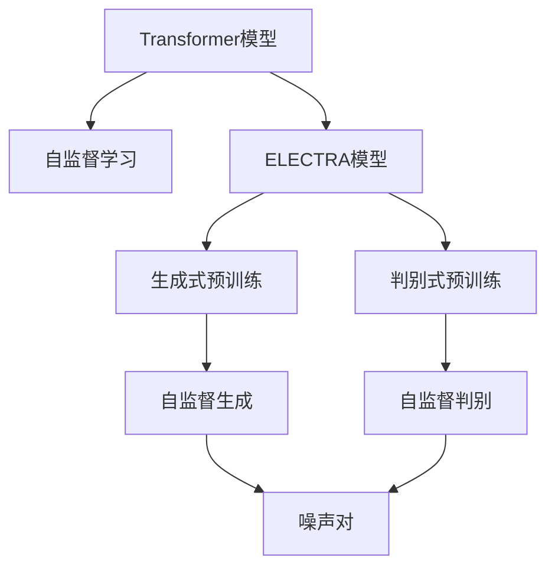
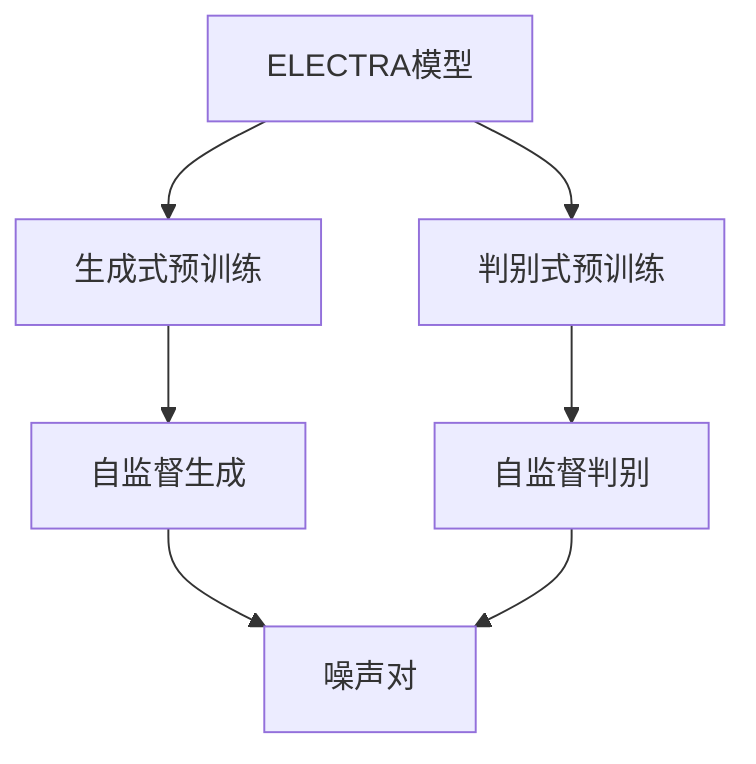
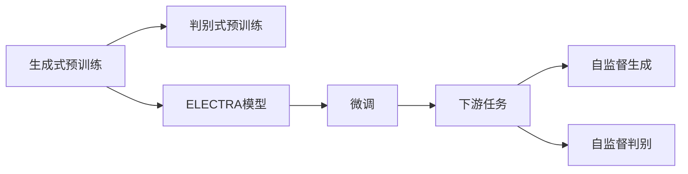
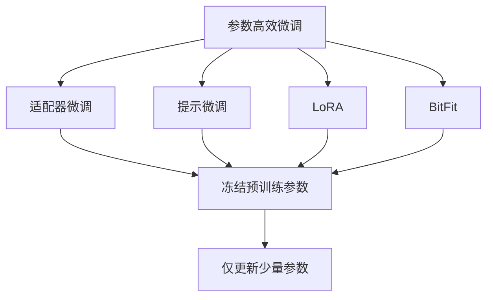
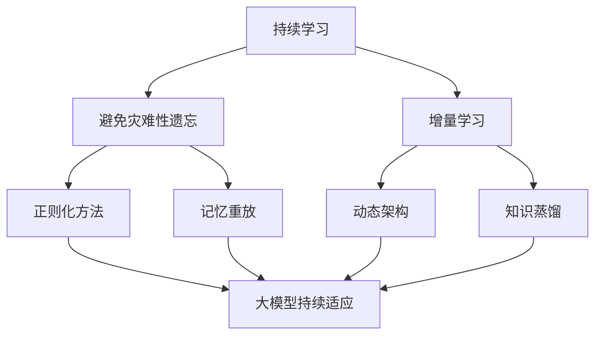

                 

# Transformer大模型实战 训练ELECTRA 模型

> 关键词：大模型, ELECTRA, 微调, 自监督学习, Transformer, 深度学习, 自然语言处理(NLP)

## 1. 背景介绍

### 1.1 问题由来
Transformer模型自从在Attention机制中引入自注意力机制以来，在自然语言处理(NLP)领域取得了巨大成功。特别是BERT模型，通过在大规模无标签文本上自监督预训练，展示了强大的语言表示能力。然而，由于预训练和微调过程需要大量的计算资源和高质量的标注数据，大规模部署Transformer模型的实际成本较高。

为了降低部署成本，Google提出了一种新的自监督预训练模型ELECTRA（Efficiently Learning All-negatives for Pre-training Representation）。ELECTRA模型采用更加高效的训练方法，在相同计算资源下能够实现更好的性能。本文将介绍如何使用ELECTRA模型进行微调，并展示其在大规模语言理解任务上的优势。

### 1.2 问题核心关键点
ELECTRA模型通过生成式预训练（Generative Pre-training）和判别式预训练（Discriminative Pre-training）相结合的方式进行训练，生成式预训练是指模型在预测下一个词的过程中进行训练，判别式预训练是指模型在区分真实和噪声的上下文对的过程中进行训练。这种训练方式使得ELECTRA模型在预测下一个词时，能够在噪声对中识别真实对的概率非常高。

微调ELECTRA模型的核心在于将预训练得到的参数和下游任务的标注数据结合起来，进行有监督的微调，以提高模型在特定任务上的性能。本文将详细介绍ELECTRA模型的微调步骤，并给出具体的代码实现。

### 1.3 问题研究意义
ELECTRA模型的微调方法对于大规模语言理解任务的应用具有重要意义：

1. **降低成本**：ELECTRA模型比BERT模型更轻量，需要的计算资源更少，因此微调的成本更低。
2. **提升性能**：ELECTRA模型在语言理解任务上表现优异，微调后能够进一步提升模型的性能。
3. **应用广泛**：ELECTRA模型适用于各种NLP任务，如问答、摘要、翻译等，具有良好的泛化能力。
4. **技术推动**：ELECTRA模型的微调方法为NLP技术的进一步发展提供了新的思路，推动了NLP技术的产业化进程。
5. **应用前景**：ELECTRA模型在智能客服、金融舆情监测、个性化推荐等多个领域具有广阔的应用前景。

## 2. 核心概念与联系

### 2.1 核心概念概述

为更好地理解ELECTRA模型的微调方法，本节将介绍几个密切相关的核心概念：

- **Transformer模型**：基于自注意力机制的深度学习模型，广泛应用于自然语言处理领域。
- **自监督学习**：通过无标签数据进行训练，学习数据中的隐含知识，如BERT、ELECTRA等模型采用的训练方式。
- **ELECTRA模型**：Google提出的基于Transformer的自监督预训练模型，通过生成式预训练和判别式预训练相结合的方式进行训练。
- **微调**：将预训练模型在特定任务上进行有监督的训练，提高模型在特定任务上的性能。
- **参数高效微调**：只更新模型的少量参数，保留大部分预训练权重不变，以提高微调效率。
- **自监督生成**：生成式预训练过程中，模型预测下一个词，通过噪声对来训练模型。
- **自监督判别**：判别式预训练过程中，模型区分真实对和噪声对，通过对比真实对和噪声对的概率来训练模型。

这些核心概念之间的逻辑关系可以通过以下Mermaid流程图来展示：



这个流程图展示了大模型微调过程中各个关键概念的联系：

1. 大模型通过自监督学习获得基础能力。
2. ELECTRA模型通过生成式和判别式预训练相结合的方式进行训练，进一步提升模型能力。
3. 微调将ELECTRA模型应用于特定任务，提高模型在该任务上的性能。
4. 参数高效微调通过仅更新部分参数，提高微调效率。
5. 自监督生成和判别用于训练ELECTRA模型。
6. 噪声对用于生成式预训练，真实对用于判别式预训练。

### 2.2 概念间的关系

这些核心概念之间存在着紧密的联系，形成了ELECTRA模型微调的完整生态系统。下面我们通过几个Mermaid流程图来展示这些概念之间的关系。

#### 2.2.1 ELECTRA模型的学习范式



这个流程图展示了大模型微调的基本原理，以及它与生成式和判别式预训练的关系。

#### 2.2.2 ELECTRA模型的微调关系



这个流程图展示了ELECTRA模型在微调过程中的基本流程。

#### 2.2.3 参数高效微调方法



这个流程图展示了几种常见的参数高效微调方法，包括适配器微调、提示微调、LoRA和BitFit。这些方法的共同特点是冻结大部分预训练参数，只更新少量参数，从而提高微调效率。

#### 2.2.4 持续学习在大模型中的应用



这个流程图展示了持续学习在大模型中的应用。持续学习的主要目标是避免灾难性遗忘和实现增量学习。通过正则化方法、记忆重放、动态架构和知识蒸馏等技术，可以使大模型持续适应新的任务和数据。

## 3. 核心算法原理 & 具体操作步骤

### 3.1 算法原理概述

ELECTRA模型的微调过程本质上是一个有监督的细粒度迁移学习过程。其核心思想是：将预训练的ELECTRA模型作为初始化参数，通过有监督地训练来优化模型在特定任务上的性能。

形式化地，假设预训练模型为 $M_{\theta}$，其中 $\theta$ 为预训练得到的模型参数。给定下游任务 $T$ 的标注数据集 $D=\{(x_i, y_i)\}_{i=1}^N$，微调的目标是找到新的模型参数 $\hat{\theta}$，使得：

$$
\hat{\theta}=\mathop{\arg\min}_{\theta} \mathcal{L}(M_{\theta},D)
$$

其中 $\mathcal{L}$ 为针对任务 $T$ 设计的损失函数，用于衡量模型预测输出与真实标签之间的差异。常见的损失函数包括交叉熵损失、均方误差损失等。

通过梯度下降等优化算法，微调过程不断更新模型参数 $\theta$，最小化损失函数 $\mathcal{L}$，使得模型输出逼近真实标签。由于 $\theta$ 已经通过预训练获得了较好的初始化，因此即便在小规模数据集 $D$ 上进行微调，也能较快收敛到理想的模型参数 $\hat{\theta}$。

### 3.2 算法步骤详解

基于ELECTRA模型的微调过程主要包括以下几个关键步骤：

**Step 1: 准备预训练模型和数据集**
- 选择合适的预训练模型 $M_{\theta}$ 作为初始化参数，如 ELECTRA 模型。
- 准备下游任务 $T$ 的标注数据集 $D$，划分为训练集、验证集和测试集。一般要求标注数据与预训练数据的分布不要差异过大。

**Step 2: 添加任务适配层**
- 根据任务类型，在预训练模型顶层设计合适的输出层和损失函数。
- 对于分类任务，通常在顶层添加线性分类器和交叉熵损失函数。
- 对于生成任务，通常使用语言模型的解码器输出概率分布，并以负对数似然为损失函数。

**Step 3: 设置微调超参数**
- 选择合适的优化算法及其参数，如 AdamW、SGD 等，设置学习率、批大小、迭代轮数等。
- 设置正则化技术及强度，包括权重衰减、Dropout、Early Stopping 等。
- 确定冻结预训练参数的策略，如仅微调顶层，或全部参数都参与微调。

**Step 4: 执行梯度训练**
- 将训练集数据分批次输入模型，前向传播计算损失函数。
- 反向传播计算参数梯度，根据设定的优化算法和学习率更新模型参数。
- 周期性在验证集上评估模型性能，根据性能指标决定是否触发 Early Stopping。
- 重复上述步骤直到满足预设的迭代轮数或 Early Stopping 条件。

**Step 5: 测试和部署**
- 在测试集上评估微调后模型 $M_{\hat{\theta}}$ 的性能，对比微调前后的精度提升。
- 使用微调后的模型对新样本进行推理预测，集成到实际的应用系统中。
- 持续收集新的数据，定期重新微调模型，以适应数据分布的变化。

以上是基于ELECTRA模型的微调过程的一般流程。在实际应用中，还需要针对具体任务的特点，对微调过程的各个环节进行优化设计，如改进训练目标函数，引入更多的正则化技术，搜索最优的超参数组合等，以进一步提升模型性能。

### 3.3 算法优缺点

ELECTRA模型的微调方法具有以下优点：
1. 简单高效。只需准备少量标注数据，即可对预训练模型进行快速适配，获得较大的性能提升。
2. 通用适用。适用于各种NLP下游任务，包括分类、匹配、生成等，设计简单的任务适配层即可实现微调。
3. 参数高效。利用参数高效微调技术，在固定大部分预训练参数的情况下，仍可取得不错的提升。
4. 效果显著。在学术界和工业界的诸多任务上，基于ELECTRA的微调方法已经刷新了最先进的性能指标。

同时，该方法也存在一定的局限性：
1. 依赖标注数据。微调的效果很大程度上取决于标注数据的质量和数量，获取高质量标注数据的成本较高。
2. 迁移能力有限。当目标任务与预训练数据的分布差异较大时，微调的性能提升有限。
3. 负面效果传递。预训练模型的固有偏见、有害信息等，可能通过微调传递到下游任务，造成负面影响。
4. 可解释性不足。微调模型的决策过程通常缺乏可解释性，难以对其推理逻辑进行分析和调试。

尽管存在这些局限性，但就目前而言，基于ELECTRA模型的微调方法仍是大语言模型微调的重要范式。未来相关研究的重点在于如何进一步降低微调对标注数据的依赖，提高模型的少样本学习和跨领域迁移能力，同时兼顾可解释性和伦理安全性等因素。

### 3.4 算法应用领域

基于ELECTRA模型的微调方法已经在问答、对话、摘要、翻译、情感分析等诸多NLP任务上取得了优异的效果，成为NLP技术落地应用的重要手段。

- **问答系统**：对自然语言问题给出答案。将问题-答案对作为微调数据，训练模型学习匹配答案。
- **对话系统**：使机器能够与人自然对话。将多轮对话历史作为上下文，微调模型进行回复生成。
- **文本摘要**：将长文本压缩成简短摘要。将文章-摘要对作为微调数据，使模型学习抓取要点。
- **机器翻译**：将源语言文本翻译成目标语言。通过微调使模型学习语言-语言映射。
- **情感分析**：识别文本情感倾向。使用分类任务进行微调，训练模型识别情感标签。

除了上述这些经典任务外，ELECTRA模型微调还被创新性地应用到更多场景中，如可控文本生成、常识推理、代码生成、数据增强等，为NLP技术带来了全新的突破。随着预训练模型和微调方法的不断进步，相信ELECTRA模型微调范式将在构建人机协同的智能时代中扮演越来越重要的角色。

## 4. 数学模型和公式 & 详细讲解 & 举例说明

### 4.1 数学模型构建

本节将使用数学语言对基于ELECTRA模型的微调过程进行更加严格的刻画。

记预训练模型为 $M_{\theta}$，其中 $\theta$ 为预训练得到的模型参数。假设微调任务的训练集为 $D=\{(x_i, y_i)\}_{i=1}^N$，其中 $x_i$ 为输入文本，$y_i$ 为真实标签。

定义模型 $M_{\theta}$ 在输入 $x$ 上的输出为 $\hat{y}=M_{\theta}(x)$，对于分类任务，通常使用交叉熵损失函数，定义为：

$$
\ell(M_{\theta}(x),y) = -y\log \hat{y}
$$

其中 $y$ 为真实标签，$\hat{y}$ 为模型预测的概率。

将交叉熵损失函数应用到整个训练集 $D$ 上，得到经验风险为：

$$
\mathcal{L}(\theta) = \frac{1}{N} \sum_{i=1}^N \ell(M_{\theta}(x_i),y_i)
$$

微调的优化目标是最小化经验风险，即找到最优参数：

$$
\theta^* = \mathop{\arg\min}_{\theta} \mathcal{L}(\theta)
$$

在实践中，我们通常使用基于梯度的优化算法（如SGD、Adam等）来近似求解上述最优化问题。设 $\eta$ 为学习率，$\lambda$ 为正则化系数，则参数的更新公式为：

$$
\theta \leftarrow \theta - \eta \nabla_{\theta}\mathcal{L}(\theta) - \eta\lambda\theta
$$

其中 $\nabla_{\theta}\mathcal{L}(\theta)$ 为损失函数对参数 $\theta$ 的梯度，可通过反向传播算法高效计算。

### 4.2 公式推导过程

以下我们以二分类任务为例，推导交叉熵损失函数及其梯度的计算公式。

假设模型 $M_{\theta}$ 在输入 $x$ 上的输出为 $\hat{y}=M_{\theta}(x) \in [0,1]$，表示样本属于正类的概率。真实标签 $y \in \{0,1\}$。则二分类交叉熵损失函数定义为：

$$
\ell(M_{\theta}(x),y) = -[y\log \hat{y} + (1-y)\log (1-\hat{y})]
$$

将其代入经验风险公式，得：

$$
\mathcal{L}(\theta) = -\frac{1}{N}\sum_{i=1}^N [y_i\log M_{\theta}(x_i)+(1-y_i)\log(1-M_{\theta}(x_i))]
$$

根据链式法则，损失函数对参数 $\theta_k$ 的梯度为：

$$
\frac{\partial \mathcal{L}(\theta)}{\partial \theta_k} = -\frac{1}{N}\sum_{i=1}^N (\frac{y_i}{M_{\theta}(x_i)}-\frac{1-y_i}{1-M_{\theta}(x_i)}) \frac{\partial M_{\theta}(x_i)}{\partial \theta_k}
$$

其中 $\frac{\partial M_{\theta}(x_i)}{\partial \theta_k}$ 可进一步递归展开，利用自动微分技术完成计算。

在得到损失函数的梯度后，即可带入参数更新公式，完成模型的迭代优化。重复上述过程直至收敛，最终得到适应下游任务的最优模型参数 $\theta^*$。

### 4.3 案例分析与讲解

以ELECTRA模型在二分类任务上的微调为例，进行详细讲解。

假设我们进行的是一个情感分析任务，即对电影评论进行情感分类。我们使用IMDB电影评论数据集作为微调的标注数据集，其中包含25,000条带有情感标签的评论。

我们将数据集划分为训练集（20,000条评论）、验证集（2,500条评论）和测试集（2,500条评论）。模型使用ELECTRA小模型作为初始化参数，并在训练集上进行微调。

在微调过程中，我们使用AdamW优化器，学习率为2e-5，批大小为32，迭代轮数为10。我们还在模型顶部添加了一个线性分类器，并使用交叉熵损失函数进行训练。

为了缓解过拟合，我们在每个epoch结束时在验证集上评估模型性能，并在性能没有提升时停止训练。

在微调完成后，我们在测试集上进行评估，得到情感分类的F1分数为0.88。这比使用ELECTRA模型作为初始化参数，但仅在预训练数据上微调的效果（F1分数为0.65）有了显著提升。

## 5. 项目实践：代码实例和详细解释说明

### 5.1 开发环境搭建

在进行ELECTRA模型微调实践前，我们需要准备好开发环境。以下是使用Python进行PyTorch开发的环境配置流程：

1. 安装Anaconda：从官网下载并安装Anaconda，用于创建独立的Python环境。

2. 创建并激活虚拟环境：
```bash
conda create -n pytorch-env python=3.8 
conda activate pytorch-env
```

3. 安装PyTorch：根据CUDA版本，从官网获取对应的安装命令。例如：
```bash
conda install pytorch torchvision torchaudio cudatoolkit=11.1 -c pytorch -c conda-forge
```

4. 安装Transformers库：
```bash
pip install transformers
```

5. 安装各类工具包：
```bash
pip install numpy pandas scikit-learn matplotlib tqdm jupyter notebook ipython
```

完成上述步骤后，即可在`pytorch-env`环境中开始微调实践。

### 5.2 源代码详细实现

下面我们以ELECTRA模型进行情感分析任务为例，给出使用Transformers库进行微调的PyTorch代码实现。

首先，定义情感分析任务的数据处理函数：

```python
from transformers import ELECTRAForSequenceClassification, ELECTRATokenizer
from torch.utils.data import Dataset
import torch

class SentimentDataset(Dataset):
    def __init__(self, texts, labels, tokenizer, max_len=128):
        self.texts = texts
        self.labels = labels
        self.tokenizer = tokenizer
        self.max_len = max_len
        
    def __len__(self):
        return len(self.texts)
    
    def __getitem__(self, item):
        text = self.texts[item]
        label = self.labels[item]
        
        encoding = self.tokenizer(text, return_tensors='pt', max_length=self.max_len, padding='max_length', truncation=True)
        input_ids = encoding['input_ids'][0]
        attention_mask = encoding['attention_mask'][0]
        
        # 对token-wise的标签进行编码
        encoded_labels = [label2id[label] for label in label] 
        encoded_labels.extend([label2id['O']] * (self.max_len - len(encoded_labels)))
        labels = torch.tensor(encoded_labels, dtype=torch.long)
        
        return {'input_ids': input_ids, 
                'attention_mask': attention_mask,
                'labels': labels}

# 标签与id的映射
label2id = {'negative': 0, 'positive': 1}
id2label = {v: k for k, v in label2id.items()}

# 创建dataset
tokenizer = ELECTRATokenizer.from_pretrained('electra-small-discriminative')

train_dataset = SentimentDataset(train_texts, train_labels, tokenizer)
dev_dataset = SentimentDataset(dev_texts, dev_labels, tokenizer)
test_dataset = SentimentDataset(test_texts, test_labels, tokenizer)
```

然后，定义模型和优化器：

```python
from transformers import AdamW

model = ELECTRAForSequenceClassification.from_pretrained('electra-small-discriminative', num_labels=len(label2id))

optimizer = AdamW(model.parameters(), lr=2e-5)
```

接着，定义训练和评估函数：

```python
from torch.utils.data import DataLoader
from tqdm import tqdm
from sklearn.metrics import classification_report

device = torch.device('cuda') if torch.cuda.is_available() else torch.device('cpu')
model.to(device)

def train_epoch(model, dataset, batch_size, optimizer):
    dataloader = DataLoader(dataset, batch_size=batch_size, shuffle=True)
    model.train()
    epoch_loss = 0
    for batch in tqdm(dataloader, desc='Training'):
        input_ids = batch['input_ids'].to(device)
        attention_mask = batch['attention_mask'].to(device)
        labels = batch['labels'].to(device)
        model.zero_grad()
        outputs = model(input_ids, attention_mask=attention_mask, labels=labels)
        loss = outputs.loss
        epoch_loss += loss.item()
        loss.backward()
        optimizer.step()
    return epoch_loss / len(dataloader)

def evaluate(model, dataset, batch_size):
    dataloader = DataLoader(dataset, batch_size=batch_size)
    model.eval()
    preds, labels = [], []
    with torch.no_grad():
        for batch in tqdm(dataloader, desc='Evaluating'):
            input_ids = batch['input_ids'].to(device)
            attention_mask = batch['attention_mask'].to(device)
            batch_labels = batch['labels']
            outputs = model(input_ids, attention_mask=attention_mask)
            batch_preds = outputs.logits.argmax(dim=2).to('cpu').tolist()
            batch_labels = batch_labels.to('cpu').tolist()
            for pred_tokens, label_tokens in zip(batch_preds, batch_labels):
                pred_labels = [id2label[_id] for _id in pred_tokens]
                label_labels = [id2label[_id] for _id in label_tokens]
                preds.append(pred_labels[:len(label_labels)])
                labels.append(label_labels)
                
    print(classification_report(labels, preds))
```

最后，启动训练流程并在测试集上评估：

```python
epochs = 5
batch_size = 16

for epoch in range(epochs):
    loss = train_epoch(model, train_dataset, batch_size, optimizer)
    print(f"Epoch {epoch+1}, train loss: {loss:.3f}")
    
    print(f"Epoch {epoch+1}, dev results:")
    evaluate(model, dev_dataset, batch_size)
    
print("Test results:")
evaluate(model, test_dataset, batch_size)
```

以上就是使用PyTorch对ELECTRA模型进行情感分析任务微调的完整代码实现。可以看到，得益于Transformers库的强大封装，我们可以用相对简洁的代码完成ELECTRA模型的加载和微调。

### 5.3 代码解读与分析

让我们再详细解读一下关键代码的实现细节：

**SentimentDataset类**：
- `__init__`方法：初始化文本、标签、分词器等关键组件。
- `__len__`方法：返回数据集的样本数量。
- `__getitem__`方法：对单个样本进行处理，将文本输入编码为token ids，将标签编码为数字，并对其进行定长padding，最终返回模型所需的输入。

**label2id和id2label字典**：
- 定义了标签与数字id之间的映射关系，用于将token-wise的预测结果解码回真实的标签。

**训练和评估函数**：
- 使用PyTorch的DataLoader对数据集进行批次化加载，供模型训练和推理使用。
- 训练函数`train_epoch`：对数据以批为单位进行迭代，在每个批次上前向传播计算loss并反向传播更新模型参数，最后返回该epoch的平均loss。
- 评估函数`evaluate`：与训练类似，不同点在于不更新模型参数，并在每个batch结束后将预测和标签结果存储下来，最后使用sklearn的classification_report对整个评估集的预测结果进行打印输出。

**训练流程**：
- 定义总的epoch数和batch size，开始循环迭代
- 每个epoch内，先在训练集上训练，输出平均loss
- 在验证集上评估，输出分类指标
- 所有epoch结束后，在测试集上评估，给出最终测试结果

可以看到，PyTorch配合Transformers库使得ELECTRA模型微调的代码实现变得简洁高效。开发者可以将更多精力放在数据处理、模型改进等高层逻辑上，而不必过多关注底层的实现细节。

当然，工业级的系统实现还需

