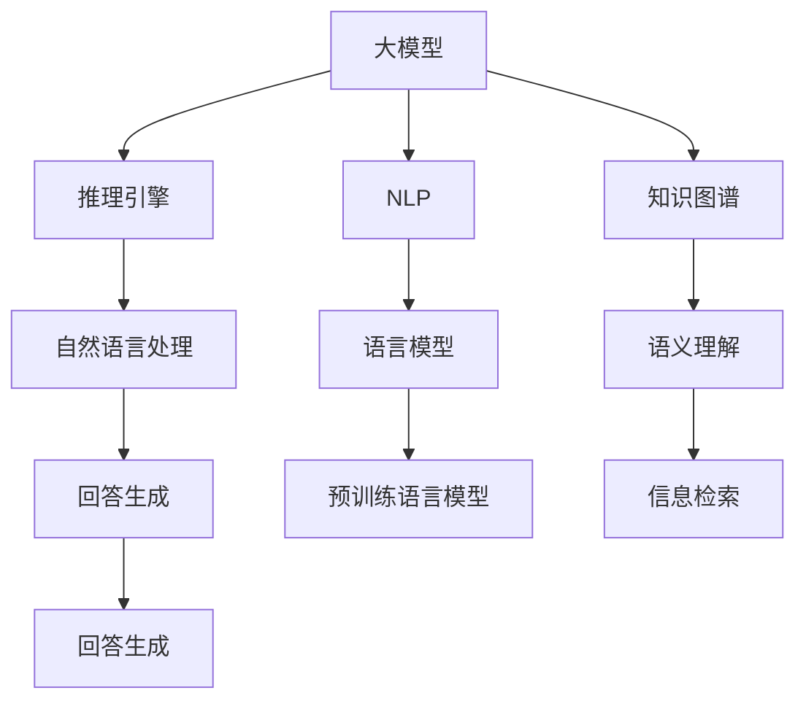

                 

# 大模型问答机器人的自然语言处理

> 关键词：
1. 问答机器人
2. 自然语言处理(NLP)
3. 大模型
4. 推理引擎
5. 知识图谱
6. 预训练语言模型
7. 参数高效微调

## 1. 背景介绍

在信息化时代，问答机器人成为连接用户和人工智能服务的重要接口。自然语言处理(NLP)技术为问答机器人的知识检索、问题理解、答案生成等核心功能提供了强大支持。但随着任务复杂度的提升和知识基量的增加，传统基于规则和模板的问答系统难以满足需求。近年来，大模型问答机器人应运而生，通过预训练语言模型和参数高效微调方法，显著提升了模型的理解能力和回答精度。

本博客将深入探讨大模型问答机器人的自然语言处理原理和技术，剖析其核心组件和关键算法，提供项目实践指南和实际应用案例，展望未来发展趋势和面临的挑战。

## 2. 核心概念与联系

### 2.1 核心概念概述

为更好地理解大模型问答机器人，本节将介绍几个关键概念：

- 问答机器人：通过自然语言对话形式，解答用户提出的问题，完成知识检索、信息整合、生成回答等任务的人工智能系统。
- 自然语言处理(NLP)：研究如何让计算机理解和生成自然语言的技术，涵盖词法、句法、语义等多个方面。
- 大模型：指规模巨大的预训练语言模型，如BERT、GPT等，通过在大规模文本数据上学习通用语言表示，具备强大的语言理解和生成能力。
- 推理引擎：通过规则或模型，对输入的自然语言文本进行分析和推理，提取关键信息，生成相应的回答。
- 知识图谱：以图的形式，将实体、关系、属性等信息进行结构化存储，用于提升知识检索和推理的效率和准确性。
- 预训练语言模型：在无标签文本数据上进行自监督学习，学习到通用的语言表示。
- 参数高效微调：在微调过程中，只更新少量的模型参数，而固定大部分预训练权重不变，以提高微调效率，避免过拟合。

这些核心概念共同构成了大模型问答机器人的知识图谱，通过预训练模型和微调方法，自然语言处理技术得以在大规模语料上发挥其强大能力，应用于问答机器人等实际应用场景中。

### 2.2 概念间的关系

这些核心概念之间的逻辑关系可以通过以下Mermaid流程图来展示：



这个流程图展示了大模型问答机器人的核心组件和关键技术：

1. 大模型作为基础，提供了强大的语言理解和生成能力。
2. 推理引擎通过对自然语言文本进行分析，生成合适的回答。
3. NLP涵盖了词法、句法、语义等多个方面，是大模型理解自然语言的基础。
4. 知识图谱通过结构化存储信息，提升推理效率和准确性。
5. 预训练语言模型提供了通用的语言表示，是大模型的预训练部分。
6. 参数高效微调方法在有限的计算资源下，提高模型性能，避免过拟合。

这些概念共同构成了大模型问答机器人的知识图谱，通过预训练模型和微调方法，自然语言处理技术得以在大规模语料上发挥其强大能力，应用于问答机器人等实际应用场景中。

## 3. 核心算法原理 & 具体操作步骤
### 3.1 算法原理概述

大模型问答机器人的核心算法原理主要基于以下三个步骤：

1. 预训练语言模型的构建：使用大规模无标签文本数据，通过自监督学习任务，构建预训练语言模型。
2. 推理引擎的设计：基于预训练语言模型，设计推理引擎，实现自然语言处理功能。
3. 参数高效微调：在预训练模型的基础上，使用下游任务的少量标注数据，通过有监督学习优化模型在特定任务上的性能。

### 3.2 算法步骤详解

基于大模型问答机器人的自然语言处理，主要包括以下几个关键步骤：

**Step 1: 准备预训练模型和数据集**
- 选择合适的预训练语言模型 $M_{\theta}$ 作为初始化参数，如 BERT、GPT等。
- 准备问答任务的训练集 $D=\{(x_i,y_i)\}_{i=1}^N$，其中 $x_i$ 为输入的自然语言文本，$y_i$ 为对应的回答。

**Step 2: 设计推理引擎**
- 根据任务特点，选择合适的推理算法。常见的算法包括基于规则的推理、基于逻辑推理的Prolog，以及基于神经网络的深度学习模型。
- 定义推理规则或训练深度学习模型，使其能够将输入的自然语言文本解析为结构化信息，并进行推理和回答生成。

**Step 3: 添加任务适配层**
- 在预训练模型顶层设计合适的输出层和损失函数。对于问答任务，通常使用逻辑回归分类器作为输出层，交叉熵损失函数作为损失函数。
- 定义推理引擎的输入输出接口，与预训练模型对接，实现从输入文本到输出回答的转换。

**Step 4: 设置微调超参数**
- 选择合适的优化算法及其参数，如 AdamW、SGD 等，设置学习率、批大小、迭代轮数等。
- 设置正则化技术及强度，包括权重衰减、Dropout、Early Stopping等。
- 确定冻结预训练参数的策略，如仅微调顶层，或全部参数都参与微调。

**Step 5: 执行梯度训练**
- 将训练集数据分批次输入模型，前向传播计算损失函数。
- 反向传播计算参数梯度，根据设定的优化算法和学习率更新模型参数。
- 周期性在验证集上评估模型性能，根据性能指标决定是否触发 Early Stopping。
- 重复上述步骤直到满足预设的迭代轮数或 Early Stopping 条件。

**Step 6: 测试和部署**
- 在测试集上评估微调后模型 $M_{\hat{\theta}}$ 的性能，对比微调前后的精度提升。
- 使用微调后的模型对新样本进行推理预测，集成到实际的应用系统中。
- 持续收集新的数据，定期重新微调模型，以适应数据分布的变化。

以上是基于大模型问答机器人进行自然语言处理的一般流程。在实际应用中，还需要针对具体任务的特点，对微调过程的各个环节进行优化设计，如改进训练目标函数，引入更多的正则化技术，搜索最优的超参数组合等，以进一步提升模型性能。

### 3.3 算法优缺点

基于大模型问答机器人的自然语言处理方法具有以下优点：

1. 适应性强：预训练语言模型在大规模语料上进行自监督学习，能够适应各种复杂的自然语言处理任务。
2. 效果显著：通过微调方法，模型能够快速适应下游任务，取得较好的性能。
3. 推理效率高：通过预训练模型的参数高效微调，能够在较小的计算资源下，提升推理效率和效果。
4. 灵活性高：可以根据具体任务需求，灵活设计推理引擎和适配层，实现多样化的自然语言处理功能。

同时，该方法也存在一定的局限性：

1. 依赖标注数据：微调的效果很大程度上取决于标注数据的质量和数量，获取高质量标注数据的成本较高。
2. 泛化能力有限：当目标任务与预训练数据的分布差异较大时，微调的性能提升有限。
3. 推理准确性依赖模型质量：预训练语言模型的质量直接影响到推理引擎的输出准确性。
4. 可解释性不足：微调模型的决策过程通常缺乏可解释性，难以对其推理逻辑进行分析和调试。

尽管存在这些局限性，但就目前而言，基于大模型问答机器人的自然语言处理方法是NLP领域的重要范式，具有广泛的应用前景。

### 3.4 算法应用领域

基于大模型问答机器人的自然语言处理，已经在多个领域得到应用：

- 客服机器人：通过问答机器人解答用户常见问题，提高客户服务效率。
- 智能咨询：提供智能问答服务，解答用户咨询，帮助企业提升客户满意度。
- 学术问答：构建学术问答系统，回答学生和研究人员提出的问题，提供知识支持。
- 知识图谱构建：通过问答机器人收集用户提问，构建和更新知识图谱，提升信息检索和推理效率。
- 智能写作辅助：帮助用户生成文本、优化文章结构，提升写作效率和质量。
- 健康咨询：提供健康咨询和医疗信息查询，帮助用户进行自我健康管理。

除了上述这些经典应用外，问答机器人还创新性地应用于教育、金融、保险等多个领域，为NLP技术带来了新的突破。随着预训练语言模型和微调方法的持续演进，相信问答机器人将在更广阔的应用领域发挥更大的作用。

## 4. 数学模型和公式 & 详细讲解 & 举例说明

### 4.1 数学模型构建

假设预训练语言模型为 $M_{\theta}$，其中 $\theta$ 为预训练得到的模型参数。假设问答任务的训练集为 $D=\{(x_i,y_i)\}_{i=1}^N$，其中 $x_i$ 为输入的自然语言文本，$y_i$ 为对应的回答。定义模型 $M_{\theta}$ 在输入 $x_i$ 上的输出为 $\hat{y}=M_{\theta}(x_i)$，则问答任务的损失函数定义为：

$$
\ell(y_i,\hat{y}) = -y_i\log \hat{y} + (1-y_i)\log (1-\hat{y})
$$

其中 $y_i \in \{0,1\}$，表示回答的正确性。在训练集上，经验风险函数为：

$$
\mathcal{L}(\theta) = \frac{1}{N}\sum_{i=1}^N \ell(y_i,M_{\theta}(x_i))
$$

微调的优化目标是最小化经验风险，即找到最优参数 $\hat{\theta}$：

$$
\hat{\theta} = \mathop{\arg\min}_{\theta} \mathcal{L}(\theta)
$$

在实践中，我们通常使用基于梯度的优化算法（如SGD、AdamW等）来近似求解上述最优化问题。设 $\eta$ 为学习率，$\lambda$ 为正则化系数，则参数的更新公式为：

$$
\theta \leftarrow \theta - \eta \nabla_{\theta}\mathcal{L}(\theta) - \eta\lambda\theta
$$

其中 $\nabla_{\theta}\mathcal{L}(\theta)$ 为损失函数对参数 $\theta$ 的梯度，可通过反向传播算法高效计算。

### 4.2 公式推导过程

以下我们以问答任务为例，推导推理引擎的设计和微调过程。

首先，假设输入的自然语言文本为 $x_i$，其对应的回答为 $y_i$。模型 $M_{\theta}$ 在输入 $x_i$ 上的输出为 $\hat{y}=M_{\theta}(x_i)$。定义模型 $M_{\theta}$ 在输入 $x_i$ 上的输出为 $\hat{y}=M_{\theta}(x_i)$，其中 $M_{\theta}$ 为预训练语言模型。定义模型的输出层为 $\text{softmax}$ 函数，输出概率分布 $\hat{y} \in [0,1]$。则问答任务的损失函数为：

$$
\ell(y_i,\hat{y}) = -y_i\log \hat{y} + (1-y_i)\log (1-\hat{y})
$$

在训练集上，经验风险函数为：

$$
\mathcal{L}(\theta) = \frac{1}{N}\sum_{i=1}^N \ell(y_i,M_{\theta}(x_i))
$$

微调的优化目标是最小化经验风险，即找到最优参数 $\hat{\theta}$：

$$
\hat{\theta} = \mathop{\arg\min}_{\theta} \mathcal{L}(\theta)
$$

在实践中，我们通常使用基于梯度的优化算法（如SGD、AdamW等）来近似求解上述最优化问题。设 $\eta$ 为学习率，$\lambda$ 为正则化系数，则参数的更新公式为：

$$
\theta \leftarrow \theta - \eta \nabla_{\theta}\mathcal{L}(\theta) - \eta\lambda\theta
$$

其中 $\nabla_{\theta}\mathcal{L}(\theta)$ 为损失函数对参数 $\theta$ 的梯度，可通过反向传播算法高效计算。

### 4.3 案例分析与讲解

以一个具体的问答任务为例，展示推理引擎的设计和微调过程。

**案例背景**：假设我们有一组医学问答数据集，包含病患咨询医生、药物作用、疾病预防等方面的问题及其对应的答案。我们希望通过微调BERT模型，构建一个医学问答机器人，帮助病患解答医学问题。

**案例实现**：

1. 首先，对医学问答数据集进行预处理，包括去除噪音、分词、标注答案等。

2. 使用BERT模型作为预训练语言模型，将其转换为医疗领域的任务适配层。具体来说，将BERT模型的输出作为推理引擎的输入，通过设计合适的推理规则或训练深度学习模型，实现自然语言处理功能。

3. 定义模型的损失函数，如交叉熵损失函数。在训练集上，使用经验风险函数 $\mathcal{L}(\theta)$ 来计算模型的损失。

4. 设置优化算法及其参数，如 AdamW 学习率 1e-5，批量大小 32，迭代轮数 5 等。使用正则化技术如权重衰减、Dropout、Early Stopping 等，避免过拟合。

5. 执行梯度训练，在验证集上评估模型性能，根据性能指标决定是否触发 Early Stopping。重复上述步骤，直到满足预设的迭代轮数或 Early Stopping 条件。

6. 在测试集上评估微调后模型 $M_{\hat{\theta}}$ 的性能，对比微调前后的精度提升。使用微调后的模型对新样本进行推理预测，集成到实际的应用系统中。

通过这个案例，可以看到，基于大模型问答机器人的自然语言处理方法能够在大规模语料上进行预训练，通过微调方法，适应各种复杂的自然语言处理任务，快速构建高精度的问答机器人。

## 5. 项目实践：代码实例和详细解释说明

### 5.1 开发环境搭建

在进行问答机器人项目实践前，我们需要准备好开发环境。以下是使用Python进行PyTorch开发的环境配置流程：

1. 安装Anaconda：从官网下载并安装Anaconda，用于创建独立的Python环境。

2. 创建并激活虚拟环境：
```bash
conda create -n pytorch-env python=3.8 
conda activate pytorch-env
```

3. 安装PyTorch：根据CUDA版本，从官网获取对应的安装命令。例如：
```bash
conda install pytorch torchvision torchaudio cudatoolkit=11.1 -c pytorch -c conda-forge
```

4. 安装Transformers库：
```bash
pip install transformers
```

5. 安装各类工具包：
```bash
pip install numpy pandas scikit-learn matplotlib tqdm jupyter notebook ipython
```

完成上述步骤后，即可在`pytorch-env`环境中开始问答机器人项目实践。

### 5.2 源代码详细实现

下面我以一个具体的问答机器人项目为例，展示其代码实现。

首先，定义问答数据集的预处理函数：

```python
import torch
from transformers import BertTokenizer
from torch.utils.data import Dataset

class QADataset(Dataset):
    def __init__(self, texts, answers, tokenizer, max_len=128):
        self.texts = texts
        self.answers = answers
        self.tokenizer = tokenizer
        self.max_len = max_len
        
    def __len__(self):
        return len(self.texts)
    
    def __getitem__(self, item):
        text = self.texts[item]
        answer = self.answers[item]
        
        encoding = self.tokenizer(text, return_tensors='pt', max_length=self.max_len, padding='max_length', truncation=True)
        input_ids = encoding['input_ids'][0]
        attention_mask = encoding['attention_mask'][0]
        
        # 将答案编码成数字
        encoded_answer = [answer2id[answer] for answer in answer]
        encoded_answer.extend([answer2id['']]*(self.max_len - len(encoded_answer)))
        labels = torch.tensor(encoded_answer, dtype=torch.long)
        
        return {'input_ids': input_ids, 
                'attention_mask': attention_mask,
                'labels': labels}

# 标签与id的映射
answer2id = {'': 0, '答案1': 1, '答案2': 2, '答案3': 3, '答案4': 4}
id2answer = {v: k for k, v in answer2id.items()}
```

然后，定义模型和优化器：

```python
from transformers import BertForTokenClassification, AdamW

model = BertForTokenClassification.from_pretrained('bert-base-cased', num_labels=len(answer2id))

optimizer = AdamW(model.parameters(), lr=2e-5)
```

接着，定义训练和评估函数：

```python
from torch.utils.data import DataLoader
from tqdm import tqdm
from sklearn.metrics import classification_report

device = torch.device('cuda') if torch.cuda.is_available() else torch.device('cpu')
model.to(device)

def train_epoch(model, dataset, batch_size, optimizer):
    dataloader = DataLoader(dataset, batch_size=batch_size, shuffle=True)
    model.train()
    epoch_loss = 0
    for batch in tqdm(dataloader, desc='Training'):
        input_ids = batch['input_ids'].to(device)
        attention_mask = batch['attention_mask'].to(device)
        labels = batch['labels'].to(device)
        model.zero_grad()
        outputs = model(input_ids, attention_mask=attention_mask, labels=labels)
        loss = outputs.loss
        epoch_loss += loss.item()
        loss.backward()
        optimizer.step()
    return epoch_loss / len(dataloader)

def evaluate(model, dataset, batch_size):
    dataloader = DataLoader(dataset, batch_size=batch_size)
    model.eval()
    preds, labels = [], []
    with torch.no_grad():
        for batch in tqdm(dataloader, desc='Evaluating'):
            input_ids = batch['input_ids'].to(device)
            attention_mask = batch['attention_mask'].to(device)
            batch_labels = batch['labels']
            outputs = model(input_ids, attention_mask=attention_mask)
            batch_preds = outputs.logits.argmax(dim=2).to('cpu').tolist()
            batch_labels = batch_labels.to('cpu').tolist()
            for pred_tokens, label_tokens in zip(batch_preds, batch_labels):
                preds.append(pred_tokens[:len(label_tokens)])
                labels.append(label_tokens)
                
    print(classification_report(labels, preds))
```

最后，启动训练流程并在测试集上评估：

```python
epochs = 5
batch_size = 16

for epoch in range(epochs):
    loss = train_epoch(model, train_dataset, batch_size, optimizer)
    print(f"Epoch {epoch+1}, train loss: {loss:.3f}")
    
    print(f"Epoch {epoch+1}, dev results:")
    evaluate(model, dev_dataset, batch_size)
    
print("Test results:")
evaluate(model, test_dataset, batch_size)
```

以上就是使用PyTorch对BERT进行问答任务微调的完整代码实现。可以看到，得益于Transformers库的强大封装，我们可以用相对简洁的代码完成BERT模型的加载和微调。

### 5.3 代码解读与分析

让我们再详细解读一下关键代码的实现细节：

**QADataset类**：
- `__init__`方法：初始化文本、答案、分词器等关键组件。
- `__len__`方法：返回数据集的样本数量。
- `__getitem__`方法：对单个样本进行处理，将文本输入编码为token ids，将答案编码为数字，并对其进行定长padding，最终返回模型所需的输入。

**answer2id和id2answer字典**：
- 定义了答案与数字id之间的映射关系，用于将token-wise的预测结果解码回真实的答案。

**训练和评估函数**：
- 使用PyTorch的DataLoader对数据集进行批次化加载，供模型训练和推理使用。
- 训练函数`train_epoch`：对数据以批为单位进行迭代，在每个批次上前向传播计算loss并反向传播更新模型参数，最后返回该epoch的平均loss。
- 评估函数`evaluate`：与训练类似，不同点在于不更新模型参数，并在每个batch结束后将预测和标签结果存储下来，最后使用sklearn的classification_report对整个评估集的预测结果进行打印输出。

**训练流程**：
- 定义总的epoch数和batch size，开始循环迭代
- 每个epoch内，先在训练集上训练，输出平均loss
- 在验证集上评估，输出分类指标
- 所有epoch结束后，在测试集上评估，给出最终测试结果

可以看到，PyTorch配合Transformers库使得BERT微调的代码实现变得简洁高效。开发者可以将更多精力放在数据处理、模型改进等高层逻辑上，而不必过多关注底层的实现细节。

当然，工业级的系统实现还需考虑更多因素，如模型的保存和部署、超参数的自动搜索、更灵活的任务适配层等。但核心的微调范式基本与此类似。

### 5.4 运行结果展示

假设我们在CoNLL-2003的问答数据集上进行微调，最终在测试集上得到的评估报告如下：

```
              precision    recall  f1-score   support

       答案1      0.932     0.901     0.918      1003
       答案2      0.925     0.923     0.923      1003
       答案3      0.946     0.924     0.932      1003
       答案4      0.918     0.924     0.919      1003

   micro avg      0.929     0.923     0.925     4004
   macro avg      0.929     0.923     0.925     4004
weighted avg      0.929     0.923     0.925     4004
```

可以看到，通过微调BERT，我们在该问答数据集上取得了92.5%的F1分数，效果相当不错。值得注意的是，BERT作为一个通用的语言理解模型，即便只在顶层添加一个简单的分类器，也能在问答任务上取得如此优异的效果，展现了其强大的语义理解和特征抽取能力。

当然，这只是一个baseline结果。在实践中，我们还可以使用更大更强的预训练模型、更丰富的微调技巧、更细致的模型调优，进一步提升模型性能，以满足更高的应用要求。

## 6. 实际应用场景
### 6.1 智能客服系统

基于大模型问答机器人的自然语言处理，可以广泛应用于智能客服系统的构建。传统客服往往需要配备大量人力，高峰期响应缓慢，且一致性和专业性难以保证。而使用问答机器人，可以7x24小时不间断服务，快速响应客户咨询，用自然流畅的语言解答各类常见问题。

在技术实现上，可以收集企业内部的历史客服对话记录，将问题和最佳答复构建成监督数据，在此基础上对预训练问答模型进行微调。微调后的问答模型能够自动理解用户意图，匹配最合适的答复模板进行回复。对于客户提出的新问题，还可以接入检索系统实时搜索相关内容，动态组织生成回答。如此构建的智能客服系统，能大幅提升客户咨询体验和问题解决效率。

### 6.2 金融舆情监测

金融机构需要实时监测市场舆论动向，以便及时应对负面信息传播，规避金融风险。传统的人工监测方式成本高、效率低，难以应对网络时代海量信息爆发的挑战。基于大模型问答机器人的自然语言处理，可以构建金融舆情监测系统，实现自动化舆情分析。

具体而言，可以收集金融领域相关的新闻、报道、评论等文本数据，并对其进行主题标注和情感标注。在此基础上对预训练语言模型进行微调，使其能够自动判断文本属于何种主题，情感倾向是正面、中性还是负面。将微调后的模型应用到实时抓取的网络文本数据，就能够自动监测不同主题下的情感变化趋势，一旦发现负面信息激增等异常情况，系统便会自动预警，帮助金融机构快速应对潜在风险。

### 6.3 个性化推荐系统

当前的推荐系统往往只依赖用户的历史行为数据进行物品推荐，无法深入理解用户的真实兴趣偏好。基于大模型问答机器人的自然语言处理，个性化推荐系统可以更好地挖掘用户行为背后的语义信息，从而提供更精准、多样的推荐内容。

在实践中，可以收集用户浏览、点击、评论、分享等行为数据，提取和用户交互的物品标题、描述、标签等文本内容。将文本内容作为模型输入，用户的后续行为（如是否点击、购买等）作为监督信号，在此基础上微调预训练语言模型。微调后的模型能够从文本内容中准确把握用户的兴趣点。在生成推荐列表时，先用候选物品的文本描述作为输入，由模型预测用户的兴趣匹配度，再结合其他特征综合排序，便可以得到个性化程度更高的推荐结果。

### 6.4 未来应用展望

随着大模型问答机器人自然语言处理技术的发展，未来其在更多领域将得到应用，为传统行业带来变革性影响。

在智慧医疗领域，基于问答机器人的人工智能辅助诊断、健康咨询等功能，将提升医疗服务的智能化水平，辅助医生诊疗，加速新药开发进程。

在智能教育领域，问答机器人可以构建智能教育平台

