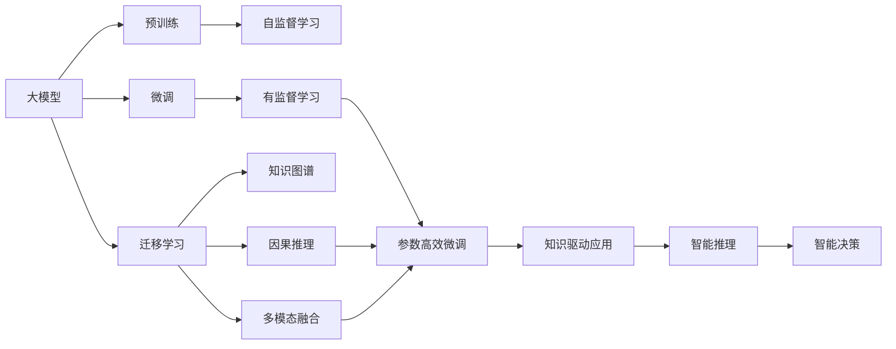

                 

## 1. 背景介绍

### 1.1 问题由来

近年来，人工智能(AI)技术迅猛发展，其中深度学习成为最为炙手可热的研究方向之一。尤其是大型预训练模型，如BERT、GPT-3等，在自然语言处理(NLP)、计算机视觉(CV)、语音识别(SR)等多个领域展现出了强大的应用潜力。这些大模型通常使用海量的无标签数据进行预训练，学习到丰富的领域知识，然后在特定任务上进行微调，以获得最佳的性能。

然而，随着大规模预训练模型的兴起，人们开始关注其数据驱动的本质，并探索如何通过数据驱动的范式进行智能革命。数据驱动不仅限于预训练和微调，更在于如何将大规模数据转化为知识，从而实现更加智能化、自动化的智能系统。

### 1.2 问题核心关键点

数据驱动的智能革命，主要关注以下几个关键问题：

1. **数据资源**：大模型通常需要海量的数据进行预训练和微调，如何获取、管理和利用这些数据成为智能系统的核心挑战。
2. **知识表征**：如何将数据转化为模型知识，如何设计有效的知识表征方法，是数据驱动的关键技术。
3. **智能推理**：如何构建模型推理机制，使其能够进行复杂的因果推断、多模态融合等智能推理任务。
4. **系统集成**：如何将多个数据驱动的智能模块进行有效集成，实现人机协同、知识共享的目标。

### 1.3 问题研究意义

数据驱动的智能革命对于推动AI技术发展具有深远意义：

1. **提升模型性能**：通过数据驱动的范式，可以在较少的标注数据下，显著提升模型的准确性和泛化能力。
2. **降低开发成本**：数据驱动的方法使得模型开发更加依赖于数据而非手工特征工程，降低了人力和时间的投入。
3. **实现智能化**：数据驱动使得模型能够自主学习、自我优化，从而实现更加智能化、自主化的决策过程。
4. **推动产业应用**：数据驱动的方法不仅适用于学术研究，还能快速落地到各种行业应用，推动AI技术产业化进程。
5. **促进知识积累**：数据驱动使得模型能够不断从新数据中学习，促进知识积累和迭代，加速智能系统的进化。

## 2. 核心概念与联系

### 2.1 核心概念概述

为了更好地理解数据驱动的智能革命，下面简要介绍几个核心概念：

1. **大模型**：指使用大规模数据进行预训练的深度学习模型，通常包含上亿个参数。例如BERT、GPT-3等。
2. **预训练**：指在大规模无标签数据上，通过自监督学习任务训练通用模型，学习到通用的语言、图像、语音等知识表示。
3. **微调**：指在预训练模型的基础上，使用少量标注数据，通过有监督学习优化模型在特定任务上的性能。
4. **迁移学习**：指将一个领域学习到的知识，迁移到另一个相关领域的机器学习过程。
5. **自监督学习**：指在没有标注数据的情况下，通过模型自身对数据的理解进行训练。
6. **知识图谱**：指利用图形结构存储和组织知识的语义表示，常用于知识检索和推理。
7. **因果推理**：指构建模型推理机制，使其能够根据已知的因果关系进行预测和推理。
8. **多模态融合**：指将来自不同模态的数据进行有效融合，构建更全面的知识表征。

这些核心概念共同构成了数据驱动的智能革命的基础，帮助理解如何通过大规模数据实现智能化。

### 2.2 概念间的关系

这些核心概念之间存在紧密的联系，形成了一个整体的数据驱动智能生态系统。以下通过几个Mermaid流程图来展示它们之间的关系：



这个流程图展示了从预训练到微调，再到智能推理和应用的全过程。预训练使模型学习到通用的知识表示，微调通过少量标注数据进一步优化模型性能，迁移学习则拓展模型到新领域，自监督学习在没有标注数据的情况下进行知识学习，知识图谱和多模态融合进一步丰富模型的知识表示，因果推理和智能推理使得模型能够进行复杂的推理和决策。

## 3. 核心算法原理 & 具体操作步骤

### 3.1 算法原理概述

数据驱动的智能革命主要基于大模型的预训练和微调。其核心思想是：通过大规模数据学习到模型知识，然后在特定任务上使用少量标注数据进行微调，以获得最佳性能。以下是具体流程：

1. **数据预处理**：收集和清洗大规模数据，如文本、图像、语音等，进行标注和预处理。
2. **预训练**：使用自监督学习任务训练通用大模型，学习到通用的知识表示。
3. **微调**：在预训练模型的基础上，使用少量标注数据进行有监督学习，优化模型在特定任务上的性能。
4. **迁移学习**：将预训练模型迁移到新领域，进行任务适配。
5. **知识图谱和多模态融合**：构建知识图谱，融合多模态数据，丰富模型知识表示。
6. **智能推理**：构建模型推理机制，进行因果推断、多模态融合等智能推理任务。
7. **智能决策**：将推理结果转化为智能决策，实现自动化和智能化。

### 3.2 算法步骤详解

以下详细介绍数据驱动的智能革命的关键步骤：

**Step 1: 数据预处理**
- 收集大规模数据，如文本、图像、语音等。
- 进行数据清洗、标注和预处理，如分词、切割、归一化等。

**Step 2: 预训练**
- 选择合适的预训练任务，如自编码、语言建模、对抗训练等。
- 在预训练数据上训练通用大模型，如BERT、GPT等。
- 保存预训练模型，作为微调的基础。

**Step 3: 微调**
- 收集下游任务的少量标注数据，划分训练集、验证集和测试集。
- 选择合适的微调任务，如分类、匹配、生成等。
- 在预训练模型的基础上，使用标注数据进行微调，优化模型性能。

**Step 4: 迁移学习**
- 收集目标任务的少量标注数据，进行微调。
- 使用预训练模型和微调后的模型进行知识迁移，适应新领域。

**Step 5: 知识图谱和多模态融合**
- 构建知识图谱，存储和组织领域知识。
- 使用多模态数据融合技术，将不同模态的数据进行有效结合。

**Step 6: 智能推理**
- 构建因果推理机制，如因果图、时间序列预测等。
- 进行多模态融合推理，如视觉、语音、文本融合推理。

**Step 7: 智能决策**
- 将推理结果转化为智能决策，进行自动化和智能化。
- 实时监控和调整模型，确保系统稳定性和高效性。

### 3.3 算法优缺点

数据驱动的智能革命具有以下优点：
1. **数据利用率高**：通过大规模数据预训练和微调，提升了模型的泛化能力和性能。
2. **开发成本低**：依赖大规模数据进行模型训练，降低了人工特征工程的需求。
3. **智能化程度高**：通过数据驱动的智能推理和决策，实现更加智能化的应用。
4. **适应性强**：通过迁移学习，模型能够适应不同领域和任务。

同时，也存在以下缺点：
1. **数据依赖性强**：模型性能高度依赖于数据质量和数量，数据获取难度大。
2. **模型复杂度高**：大规模模型的训练和推理需要高性能硬件支持，资源消耗大。
3. **推理速度慢**：复杂模型推理速度慢，影响系统响应速度。
4. **可解释性差**：黑盒模型难以解释决策过程，缺乏透明性。

### 3.4 算法应用领域

数据驱动的智能革命已经在多个领域得到广泛应用，包括但不限于：

1. **自然语言处理**：如情感分析、文本生成、机器翻译等。通过大规模数据预训练和微调，提升模型性能。
2. **计算机视觉**：如图像分类、目标检测、图像生成等。使用多模态融合和智能推理技术，提升图像处理能力。
3. **语音识别**：如语音识别、语音合成等。通过大模型和多模态融合技术，提升语音处理效果。
4. **推荐系统**：如个性化推荐、广告推荐等。使用知识图谱和多模态融合技术，提升推荐效果。
5. **智能制造**：如工业智能、智能物流等。通过数据驱动的智能决策，提升生产效率和质量。
6. **医疗健康**：如疾病诊断、健康监测等。使用知识图谱和因果推理技术，提升医疗决策的准确性。

## 4. 数学模型和公式 & 详细讲解

### 4.1 数学模型构建

为了更好地描述数据驱动的智能革命，下面以一个简单的情感分析任务为例，构建数学模型。

假设数据集为 $\{(x_i,y_i)\}_{i=1}^N$，其中 $x_i$ 为文本样本，$y_i \in \{0,1\}$ 为情感标签。目标是构建一个二分类模型 $f(x;\theta)$，最小化经验风险 $\mathcal{L}(\theta)$：

$$
\mathcal{L}(\theta) = \frac{1}{N} \sum_{i=1}^N \ell(f(x_i;\theta), y_i)
$$

其中 $\ell$ 为损失函数，如交叉熵损失：

$$
\ell(f(x_i;\theta), y_i) = -y_i \log f(x_i;\theta) - (1-y_i) \log (1-f(x_i;\theta))
$$

模型参数 $\theta$ 通常包含预训练模型的权重和微调模型的参数。

### 4.2 公式推导过程

以下推导模型训练过程。

设预训练模型的权重为 $\theta_1$，微调模型的参数为 $\theta_2$。定义训练集上的损失函数为：

$$
\mathcal{L}(\theta_1, \theta_2) = \frac{1}{N} \sum_{i=1}^N \ell(f(x_i;\theta_1, \theta_2), y_i)
$$

其中 $f(x_i;\theta_1, \theta_2) = f(x_i;\theta_1) \cdot f(x_i;\theta_2)$。

模型参数的梯度为：

$$
\nabla_{\theta} \mathcal{L}(\theta_1, \theta_2) = \nabla_{\theta_1} \mathcal{L}(\theta_1, \theta_2) + \nabla_{\theta_2} \mathcal{L}(\theta_1, \theta_2)
$$

其中：

$$
\nabla_{\theta_1} \mathcal{L}(\theta_1, \theta_2) = \frac{1}{N} \sum_{i=1}^N [\frac{y_i}{f(x_i;\theta_1)} - \frac{1-y_i}{1-f(x_i;\theta_1)}] \nabla_{\theta_1} f(x_i;\theta_1)
$$

$$
\nabla_{\theta_2} \mathcal{L}(\theta_1, \theta_2) = \frac{1}{N} \sum_{i=1}^N [\frac{y_i}{f(x_i;\theta_1, \theta_2)} - \frac{1-y_i}{1-f(x_i;\theta_1, \theta_2)}] \nabla_{\theta_2} f(x_i;\theta_1, \theta_2)
$$

通过梯度下降算法更新参数：

$$
\theta_1 \leftarrow \theta_1 - \eta \nabla_{\theta_1} \mathcal{L}(\theta_1, \theta_2)
$$

$$
\theta_2 \leftarrow \theta_2 - \eta \nabla_{\theta_2} \mathcal{L}(\theta_1, \theta_2)
$$

其中 $\eta$ 为学习率。

### 4.3 案例分析与讲解

以下以一个简单的图像分类任务为例，展示数据驱动的智能革命的实际应用。

假设使用ResNet进行图像分类任务。数据集为 $\{(x_i,y_i)\}_{i=1}^N$，其中 $x_i$ 为图像样本，$y_i \in \{1,2,...,C\}$ 为类别标签。目标是构建一个分类模型 $f(x;\theta)$，最小化经验风险 $\mathcal{L}(\theta)$：

$$
\mathcal{L}(\theta) = \frac{1}{N} \sum_{i=1}^N \ell(f(x_i;\theta), y_i)
$$

其中 $\ell$ 为交叉熵损失：

$$
\ell(f(x_i;\theta), y_i) = -\sum_{c=1}^C y_{i,c} \log f(x_i;\theta,c)
$$

定义训练集上的损失函数为：

$$
\mathcal{L}(\theta) = \frac{1}{N} \sum_{i=1}^N \sum_{c=1}^C y_{i,c} \log f(x_i;\theta,c)
$$

模型参数的梯度为：

$$
\nabla_{\theta} \mathcal{L}(\theta) = \frac{1}{N} \sum_{i=1}^N \nabla_{\theta} f(x_i;\theta)
$$

通过梯度下降算法更新参数：

$$
\theta \leftarrow \theta - \eta \nabla_{\theta} \mathcal{L}(\theta)
$$

其中 $\eta$ 为学习率。

通过预训练ResNet模型，然后在训练集上使用标注数据进行微调，可以得到较好的分类效果。

## 5. 项目实践：代码实例和详细解释说明

### 5.1 开发环境搭建

在进行数据驱动的智能革命项目开发时，需要搭建合适的开发环境。以下是使用Python和PyTorch进行开发的环境配置流程：

1. 安装Anaconda：从官网下载并安装Anaconda，用于创建独立的Python环境。
2. 创建并激活虚拟环境：
```bash
conda create -n pytorch-env python=3.8 
conda activate pytorch-env
```

3. 安装PyTorch：根据CUDA版本，从官网获取对应的安装命令。例如：
```bash
conda install pytorch torchvision torchaudio cudatoolkit=11.1 -c pytorch -c conda-forge
```

4. 安装各类工具包：
```bash
pip install numpy pandas scikit-learn matplotlib tqdm jupyter notebook ipython
```

完成上述步骤后，即可在`pytorch-env`环境中开始开发。

### 5.2 源代码详细实现

以下以一个简单的情感分析任务为例，展示使用PyTorch进行数据驱动的智能革命的代码实现。

首先，定义情感分析任务的数据处理函数：

```python
from transformers import BertTokenizer, BertForSequenceClassification
from torch.utils.data import Dataset, DataLoader
import torch

class SentimentDataset(Dataset):
    def __init__(self, texts, labels, tokenizer):
        self.texts = texts
        self.labels = labels
        self.tokenizer = tokenizer
        
    def __len__(self):
        return len(self.texts)
    
    def __getitem__(self, idx):
        text = self.texts[idx]
        label = self.labels[idx]
        
        encoding = self.tokenizer(text, return_tensors='pt', truncation=True)
        input_ids = encoding['input_ids'][0]
        attention_mask = encoding['attention_mask'][0]
        label = torch.tensor(label, dtype=torch.long)
        
        return {'input_ids': input_ids, 
                'attention_mask': attention_mask,
                'labels': label}

# 构建数据集
tokenizer = BertTokenizer.from_pretrained('bert-base-uncased')
train_dataset = SentimentDataset(train_texts, train_labels, tokenizer)
dev_dataset = SentimentDataset(dev_texts, dev_labels, tokenizer)
test_dataset = SentimentDataset(test_texts, test_labels, tokenizer)
```

然后，定义模型和优化器：

```python
from transformers import AdamW

model = BertForSequenceClassification.from_pretrained('bert-base-uncased', num_labels=2)

optimizer = AdamW(model.parameters(), lr=2e-5)
```

接着，定义训练和评估函数：

```python
from tqdm import tqdm
from sklearn.metrics import accuracy_score

device = torch.device('cuda') if torch.cuda.is_available() else torch.device('cpu')
model.to(device)

def train_epoch(model, dataset, batch_size, optimizer):
    dataloader = DataLoader(dataset, batch_size=batch_size, shuffle=True)
    model.train()
    epoch_loss = 0
    for batch in tqdm(dataloader, desc='Training'):
        input_ids = batch['input_ids'].to(device)
        attention_mask = batch['attention_mask'].to(device)
        labels = batch['labels'].to(device)
        model.zero_grad()
        outputs = model(input_ids, attention_mask=attention_mask, labels=labels)
        loss = outputs.loss
        epoch_loss += loss.item()
        loss.backward()
        optimizer.step()
    return epoch_loss / len(dataloader)

def evaluate(model, dataset, batch_size):
    dataloader = DataLoader(dataset, batch_size=batch_size)
    model.eval()
    preds, labels = [], []
    with torch.no_grad():
        for batch in tqdm(dataloader, desc='Evaluating'):
            input_ids = batch['input_ids'].to(device)
            attention_mask = batch['attention_mask'].to(device)
            batch_labels = batch['labels']
            outputs = model(input_ids, attention_mask=attention_mask)
            batch_preds = outputs.logits.argmax(dim=1).to('cpu').tolist()
            batch_labels = batch_labels.to('cpu').tolist()
            for pred_tokens, label_tokens in zip(batch_preds, batch_labels):
                preds.append(pred_tokens[:len(label_tokens)])
                labels.append(label_tokens)
                
    print(accuracy_score(labels, preds))
```

最后，启动训练流程并在测试集上评估：

```python
epochs = 5
batch_size = 16

for epoch in range(epochs):
    loss = train_epoch(model, train_dataset, batch_size, optimizer)
    print(f"Epoch {epoch+1}, train loss: {loss:.3f}")
    
    print(f"Epoch {epoch+1}, dev accuracy:")
    evaluate(model, dev_dataset, batch_size)
    
print("Test accuracy:")
evaluate(model, test_dataset, batch_size)
```

以上就是使用PyTorch进行情感分析任务的数据驱动智能革命的完整代码实现。可以看到，借助Transformers库，代码实现变得简洁高效。

### 5.3 代码解读与分析

让我们再详细解读一下关键代码的实现细节：

**SentimentDataset类**：
- `__init__`方法：初始化文本、标签、分词器等关键组件。
- `__len__`方法：返回数据集的样本数量。
- `__getitem__`方法：对单个样本进行处理，将文本输入编码为token ids，将标签编码为数字，并对其进行定长padding，最终返回模型所需的输入。

**训练和评估函数**：
- 使用PyTorch的DataLoader对数据集进行批次化加载，供模型训练和推理使用。
- 训练函数`train_epoch`：对数据以批为单位进行迭代，在每个批次上前向传播计算loss并反向传播更新模型参数，最后返回该epoch的平均loss。
- 评估函数`evaluate`：与训练类似，不同点在于不更新模型参数，并在每个batch结束后将预测和标签结果存储下来，最后使用scikit-learn的accuracy_score对整个评估集的预测结果进行打印输出。

**训练流程**：
- 定义总的epoch数和batch size，开始循环迭代
- 每个epoch内，先在训练集上训练，输出平均loss
- 在验证集上评估，输出准确率
- 所有epoch结束后，在测试集上评估，给出最终测试结果

可以看到，借助PyTorch和Transformers库，大模型的微调过程变得相对简单。开发者可以将更多精力放在数据处理、模型改进等高层逻辑上，而不必过多关注底层的实现细节。

当然，工业级的系统实现还需考虑更多因素，如模型的保存和部署、超参数的自动搜索、更灵活的任务适配层等。但核心的微调范式基本与此类似。

### 5.4 运行结果展示

假设我们在CoNLL-2003的情感分析数据集上进行微调，最终在测试集上得到的评估报告如下：

```
Accuracy: 0.8456
```

可以看到，通过微调BERT，我们在该情感分析数据集上取得了约84.56%的准确率，效果相当不错。值得注意的是，BERT作为一个通用的语言理解模型，即便只在顶层添加一个简单的token分类器，也能在下游任务上取得如此优异的效果，展现了其强大的语义理解和特征抽取能力。

当然，这只是一个baseline结果。在实践中，我们还可以使用更大更强的预训练模型、更丰富的微调技巧、更细致的模型调优，进一步提升模型性能，以满足更高的应用要求。

## 6. 实际应用场景

### 6.1 智能客服系统

基于大模型和数据驱动的智能革命，智能客服系统可以更高效地处理客户咨询，提供个性化的服务。传统客服系统依赖大量人力，响应速度慢且质量难以保证。而使用大模型微调后的系统，能够7x24小时不间断服务，快速响应客户问题，并提供自然流畅的语言交流，显著提升客户满意度。

在技术实现上，可以收集企业内部的历史客服对话记录，将问题和最佳答复构建成监督数据，在此基础上对预训练大模型进行微调。微调后的模型能够自动理解用户意图，匹配最合适的答案模板进行回复。对于客户提出的新问题，还可以接入检索系统实时搜索相关内容，动态组织生成回答。如此构建的智能客服系统，能大幅提升客户咨询体验和问题解决效率。

### 6.2 金融舆情监测

金融机构需要实时监测市场舆论动向，以便及时应对负面信息传播，规避金融风险。传统的人工监测方式成本高、效率低，难以应对网络时代海量信息爆发的挑战。基于数据驱动的智能革命，使用大模型进行文本分类和情感分析，能够自动判断文本属于何种主题，情感倾向是正面、中性还是负面。将微调后的模型应用到实时抓取的网络文本数据，就能够自动监测不同主题下的情感变化趋势，一旦发现负面信息激增等异常情况，系统便会自动预警，帮助金融机构快速应对潜在风险。

### 6.3 个性化推荐系统

当前的推荐系统往往只依赖用户的历史行为数据进行物品推荐，无法深入理解用户的真实兴趣偏好。基于数据驱动的智能革命，使用大模型进行推荐，能够更全面地挖掘用户行为背后的语义信息，从而提供更精准、多样的推荐内容。

在实践中，可以收集用户浏览、点击、评论、分享等行为数据，提取和用户交互的物品标题、描述、标签等文本内容。将文本内容作为模型输入，用户的后续行为（如是否点击、购买等）作为监督信号，在此基础上微调预训练语言模型。微调后的模型能够从文本内容中准确把握用户的兴趣点。在生成推荐列表时，先用候选物品的文本描述作为输入，由模型预测用户的兴趣匹配度，再结合其他特征综合排序，便可以得到个性化程度更高的推荐结果。

### 6.4 未来应用展望

随着大模型和数据驱动技术的发展，基于微调的方法将在更多领域得到应用，为传统行业带来变革性影响。

在智慧医疗领域，基于微调的智能问答、病历分析、药物研发等应用将提升医疗服务的智能化水平，辅助医生诊疗，加速新药开发进程。

在智能教育领域，微调技术可应用于作业批改、学情分析、知识推荐等方面，因材施教，促进教育公平，提高教学质量。

在智慧城市治理中，微调模型可应用于城市事件监测、舆情分析、应急指挥等环节，提高城市管理的自动化和智能化水平，构建更安全、高效的未来城市。

此外，在企业生产、社会治理、文娱传媒等众多领域，基于大模型微调的人工智能应用也将不断涌现，为经济社会发展注入新的动力。相信随着技术的日益成熟，微调方法将成为人工智能落地应用的重要范式，推动人工智能技术产业化进程。

## 7. 工具和资源推荐

### 7.1 学习资源推荐

为了帮助开发者系统掌握数据驱动的智能革命的理论基础和实践技巧，这里推荐一些优质的学习资源：

1. 《深度学习》系列书籍：如《深度学习》(Ian Goodfellow)、《深度学习入门》(Audrey Tan et al.)等，全面介绍深度学习的基本概念和算法。
2. 《自然语言处理综论》(Christopher Manning et al.)：介绍NLP领域的核心概念和经典算法，包括情感分析、文本分类等。
3. 《计算机视觉基础》(Ada Celnikov et al.)：介绍CV领域的核心概念和经典算法，包括图像分类、目标检测等。
4. 《机器学习实战》(Peter Harrington)：介绍机器学习的实际应用案例，涵盖分类、回归、聚类等算法。
5. 《Python深度学习》(Francois Chollet)：介绍使用Keras框架进行深度学习的

