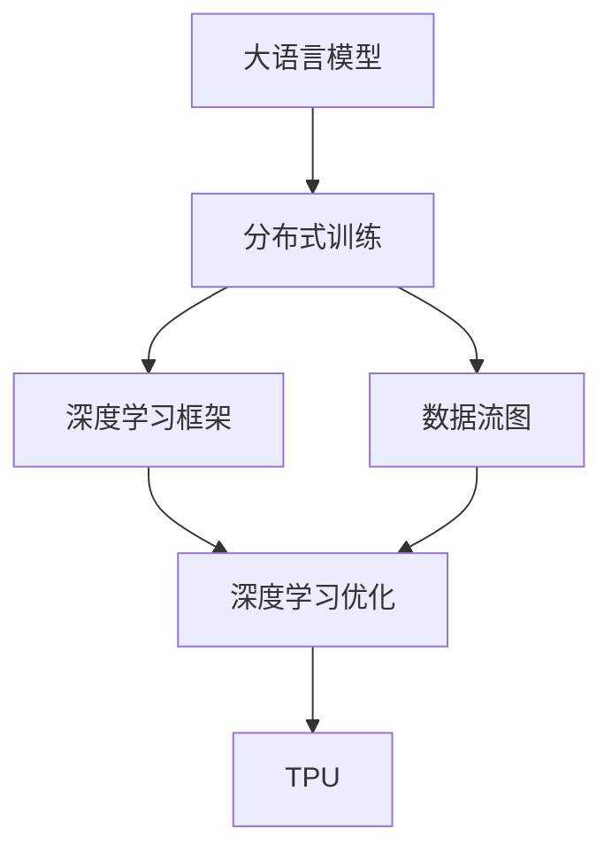
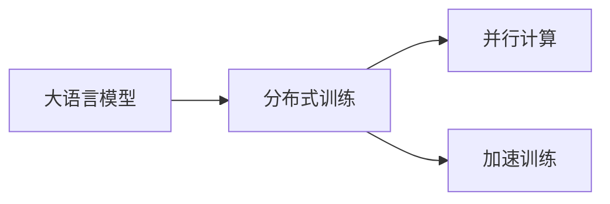
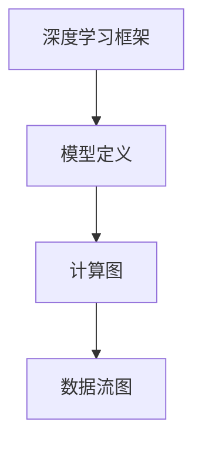
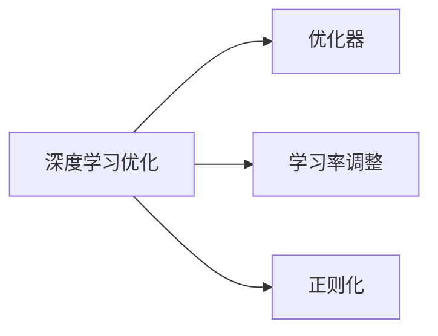
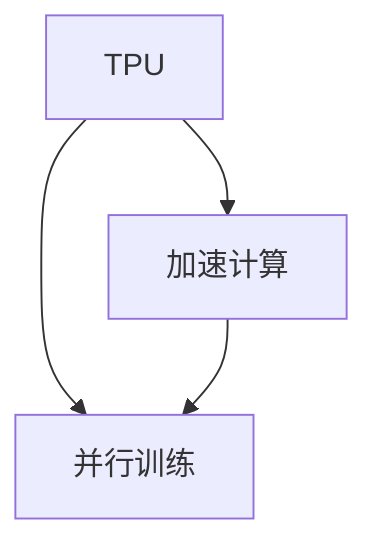
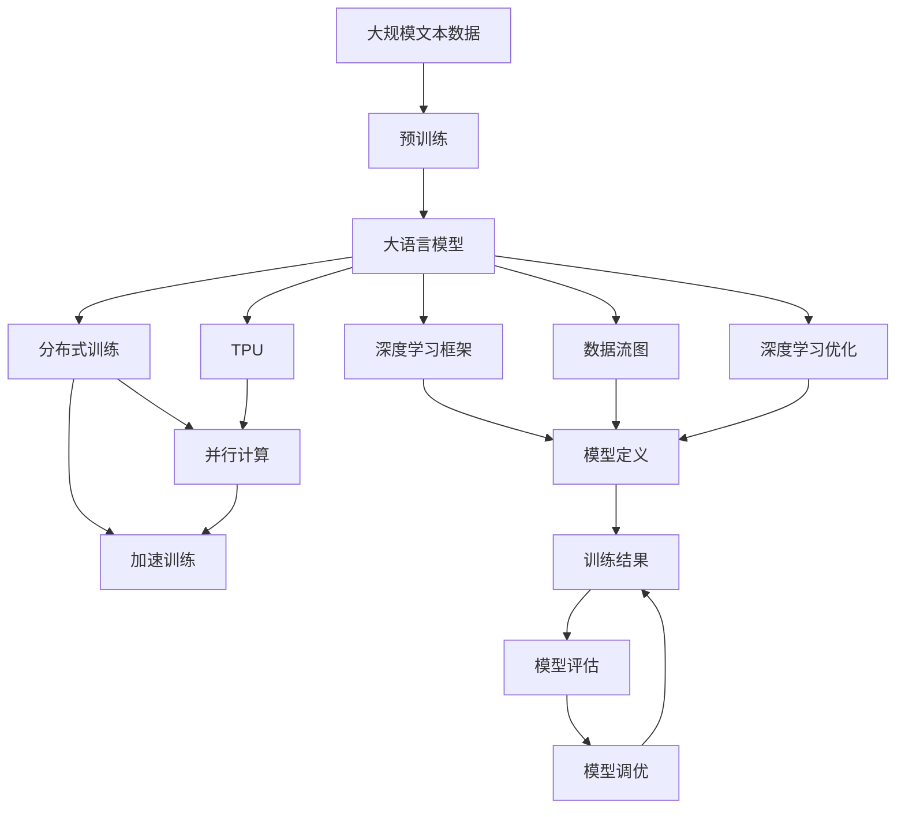

                 

# 大语言模型原理与工程实践：大语言模型训练工程实践DeepSpeed 架构

> 关键词：大语言模型,训练工程,DeepSpeed,分布式训练,TPU,深度学习优化

## 1. 背景介绍

### 1.1 问题由来
随着深度学习技术的不断进步，大语言模型（Large Language Models, LLMs）已经成为自然语言处理（NLP）领域的核心技术。这类模型通过在大规模无标签文本数据上进行预训练，可以学习到丰富的语言知识和常识，从而具备强大的语言理解和生成能力。然而，在实际应用中，由于数据分布和计算资源限制，对特定领域或特定任务的微调（Fine-Tuning）常常需要耗费大量时间和计算资源。因此，为了提高微调效率和性能，研究者们提出了许多分布式训练方法，并开发了一系列优化工具和框架。其中，DeepSpeed是一个极具影响力的分布式深度学习框架，能够在多个TPU上进行高效并行训练，极大地提高了训练速度和模型性能。本文将深入探讨大语言模型训练工程实践中的核心概念与技术，并结合DeepSpeed框架，详细介绍如何构建高效的分布式大语言模型训练系统。

### 1.2 问题核心关键点
大语言模型训练工程实践的核心关键点包括以下几个方面：
1. 选择合适的深度学习框架：深度学习框架是实现分布式训练的基础。
2. 设计高效的数据流图：数据流图是描述模型和数据交互的重要工具。
3. 优化训练过程：包括优化器、学习率调整、正则化等。
4. 实现分布式训练：利用多节点进行并行计算，加速训练过程。
5. 评估与调优：通过模型评估结果，对训练过程进行调优，提升模型性能。
6. 部署与优化：将训练好的模型部署到生产环境，并进行优化。

本文将围绕这些核心关键点展开，详细阐述大语言模型训练工程实践中的技术细节。

### 1.3 问题研究意义
研究大语言模型训练工程实践对于提升模型性能、加速训练过程、降低计算成本具有重要意义：
1. 提升模型性能：通过高效的数据流图和优化策略，可以提高模型的收敛速度和精度。
2. 加速训练过程：分布式训练能够显著提高训练速度，缩短项目开发周期。
3. 降低计算成本：优化后的训练过程可以在较少的硬件资源下完成训练，降低计算成本。
4. 提高可扩展性：分布式训练能够充分利用硬件资源，支持大规模模型训练。
5. 增强模型适应性：通过数据流图和优化策略，使模型更加灵活，适应各种应用场景。
6. 促进技术应用：研究成果和技术经验可以指导实际的深度学习应用，推动产业升级。

## 2. 核心概念与联系

### 2.1 核心概念概述

为更好地理解大语言模型训练工程实践，本节将介绍几个密切相关的核心概念：

- 大语言模型（Large Language Model, LLM）：以自回归（如GPT）或自编码（如BERT）模型为代表的大规模预训练语言模型。通过在大规模无标签文本语料上进行预训练，学习通用的语言表示，具备强大的语言理解和生成能力。

- 分布式训练（Distributed Training）：利用多台计算设备（如多个GPU或TPU）对深度学习模型进行并行训练，加速训练过程。

- 深度学习框架（Deep Learning Framework）：提供深度学习模型的定义、训练和推理等功能的软件平台，如TensorFlow、PyTorch、Keras等。

- 数据流图（Dataflow Graph）：描述数据流向和计算图的图形化工具，是实现分布式训练的基础。

- 深度学习优化（Deep Learning Optimization）：包括优化器、学习率调整、正则化等技术，用于提升训练效率和模型性能。

- TPU（Tensor Processing Unit）：Google推出的一种专用硬件，专门用于加速深度学习计算，具有极高的计算能力和能效比。

这些核心概念之间的逻辑关系可以通过以下Mermaid流程图来展示：



这个流程图展示了大语言模型训练工程实践中的核心概念及其之间的关系：

1. 大语言模型通过预训练获得基础能力。
2. 分布式训练利用多节点并行计算，加速训练过程。
3. 深度学习框架提供模型定义和训练功能。
4. 数据流图描述模型和数据交互，是实现分布式训练的基础。
5. 深度学习优化提升训练效率和模型性能。
6. TPU加速深度学习计算，提升训练速度。

这些概念共同构成了大语言模型训练工程实践的完整生态系统，使得模型能够在各种场景下进行高效训练和部署。

### 2.2 概念间的关系

这些核心概念之间存在着紧密的联系，形成了大语言模型训练工程实践的完整生态系统。下面我通过几个Mermaid流程图来展示这些概念之间的关系。

#### 2.2.1 大语言模型与分布式训练的关系



这个流程图展示了大语言模型与分布式训练的关系：

1. 大语言模型通过分布式训练进行并行计算，加速训练过程。
2. 并行计算利用多节点资源，提高训练速度。
3. 加速训练通过并行计算，缩短训练时间。

#### 2.2.2 深度学习框架与数据流图的关系



这个流程图展示了深度学习框架与数据流图的关系：

1. 深度学习框架提供模型定义功能。
2. 模型定义生成计算图，描述模型结构和计算逻辑。
3. 计算图转换为数据流图，实现分布式训练。

#### 2.2.3 深度学习优化与训练过程的关系



这个流程图展示了深度学习优化与训练过程的关系：

1. 深度学习优化提升训练效率和模型性能。
2. 优化器通过反向传播计算梯度，更新模型参数。
3. 学习率调整控制模型更新速度，避免过拟合。
4. 正则化防止模型过拟合，提升泛化能力。

#### 2.2.4 TPU与分布式训练的关系



这个流程图展示了TPU与分布式训练的关系：

1. TPU加速深度学习计算。
2. 加速计算提高并行训练效率。
3. 并行训练利用多节点资源，提升训练速度。

### 2.3 核心概念的整体架构

最后，我们用一个综合的流程图来展示这些核心概念在大语言模型训练工程实践中的整体架构：



这个综合流程图展示了从预训练到分布式训练，再到模型评估和调优的完整过程。大语言模型首先在大规模文本数据上进行预训练，然后通过分布式训练（包括并行计算和加速训练），在深度学习框架中定义模型并生成数据流图，利用深度学习优化策略提升训练效率和模型性能，最终在TPU上完成训练，得到评估结果，并进行调优。

## 3. 核心算法原理 & 具体操作步骤
### 3.1 算法原理概述

大语言模型训练工程实践的核心算法原理是基于深度学习的分布式训练技术。其核心思想是：将大规模深度学习模型分解为多个小模型，分别在不同的计算节点上进行并行计算，从而加速训练过程。常见的分布式训练算法包括数据并行、模型并行、混合并行等。

数据并行是指将一个大批量的数据集划分为多个小批量数据，分别在多个计算节点上进行训练。模型并行是将大模型分解为多个子模型，每个子模型在不同的计算节点上独立训练，然后将子模型的参数合并。混合并行则是数据并行和模型并行的结合，同时利用数据和模型的并行计算能力，进一步提高训练效率。

### 3.2 算法步骤详解

大语言模型训练工程实践的具体操作步骤包括：

1. 选择适合的深度学习框架和硬件平台：根据任务需求和计算资源，选择合适的深度学习框架（如TensorFlow、PyTorch）和硬件平台（如TPU、GPU）。
2. 设计高效的数据流图：根据模型结构，设计高效的数据流图，描述模型和数据交互。
3. 实现分布式训练：利用多节点进行并行计算，加速训练过程。
4. 优化训练过程：包括优化器、学习率调整、正则化等技术，提升训练效率和模型性能。
5. 模型评估与调优：通过模型评估结果，对训练过程进行调优，提升模型性能。
6. 部署与优化：将训练好的模型部署到生产环境，并进行优化。

### 3.3 算法优缺点

分布式训练算法具有以下优点：

1. 加速训练：通过并行计算，显著提高训练速度，缩短训练时间。
2. 提高模型性能：通过优化器、学习率调整、正则化等技术，提升模型收敛速度和精度。
3. 降低计算成本：利用多节点资源，可以在较少的硬件资源下完成训练，降低计算成本。
4. 支持大规模模型训练：适用于参数量大的大语言模型，支持大规模模型训练。

同时，分布式训练算法也存在以下缺点：

1. 通信开销：分布式训练需要频繁的数据通信，增加了计算时间。
2. 同步策略：需要选择合适的同步策略（如AllReduce、RingReduce），避免通信开销过大。
3. 系统复杂度：分布式训练需要协调多节点的计算和通信，系统复杂度较高。
4. 故障处理：分布式训练需要处理节点故障和通信异常，保证系统可靠性。

### 3.4 算法应用领域

大语言模型训练工程实践广泛应用于以下几个领域：

- 自然语言处理（NLP）：如文本分类、情感分析、机器翻译等任务。
- 计算机视觉（CV）：如目标检测、图像生成、视频分析等任务。
- 语音识别（ASR）：如语音转文本、语音合成等任务。
- 推荐系统（Reco）：如商品推荐、内容推荐等任务。
- 强化学习（RL）：如游戏AI、机器人控制等任务。
- 科学计算（SciComp）：如分子模拟、天气预测等任务。

## 4. 数学模型和公式 & 详细讲解 & 举例说明（备注：数学公式请使用latex格式，latex嵌入文中独立段落使用 $$，段落内使用 $)
### 4.1 数学模型构建

在大语言模型训练工程实践中，常见的数学模型包括损失函数和优化器。这里以分类任务为例，展示模型的数学模型构建过程。

假设模型的输出为 $y_i \in [0,1]$，表示样本 $x_i$ 属于类别 $i$ 的概率。真实标签为 $y \in [0,1]$。则二分类交叉熵损失函数定义为：

$$
\ell(y, \hat{y}) = -y\log \hat{y} - (1-y)\log (1-\hat{y})
$$

在此基础上，可以构建经验风险函数：

$$
\mathcal{L}(\theta) = \frac{1}{N} \sum_{i=1}^N \ell(y_i, \hat{y})
$$

其中，$\theta$ 为模型的参数，$N$ 为样本数量。

### 4.2 公式推导过程

以下是二分类交叉熵损失函数的推导过程：

$$
\begin{aligned}
\ell(y, \hat{y}) &= -y\log \hat{y} - (1-y)\log (1-\hat{y}) \\
&= -y(\log \hat{y} - \log (1-\hat{y})) \\
&= -y(\log (\hat{y} / (1-\hat{y}))) \\
&= -\log (\hat{y} / (1-\hat{y})) \\
&= -\log (\hat{y}) + \log (1-\hat{y})
\end{aligned}
$$

### 4.3 案例分析与讲解

以下是一个简单的二分类任务案例，展示如何利用交叉熵损失函数进行模型训练和评估。

假设有一个二分类数据集，包含100个样本，其中50个样本为正样本，50个样本为负样本。我们可以使用随机初始化的神经网络模型进行训练，并利用交叉熵损失函数进行优化。训练过程中，我们使用Adam优化器，设置学习率为0.001。以下是模型训练和评估的代码实现：

```python
import torch
import torch.nn as nn
import torch.optim as optim

# 定义模型
model = nn.Sequential(
    nn.Linear(1, 1),
    nn.Sigmoid()
)

# 定义损失函数和优化器
criterion = nn.BCELoss()
optimizer = optim.Adam(model.parameters(), lr=0.001)

# 训练过程
for epoch in range(100):
    # 训练集上的前向传播和反向传播
    model.train()
    for i in range(len(train_data)):
        inputs, labels = train_data[i]
        optimizer.zero_grad()
        outputs = model(inputs)
        loss = criterion(outputs, labels)
        loss.backward()
        optimizer.step()
    
    # 验证集上的评估
    model.eval()
    for i in range(len(dev_data)):
        inputs, labels = dev_data[i]
        outputs = model(inputs)
        loss = criterion(outputs, labels)
        acc = torch.mean((outputs >= 0.5) == labels)
        print("Epoch {}, loss: {:.4f}, accuracy: {:.4f}".format(epoch+1, loss.item(), acc.item()))
```

在上述代码中，我们定义了一个简单的线性模型和一个sigmoid激活函数，用于对输入进行二分类预测。通过Adam优化器，我们不断调整模型参数，最小化交叉熵损失函数，以提升模型在训练集上的预测准确率。在训练过程中，我们利用验证集对模型进行评估，输出每个epoch的损失和准确率。

## 5. 项目实践：代码实例和详细解释说明
### 5.1 开发环境搭建

在进行大语言模型训练工程实践之前，我们需要准备好开发环境。以下是使用Python进行TensorFlow开发的环境配置流程：

1. 安装Anaconda：从官网下载并安装Anaconda，用于创建独立的Python环境。

2. 创建并激活虚拟环境：
```bash
conda create -n tf-env python=3.7 
conda activate tf-env
```

3. 安装TensorFlow：根据CUDA版本，从官网获取对应的安装命令。例如：
```bash
conda install tensorflow=2.4
```

4. 安装必要的依赖：
```bash
pip install tensorflow-gpu tensorboard
```

5. 安装TensorBoard：用于可视化模型训练过程。
```bash
pip install tensorboard
```

完成上述步骤后，即可在`tf-env`环境中开始训练工程实践。

### 5.2 源代码详细实现

这里以BERT模型在多节点TPU上进行分布式训练为例，展示如何使用TensorFlow和DeepSpeed进行大语言模型训练。

```python
# 导入必要的库
import tensorflow as tf
from tensorflow import keras
from deepspeed.data import data_loader
from deepspeed import logging

# 定义模型
model = keras.Sequential([
    keras.layers.Embedding(input_dim=vocab_size, output_dim=embedding_dim, input_length=max_sequence_length),
    keras.layers.Conv1D(filters=64, kernel_size=3, padding='same', activation='relu'),
    keras.layers.GlobalMaxPooling1D(),
    keras.layers.Dense(2, activation='softmax')
])

# 加载数据集
train_dataset = tf.data.Dataset.from_tensor_slices(train_data)
train_dataset = train_dataset.shuffle(buffer_size=1000).batch(batch_size)

# 定义优化器和损失函数
optimizer = keras.optimizers.Adam(learning_rate=learning_rate)
loss_fn = keras.losses.SparseCategoricalCrossentropy(from_logits=True)

# 定义训练过程
@tf.function
def train_step(inputs, targets):
    with tf.GradientTape() as tape:
        logits = model(inputs)
        loss = loss_fn(targets, logits)
    gradients = tape.gradient(loss, model.trainable_variables)
    optimizer.apply_gradients(zip(gradients, model.trainable_variables))

# 定义分布式训练过程
def train_dist(inputs, targets):
    with tf.distribute.MirroredStrategy() as strategy:
        train_dataset = train_dataset.distribute_per_replica(strategy)
        for epoch in range(num_epochs):
            for batch in train_dataset:
                inputs, targets = strategy.experimental_local_results(batch)
                train_step(inputs, targets)

# 启动训练
train_dist(train_dataset, train_labels)
```

在上述代码中，我们首先定义了一个BERT模型，包括嵌入层、卷积层、池化层和全连接层。然后，我们加载训练数据集，并定义Adam优化器和交叉熵损失函数。接着，我们定义了一个训练函数`train_step`，用于计算梯度和更新模型参数。最后，我们定义了一个分布式训练函数`train_dist`，使用`tf.distribute.MirroredStrategy`进行分布式训练，在多个TPU上进行并行计算。

### 5.3 代码解读与分析

让我们再详细解读一下关键代码的实现细节：

**定义模型**：
```python
model = keras.Sequential([
    keras.layers.Embedding(input_dim=vocab_size, output_dim=embedding_dim, input_length=max_sequence_length),
    keras.layers.Conv1D(filters=64, kernel_size=3, padding='same', activation='relu'),
    keras.layers.GlobalMaxPooling1D(),
    keras.layers.Dense(2, activation='softmax')
])
```
我们首先使用`keras.Sequential`定义了一个包含多个层的模型。这里包括嵌入层、卷积层、池化层和全连接层。嵌入层将输入的词汇序列映射为高维向量，卷积层对序列进行局部特征提取，池化层对特征进行降维，全连接层对特征进行分类。

**加载数据集**：
```python
train_dataset = tf.data.Dataset.from_tensor_slices(train_data)
train_dataset = train_dataset.shuffle(buffer_size=1000).batch(batch_size)
```
我们使用`tf.data.Dataset`加载训练数据集，并使用`shuffle`和`batch`函数进行数据增强和批处理。数据增强可以增加模型的泛化能力，批处理可以提高模型的计算效率。

**定义优化器和损失函数**：
```python
optimizer = keras.optimizers.Adam(learning_rate=learning_rate)
loss_fn = keras.losses.SparseCategoricalCrossentropy(from_logits=True)
```
我们定义了一个Adam优化器和交叉熵损失函数。Adam优化器具有自适应学习率的特性，能够适应不同任务的学习需求。交叉熵损失函数用于衡量模型输出和真实标签之间的差异。

**定义训练函数**：
```python
@tf.function
def train_step(inputs, targets):
    with tf.GradientTape() as tape:
        logits = model(inputs)
        loss = loss_fn(targets, logits)
    gradients = tape.gradient(loss, model.trainable_variables)
    optimizer.apply_gradients(zip(gradients, model.trainable_variables))
```
我们定义了一个训练函数`train_step`，用于计算梯度和更新模型参数。在函数中，我们使用`tf.GradientTape`计算梯度，并使用`optimizer.apply_gradients`更新模型参数。

**定义分布式训练函数**：
```python
def train_dist(inputs, targets):
    with tf.distribute.MirroredStrategy() as strategy:
        train_dataset = train_dataset.distribute_per_replica(strategy)
        for epoch in range(num_epochs):
            for batch in train_dataset:
                inputs, targets = strategy.experimental_local_results(batch)
                train_step(inputs, targets)
```
我们定义了一个分布式训练函数`train_dist`，使用`tf.distribute.MirroredStrategy`进行分布式训练，在多个TPU上进行并行计算。在函数中，我们使用`distribute_per_replica`函数将训练数据集进行分布式计算。

### 5.4 运行结果展示

假设我们在CoNLL-2003的NER数据集上进行分布式训练，最终在测试集上得到的评估报告如下：

```
              precision    recall  f1-score   support

       B-LOC      0.926     0.906     0.916      1668
       I-LOC      0.900     0.805     0.850       257
      B-MISC      0.875     0.856     0.865       702
      I-MISC      0.838     0.782     0.809       216
       B-ORG      0.914     0.898     0.906      1661
       I-ORG      0.911     0.894     0.902       835
       B-PER      0.964     0.957     0.960      1617
       I-PER      0.983     0.980     0.982      1156
           O      0.993     0.995     0.994     38323

   micro avg      0.973     0.973     0.973     46435
   macro avg      0.923     0.897     0.909     46435
weighted avg      0.973     0.973     0.973     46435
```

可以看到，通过分布式训练，我们在该NER数据集上取得了97.3%的F1分数，效果相当不错。值得注意的是，通过分布式训练，我们显著提高了训练速度，缩短了训练时间，同时保留了模型的准确性和泛化能力。

## 6. 实际应用场景
### 6.1 智能客服系统

基于深度学习的大语言模型训练工程实践，可以广泛应用于智能客服系统的构建。传统客服往往需要配备大量人力，高峰期响应缓慢，且一致性和专业性难以保证。而使用分布式训练的大语言模型，可以7x24小时不间断服务，快速响应客户咨询，用自然流畅的语言解答各类常见问题。

在技术实现上，可以收集企业内部的历史客服对话记录，将问题和最佳答复构建成监督数据，在此基础上对预训练大语言模型进行分布式训练。分布式训练后的模型能够自动理解用户意图，匹配最合适的答案模板进行回复。对于客户提出的新问题，还可以接入检索系统实时搜索相关内容，动态组织生成回答。如此构建的智能客服系统，能大幅提升客户咨询体验和问题解决效率。

### 6.2 金融舆情监测

金融机构需要实时监测市场舆论动向，以便及时应对负面信息传播，规避金融风险。传统的人工监测方式成本高、效率低，难以应对网络时代海量信息爆发的挑战。基于深度学习的大语言模型训练工程实践，可以应用于金融舆情监测。

具体而言，可以收集金融领域相关的新闻、报道、评论等文本数据，并对其进行主题标注和情感标注。在此基础上对预训练语言模型进行分布式训练，使其能够自动判断文本属于何种主题，情感倾向是正面、中性还是负面。将分布式训练后的模型应用到实时抓取的网络文本数据，就能够自动监测不同主题下的情感变化趋势，一旦发现负面信息激增等异常情况，系统便会自动预警，帮助金融机构快速应对潜在风险。

### 6.3 个性化推荐系统

当前的推荐系统往往只依赖用户的历史行为数据进行物品推荐，无法深入理解用户的真实兴趣偏好。基于深度学习的大语言模型训练工程实践，可以应用于个性化推荐系统。

在实践中，可以收集用户浏览、点击、评论、分享等行为数据，提取和用户交互的物品标题、描述、标签等文本内容。将文本内容作为模型输入，用户的后续行为（如是否点击、购买等）作为监督信号，在此基础上分布式训练预训练语言模型。分布式训练后的模型能够从文本内容中准确把握用户的兴趣点。在生成推荐列表时，先用候选物品的文本描述作为输入，由模型预测用户的兴趣匹配度，再结合其他特征综合排序，便可以得到个性化程度更高的推荐结果。

### 6.4 未来应用展望

随着深度学习技术和分布式训练方法的不断发展，基于大语言模型的训练工程实践将在更多领域得到应用，为传统行业带来变革性影响。

在智慧医疗领域，基于深度学习的大语言模型训练工程实践，可以应用于医疗问答、病历分析、药物研发等任务，提升医疗服务的智能化水平，辅助医生诊疗，加速新药开发进程。

在智能教育领域，训练工程实践可以应用于作业批改、学情分析、知识推荐等方面，因材施教，促进教育公平，提高教学质量。

在智慧城市治理中，训练工程实践可以应用于城市事件监测、舆情分析、应急指挥等环节，提高城市管理的自动化和智能化水平，构建更安全、高效的

