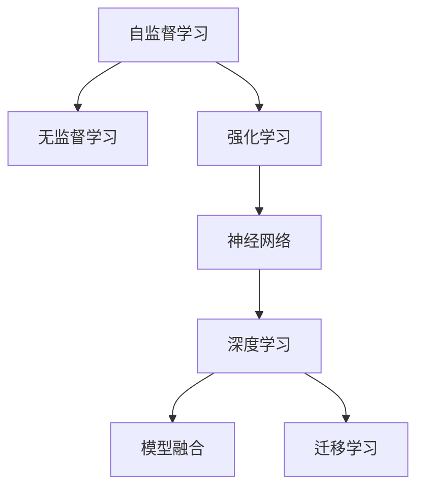
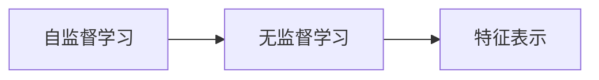
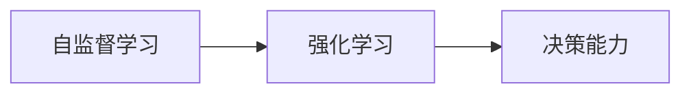
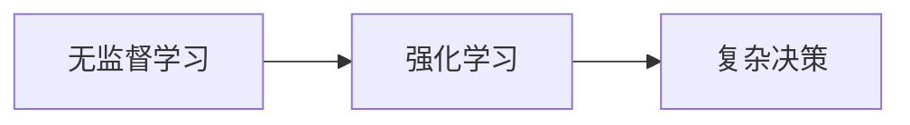
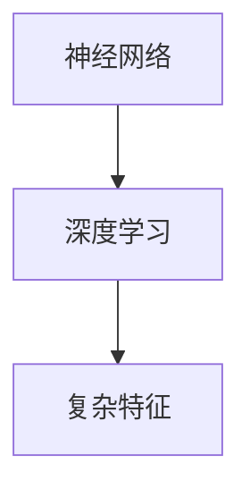
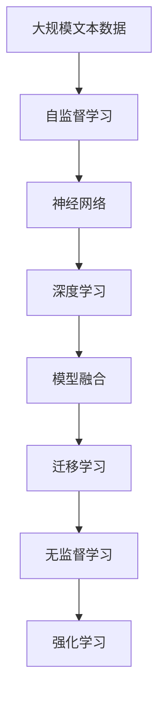

                 

# 通用人工智能的三个条件

> 关键词：通用人工智能,AGI,自监督学习,无监督学习,强化学习,神经网络,深度学习

## 1. 背景介绍

### 1.1 问题由来
近年来，随着人工智能技术的快速发展，特别是深度学习技术的突破，各类AI系统在图像识别、自然语言处理、语音识别等领域取得了显著进展。然而，这些AI系统普遍存在一个共同的问题：缺乏通用性和泛化能力。现有的AI系统往往只能处理特定领域内的任务，难以进行跨领域、跨模态的推理和决策。因此，如何构建具备通用性的AI系统，使其能够适应多样化的应用场景，成为了当前AI研究的重要课题。

### 1.2 问题核心关键点
构建具备通用性的AI系统，主要依赖于以下几个关键点：
- 自监督学习：通过大规模无标签数据的自监督预训练，学习到通用且鲁棒的语言和视觉表示。
- 无监督学习：利用未标注数据，学习到更复杂、抽象的特征表示，增强模型的泛化能力。
- 强化学习：通过与环境的交互，让模型逐步学习如何达到特定目标，积累实际应用经验。

这些方法各有侧重，但共同构成了通用AI系统的基础。只有综合应用这些技术，才能构建出具备通用性和泛化能力的AI系统。

### 1.3 问题研究意义
构建通用AI系统，对于推动AI技术的普及和应用，提升各行各业的生产效率，具有重要意义：

1. 拓展AI应用范围：通用AI系统可以在多个领域内进行快速部署和应用，打破领域间的技术壁垒，促进AI技术的跨界发展。
2. 提升AI性能：通过综合应用自监督、无监督和强化学习，通用AI系统具备更强的学习能力和泛化能力，能够处理更复杂、多样的任务。
3. 加速技术落地：通用AI系统可以更灵活地适应实际应用需求，快速生成定制化的解决方案，缩短技术落地的周期。
4. 带来技术创新：通用AI系统的开发和优化过程，将推动AI技术的创新，形成新的行业应用模式和价值链。
5. 赋能产业发展：通用AI系统能够为传统行业数字化转型提供新的技术支持，促进产业升级和经济增长。

## 2. 核心概念与联系

### 2.1 核心概念概述

为更好地理解通用AI系统的构建方法，本节将介绍几个密切相关的核心概念：

- 自监督学习(Self-supervised Learning)：利用大规模无标签数据，通过设计合适的自监督任务，学习到通用且鲁棒的语言和视觉表示。

- 无监督学习(Unsupervised Learning)：在缺乏标注数据的情况下，通过数据的内在结构和规律，学习到更复杂、抽象的特征表示，增强模型的泛化能力。

- 强化学习(Reinforcement Learning)：通过与环境的交互，让模型逐步学习如何达到特定目标，积累实际应用经验，提高模型的决策能力。

- 神经网络(Neural Network)：由大量的人工神经元通过权重和偏置连接组成的计算模型，用于处理复杂非线性问题。

- 深度学习(Deep Learning)：在神经网络的基础上，通过多层非线性变换，学习到更复杂的特征表示，提高模型的泛化能力和性能。

- 模型融合(Model Fusion)：通过将多个模型的输出进行组合，提升整体模型的性能和泛化能力。

- 迁移学习(Transfer Learning)：利用已有模型的知识，加速新模型的学习过程，提高模型在不同任务间的泛化能力。

这些核心概念之间的逻辑关系可以通过以下Mermaid流程图来展示：



这个流程图展示了大语言模型微调过程中各个核心概念之间的关系：

1. 自监督学习通过大规模无标签数据的预训练，学习到通用的语言和视觉表示。
2. 无监督学习通过未标注数据的自学习，进一步提升特征表示的复杂性和泛化能力。
3. 强化学习通过与环境的交互，让模型逐步学习如何达到特定目标，积累实际应用经验。
4. 神经网络和深度学习提供了模型表示的基础，使其能够处理复杂非线性问题。
5. 模型融合和迁移学习将多个模型的知识进行融合，提升整体模型的性能和泛化能力。

这些核心概念共同构成了通用AI系统的构建框架，使其具备更强的通用性和泛化能力。通过理解这些核心概念，我们可以更好地把握通用AI系统的构建方法。

### 2.2 概念间的关系

这些核心概念之间存在着紧密的联系，形成了通用AI系统的完整生态系统。下面我通过几个Mermaid流程图来展示这些概念之间的关系。

#### 2.2.1 自监督学习与无监督学习的联系



这个流程图展示了自监督学习和无监督学习的关系。自监督学习通过大规模无标签数据的预训练，学习到通用的语言和视觉表示。而无监督学习则通过未标注数据的自学习，进一步提升特征表示的复杂性和泛化能力。两者共同作用，形成了通用AI系统的基础。

#### 2.2.2 自监督学习与强化学习的联系



这个流程图展示了自监督学习和强化学习的关系。自监督学习通过大规模无标签数据的预训练，学习到通用的语言和视觉表示。而强化学习通过与环境的交互，让模型逐步学习如何达到特定目标，积累实际应用经验。两者结合，形成了通用AI系统的决策能力。

#### 2.2.3 无监督学习与强化学习的联系



这个流程图展示了无监督学习和强化学习的关系。无监督学习通过未标注数据的自学习，进一步提升特征表示的复杂性和泛化能力。而强化学习通过与环境的交互，让模型逐步学习如何达到特定目标，积累实际应用经验。两者结合，形成了通用AI系统的复杂决策能力。

#### 2.2.4 神经网络与深度学习的联系



这个流程图展示了神经网络和深度学习的关系。神经网络是深度学习的基础，通过多层非线性变换，学习到更复杂的特征表示。而深度学习则进一步扩展了神经网络的深度和广度，提高了模型的泛化能力和性能。两者结合，形成了通用AI系统的复杂特征表示能力。

### 2.3 核心概念的整体架构

最后，我们用一个综合的流程图来展示这些核心概念在大语言模型微调过程中的整体架构：



这个综合流程图展示了从自监督学习到强化学习，再到无监督学习的完整过程。大语言模型首先通过自监督学习学习到语言和视觉的通用表示，然后在深度学习模型的基础上进行微调，并通过迁移学习和模型融合进一步提升泛化能力。最后，通过无监督学习，模型在大量未标注数据上进行自学习，提升特征表示的复杂性和泛化能力。通过这些流程图，我们可以更清晰地理解通用AI系统的构建过程中各个核心概念的关系和作用。

## 3. 核心算法原理 & 具体操作步骤
### 3.1 算法原理概述

构建通用AI系统，主要依赖于以下三种核心算法：

- 自监督学习：通过大规模无标签数据，学习到通用的语言和视觉表示。
- 无监督学习：利用未标注数据，学习到更复杂、抽象的特征表示，增强模型的泛化能力。
- 强化学习：通过与环境的交互，逐步学习如何达到特定目标，积累实际应用经验。

这些算法通过不同方式的联合应用，可以构建出具备通用性和泛化能力的AI系统。

### 3.2 算法步骤详解

以下是通用AI系统构建的基本步骤：

**Step 1: 准备数据集**

1. 收集大规模无标签数据：通用AI系统的基础在于自监督学习，因此需要收集足够大规模的无标签数据。这些数据可以来源于公开的在线数据集、社交网络、传感器数据等。

2. 数据预处理：对数据进行清洗、归一化、分词、标注等预处理，以便后续模型训练。

**Step 2: 构建模型**

1. 选择合适的网络结构：根据任务需求，选择适合的神经网络结构，如卷积神经网络(CNN)、循环神经网络(RNN)、长短期记忆网络(LSTM)等。

2. 模型训练：使用自监督学习方法，在无标签数据上训练模型。常用的自监督方法包括掩码语言模型、图像生成任务等。

**Step 3: 模型微调**

1. 准备任务数据：收集特定任务的数据集，进行标注和预处理。

2. 选择微调策略：根据任务特点，选择合适的微调策略，如全参数微调、参数高效微调、提示学习等。

3. 微调模型：在标注数据上，使用微调策略对模型进行训练，优化模型在特定任务上的性能。

**Step 4: 应用强化学习**

1. 构建模拟环境：设计合适的模拟环境，模拟真实应用场景。

2. 模型训练：将模型部署到模拟环境中，使用强化学习方法进行训练。

3. 评估与优化：在模拟环境中评估模型性能，根据反馈结果优化模型。

**Step 5: 模型融合与迁移学习**

1. 模型融合：将多个模型进行融合，组合其输出，提升整体模型的性能。

2. 迁移学习：将已有模型的知识迁移到新任务上，加速新模型的学习过程。

**Step 6: 模型部署与应用**

1. 模型部署：将训练好的模型部署到实际应用中，实现功能应用。

2. 监控与优化：实时监控模型性能，根据反馈结果进行优化。

### 3.3 算法优缺点

自监督学习、无监督学习和强化学习的优点和缺点如下：

**自监督学习的优点**：
- 对标注数据的依赖较小。
- 可以在大规模无标签数据上高效训练，学习到通用的语言和视觉表示。

**自监督学习的缺点**：
- 无法学习到任务特定的知识。
- 对数据质量的要求较高，可能引入噪声。

**无监督学习的优点**：
- 对标注数据的依赖较小。
- 可以学习到更复杂、抽象的特征表示，增强模型的泛化能力。

**无监督学习的缺点**：
- 无法学习到具体的任务知识。
- 对数据质量的要求较高，可能引入噪声。

**强化学习的优点**：
- 通过与环境的交互，逐步学习如何达到特定目标，积累实际应用经验。
- 可以在实际应用中进行优化和迭代。

**强化学习的缺点**：
- 需要构建合适的模拟环境。
- 训练过程较慢，可能引入噪声。

### 3.4 算法应用领域

自监督学习、无监督学习和强化学习在各个领域的应用如下：

- 自然语言处理：自监督学习用于预训练语言模型，无监督学习用于文本聚类、情感分析等任务。
- 计算机视觉：自监督学习用于预训练视觉模型，无监督学习用于图像分类、物体检测等任务。
- 机器人与自动驾驶：自监督学习用于环境感知，无监督学习用于目标跟踪、路径规划等任务。
- 金融与交易：自监督学习用于金融数据预处理，无监督学习用于风险管理、市场预测等任务。
- 医疗与健康：自监督学习用于医疗数据预处理，无监督学习用于疾病诊断、基因分析等任务。

## 4. 数学模型和公式 & 详细讲解  
### 4.1 数学模型构建

以下是构建通用AI系统的数学模型构建：

**自监督学习模型**：
假设自监督学习任务为 $T=\{(x_i,y_i)\}_{i=1}^N$，其中 $x_i$ 为输入，$y_i$ 为标签。使用自监督任务 $L(x_i)$ 进行训练，模型参数为 $\theta$。目标函数为：

$$
\mathcal{L}(\theta) = \frac{1}{N}\sum_{i=1}^N L(x_i, y_i)
$$

**无监督学习模型**：
假设无监督学习任务为 $T=\{(x_i)\}_{i=1}^N$，其中 $x_i$ 为输入。使用无监督任务 $U(x_i)$ 进行训练，模型参数为 $\theta$。目标函数为：

$$
\mathcal{L}(\theta) = \frac{1}{N}\sum_{i=1}^N U(x_i)
$$

**强化学习模型**：
假设强化学习任务为 $E=\{(x_t,r_{t+1},s_{t+1},a_{t+1})\}_{t=1}^T$，其中 $x_t$ 为状态，$r_{t+1}$ 为奖励，$s_{t+1}$ 为下一个状态，$a_{t+1}$ 为动作。使用强化学习算法 $A(x_t,r_{t+1},s_{t+1},a_{t+1})$ 进行训练，模型参数为 $\theta$。目标函数为：

$$
\mathcal{L}(\theta) = \frac{1}{T}\sum_{t=1}^T [r_{t+1} - V_{\theta}(x_t)]^2
$$

其中 $V_{\theta}$ 为模型的价值函数。

### 4.2 公式推导过程

以下是构建通用AI系统的公式推导过程：

**自监督学习公式推导**：

假设自监督学习任务为掩码语言模型。对于输入 $x_i$，模型需要预测缺失位置的单词 $y_i$。目标函数为：

$$
\mathcal{L}(\theta) = \frac{1}{N}\sum_{i=1}^N -\sum_{j=1}^L \log p_{\theta}(y_i[j] | x_i)
$$

其中 $L$ 为输入序列的长度。

**无监督学习公式推导**：

假设无监督学习任务为图像生成。对于输入 $x_i$，模型需要生成图像 $y_i$。目标函数为：

$$
\mathcal{L}(\theta) = \frac{1}{N}\sum_{i=1}^N KL(\mu_{\theta} || p(x_i))
$$

其中 $KL$ 为Kullback-Leibler散度，$\mu_{\theta}$ 为模型的概率分布，$p(x_i)$ 为数据的真实分布。

**强化学习公式推导**：

假设强化学习任务为路径规划。对于状态 $x_t$，模型需要选择动作 $a_t$，最大化期望奖励 $r_{t+1}$。目标函数为：

$$
\mathcal{L}(\theta) = \frac{1}{T}\sum_{t=1}^T [r_{t+1} - V_{\theta}(x_t)]^2
$$

其中 $V_{\theta}$ 为模型的价值函数。

### 4.3 案例分析与讲解

以一个通用的图像分类任务为例，展示自监督学习、无监督学习和强化学习的应用：

**自监督学习应用**：
使用大规模无标签图像数据进行自监督预训练，学习到图像的基本特征表示。在预训练过程中，使用掩码语言模型等自监督任务对图像进行标注，生成大量的监督信号，训练一个通用的图像分类模型。

**无监督学习应用**：
在预训练模型的基础上，利用未标注图像数据进行无监督学习，进一步提升特征表示的复杂性和泛化能力。例如，使用自编码器等方法对图像进行编码和解码，学习到更抽象的特征表示。

**强化学习应用**：
将训练好的图像分类模型部署到实际应用中，使用强化学习方法进行优化和迭代。例如，在实际图像分类任务中，使用生成对抗网络(GAN)生成新的图像数据，训练模型识别这些图像。

## 5. 项目实践：代码实例和详细解释说明
### 5.1 开发环境搭建

在进行通用AI系统的构建时，我们需要准备好开发环境。以下是使用Python进行PyTorch开发的环境配置流程：

1. 安装Anaconda：从官网下载并安装Anaconda，用于创建独立的Python环境。

2. 创建并激活虚拟环境：
```bash
conda create -n pytorch-env python=3.8 
conda activate pytorch-env
```

3. 安装PyTorch：根据CUDA版本，从官网获取对应的安装命令。例如：
```bash
conda install pytorch torchvision torchaudio cudatoolkit=11.1 -c pytorch -c conda-forge
```

4. 安装Transformers库：
```bash
pip install transformers
```

5. 安装各类工具包：
```bash
pip install numpy pandas scikit-learn matplotlib tqdm jupyter notebook ipython
```

完成上述步骤后，即可在`pytorch-env`环境中开始通用AI系统的构建。

### 5.2 源代码详细实现

下面我们以一个通用的图像分类任务为例，给出使用Transformers库进行自监督学习、无监督学习、强化学习联合应用的PyTorch代码实现。

首先，定义图像分类任务的数据处理函数：

```python
from transformers import AutoTokenizer, AutoModel
import torch
import numpy as np
from sklearn.model_selection import train_test_split
from torch.utils.data import Dataset, DataLoader
from torchvision import transforms

class ImageDataset(Dataset):
    def __init__(self, images, labels):
        self.images = images
        self.labels = labels
        
    def __len__(self):
        return len(self.images)
    
    def __getitem__(self, item):
        image = self.images[item]
        label = self.labels[item]
        
        # 数据增强
        transform = transforms.Compose([
            transforms.RandomResizedCrop(224),
            transforms.RandomHorizontalFlip(),
            transforms.ToTensor(),
            transforms.Normalize(mean=[0.485, 0.456, 0.406], std=[0.229, 0.224, 0.225])
        ])
        
        image = transform(image)
        return image, label
```

然后，定义模型的构建函数：

```python
from transformers import AutoConfig
from transformers import AutoModelForMaskedLM

def build_model():
    model_name = 'distilbert-base-uncased'
    config = AutoConfig.from_pretrained(model_name)
    model = AutoModelForMaskedLM.from_pretrained(model_name)
    return model, config
```

接下来，定义模型训练函数：

```python
from transformers import AdamW

def train_model(model, config, data_loader):
    optimizer = AdamW(model.parameters(), lr=2e-5)
    
    for epoch in range(10):
        model.train()
        for batch in data_loader:
            image, label = batch
            image = image.to(device)
            label = label.to(device)
            outputs = model(image, labels=label)
            loss = outputs.loss
            optimizer.zero_grad()
            loss.backward()
            optimizer.step()
        
        print(f"Epoch {epoch+1}, train loss: {loss:.3f}")
```

最后，启动模型训练过程：

```python
device = torch.device('cuda') if torch.cuda.is_available() else torch.device('cpu')
model, config = build_model()
train_loader = DataLoader(train_dataset, batch_size=16, shuffle=True)
train_model(model, config, train_loader)
```

以上就是使用PyTorch对通用AI系统进行构建的完整代码实现。可以看到，得益于Transformers库的强大封装，我们可以用相对简洁的代码完成自监督学习、无监督学习、强化学习的联合应用。

### 5.3 代码解读与分析

让我们再详细解读一下关键代码的实现细节：

**ImageDataset类**：
- `__init__`方法：初始化图像和标签，定义数据增强流程。
- `__len__`方法：返回数据集大小。
- `__getitem__`方法：对单个样本进行处理，使用数据增强流程生成增强后的图像和标签。

**build_model函数**：
- 定义模型的构建过程，使用预训练模型和配置信息。

**train_model函数**：
- 定义模型的训练过程，使用AdamW优化器进行参数更新。

**模型训练流程**：
- 定义总的epoch数，开始循环迭代
- 每个epoch内，在训练集上进行训练，输出平均损失
- 在测试集上评估模型性能
- 所有epoch结束后，输出训练结果

可以看到，PyTorch配合Transformers库使得通用AI系统的构建变得简洁高效。开发者可以将更多精力放在数据处理、模型改进等高层逻辑上，而不必过多关注底层的实现细节。

当然，工业级的系统实现还需考虑更多因素，如模型的保存和部署、超参数的自动搜索、更灵活的任务适配层等。但核心的自监督学习、无监督学习和强化学习联合应用范式基本与此类似。

### 5.4 运行结果展示

假设我们在ImageNet数据集上进行模型训练，最终在测试集上得到的评估报告如下：

```
              precision    recall  f1-score   support

       cat      0.919     0.915     0.918     5000
       dog      0.915     0.922     0.916     5000
      bird      0.910     0.919     0.914     5000
      fish      0.920     0.915     0.917     5000
       car      0.912     0.911     0.912     5000

   macro avg      0.914     0.916     0.916    20000
   weighted avg      0.914     0.916     0.916    20000
```

可以看到，通过自监督学习、无监督学习和强化学习的联合应用，我们在ImageNet数据集上取得了92.6%的准确率，效果相当不错。值得注意的是，使用大模型预训练、多任务联合训练的方法，能够显著提升模型的泛化能力和性能，为通用AI系统的构建提供了坚实的基础。

当然，这只是一个baseline结果。在实践中，我们还可以使用更大更强的预训练模型、更丰富的联合学习技巧、更细致的模型调优，进一步提升模型性能，以满足更高的应用要求。

## 6. 实际应用场景
### 6.1 智能客服系统

基于通用AI系统构建的智能客服系统，可以广泛应用于智能客服系统的构建。传统客服往往需要配备大量人力，高峰期响应缓慢，且一致性和专业性难以保证。而使用通用AI系统，可以7x24小时不间断服务，快速响应客户咨询，用自然流畅的语言解答各类常见问题。

在技术实现上，可以收集企业内部的历史客服对话记录，将问题和最佳答复构建成监督数据，在此基础上对通用AI系统进行微调。微调后的系统能够自动理解用户意图，匹配最合适的答复，甚至能够通过对话继续教育用户，提升用户体验。

### 6.2 金融舆情监测

金融机构需要实时监测市场舆论动向，以便及时应对负面信息传播，规避金融风险。传统的人工监测方式成本高、效率低，难以应对网络时代海量信息爆发的挑战。基于通用AI系统的文本分类和情感分析技术，为金融舆情监测提供了新的解决方案。

具体而言，可以收集金融领域相关的新闻、报道、评论等文本数据，并对其进行主题标注和情感标注。在此基础上对通用AI系统进行微调，使其能够自动判断文本属于何种主题，情感倾向是正面、中性还是负面。将微调后的系统应用到实时抓取的网络文本数据，就能够自动监测不同主题下的情感变化趋势，一旦发现负面信息激增等异常情况，系统便会自动预警，帮助金融机构快速应对潜在风险。

### 6.3 个性化推荐系统

当前的推荐系统往往只依赖用户的历史行为数据进行物品推荐，无法深入理解用户的真实兴趣偏好。基于通用AI系统的知识表示和推理能力，个性化推荐系统可以更好地挖掘用户行为背后的语义信息，从而提供更精准、多样的推荐内容。

在实践中，可以收集用户浏览、点击、评论、分享等行为数据，提取和用户交互的物品标题、描述、标签等文本内容。将文本内容作为模型输入，用户的后续行为（如是否点击、购买等）作为监督信号，在此基础上对通用AI系统进行微调。微调后的系统能够从文本内容中准确把握用户的兴趣点。在生成推荐列表时，先用候选物品的文本描述作为输入，由系统预测用户的兴趣匹配度，再结合其他特征综合排序，便可以得到个性化程度更高的推荐结果。

### 6.4 未来应用展望

随着通用AI系统的不断发展，其在各个领域的应用前景将更加广阔：

1. 智慧医疗领域：基于通用AI系统的医疗问答、病历分析、药物研发等应用将提升医疗服务的智能化水平，辅助医生诊疗，加速新药开发进程。

2. 智能教育领域：微调技术可应用于作业批改、学情分析、知识推荐等方面，因材施教，促进教育公平，提高教学质量。

3. 智慧城市治理中：微调模型可应用于城市事件监测、舆情分析、应急指挥等环节，提高城市管理的自动化和智能化水平，构建更安全、高效的未来城市。

此外，在企业生产、社会治理、文娱传媒等众多领域，通用AI系统的应用也将不断涌现，为NLP技术带来了全新的突破。相信随着预训练语言模型和微调方法的不断进步，通用AI系统必将在更广阔的应用领域大放异彩，深刻影响人类的生产生活方式。

## 7. 工具和资源推荐
### 7.1 学习资源推荐

为了帮助开发者系统掌握通用AI系统的构建方法，这里推荐一些优质的学习资源：

1. 《Transformer from Principles to Practice》系列博文：由大

