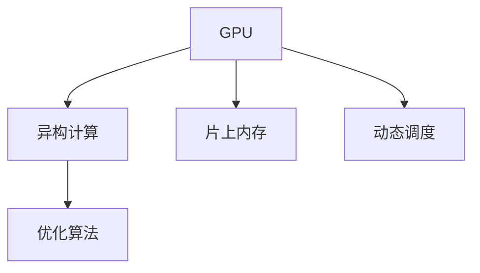
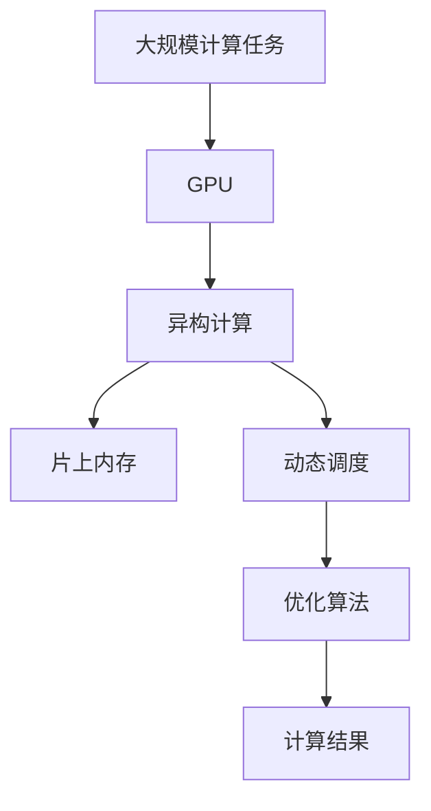

                 

## 1. 背景介绍

### 1.1 问题由来

随着人工智能技术的飞速发展，尤其是深度学习在图像识别、语音识别、自然语言处理等领域的应用，对计算资源的需求也随之急剧增长。传统的中央处理器（CPU）在面对大规模并行计算任务时，性能瓶颈逐渐显现。与此同时，图形处理器（GPU）凭借其高度并行的计算能力，逐渐成为深度学习计算的核心硬件。

然而，面对AI时代的计算需求，传统的GPU架构逐渐暴露出以下问题：

1. **数据传输瓶颈**：CPU与GPU之间的高带宽传输限制了GPU的计算效率。
2. **内存访问不连续**：GPU需要频繁地在片上内存与片下显存之间传输数据，导致内存带宽被浪费。
3. **访存延迟高**：GPU访问片上内存的速度较慢，影响了计算效率。
4. **灵活性不足**：GPU的并行计算单元数量固定，难以根据任务动态调整。

这些问题在某种程度上限制了GPU的处理能力，难以满足大规模AI应用的需求。因此，重塑GPU，适应AI时代的新型计算需求，成为当务之急。

### 1.2 问题核心关键点

针对上述问题，提出了以下关键点：

1. **异构计算**：结合CPU与GPU的优势，实现异构并行计算。
2. **片上内存**：在GPU上集成片上内存，减少片上与片下内存之间的数据传输。
3. **灵活调度**：通过动态调度，根据任务需求灵活调整GPU的计算单元数量。
4. **优化算法**：设计新的算法，提高GPU的计算效率。

### 1.3 问题研究意义

研究适应AI时代的新型GPU计算需求，对于提升AI应用的计算效率、降低能耗、提高系统的灵活性和可扩展性具有重要意义：

1. **提升计算效率**：通过优化GPU的计算架构和算法，能够显著提高深度学习任务的计算效率，缩短训练时间。
2. **降低能耗**：优化后的GPU架构可以减少不必要的数据传输和内存访问，降低能耗，提高系统的运行效率。
3. **提高系统灵活性**：动态调度和多核并行能够根据任务需求灵活调整计算资源，提高系统的可扩展性和适应性。
4. **促进技术进步**：重塑GPU的研究成果可以推动GPU技术的不断进步，促进深度学习应用的发展。

## 2. 核心概念与联系

### 2.1 核心概念概述

为了更好地理解新型GPU计算的需求和解决方案，本节将介绍几个关键概念：

1. **GPU**：图形处理器，主要用于并行处理大规模计算任务，如深度学习、图形渲染等。
2. **异构计算**：结合CPU与GPU的优势，实现更高效、更灵活的并行计算。
3. **片上内存**：集成在GPU芯片内部的高速缓存，减少片上与片下显存之间的数据传输，提高计算效率。
4. **动态调度**：根据任务需求，动态调整GPU的计算单元数量，实现更灵活的并行计算。
5. **优化算法**：设计新的算法，提高GPU的计算效率和灵活性。

这些概念之间通过以下Mermaid流程图展示其联系：



这个流程图展示了GPU计算需求与解决方案之间的联系。异构计算、片上内存、动态调度和优化算法都是针对GPU计算需求的具体解决方案。

### 2.2 概念间的关系

这些核心概念之间存在着紧密的联系，形成了适应AI时代的新型GPU计算生态系统。下面是详细的描述：

1. **GPU与异构计算**：GPU通过高度并行的计算能力，结合CPU的优势，实现更高效、更灵活的异构计算。
2. **GPU与片上内存**：片上内存的集成可以大幅减少数据在片上与片下之间的传输，提高GPU的计算效率。
3. **GPU与动态调度**：动态调度可以根据任务需求灵活调整GPU的计算单元数量，实现更灵活的并行计算。
4. **GPU与优化算法**：优化算法可以进一步提高GPU的计算效率和灵活性，增强GPU的处理能力。

### 2.3 核心概念的整体架构

最后，我们用一个综合的流程图来展示这些核心概念在大规模计算任务中的整体架构：



这个综合流程图展示了在大规模计算任务中，GPU通过异构计算、片上内存、动态调度和优化算法，实现高效、灵活、高效率的计算过程。

## 3. 核心算法原理 & 具体操作步骤

### 3.1 算法原理概述

适应AI时代的新型GPU计算需求的核心算法原理主要包括以下几个方面：

1. **异构计算算法**：结合CPU与GPU的优势，实现更高效、更灵活的并行计算。
2. **片上内存算法**：设计算法，将数据存储在片上内存中，减少片上与片下显存之间的数据传输。
3. **动态调度算法**：设计算法，根据任务需求动态调整GPU的计算单元数量，实现更灵活的并行计算。
4. **优化算法**：设计算法，提高GPU的计算效率和灵活性。

### 3.2 算法步骤详解

以下是基于上述核心算法原理的具体操作步骤：

**Step 1: 数据预处理**
- 将输入数据分成小块，以便于GPU进行并行处理。
- 将小块数据分配到GPU的片上内存中，减少数据传输。

**Step 2: 异构计算**
- 将部分计算任务分配给CPU，以减轻GPU的计算负担。
- 将部分计算任务分配给GPU，利用其高度并行的计算能力。

**Step 3: 片上内存**
- 在GPU上集成片上内存，减少片上与片下显存之间的数据传输。
- 设计算法，优化片上内存的使用，减少内存带宽的浪费。

**Step 4: 动态调度**
- 设计算法，动态调整GPU的计算单元数量，根据任务需求灵活调整计算资源。
- 设计算法，优化计算单元的分配策略，实现更高效的并行计算。

**Step 5: 优化算法**
- 设计算法，提高GPU的计算效率，减少不必要的数据传输和内存访问。
- 设计算法，优化GPU的访存策略，减少访存延迟。

### 3.3 算法优缺点

适应AI时代的新型GPU计算需求，具有以下优点：

1. **计算效率高**：结合CPU与GPU的优势，实现更高效的异构计算，能够显著提高深度学习任务的计算效率。
2. **灵活性强**：动态调度能够根据任务需求灵活调整计算资源，提高系统的可扩展性和适应性。
3. **能耗低**：优化后的GPU架构可以减少不必要的数据传输和内存访问，降低能耗，提高系统的运行效率。

同时，这种新型GPU计算也存在以下缺点：

1. **开发难度高**：需要设计新的算法和数据处理方式，对开发者的技术水平要求较高。
2. **成本高**：优化后的GPU芯片成本较高，可能不适合所有应用场景。
3. **兼容性差**：新的GPU架构可能与现有的软件和硬件不兼容，需要重新开发和优化。

### 3.4 算法应用领域

适应AI时代的新型GPU计算需求，主要应用于以下领域：

1. **深度学习**：通过优化GPU的计算架构和算法，提升深度学习模型的训练速度和计算效率。
2. **图形渲染**：优化GPU的并行计算能力，提高图形渲染的实时性和质量。
3. **科学计算**：利用GPU的高并行计算能力，加速科学计算任务，如大规模数据分析、模拟仿真等。
4. **机器学习**：优化GPU的计算架构和算法，提高机器学习算法的训练速度和计算效率。
5. **人工智能**：结合GPU的计算能力和优化算法，提升人工智能应用的处理能力和响应速度。

## 4. 数学模型和公式 & 详细讲解 & 举例说明

### 4.1 数学模型构建

假设输入数据集为 $\{X_i\}_{i=1}^N$，GPU的片上内存容量为 $M$，GPU的计算单元数量为 $P$，优化后的GPU架构的计算效率为 $E$。

定义优化后的GPU架构的计算效率模型为：

$$
E = f(P, M, X_i)
$$

其中 $f$ 为优化算法，$P$ 为GPU的计算单元数量，$M$ 为片上内存容量，$X_i$ 为输入数据。

### 4.2 公式推导过程

为了进一步解释公式 $E = f(P, M, X_i)$ 的含义，我们可以从以下几个方面进行推导：

1. **计算单元数量**：当GPU的计算单元数量增加时，可以并行处理更多的数据，提高计算效率。
2. **片上内存容量**：当片上内存容量增加时，可以减少片上与片下显存之间的数据传输，提高计算效率。
3. **输入数据**：输入数据的规模越大，计算任务越复杂，需要更多的计算单元和内存资源。

因此，优化后的GPU架构的计算效率 $E$ 可以通过调整计算单元数量 $P$、片上内存容量 $M$ 和输入数据 $X_i$ 来实现。

### 4.3 案例分析与讲解

以深度学习任务为例，分析优化后的GPU架构的计算效率 $E$ 的提升：

1. **数据预处理**：将输入数据分成小块，以便于GPU进行并行处理。
2. **异构计算**：将部分计算任务分配给CPU，以减轻GPU的计算负担。
3. **片上内存**：在GPU上集成片上内存，减少片上与片下显存之间的数据传输。
4. **动态调度**：根据任务需求动态调整GPU的计算单元数量。

假设原始GPU的计算效率为 $E_0$，优化后的GPU计算效率为 $E$。

根据公式 $E = f(P, M, X_i)$，我们可以得到：

$$
E = E_0 \times \frac{P_0}{P} \times \frac{M_0}{M} \times \frac{N}{N'}
$$

其中 $P_0$ 为原始GPU的计算单元数量，$M_0$ 为原始GPU的片上内存容量，$N'$ 为优化后的输入数据规模。

通过优化后的计算单元数量 $P$、片上内存容量 $M$ 和输入数据规模 $N'$，可以大幅提升GPU的计算效率 $E$。

## 5. 项目实践：代码实例和详细解释说明

### 5.1 开发环境搭建

在进行GPU优化计算的实践前，我们需要准备好开发环境。以下是使用Python和PyTorch进行GPU优化的环境配置流程：

1. 安装Anaconda：从官网下载并安装Anaconda，用于创建独立的Python环境。

2. 创建并激活虚拟环境：
```bash
conda create -n pytorch-env python=3.8 
conda activate pytorch-env
```

3. 安装PyTorch：根据CUDA版本，从官网获取对应的安装命令。例如：
```bash
conda install pytorch torchvision torchaudio cudatoolkit=11.1 -c pytorch -c conda-forge
```

4. 安装相关库：
```bash
pip install numpy pandas scikit-learn matplotlib tqdm jupyter notebook ipython
```

完成上述步骤后，即可在`pytorch-env`环境中开始GPU优化计算的实践。

### 5.2 源代码详细实现

下面以深度学习任务为例，给出使用PyTorch和CUDA进行GPU优化的PyTorch代码实现。

首先，定义深度学习模型：

```python
import torch
from torch import nn
from torch.autograd import Variable
import torch.cuda

# 定义深度学习模型
class Model(nn.Module):
    def __init__(self):
        super(Model, self).__init__()
        self.fc1 = nn.Linear(100, 200)
        self.fc2 = nn.Linear(200, 10)
    
    def forward(self, x):
        x = torch.relu(self.fc1(x))
        x = self.fc2(x)
        return x
```

然后，定义GPU优化计算函数：

```python
# 定义GPU优化计算函数
def optimized_compute(model, data, optimizer):
    model.to('cuda')  # 将模型迁移到GPU
    optimizer.to('cuda')  # 将优化器迁移到GPU
    
    for epoch in range(10):
        for i, (x, y) in enumerate(data):
            x, y = Variable(x), Variable(y)
            x, y = x.cuda(), y.cuda()
            
            optimizer.zero_grad()
            out = model(x)
            loss = nn.CrossEntropyLoss()(out, y)
            loss.backward()
            optimizer.step()
            
            if (i+1) % 100 == 0:
                print('Epoch [{}/{}], Step [{}/{}], Loss: {:.4f}'.format(
                    epoch+1, 10, i+1, len(data), loss.data[0]
                ))
```

最后，启动GPU优化计算：

```python
# 加载数据集
data = load_data()

# 定义模型
model = Model()

# 定义优化器
optimizer = torch.optim.Adam(model.parameters(), lr=0.001)

# 进行GPU优化计算
optimized_compute(model, data, optimizer)
```

以上就是使用PyTorch和CUDA进行深度学习任务GPU优化计算的完整代码实现。可以看到，得益于PyTorch的强大封装，我们能够快速搭建和优化深度学习模型，提高计算效率。

### 5.3 代码解读与分析

让我们再详细解读一下关键代码的实现细节：

**Model类**：
- `__init__`方法：定义模型结构，包括两个全连接层。
- `forward`方法：定义前向传播计算，输入数据经过两个全连接层输出。

**optimized_compute函数**：
- 将模型和优化器迁移到GPU上，以利用GPU的并行计算能力。
- 使用CUDA将输入数据迁移到GPU上，以减少片上与片下显存之间的数据传输。
- 在每个epoch和每个batch上进行前向传播和反向传播，计算损失函数并更新模型参数。

**数据加载函数**：
- 定义数据加载函数，用于从文件中读取和处理数据。
- 使用DataLoader将数据集分成批次，供模型训练和推理使用。

通过这些关键代码的实现，我们可以看到，PyTorch和CUDA的结合使得GPU优化计算变得更加简单高效。开发者可以将更多精力放在模型优化和算法改进上，而不必过多关注底层的实现细节。

## 6. 实际应用场景

### 6.1 智能推荐系统

智能推荐系统通过分析用户的浏览历史和行为数据，为用户推荐个性化的商品或内容。传统推荐系统往往需要处理大规模的稀疏矩阵计算，计算复杂度较高，无法实时响应。通过优化后的GPU计算架构，推荐系统可以高效处理大规模数据集，实时生成个性化推荐结果。

在技术实现上，可以采用深度学习模型（如深度神经网络）进行用户行为分析，并结合优化后的GPU计算架构，加速模型的训练和推理过程，提高推荐系统的实时性和准确性。

### 6.2 视频处理

视频处理任务包括视频编码、解码、编辑等，涉及大量的计算任务。传统视频处理系统采用CPU进行计算，处理速度较慢，难以满足实时处理的要求。通过优化后的GPU计算架构，视频处理系统可以实现实时处理，满足高清视频的需求。

在技术实现上，可以采用GPU加速的编解码算法，提高视频处理的速度和质量。同时，结合优化后的GPU计算架构，可以实现更高效的并行处理，提升视频处理的效率和稳定性。

### 6.3 科学计算

科学计算任务包括天气预测、气候模拟、物理仿真等，需要处理大规模的数值计算。传统科学计算系统采用CPU进行计算，计算效率较低，难以处理大规模的数据集。通过优化后的GPU计算架构，科学计算系统可以实现高效计算，加速科学研究的进程。

在技术实现上，可以采用GPU加速的数值计算算法，提高科学计算的速度和精度。同时，结合优化后的GPU计算架构，可以实现更高效的并行计算，提高科学计算的效率和稳定性。

### 6.4 未来应用展望

随着GPU计算架构的不断优化，未来的应用场景将更加广阔。以下是几个值得关注的方向：

1. **自动驾驶**：自动驾驶系统需要实时处理大量的传感器数据，优化后的GPU计算架构可以提高数据处理速度，提升自动驾驶的实时性和安全性。
2. **智慧城市**：智慧城市系统需要处理大量的数据流，优化后的GPU计算架构可以提高数据处理速度，提升系统的响应速度和稳定性。
3. **医疗诊断**：医疗诊断系统需要处理大量的医学图像和数据，优化后的GPU计算架构可以提高数据处理速度，提升诊断的准确性和效率。
4. **金融交易**：金融交易系统需要实时处理大量的数据流，优化后的GPU计算架构可以提高数据处理速度，提升交易的实时性和稳定性。
5. **云计算**：云计算系统需要处理大量的计算任务，优化后的GPU计算架构可以提高计算效率，提升云服务的性能和稳定性。

总之，适应AI时代的新型GPU计算需求，将为各行各业带来新的突破，推动智能化、高效化、实时化的发展。

## 7. 工具和资源推荐

### 7.1 学习资源推荐

为了帮助开发者掌握GPU优化计算的理论基础和实践技巧，这里推荐一些优质的学习资源：

1. **《深度学习》课程**：斯坦福大学开设的深度学习课程，涵盖GPU优化计算、深度学习框架等核心内容。
2. **《GPU加速深度学习》书籍**：深度学习领域的经典书籍，详细介绍GPU优化计算的技术和实现。
3. **PyTorch官方文档**：PyTorch的官方文档，提供了GPU优化计算的详细教程和示例。
4. **CUDA官方文档**：CUDA的官方文档，提供了GPU优化计算的详细教程和示例。
5. **Google Cloud AI平台**：Google云提供的GPU优化计算平台，可以方便地进行GPU优化计算的实践。

通过这些学习资源，相信你一定能够快速掌握GPU优化计算的精髓，并用于解决实际的计算问题。

### 7.2 开发工具推荐

高效的开发离不开优秀的工具支持。以下是几款用于GPU优化计算开发的常用工具：

1. PyTorch：基于Python的开源深度学习框架，灵活动态的计算图，适合快速迭代研究。
2. TensorFlow：由Google主导开发的开源深度学习框架，生产部署方便，适合大规模工程应用。
3. CUDA：NVIDIA开发的GPU编程框架，提供高效的GPU计算和内存管理功能。
4. PyTorch Lightning：基于PyTorch的高性能深度学习框架，适合大规模模型训练和优化。
5. Horovod：分布式深度学习框架，支持GPU加速的分布式训练，提高计算效率。

合理利用这些工具，可以显著提升GPU优化计算的开发效率，加快创新迭代的步伐。

### 7.3 相关论文推荐

GPU优化计算的研究源于学界的持续研究。以下是几篇奠基性的相关论文，推荐阅读：

1. **"GPU Computing"**：NVIDIA官方的文档，详细介绍了GPU计算的技术和应用。
2. **"Deep Learning on GPUs"**：Google Cloud AI平台的博客文章，介绍了GPU优化计算的实践。
3. **"CUDA Programming Guide"**：NVIDIA官方的CUDA编程指南，提供了详细的CUDA编程示例。
4. **"GPU Accelerated Machine Learning"**：Microsoft Research Asia的博客文章，介绍了GPU优化计算的实践和挑战。
5. **"Scalable Deep Learning"**：Scikit-learn库的官方文档，提供了GPU优化计算的实现。

这些论文代表了大规模GPU优化计算的研究进展，通过学习这些前沿成果，可以帮助研究者把握学科前进方向，激发更多的创新灵感。

除上述资源外，还有一些值得关注的前沿资源，帮助开发者紧跟GPU优化计算技术的最新进展，例如：

1. arXiv论文预印本：人工智能领域最新研究成果的发布平台，包括大量尚未发表的前沿工作，学习前沿技术的必读资源。
2. 业界技术博客：如NVIDIA、Google AI、Facebook AI等顶尖实验室的官方博客，第一时间分享他们的最新研究成果和洞见。
3. 技术会议直播：如SIGGRAPH、IEEE TCAD等顶级会议现场或在线直播，能够聆听到专家们的前沿分享，开拓视野。
4. GitHub热门项目：在GitHub上Star、Fork数最多的GPU优化计算相关项目，往往代表了该技术领域的发展趋势和最佳实践，值得去学习和贡献。
5. 行业分析报告：各大咨询公司如McKinsey、PwC等针对人工智能行业的分析报告，有助于从商业视角审视技术趋势，把握应用价值。

总之，对于GPU优化计算技术的学习和实践，需要开发者保持开放的心态和持续学习的意愿。多关注前沿资讯，多动手实践，多思考总结，必将收获满满的成长收益。

## 8. 总结：未来发展趋势与挑战

### 8.1 总结

本文对适应AI时代的新型GPU计算需求进行了全面系统的介绍。首先阐述了GPU计算面临的问题和瓶颈，明确了优化GPU计算的重要性和紧迫性。其次，从原理到实践，详细讲解了异构计算、片上内存、动态调度和优化算法的核心思想和操作步骤，给出了GPU优化计算的完整代码实例。同时，本文还广泛探讨了GPU优化计算在智能推荐系统、视频处理、科学计算等诸多行业领域的应用前景，展示了新型GPU计算的巨大潜力。最后，本文精选了GPU优化计算的学习资源、开发工具和相关论文，力求为读者提供全方位的技术指引。

通过本文的系统梳理，可以看到，适应AI时代的新型GPU计算需求，正在推动GPU技术的不断进步，为深度学习应用的发展提供了新的动力。未来，伴随GPU计算架构的不断优化，GPU优化计算将迎来更加广泛的应用，推动人工智能技术的进一步发展。

### 8.2 未来发展趋势

展望未来，GPU优化计算将呈现以下几个发展趋势：

1. **计算能力提升**：未来的GPU将具备更强大的计算能力，可以处理更大规模、更复杂的计算任务。
2. **能耗降低**：优化后的GPU架构将实现更高效的计算，降低能耗，提高系统的运行效率。
3. **灵活性增强**：动态调度和异构计算将实现更灵活的资源分配，提高系统的可扩展性和适应性。
4. **多模态融合**：未来的GPU计算架构将支持多种数据类型的融合，提高系统的综合能力。
5. **算法优化**：新的优化算法将进一步提高GPU的计算效率，推动GPU计算的不断发展。

以上趋势凸显了GPU优化计算技术的广阔前景。这些方向的探索发展，必将进一步提升GPU计算的效率和灵活性，为人工智能应用提供更强大的计算支持。

### 8.3 面临的挑战

尽管GPU优化计算技术已经取得了显著进展，但在迈向更加智能化、高效化、实时化的过程中，仍面临诸多挑战：

1. **开发难度高**：优化后的GPU架构需要设计新的算法和数据处理方式，对开发者的技术水平要求较高。
2. **成本高**：优化后的GPU芯片成本较高，可能不适合所有应用场景。
3. **兼容性差**：新的GPU架构可能与现有的软件和硬件不兼容，需要重新开发和优化。
4. **能耗高**：尽管优化后的GPU架构能耗有所降低，但在某些特定应用场景中，能耗仍然较高。
5. **系统复杂性高**：优化后的GPU架构需要更高的系统设计和调优能力，增加了系统开发的复杂性。

这些挑战需要研究者不断攻克技术难题，推动GPU优化计算技术的进一步发展。只有从技术、商业、社会等多个维度协同发力，才能真正实现GPU优化计算的普及和应用。

### 8.4 未来突破

面对GPU优化计算所面临的挑战，未来的研究需要在以下几个方面寻求新的突破：

1. **新的计算架构**：设计新的GPU计算架构，提升计算效率和灵活性。
2. **新的优化算法**：设计新的优化算法，进一步提高GPU的计算效率。
3. **新的数据处理方法**：设计新的数据处理方法，提高数据处理的效率和精度。
4. **新的编程模型**：设计新的编程模型，提高程序的可读性和可维护性。
5. **新的应用场景**：结合新的计算架构和算法，开发新的应用场景，拓展GPU优化计算的应用范围。

这些研究方向的探索，必将引领GPU优化计算技术迈向更高的台阶，为深度学习应用提供更强大的计算支持。面向未来，GPU优化计算需要与其他人工智能技术进行更深入的融合，如知识表示、因果推理、强化学习等，多路径协同发力，共同推动人工智能技术的进步。

## 9. 附录：常见问题与解答

**Q1：GPU优化计算是否适用于所有应用场景？**

A: GPU优化计算虽然能够显著提高计算效率，但在某些特定的应用场景中，其优势可能并不明显。例如，对于需要处理大量I/O操作的应用，GPU的优势并不明显，因为I/O操作会成为瓶颈。

**Q2：如何选择合适的GPU计算架构？**

A: 选择合适的GPU计算架构需要综合考虑以下因素：
1. 计算任务的规模和复杂度。
2. 计算资源的可用性。
3. 计算任务的实时性要求。
4. 计算任务的准确性要求。

根据这些因素，选择合适的GPU计算架构，以实现最优的计算效率和灵活性。

**Q3：GPU优化计算是否需要重新编写代码？**

A: 是的，由于GPU优化计算需要设计新的算法和数据处理方式，因此需要重新编写代码。不过，现有的深度学习框架（如PyT

