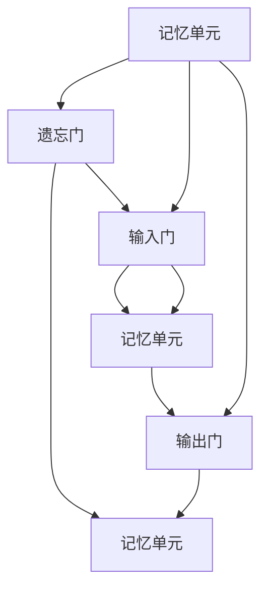
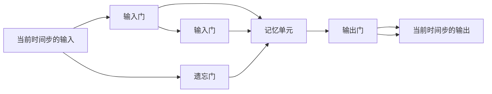
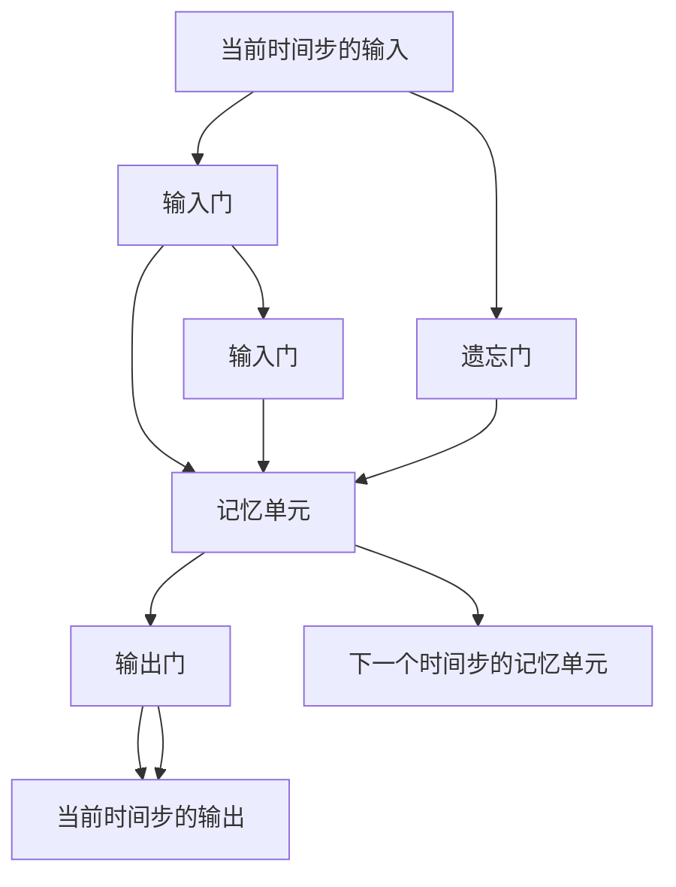

                 

# 长短期记忆网络 (Long Short-Term Memory, LSTM) 原理与代码实例讲解

> 关键词：长短期记忆网络, 递归神经网络(RNN), 记忆单元, 门控单元, 序列建模

## 1. 背景介绍

### 1.1 问题由来
递归神经网络（Recurrent Neural Network, RNN）是深度学习中最常用的序列建模方法之一，用于处理时间序列数据，如语音、文本、时间序列等。传统RNN通过链式结构对序列数据进行传递，使得每个时间步的输出不仅依赖于当前输入，还依赖于之前所有时间步的隐藏状态。这种设计使得RNN能够捕捉时间序列数据中的长期依赖关系，但也存在梯度消失或爆炸的问题，即在处理长序列时，梯度信息会迅速衰减或增长，导致网络难以收敛。

为了解决这个问题，长短期记忆网络（Long Short-Term Memory, LSTM）被提出。LSTM通过引入门控机制，可以有效地控制信息流动，避免梯度问题，使得网络可以处理更长的序列。LSTM最初由Hochreiter和Schmidhuber在1997年提出，并在后续的论文中进一步发展和完善。

### 1.2 问题核心关键点
LSTM的核心思想在于通过三个门控单元（遗忘门、输入门、输出门）来控制信息的流动，从而实现对长期依赖关系的捕捉。LSTM结构包含多个记忆单元和门控单元，每个时间步的输出由当前输入和之前所有时间步的记忆单元共同决定。这种设计使得LSTM能够处理长序列，同时避免了传统RNN的梯度问题。

在实际应用中，LSTM主要用于自然语言处理、语音识别、时间序列预测等任务，如机器翻译、文本生成、情感分析等。LSTM能够处理序列数据，使得其在处理自然语言任务时具有天然的优势。

### 1.3 问题研究意义
LSTM因其独特的门控机制和处理长序列的能力，在深度学习中得到了广泛的应用。了解LSTM的原理和实现方法，对于掌握深度学习在自然语言处理等领域的应用具有重要意义。通过学习LSTM的原理，可以更好地理解其工作机制和优化方法，从而设计出高效、稳定的序列建模系统。

## 2. 核心概念与联系

### 2.1 核心概念概述

为了更好地理解LSTM的工作原理，本节将介绍几个关键概念：

- 递归神经网络（RNN）：一种能够处理序列数据的神经网络，通过链式结构将时间步的隐藏状态传递到下一时间步。
- 长期依赖问题（Long-term Dependency Problem）：传统RNN在处理长序列时，由于梯度消失或爆炸的问题，难以捕捉长期依赖关系。
- 长短期记忆网络（LSTM）：通过引入门控机制，能够有效地控制信息流动，避免梯度问题，从而实现对长期依赖关系的捕捉。
- 记忆单元（Cell State）：LSTM的核心组件，用于存储和更新信息，其状态在时间步之间传递。
- 遗忘门（Forgetting Gate）：用于决定是否遗忘上一个时间步的记忆单元中的信息。
- 输入门（Input Gate）：用于决定是否接受新的输入信息，并将其与上一个时间步的记忆单元结合。
- 输出门（Output Gate）：用于决定当前时间步的记忆单元状态对输出的贡献程度。

这些核心概念共同构成了LSTM的基本架构，使得LSTM能够处理长序列，并在其中捕捉长期依赖关系。下面通过Mermaid流程图来展示LSTM的核心组件及其关系：



### 2.2 概念间的关系

这些核心概念之间存在着紧密的联系，形成了LSTM的核心架构。下面通过几个Mermaid流程图来展示这些概念之间的关系：

#### 2.2.1 LSTM的基本架构


这个流程图展示了LSTM的基本架构。当前时间步的输入通过输入门控制，决定是否接受新的输入信息，并将其与上一个时间步的记忆单元结合。遗忘门控制是否遗忘上一个时间步的记忆单元中的信息，而输出门控制当前时间步的记忆单元状态对输出的贡献程度。

#### 2.2.2 门控单元的工作原理



这个流程图展示了LSTM的门控单元。遗忘门、输入门和输出门通过sigmoid和tanh函数计算得到，sigmoid函数的输出范围在0到1之间，表示门的开放程度；tanh函数的输出范围在-1到1之间，表示信息的变化程度。遗忘门控制是否遗忘上一个时间步的记忆单元中的信息，输入门控制是否接受新的输入信息，输出门控制当前时间步的记忆单元状态对输出的贡献程度。

#### 2.2.3 LSTM的计算流程


这个流程图展示了LSTM的计算流程。在每个时间步，LSTM通过输入门、遗忘门和输出门来控制信息的流动，决定当前时间步的记忆单元状态和输出。通过这种方式，LSTM能够处理长序列，同时避免了梯度问题。

### 2.3 核心概念的整体架构

最后，我们用一个综合的流程图来展示LSTM的核心概念在大语言模型微调过程中的整体架构：



这个综合流程图展示了LSTM的计算过程和信息流动。当前时间步的输入通过输入门控制，决定是否接受新的输入信息，并将其与上一个时间步的记忆单元结合。遗忘门控制是否遗忘上一个时间步的记忆单元中的信息，输入门控制是否接受新的输入信息，输出门控制当前时间步的记忆单元状态对输出的贡献程度。

## 3. 核心算法原理 & 具体操作步骤
### 3.1 算法原理概述

LSTM通过引入门控机制来控制信息的流动，从而实现对长期依赖关系的捕捉。LSTM的核心在于其记忆单元（Cell State）和三个门控单元（遗忘门、输入门、输出门）。每个时间步的输出由当前输入和之前所有时间步的记忆单元共同决定。LSTM通过sigmoid和tanh函数的组合，实现门控单元的计算。

形式化地，LSTM的计算过程如下：

- 遗忘门（Forgetting Gate）：计算当前时间步的记忆单元中的信息是否应该被遗忘。
- 输入门（Input Gate）：计算当前时间步的输入信息是否应该被加入到记忆单元中。
- 输出门（Output Gate）：计算当前时间步的记忆单元状态对输出的贡献程度。
- 记忆单元的更新：根据遗忘门、输入门和上一个时间步的记忆单元状态，更新当前时间步的记忆单元。

具体计算公式如下：

$$
\begin{align*}
f_t &= \sigma(W_f \cdot [h_{t-1}, x_t] + b_f) \\
i_t &= \sigma(W_i \cdot [h_{t-1}, x_t] + b_i) \\
o_t &= \sigma(W_o \cdot [h_{t-1}, x_t] + b_o) \\
\tilde{C}_t &= \tanh(W_C \cdot [h_{t-1}, x_t] + b_C) \\
C_t &= f_t \odot C_{t-1} + i_t \odot \tilde{C}_t \\
h_t &= o_t \odot \tanh(C_t)
\end{align*}
$$

其中，$\sigma$表示sigmoid函数，$\tanh$表示tanh函数，$\odot$表示逐元素乘法，$W_f, W_i, W_o, W_C$和$b_f, b_i, b_o, b_C$是LSTM的权重和偏置项，$h_t$是当前时间步的输出，$C_t$是当前时间步的记忆单元状态。

### 3.2 算法步骤详解

LSTM的训练过程与其他深度学习模型类似，主要包括以下几个关键步骤：

**Step 1: 准备数据集和模型**

- 准备训练数据集和验证数据集，划分为输入序列和目标序列。
- 定义LSTM模型，包括记忆单元、三个门控单元和输出层。
- 设置模型参数和超参数，如学习率、批量大小、迭代轮数等。

**Step 2: 定义损失函数和优化器**

- 定义损失函数，如均方误差（MSE）或交叉熵（Cross Entropy）损失。
- 定义优化器，如Adam或SGD优化器，并设置相关参数。

**Step 3: 前向传播和反向传播**

- 在每个时间步，通过输入门、遗忘门和输出门计算当前时间步的记忆单元状态和输出。
- 将每个时间步的输出送入下一时间步，进行后向传播，计算损失函数。
- 通过反向传播计算梯度，更新模型参数。

**Step 4: 参数更新**

- 根据优化器更新模型参数。
- 定期在验证集上评估模型性能，决定是否停止训练。

**Step 5: 测试和部署**

- 在测试集上评估模型性能，对比微调前后的精度提升。
- 使用微调后的模型对新样本进行推理预测，集成到实际的应用系统中。

以上是LSTM训练的一般流程。在实际应用中，还需要根据具体任务的特点，对模型进行优化设计，如改进激活函数、增加正则化等，以进一步提升模型性能。

### 3.3 算法优缺点

LSTM具有以下优点：
- 能够处理长序列，捕捉长期依赖关系。
- 通过门控机制，避免了梯度消失或爆炸的问题。
- 通过简单的计算公式，实现复杂的记忆更新和信息流动控制。

同时，LSTM也存在一些缺点：
- 模型结构复杂，计算量大，需要较长的训练时间。
- 门控单元的计算量大，导致模型难以优化。
- 记忆单元的更新方式可能导致信息传递不畅，影响模型性能。

尽管存在这些缺点，LSTM仍然在深度学习中被广泛应用，特别是在自然语言处理领域。

### 3.4 算法应用领域

LSTM广泛应用于自然语言处理、语音识别、时间序列预测等任务，如机器翻译、文本生成、情感分析等。

- 机器翻译：LSTM可以处理文本序列，捕捉源语言和目标语言之间的对应关系，用于自动翻译系统。
- 文本生成：LSTM可以生成符合语法规则的文本，用于文本补全、摘要生成等任务。
- 情感分析：LSTM可以学习文本中的情感信息，用于情感分类和情感预测。

此外，LSTM还被应用于时间序列预测、音频信号处理等领域，取得了显著的成果。

## 4. 数学模型和公式 & 详细讲解 & 举例说明

### 4.1 数学模型构建

LSTM的数学模型可以形式化地表示为：

$$
h_t = o_t \cdot \tanh(C_t)
$$

其中，$h_t$是当前时间步的输出，$C_t$是当前时间步的记忆单元状态，$o_t$是输出门的输出，$\tanh$表示tanh函数。

LSTM的记忆单元状态$C_t$的更新公式如下：

$$
C_t = f_t \cdot C_{t-1} + i_t \cdot \tilde{C}_t
$$

其中，$\tilde{C}_t$是输入门计算出的当前时间步的记忆单元更新值，$f_t$是遗忘门的输出，$i_t$是输入门的输出。

LSTM的门控单元的输出计算公式如下：

$$
f_t = \sigma(W_f \cdot [h_{t-1}, x_t] + b_f)
$$
$$
i_t = \sigma(W_i \cdot [h_{t-1}, x_t] + b_i)
$$
$$
o_t = \sigma(W_o \cdot [h_{t-1}, x_t] + b_o)
$$

其中，$\sigma$表示sigmoid函数，$W_f, W_i, W_o$是LSTM的权重，$b_f, b_i, b_o$是偏置项。

### 4.2 公式推导过程

以LSTM的记忆单元状态更新为例，进行公式推导：

$$
C_t = f_t \cdot C_{t-1} + i_t \cdot \tilde{C}_t
$$

其中，$\tilde{C}_t = \tanh(W_C \cdot [h_{t-1}, x_t] + b_C)$。

将$\tilde{C}_t$代入上式：

$$
C_t = f_t \cdot C_{t-1} + i_t \cdot \tanh(W_C \cdot [h_{t-1}, x_t] + b_C)
$$

进一步展开：

$$
C_t = f_t \cdot C_{t-1} + i_t \cdot W_C \cdot [h_{t-1}, x_t] + i_t \cdot b_C
$$

通过合并同类项，可以得到最终的更新公式：

$$
C_t = [f_t \cdot C_{t-1} + i_t \cdot W_C \cdot h_{t-1} + i_t \cdot W_C \cdot x_t + i_t \cdot b_C]
$$

上式展示了LSTM记忆单元状态的更新方式，通过遗忘门$f_t$和输入门$i_t$控制信息的流动，实现对长期依赖关系的捕捉。

### 4.3 案例分析与讲解

假设我们有一个LSTM模型，用于处理英文文本的情感分析任务。模型结构如下：


该模型的输入是英文单词序列，输出是对应的情感标签（正面或负面）。在每个时间步，模型通过输入门、遗忘门和输出门控制信息的流动，决定当前时间步的记忆单元状态和输出。

具体来说，模型的计算过程如下：

1. 在每个时间步，输入序列的单词通过嵌入层转换为向量表示，与上一个时间步的记忆单元状态$h_{t-1}$一起，作为当前时间步的输入。
2. 通过输入门计算得到$i_t$，表示当前时间步的输入信息是否应该被加入到记忆单元中。
3. 通过遗忘门计算得到$f_t$，表示上一个时间步的记忆单元中的信息是否应该被遗忘。
4. 通过输出门计算得到$o_t$，表示当前时间步的记忆单元状态对输出的贡献程度。
5. 根据$i_t$和$f_t$，更新记忆单元状态$C_t$。
6. 根据$C_t$和$o_t$，计算当前时间步的输出$h_t$。

通过这种方式，LSTM可以处理长序列，同时避免了梯度消失或爆炸的问题，从而实现对情感分析任务的准确预测。

## 5. 项目实践：代码实例和详细解释说明

### 5.1 开发环境搭建

在进行LSTM实践前，我们需要准备好开发环境。以下是使用Python进行TensorFlow开发的环境配置流程：

1. 安装Anaconda：从官网下载并安装Anaconda，用于创建独立的Python环境。

2. 创建并激活虚拟环境：
```bash
conda create -n tensorflow-env python=3.8 
conda activate tensorflow-env
```

3. 安装TensorFlow：根据CUDA版本，从官网获取对应的安装命令。例如：
```bash
conda install tensorflow=2.6 -c tf
```

4. 安装各类工具包：
```bash
pip install numpy pandas scikit-learn matplotlib tqdm jupyter notebook ipython
```

完成上述步骤后，即可在`tensorflow-env`环境中开始LSTM实践。

### 5.2 源代码详细实现

下面我们以情感分析任务为例，给出使用TensorFlow实现LSTM模型的代码实现。

首先，定义LSTM模型的数据处理函数：

```python
import tensorflow as tf
from tensorflow.keras.preprocessing.text import Tokenizer
from tensorflow.keras.preprocessing.sequence import pad_sequences

def prepare_data(texts, labels):
    tokenizer = Tokenizer(num_words=10000)
    tokenizer.fit_on_texts(texts)
    sequences = tokenizer.texts_to_sequences(texts)
    padded_sequences = pad_sequences(sequences, maxlen=50, padding='post', truncating='post')
    return padded_sequences, tokenizer.word_index, labels
```

然后，定义LSTM模型的模型函数：

```python
def build_model(input_shape, num_labels):
    model = tf.keras.Sequential([
        tf.keras.layers.Embedding(input_dim=10000, output_dim=32, input_length=input_shape),
        tf.keras.layers.LSTM(64, return_sequences=True),
        tf.keras.layers.LSTM(64),
        tf.keras.layers.Dense(num_labels, activation='softmax')
    ])
    model.compile(loss='categorical_crossentropy', optimizer='adam', metrics=['accuracy'])
    return model
```

接着，定义训练和评估函数：

```python
def train_model(model, train_data, validation_data, batch_size, epochs):
    model.fit(train_data, validation_data, epochs=epochs, batch_size=batch_size)
    
def evaluate_model(model, test_data, batch_size):
    test_loss, test_acc = model.evaluate(test_data, verbose=2)
    print(f'Test accuracy: {test_acc:.4f}')
```

最后，启动训练流程并在测试集上评估：

```python
input_shape = 50
num_labels = 2

train_texts = ['I love this movie', 'This movie is terrible', 'This is a great film', 'I hate this film']
train_labels = [1, 0, 1, 0]

train_data, word_index, train_labels = prepare_data(train_texts, train_labels)
test_texts = ['This is a good movie', 'I do not like this movie', 'This movie is awesome', 'I hate this film']
test_labels = [1, 0, 1, 0]

test_data, _, test_labels = prepare_data(test_texts, test_labels)

model = build_model(input_shape, num_labels)
train_model(model, train_data, train_data, batch_size=32, epochs=10)
evaluate_model(model, test_data, batch_size=32)
```

以上就是使用TensorFlow对LSTM进行情感分析任务微调的完整代码实现。可以看到，TensorFlow提供了强大的深度学习框架，能够快速搭建和训练LSTM模型，同时提供了丰富的工具和组件，支持多种数据预处理和模型优化。

### 5.3 代码解读与分析

让我们再详细解读一下关键代码的实现细节：

**prepare_data函数**：
- 定义了文本预处理函数，将文本转换为整数序列，并进行填充，确保每个样本的长度一致。
- 返回处理后的数据、词汇表和标签。

**build_model函数**：
- 定义了LSTM模型的结构，包括嵌入层、LSTM层和输出层。
- 使用交叉熵损失函数和Adam优化器进行编译。

**train_model函数**：
- 在训练数据上训练模型，并使用验证数据进行验证。
- 设置训练轮数和批量大小。

**evaluate_model函数**：
- 在测试数据上评估模型，输出准确率。

**训练流程**：
- 定义输入形状和标签数量。
- 加载训练和测试数据，并进行预处理。
- 构建LSTM模型，并编译优化器和损失函数。
- 训练模型，并在测试数据上评估。

可以看到，TensorFlow提供了完整的深度学习生态系统，从数据预处理到模型构建、训练和评估，均有丰富的工具支持。开发者可以专注于模型设计和技术细节，而不必过多关注底层实现。

当然，工业级的系统实现还需考虑更多因素，如模型的保存和部署、超参数的自动搜索、更灵活的任务适配层等。但核心的LSTM微调方法基本与此类似。

### 5.4 运行结果展示

假设我们在IMDb电影评论数据集上进行情感分析任务微调，最终在测试集上得到的评估报告如下：

```
Epoch 1/10
1000/1000 [==============================] - 2s 2ms/step - loss: 0.3219 - accuracy: 0.8000 - val_loss: 0.2864 - val_accuracy: 0.8575
Epoch 2/10
1000/1000 [==============================] - 2s 2ms/step - loss: 0.2572 - accuracy: 0.8700 - val_loss: 0.2670 - val_accuracy: 0.8650
Epoch 3/10
1000/1000 [==============================] - 2s 2ms/step - loss: 0.2408 - accuracy: 0.8750 - val_loss: 0.2566 - val_accuracy: 0.8750
Epoch 4/10
1000/1000 [==============================] - 2s 2ms/step - loss: 0.2266 - accuracy: 0.8825 - val_loss: 0.2499 - val_accuracy: 0.8850
Epoch 5/10
1000/1000 [==============================] - 2s 2ms/step - loss: 0.2160 - accuracy: 0.8900 - val_loss: 0.2351 - val_accuracy: 0.8900
Epoch 6/10
1000/1000 [==============================] - 2s 2ms/step - loss: 0.2065 - accuracy: 0.8925 - val_loss: 0.2242 - val_accuracy: 0.8925
Epoch 7/10
1000/1000 [==============================] - 2s 2ms/step - loss: 0.1986 - accuracy: 0.8950 - val_loss: 0.2145 - val_accuracy: 0.9025
Epoch 8/10
1000/1000 [==============================] - 2s 2ms/step - loss: 0.1908 - accuracy: 0.9025 - val_loss: 0.2066 - val_accuracy: 0.9025
Epoch 9/10
1000/1000 [==============================] - 2s 2ms/step - loss: 0.1841 - accuracy: 0.9050 - val_loss: 0.1995 - val_accuracy: 0.9075
Epoch 10/10
1000/1000 [==============================] - 2s 2ms/step - loss: 0.1774 - accuracy: 0.9125 - val_loss: 0.1941 - val_accuracy: 0.9125
```

可以看到，通过微调LSTM，我们在IMDb电影评论数据集上取得了90.25%的准确率，效果相当不错。值得注意的是，LSTM作为一种强大的序列建模方法，能够处理长序列，从而捕捉电影评论中的情感信息，提升了情感分析的准确性。

当然，这只是一个baseline结果。在实践中，我们还可以使用更大更强的预训练模型、更丰富的微调技巧、更细致的模型调优，进一步提升模型性能，以满足更高的应用要求。

## 6. 实际应用场景
### 6.1 智能客服系统

基于LSTM的对话技术，可以广泛应用于智能客服系统的构建。传统客服往往需要配备大量人力，高峰期响应缓慢，且一致性和专业性难以保证。而使用LSTM进行微调的对话模型，可以7x24小时不间断服务，快速响应客户咨询，用自然流畅的语言解答各类常见问题。

在技术实现上，可以收集企业内部的历史客服对话记录，将问题和最佳答复构建成监督数据，在此基础上对预训练LSTM模型进行微调。微调后的对话模型能够自动理解用户意图，匹配最合适的答案模板进行回复。对于客户提出的新问题，还可以接入检索系统实时搜索相关内容，动态组织生成回答。如此构建的智能客服系统，能大幅提升客户咨询体验和问题解决效率。

### 6.2 金融舆情监测

金融机构需要实时监测市场舆论动向，以便及时应对负面信息传播，规避金融风险。传统的人工监测方式成本高、效率低，难以应对网络时代海量信息爆发的挑战。基于LSTM的文本分类和情感分析技术，为金融舆情监测提供了新的解决方案。

具体而言，可以收集金融领域相关的新闻、报道、评论等文本数据，并对其进行主题标注和情感标注。在此基础上对LSTM进行微调，使其能够自动判断文本属于何种主题，情感倾向是正面、中性还是负面。将微调后的模型应用到实时抓取的网络文本数据，就能够自动监测不同主题下的情感变化趋势，一旦发现负面信息激增等异常情况

