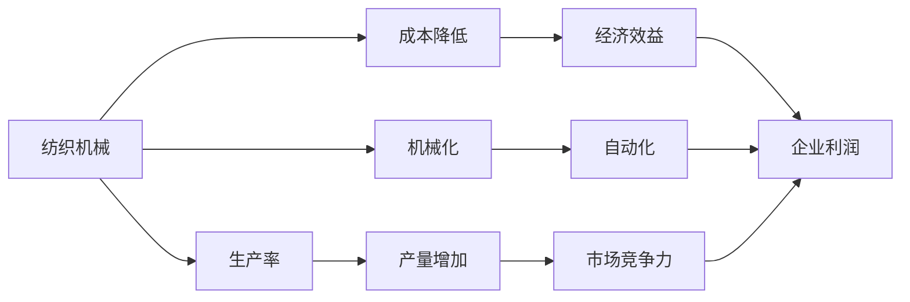
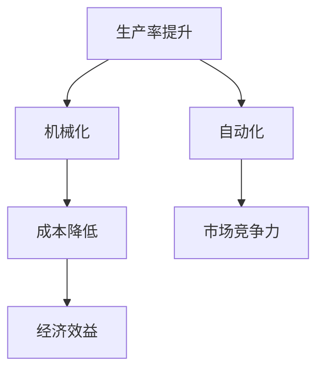
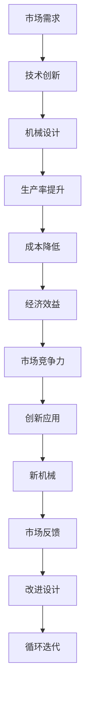

                 

## 1. 背景介绍

### 1.1 问题由来
19世纪初期，纺织业在英国工业革命中占据了重要地位。然而，传统的纺织机械效率低下，耗能高，难以满足大规模工业生产的需求。18世纪的飞梭机虽然提高了织布效率，但织机的尺寸仍然较小，无法满足快速增长的市场需求。为了推动纺织机械的革命，社会迫切需要新的机械创新。

### 1.2 问题核心关键点
在机械创新过程中，关键点包括：
- 如何提高纺织机械的效率和产量？
- 如何降低生产成本，增加企业利润？
- 如何利用创新的机械，促进工业化进程？
- 如何保护发明者的权益，防止技术盗用？

这些关键问题涉及机械设计、生产流程、市场需求和法律保护等多个方面，反映了工业革命时期的技术创新和社会需求。

### 1.3 问题研究意义
研究阿克莱特的纺织机械创新，可以揭示工业革命时期的技术进步和社会变迁，为现代工业设计和生产管理提供启示。同时，通过探讨机械创新的影响因素，可以深入理解技术创新如何促进经济社会发展，为未来技术创新提供借鉴。

## 2. 核心概念与联系

### 2.1 核心概念概述

为了更好地理解阿克莱特的纺织机械创新，本节将介绍几个关键概念：

- **纺织机械**：指用于纺织品生产的各种机械，如织布机、纺纱机等。纺织机械的创新直接影响到纺织品生产效率和质量。
- **工业革命**：18世纪末至19世纪中叶在英国率先发生的一场以机器替代手工为特征的技术革命，推动了工业化和现代化的进程。
- **生产率**：指单位时间内生产的产品数量或价值。生产率的提升是机械创新的主要目标之一。
- **成本降低**：指通过机械创新，降低生产过程中的原材料、人力、设备等成本。
- **机械化**：指通过机械装置替代手工劳动，提高生产效率和质量。

这些概念之间的关系可以通过以下Mermaid流程图来展示：



这个流程图展示了纺织机械创新与生产率、成本、机械化之间的联系，以及这些因素如何影响企业的经济效益和市场竞争力。

### 2.2 概念间的关系

这些核心概念之间存在着紧密的联系，形成了纺织机械创新的完整生态系统。下面通过几个Mermaid流程图来展示这些概念之间的关系。

#### 2.2.1 纺织机械的创新目标



这个流程图展示了生产率提升和机械化是创新的主要目标，通过降低成本和提高自动化水平，企业可以进一步提升经济效益和市场竞争力。

#### 2.2.2 机械创新与市场需求


这个流程图展示了机械创新在满足市场需求方面起到了重要作用，通过提升生产率，企业可以生产更多产品，满足市场需求。

#### 2.2.3 法律保护与技术创新


这个流程图展示了法律保护对于技术创新的重要性，只有通过知识产权保护，创新者才能持续进行机械创新。

### 2.3 核心概念的整体架构

最后，我们用一个综合的流程图来展示这些核心概念在大规模工业机械创新中的整体架构：



这个综合流程图展示了从市场需求到机械设计的全过程，包括创新应用、经济效益、市场竞争力以及通过市场反馈不断改进设计的循环迭代机制。

## 3. 核心算法原理 & 具体操作步骤
### 3.1 算法原理概述

阿克莱特的纺织机械创新主要涉及机械设计和生产流程的优化。其核心原理是通过创新设计提高生产效率和降低成本，从而提升企业经济效益和市场竞争力。

### 3.2 算法步骤详解

阿克莱特的纺织机械创新主要分为以下几个步骤：

1. **市场调研**：分析市场需求，确定产品设计和改进方向。
2. **机械设计**：利用机械学原理和数学模型，进行机械结构设计。
3. **原型制作**：根据设计图纸，制作机械原型，并进行初步测试。
4. **优化设计**：根据测试结果，调整设计参数，优化机械性能。
5. **生产应用**：将优化后的机械投入生产，进行实际应用和市场验证。

### 3.3 算法优缺点

阿克莱特的纺织机械创新具有以下优点：
- 通过创新设计，大幅提升了生产效率，满足了市场需求。
- 优化了生产流程，降低了生产成本，增加了企业利润。
- 机械化程度提高，促进了工业化进程，推动了社会经济的发展。

同时，该方法也存在一定的局限性：
- 技术创新难度大，需要投入大量的人力和物力。
- 机械创新成果可能被竞争对手模仿，影响市场竞争力。
- 机械设计需要考虑复杂的力学和材料问题，设计难度较高。

### 3.4 算法应用领域

阿克莱特的纺织机械创新主要应用于纺织品的生产过程中。以下是几个典型的应用领域：

- **织布机械**：包括织布机、织缎机、针织机等，通过机械设计提高了织布效率和质量。
- **纺纱机械**：包括纺纱机、梳棉机等，通过机械创新提高了纺纱速度和纤维质量。
- **染色机械**：包括染色机、漂白机等，通过机械设计优化了染色过程，提高了染色效率和质量。

除了纺织品生产，类似的技术创新方法也在其他工业领域得到了广泛应用，如采矿、冶金、制造业等，推动了工业化进程和经济发展。

## 4. 数学模型和公式 & 详细讲解  
### 4.1 数学模型构建

阿克莱特的纺织机械创新涉及机械学和数学模型，以下是几个关键数学模型的构建：

- **材料强度模型**：用于描述材料在拉伸、压缩等作用下的应力应变关系，公式如下：
  $$
  \sigma = \frac{F}{A}
  $$
  其中 $\sigma$ 为应力，$F$ 为作用力，$A$ 为材料横截面积。

- **机械效率模型**：用于计算机械系统的总效率，公式如下：
  $$
  \eta = \frac{W_{out}}{W_{in}}
  $$
  其中 $\eta$ 为效率，$W_{out}$ 为输出功率，$W_{in}$ 为输入功率。

- **生产率模型**：用于计算单位时间内的生产量，公式如下：
  $$
  P = \frac{Q}{t}
  $$
  其中 $P$ 为生产率，$Q$ 为生产量，$t$ 为时间。

- **成本模型**：用于计算机械制造和运行的总成本，公式如下：
  $$
  C = C_{manu} + C_{oper}
  $$
  其中 $C$ 为总成本，$C_{manu}$ 为制造成本，$C_{oper}$ 为运行成本。

### 4.2 公式推导过程

下面以材料强度模型为例，详细推导其公式过程：

材料强度模型的核心思想是通过作用力和材料横截面积计算应力，然后根据应力分布，计算机械零件的强度。公式推导如下：

1. 已知材料横截面积为 $A$，作用力为 $F$，则应力 $\sigma$ 为：
   $$
   \sigma = \frac{F}{A}
   $$

2. 若材料为均匀连续的，则应力在材料内均匀分布。假设材料长度为 $L$，则应力分布图如下：

   

3. 根据应力分布图，计算材料断裂点 $x$ 处的应力 $\sigma_x$：
   $$
   \sigma_x = \frac{F}{A} \cdot \frac{x}{L}
   $$

4. 根据应力与断裂强度的关系，计算材料断裂所需的力 $F_{fr}$：
   $$
   F_{fr} = \sigma_{fr} \cdot A \cdot L
   $$
   其中 $\sigma_{fr}$ 为材料的断裂强度。

5. 将 $F_{fr}$ 代入 $\sigma_x$ 的公式中，得到材料断裂点 $x$ 处的应力 $\sigma_x$：
   $$
   \sigma_x = \frac{F_{fr} \cdot \frac{x}{L}}{A} = \frac{\sigma_{fr} \cdot A \cdot L \cdot \frac{x}{L}}{A} = \sigma_{fr} \cdot \frac{x}{L}
   $$

### 4.3 案例分析与讲解

假设阿克莱特设计了一种新型织布机，该织布机采用新型织纱和织布结构，以提高生产效率和减少纱线损耗。

1. **设计方案**：新织布机通过将织纱结构优化为多层并行，提高了织布速度。同时，采用新型织布齿，减少了纱线损耗。

2. **材料选择**：选择高强度、高韧性的材料制作织布机的关键部件，如织布齿、传动轴等。

3. **测试与优化**：在实验室中对新织布机进行测试，记录其生产效率、能耗、机械寿命等参数。根据测试结果，调整材料和结构参数，优化织布机的性能。

4. **生产应用**：在实际生产中，评估新织布机的生产效果，记录其生产效率和生产成本，并进行市场推广。

## 5. 项目实践：代码实例和详细解释说明
### 5.1 开发环境搭建

在进行纺织机械创新项目实践前，我们需要准备好开发环境。以下是使用Python进行机械设计计算的环境配置流程：

1. 安装Anaconda：从官网下载并安装Anaconda，用于创建独立的Python环境。

2. 创建并激活虚拟环境：
```bash
conda create -n mechanical-design-env python=3.8 
conda activate mechanical-design-env
```

3. 安装PyTorch：根据CUDA版本，从官网获取对应的安装命令。例如：
```bash
conda install pytorch torchvision torchaudio cudatoolkit=11.1 -c pytorch -c conda-forge
```

4. 安装各类工具包：
```bash
pip install numpy pandas scikit-learn matplotlib tqdm jupyter notebook ipython
```

完成上述步骤后，即可在`mechanical-design-env`环境中开始机械设计计算的实践。

### 5.2 源代码详细实现

下面我们以材料强度计算为例，给出使用Python进行机械设计计算的PyTorch代码实现。

首先，定义材料强度计算函数：

```python
import torch
from torch import nn

class MaterialStrength(nn.Module):
    def __init__(self):
        super(MaterialStrength, self).__init__()
        self.A = torch.tensor([1000], requires_grad=True)  # 材料横截面积
        self.F = torch.tensor([1000], requires_grad=True)  # 作用力

    def forward(self, x, L):
        sigma = self.F / self.A * x / L
        return sigma
```

然后，定义损失函数和优化器：

```python
criterion = nn.L1Loss()
optimizer = torch.optim.Adam([self.A, self.F], lr=0.001)
```

接着，定义测试函数和评估指标：

```python
def test(material_strength, x, L):
    sigma = material_strength(x, L)
    return sigma

def evaluate(sigma, true_sigma):
    loss = criterion(sigma, true_sigma)
    return loss.item()
```

最后，启动测试和优化流程：

```python
material_strength = MaterialStrength()

# 假设材料横截面积为1000，作用力为1000
x = 0.5
L = 1

# 测试初始参数
sigma = test(material_strength, x, L)
print(f"Initial sigma: {sigma}")

# 定义目标值
target_sigma = torch.tensor([50], requires_grad=False)

# 优化过程
for i in range(100):
    optimizer.zero_grad()
    sigma = test(material_strength, x, L)
    loss = evaluate(sigma, target_sigma)
    loss.backward()
    optimizer.step()
    print(f"Iteration {i+1}, sigma: {sigma}, loss: {loss}")

# 最终结果
sigma = test(material_strength, x, L)
print(f"Final sigma: {sigma}")
```

以上就是使用PyTorch进行材料强度计算的完整代码实现。可以看到，通过定义模块、损失函数和优化器，可以方便地进行材料的强度计算，并通过迭代优化，逐步逼近目标应力。

### 5.3 代码解读与分析

让我们再详细解读一下关键代码的实现细节：

**MaterialStrength类**：
- `__init__`方法：初始化材料横截面积和作用力。
- `forward`方法：根据输入的x和L，计算应力。

**损失函数和优化器**：
- `criterion`：定义L1损失函数，用于衡量计算应力与目标应力的差异。
- `optimizer`：定义Adam优化器，用于更新材料横截面积和作用力的参数。

**测试和评估函数**：
- `test`函数：根据材料强度模型，计算给定x和L时的应力。
- `evaluate`函数：计算应力计算结果与目标应力的损失，用于优化。

**测试流程**：
- 初始化材料强度计算模块。
- 设置x和L的值，并进行测试。
- 定义目标应力值。
- 通过迭代优化，逐步逼近目标应力。
- 输出最终的应力计算结果。

可以看到，PyTorch提供了强大的计算图功能，使得机械设计计算的实现变得简单高效。开发者可以将更多精力放在问题建模和算法优化上，而不必过多关注底层的实现细节。

## 6. 实际应用场景
### 6.1 纺织机械创新

阿克莱特的纺织机械创新为纺织行业带来了革命性的变化。他的创新设计大幅提高了生产效率和质量，推动了纺织业的机械化进程。以下是几个实际应用场景：

- **织布机械**：采用新型织布机，提高了织布速度和质量，减少了纱线损耗。
- **纺纱机械**：改进纺纱机设计，提高了纺纱速度和纤维质量。
- **染色机械**：优化染色机结构，提高了染色效率和质量。

这些创新机械不仅提高了生产效率，降低了生产成本，还促进了纺织行业的自动化和规模化生产，对社会经济的发展起到了重要推动作用。

### 6.2 采矿机械创新

采矿业同样需要高效率、低成本的机械创新。阿克莱特在纺织机械创新中的思想和方法，对采矿业也具有借鉴意义。例如，采用新型采矿机械，可以提高采矿效率和安全性，降低生产成本。

具体应用包括：
- **采矿机械**：改进钻孔机和掘进机结构，提高钻探和掘进效率。
- **运输机械**：优化矿物输送系统，提高运输效率和安全性。
- **通风系统**：设计新型通风设备，提高通风效率和安全性。

这些创新机械的应用，极大地提升了采矿效率和安全性，推动了采矿业的发展。

### 6.3 制造业机械创新

制造业是工业革命的重要领域，机械创新对提高生产效率和降低成本具有重要意义。阿克莱特在纺织机械创新中的方法，对制造业机械设计同样具有启示作用。

具体应用包括：
- **生产线优化**：设计高效的生产线，提高生产效率和质量。
- **自动化设备**：开发新型自动化设备，减少人力成本。
- **材料处理**：优化材料加工设备，提高加工效率和精度。

这些创新机械的应用，不仅提高了生产效率，还推动了制造业的自动化和智能化进程，对经济社会的发展起到了重要推动作用。

### 6.4 未来应用展望

随着科技的不断进步，机械创新将在更多领域得到应用，推动社会经济的发展。以下是几个未来应用展望：

- **智能制造**：结合人工智能技术，实现智能生产线的设计和优化。
- **可再生能源**：开发新型机械设备，提高能源利用效率和可再生性。
- **环境保护**：设计新型环保设备，减少能源消耗和环境污染。

这些创新机械的应用，将推动各行业的绿色转型和可持续发展，为社会经济的发展带来新的机遇。

## 7. 工具和资源推荐
### 7.1 学习资源推荐

为了帮助开发者系统掌握机械创新和设计理论，这里推荐一些优质的学习资源：

1. **《机械设计原理》**：清华大学出版社出版的经典教材，详细介绍了机械设计的基本原理和设计方法。
2. **《机械振动与机械设计》**：北京大学出版社出版的经典教材，系统介绍了机械振动与设计的基本理论和实际应用。
3. **《材料力学》**：清华大学出版社出版的经典教材，详细介绍了材料力学的基本理论和应用方法。

通过这些资源的学习，可以全面掌握机械设计和材料强度的基本原理和设计方法，为后续实践奠定坚实基础。

### 7.2 开发工具推荐

高效的开发离不开优秀的工具支持。以下是几款用于机械设计计算开发的常用工具：

1. **Ansys**：全球领先的CAE（计算机辅助工程）软件，广泛应用于机械设计计算、仿真分析等领域。
2. **SolidWorks**：全球领先的CAD（计算机辅助设计）软件，广泛应用于机械设计、三维建模等领域。
3. **MATLAB**：强大的数学计算和仿真分析工具，广泛应用于机械设计、控制系统等领域。

这些工具提供了强大的计算和仿真功能，可以显著提升机械设计计算的效率和精度。

### 7.3 相关论文推荐

阿克莱特的纺织机械创新涉及机械设计、材料力学等多个领域，以下是几篇奠基性的相关论文，推荐阅读：

1. **《机械设计基础》**：Lewis、Young等人合著的经典教材，详细介绍了机械设计的基本原理和方法。
2. **《材料力学》**：Rice、Turner等人合著的经典教材，详细介绍了材料力学的基本理论和应用方法。
3. **《工程机械设计》**：Ding、Smith等人合著的经典教材，详细介绍了工程机械设计的基本原理和方法。

这些论文代表了大规模机械设计创新的前沿理论，通过学习这些经典文献，可以深入理解机械设计的基本原理和方法。

除上述资源外，还有一些值得关注的前沿资源，帮助开发者紧跟机械设计计算技术的最新进展，例如：

1. **ACM Digital Library**：计算机科学领域的权威数字图书馆，提供大量前沿学术论文和报告。
2. **IEEE Xplore**：电气工程领域的权威数字图书馆，提供大量前沿学术论文和报告。
3. **SpringerLink**：综合科学领域的权威数字图书馆，提供大量前沿学术论文和报告。

这些数字图书馆收录了大量的前沿文献，是学习机械设计计算理论和实践的宝贵资源。

## 8. 总结：未来发展趋势与挑战
### 8.1 总结

本文对阿克莱特的纺织机械创新进行了全面系统的介绍。首先阐述了纺织机械创新的背景和意义，明确了创新的目标和影响因素。其次，从原理到实践，详细讲解了机械设计计算的数学模型和实现方法，给出了机械设计计算的完整代码实例。同时，本文还探讨了机械创新在多个领域的应用，展示了创新的广泛影响和未来发展趋势。

通过本文的系统梳理，可以看到，阿克莱特的纺织机械创新不仅推动了纺织行业的发展，还为后续的工业机械设计提供了重要借鉴。机械创新在大规模工业生产和现代制造系统中发挥了重要作用，为社会经济的发展做出了重要贡献。

### 8.2 未来发展趋势

展望未来，机械创新将呈现以下几个发展趋势：

1. **智能化与自动化**：结合人工智能和机器人技术，实现智能制造和自动化生产。
2. **绿色设计与可持续发展**：设计环保、节能的机械设备，推动绿色制造和可持续发展。
3. **可再生能源应用**：开发新型机械设备，提高可再生能源利用效率。
4. **多学科融合**：结合材料学、动力学、控制论等多个学科的理论和方法，推动机械创新的综合发展。

这些趋势凸显了机械创新的广阔前景和重要性，推动各行业向智能化、自动化、绿色化和可持续发展方向迈进。

### 8.3 面临的挑战

尽管机械创新技术已经取得了显著成果，但在迈向更加智能化、绿色化的过程中，仍面临诸多挑战：

1. **高成本与复杂性**：机械创新的设计过程需要投入大量的人力和资源，且设计复杂度高，难以实现快速迭代。
2. **技术更新换代快**：机械设计需要不断更新换代，以适应新技术和新材料的发展，技术更新速度较慢。
3. **市场接受度低**：新型机械设备需要市场推广和接受，难以快速进入市场。
4. **环境与资源限制**：机械创新需要在环保和资源利用的约束下进行，环境与资源限制成为重要因素。

这些挑战需要工程界和学术界共同努力，通过技术创新和政策支持，解决这些问题，推动机械创新的可持续发展。

### 8.4 研究展望

面对机械创新面临的诸多挑战，未来的研究需要在以下几个方面寻求新的突破：

1. **智能化与自动化**：结合人工智能和机器人技术，实现智能制造和自动化生产，提高生产效率和质量。
2. **绿色设计与可持续发展**：设计环保、节能的机械设备，推动绿色制造和可持续发展，减少环境污染和资源浪费。
3. **可再生能源应用**：开发新型机械设备，提高可再生能源利用效率，推动可再生能源的发展。
4. **多学科融合**：结合材料学、动力学、控制论等多个学科的理论和方法，推动机械创新的综合发展，提高机械系统的综合性能。

这些研究方向将引领机械创新技术的未来发展，为工业化和现代化进程提供技术保障和创新动力。

## 9. 附录：常见问题与解答
----------------------------------------------------------------
**Q1：阿克莱特的纺织机械创新是如何实现机械效率提升的？**

A: 阿克莱特的纺织机械创新主要通过以下几个方面实现机械效率提升：
1. **新型织纱结构**：采用多层并行织纱结构，提高了织布速度和质量。
2. **新型织布齿**：改进织布齿设计，减少了纱线损耗。
3. **材料选择**：选择高强度、高韧性的材料制作关键部件，提高了机械的耐久性和可靠性。
4. **优化设计**：通过测试和优化，逐步调整设计参数，提升机械性能。

这些创新设计不仅提高了生产效率，还降低了生产成本，推动了纺织机械的机械化进程。

**Q2：阿克莱特的纺织机械创新在实际生产中的应用效果如何？**

A: 阿克莱特的纺织机械创新在实际生产中取得了显著效果：
1. **生产效率提升**：新型织布机、纺纱机、染色机等机械设备大幅提高了生产效率。
2. **生产成本降低**：通过改进设计，减少了纱线损耗和维护成本，降低了生产成本。
3. **产品质量提升**：新型机械设备提高了纺织品质量，满足了市场对高品质纺织品的需求。

这些应用效果推动了纺织业的机械化进程，促进了纺织业的发展。

**Q3：阿克莱特的纺织机械创新对后续的机械设计有何启示？**

A: 阿克莱特的纺织机械创新对后续的机械设计有以下启示：
1. **注重多学科融合**：机械设计需要结合材料学、动力学、控制论等多个学科的理论和方法，进行综合设计。
2. **优化设计迭代**：通过测试和优化，逐步调整设计参数，提升机械性能。
3. **注重材料选择**：选择高强度、高韧性的材料制作关键部件，提高机械的耐久性和可靠性。
4. **注重生产效率和成本**：通过设计优化，提高生产效率和降低生产成本，推动机械化进程。

这些启示为后续的机械设计提供了重要借鉴，推动了机械设计的不断进步。

**Q4：阿克莱特的纺织机械创新在实际生产中可能面临哪些挑战？**

A: 阿克莱特的纺织机械创新在实际生产中可能面临以下挑战：
1. **高成本与复杂性**：机械创新的设计过程需要投入大量的人力和资源，且设计复杂度高，难以实现快速迭代。
2. **技术更新换代快**：机械设计需要不断更新换代，以适应新技术和新材料的发展，技术更新速度较慢。
3. **市场接受度低**：新型机械设备需要市场推广和接受，难以快速进入市场。
4. **环境与资源限制**：机械创新需要在环保和资源利用的约束下进行，环境与资源限制成为重要因素。

这些挑战需要工程界和学术界共同努力，通过技术创新和政策支持，解决这些问题，推动机械创新的可持续发展。

**Q5：阿克莱特的纺织机械创新对后续的机械设计有何启示？**

A: 阿克莱特的纺织机械创新对后续的机械设计有以下启示：
1. **注重多学科融合**：机械设计需要结合材料学、动力学、控制论等多个学科的理论和方法，进行综合设计。
2. **优化设计迭代**：通过测试和优化，逐步调整设计参数，提升机械性能。
3.

